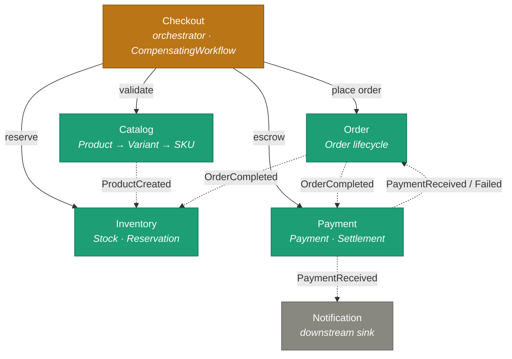

# Marketplace — Bounded-Context Map

Six bounded contexts, each a service with its own aggregate(s) and database. **Checkout** is the only
multi-context **orchestrator**; the other contexts also collaborate by **choreography** (domain
events).

Solid arrow = **synchronous call** (orchestration). Dashed arrow = **domain event** (choreography).

## Contexts

| Context | Aggregate(s) | Responsibility | Publishes |
|---|---|---|---|
| **Catalog** | `Product` (→Variant→SKU) | Product master data + moderation | `ProductCreated` |
| **Order** | `Order` | Order lifecycle + auto-cancel timeout (FR13) | `OrderCompleted`, `OrderCancelled`, `OrderPendingTimedOut` |
| **Payment** | `Payment`, `Settlement` | Capture + merchant payout/settlement | `PaymentReceived`, `PaymentFailed`, `PayoutCompleted` |
| **Inventory** | `Stock`, `Reservation` | Stock + reservations | reservation events (`reserved` / `allReserved`) |
| **Notification** | `Notification` | Sends notifications — *consume-only sink* | — |
| **Checkout** | `CheckoutSaga` | Coordinates reserve→order→escrow | (coordinates, not a business source) |

## Orchestration vs choreography

- **Orchestration (central coordinator):** **Checkout** runs a synchronous `CompensatingWorkflow`
  over four outbound ports — `CatalogPort`, `InventoryPort`, `OrderPort`, `PaymentPort` (HTTP client
  adapters `*ClientOa`). Flow: validate → reserve → place order → escrow; on a step failure the
  completed steps' compensations run in reverse and the original exception is rethrown.
- **Choreography (no coordinator):** Order ↔ Payment ↔ Inventory react to each other's domain events.
  The Order auto-cancel (`OrderPendingTimedOut`, FR13) is an event-driven timeout owned by Order, not
  driven by Checkout.

Checkout is the single point that reaches across four contexts — the natural place to watch when
reasoning about coupling, coordination, and (later) trust boundaries.

> Confidence: aggregates + published events come from the domain code; consume edges are inferred
> from handler names (`onOrderCompleted`, `onPaymentReceived`, `onProductCreated`); a couple of
> Inventory reservation event names are inferred from references.
