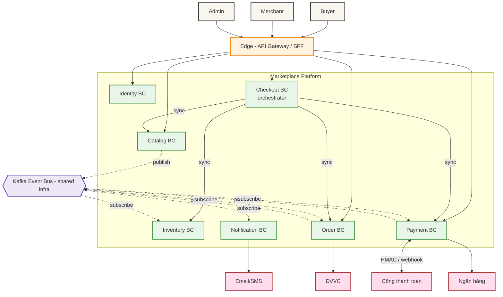
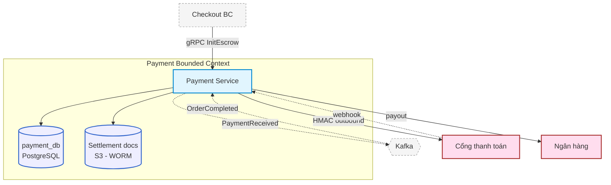
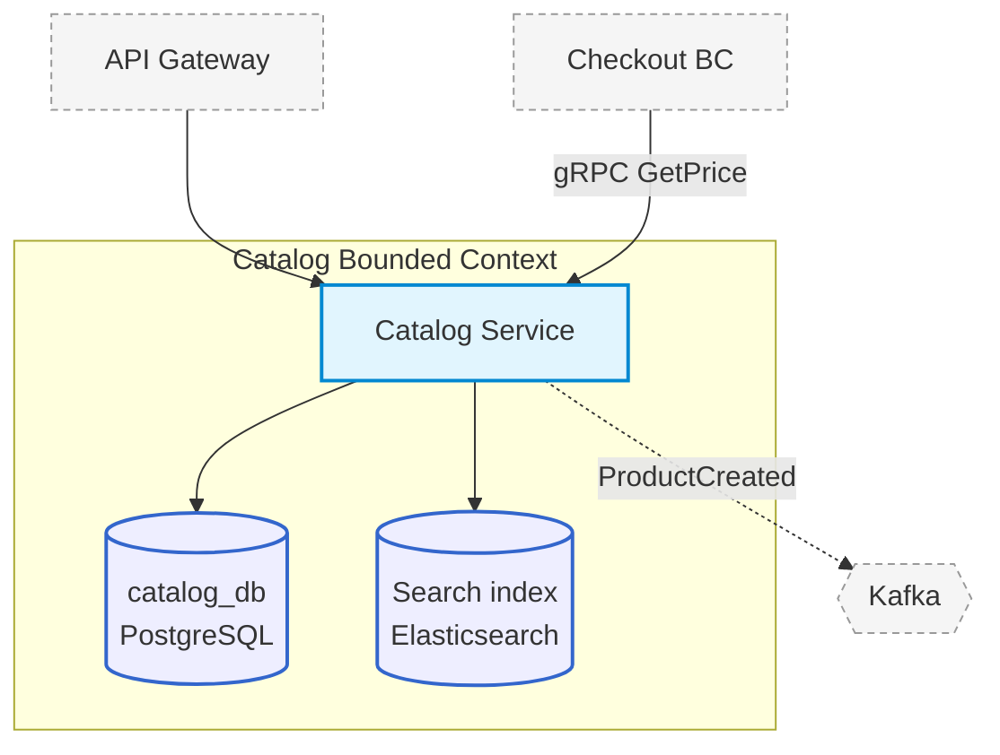

# ĐỀ XUẤT — Tái cấu trúc View Kiến trúc theo hướng "Hệ thống lớn"
### Áp cho `SDD-MKTPLACE-CORE` (mục 2.2, 2.3.2)

> **Trạng thái:** Đề xuất (chưa sửa file SDD chính). Mục tiêu: thay 1 Container diagram "tất-cả-trong-một" bằng mô hình zoom 3 tầng + DDD Context Map + model-as-code, để hệ chịu được khi lên 10+ bounded context / nhiều P&L mà sơ đồ không rối.

---

## 0. Vấn đề & nguyên tắc

| Hiện trạng (v1.1) | Vấn đề khi hệ lớn | Nguyên tắc đề xuất |
| --- | --- | --- |
| 2.2 = 1 Container diagram chứa mọi service | Thêm context/service → sơ đồ phình, rối, mất "câu chuyện" | Mỗi sơ đồ **một scope, một mức trừu tượng** |
| Database chỉ xuất hiện ở 2.3.2 & mục 6, không có trong danh mục container 2.2 | Lệch grain, không truy vết được hộp nào là gì | Datastore **là container**, chỉ hiện trong Container diagram của context **sở hữu** nó |
| Sơ đồ vẽ tay, lặp thông tin giữa 2.2 / 2.3.2 / mục 6 | Sửa chỗ này quên chỗ kia | **Một model, nhiều view** (model-as-code) |

Cấu trúc zoom 3 tầng (ẩn dụ Google Maps):

```
Tầng 0  System Landscape      → mỗi Bounded Context là 1 HỘP (không phơi service/DB)
Tầng 0b DDD Context Map        → NGỮ NGHĨA quan hệ giữa các context (U/D, ACL, OHS, PL...)
Tầng 1  Container-per-context  → bung 1 context thành service(s) + datastore(s)  ← nơi polyglot sống
(Tầng 2 Component, chỉ khi 1 context đủ phức tạp — thường để Tech Spec)
```

---

## 1. Tầng 0 — System Landscape (mỗi Bounded Context = 1 hộp)

> Thay cho phần "toàn cảnh" của 2.2. Chỉ topology giữa các context + actor + hệ ngoài + hạ tầng chia sẻ. **Không** service nội bộ, **không** database, **không** tên framework.



**Đọc được gì:** ai nối ai, đồng bộ vs sự kiện, đâu là biên ngoài. **Không đổi** khi nội bộ một context thay service/DB — đây là tầng "chống thay đổi chi tiết".

---

## 2. Tầng 0b — DDD Context Map (ngữ nghĩa quan hệ)

> Landscape cho *topology*; Context Map cho *kiểu quan hệ tích hợp*. Đây mới là tầng trả lời "ranh giới tin cậy & quan hệ kiểu gì" (nối với boundary-5 / đa P&L). Viết bằng bảng cho chính xác — mũi tên U/D của DDD vốn dễ gây nhầm.

| Upstream (U) | Downstream (D) | Kiểu quan hệ (pattern) | Cơ chế | Ghi chú |
| --- | --- | --- | --- | --- |
| Identity | mọi context | **Open Host Service** (JWT/claims là Published Language) | OIDC/JWT | Mọi context *conform* theo claim chuẩn |
| Catalog | Checkout | **Customer–Supplier** | gRPC GetPrice | Checkout (D) phụ thuộc giá từ Catalog (U) |
| Inventory | Checkout | **Customer–Supplier** | gRPC ReserveStock | |
| Order | Checkout | **Customer–Supplier** | gRPC CreatePendingOrder | |
| Payment | Checkout | **Customer–Supplier** | gRPC InitEscrow | |
| Catalog | Inventory | **Published Language** | event `ProductCreated` | Inventory consume, dedupe |
| Payment | Order, Notification | **Published Language** | event `PaymentReceived` | |
| Order | Inventory, Payment | **Published Language** | event `OrderCompleted` | |
| Cổng TT / Ngân hàng (external) | Payment | **Anti-Corruption Layer** | HMAC + webhook verify | Payment bọc ACL, không để mô hình vendor rò vào |

> **Quy tắc cho hệ đa P&L:** mỗi quan hệ *xuyên P&L* phải khai báo một dòng ở đây với pattern + cơ chế **identity federation** (SPIFFE federation), **không** mặc định Customer–Supplier "tin nhau vì cùng tập đoàn". Đây chính là ranh giới thứ 5 (inter-system, intra-org, cross trust-domain) đã bàn.

---

## 3. Tầng 1 — Container diagram per context

> Mỗi context một sơ đồ riêng: bung thành service(s) + datastore(s) + láng giềng gần nhất. **Database nằm trong hộp context sở hữu nó** → grain nhất quán, polyglot không làm rối landscape. Dưới đây 2 ví dụ "giàu" nhất; các context còn lại theo cùng khuôn.

### 3.1 Payment BC (giàu nhất: 2 datastore + external + event)



### 3.2 Catalog BC (polyglot: PostgreSQL + Elasticsearch)



> **Đây là nơi polyglot/multi-service "sống".** Nếu mai sau Payment tách thành `escrow-svc` + `settlement-svc` + thêm một read-store, chỉ **sơ đồ 3.1 đổi**; Landscape (tầng 0) và Context Map (0b) **không đổi**. Đó là toàn bộ giá trị của việc tách tầng.

### 3.3 Khuôn cho các context còn lại

| Context | Service(s) | Datastore(s) | Vẽ riêng khi |
| --- | --- | --- | --- |
| Identity | Identity Service | identity_db | Luôn (chứa PII/authn) |
| Inventory | Inventory Service | inventory_db | Khi thêm read-model/cache riêng |
| Checkout | Checkout Service | Redis (phiên) | Luôn (orchestrator, saga) |
| Order | Order Service | order_db | Luôn (state machine) |
| Notification | Notification Service | (stateless) | Gộp được nếu vẫn 1 service |

---

## 4. Bảng truy vết (traceability) — gắn các tầng với nhau

> Giải quyết dứt điểm "không biết hộp nào ánh xạ vào đâu". Mỗi hộp ở Landscape phải có đúng một Container diagram; mỗi container phải map được lên deployment node.

| Landscape box (tầng 0) | Container diagram (tầng 1) | Deployment (2.3.2) |
| --- | --- | --- |
| Payment BC | §3.1 | App pods (restricted egress subnet) + payment_db + S3 WORM |
| Catalog BC | §3.2 | App pods + catalog_db + ES cluster |
| Checkout BC | §3.3 | App pods + Redis |
| … | … | … |

**Deployment (2.3.2) sửa theo:** hoặc (a) một deployment diagram nhưng mỗi node chú thích rõ "chứa container X từ §3.y"; hoặc (b) ở hệ rất lớn, deployment cũng scope theo cụm context. Nguyên tắc: **mỗi hộp deployment là một node hạ tầng HOẶC một instance của container đã định nghĩa ở tầng 1** — không có hộp "lửng".

---

## 5. Model-as-code — một model, nhiều view (khuyến nghị mạnh khi ≥10 context)

> Gốc rễ để 3 tầng trên không bị lệch nhau: đừng vẽ tay 3 lần. Khai báo **một model**, sinh **nhiều view**. Công cụ tham chiếu: Structurizr DSL (do tác giả C4 viết). Mỗi BC khai báo là một `softwareSystem` → landscape tự coi nó là 1 hộp, mỗi BC tự có container view.

```text
// SKELETON minh hoạ (không phải DSL chạy được nguyên trạng)
workspace {
  model {
    buyer = person "Buyer"

    catalog = softwareSystem "Catalog BC" {
      svc = container "Catalog Service"
      db  = container "catalog_db" "" "Database"
      es  = container "Search Index" "" "Database"
      svc -> db "reads/writes"; svc -> es "indexes"
    }
    payment = softwareSystem "Payment BC" {
      svc  = container "Payment Service"
      db   = container "payment_db" "" "Database"
      worm = container "Settlement Docs" "S3 WORM" "Database"
      svc -> db; svc -> worm
    }
    // ... Identity, Inventory, Checkout, Order, Notification

    pg = softwareSystem "Cổng thanh toán" "External"
    payment.svc -> pg "settle (HMAC)"
    catalog -> inventory "ProductCreated (event)"
  }
  views {
    systemLandscape "L0"    { include * autoLayout }   // → §1
    container payment "P1"  { include * autoLayout }   // → §3.1
    container catalog "C1"  { include * autoLayout }   // → §3.2
    // thêm view cho từng BC...
  }
}
```

Lợi ích: thêm 1 context = sửa model 1 lần, mọi view tự nhất quán; còn phát hiện *architectural drift* (sơ đồ lệch code) và sinh tự động.

---

## 6. Ngưỡng áp dụng & khuyến nghị cho file hiện tại

| Quy mô | Khuyến nghị |
| --- | --- |
| ≤ ~6–7 context, 1 service/context (như marketplace v1.1 hiện tại) | 1 Container diagram còn đọc được — **chưa bắt buộc** tách. Nhưng nên thêm ngay **Landscape (§1)** + **Context Map (§2)** vì rẻ và là tầng ổn định nhất. |
| 8–15 context, polyglot, đa P&L | **Chuyển hẳn** sang mô hình này: Landscape + Context Map + Container-per-context + model-as-code. |
| > 15 context | Bắt buộc model-as-code; cân nhắc nhóm context theo "domain"/P&L thành các Landscape con. |

**Đề xuất cụ thể cho `SDD-MKTPLACE-CORE`:**
1. Tách mục 2.2 hiện tại thành **2.2.1 System Landscape** (§1) + **2.2.2 Context Map** (§2) + **2.2.3 Container-per-context** (§3) — Container "all-in-one" cũ giữ lại như phụ lục/transitional nếu muốn.
2. Đưa datastore vào danh mục container của từng context (§3), gỡ khỏi việc "chỉ xuất hiện ở 2.3.2".
3. Sửa 2.3.2 theo bảng truy vết §4 (mỗi hộp map rõ về §3).
4. Nếu hệ dự kiến chạm 10+ context: dựng Structurizr workspace (§5) làm nguồn duy nhất, các .md chỉ nhúng ảnh sinh ra.
