# SYSTEM DESIGN DOCUMENT — E-commerce Marketplace

| Thông tin tài liệu | Giá trị |
| --- | --- |
| Mã tài liệu | `SDD-MKTPLACE-CORE-v2.2` |
| Phiên bản | `2.2.0` |
| Trạng thái | ☑ Approved |
| Ngày tạo | 06/06/2026 |
| Cập nhật lần cuối | 19/06/2026 |
| Tác giả | [Họ tên] |
| Người phê duyệt | [Họ tên] |
| Dự án / Hệ thống | E-commerce Marketplace (multi-merchant) |
| Mức độ bảo mật | ☑ Internal |

**Lịch sử thay đổi**

| Phiên bản | Ngày | Tác giả | Mô tả thay đổi | Người duyệt |
| --- | --- | --- | --- | --- |
| 1.0.0 | 06/06/2026 | [Tác giả] | Tạo mới tài liệu | [Duyệt] |
| 1.1.0 | 19/06/2026 | [Tác giả] | Nâng event/async thành hợp đồng hạng nhất: thêm artifact-nhà (AsyncAPI/schema registry) & chính sách tiến hóa schema event (mục 5.1.5); gom các bảo đảm tương tác (sync/async, consistency, idempotency, ordering, delivery) vào một bảng hợp đồng tương tác (mục 5.1.4); nâng idempotency consumer thành invariant (7.5, 9.2); làm rõ ngữ nghĩa cập nhật tồn kho (DFD 4.2.1) | [Duyệt] |
| 2.1.0 | 19/06/2026 | [Tác giả] | Tái cấu trúc view kiến trúc theo hướng hệ thống lớn: thêm tầng **System Landscape** (mỗi BC một hộp) + **DDD Context Map** + **Container-per-context**, datastore nằm trong BC sở hữu (2.2.1–2.2.3); sửa nhãn sơ đồ về _ý định + protocol_, bỏ tên RPC method (giữ tên event là Published Language); phân loại công nghệ **binding vs indicative** + nêu quyết định **polyglot** (2.2.3); thống nhất quy ước đặt tên BC/Service (2.2, 4); thêm bảng truy vết deployment (2.3.2); làm rõ ranh giới 4 (inbound) và thêm **ranh giới 5 — liên hệ thống nội tập đoàn, cross trust-domain** (mục 5) | [Duyệt] |
| 2.2.0 | 19/06/2026 | [Tác giả] | **Chuẩn hóa theo STD-AD-AAC-v1.0 (đóng các gap đối chiếu) + chốt quy tắc tầng cho hệ lớn.** Thêm **ghi chú grain C4** (BC = Landscape ≈ L1; service/DB = **L2**; component = **L3**) + **quy ước legend** (2.2); chốt luật **AD dừng ở L2, L3 → Tech Spec**, ngưỡng tách view + hướng model-as-code (2.2.3); chốt **grain Deployment** (system = grain BC/zone trong AD; container-on-node + sizing → Tech Spec/IaC) và sửa bất đối xứng độ phủ (2.3.2); thêm **bảng correspondence Landscape↔Container↔Deployment** (2.4); thêm mục **11 — ADR Register** (liệt kê quyết định nặng + trạng thái) và **12 — Rủi ro & Nợ kỹ thuật**; bổ sung **cây chất lượng + kịch bản** (8.5); ghi nhận **model-as-code (Structurizr DSL)** là bước kế tiếp (ADR-0014). AI Security dời thành mục 13. | [Duyệt] |

> **Mô hình 3 tài liệu:** SDD này (SAD — tầng kiến trúc) tham chiếu _lên_ Standard (chuẩn org-wide) và _xuống_ các **Tech Spec** (thiết kế chi tiết tầng 3). Đặc tả API đồng bộ → OpenAPI/proto; đặc tả event bất đồng bộ → AsyncAPI + schema registry; schema cột → Tech Spec/migration; giá trị & secret → config/Vault. Bảng tương ứng SAD↔Tech Spec ở Phụ lục A.

# 1. TỔNG QUAN HỆ THỐNG

## 1.1 Mục tiêu hệ thống

| # | Mục tiêu | Mô tả | KPI |
| --- | --- | --- | --- |
| M1 | Vận hành sàn multi-merchant | Buyer mua từ nhiều Merchant trong một phiên; hệ tự tách đơn theo Merchant | Hỗ trợ ≥ 10.000 Merchant; tách đơn chính xác 100% |
| M2 | Thanh toán an toàn qua Escrow | Giữ tiền đến khi đơn hoàn tất, bảo vệ Buyer & Merchant | 0 sự cố mất/lệch tiền; đối soát khớp 100% |
| M3 | Đối soát & chi trả tự động | Tính phí sàn/hoa hồng, payout cho Merchant | Payout đúng hạn ≥ 99%; chứng từ bất biến |
| M4 | Kiểm duyệt & nguồn sự thật sản phẩm | Catalog là source of truth cho hiển thị/tìm kiếm | Thời gian duyệt < 24h; search P95 < 200ms |
| M5 | Chịu tải cao điểm | Flash sale, sự kiện | 3.000 RPS sustained, checkout P99 < 800ms |

## 1.2 Phạm vi hệ thống

### 1.2.1 Trong phạm vi

* Quản lý tài khoản người dùng, xác thực danh tính và phân quyền theo vai trò (Buyer, Merchant, Admin).
* Quản lý danh mục sản phẩm, thương hiệu; kiểm duyệt nội dung trước khi hiển thị và hỗ trợ tìm kiếm toàn văn.
* Theo dõi tồn kho, giữ chỗ hàng hóa khi đặt đơn (reservation) và trừ kho vĩnh viễn khi đơn hoàn tất.
* Điều phối quy trình đặt hàng: tự động tách đơn theo từng nhà bán hàng, tính giá và áp dụng chương trình khuyến mãi.
* Quản lý toàn bộ vòng đời đơn hàng thông qua máy trạng thái (state machine) từ lúc tạo đến khi hoàn thành hoặc huỷ.
* Xử lý giao dịch thanh toán qua cổng bên thứ ba, giữ tiền trung gian cho đến khi giao hàng thành công (escrow), đối soát tự động và chi trả cho nhà bán hàng.

### 1.2.2 Ngoài phạm vi

* **Vận chuyển vật lý** – dùng đơn vị vận chuyển ngoài (Courier) – chỉ tích hợp, không kiểm soát.
* **Kế toán/ERP doanh nghiệp** – nhận dữ liệu đối soát qua file/API, ngoài phạm vi.
* **BI/Analytics, CSKH/ticketing** – hệ riêng.
* **Rating & Dispute** – _chưa_ triển khai ở v1.0 (xem ADR-0012 cho lộ trình bổ sung).

### 1.2.3 Sơ đồ ngữ cảnh (Context Diagram – C4 Level 1)

> Ở L1: chỉ "nối ai, để làm gì" — không protocol/công nghệ.

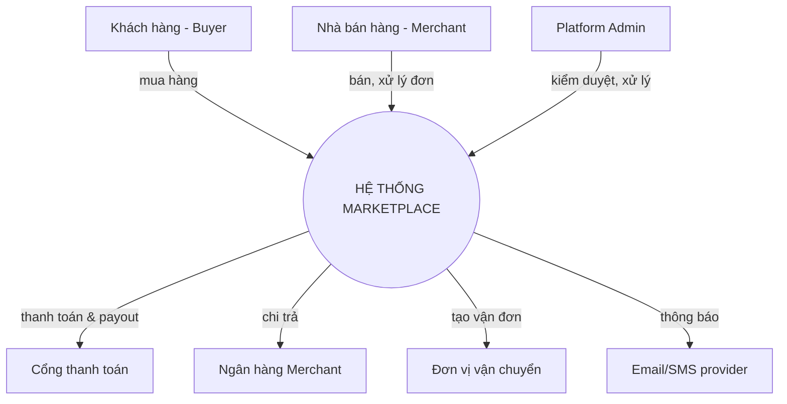

| Hệ thống ngoài | Loại tương tác | Mô tả |
| --- | --- | --- |
| Cổng thanh toán | API + Webhook | Thu tiền Buyer, callback kết quả |
| Ngân hàng Merchant | API | Payout sau đối soát |
| Đơn vị vận chuyển | API | Tạo vận đơn, theo dõi giao hàng |
| Email/SMS provider | API | Thông báo trạng thái đơn |

## 1.3 Các bên liên quan (Stakeholders)

| Bên liên quan | Vai trò | Loại | Kỳ vọng |
| --- | --- | --- | --- |
| Buyer | End User | External | Mua nhanh, tiền an toàn (escrow) |
| Merchant | End User | External | Nhận đơn kịp thời, payout đúng |
| Platform Admin | Operator | Internal | Kiểm duyệt, xử lý tranh chấp |
| Finance team | Interested | Internal | Đối soát khớp, chứng từ bất biến |
| Security team | Interested | Internal | Cô lập tenant, audit đầy đủ |
| SRE/Ops | Interested | Internal | Dễ vận hành, giám sát |

## 1.4 Giả định & Ràng buộc

### 1.4.1 Giả định

* Cổng thanh toán hỗ trợ giữ tiền/escrow hoặc cho phép mô phỏng escrow phía sàn.
* Cao điểm ≤ 3.000 RPS giai đoạn đầu.
* Mỗi Buyer có thể mua từ nhiều Merchant trong một giỏ → bắt buộc tách đơn.

### 1.4.2 Ràng buộc

| Loại | Ràng buộc | Tác động thiết kế |
| --- | --- | --- |
| Kỹ thuật | PostgreSQL chuẩn org; Kafka làm event bus | DB-per-context, ORM, schema design |
| Pháp lý | NĐ 13/2023 (PII); chứng từ tài chính phải lưu bất biến | Object Lock/WORM cho S3 result bucket; data residency |
| Tài chính | Tiền trong escrow là tiền thật của khách | Idempotency + audit bắt buộc cho mọi thao tác tiền |
| Tổ chức | Multi-tenant (nhiều Merchant) | Cô lập dữ liệu theo tenant xuyên suốt authz |

> ⚠️ **Open item (TBD):** Rule phân quyền chi tiết cho S3 result bucket (chứng từ đối soát) — nguyên tắc đã chốt (_prevent overwrite/override_, WORM), nhưng IAM policy cụ thể đang chờ; theo dõi bằng ADR riêng. Xem mục 6.4.3 & 7.3.

# 2. KIẾN TRÚC TỔNG THỂ

## 2.1 Kiểu kiến trúc

| Kiểu | Lý do | Trade-off |
| --- | --- | --- |
| Microservices theo Bounded Context (DDD) + Orchestration (Checkout) + Event-Driven | Mỗi context scale & deploy độc lập; Checkout làm điều phối cho luồng phức tạp; event cho liên kết lỏng lẻo | Phức tạp phân tán: cần saga/compensation, distributed tracing, eventual consistency |

### 2.1.1 Nguyên tắc thiết kế kiến trúc

* **Database per Context** – không chia sẻ DB, không FK xuyên context.
* **API-First** – contract rõ ràng (REST ngoài, gRPC nội bộ giữa context); event cũng là hợp đồng (AsyncAPI + schema registry), không phải "phụ phẩm" của publisher.
* **Orchestration cho luồng tiền** – Checkout điều phối đồng bộ; sai bước → compensation (saga).
* **Idempotency cho mọi thao tác tiền** – escrow, payout, webhook.
* **At-least-once → consumer phải idempotent** – mọi consumer event tự khử trùng lặp (dedupe), vì event bus đảm bảo at-least-once chứ không exactly-once (xem 5.1.4, 9.2).
* **Tenant isolation** – mọi truy vấn gắn `merchant_id`/`owner`; Merchant chỉ thấy dữ liệu của mình.
* **Chứng từ tài chính bất biến** – ghi một lần, không sửa/xóa (WORM).
* **Secrets ở Vault**, không trong tài liệu/code.

## 2.2 Kiến trúc cấp cao (C4 — đa tầng)

> **Quy ước đặt tên (áp dụng toàn tài liệu):** ở tầng cấu trúc (landscape, context map) một bounded context gọi là **"X BC"**; đơn vị runtime triển khai gọi là **"X Service"** + datastore của nó. Hệ này hiện mỗi BC có 1 service (1:1), nhưng tài liệu **không** mặc định "1 context = 1 service" — quan hệ đó có thể đổi mà cấu trúc landscape không đổi.
>
> Dùng zoom 3 tầng: **2.2.1 System Landscape** (mỗi BC là 1 hộp) → **2.2.2 Context Map** (ngữ nghĩa quan hệ) → **2.2.3 Container per context** (bung service + datastore). Datastore là container và **chỉ** xuất hiện trong Container diagram của BC sở hữu nó.

> **Ghi chú grain C4 (tránh nhầm "BC = L2").** Các "level" C4 là **L1 System → L2 Container → L3 Component**, và *Container* C4 = một đơn vị chạy độc lập = **một service HOẶC một datastore**. Ánh xạ trong tài liệu này:
>
> | Tạo tác | Vẽ gì | Grain C4 |
> | --- | --- | --- |
> | System Landscape (§2.2.1) — BC = 1 hộp | hệ con / context | **Landscape (≈ L1)** — *trên* L2 |
> | Container per BC (§2.2.3) | **service + datastore** | **L2** |
> | Deployment hệ thống (§2.3.2) | service + datastore trên node | **L2 → node** (cùng grain L2) |
> | (đẩy xuống Tech Spec) | component *bên trong* một service | **L3** |
>
> Vậy **service và database là L2** (AD sở hữu), KHÔNG phải "thành phần bên trong BC" theo nghĩa L3; **L3 là code bên trong một service** (controller/use-case/repository) → thuộc Tech Spec. "BC-as-box" (Landscape) ở *trên* L2 một bậc.

> **Quy ước legend (42010 *legend*).** Mọi sơ đồ phân biệt loại phần tử bằng màu/hình theo bảng sau, áp dụng toàn tài liệu:
>
> | Phần tử | Quy ước |
> | --- | --- |
> | Actor / người dùng | hộp bo, nền kem |
> | Bounded Context (Landscape) | nền xanh lá |
> | Service (container) | nền xanh dương |
> | Datastore (container) | hình trụ, nền xanh đậm |
> | Hạ tầng chia sẻ (Kafka) | hình ống (pipe), nền cam |
> | Hệ thống ngoài | nền xám/hồng |
> | Quan hệ | **liền nét = đồng bộ**, **nét đứt = sự kiện**; nhãn = _ý định_ (+ protocol ở L2) |

### 2.2.1 System Landscape (mỗi Bounded Context = 1 hộp)

> Trên một bậc so với Container diagram. Chỉ topology giữa các BC + actor + hệ ngoài + hạ tầng chia sẻ; **không** phơi service/DB/framework. Phân biệt giao tiếp đồng bộ (liền nét) và sự kiện (nét đứt); nhãn là _ý định_, tên event giữ vì là Published Language.

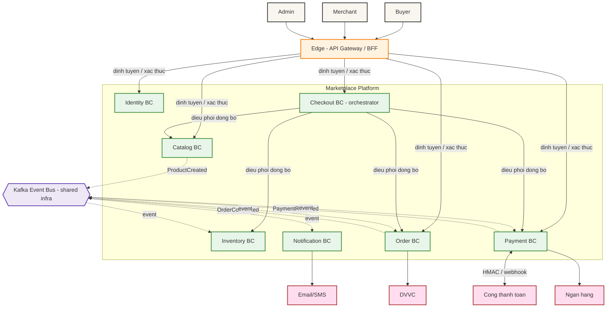

### 2.2.2 DDD Context Map (ngữ nghĩa quan hệ)

> Landscape cho _topology_; Context Map cho _kiểu quan hệ tích hợp_ (upstream/downstream + pattern). Đây là tầng ổn định nhất, trả lời "ranh giới & quan hệ kiểu gì". (Quan hệ liên-tập-đoàn xuyên trust-domain → xem ranh giới 5, mục 5.)

| Upstream (U) | Downstream (D) | Pattern | Cơ chế |
| --- | --- | --- | --- |
| Identity | mọi BC | Open Host Service (JWT/claims = Published Language) | OIDC/JWT |
| Catalog | Checkout | Customer–Supplier | gRPC (lấy giá) |
| Inventory | Checkout | Customer–Supplier | gRPC (giữ tồn kho) |
| Order | Checkout | Customer–Supplier | gRPC (tạo đơn) |
| Payment | Checkout | Customer–Supplier | gRPC (khởi tạo escrow) |
| Catalog | Inventory | Published Language | event `ProductCreated` |
| Payment | Order, Notification | Published Language | event `PaymentReceived` |
| Order | Inventory, Payment | Published Language | event `OrderCompleted` |
| Cổng TT / Ngân hàng (external) | Payment | Anti-Corruption Layer | HMAC + webhook verify |

### 2.2.3 Container diagram (per Bounded Context)

> Bung từng BC thành service + datastore. **Nhãn quan hệ = ý định + protocol** (giữ "communicates via [protocol]" đúng chuẩn C4 L2; **không** liệt kê tên RPC method — danh mục method ở 5.1.3/proto, dễ stale nếu đặt ở sơ đồ kiến trúc). Database nằm trong hộp BC sở hữu → nơi polyglot/đa-store "sống" mà không làm rối landscape.

**Payment BC** (giàu nhất: 2 datastore + external + event)

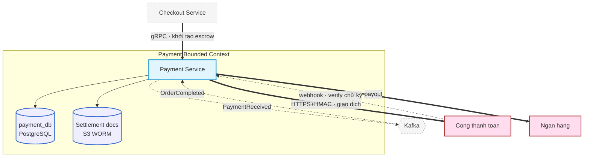

**Catalog BC** (polyglot: PostgreSQL + Elasticsearch)

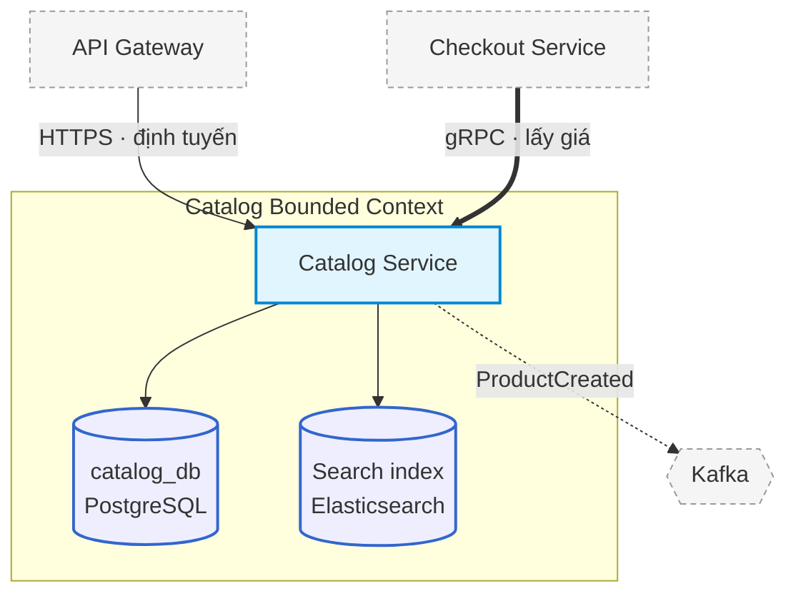

**Các BC còn lại** (1 service + ≤1 datastore — khuôn đồng nhất; vẽ Container diagram riêng khi nội bộ phình):

| BC | Service | Datastore | Giao tiếp chính (ý định) |
| --- | --- | --- | --- |
| Identity | Identity Service | identity_db (PostgreSQL, PII) | HTTPS/OIDC ← Gateway (xác thực, cấp JWT) |
| Inventory | Inventory Service | inventory_db (PostgreSQL) | gRPC giữ tồn kho ← Checkout; consume `ProductCreated`/`OrderCompleted` |
| Checkout | Checkout Service | Redis (phiên checkout) | gRPC điều phối → Catalog/Inventory/Order/Payment |
| Order | Order Service | order_db (PostgreSQL, PII địa chỉ) | gRPC tạo đơn ← Checkout; publish `OrderCompleted` |
| Notification | Notification Service | (stateless) | consume `PaymentReceived`/`OrderCompleted`; HTTPS → Email/SMS |

#### Công nghệ: binding (load-bearing) vs indicative

> Tách công nghệ _là quyết định kiến trúc_ khỏi công nghệ _là lựa chọn runtime_. Chỉ loại **binding** mới ràng buộc chất lượng/khả mở rộng/vận hành của phần còn lại nên thuộc về AD; loại **indicative** đổi được mà không ảnh hưởng kiến trúc.

| Công nghệ | Phân loại | Vì sao |
| --- | --- | --- |
| Kafka (event bus) | **Binding** | Đổi kéo theo delivery/ordering/partition/saga |
| PostgreSQL (DB-per-context) | **Binding** | ACID + ràng buộc consistency, migration |
| Elasticsearch (Catalog search) | **Binding** | Quyết định mô hình tìm kiếm & đồng bộ index |
| S3 Object Lock / WORM (chứng từ) | **Binding** | Ràng buộc bất biến / compliance |
| Mô hình Gateway/BFF (sản phẩm Kong là _indicative_) | **Binding** (ở mức _pattern_) | Pattern edge là kiến trúc; sản phẩm cụ thể thì không |
| Runtime từng service (Node.js / Spring Boot / Go / Python; Keycloak) | **Indicative** | Lựa chọn team; đổi không ảnh hưởng kiến trúc |

**Quyết định kiến trúc thực:** hệ **polyglot** (mỗi team tự chọn runtime) trên nền **Kafka + PostgreSQL-per-context + Elasticsearch (search) + S3 WORM (chứng từ)**. Việc enumerate framework từng service là _indicative_ — chi tiết runtime/phiên bản → Tech Spec.

> **Luật tầng (AD dừng ở L2, L3 → Tech Spec).** AD chỉ giữ tới **L2** cho mỗi BC: service + datastore + ranh giới + quan hệ + hợp đồng. **Component (L3) — cấu trúc nội bộ một service (controller/use-case/aggregate/adapter) — KHÔNG đặt trong AD**, mà thuộc **Tech Spec của BC đó, do team sở hữu** (Tech Spec = "context này hoạt động ra sao"). Lý do: L3 đổi liên tục (Tier Test) và không ai ngoài BC phụ thuộc (Dependency Test); để L3 trong AD gây stale + nhiều team dẫm đè một file chung.
>
> **Ngưỡng tách view (theo quy mô).**
> - **≤ ~7 BC** (hiện tại): giữ Landscape + **1 "container archetype"** (khuôn chung) + **vài Container diagram ví dụ** (Payment/Catalog) + bảng cho phần còn lại. Đây là trạng thái *quá độ hợp lý*.
> - **≥ ~10 BC hoặc đa P&L:** **KHÔNG** nhúng Container diagram của mọi BC vào AD trung tâm. AD trung tâm mỏng (Landscape + Context Map + deployment-zone + contracts + decisions + **index correspondence**); **Container(L2-nội-bộ)/Component(L3) của mỗi BC sinh từ model-as-code và sống ở Tech Spec do team sở hữu**. Đây là dạng *AD phân tầng trên một model liên-bang* (ISO 42010 cho phép nhiều AD + correspondence).
>
> **Hướng model-as-code (bước kế tiếp — ADR-0014).** Sơ đồ Mermaid hiện tại là *docs-as-code* nhưng **chưa "một model, nhiều view"**. Khi chuyển sang AaC, mọi view structure sinh từ **một model nguồn** (Structurizr DSL: `landscape/workspace.dsl` làm base, mỗi BC `extends` base + `!element` bơm L2/L3 — correspondence qua trùng identifier), validate trong CI. Xem ADR-0014 (mục 11).

## 2.3 Mô hình triển khai

### 2.3.1 Môi trường triển khai

| Môi trường | Hạ tầng | Đặc điểm |
| --- | --- | --- |
| Development | Docker Compose | Dữ liệu giả |
| Staging | K8s namespace | Mirror prod, dữ liệu ẩn danh |
| Production | K8s multi-AZ | HA, auto-scaling, full monitoring |

### 2.3.2 Sơ đồ triển khai Production

Topology: CDN → LB → API Gateway (multi-AZ) → service pods (HPA) → PostgreSQL (primary + read replica per context), Kafka cluster, Redis, S3 (ảnh + result bucket WORM). Payment Svc đặt trong subnet hạn chế egress (chỉ tới PG/Bank).

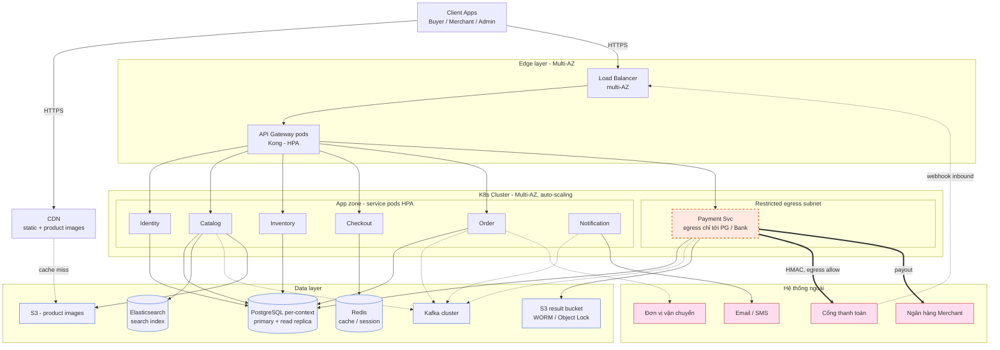

> **Truy vết (deployment ↔ §2.2.3):** mỗi service pod ở App zone ↔ Service trong Container diagram của BC tương ứng; mỗi datastore ở Data layer ↔ datastore nằm trong hộp BC sở hữu (vd `payment_db` + `S3 WORM` ↔ Payment BC; `catalog_db` + ES ↔ Catalog BC; Redis ↔ Checkout BC). Mỗi hộp trong sơ đồ này là **một trong hai loại**: node hạ tầng, hoặc instance của một container đã định nghĩa ở §2.2.3 — không có hộp "lửng".

> **Grain của Deployment view (chống bất đối xứng độ phủ).** Deployment view ở grain **L2 (container trên node)** — cùng grain với §2.2.3, chỉ là chỗ duy nhất *mọi* container hiện cùng lúc. Ở **~7 BC** một sơ đồ deployment toàn hệ còn đọc được; nhưng theo cùng *luật tầng* với Container view, ở **≥10 BC** đừng vẽ mọi container trong một hình:
> - **AD giữ ở grain BC/zone:** topology trust-zone (App zone / Restricted egress / Data), ánh xạ container→node *mức quyết định*, ràng buộc kiến trúc (Payment egress chỉ PG/Bank; S3 WORM cross-region). Sinh từ model-as-code bằng `softwareSystemInstance` (grain BC).
> - **Đẩy xuống Tech Spec/IaC:** số replica, ngưỡng HPA, sizing/resource limit, và **deployment chi tiết per-BC** (`containerInstance`) — đây đúng là chi tiết mà chuẩn loại khỏi AD ("YAML/IaC, sizing số cụ thể").

### 2.3.3 Chiến lược triển khai

Rolling update mặc định; Canary cho Checkout/Payment (rủi ro cao); Feature flag cho khuyến mãi; Blue/Green khi đổi schema breaking.

## 2.4 Correspondence / Traceability giữa các view

> Bảng ánh xạ bắt buộc (42010 *correspondence*): mọi view nhất quán với nhau và truy vết xuống Tech Spec. Mâu thuẫn giữa các view là lỗi chặn (khi chuyển model-as-code sẽ do CI bắt — ADR-0014).

| BC (Landscape §2.2.1) | Container §2.2.3 (service + datastore) | Deployment §2.3.2 (zone) | Tech Spec (L3) |
| --- | --- | --- | --- |
| Identity BC | Identity Service + identity_db | App zone | TechSpec-Identity |
| Catalog BC | Catalog Service + catalog_db + ES | App zone + Data | TechSpec-Catalog |
| Inventory BC | Inventory Service + inventory_db | App zone | TechSpec-Inventory |
| Checkout BC | Checkout Service + Redis | App zone | TechSpec-Checkout |
| Order BC | Order Service + order_db | App zone | TechSpec-Order |
| Payment BC | Payment Service + payment_db + S3 WORM | Restricted egress subnet | TechSpec-Payment |
| Notification BC | Notification Service (stateless) | App zone | TechSpec-Notification |

Quy tắc: mỗi **hộp BC** ⇄ đúng một dòng Container ⇄ một (cụm) thực thể Deployment ⇄ một Tech Spec. Quan hệ xuyên-BC chỉ khai ở Landscape/Context Map (§2.2.1–2.2.2), **không** lặp ở tầng Container. Bảng SAD↔Tech Spec chi tiết: Phụ lục A.

# 3. CÁC THÀNH PHẦN HỆ THỐNG

## 3.1 Tổng quan các thành phần

| # | Component | Loại | Công nghệ | Trách nhiệm chính |
| --- | --- | --- | --- | --- |
| 1 | API Gateway/BFF | Infra | Kong | Điều phối lưu lượng từ client tới các service nội bộ; xác thực JWT đầu vào; áp rate limit & WAF bảo vệ tầng biên; gắn tenant scope cho mọi request; TLS termination. |
| 2 | Identity | Microservice | Node.js+Keycloak | Quản lý vòng đời tài khoản người dùng (Buyer, Merchant, Admin); cấp & xác thực JWT (RS256) qua OIDC; phân quyền RBAC ba vai trò; hỗ trợ MFA cho Admin & Merchant rút tiền; quản lý phiên SSO. |
| 3 | Catalog | Microservice | Spring Boot+ES | Quản lý danh mục sản phẩm, biến thể, SKU & thương hiệu (source of truth); kiểm duyệt nội dung trước khi hiển thị; lập chỉ mục & tìm kiếm toàn văn qua Elasticsearch; phát sự kiện ProductCreated để đồng bộ Inventory. |
| 4 | Inventory | Microservice | Go | Theo dõi số lượng tồn kho theo SKU; giữ chỗ hàng hoá khi đặt đơn (reservation); trừ kho vĩnh viễn khi đơn hoàn tất (consume sự kiện OrderCompleted); giải phóng reservation khi saga compensation. |
| 5 | Checkout | Microservice | Spring Boot | Điều phối (orchestrator) toàn bộ quy trình đặt hàng: tổng hợp giá từ Catalog, reserve kho từ Inventory, tự động tách đơn theo từng Merchant, tạo pending order, khởi tạo escrow; thực thi saga compensation khi có bước lỗi. |
| 6 | Order (OMS) | Microservice | Spring Boot | Quản lý toàn bộ vòng đời đơn hàng qua máy trạng thái (Pending → Paid → To Ship → Shipped → Completed / Cancelled); phát sự kiện OrderCompleted kích hoạt trừ kho & settlement; lưu snapshot giá tại thời điểm đặt. |
| 7 | Payment | Microservice | Node.js | Xử lý giao dịch qua cổng thanh toán bên thứ ba; giữ tiền trung gian (escrow) đến khi giao hàng thành công; tính phí sàn & hoa hồng; thực hiện payout cho Merchant; sinh chứng từ đối soát bất biến (WORM/S3); xác minh webhook (chữ ký + idempotency). |
| 8 | Notification | Microservice | Python | Lắng nghe sự kiện từ Kafka (PaymentReceived, OrderCompleted…); gửi thông báo đa kênh (email, SMS) qua provider bên thứ ba; hỗ trợ fallback kênh thay thế khi gửi thất bại. |

## 3.2 Mô tả chi tiết từng thành phần

### 3.2.1 Checkout Service (Orchestrator)

| Thuộc tính | Giá trị |
| --- | --- |
| Loại / Công nghệ / Owner | Microservice / Spring Boot / Checkout team |
| Ranh giới tin cậy | Nội bộ; điều phối đồng bộ tới Catalog/Inventory/Order/Payment |
| Trạng thái | Gần như stateless; phiên checkout tạm ở Redis |
| Trách nhiệm | Tổng hợp giá (Catalog), reserve kho (Inventory), tách đơn theo Merchant, tạo pending order (Order), init escrow (Payment); compensation khi một bước lỗi. |
| Thiết kế chi tiết | `TechSpec-Marketplace-Checkout.md` |

### 3.2.2 Payment Service (Escrow & Settlement)

| Thuộc tính | Giá trị |
| --- | --- |
| Loại / Công nghệ / Owner | Microservice / Node.js / Payment team |
| Ranh giới tin cậy | Outbound → cổng thanh toán & ngân hàng; inbound webhook; ghi chứng từ bất biến lên S3 result bucket |
| Trách nhiệm | giao dịch cổng ngoài, escrow (giữ tiền), tính phí/hoa hồng, payout; sinh chứng từ đối soát (WORM). |
| Thiết kế chi tiết | `TechSpec-Marketplace-Payment.md` |

# 4. LUỒNG DỮ LIỆU

> **Quy ước tên (theo §2.2):** mục này mô tả cộng tác _runtime_ nên dùng tên **"X Service"** (rút gọn "X" trong sequence) — nhất quán với Container diagram §2.2.3, không dùng "X Context".

## 4.1 Luồng chính (Happy Path)

### 4.1.1 Checkout & tách đơn (Orchestration)

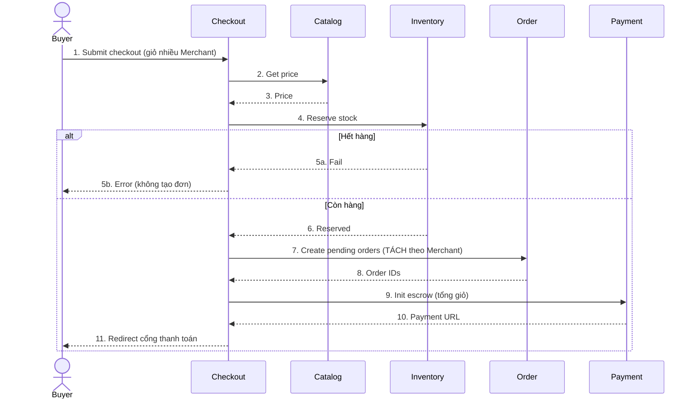

### 4.1.2 Thanh toán → cập nhật đơn

Cổng thanh toán → Payment webhook (verify chữ ký) → Payment giữ tiền (escrow) → phát `PaymentReceived` → Order chuyển "To Ship" → Notification báo Merchant.

### 4.1.3 Hoàn tất & đối soát (Settlement)

Buyer xác nhận nhận hàng → Order "Completed" → phát `OrderCompleted` → Inventory trừ kho vĩnh viễn; Payment tính hoa hồng → release escrow → payout về ngân hàng Merchant → sinh chứng từ đối soát (ghi **bất biến** lên S3 result bucket).

## 4.2 Data Flow Diagram (mức loại dữ liệu)

### 4.2.1 Luồng Nhà bán hàng & Quản trị (Merchant & Admin Flow)

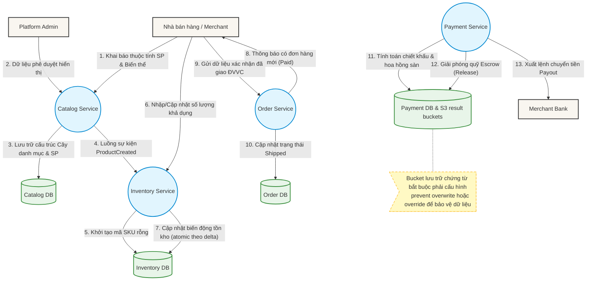

### 4.2.2 Luồng Khách hàng (Buyer Flow)

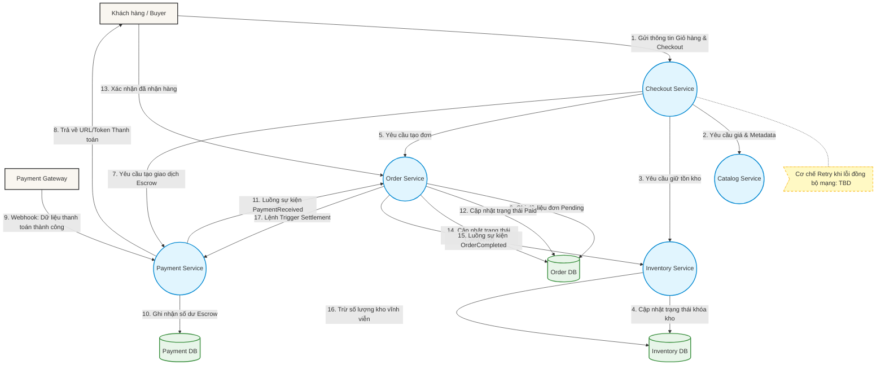

## 4.3 Luồng bất đồng bộ (Event-Driven)

> Bảng dưới mô tả **ý nghĩa & bảo đảm** của mỗi event ở mức kiến trúc. **Hợp đồng schema đầy đủ (field, kiểu, ví dụ payload) → AsyncAPI + schema registry**, không gõ tay trong tài liệu này (xem 5.1.5). Payload minh hoạ chỉ để định hướng, **không** phải đặc tả chuẩn.

| Event | Publisher | Subscriber(s) | Ý nghĩa (intent) | Delivery / Ordering | Payload minh hoạ (illustrative) | Retry/DLQ |
| --- | --- | --- | --- | --- | --- | --- |
| ProductCreated | Catalog | Inventory | Sản phẩm đã duyệt & công bố → Inventory khởi tạo SKU | at-least-once · order theo `productId` | `{productId, skus[]}` | 3 retries, catalog-dlq |
| PaymentReceived | Payment | Order, Notification | Đã giữ tiền escrow thành công → Order chuyển trạng thái, gửi thông báo | at-least-once · order theo `orderId` | `{orderId, txnId, amount}` | 5 retries, pay-dlq |
| OrderCompleted | Order | Inventory, Payment | Buyer xác nhận nhận hàng → trừ kho vĩnh viễn + kích hoạt settlement | at-least-once · order theo `orderId` | `{orderId, items[]}` | 5 retries, order-dlq |

> ⚠️ **Bất biến (invariant):** Event bus đảm bảo **at-least-once**, không exactly-once. Do đó **mọi consumer phải idempotent** — khử trùng lặp theo khoá nghiệp vụ/`eventId` (vd: nếu xử lý `OrderCompleted` hai lần thì **không** được trừ kho hai lần, **không** payout hai lần). Cơ chế dedupe cụ thể → Tech Spec; bất biến này được kiểm ở mục 7.5.

# 5. GIAO DIỆN HỆ THỐNG

> Optional

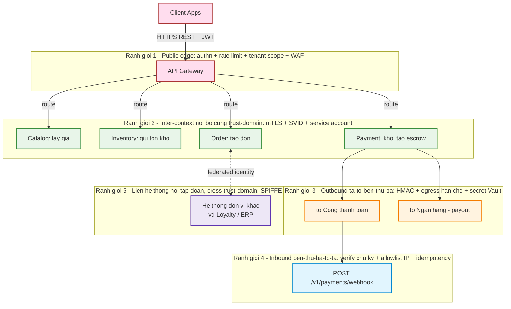

**Đọc các ranh giới.** Trục phân loại là _ranh giới tin cậy + chiều + ai khởi tạo_, **không** phải quyền sở hữu tổ chức. B3 và B4 là **hai chiều của cùng một quan hệ** ta ↔ bên thứ ba: B3 là ta chủ động gọi ra (PG/Bank), B4 là họ chủ động gọi vào (webhook cổng thanh toán) — nên cùng một vendor xuất hiện ở cả hai.

**Ranh giới 5 — liên hệ thống nội tập đoàn (cross trust-domain).** Một hệ của P&L khác _không_ phải internet công khai (≠B1), _không_ nằm trong trust domain/mesh của hệ này (≠B2), cũng _không_ là vendor arms-length kiểu cổng thanh toán (≠B3/B4). Nó là một hạng tin cậy riêng. Nguyên tắc Zero Trust: **đừng kéo dài niềm tin B2 qua ranh giới P&L chỉ vì "cùng tập đoàn"** — đó đúng là fallacy tin-theo-vị-trí-mạng mà ZTA cảnh báo. Xử lý bằng **SPIFFE federation** (mục 7, ZTA giai đoạn 3) cho danh tính workload xuyên domain, và mô tả quan hệ bằng **DDD context-map** (Customer–Supplier / ACL / Published Language — §2.2.2), không dùng HMAC/allowlist kiểu vendor. Hệ hiện tại chưa có peer P&L nào trong phạm vi; B5 khai báo sẵn cho lộ trình mở rộng.

## 5.1 Internal APIs

### 5.1.1 Quy ước chung

| Quy ước | Áp dụng |
| --- | --- |
| Base URL | `https://api.marketplace.com/v{version}` |
| Auth | Bearer JWT (RS256), service-to-service mTLS |
| Internal RPC | gRPC giữa các context |
| Async messaging | Kafka; mỗi event có topic riêng, key = khoá phân vùng (xem 5.1.5) |
| Versioning (sync) | URL `/v1/`, hỗ trợ N-1; thay đổi breaking → version mới |
| Versioning (event) | Schema registry + compatibility mode (xem 5.1.5); breaking → topic/version event mới |
| Error format | `{error:{code, message, details[]}}` |
| ID | UUID v4 · Time ISO 8601 UTC |
| Event envelope | Mọi event mang metadata chuẩn: `eventId`, `eventType`, `occurredAt`, `traceId`, `tenant/merchantId` (chi tiết envelope → AsyncAPI) |

### 5.1.2 Phân loại interface theo ranh giới tin cậy

| Nhóm | Ranh giới | Cơ chế bảo vệ |
| --- | --- | --- |
| Public (qua Gateway) | Internet→edge | Authn, rate limit, validation, **tenant scope** |
| Inter-context (gRPC) | VPC nội bộ (cùng trust-domain) | mTLS + SVID + service account |
| Async (Kafka event) | VPC nội bộ | mTLS broker + ACL theo topic; consumer idempotent |
| Outbound (ta→bên thứ ba) | Nội bộ→ngoài | HMAC, timeout, retry, secret ở Vault, egress hạn chế |
| Inbound (bên thứ ba→ta) | Ngoài→nội bộ | Verify chữ ký, allowlist IP, idempotency |
| **Liên hệ thống nội tập đoàn** | **Cross trust-domain (khác P&L)** | **SPIFFE federation + DDD context-map (ACL/Published Language); KHÔNG mặc định tin theo vị trí mạng** |

### 5.1.3 Danh sách API quan trọng & ví dụ

| # | Loại | Interface | Auth | Mô tả |
| --- | --- | --- | --- | --- |
| 1 | gRPC | `Catalog.GetPrice` | mTLS | Lấy giá cho checkout |
| 2 | gRPC | `Inventory.ReserveStock` | mTLS | Giữ chỗ tồn kho |
| 3 | gRPC | `Order.CreatePendingOrder` | mTLS | Tạo đơn (tách Merchant) |
| 4 | gRPC | `Payment.InitEscrow` | mTLS | Khởi tạo giữ tiền |
| 5 | REST | `POST /v1/payments/webhook` | Chữ ký | Callback cổng thanh toán |

_Đặc tả đầy đủ → OpenAPI/proto mỗi service; chi tiết nghiệp vụ → Tech Spec tương ứng._

### 5.1.4 Hợp đồng tương tác (Interaction Contracts)

> Gom các **bảo đảm kiến trúc** của mỗi giao tiếp xuyên context vào một chỗ. Đây là phần "chống lại thay đổi chi tiết": chỉ đổi khi một _quyết định kiến trúc_ đổi, không đổi khi thêm/bớt field. Chi tiết hiện thực (timeout cụ thể, cách dedupe) → Tech Spec.

| Interface / Event | Kiểu | Consistency | Idempotency | Ordering | Delivery | Lỗi / Suy giảm |
| --- | --- | --- | --- | --- | --- | --- |
| `Catalog.GetPrice` | sync (query) | strong (đọc tức thời) | n/a (read-only) | n/a | request-response | Lỗi → Checkout fail sớm, không tạo đơn |
| `Inventory.ReserveStock` | sync (command) | strong (trong context) | có — theo `checkoutId` | n/a | request-response | Hết hàng/ lỗi → fail checkout; reservation tự hết hạn (TTL) |
| `Order.CreatePendingOrder` | sync (command) | strong (trong context) | có — theo `checkoutId` | n/a | request-response | Lỗi → saga compensation: release reservation |
| `Payment.InitEscrow` | sync (command) | strong (trong context) | **bắt buộc** — theo `checkoutId`/`orderGroupId` | n/a | request-response | Lỗi → compensation: hủy pending order + release reservation |
| `webhook /payments/webhook` | inbound async | eventual | **bắt buộc** — theo `txnId`/chữ ký | n/a | at-least-once (cổng retry) | Verify fail → từ chối; fallback reconcile định kỳ |
| `ProductCreated` | event | eventual | consumer dedupe theo `eventId` | per-`productId` | at-least-once | Retry → catalog-dlq; xử lý DLQ thủ công |
| `PaymentReceived` | event | eventual | consumer dedupe theo `eventId` | per-`orderId` | at-least-once | Retry → pay-dlq; alert P1 nếu tồn DLQ |
| `OrderCompleted` | event | eventual | consumer dedupe theo `eventId` (không trừ kho/payout 2 lần) | per-`orderId` | at-least-once | Retry → order-dlq; alert P1 nếu tồn DLQ |

### 5.1.5 Hợp đồng sự kiện & tiến hóa schema (Event Contract & Schema Evolution)

Event là **hợp đồng công khai giữa các context**, ngang hàng với API đồng bộ — không phải chi tiết nội bộ của publisher. Nguyên tắc:

* **Artifact-nhà:** mỗi event có đặc tả trong **AsyncAPI**; schema field nằm trong **schema registry** (versioned), được CI validate — không gõ tay trong SAD/Tech Spec.
* **Compatibility:** registry bật chế độ **backward-compatible** tối thiểu (consumer cũ đọc được event mới). Thêm field optional = non-breaking; xóa/đổi nghĩa/đổi kiểu field = **breaking** → phát hành **topic/version event mới**, chạy song song tới khi consumer migrate xong rồi mới deprecate.
* **Envelope chuẩn:** mọi event mang `eventId` (dedupe), `eventType`, `occurredAt`, `traceId` (propagate qua Kafka — xem 10.3), `merchantId` (tenant scope).
* **Ownership:** publisher sở hữu schema; thay đổi breaking phải thông báo & được consumer xác nhận trước khi cắt version cũ (chính sách deprecation: tối thiểu giữ N-1).
* **Khóa & phân vùng:** key của event xác định ordering trong partition; partition theo `merchantId` (xem 8.4.1) để bảo toàn thứ tự theo tenant.

> ⚠️ **TBD (cần ADR):** Định dạng serialize event (Avro / Protobuf / JSON Schema trên Kafka) chưa chốt. _Quyết định kiến trúc đã chốt:_ bắt buộc dùng schema registry + backward-compatible. _Đang chờ:_ chọn format cụ thể & cấu hình registry — theo dõi bằng ADR riêng.

## 5.2 External Integration Points

| Hệ thống | Loại | Ranh giới | Dữ liệu qua biên | Resilience | Compliance |
| --- | --- | --- | --- | --- | --- |
| Cổng thanh toán | Payment | Outbound + webhook | Số tiền, orderRef (không PAN) | Timeout 30s, fallback reconcile | Subprocessor, DPA |
| Ngân hàng Merchant | Payout | Outbound | STK (nhạy cảm), số tiền | Retry + đối soát thủ công | Hợp đồng ngân hàng |
| Đơn vị vận chuyển | Logistics | Outbound | Địa chỉ (PII) | Retry → queue | Subprocessor, DPA |
| Email/SMS | Notification | Outbound | SĐT/email (PII) | Fallback kênh khác | Subprocessor |

# 6. KIẾN TRÚC DỮ LIỆU

## 6.1 Tổng quan kiến trúc dữ liệu

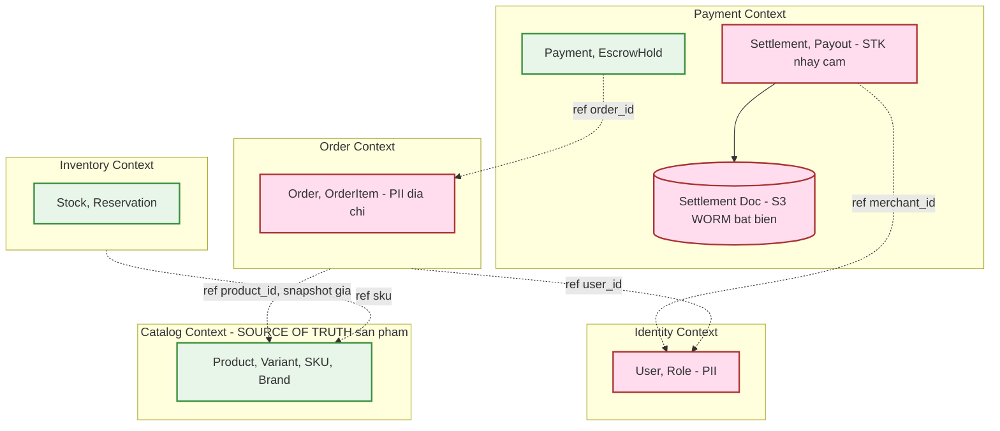

| Context | Database | Loại | Lý do |
| --- | --- | --- | --- |
| Identity | identity_db | PostgreSQL | ACID, audit |
| Catalog | catalog_db + ES | PostgreSQL + Elasticsearch | Relational + search |
| Inventory | inventory_db | PostgreSQL | Consistency tồn kho |
| Order | order_db | PostgreSQL | ACID, state machine |
| Payment | payment_db + S3 | PostgreSQL + S3 (WORM) | ACID + **chứng từ bất biến** |
| (chung) | Redis · S3 | Cache/session · Object | Phiên checkout · ảnh sản phẩm |

## 6.2 Entity Relationship Diagram (ERD)

**Mỗi context có ERD riêng**, không FK vật lý xuyên context. Tham chiếu xuyên context (vd `order_id` trong payment_db, `product_id` trong order_db) là _reference logic_. _(ERD từng context → repo diagram + Tech Spec.)_

## 6.3 Định nghĩa Schema chính

Tổ chức theo context. Schema cột chi tiết → Tech Spec tương ứng:

* Payment (payments, escrow_holds, settlements) → `TechSpec-Marketplace-Payment.md`
* Checkout/Order → `TechSpec-Marketplace-Checkout.md`

## 6.4 Chiến lược quản lý dữ liệu

### 6.4.1 Migration

Flyway, backward-compatible ≥ 1 deploy cycle.

### 6.4.2 Backup

DB chính daily full + hourly incremental (Payment tier-1: RPO < 5 phút).

### 6.4.3 Data Lifecycle & phân loại

| Loại dữ liệu | Retention | Khi hết hạn | Cơ sở |
| --- | --- | --- | --- |
| PII (hồ sơ, địa chỉ) | TK active + 30 ngày | Anonymize | NĐ 13/2023 |
| Dữ liệu giao dịch/đơn | 10 năm | Archive → purge | Luật kế toán |
| Chứng từ đối soát (S3) | 10 năm | Immutable (WORM), không ghi đè/xóa | Compliance tài chính |
| Audit log | 5 năm | Immutable (Object Lock) | Compliance |

> ⚠️ **TBD:** IAM policy chi tiết cho S3 result bucket (chứng từ đối soát) đang chờ chốt — nguyên tắc: write-once, deny overwrite/delete kể cả với owner; xem mục 7.3.

# 7. KIẾN TRÚC BẢO MẬT

> Hướng theo ZTA

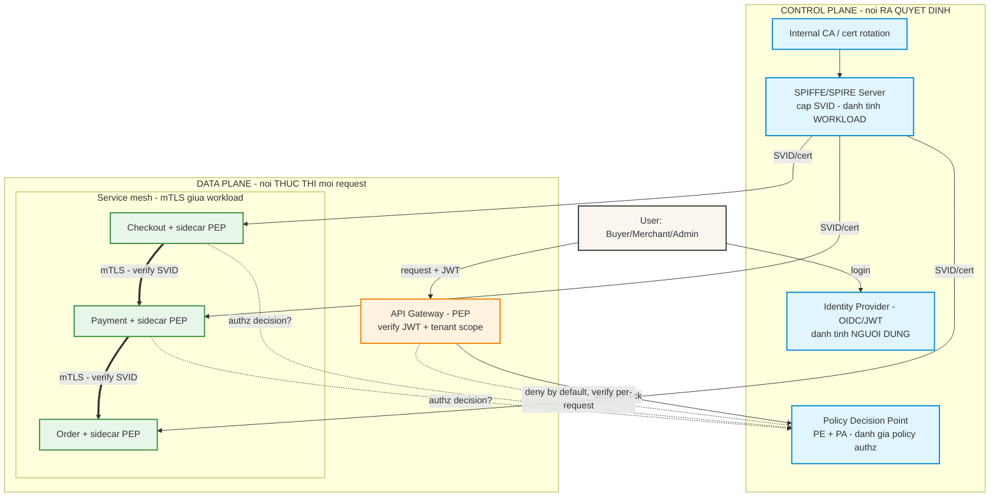

Hệ thống áp dụng Zero-Trust Architecture (ZTA) theo mô hình NIST SP 800-207, tách hai mặt phẳng:

* Control plane (ra quyết định): _IdP_ cấp danh tính người dùng (OIDC/JWT); _SPIFFE/SPIRE_ cấp danh tính workload (SVID); _PDP_ (Policy Engine + Policy Administrator) đánh giá policy phân quyền; _CA_ phát và xoay chứng chỉ.
* Data plane (thực thi mọi request): _PEP_ tại API Gateway và sidecar của từng service enforce quyết định; mTLS bảo vệ mọi giao tiếp workload-to-workload.

Mỗi request đi qua ba kiểm tra độc lập — đừng gộp chúng: xác thực người dùng (JWT), xác thực workload (mTLS/SVID), và phân quyền (PDP). Nguyên tắc nền: _deny-by-default_, _verify per-request_, _least privilege_, _assume breach_ — không tin theo vị trí mạng (ở trong VPC không đồng nghĩa được tin).

> ⚠️ Target vs Current state: ZTA là hành trình nhiều giai đoạn. _Hiện trạng:_ mTLS qua service mesh đã có; PEP tại Gateway đã có. _Đang triển khai:_ PDP tập trung + per-request authz ở sidecar (giai đoạn 2); SPIRE federation (giai đoạn 3). Mỗi cột mốc ZTA là một thay đổi kiến trúc → có ADR riêng. Sơ đồ trên là kiến trúc mục tiêu.

## 7.1 Xác thực (Authentication)

Tách hai loại danh tính — đây là điểm ZTA bổ sung so với mô hình cũ:

* **Người dùng (user):** OIDC + JWT (RS256); IdP (control plane) phát token; access TTL ngắn, refresh dài; MFA bắt buộc cho Admin & Merchant rút tiền; SSO Merchant tùy chọn.
* **Workload (service):** SPIFFE/SPIRE cấp **SVID** cho mỗi workload; danh tính workload là nền tảng cho mTLS (mục 7.3) và cho authz service-to-service. Không service nào được tin chỉ vì nằm trong VPC — phải có SVID hợp lệ.

## 7.2 Phân quyền (Authorization)

Mô hình **PDP/PEP**: quyết định phân quyền tập trung ở **PDP** (policy-as-code), thực thi ở **PEP** (API Gateway cho request người dùng; sidecar cho gọi service-to-service), **per-request** và **deny-by-default**.

Nội dung policy là **RBAC + tenant isolation**: mọi truy vấn dữ liệu Merchant gắn `merchant_id`; Merchant A **không** truy cập dữ liệu Merchant B — kiểm tại PEP ở Gateway _và_ tại service.

### 7.2.1 Role & Permission Matrix

| Resource / Action | Admin | Merchant | Buyer |
| --- | --- | --- | --- |
| Sản phẩm (CRUD của mình) | ✔ tất cả | ✔ của mình | ✘ |
| Duyệt sản phẩm | ✔ | ✘ | ✘ |
| Đơn hàng | ✔ tất cả | ✔ của mình | ✔ của mình |
| Payout/đối soát | ✔ | ✔ xem của mình | ✘ |
| Chứng từ đối soát (S3) | đọc | đọc của mình | ✘ |

## 7.3 Mã hóa (Encryption)

* In-transit: TLS 1.3 ở biên ngoài; mTLS giữa mọi workload nội bộ — chứng chỉ chính là SVID do SPIRE/CA cấp và xoay tự động (control plane). Đây vừa là kênh mã hóa, vừa là cơ chế xác thực workload (7.1).
* At-rest: AES-256 (KMS/Vault); STK ngân hàng & PII mã hóa field-level.
* Chứng từ đối soát: S3 + Object Lock (WORM) — _quyết định: write-once, prevent overwrite/override_; IAM policy chi tiết TBD (cần ADR, kèm legal-hold & retention).

## 7.4 Bảo mật API (PEP tại từng ranh giới)

Mỗi ranh giới tin cậy có một PEP enforce:

| Ranh giới | PEP | Enforce |
| --- | --- | --- |
| Public (Internet→edge) | API Gateway | Verify JWT, tenant scope, rate limit, input validation, WAF |
| Inter-service (VPC) | Sidecar | mTLS (verify SVID) + authz qua PDP |
| Async (Kafka) | Broker ACL + consumer | mTLS broker, ACL theo topic, dedupe theo `eventId` |
| Outbound (PG/Bank) | Egress policy | Secret từ Vault, egress hạn chế chỉ tới đích cho phép |
| Inbound webhook | Gateway/handler | Verify chữ ký + allowlist IP + idempotency |

Bổ sung: CORS allowlist · CSRF cho state-changing · validate server-side (không tin client).

## 7.5 Kiểm tra & Tuân thủ bảo mật (Fitness functions + Review)

| Invariant | Cơ chế |
| --- | --- |
| Mọi giao tiếp service-to-service là mTLS (không plaintext) | Mesh policy / test |
| Không path nào bypass PEP (mọi route qua Gateway/sidecar) | Route/network policy check |
| SVID/chứng chỉ có xoay, không hết hạn tĩnh | Cert audit |
| PDP deny-by-default (không implicit allow) | Policy test |
| Mọi route có authn + tenant scope | Quét route/test |
| Webhook luôn verify chữ ký | Test |
| Mọi consumer event là idempotent (dedupe theo `eventId`) — không xử lý trùng | Contract test consumer · inject event trùng |
| Schema event tương thích backward (không breaking ngầm) | Schema-registry compatibility check trong CI |
| Không secret hardcode · S3 bucket bật Object Lock | Secret scan · IaC check |
| Payment Svc egress chỉ tới PG/Bank | Network policy check |

### Người review (gating, phán đoán)

| Loại | Ý nghĩa | Vì sao máy không kiểm soát được? |
| --- | --- | --- |
| **Luồng tiền mới** | Thêm/sửa cách tiền đi qua hệ thống | Sai một bước có thể mất tiền thật, cần người hiểu nghiệp vụ tài chính đánh giá |
| **Truy cập xuyên tenant** | Cho phép một tenant truy cập dữ liệu/tài nguyên của tenant khác | Rủi ro rò rỉ dữ liệu cực cao, cần người đánh giá lý do hợp lệ |
| **Thay đổi policy chứng từ bất biến** | Sửa quy tắc lưu trữ chứng từ WORM | Liên quan tuân thủ pháp lý/kiểm toán, sai có thể vi phạm quy định |
| **Breaking change hợp đồng event** | Xóa/đổi nghĩa field, đổi ngữ nghĩa event công khai | Phá vỡ consumer của context khác; cần đánh giá tác động & lộ trình migrate |
| **Mỗi cột mốc nâng cấp ZTA** | Từng bước triển khai Zero Trust Architecture | Bật sai cách có thể chặn toàn bộ traffic hợp lệ hoặc ngược lại, bỏ lọt truy cập trái phép |

# 8. HIỆU NĂNG & KHẢ NĂNG MỞ RỘNG

## 8.1 Yêu cầu hiệu năng

| Metric | Target | Điều kiện |
| --- | --- | --- |
| Checkout P99 | < 800ms | Bao gồm orchestration nhiều context |
| Search P95 | < 200ms | Catalog/ES |
| API P99 (khác) | < 500ms | Normal |
| Error rate | < 0.1% | Normal |

## 8.2 SLA

Payment/Order 99.95% · Checkout 99.9% · Catalog/Search 99.5%.

## 8.3 Capacity Planning

Ước tính từ DAU × đơn/user; Payment & Order là tier-1. Headroom 3–5x.

## 8.4 Chiến lược Scaling

### 8.4.1 Horizontal

K8s HPA (CPU>70%/RPS); stateless services; read replica cho Catalog; partition Kafka theo `merchant_id` (đồng thời là khóa bảo toàn ordering event theo tenant — xem 5.1.5).

### 8.4.2 Caching

CDN (ảnh/sản phẩm) · Redis (phiên checkout, giá) · local (feature flags).

## 8.5 Cây chất lượng & kịch bản (Quality Tree + Scenarios)

> Theo arc42 §10 — nối **thuộc tính chất lượng (ISO 25010) ↔ mục tiêu ↔ kịch bản đo được ↔ cơ chế kiến trúc**. Mỗi kịch bản dạng *stimulus → response (đo được)*.

**Cây chất lượng (ưu tiên giảm dần):**
- **Reliability/Integrity (tiền)** — *trọng yếu nhất* → M2/M3 → escrow idempotent, saga/compensation, chứng từ WORM.
- **Performance** → M5 → checkout P99 < 800ms, search P95 < 200ms.
- **Security/Tenant isolation** → NFR-03 → ZTA, RBAC + tenant scope, mTLS.
- **Scalability** → M5 → stateless + HPA, partition Kafka theo `merchantId`.
- **Maintainability/Evolvability** → DB-per-context, hợp đồng versioned, model-as-code.

| ID | Thuộc tính | Kịch bản (stimulus → response đo được) | Liên kết | Cơ chế / kiểm |
| --- | --- | --- | --- | --- |
| QS-01 | Reliability (tiền) | `OrderCompleted` bị giao 2 lần → **không** trừ kho/payout lần 2 | M2, NFR-01 | consumer idempotent (7.5) · inject event trùng |
| QS-02 | Integrity (tiền) | 1 bước saga lỗi → trạng thái nhất quán, không treo tiền | M2 | saga + compensation (9.2) |
| QS-03 | Integrity (chứng từ) | Cố ghi đè chứng từ đối soát → **bị từ chối** | M3, pháp lý | S3 Object Lock/WORM · IaC check |
| QS-04 | Performance | Checkout giờ cao điểm 3.000 RPS → **P99 < 800ms** | M5 | orchestration + cache + HPA · load test |
| QS-05 | Performance | Tìm kiếm catalog tải bình thường → **P95 < 200ms** | M4 | Elasticsearch · benchmark |
| QS-06 | Security | Merchant A gọi dữ liệu Merchant B → **deny** (per-request) | NFR-03 | PEP tenant scope (7.2) · route test |
| QS-07 | Availability | Mất 1 AZ → Payment/Order phục hồi **RTO < 1h, RPO < 5min** | M2 | multi-AZ failover (9.3) · DR drill |
| QS-08 | Scalability | Tải tăng 3–5× → scale ngang không đổi kiến trúc | M5 | stateless + HPA + Kafka partition |

# 9. XỬ LÝ LỖI & KHẢ NĂNG PHỤC HỒI

## 9.1 Phân loại và xử lý lỗi

Chuẩn HTTP (400/401/403/404/409/422/429/500/503) — hành động chi tiết ở runbook.

## 9.2 Resilience Patterns

* Saga + compensation (Checkout): reserve → create order → init escrow; bước sau lỗi → release reservation + hủy pending order.
* Idempotency (bắt buộc): webhook thanh toán, payout, escrow — **và mọi consumer event** (Inventory consume `OrderCompleted`, Order/Notification consume `PaymentReceived`…), dedupe theo `eventId`/khoá nghiệp vụ vì event bus là at-least-once.
* DLQ: event vượt số retry → DLQ theo topic (catalog-dlq/pay-dlq/order-dlq); DLQ tồn → alert (xem 10.4) + xử lý thủ công theo runbook.
* Circuit Breaker gọi cổng thanh toán/ngân hàng; Timeout mọi I/O; Graceful degradation search lỗi → cache.

## 9.3 Disaster Recovery (DR)

### 9.3.1 RTO / RPO

| Tier | RTO | RPO | Gồm |
| --- | --- | --- | --- |
| 1 Critical | <1h | <5min | Identity, Payment, Order |
| 2 Business | <4h | <1h | Checkout, Inventory |
| 3 Important | <24h | <4h | Catalog, Notification |

### 9.3.2 Kế hoạch DR

Failover multi-AZ; restore từ backup; chứng từ S3 WORM cross-region replication; smoke test luồng tiền trước khi thông báo phục hồi; post-mortem trong 48h.

# 10. QUAN SÁT & GIÁM SÁT (OBSERVABILITY)

## 10.1 Logging

Structured JSON, mask PII/STK/secret; audit log bất biến (S3 Object Lock, 5 năm). Trường: timestamp, level, service, traceId, merchantId, requestId.

## 10.2 Metrics

RED per service + Golden Signals. business_order_created_total, escrow_held_total, payout_total{status}, checkout_saga_compensation_total. Bổ sung cho async: kafka_consumer_lag, event_dedupe_dropped_total, dlq_depth{topic} (làm cơ sở cho alert ở 10.4).

## 10.3 Distributed Tracing

OpenTelemetry → Tempo; đặc biệt quan trọng vì checkout đi qua ≥4 context; 100% errors, 5% normal; propagate trace context qua gRPC + Kafka (qua envelope `traceId` — xem 5.1.5).

## 10.4 Alerting

| Alert | Severity | Hành động |
| --- | --- | --- |
| Payment fail rate >5%/5m | P1 | PagerDuty |
| Escrow/đối soát lệch | P1 | PagerDuty + freeze payout |
| DLQ luồng tiền (pay-dlq/order-dlq) có message | P1 | PagerDuty + runbook |
| Consumer lag tăng bất thường | P2 | Slack + điều tra |
| Checkout saga compensation spike | P2 | Slack + runbook |
| Truy cập xuyên tenant phát hiện | P1 | PagerDuty + Security |

## 10.5 Dashboard

Service Overview (SRE) · Business KPIs (PO) · SLA/SLO · **Security** (auth fail, tenant violation, audit) · **Finance** (escrow balance, payout, đối soát) · **Event/Async** (consumer lag, DLQ depth, dedupe).

# 11. QUYẾT ĐỊNH KIẾN TRÚC (ADR REGISTER)

> Mỗi quyết định nặng-kiến-trúc là **một ADR** (file riêng, đánh số, immutable — `/docs/adr`). Bảng dưới là *register*: chỉ tiêu đề + trạng thái + rationale ngắn + view/cơ chế bị ảnh hưởng. Trạng thái: `Proposed → Accepted → Superseded`.

| ADR | Quyết định | Trạng thái | Rationale (vắn tắt) | View / Fitness liên quan |
| --- | --- | --- | --- | --- |
| 0001 | Microservices theo Bounded Context (DDD) | Accepted | Scale & release độc lập theo miền | §2.1, §2.2 |
| 0002 | Database-per-context, không FK xuyên context | Accepted | Cô lập dữ liệu; tránh coupling schema | §6 · quét migration cấm FK chéo |
| 0003 | Orchestration (Checkout) cho luồng tiền + saga/compensation | Accepted | Luồng phức tạp, cần điều phối + bù trừ | §4.1.1, §9.2 |
| 0004 | Event là hợp đồng hạng nhất (AsyncAPI + schema registry, backward-compatible) | Accepted | Liên kết lỏng; chống "event là phụ phẩm" | §5.1.5 · schema-registry compat check |
| 0005 | Idempotency cho mọi thao tác tiền **và** mọi consumer (at-least-once) | Accepted | Event bus không exactly-once → tránh trừ/payout 2 lần | §5.1.4, §7.5, §9.2 · inject event trùng |
| 0006 | Escrow giữ tiền đến khi đơn hoàn tất | Accepted | Bảo vệ Buyer & Merchant | §4.1.3 |
| 0007 | Chứng từ đối soát bất biến (S3 Object Lock/WORM) | Accepted | Tuân thủ tài chính/pháp lý | §6.4.3, §7.3 · IaC check Object Lock |
| 0008 | Polyglot runtime trên nền binding (Kafka + PostgreSQL + ES + S3 WORM) | Accepted | Runtime từng team là _indicative_; chỉ binding vào AD | §2.2.3 |
| 0009 | Tenant isolation enforce ở PEP (Gateway + service), per-request | Accepted | Multi-merchant; chống rò rỉ chéo tenant | §7.2 · route/policy test |
| 0010 | Zero-Trust Architecture (NIST 800-207), triển khai theo pha | Accepted | Không tin theo vị trí mạng; SVID/mTLS | §7 · mesh/cert/policy test |
| 0011 | Partition Kafka theo `merchantId` (ordering theo tenant) | Accepted | Bảo toàn thứ tự event theo tenant + scale | §5.1.5, §8.4.1 |
| 0012 | Thêm Dispute & Refund context (lộ trình) | Proposed | Mở rộng nghiệp vụ tranh chấp | `ADR-0012-them-dispute-refund-context.md` |
| 0013 | Định dạng serialize event (Avro/Protobuf/JSON Schema) | **Proposed (TBD)** | Đã chốt: bắt buộc registry + backward-compat; chờ chọn format | §5.1.5 |
| 0014 | **Chuyển AD sang model-as-code (Structurizr DSL, federated)** | **Proposed** | "Một model, nhiều view"; base landscape + per-BC `extends`; CI validate + drift. Đóng gap R-B1 của STD-AD-AAC | §2.2.3, §2.4 · `validate`/drift trong CI |

> Quy ước: ADR `Accepted` không sửa — muốn đổi thì viết ADR mới `Supersedes`. ADR đủ cụ thể để chuyển thành **fitness function** (cột cuối) hoặc **human gate** (luồng tiền mới / cross-tenant / đổi policy WORM / breaking hợp đồng / cột mốc ZTA — xem §7.5).

# 12. RỦI RO & NỢ KỸ THUẬT

| ID | Rủi ro / Nợ | Loại | Tác động | Biện pháp / Theo dõi |
| --- | --- | --- | --- | --- |
| R-01 | View kiến trúc là Mermaid vẽ tay (chưa model-as-code) → nguy cơ drift giữa các tầng khi hệ lớn | Nợ KT | Tài liệu lệch code khi scale | ADR-0014: chuyển Structurizr DSL + CI validate/drift |
| R-02 | IAM policy chi tiết cho S3 result bucket (WORM) chưa chốt | Nợ / Open | Rủi ro tuân thủ nếu cấu hình sai | TBD + ADR riêng (§6.4.3, §7.3) |
| R-03 | Định dạng serialize event chưa chốt (ADR-0013) | Open | Chậm triển khai schema registry | Chọn format + cấu hình registry |
| R-04 | ZTA mới ở pha đầu (PDP tập trung + per-request authz + SPIRE federation chưa xong) | Nợ KT | Khoảng cách target vs current | Lộ trình ZTA pha 2–3, mỗi cột mốc 1 ADR (§7) |
| R-05 | Phụ thuộc cổng thanh toán/ngân hàng bên thứ ba (escrow/payout) | Rủi ro ngoài | Lỗi vendor → kẹt luồng tiền | Circuit breaker, reconcile định kỳ, đối soát thủ công |
| R-06 | Eventual consistency xuyên context (Kafka at-least-once) | Rủi ro thiết kế | Trạng thái tạm thời không nhất quán | Consumer idempotent + DLQ + alert (§9.2, §10.4) |
| R-07 | Per-context Container/Component view chưa tách về Tech Spec (hiện 2 ví dụ trong AD) | Nợ KT | Khi ≥10 BC dễ phình AD + team dẫm đè | Áp luật tầng §2.2.3 khi tách service / chạm ngưỡng |

# 13. AI SECURITY

**Không áp dụng (N/A)** — hệ thống không sử dụng thành phần AI/LLM. Nếu sau này thêm (vd gợi ý sản phẩm bằng LLM), mục này bắt buộc kích hoạt theo checklist AI Security.

# PHỤ LỤC

## A. Tham chiếu & Tài liệu liên quan

| Tài liệu | Mô tả | Link / Mã |
| --- | --- | --- |
| Standard KT tổ chức | Chuẩn org-wide (log/metric/tracing) | [Link] |
| Tech Spec — Checkout | Thiết kế chi tiết orchestrator | `TechSpec-Marketplace-Checkout.md` |
| Tech Spec — Payment | Thiết kế chi tiết escrow/settlement | `TechSpec-Marketplace-Payment.md` |
| ADR-0012 | Thêm Dispute & Refund Context | `ADR-0012-them-dispute-refund-context.md` |
| ADR (TBD) | Chọn định dạng serialize event & cấu hình schema registry | `ADR-00xx-event-serialization-format.md` |
| OpenAPI / proto | Hợp đồng API đồng bộ đầy đủ | [Link] |
| AsyncAPI / schema registry | Hợp đồng event đầy đủ (schema, envelope, version) | [Link] |

**Bảng tương ứng SAD ↔ Tech Spec:**

| Mục SAD | Tech Spec chi tiết hóa |
| --- | --- |
| 3.2.1, 4.1.1 (Checkout orchestration) | TechSpec-Marketplace-Checkout |
| 3.2.2, 4.1.3, 6.3, 7.3 (Escrow/Settlement/WORM) | TechSpec-Marketplace-Payment |
| 4.3, 5.1.4, 5.1.5 (Event contract, dedupe, schema evolution) | Tech Spec của publisher/consumer tương ứng + AsyncAPI |

## B. Bảng thuật ngữ

Escrow (giữ tiền trung gian) · Settlement (đối soát) · Payout (chi trả Merchant) · WORM (Write Once Read Many) · Saga · Bounded Context · Tenant isolation · ADR · mTLS · PII · At-least-once · Idempotency/dedupe · AsyncAPI · Schema registry · DLQ (Dead Letter Queue).

## C. Checklist trước khi ban hành

| # | Hạng mục | Đã làm |
| --- | --- | --- |
| 1 | Sơ đồ có chú thích | ☑ |
| 2 | Schema/ERD review bởi DB team | ☑ |
| 3 | Security review (gồm tenant isolation + S3 WORM) | ☑ |
| 4 | SLA/SLO xác nhận bởi PO | ☑ |
| 5 | ADR liên quan tham chiếu (ADR-0012, ADR event-serialization TBD) | ☑ |
| 6 | Hợp đồng event có artifact-nhà (AsyncAPI/registry) & chính sách versioning | ☑ |
| 9 | Không có credential trong tài liệu | ☑ |
| — | Mọi mục Optional không dùng đã ghi "N/A — lý do" (mục 13 AI Security) | ☑ |
| — | Đối chiếu STD-AD-AAC-v1.0: ADR register (m.11), Risks/Debt (m.12), Quality tree (8.5), Correspondence (2.4), grain note + legend (2.2) | ☑ |

## D. PHÊ DUYỆT TÀI LIỆU

| Vai trò | Họ tên & Chức danh | Chữ ký / Ngày |
| --- | --- | --- |
| Kiến trúc sư soạn thảo | _____ | _____ |
| Security Reviewer | _____ | _____ |
| Tech Lead / Architect | _____ | _____ |
| CTO / Head of Engineering | _____ | _____ |
