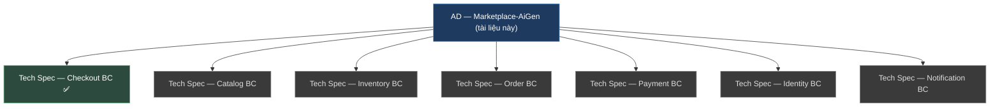
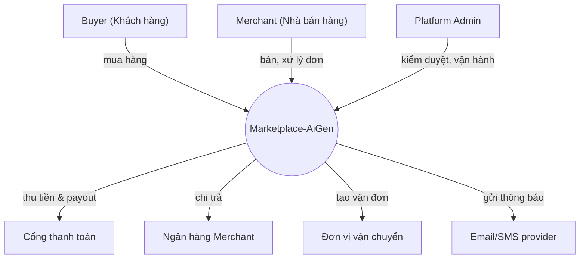
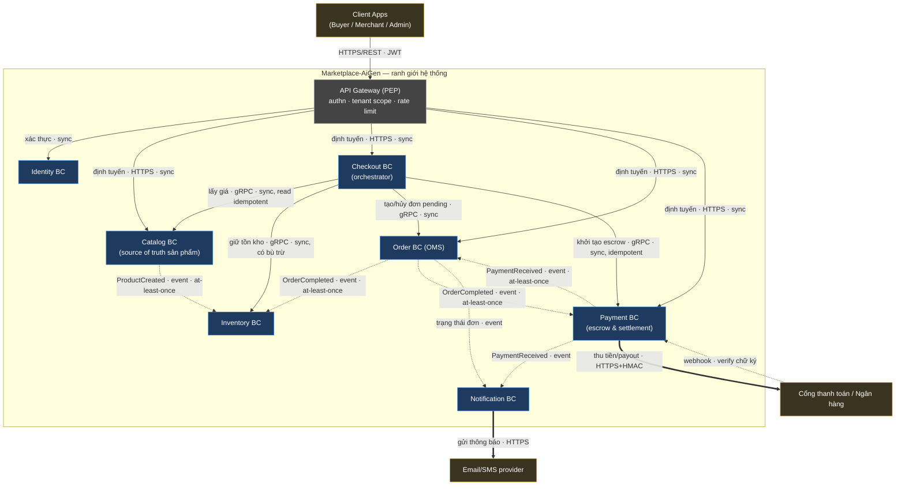
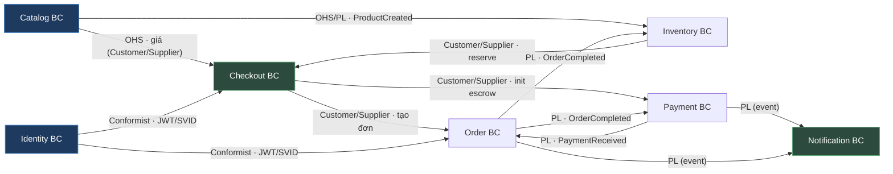
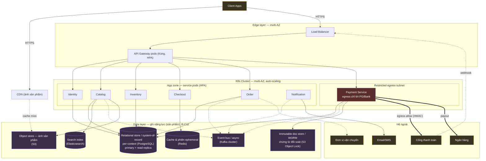
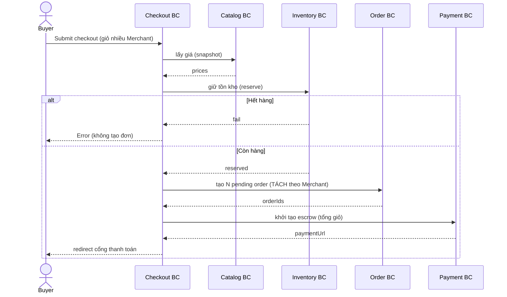
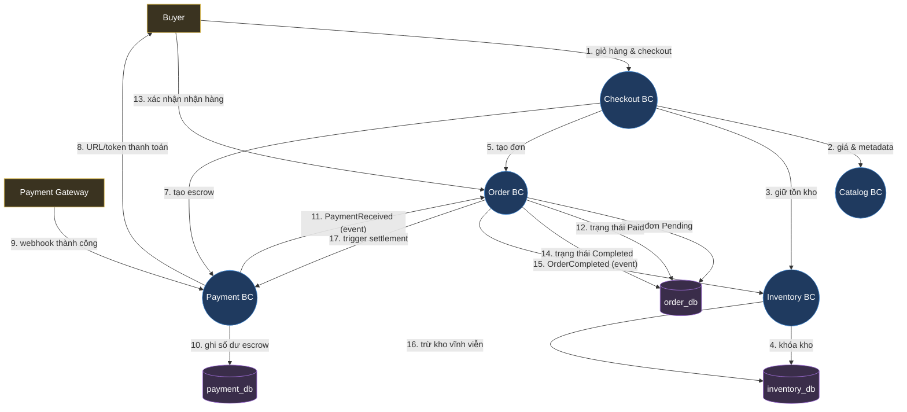
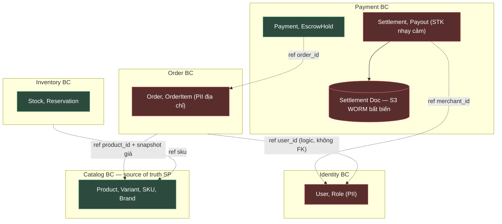
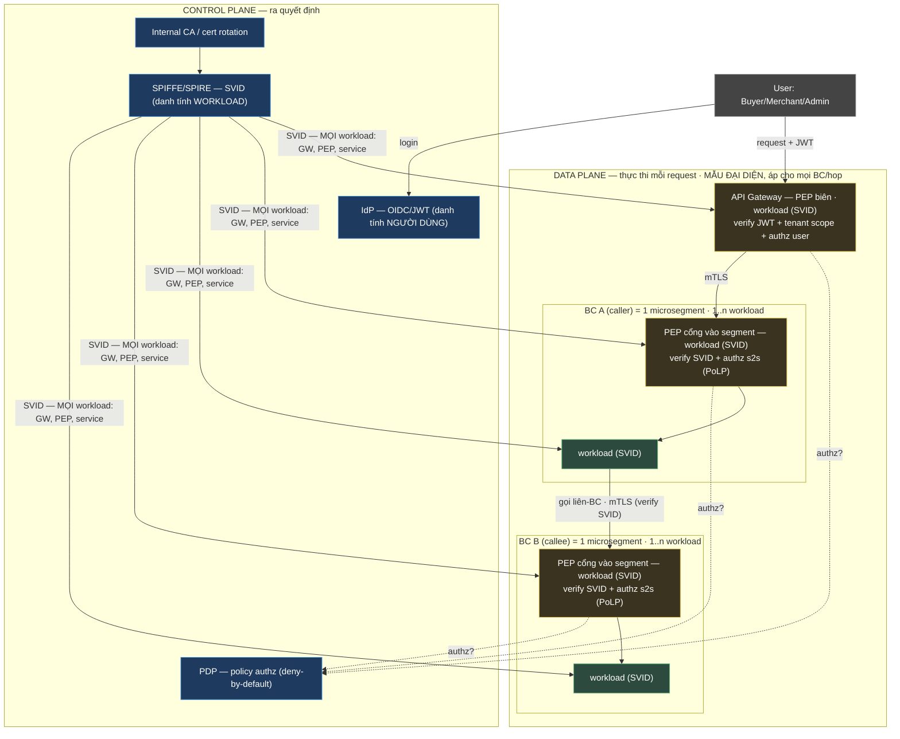

# ARCHITECTURE DOCUMENT (AD) — Marketplace-AiGen

| Thông tin tài liệu | Giá trị |
| --- | --- |
| Mã tài liệu | `AD-MKTPLACE-AIGEN-v1.1` |
| Loại | **Architecture Document (AD)** — cấp hệ thống (**1 file / hệ thống**) |
| Phiên bản | `1.1.0` |
| Trạng thái | ☐ Draft for review |
| Ngày tạo | 2026-06-22 |
| Cập nhật lần cuối | 2026-06-22 |
| Dự án / Hệ thống | Marketplace-AiGen (E-commerce Marketplace, multi-merchant) |
| Mức độ bảo mật | ☑ Internal |
| Quy tắc viết | `STD-DOC-v1.11` — [docs/stds/QuyTac-AD-va-TechSpec.md](../stds/QuyTac-AD-va-TechSpec.md) |
| Neo chuẩn | ISO/IEC/IEEE 42010:2022 · arc42 · C4 · DDD Context Mapping |
| Sơ đồ | Mermaid (toàn bộ) |
| Ngoài phạm vi | **Architecture-as-Code** (sinh view từ model, fitness function, drift detection, pipeline) — chuẩn hóa ở tài liệu riêng sau. Xem `docs/QuyTac-AD-ArchitectureAsCode.md`. |

**Lịch sử thay đổi**

| Phiên bản | Ngày | Tác giả | Mô tả thay đổi | Người duyệt |
| --- | --- | --- | --- | --- |
| 1.0.0 | 2026-06-22 | [Tác giả] | Tạo mới theo `STD-DOC-v1.11`; template đầu mục theo SAD | [Duyệt] |
| 1.1.0 | 2026-06-22 | [Tác giả] | Bỏ §3 "Các thành phần" (trùng bảng BC §2.2 — capability gom về §2.2; con trỏ Tech Spec ở Phụ lục A.4; Edge/Gateway nêu trong §2.2). Bỏ §6.2 ERD & §6.3 Schema (header rỗng — bất biến no-FK gộp vào §6.1, ERD/schema → Tech Spec). Đánh số lại §3–§10 cho liền mạch. | [Duyệt] |

> **Mô hình tài liệu (R-0 của `STD-DOC-v1.11`):** hệ thống có **đúng 01 AD này** + **01 Tech Spec / bounded context (BC)**, **không phụ thuộc số lượng BC**. AD giữ thứ ổn định (ranh giới giữa BC, liên kết, quyết định cấp hệ thống); chi tiết hiện thực (schema cột, field/mã lỗi, framework từng BC) **đẩy xuống** Tech Spec/contract. Bảng ánh xạ AD ↔ Tech Spec ở **Phụ lục A**.

# 1. TỔNG QUAN HỆ THỐNG

## 1.1 Mục tiêu hệ thống

Marketplace-AiGen là sàn TMĐT **multi-merchant**: một Buyer mua từ nhiều Merchant trong một phiên; hệ thống tự **tách đơn theo Merchant**, giữ tiền qua **escrow** đến khi giao hàng hoàn tất, rồi **đối soát & chi trả** tự động.

| # | Mục tiêu | Mô tả | Quality goal (đo được) |
| --- | --- | --- | --- |
| M1 | Vận hành sàn multi-merchant | Buyer mua từ nhiều Merchant; hệ tự tách đơn | ≥ 10.000 Merchant; tách đơn chính xác 100% |
| M2 | Thanh toán an toàn qua escrow | Giữ tiền đến khi đơn hoàn tất | 0 sự cố mất/lệch tiền; đối soát khớp 100% |
| M3 | Đối soát & chi trả tự động | Phí sàn/hoa hồng; payout Merchant | Payout đúng hạn ≥ 99%; chứng từ bất biến |
| M4 | Catalog là nguồn sự thật sản phẩm | Source of truth cho hiển thị/tìm kiếm | Duyệt < 24h; search P95 < 200 ms |
| M5 | Chịu tải cao điểm | Flash sale, sự kiện | 3.000 RPS sustained; checkout P99 < 800 ms |

> _Quy tắc (R-A2):_ AD nêu **quality goal đo được**; KPI vận hành chi tiết → dashboard (ngoài AD). Hành vi & SLO từng BC → Tech Spec tương ứng.

## 1.2 Phạm vi hệ thống

### 1.2.1 Trong phạm vi

* Quản lý tài khoản, xác thực danh tính, phân quyền theo vai trò (Buyer, Merchant, Admin).
* Quản lý danh mục sản phẩm, thương hiệu; kiểm duyệt nội dung trước khi hiển thị; tìm kiếm toàn văn.
* Theo dõi tồn kho, giữ chỗ (reservation) khi đặt đơn; trừ kho vĩnh viễn khi đơn hoàn tất.
* Điều phối đặt hàng: tự động **tách đơn theo Merchant**, tính giá, áp khuyến mãi.
* Quản lý vòng đời đơn hàng qua **state machine** (từ tạo đến hoàn tất/huỷ).
* Thanh toán qua cổng bên thứ ba, **escrow**, đối soát tự động, payout Merchant.

### 1.2.2 Ngoài phạm vi

* **Vận chuyển vật lý** — dùng Courier ngoài, chỉ tích hợp.
* **Kế toán/ERP** — nhận dữ liệu đối soát qua file/API.
* **BI/Analytics, CSKH/ticketing** — hệ riêng.
* **Rating & Dispute** — _chưa_ có ở v1.0 (lộ trình: ADR-0012).

### 1.2.3 Sơ đồ ngữ cảnh (Context Diagram — C4 Level 1)

> _Quy tắc (D.1):_ L1 chỉ "nối ai, để làm gì" — **không protocol, không lộ BC**.

| Hệ thống ngoài | Loại tương tác | Mô tả |
| --- | --- | --- |
| Cổng thanh toán | API + Webhook | Thu tiền Buyer; callback kết quả |
| Ngân hàng Merchant | API | Payout sau đối soát |
| Đơn vị vận chuyển | API | Tạo vận đơn; theo dõi giao hàng |
| Email/SMS provider | API | Thông báo trạng thái đơn |

## 1.3 Các bên liên quan (Stakeholders)

| Bên liên quan | Vai trò | Loại | Kỳ vọng (concern) |
| --- | --- | --- | --- |
| Buyer | End user | External | Mua nhanh; tiền an toàn (escrow) |
| Merchant | End user | External | Nhận đơn kịp thời; payout đúng & đủ |
| Platform Admin | Operator | Internal | Kiểm duyệt; xử lý vận hành |
| Finance team | Interested | Internal | Đối soát khớp; chứng từ bất biến |
| Security team | Interested | Internal | Cô lập tenant; audit đầy đủ; Zero-Trust |
| SRE / Ops | Interested | Internal | Dễ vận hành; quan sát được; phục hồi nhanh |

## 1.4 Giả định & Ràng buộc

### 1.4.1 Giả định

* Cổng thanh toán hỗ trợ giữ tiền/escrow hoặc cho phép mô phỏng escrow phía sàn.
* Cao điểm ≤ 3.000 RPS giai đoạn đầu.
* Mỗi Buyer có thể mua từ nhiều Merchant trong một giỏ → bắt buộc tách đơn.

### 1.4.2 Ràng buộc

| Loại | Ràng buộc | Tác động thiết kế |
| --- | --- | --- |
| Kỹ thuật | PostgreSQL chuẩn org; **Kafka** làm event bus | DB-per-context; không FK xuyên BC |
| Pháp lý | NĐ 13/2023 (PII); chứng từ tài chính lưu bất biến | WORM/Object Lock cho result bucket; data residency |
| Tài chính | Tiền escrow là tiền thật của khách | Idempotency + audit bắt buộc cho mọi thao tác tiền |
| Tổ chức | Multi-tenant (nhiều Merchant) | Tenant isolation xuyên suốt authz |

> _Quy tắc (R-A3 / R-C1):_ giá trị cấu hình cụ thể (TTL, sizing, threshold, secret) → Tech Spec/config/Vault, **không** ở AD.
>
> ⚠️ **Open item (TBD):** IAM policy chi tiết cho S3 result bucket (chứng từ đối soát) — nguyên tắc đã chốt (write-once, deny overwrite/delete), policy literal chờ ADR riêng. Xem §5.2.3, §6.3.

# 2. KIẾN TRÚC TỔNG THỂ

## 2.1 Kiểu kiến trúc

| Kiểu | Lý do | Trade-off |
| --- | --- | --- |
| Microservices theo Bounded Context (DDD) + **Orchestration** (Checkout) + **Event-Driven** | Mỗi BC scale & deploy độc lập; Checkout điều phối luồng tiền phức tạp; event cho liên kết lỏng | Phức tạp phân tán: saga/compensation, distributed tracing, eventual consistency |

### 2.1.1 Nguyên tắc thiết kế kiến trúc

* **Database per Context** — không chia sẻ DB, **không FK xuyên BC**.
* **API-First** — contract rõ ràng (REST ngoài, gRPC nội bộ giữa BC).
* **Orchestration cho luồng tiền** — Checkout điều phối đồng bộ; sai bước → compensation (saga).
* **Idempotency cho mọi thao tác tiền** — escrow, payout, webhook.
* **Tenant isolation** — mọi truy vấn gắn `merchant_id`; Merchant chỉ thấy dữ liệu của mình.
* **Chứng từ tài chính bất biến** — ghi một lần, không sửa/xóa (WORM).
* **Secrets ở Vault** — không trong tài liệu/code.

> **Phân loại công nghệ (R-C3 / R-C11):** ghi **năng lực (sản phẩm)** — năng lực là cái binding, sản phẩm là hiện thực.
> - **Binding** (load-bearing toàn hệ thống — ràng buộc chất lượng/khả mở rộng): event bus / async (Kafka) · relational store per-context (PostgreSQL) · immutable doc store / WORM (S3 Object Lock) · search index (Elasticsearch) · cache & phiên ephemeral (Redis).
> - **Indicative** (đẩy xuống Tech Spec): runtime/framework **từng BC** → quyết định **polyglot** (Java/Spring, Go, Node.js, Python tùy BC), **không** liệt kê như ràng buộc ở AD.

## 2.2 Sơ đồ kiến trúc cấp cao (C4 — mức BC, BC là hộp đục)

> _Quy tắc (R-0 + R-D2 + R-D5 + R-D6 + R-C9):_ mỗi **BC là một hộp đục** trong **vùng bao ranh giới hệ thống** — **không** vẽ ruột (service/datastore/framework); decompose nội bộ là L3 → Tech Spec của team sở hữu. Sơ đồ chỉ thể hiện **quan hệ giữa BC + hợp đồng/đảm bảo trên mỗi cạnh** (ý định + protocol + sync/async; **cấm** tên RPC method — thuộc contract §4). Quyền-sở-hữu-datastore **không** ở đây → §5 (sở hữu logic) & §2.4 (deployment, dạng rule). View **không phình** theo số BC: thêm BC = thêm một hộp.

**Legend:** ▢ vùng bao = ranh giới hệ thống · 🟦 Bounded Context (hộp đục) · ▭ API Gateway (edge/PEP) · 🟨 hệ ngoài. **Nét liền** = đồng bộ (sync, gRPC/HTTPS); **nét đứt** = event bất đồng bộ (Published Language). Nhãn cạnh = *ý định · protocol · đảm bảo*.

> **Công nghệ binding (ràng buộc kiến trúc — R-C9/R-C11, ghi `năng lực (sản phẩm)`):** **event bus / async (Kafka)** là kênh của mọi cạnh nét đứt (xem §2.1.1 & §2.4). Các hạ tầng binding khác — **relational store per-context (PostgreSQL)**, **immutable doc store / WORM (S3 Object Lock)**, **search index (Elasticsearch)**, **cache & phiên ephemeral (Redis)** — thể hiện ở **§2.4 Deployment** (rule hạ tầng) & **§5** (sở hữu logic), không vẽ trong sơ đồ này. Framework/runtime *từng BC* là **indicative** → Tech Spec, không nêu ở AD.

| BC (hộp) | Trách nhiệm / capability | Bề mặt giao tiếp (cung cấp · tiêu thụ) |
| --- | --- | --- |
| Identity | Authn (OIDC/JWT), RBAC 3 vai trò, cấp SVID workload | Cung cấp: xác thực JWT/SVID (sync) |
| Catalog | Sản phẩm/biến thể/SKU (source of truth), kiểm duyệt, search | Cung cấp: lấy giá (sync); `ProductCreated` (event) |
| Inventory | Tồn kho, reservation, trừ kho khi đơn hoàn tất | Cung cấp: giữ/giải phóng tồn kho (sync) · Tiêu thụ: `ProductCreated`, `OrderCompleted` (event) |
| Checkout | **Orchestrator**: tách đơn, điều phối saga | Cung cấp: `POST /v1/checkout` · Tiêu thụ: giá, reserve, tạo đơn, escrow (sync) |
| Order (OMS) | State machine đơn; snapshot giá | Cung cấp: tạo/hủy pending order (sync); `OrderCompleted` (event) · Tiêu thụ: `PaymentReceived` (event) |
| Payment | Escrow, đối soát, payout, chứng từ WORM | Cung cấp: init escrow (sync), webhook; `PaymentReceived` (event) · Tiêu thụ: `OrderCompleted` (event) |
| Notification | Thông báo đa kênh (email/SMS) | Tiêu thụ: `PaymentReceived`, `OrderCompleted` & trạng thái đơn (event) |

> **Edge — API Gateway / BFF (hạ tầng, không phải BC):** định tuyến · verify JWT · rate-limit & WAF · gắn tenant scope · TLS termination. Là **PEP biên** (cơ chế ở §6), không phải một bounded context.

## 2.3 DDD Context Map _(optional — áp dụng vì dự án dùng DDD)_

> _Quy tắc (§6 của `STD-DOC-v1.11`):_ mục này **optional**; bắt buộc nếu team dùng DDD, bỏ được nếu không (chiều phụ thuộc đã có ở bảng §2.2). Nó thể hiện **hai lớp**: **(a) quan hệ cộng tác giữa các team sở hữu BC** (Conway's law — Customer–Supplier, Partnership, Conformist, Shared Kernel) và **(b) ngữ nghĩa tích hợp dữ liệu tại biên** (ACL, OHS, Published Language). §2.2 cho *topology + hợp đồng*; §2.3 cho *quan hệ đội + kiểu dịch dữ liệu*. U = upstream, D = downstream.

| Quan hệ | Kiểu DDD | Ghi chú |
| --- | --- | --- |
| Catalog → Checkout (giá) | **Open Host Service** / Customer–Supplier | Checkout dùng **ACL**: chỉ lấy *snapshot giá*, không phụ thuộc model nội bộ Catalog |
| Inventory → Checkout (reserve) | Customer–Supplier | Checkout là Customer; Inventory là Supplier |
| Checkout → Order / Payment | Customer–Supplier | Checkout điều phối; Order/Payment cung cấp capability |
| Catalog/Payment/Order → subscribers | **Published Language** (event schema) | Event là hợp đồng công khai (AsyncAPI), không phải phụ phẩm publisher |
| Identity → mọi BC | **Conformist** | JWT (user) + SVID (workload); BC tuân theo định dạng danh tính |

## 2.4 Mô hình triển khai

### 2.4.1 Môi trường triển khai

| Môi trường | Hạ tầng | Đặc điểm |
| --- | --- | --- |
| Development | Docker Compose | Dữ liệu giả |
| Staging | K8s namespace | Mirror prod, dữ liệu ẩn danh |
| Production | K8s multi-AZ | HA, auto-scaling, full monitoring |

### 2.4.2 Sơ đồ triển khai Production (C4 Deployment)

> _Quy tắc (R-D4):_ mỗi hộp là **node hạ tầng** HOẶC **instance của một BC/container** đã định nghĩa ở §2.2 — không hộp "lửng".

### 2.4.3 Chiến lược triển khai

Rolling update mặc định; **Canary** cho Checkout/Payment (rủi ro cao); Feature flag cho khuyến mãi; Blue/Green khi đổi schema breaking. (YAML/IaC literal, số sizing → Tech Spec/IaC — R-C1.)

# 3. LUỒNG DỮ LIỆU

> _Quy tắc (R-A7 / R-D7 / R-D9):_ AD chỉ giữ kịch bản **xuyên nhiều BC**; flow nội bộ một BC → Tech Spec. **Sequence** là mặc định cho thứ tự thời gian — flow rất đơn giản thì mô tả **prose** (vd §3.1.2, §3.1.3), không ép vẽ. **DFD** (§3.2) bổ trợ khi cần thấy *dữ liệu chảy đi đâu*, ở **mức loại dữ liệu** (không field/schema). Pseudocode/log không thuộc AD.

## 3.1 Luồng chính (Happy Path)

### 3.1.1 Checkout & tách đơn (Orchestration)

### 3.1.2 Thanh toán → cập nhật đơn

Cổng thanh toán → Payment webhook (verify chữ ký) → Payment giữ tiền (escrow) → phát `PaymentReceived` → Order chuyển "To Ship" → Notification báo Merchant.

### 3.1.3 Hoàn tất & đối soát (Settlement)

Buyer xác nhận nhận hàng → Order "Completed" → phát `OrderCompleted` → Inventory trừ kho vĩnh viễn; Payment tính hoa hồng → release escrow → payout về ngân hàng Merchant → sinh chứng từ đối soát (ghi **bất biến** lên S3 WORM).

## 3.2 Data Flow Diagram (mức loại dữ liệu)

> _Quy tắc (D.4 / R-D9–R-D11):_ DFD ở **mức loại dữ liệu** — nhãn flow là *loại dữ liệu/ý định*, **không** field/cột/DDL. **Process** = BC (đã định nghĩa §2.2); **datastore** = store BC sở hữu (khớp §5). **Legend:** 🟨 external entity · 🟦 process (BC) · 🟪 datastore. Flow **đánh số** theo trình tự dữ liệu di chuyển.

## 3.3 Luồng bất đồng bộ (Event-Driven)

> _Quy tắc (R-C3):_ event là **Published Language** — hợp đồng công khai (AsyncAPI), không phải phụ phẩm publisher. Schema field đầy đủ → contract artifact.

| Event | Publisher | Subscriber(s) | Đảm bảo (delivery / ordering / idempotency) |
| --- | --- | --- | --- |
| ProductCreated | Catalog | Inventory | at-least-once · per productId · consumer idempotent |
| PaymentReceived | Payment | Order, Notification | at-least-once · per orderId · consumer idempotent |
| OrderCompleted | Order | Inventory, Payment | at-least-once · per orderId · consumer idempotent |

# 4. GIAO DIỆN HỆ THỐNG

> _Quy tắc (R-A15 / R-C6):_ AD nêu interface ở mức **capability + đảm bảo**; đặc tả đầy đủ field/method/mã lỗi → **OpenAPI/proto** (sync) và **AsyncAPI + schema registry** (async). AD **trỏ tới**, không sao chép.
>
> _Quy tắc (R-D8 — không sơ đồ trùng):_ mục này dùng **bảng** (inventory capability + bảng đảm bảo §4.1.4), **không** vẽ sơ đồ trust-boundary/PEP — bức tranh biên & cơ chế enforce thuộc **§6 Kiến trúc bảo mật** (xem sơ đồ ZTA ở đó). Bảng §4.1.2 chỉ *phân loại* interface theo biên và trỏ §6.

## 4.1 Internal APIs

### 4.1.1 Quy ước chung

| Quy ước | Áp dụng |
| --- | --- |
| Base URL | `https://api.marketplace.com/v{version}` |
| Auth | Bearer JWT (RS256); service-to-service mTLS |
| Internal RPC | gRPC giữa các BC |
| Versioning | URL `/v1/`, hỗ trợ N-1 |
| Error format | `{error:{code, message, details[]}}` |
| ID / Time | UUID v4 · ISO 8601 UTC |

### 4.1.2 Phân loại interface theo ranh giới tin cậy

| Nhóm | Ranh giới | Cơ chế bảo vệ |
| --- | --- | --- |
| Public (qua Gateway) | Internet → edge | Authn, rate limit, validation, **tenant scope**, WAF |
| Inter-context (gRPC) | VPC nội bộ | mTLS + service account (SVID) |
| Outbound (PG/Bank) | Nội bộ → ngoài | HMAC, timeout, retry, secret ở Vault, egress hạn chế |
| Inbound webhook | Ngoài → nội bộ | Verify chữ ký, allowlist IP, idempotency |

### 4.1.3 Danh sách interface quan trọng (mức capability)

> _Quy tắc (R-B10/R-D2):_ liệt kê ở mức **capability**, không phải tên method literal. Tên proto/route đầy đủ → contract artifact.

| # | Loại | Capability | Provider → Consumer | Auth |
| --- | --- | --- | --- | --- |
| 1 | gRPC | Lấy giá (snapshot) | Catalog → Checkout | mTLS |
| 2 | gRPC | Giữ tồn kho (reserve/release) | Inventory → Checkout | mTLS |
| 3 | gRPC | Tạo/hủy pending order | Order → Checkout | mTLS |
| 4 | gRPC | Khởi tạo escrow | Payment → Checkout | mTLS |
| 5 | REST | Webhook thanh toán | Cổng thanh toán → Payment | Chữ ký + idempotency |

### 4.1.4 Bảng "đảm bảo tương tác" (R-C7)

| Interface/Event | sync/async | consistency | idempotency | ordering | delivery | hành vi lỗi / suy giảm |
| --- | --- | --- | --- | --- | --- | --- |
| Lấy giá | sync | strong (read) | n/a (read) | n/a | request/response | Catalog down → checkout 503 (fail-safe) |
| Giữ tồn kho | sync | strong | có (theo reservation) | n/a | request/response | fail → 409; compensation release |
| Init escrow | sync | strong | có (theo key) | n/a | request/response | lỗi → compensation (cancel order + release) |
| Webhook thanh toán | async (inbound) | eventual | có (verify + dedupe) | n/a | at-least-once | retry; chống replay |
| Event (Kafka) | async | eventual | consumer idempotent | per key | at-least-once | retry + DLQ |

## 4.2 External Integration Points

| Hệ thống | Loại | Ranh giới | Dữ liệu qua biên | Resilience | Compliance |
| --- | --- | --- | --- | --- | --- |
| Cổng thanh toán | Payment | Outbound + webhook | Số tiền, orderRef (không PAN) | Timeout 30s, fallback reconcile | Subprocessor, DPA |
| Ngân hàng Merchant | Payout | Outbound | STK (nhạy cảm), số tiền | Retry + đối soát thủ công | Hợp đồng ngân hàng |
| Đơn vị vận chuyển | Logistics | Outbound | Địa chỉ (PII) | Retry → queue | Subprocessor, DPA |
| Email/SMS | Notification | Outbound | SĐT/email (PII) | Fallback kênh khác | Subprocessor |

# 5. KIẾN TRÚC DỮ LIỆU

> _Quy tắc (R-A9 / R-C1):_ AD nêu **quyền sở hữu, ranh giới, phân loại, bất biến**. Schema cột / ERD chi tiết / DDL → Tech Spec từng BC.

## 5.1 Tổng quan kiến trúc dữ liệu

> _Quy tắc (R-A23 / R-C11):_ nêu **BC sở hữu loại dữ liệu gì** + **năng lực lưu trữ cần** (capability-first `năng lực (sản phẩm)`). Không cột "tên DB vật lý" (suy ra từ DB-per-context → Tech Spec/IaC), không cột "Loại: sản phẩm" trần.

| BC (chủ sở hữu) | Dữ liệu sở hữu | Năng lực lưu trữ cần (hiện thực) | Đặc tính buộc chọn |
| --- | --- | --- | --- |
| Identity | User, Role (PII) | relational / system-of-record (PostgreSQL) | ACID, audit |
| Catalog | Product/Variant/SKU/Brand; ảnh sản phẩm | relational (PostgreSQL) + search index (Elasticsearch) + object store (S3) | source-of-truth + full-text search + lưu blob |
| Inventory | Stock, Reservation | relational (PostgreSQL) | nhất quán tồn kho |
| Order | Order, OrderItem (PII địa chỉ) | relational (PostgreSQL) | ACID, state machine |
| Payment | Payment/Escrow/Settlement; chứng từ đối soát | relational (PostgreSQL) + immutable doc store / WORM (S3 Object Lock) | ACID + **chứng từ bất biến** |
| Checkout | Phiên checkout (ephemeral) | cache & phiên ephemeral (Redis) | tốc độ, TTL ngắn, không bền |

> **Bất biến dữ liệu (cấp AD):** **không FK vật lý xuyên BC** — tham chiếu chéo (vd `order_id` ở Payment, `product_id` ở Order) chỉ là *reference logic* (xem sơ đồ §5.1). **ERD / schema cột / DDL chi tiết → Tech Spec (mục Interfaces & data) của từng BC**, không ở AD (R-A9 / R-C1).

## 5.2 Chiến lược quản lý dữ liệu

### 5.2.1 Migration

Flyway; backward-compatible ≥ 1 deploy cycle.

### 5.2.2 Backup

DB chính daily full + hourly incremental (Payment tier-1: RPO < 5 phút).

### 5.2.3 Data Lifecycle & phân loại

| Loại dữ liệu | Retention | Khi hết hạn | Cơ sở |
| --- | --- | --- | --- |
| PII (hồ sơ, địa chỉ) | TK active + 30 ngày | Anonymize | NĐ 13/2023 |
| Giao dịch / đơn | 10 năm | Archive → purge | Luật kế toán |
| Chứng từ đối soát (S3) | 10 năm | Immutable (WORM) | Compliance tài chính |
| Audit log | 5 năm | Immutable (Object Lock) | Compliance |

> ⚠️ **TBD (R-A22):** IAM policy chi tiết cho S3 result bucket — nguyên tắc: write-once, deny overwrite/delete kể cả owner; policy literal chờ ADR riêng. Xem §6.3.

# 6. KIẾN TRÚC BẢO MẬT

> Hướng theo Zero-Trust (NIST SP 800-207). _Quy tắc (R-A10):_ AD nêu **mô hình** (trust boundary, authn/authz, mã hóa, ZTA target vs current); IAM policy literal, rule cụ thể → Tech Spec/policy.

> _Quy tắc (R-D12):_ đây là **pattern view** — vẽ *cơ chế* trên **mẫu đại diện** (1 hop: BC gọi → BC nhận), **không enumerate** mọi BC (vài chục BC sẽ rối O(N²)). Đơn vị enforce là **workload** (một BC có thể có nhiều workload), không phải BC. Cơ chế dưới đây **áp cho mọi BC và mọi hop**.

**Ba kiểm tra độc lập mỗi request (đừng gộp):** (1) xác thực **người dùng** (JWT RS256), (2) xác thực **workload** (mTLS/SVID), (3) **phân quyền** (PDP). **PEP đặt ở mọi ranh giới** — biên (API Gateway) *và* **cổng vào mỗi BC** (authz service-to-service, PoLP) — không chỉ ở Gateway. Nguyên tắc nền: *deny-by-default*, *verify per-request*, *least privilege*, *assume breach* — **không tin theo vị trí mạng**.

> **Lưu ý mô hình hóa:** (1) PEP/sidecar/SVID gắn với **workload**, không phải BC; một BC có thể chứa nhiều workload (1 BC ≠ 1 service — R-E1). (2) **API Gateway và PEP cổng vào segment bản thân chúng cũng là workload** và **nhận SVID** — SPIFFE "workload" = bất kỳ process cần danh tính, gồm gateway/ingress/sidecar. Trong mesh sidecar, chính **sidecar (PEP) giữ SVID & kết thúc mTLS**, app process phía sau nói loopback. Do đó SPIRE cấp SVID cho **mọi** thành phần tham gia mTLS, không chỉ service nghiệp vụ.

> **Microsegmentation (R-A24) — quyết định của AD này:** chọn **mặc định 1 BC = 1 microsegment** (PEP ở cổng vào mỗi BC). Cho phép granularity khác khi cần và phải nêu rõ:
> - **Gom nhóm:** gộp các BC quan hệ chặt (chatty, cùng đội/mức tin cậy) thành **một segment** — ít PEP-hop hơn nhưng **blast radius lớn hơn**.
> - **Per-workload (strict ZTA):** mỗi workload một segment — isolation mạnh nhất, overhead cao nhất.
>
> Ví dụ cân nhắc gom nhóm cho Marketplace-AiGen: cụm luồng tiền **Checkout + Order + Payment** rất chatty trong saga — có thể là một segment nội bộ (vẫn giữ PEP biên cụm + mTLS), đánh đổi blast radius. _Hiện tại giữ per-BC để cô lập Payment (Tier-1, tiền thật)._

## 6.1 Xác thực (Authentication)

* **Người dùng:** OIDC + JWT (RS256); IdP phát token; access TTL ngắn, refresh dài; MFA bắt buộc cho Admin & Merchant rút tiền; SSO Merchant tùy chọn.
* **Workload:** SPIFFE/SPIRE cấp **SVID** cho mỗi workload; là nền tảng cho mTLS (§6.3) và authz service-to-service. Không service nào được tin chỉ vì nằm trong VPC.

## 6.2 Phân quyền (Authorization)

Mô hình **PDP/PEP**: quyết định tập trung ở **PDP** (policy-as-code), thực thi ở **PEP** đặt **mọi ranh giới** — Gateway (request người dùng) **và cổng vào mỗi BC** (gọi service-to-service, gắn với workload), **per-request** + **deny-by-default**. Authz s2s thực thi **PoLP**: caller chỉ gọi đúng capability được cấp (vd Checkout chỉ được init escrow ở Payment, không gọi op khác). Nội dung policy = **RBAC + tenant isolation**: mọi truy vấn dữ liệu Merchant gắn `merchant_id`; Merchant A **không** truy cập dữ liệu Merchant B.

### 6.2.1 Role & Permission Matrix

| Resource / Action | Admin | Merchant | Buyer |
| --- | --- | --- | --- |
| Sản phẩm (CRUD của mình) | ✔ tất cả | ✔ của mình | ✘ |
| Duyệt sản phẩm | ✔ | ✘ | ✘ |
| Đơn hàng | ✔ tất cả | ✔ của mình | ✔ của mình |
| Payout/đối soát | ✔ | ✔ xem của mình | ✘ |
| Chứng từ đối soát (S3) | đọc | đọc của mình | ✘ |

## 6.3 Mã hóa (Encryption)

* **In-transit:** TLS 1.3 ở biên ngoài; mTLS giữa mọi workload nội bộ — chứng chỉ là SVID do SPIRE/CA cấp & xoay tự động.
* **At-rest:** AES-256 (KMS/Vault); STK ngân hàng & PII mã hóa field-level.
* **Chứng từ đối soát:** S3 + Object Lock (WORM) — _quyết định: write-once, deny overwrite/override_; IAM policy chi tiết **TBD** (cần ADR, kèm legal-hold & retention).

## 6.4 Bảo mật API (PEP tại từng ranh giới)

| Ranh giới | PEP | Enforce |
| --- | --- | --- |
| Public (Internet → edge) | API Gateway | Verify JWT, tenant scope, rate limit, validation, WAF |
| Inter-service (cổng vào mỗi BC) | PEP gắn workload (vd sidecar) | mTLS (verify SVID) + authz s2s qua PDP (PoLP) |
| Outbound (PG/Bank) | Egress policy | Secret từ Vault, egress hạn chế chỉ tới đích cho phép |
| Inbound webhook | Gateway/handler | Verify chữ ký + allowlist IP + idempotency |

Bổ sung: CORS allowlist · CSRF cho state-changing · validate server-side (không tin client).

## 6.5 Kiểm tra & Tuân thủ bảo mật

> _Quy tắc (PHẦN F của `STD-DOC-v1.11`):_ AD ghi **invariant** + điểm cần **người review (gate)**. Cơ chế **thực thi tự động** (fitness function / policy-as-code trong CI) thuộc phạm vi **AaC** — tách riêng.

**Invariant bảo mật cấp hệ thống** (theo mô hình microsegmentation §6, mặc định 1 BC = 1 segment; enforcement tự động → AaC, sau):

| Invariant | Ghi chú |
| --- | --- |
| Mọi giao tiếp **xuyên microsegment** là mTLS (verify SVID), không plaintext | intra-segment tùy flavor (mesh: cũng mТLS; segment-gateway: vùng tin cậy nội bộ) |
| **Default-deny giữa các segment** — lateral movement bị chặn ở ranh giới | NetworkPolicy/mesh authz; chỉ mở cặp được phép |
| Không lưu lượng nào **bypass PEP** cổng vào/ra segment | cross-segment qua PEP ingress; outbound qua PEP egress |
| Authz s2s theo **PoLP** (caller chỉ gọi capability được cấp) + PDP **deny-by-default** | — |
| Mọi route public có authn + **tenant scope** | tại PEP biên (Gateway) |
| Webhook luôn verify chữ ký + idempotency | — |
| Payment egress chỉ tới PG/Bank (qua PEP egress của segment) | — |
| Mọi workload tham gia mТLS có **SVID** (gồm Gateway/PEP), cert xoay tự động | — |
| Không secret hardcode · S3 bật Object Lock | — |

**Cần người review (gate, phán đoán):** luồng tiền mới · truy cập xuyên tenant · đổi policy chứng từ bất biến · **đổi ranh giới microsegmentation (gom/tách segment, đổi flavor)** · mỗi cột mốc nâng cấp ZTA. Sai một bước có thể mất tiền/rò rỉ dữ liệu/vi phạm pháp lý hoặc **nới blast radius** — máy không thay người quyết định được.

> ⚠️ **Target vs current (R-A10):** ZTA là hành trình nhiều giai đoạn. *Hiện trạng:* mTLS qua mesh + PEP tại Gateway đã có. *Đang triển khai:* PDP tập trung + per-request authz ở sidecar (GĐ2); SPIRE federation (GĐ3). Mỗi cột mốc ZTA = 1 thay đổi kiến trúc → 1 ADR riêng. Sơ đồ trên là kiến trúc **mục tiêu**.

# 7. HIỆU NĂNG & KHẢ NĂNG MỞ RỘNG

## 7.1 Yêu cầu hiệu năng (quality requirements)

| Metric | Target | Điều kiện |
| --- | --- | --- |
| Checkout P99 | < 800 ms | Gồm orchestration nhiều BC |
| Search P95 | < 200 ms | Catalog/ES |
| API P99 (khác) | < 500 ms | Normal |
| Error rate | < 0.1% | Normal |

**Quality scenario (mẫu):** _Cao điểm flash sale 3.000 RPS_ → checkout P99 vẫn < 800 ms nhờ HPA + Redis cache giá + partition Kafka theo `merchant_id`. _Escrow lệch_ → alert P1 + freeze payout (đảm bảo M2: 0 lệch tiền).

## 7.2 SLA

Payment/Order 99.95% · Checkout 99.9% · Catalog/Search 99.5%.

## 7.3 Capacity Planning

Ước tính từ DAU × đơn/user; Payment & Order là tier-1. Headroom 3–5x.

## 7.4 Chiến lược Scaling

### 7.4.1 Horizontal

K8s HPA (CPU>70%/RPS); stateless services; read replica cho Catalog; partition Kafka theo `merchant_id`.

### 7.4.2 Caching

CDN (ảnh/sản phẩm) · Redis (phiên checkout, giá) · local (feature flags).

# 8. XỬ LÝ LỖI & KHẢ NĂNG PHỤC HỒI

## 8.1 Phân loại và xử lý lỗi

Chuẩn HTTP (400/401/403/404/409/422/429/500/503); error model `{error:{code,message,details[]}}` — hành động chi tiết ở runbook (ngoài AD).

## 8.2 Resilience Patterns

* **Saga + compensation** (Checkout): reserve → create order → init escrow; bước sau lỗi → release reservation + hủy pending order (ngược thứ tự).
* **Idempotency (bắt buộc):** webhook thanh toán, payout, escrow.
* **Circuit Breaker** gọi cổng thanh toán/ngân hàng; **Timeout** mọi I/O; **Graceful degradation** search lỗi → cache.

> **Invariant cấp hệ thống:** không bao giờ để **reservation/pending order mồ côi** sau khi saga checkout thất bại. (Enforcement tự động → AaC.)

## 8.3 Disaster Recovery (DR)

### 8.3.1 RTO / RPO

| Tier | RTO | RPO | Gồm |
| --- | --- | --- | --- |
| 1 Critical | < 1h | < 5min | Identity, Payment, Order |
| 2 Business | < 4h | < 1h | Checkout, Inventory |
| 3 Important | < 24h | < 4h | Catalog, Notification |

### 8.3.2 Kế hoạch DR

Failover multi-AZ; restore từ backup; chứng từ S3 WORM cross-region replication; smoke test luồng tiền trước khi thông báo phục hồi; post-mortem trong 48h.

# 9. QUAN SÁT & GIÁM SÁT (OBSERVABILITY)

## 9.1 Logging

Structured JSON, mask PII/STK/secret; audit log bất biến (S3 Object Lock, 5 năm). Trường: timestamp, level, service, traceId, merchantId, requestId.

## 9.2 Metrics

RED per service + Golden Signals. `business_order_created_total`, `escrow_held_total`, `payout_total{status}`, `checkout_saga_compensation_total`.

## 9.3 Distributed Tracing

OpenTelemetry; quan trọng vì checkout đi qua ≥ 4 BC; 100% errors, 5% normal; propagate trace context qua **gRPC + Kafka**.

## 9.4 Alerting

| Alert | Severity | Hành động |
| --- | --- | --- |
| Payment fail rate > 5%/5m | P1 | PagerDuty |
| Escrow/đối soát lệch | P1 | PagerDuty + freeze payout |
| Checkout saga compensation spike | P2 | Slack + runbook |
| Truy cập xuyên tenant phát hiện | P1 | PagerDuty + Security |

## 9.5 Dashboard

Service Overview (SRE) · Business KPIs (PO) · SLA/SLO · **Security** (auth fail, tenant violation, audit) · **Finance** (escrow balance, payout, đối soát).

# 10. AI SECURITY

**Không áp dụng (N/A — R-A1):** hệ thống không sử dụng thành phần AI/LLM. Nếu sau này thêm (vd gợi ý sản phẩm bằng LLM), mục này bắt buộc kích hoạt theo checklist AI Security.

# PHỤ LỤC

## A. Tham chiếu, ADR & Traceability

### A.1 Tài liệu liên quan

| Tài liệu | Mô tả | Link / Mã |
| --- | --- | --- |
| Quy tắc viết AD & Tech Spec | `STD-DOC-v1.11` | [docs/stds/QuyTac-AD-va-TechSpec.md](../stds/QuyTac-AD-va-TechSpec.md) |
| Tech Spec — Checkout | Thiết kế chi tiết orchestrator | [techspec/Checkout.md](techspec/Checkout.md) |
| OpenAPI / proto / AsyncAPI | Hợp đồng API/event đầy đủ | [Link] |
| (sau) AaC | Sinh view từ model, fitness function, pipeline | `docs/QuyTac-AD-ArchitectureAsCode.md` |

### A.2 Chỉ mục ADR cấp hệ thống (R-A13 / PHẦN F)

> Quyết định ảnh hưởng nhiều BC → ADR cấp hệ thống. ADR nội bộ một BC → Tech Spec §6 của BC đó.

| ADR | Quyết định | Trạng thái | View/§ ảnh hưởng |
| --- | --- | --- | --- |
| ADR-0001 | DB-per-Context, không FK xuyên BC | Accepted | §2.2, §5 |
| ADR-0002 | Orchestration (Checkout) cho luồng tiền | Accepted | §2.2, §3 |
| ADR-0003 | Event-Driven qua Kafka; event là Published Language | Accepted | §2.3, §3.3 |
| ADR-0004 | Escrow giữ tiền đến khi giao hàng hoàn tất | Accepted | §3, §5 |
| ADR-0005 | Chứng từ tài chính WORM (S3 Object Lock) | Accepted | §5.2.3, §6.3 |
| ADR-0006 | Zero-Trust (mTLS/SVID + PDP/PEP), nhiều giai đoạn | Proposed | §6 |
| ADR-0012 | Bổ sung Dispute & Refund BC (lộ trình) | Proposed | §1.2.2 |

### A.3 Correspondence — ánh xạ tầng view (R-B14 / §17)

| BC (§2.2 Container) | §1.2.3 Context (L1) | §2.4 Deployment |
| --- | --- | --- |
| Identity | trong "Marketplace-AiGen" | Identity pod → identity_db |
| Catalog | // | Catalog pod → catalog_db + ES + S3img |
| Inventory | // | Inventory pod → inventory_db |
| Checkout | // | Checkout pod → Redis |
| Order | // | Order pod → order_db |
| Payment | // | Payment pod (restricted egress) → payment_db + S3 WORM |
| Notification | // | Notification pod → notification_db |

### A.4 Correspondence — ánh xạ AD ↔ Tech Spec (R-0 / R-E2)

| BC | §AD liên quan | Tech Spec |
| --- | --- | --- |
| Checkout | §2.2, §3.1.1, §4, §8.2 | [techspec/Checkout.md](techspec/Checkout.md) ✅ |
| Payment | §2.2, §3.1.3, §5, §6.3 | `techspec/Payment.md` (TODO) |
| Order | §3, §4 | `techspec/Order.md` (TODO) |
| Catalog | §2.2, §3.3 | `techspec/Catalog.md` (TODO) |
| Inventory | §3.3, §4 | `techspec/Inventory.md` (TODO) |
| Identity | §6 | `techspec/Identity.md` (TODO) |
| Notification | §3.3 | `techspec/Notification.md` (TODO) |

## B. Rủi ro & Nợ kỹ thuật (R-A14)

| # | Rủi ro / nợ | Tác động | Biện pháp |
| --- | --- | --- | --- |
| R1 | IAM policy S3 WORM chưa chốt (TBD) | Chứng từ có thể bị ghi đè nếu cấu hình sai | ADR riêng + gate review trước khi bật prod |
| R2 | ZTA chưa hoàn tất (PDP/SPIRE GĐ2–3) | authz chưa per-request đầy đủ | Lộ trình ADR-0006; mTLS đã phủ |
| R3 | Eventual consistency (event-driven) | Lệch tạm thời giữa BC | Idempotent consumer; reconcile; monitoring |
| R4 | Checkout là điểm điều phối | Checkout down → không đặt hàng được | Tier-2 chấp nhận; HPA + canary + alert |
| R5 | Dispute/Refund chưa có (v1.0) | Chưa xử lý tranh chấp | ADR-0012 lộ trình |

## C. Bảng thuật ngữ (Glossary)

**Bounded Context (BC)** — ranh giới mô hình hóa của một miền nghiệp vụ. **Escrow** — giữ tiền trung gian đến khi đơn hoàn tất. **Settlement** — đối soát. **Payout** — chi trả Merchant. **WORM** — Write Once Read Many (bất biến). **Saga** — chuỗi giao dịch phân tán + compensation. **Tenant isolation** — cô lập dữ liệu theo Merchant. **OHS/PL/ACL** — Open Host Service / Published Language / Anti-Corruption Layer (DDD). **mTLS/SVID** — mutual TLS / SPIFFE Verifiable Identity Document. **PDP/PEP** — Policy Decision/Enforcement Point. **PII** — Personally Identifiable Information.

## D. Checklist Definition-of-Done cho AD (PHẦN H của `STD-DOC-v1.11`)

| # | Hạng mục | ✓ |
| --- | --- | --- |
| 1 | Đúng **01 AD** cho hệ thống; mỗi BC có Tech Spec riêng (R-0) | ☑ |
| 2 | §1.2.3 Context (L1) một sơ đồ; §2.2 Container có **BC là hộp**, datastore trong BC | ☑ |
| 3 | §2.3 Context Map đi kèm §2.2 (topology + ngữ nghĩa quan hệ) | ☑ |
| 4 | §3 chỉ chứa flow **xuyên BC**; flow nội bộ đẩy xuống Tech Spec | ☑ |
| 5 | Công nghệ phân loại binding vs indicative; nêu quyết định polyglot (§2.1.1) | ☑ |
| 6 | §4 hợp đồng nêu capability + đảm bảo, trỏ tới contract artifact (R-C6/C7) | ☑ |
| 7 | Phụ lục A.3/A.4 correspondence Context↔Container↔Deployment & AD↔Tech Spec | ☑ |
| 8 | Sơ đồ là Mermaid, đúng grain, có legend, nhãn = ý định (không method name) | ☑ |
| 9 | Quyết định nặng cấp hệ thống có ADR; chỉ mục ở A.2 | ☑ |
| 10 | `TBD` đánh dấu tường minh (§1.4.2, §5.2.3, §6.3) | ☑ |
| 11 | Mục Optional không dùng ghi "N/A — lý do" (§10 AI Security) | ☑ |
| 12 | Version + changelog cập nhật | ☑ |

## E. PHÊ DUYỆT TÀI LIỆU

| Vai trò | Họ tên & Chức danh | Chữ ký / Ngày |
| --- | --- | --- |
| Kiến trúc sư soạn thảo | _____ | _____ |
| Security Reviewer | _____ | _____ |
| Tech Lead / Architect | _____ | _____ |
| CTO / Head of Engineering | _____ | _____ |
