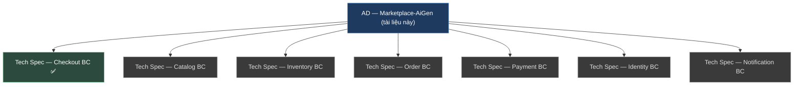
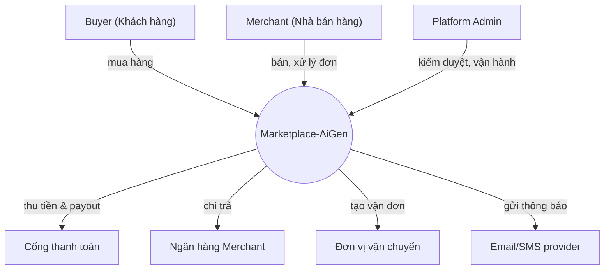
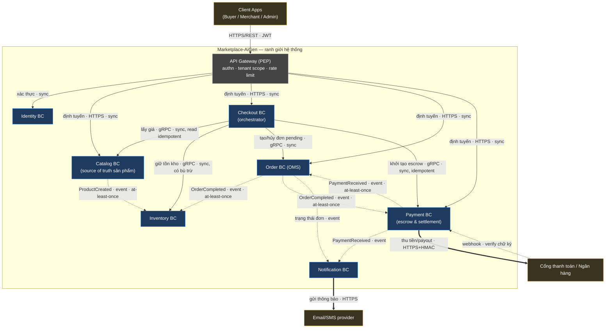
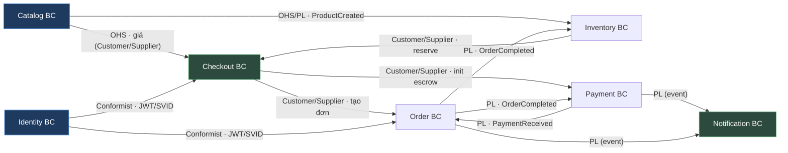
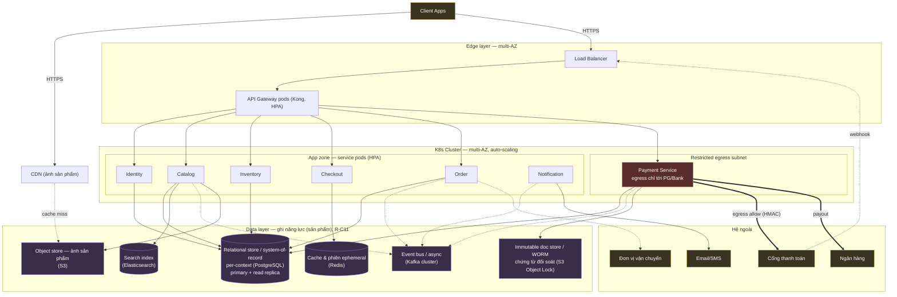
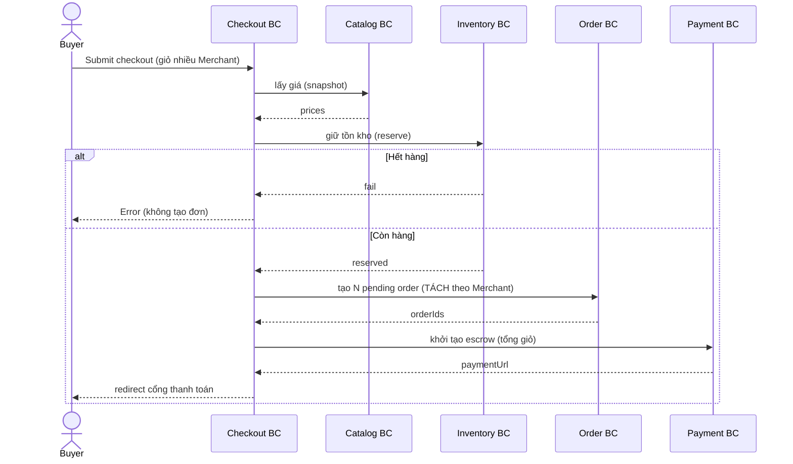
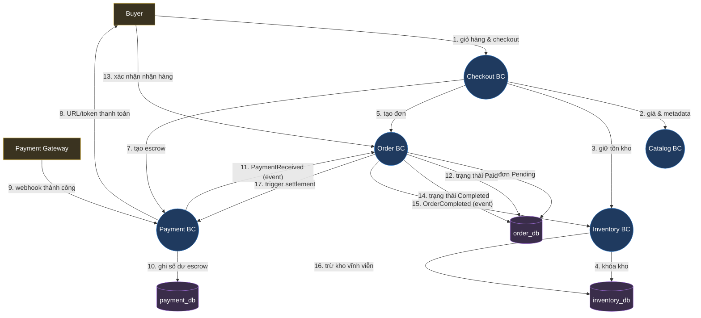
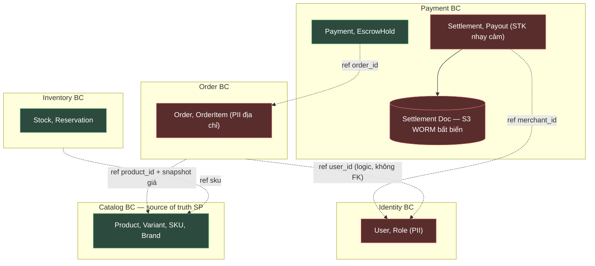
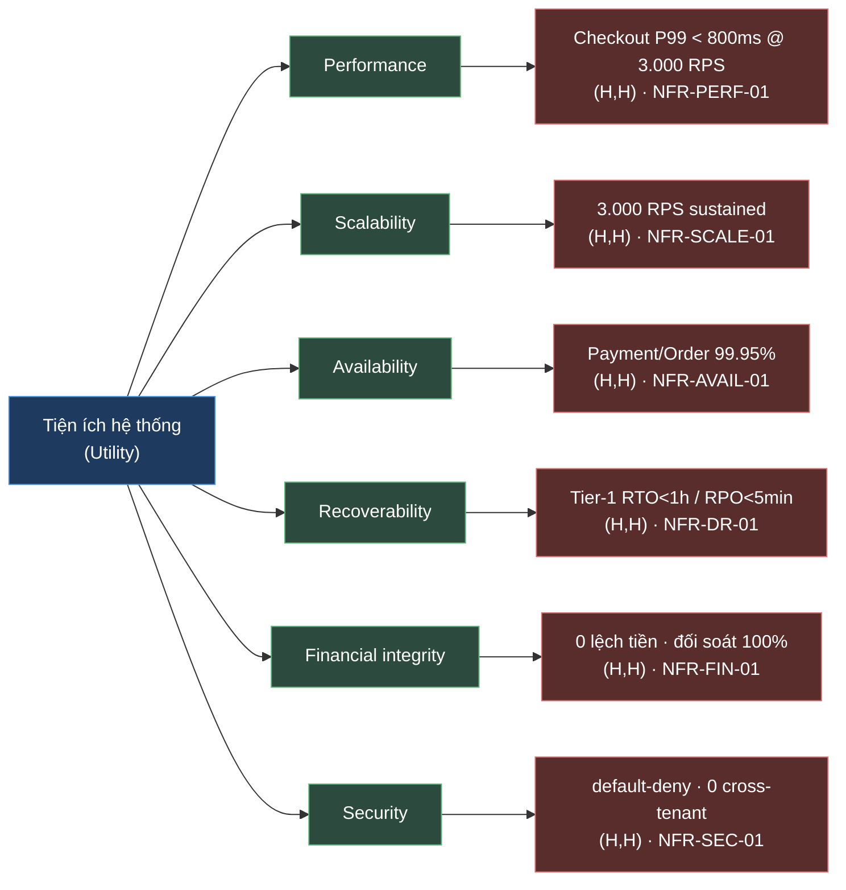

# ARCHITECTURE DOCUMENT (AD) — Marketplace-AiGen

| Thông tin tài liệu | Giá trị |
| --- | --- |
| Mã tài liệu | `AD-MKTPLACE-AIGEN-v1.7` |
| Loại | **Architecture Document (AD)** — cấp hệ thống (**1 file / hệ thống**) |
| Phiên bản | `1.7.0` |
| Trạng thái | ☐ Draft for review |
| Ngày tạo | 2026-06-22 |
| Cập nhật lần cuối | 2026-06-24 |
| Dự án / Hệ thống | Marketplace-AiGen (E-commerce Marketplace, multi-merchant) |
| Mức độ bảo mật | ☑ Internal |
| Quy tắc viết | `STD-DOC-v1.15` — [docs/stds/QuyTac-AD-va-TechSpec.md](../stds/QuyTac-AD-va-TechSpec.md) |
| Neo chuẩn | ISO/IEC/IEEE 42010:2022 · arc42 · C4 · DDD Context Mapping |
| Sơ đồ | Mermaid (toàn bộ) |
| Ngoài phạm vi | **Architecture-as-Code** (sinh view từ model, fitness function, drift detection, pipeline) — chuẩn hóa ở tài liệu riêng sau. Xem `docs/QuyTac-AD-ArchitectureAsCode.md`. |

**Lịch sử thay đổi**

| Phiên bản | Ngày | Tác giả | Mô tả thay đổi | Người duyệt |
| --- | --- | --- | --- | --- |
| 1.0.0 | 2026-06-22 | [Tác giả] | Tạo mới theo `STD-DOC-v1.12`; template đầu mục theo SAD | [Duyệt] |
| 1.1.0 | 2026-06-22 | [Tác giả] | Bỏ §3 "Các thành phần" (trùng bảng BC §2.2 — capability gom về §2.2; con trỏ Tech Spec ở Phụ lục A.4; Edge/Gateway nêu trong §2.2). Bỏ §6.2 ERD & §6.3 Schema (header rỗng — bất biến no-FK gộp vào §6.1, ERD/schema → Tech Spec). Đánh số lại §3–§10 cho liền mạch. | [Duyệt] |
| 1.2.0 | 2026-06-24 | [Tác giả] | Theo `STD-DOC-v1.12` (R-E5/R-E6 — truy vết NFR): §7 đổi tiêu đề "**Yêu cầu chất lượng**" + thêm **§7.1 Quality tree / NFR catalog** (chỉ mục có ID, mỗi NFR có **satisfied-by** + **kiểu truy vết** + BC đích); §7.1–7.4 cũ dời thành §7.2–7.5. Phụ lục A.4 trỏ catalog làm bảng allocation NFR. | [Duyệt] |
| 1.3.0 | 2026-06-24 | [Tác giả] | Theo `STD-DOC-v1.13` (R-E7): §7.1 thành **utility tree (ATAM)** — thêm **§7.1.1** sơ đồ cây (lá ưu tiên cao), **§7.1.2** catalog thêm cột **Ưu tiên (I×D)**, **§7.1.3** bốn **quality attribute scenario** 6 phần (QAS-PERF/FIN/AVAIL/SEC-01) với *phản hồi* nối tactic. §7.2 trỏ scenario formal về §7.1.3. | [Duyệt] |
| 1.4.0 | 2026-06-24 | [Tác giả] | Theo `STD-DOC-v1.14` (R-F2/F6): tạo **tập ADR thật** [`docs/design/adr/`](adr/README.md) (7 file ADR-0001..0006/0012 + README) — trước chỉ có index. §A.2 **link tới file** + thêm cột **Decision Drivers (NFR)** (reverse-link design→NFR). | [Duyệt] |
| 1.5.0 | 2026-06-24 | [Tác giả] | Theo `STD-DOC-v1.15` (R-E6/G25 — chống lặp target): **gỡ §7.2 Hiệu năng / §7.3 SLA / §7.4 Capacity / §7.5 Scaling** (lặp target catalog) → thay bằng **§7.2 "Cơ chế hiện thực (tactics — theo NFR)"** (chiều ngược tactic→NFR). §7 giờ uyển chuyển theo NFR: §7.1 tree/catalog/scenarios + §7.2 tactics. | [Duyệt] |
| 1.5.1 | 2026-06-24 | [Tác giả] | Editorial: đồng bộ nhãn `STD-DOC` còn lệch về **v1.15** (checklist §D + 3 trích dẫn quy tắc inline R-0/§6/PHẦN F; đổi cùng nhịp ở [`adr/README`](adr/README.md)). Không đổi nội dung chuẩn — các dòng changelog lịch sử giữ nguyên version gốc. | [Duyệt] |
| 1.7.0 | 2026-06-24 | [Tác giả] | (1) **Capability-first (R-C11):** §7.1.2/§7.1.3 bỏ tên sản phẩm trần ở satisfied-by/QAS (Redis→*cache giá nóng*, ES→*index toàn văn*, HPA→*autoscale stateless*, Kafka→*phân vùng event-log* + neo [ADR-0003](adr/ADR-0003-event-driven-kafka.md)); sản phẩm binding vẫn pin ở §2.1.1; thêm ghi chú quy ước. (2) **Bổ sung mô tả tường thuật** (đáp ứng "quá súc tích"): §1.1 thêm **bối cảnh nghiệp vụ** (tách đơn/escrow/vòng đời), §2.2 thêm **vai trò & trách nhiệm chi tiết 7 BC**, §7 thêm **diễn giải vì sao NFR ở mức ưu tiên đó**. | [Duyệt] |
| 1.6.0 | 2026-06-24 | [Tác giả] | (1) **§7.1.3:** thêm **QAS-SCALE-01 + QAS-DR-01** → đủ QAS cho cả **6 lá (H,H)** ở §7.1.1 (gỡ orphan); QAS-AVAIL-01 bỏ trùng RTO/RPO (về QAS-DR-01). (2) **Link hoá** mọi `ADR-000x` trong §7.1.2/§7.1.3/§7.2 (R-F6/E5). (3) **Baseline + Delta:** tạo 4 baseline tổ chức `STD-SEC/RES/OBS/AISEC-v1.0` ([stds/Baseline-*](../stds/Baseline-Security.md)); **co §6/§8/§9/§10** về *"conform + delta"* (gỡ sơ đồ ZTA generic, pattern/error-model/observability mặc định); A.1 trỏ baseline (pin version). | [Duyệt] |

> **Mô hình tài liệu (R-0 của `STD-DOC-v1.15`):** hệ thống có **đúng 01 AD này** + **01 Tech Spec / bounded context (BC)**, **không phụ thuộc số lượng BC**. AD giữ thứ ổn định (ranh giới giữa BC, liên kết, quyết định cấp hệ thống); chi tiết hiện thực (schema cột, field/mã lỗi, framework từng BC) **đẩy xuống** Tech Spec/contract. Bảng ánh xạ AD ↔ Tech Spec ở **Phụ lục A**.

# 1. TỔNG QUAN HỆ THỐNG

## 1.1 Mục tiêu hệ thống

Marketplace-AiGen là sàn TMĐT **multi-merchant** — một nền tảng trung gian nơi nhiều **Nhà bán hàng (Merchant)** độc lập cùng bán cho một tập **Người mua (Buyer)** chung, dưới một thương hiệu sàn và một quy trình thanh toán thống nhất.

**Bài toán cốt lõi — mua chéo nhiều người bán trong một phiên.** Khác sàn một-người-bán, ở đây một Buyer có thể bỏ vào **một giỏ** các sản phẩm từ *nhiều* Merchant rồi thanh toán **một lần**. Hệ thống phải tự **tách giỏ thành N đơn theo Merchant** (mỗi Merchant một đơn để xử lý, giao hàng và đối soát độc lập) nhưng vẫn giữ cho Buyer trải nghiệm *một giao dịch*. Đây là nguồn gốc của phần lớn độ phức tạp: **một thao tác của người dùng nở ra thành nhiều giao dịch phân tán**, phải hoặc *cùng thành công, hoặc cùng được bù trừ* — không có trạng thái "nửa vời".

**Mô hình tin cậy — escrow (ký quỹ).** Buyer và Merchant phần lớn là người lạ, không bên nào hoàn toàn tin bên kia. Sàn đứng giữa giữ tiền: khoản Buyer trả được **giữ trong escrow** (chưa chuyển cho Merchant) đến khi đơn **giao hàng hoàn tất**, rồi sàn mới **đối soát** (tính phí sàn/hoa hồng) và **chi trả (payout)** phần còn lại cho Merchant. Cơ chế này biến "lòng tin giữa hai người lạ" thành một **bất biến hệ thống kiểm chứng được** — và vì là *tiền thật*, nó kéo theo yêu cầu **toàn vẹn tài chính** gắt nhất (0 lệch tiền, chứng từ bất biến), là driver chi phối phần lớn thiết kế phía sau.

**Vòng đời một giao dịch (end-to-end):** Buyer duyệt Catalog → thêm sản phẩm của nhiều Merchant vào giỏ → **checkout** (sàn lấy giá, giữ tồn kho, tách đơn, mở escrow) → Buyer trả tiền ở cổng → tiền vào escrow → Merchant giao hàng → đơn hoàn tất → đối soát → **payout** cho Merchant. Mỗi chặng thuộc một ranh giới nghiệp vụ (bounded context) khác nhau, nối nhau bằng *điều phối đồng bộ* (chặng liên quan tiền) và *sự kiện bất đồng bộ* (cập nhật trạng thái sau khi tiền đã an toàn).

**Ba đặc tính nghiệp vụ → ba quyết định kiến trúc:** *tách đơn nguyên tử* → **Orchestration** (Checkout điều phối saga); *tiền thật giữ hộ* → **escrow + idempotency + cô lập** cho mọi thao tác tiền; *cao điểm flash-sale* → **Event-Driven + co giãn ngang**. Phần còn lại của tài liệu (§2 trở đi) chỉ là hệ quả kỹ thuật của ba sức ép này.

| # | Mục tiêu | Mô tả | Quality goal (đo được) |
| --- | --- | --- | --- |
| M1 | Vận hành sàn multi-merchant | Buyer mua từ nhiều Merchant; hệ tự tách đơn | ≥ 10.000 Merchant; tách đơn chính xác 100% |
| M2 | Thanh toán an toàn qua escrow | Giữ tiền đến khi đơn hoàn tất | 0 sự cố mất/lệch tiền; đối soát khớp 100% |
| M3 | Đối soát & chi trả tự động | Phí sàn/hoa hồng; payout Merchant | Payout đúng hạn ≥ 99%; chứng từ bất biến |
| M4 | Catalog là nguồn sự thật sản phẩm | Source of truth cho hiển thị/tìm kiếm | Duyệt < 24h; search P95 < 200 ms |
| M5 | Chịu tải cao điểm | Flash sale, sự kiện | 3.000 RPS sustained; checkout P99 < 800 ms |

> _Quy tắc (R-A2):_ AD nêu **quality goal đo được**; KPI vận hành chi tiết → dashboard (ngoài AD). Hành vi & SLO từng BC → Tech Spec tương ứng.

## 1.2 Phạm vi hệ thống

### 1.2.1 Trong phạm vi

* Quản lý tài khoản, xác thực danh tính, phân quyền theo vai trò (Buyer, Merchant, Admin).
* Quản lý danh mục sản phẩm, thương hiệu; kiểm duyệt nội dung trước khi hiển thị; tìm kiếm toàn văn.
* Theo dõi tồn kho, giữ chỗ (reservation) khi đặt đơn; trừ kho vĩnh viễn khi đơn hoàn tất.
* Điều phối đặt hàng: tự động **tách đơn theo Merchant**, tính giá, áp khuyến mãi.
* Quản lý vòng đời đơn hàng qua **state machine** (từ tạo đến hoàn tất/huỷ).
* Thanh toán qua cổng bên thứ ba, **escrow**, đối soát tự động, payout Merchant.

### 1.2.2 Ngoài phạm vi

* **Vận chuyển vật lý** — dùng Courier ngoài, chỉ tích hợp.
* **Kế toán/ERP** — nhận dữ liệu đối soát qua file/API.
* **BI/Analytics, CSKH/ticketing** — hệ riêng.
* **Rating & Dispute** — _chưa_ có ở v1.0 (lộ trình: ADR-0012).

### 1.2.3 Sơ đồ ngữ cảnh (Context Diagram — C4 Level 1)

> _Quy tắc (D.1):_ L1 chỉ "nối ai, để làm gì" — **không protocol, không lộ BC**.

| Hệ thống ngoài | Loại tương tác | Mô tả |
| --- | --- | --- |
| Cổng thanh toán | API + Webhook | Thu tiền Buyer; callback kết quả |
| Ngân hàng Merchant | API | Payout sau đối soát |
| Đơn vị vận chuyển | API | Tạo vận đơn; theo dõi giao hàng |
| Email/SMS provider | API | Thông báo trạng thái đơn |

## 1.3 Các bên liên quan (Stakeholders)

| Bên liên quan | Vai trò | Loại | Kỳ vọng (concern) |
| --- | --- | --- | --- |
| Buyer | End user | External | Mua nhanh; tiền an toàn (escrow) |
| Merchant | End user | External | Nhận đơn kịp thời; payout đúng & đủ |
| Platform Admin | Operator | Internal | Kiểm duyệt; xử lý vận hành |
| Finance team | Interested | Internal | Đối soát khớp; chứng từ bất biến |
| Security team | Interested | Internal | Cô lập tenant; audit đầy đủ; Zero-Trust |
| SRE / Ops | Interested | Internal | Dễ vận hành; quan sát được; phục hồi nhanh |

## 1.4 Giả định & Ràng buộc

### 1.4.1 Giả định

* Cổng thanh toán hỗ trợ giữ tiền/escrow hoặc cho phép mô phỏng escrow phía sàn.
* Cao điểm ≤ 3.000 RPS giai đoạn đầu.
* Mỗi Buyer có thể mua từ nhiều Merchant trong một giỏ → bắt buộc tách đơn.

### 1.4.2 Ràng buộc

| Loại | Ràng buộc | Tác động thiết kế |
| --- | --- | --- |
| Kỹ thuật | PostgreSQL chuẩn org; **Kafka** làm event bus | DB-per-context; không FK xuyên BC |
| Pháp lý | NĐ 13/2023 (PII); chứng từ tài chính lưu bất biến | WORM/Object Lock cho result bucket; data residency |
| Tài chính | Tiền escrow là tiền thật của khách | Idempotency + audit bắt buộc cho mọi thao tác tiền |
| Tổ chức | Multi-tenant (nhiều Merchant) | Tenant isolation xuyên suốt authz |

> _Quy tắc (R-A3 / R-C1):_ giá trị cấu hình cụ thể (TTL, sizing, threshold, secret) → Tech Spec/config/Vault, **không** ở AD.
>
> ⚠️ **Open item (TBD):** IAM policy chi tiết cho S3 result bucket (chứng từ đối soát) — nguyên tắc đã chốt (write-once, deny overwrite/delete), policy literal chờ ADR riêng. Xem §5.2.3, §6.3.

# 2. KIẾN TRÚC TỔNG THỂ

## 2.1 Kiểu kiến trúc

| Kiểu | Lý do | Trade-off |
| --- | --- | --- |
| Microservices theo Bounded Context (DDD) + **Orchestration** (Checkout) + **Event-Driven** | Mỗi BC scale & deploy độc lập; Checkout điều phối luồng tiền phức tạp; event cho liên kết lỏng | Phức tạp phân tán: saga/compensation, distributed tracing, eventual consistency |

### 2.1.1 Nguyên tắc thiết kế kiến trúc

* **Database per Context** — không chia sẻ DB, **không FK xuyên BC**.
* **API-First** — contract rõ ràng (REST ngoài, gRPC nội bộ giữa BC).
* **Orchestration cho luồng tiền** — Checkout điều phối đồng bộ; sai bước → compensation (saga).
* **Idempotency cho mọi thao tác tiền** — escrow, payout, webhook.
* **Tenant isolation** — mọi truy vấn gắn `merchant_id`; Merchant chỉ thấy dữ liệu của mình.
* **Chứng từ tài chính bất biến** — ghi một lần, không sửa/xóa (WORM).
* **Secrets ở Vault** — không trong tài liệu/code.

> **Phân loại công nghệ (R-C3 / R-C11):** ghi **năng lực (sản phẩm)** — năng lực là cái binding, sản phẩm là hiện thực.
> - **Binding** (load-bearing toàn hệ thống — ràng buộc chất lượng/khả mở rộng): event bus / async (Kafka) · relational store per-context (PostgreSQL) · immutable doc store / WORM (S3 Object Lock) · search index (Elasticsearch) · cache & phiên ephemeral (Redis).
> - **Indicative** (đẩy xuống Tech Spec): runtime/framework **từng BC** → quyết định **polyglot** (Java/Spring, Go, Node.js, Python tùy BC), **không** liệt kê như ràng buộc ở AD.

## 2.2 Sơ đồ kiến trúc cấp cao (C4 — mức BC, BC là hộp đục)

> _Quy tắc (R-0 + R-D2 + R-D5 + R-D6 + R-C9):_ mỗi **BC là một hộp đục** trong **vùng bao ranh giới hệ thống** — **không** vẽ ruột (service/datastore/framework); decompose nội bộ là L3 → Tech Spec của team sở hữu. Sơ đồ chỉ thể hiện **quan hệ giữa BC + hợp đồng/đảm bảo trên mỗi cạnh** (ý định + protocol + sync/async; **cấm** tên RPC method — thuộc contract §4). Quyền-sở-hữu-datastore **không** ở đây → §5 (sở hữu logic) & §2.4 (deployment, dạng rule). View **không phình** theo số BC: thêm BC = thêm một hộp.

**Legend:** ▢ vùng bao = ranh giới hệ thống · 🟦 Bounded Context (hộp đục) · ▭ API Gateway (edge/PEP) · 🟨 hệ ngoài. **Nét liền** = đồng bộ (sync, gRPC/HTTPS); **nét đứt** = event bất đồng bộ (Published Language). Nhãn cạnh = *ý định · protocol · đảm bảo*.

> **Công nghệ binding (ràng buộc kiến trúc — R-C9/R-C11, ghi `năng lực (sản phẩm)`):** **event bus / async (Kafka)** là kênh của mọi cạnh nét đứt (xem §2.1.1 & §2.4). Các hạ tầng binding khác — **relational store per-context (PostgreSQL)**, **immutable doc store / WORM (S3 Object Lock)**, **search index (Elasticsearch)**, **cache & phiên ephemeral (Redis)** — thể hiện ở **§2.4 Deployment** (rule hạ tầng) & **§5** (sở hữu logic), không vẽ trong sơ đồ này. Framework/runtime *từng BC* là **indicative** → Tech Spec, không nêu ở AD.

| BC (hộp) | Trách nhiệm / capability | Bề mặt giao tiếp (cung cấp · tiêu thụ) |
| --- | --- | --- |
| Identity | Authn (OIDC/JWT), RBAC 3 vai trò, cấp SVID workload | Cung cấp: xác thực JWT/SVID (sync) |
| Catalog | Sản phẩm/biến thể/SKU (source of truth), kiểm duyệt, search | Cung cấp: lấy giá (sync); `ProductCreated` (event) |
| Inventory | Tồn kho, reservation, trừ kho khi đơn hoàn tất | Cung cấp: giữ/giải phóng tồn kho (sync) · Tiêu thụ: `ProductCreated`, `OrderCompleted` (event) |
| Checkout | **Orchestrator**: tách đơn, điều phối saga | Cung cấp: `POST /v1/checkout` · Tiêu thụ: giá, reserve, tạo đơn, escrow (sync) |
| Order (OMS) | State machine đơn; snapshot giá | Cung cấp: tạo/hủy pending order (sync); `OrderCompleted` (event) · Tiêu thụ: `PaymentReceived` (event) |
| Payment | Escrow, đối soát, payout, chứng từ WORM | Cung cấp: init escrow (sync), webhook; `PaymentReceived` (event) · Tiêu thụ: `OrderCompleted` (event) |
| Notification | Thông báo đa kênh (email/SMS) | Tiêu thụ: `PaymentReceived`, `OrderCompleted` & trạng thái đơn (event) |

**Vai trò & trách nhiệm chi tiết từng BC** (vì sao mỗi BC tồn tại như một ranh giới riêng):

- **Identity — cổng danh tính & tin cậy.** Sở hữu tài khoản và xác thực (OIDC/JWT cho người dùng), cấp **SVID** cho workload; là nguồn sự thật cho 3 vai trò (Buyer/Merchant/Admin) mà mọi BC khác dựa vào để phân quyền. Cố tình *không* chứa logic bán hàng — chỉ trả lời *"ai đang gọi, được phép làm gì"*.
- **Catalog — nguồn sự thật sản phẩm.** Quản lý sản phẩm/biến thể/SKU, kiểm duyệt nội dung trước khi hiển thị, phục vụ tìm kiếm toàn văn. Là **upstream** cấp **giá snapshot** tin cậy cho Checkout (không bao giờ lấy giá từ client) và phát `ProductCreated` để Inventory dựng tồn kho. Đặc tính đọc-nhiều-ghi-ít → tách read replica.
- **Inventory — người gác tồn kho.** Giữ số lượng tồn, thực hiện **reservation** (giữ chỗ tạm) khi checkout và **trừ kho vĩnh viễn** khi đơn hoàn tất. Bất biến then chốt: *không bán quá tồn*; reservation có TTL nên không để "giữ chỗ mồ côi" nếu checkout hỏng giữa chừng.
- **Checkout — nhạc trưởng (orchestrator).** BC *gần stateless*, không sở hữu dữ liệu lâu bền; nhiệm vụ duy nhất là **điều phối saga đồng bộ**: lấy giá → giữ tồn → tách đơn theo Merchant → tạo N pending order → mở **1 escrow cho cả giỏ**. Bước nào hỏng → chạy **compensation ngược thứ tự**. Là điểm hội tụ độ phức tạp tách-đơn, nên cũng là điểm nhạy cảm nhất về độ trễ (P99) và blast-radius.
- **Order (OMS) — sổ cái vòng đời đơn.** Sở hữu **state machine** từng đơn (pending → paid → … → completed/cancelled) và giữ **snapshot giá** tại thời điểm đặt. Nhận `PaymentReceived` để chuyển trạng thái, phát `OrderCompleted` để kích hoạt trừ kho + payout.
- **Payment — két sắt của sàn.** BC nhạy cảm nhất: giữ **escrow**, xử lý **webhook** cổng thanh toán (idempotent), **đối soát**, **payout** cho Merchant, sinh **chứng từ tài chính bất biến (WORM)**. Là **Tier-1** (RTO<1h), egress hạn chế *chỉ* tới PG/Bank, mọi thao tác tiền đều idempotent + audit — cô lập riêng một microsegment để thu nhỏ blast-radius.
- **Notification — loa thông báo.** Thuần *downstream*: lắng nghe sự kiện (`PaymentReceived`, `OrderCompleted`, đổi trạng thái) rồi gửi email/SMS. Không giữ trạng thái nghiệp vụ; lỗi ở đây **không được** làm hỏng luồng tiền (degrade độc lập).

> **Edge — API Gateway / BFF (hạ tầng, không phải BC):** định tuyến · verify JWT · rate-limit & WAF · gắn tenant scope · TLS termination. Là **PEP biên** (cơ chế ở §6), không phải một bounded context.

## 2.3 DDD Context Map _(optional — áp dụng vì dự án dùng DDD)_

> _Quy tắc (§6 của `STD-DOC-v1.15`):_ mục này **optional**; bắt buộc nếu team dùng DDD, bỏ được nếu không (chiều phụ thuộc đã có ở bảng §2.2). Nó thể hiện **hai lớp**: **(a) quan hệ cộng tác giữa các team sở hữu BC** (Conway's law — Customer–Supplier, Partnership, Conformist, Shared Kernel) và **(b) ngữ nghĩa tích hợp dữ liệu tại biên** (ACL, OHS, Published Language). §2.2 cho *topology + hợp đồng*; §2.3 cho *quan hệ đội + kiểu dịch dữ liệu*. U = upstream, D = downstream.

| Quan hệ | Kiểu DDD | Ghi chú |
| --- | --- | --- |
| Catalog → Checkout (giá) | **Open Host Service** / Customer–Supplier | Checkout dùng **ACL**: chỉ lấy *snapshot giá*, không phụ thuộc model nội bộ Catalog |
| Inventory → Checkout (reserve) | Customer–Supplier | Checkout là Customer; Inventory là Supplier |
| Checkout → Order / Payment | Customer–Supplier | Checkout điều phối; Order/Payment cung cấp capability |
| Catalog/Payment/Order → subscribers | **Published Language** (event schema) | Event là hợp đồng công khai (AsyncAPI), không phải phụ phẩm publisher |
| Identity → mọi BC | **Conformist** | JWT (user) + SVID (workload); BC tuân theo định dạng danh tính |

## 2.4 Mô hình triển khai

### 2.4.1 Môi trường triển khai

| Môi trường | Hạ tầng | Đặc điểm |
| --- | --- | --- |
| Development | Docker Compose | Dữ liệu giả |
| Staging | K8s namespace | Mirror prod, dữ liệu ẩn danh |
| Production | K8s multi-AZ | HA, auto-scaling, full monitoring |

### 2.4.2 Sơ đồ triển khai Production (C4 Deployment)

> _Quy tắc (R-D4):_ mỗi hộp là **node hạ tầng** HOẶC **instance của một BC/container** đã định nghĩa ở §2.2 — không hộp "lửng".

### 2.4.3 Chiến lược triển khai

Rolling update mặc định; **Canary** cho Checkout/Payment (rủi ro cao); Feature flag cho khuyến mãi; Blue/Green khi đổi schema breaking. (YAML/IaC literal, số sizing → Tech Spec/IaC — R-C1.)

# 3. LUỒNG DỮ LIỆU

> _Quy tắc (R-A7 / R-D7 / R-D9):_ AD chỉ giữ kịch bản **xuyên nhiều BC**; flow nội bộ một BC → Tech Spec. **Sequence** là mặc định cho thứ tự thời gian — flow rất đơn giản thì mô tả **prose** (vd §3.1.2, §3.1.3), không ép vẽ. **DFD** (§3.2) bổ trợ khi cần thấy *dữ liệu chảy đi đâu*, ở **mức loại dữ liệu** (không field/schema). Pseudocode/log không thuộc AD.

## 3.1 Luồng chính (Happy Path)

### 3.1.1 Checkout & tách đơn (Orchestration)

### 3.1.2 Thanh toán → cập nhật đơn

Cổng thanh toán → Payment webhook (verify chữ ký) → Payment giữ tiền (escrow) → phát `PaymentReceived` → Order chuyển "To Ship" → Notification báo Merchant.

### 3.1.3 Hoàn tất & đối soát (Settlement)

Buyer xác nhận nhận hàng → Order "Completed" → phát `OrderCompleted` → Inventory trừ kho vĩnh viễn; Payment tính hoa hồng → release escrow → payout về ngân hàng Merchant → sinh chứng từ đối soát (ghi **bất biến** lên S3 WORM).

## 3.2 Data Flow Diagram (mức loại dữ liệu)

> _Quy tắc (D.4 / R-D9–R-D11):_ DFD ở **mức loại dữ liệu** — nhãn flow là *loại dữ liệu/ý định*, **không** field/cột/DDL. **Process** = BC (đã định nghĩa §2.2); **datastore** = store BC sở hữu (khớp §5). **Legend:** 🟨 external entity · 🟦 process (BC) · 🟪 datastore. Flow **đánh số** theo trình tự dữ liệu di chuyển.

## 3.3 Luồng bất đồng bộ (Event-Driven)

> _Quy tắc (R-C3):_ event là **Published Language** — hợp đồng công khai (AsyncAPI), không phải phụ phẩm publisher. Schema field đầy đủ → contract artifact.

| Event | Publisher | Subscriber(s) | Đảm bảo (delivery / ordering / idempotency) |
| --- | --- | --- | --- |
| ProductCreated | Catalog | Inventory | at-least-once · per productId · consumer idempotent |
| PaymentReceived | Payment | Order, Notification | at-least-once · per orderId · consumer idempotent |
| OrderCompleted | Order | Inventory, Payment | at-least-once · per orderId · consumer idempotent |

# 4. GIAO DIỆN HỆ THỐNG

> _Quy tắc (R-A15 / R-C6):_ AD nêu interface ở mức **capability + đảm bảo**; đặc tả đầy đủ field/method/mã lỗi → **OpenAPI/proto** (sync) và **AsyncAPI + schema registry** (async). AD **trỏ tới**, không sao chép.
>
> _Quy tắc (R-D8 — không sơ đồ trùng):_ mục này dùng **bảng** (inventory capability + bảng đảm bảo §4.1.4), **không** vẽ sơ đồ trust-boundary/PEP — bức tranh biên & cơ chế enforce thuộc **§6 Kiến trúc bảo mật** (xem sơ đồ ZTA ở đó). Bảng §4.1.2 chỉ *phân loại* interface theo biên và trỏ §6.

## 4.1 Internal APIs

### 4.1.1 Quy ước chung

| Quy ước | Áp dụng |
| --- | --- |
| Base URL | `https://api.marketplace.com/v{version}` |
| Auth | Bearer JWT (RS256); service-to-service mTLS |
| Internal RPC | gRPC giữa các BC |
| Versioning | URL `/v1/`, hỗ trợ N-1 |
| Error format | `{error:{code, message, details[]}}` |
| ID / Time | UUID v4 · ISO 8601 UTC |

### 4.1.2 Phân loại interface theo ranh giới tin cậy

| Nhóm | Ranh giới | Cơ chế bảo vệ |
| --- | --- | --- |
| Public (qua Gateway) | Internet → edge | Authn, rate limit, validation, **tenant scope**, WAF |
| Inter-context (gRPC) | VPC nội bộ | mTLS + service account (SVID) |
| Outbound (PG/Bank) | Nội bộ → ngoài | HMAC, timeout, retry, secret ở Vault, egress hạn chế |
| Inbound webhook | Ngoài → nội bộ | Verify chữ ký, allowlist IP, idempotency |

### 4.1.3 Danh sách interface quan trọng (mức capability)

> _Quy tắc (R-B10/R-D2):_ liệt kê ở mức **capability**, không phải tên method literal. Tên proto/route đầy đủ → contract artifact.

| # | Loại | Capability | Provider → Consumer | Auth |
| --- | --- | --- | --- | --- |
| 1 | gRPC | Lấy giá (snapshot) | Catalog → Checkout | mTLS |
| 2 | gRPC | Giữ tồn kho (reserve/release) | Inventory → Checkout | mTLS |
| 3 | gRPC | Tạo/hủy pending order | Order → Checkout | mTLS |
| 4 | gRPC | Khởi tạo escrow | Payment → Checkout | mTLS |
| 5 | REST | Webhook thanh toán | Cổng thanh toán → Payment | Chữ ký + idempotency |

### 4.1.4 Bảng "đảm bảo tương tác" (R-C7)

| Interface/Event | sync/async | consistency | idempotency | ordering | delivery | hành vi lỗi / suy giảm |
| --- | --- | --- | --- | --- | --- | --- |
| Lấy giá | sync | strong (read) | n/a (read) | n/a | request/response | Catalog down → checkout 503 (fail-safe) |
| Giữ tồn kho | sync | strong | có (theo reservation) | n/a | request/response | fail → 409; compensation release |
| Init escrow | sync | strong | có (theo key) | n/a | request/response | lỗi → compensation (cancel order + release) |
| Webhook thanh toán | async (inbound) | eventual | có (verify + dedupe) | n/a | at-least-once | retry; chống replay |
| Event (Kafka) | async | eventual | consumer idempotent | per key | at-least-once | retry + DLQ |

## 4.2 External Integration Points

| Hệ thống | Loại | Ranh giới | Dữ liệu qua biên | Resilience | Compliance |
| --- | --- | --- | --- | --- | --- |
| Cổng thanh toán | Payment | Outbound + webhook | Số tiền, orderRef (không PAN) | Timeout 30s, fallback reconcile | Subprocessor, DPA |
| Ngân hàng Merchant | Payout | Outbound | STK (nhạy cảm), số tiền | Retry + đối soát thủ công | Hợp đồng ngân hàng |
| Đơn vị vận chuyển | Logistics | Outbound | Địa chỉ (PII) | Retry → queue | Subprocessor, DPA |
| Email/SMS | Notification | Outbound | SĐT/email (PII) | Fallback kênh khác | Subprocessor |

# 5. KIẾN TRÚC DỮ LIỆU

> _Quy tắc (R-A9 / R-C1):_ AD nêu **quyền sở hữu, ranh giới, phân loại, bất biến**. Schema cột / ERD chi tiết / DDL → Tech Spec từng BC.

## 5.1 Tổng quan kiến trúc dữ liệu

> _Quy tắc (R-A23 / R-C11):_ nêu **BC sở hữu loại dữ liệu gì** + **năng lực lưu trữ cần** (capability-first `năng lực (sản phẩm)`). Không cột "tên DB vật lý" (suy ra từ DB-per-context → Tech Spec/IaC), không cột "Loại: sản phẩm" trần.

| BC (chủ sở hữu) | Dữ liệu sở hữu | Năng lực lưu trữ cần (hiện thực) | Đặc tính buộc chọn |
| --- | --- | --- | --- |
| Identity | User, Role (PII) | relational / system-of-record (PostgreSQL) | ACID, audit |
| Catalog | Product/Variant/SKU/Brand; ảnh sản phẩm | relational (PostgreSQL) + search index (Elasticsearch) + object store (S3) | source-of-truth + full-text search + lưu blob |
| Inventory | Stock, Reservation | relational (PostgreSQL) | nhất quán tồn kho |
| Order | Order, OrderItem (PII địa chỉ) | relational (PostgreSQL) | ACID, state machine |
| Payment | Payment/Escrow/Settlement; chứng từ đối soát | relational (PostgreSQL) + immutable doc store / WORM (S3 Object Lock) | ACID + **chứng từ bất biến** |
| Checkout | Phiên checkout (ephemeral) | cache & phiên ephemeral (Redis) | tốc độ, TTL ngắn, không bền |

> **Bất biến dữ liệu (cấp AD):** **không FK vật lý xuyên BC** — tham chiếu chéo (vd `order_id` ở Payment, `product_id` ở Order) chỉ là *reference logic* (xem sơ đồ §5.1). **ERD / schema cột / DDL chi tiết → Tech Spec (mục Interfaces & data) của từng BC**, không ở AD (R-A9 / R-C1).

## 5.2 Chiến lược quản lý dữ liệu

### 5.2.1 Migration

Flyway; backward-compatible ≥ 1 deploy cycle.

### 5.2.2 Backup

DB chính daily full + hourly incremental (Payment tier-1: RPO < 5 phút).

### 5.2.3 Data Lifecycle & phân loại

| Loại dữ liệu | Retention | Khi hết hạn | Cơ sở |
| --- | --- | --- | --- |
| PII (hồ sơ, địa chỉ) | TK active + 30 ngày | Anonymize | NĐ 13/2023 |
| Giao dịch / đơn | 10 năm | Archive → purge | Luật kế toán |
| Chứng từ đối soát (S3) | 10 năm | Immutable (WORM) | Compliance tài chính |
| Audit log | 5 năm | Immutable (Object Lock) | Compliance |

> ⚠️ **TBD (R-A22):** IAM policy chi tiết cho S3 result bucket — nguyên tắc: write-once, deny overwrite/delete kể cả owner; policy literal chờ ADR riêng. Xem §6.3.

# 6. KIẾN TRÚC BẢO MẬT

> **Conform `STD-SEC-v1.0`** — [Baseline-Security](../stds/Baseline-Security.md). Mô hình Zero-Trust (NIST 800-207), **3 kiểm tra độc lập/request** (JWT người dùng · SVID workload · PDP/PEP authz), **PEP mọi ranh giới**, mã hóa TLS 1.3 / mTLS / AES-256, **sơ đồ ZTA tham chiếu** + invariant chuẩn + bảng PEP — tất cả nằm ở baseline, **không lặp ở đây**. Mục này chỉ ghi **delta + quyết định đặc thù** Marketplace-AiGen. _Quy tắc (R-A10):_ AD nêu mô hình; IAM policy literal → Tech Spec/policy-as-code.

## 6.1 Microsegmentation — quyết định của hệ thống (R-A24)

Chọn **mặc định 1 BC = 1 microsegment** (khung lựa chọn & đánh đổi: [Baseline-SEC §4](../stds/Baseline-Security.md)). **Quyết định đặc thù:** *giữ per-BC để cô lập **Payment** (Tier-1, tiền thật)* — **không gom** dù cụm luồng tiền **Checkout + Order + Payment** rất chatty trong saga; ưu tiên **blast radius nhỏ** hơn lợi ích ít PEP-hop. Đổi ranh giới (gom/tách) = **gate review**.

## 6.2 Phân quyền đặc thù — Role & Tenant

Authz s2s theo **PoLP** qua PDP/PEP (Baseline-SEC §2): vd Checkout **chỉ** được init escrow ở Payment, không gọi op khác. **Tenant isolation:** mọi truy vấn dữ liệu Merchant gắn `merchant_id`; Merchant A **không** truy cập dữ liệu Merchant B. **MFA bắt buộc** cho Admin & Merchant rút tiền.

| Resource / Action | Admin | Merchant | Buyer |
| --- | --- | --- | --- |
| Sản phẩm (CRUD của mình) | ✔ tất cả | ✔ của mình | ✘ |
| Duyệt sản phẩm | ✔ | ✘ | ✘ |
| Đơn hàng | ✔ tất cả | ✔ của mình | ✔ của mình |
| Payout/đối soát | ✔ | ✔ xem của mình | ✘ |
| Chứng từ đối soát (S3) | đọc | đọc của mình | ✘ |

## 6.3 Chứng từ tài chính WORM (đặc thù)

Chứng từ đối soát: **S3 + Object Lock (WORM)** — write-once, deny overwrite/override ([ADR-0005](adr/ADR-0005-worm-settlement-doc.md)); IAM policy chi tiết **TBD** (cần ADR, kèm legal-hold & retention). Payment **egress chỉ tới PG/Bank** (qua PEP egress của segment).

## 6.4 Tuân thủ — gate & trạng thái đặc thù

**Gate review đặc thù** (ngoài gate chuẩn Baseline-SEC §8): đổi luồng tiền · truy cập xuyên tenant · đổi policy chứng từ bất biến · **đổi ranh giới microsegmentation** · mỗi cột mốc nâng cấp ZTA. Sai một bước → mất tiền / rò rỉ / vi phạm pháp lý / nới blast radius — máy không thay người quyết định.

> ⚠️ **Target vs current (R-A10):** *Hiện trạng:* mTLS qua mesh + PEP tại Gateway đã có. *Đang triển khai:* PDP tập trung + per-request authz ở sidecar (GĐ2); SPIRE federation (GĐ3). Mỗi cột mốc ZTA = **1 ADR riêng** ([ADR-0006](adr/ADR-0006-zero-trust.md)). Sơ đồ ZTA **mục tiêu** ở Baseline-SEC §3.

# 7. YÊU CẦU CHẤT LƯỢNG (QUALITY)

**Vì sao những thuộc tính này, ở mức ưu tiên này — bối cảnh nghiệp vụ lái NFR** (đọc kèm catalog §7.1.2, vốn cố tình ngắn gọn ở phần *target*):

- **Financial integrity (H,H) — trục sống còn.** Tiền trong escrow là **tiền thật của khách**; một lệch tiền hay chứng từ bị sửa là **sự cố pháp lý/uy tín**, không phải bug thông thường. Vì thế *0 lệch tiền + đối soát khớp 100% + chứng từ bất biến* được đặt cao nhất và chi phối các quyết định escrow / idempotency / WORM.
- **Performance & Scalability (H,H) — sinh từ flash-sale.** Cao điểm sự kiện đẩy tải lên ~3.000 RPS, và *checkout giỏ nhiều Merchant* là đường đi **đắt nhất** (đi qua ≥4 BC trong một saga đồng bộ) → P99 của riêng nó là thước đo khắc nghiệt nhất, không phải API trung bình.
- **Availability — phân tầng theo hậu quả mất dịch vụ.** Payment/Order down = *không thu được tiền / không chốt được đơn* → **Tier-1, 99.95% (H,H)**. Checkout down chỉ chặn *đặt đơn mới* → **Tier-2 (H,M)**, chấp nhận được nhờ co giãn + canary.
- **Recoverability (H,H) — đi kèm tiền thật.** Mất dữ liệu giao dịch Tier-1 = mất tiền → buộc RTO<1h / RPO<5min, không thể "khôi phục từ từ".
- **Security (H,H) — vì multi-tenant + tiền.** Rò rỉ dữ liệu xuyên Merchant hoặc chiếm quyền luồng tiền là rủi ro cao nhất → Zero-Trust *deny-by-default* + cô lập tenant xuyên suốt.

Các thuộc tính ưu tiên thấp hơn (search latency, thời gian duyệt sản phẩm) quan trọng cho **trải nghiệm** nhưng *không đe dọa tiền/uy tín*, nên để (M/L) — utility tree §7.1.1 phản ánh đúng thứ tự ưu tiên đó.

## 7.1 Quality tree / NFR catalog (chỉ mục)

> _Quy tắc (R-E5 / R-E6 / R-E7):_ §7 tổ chức NFR thành **utility tree** (ATAM): *tiện ích → thuộc tính chất lượng → scenario lá*, mỗi lá gắn **ưu tiên (I×D)** = *tầm quan trọng nghiệp vụ × độ khó kỹ thuật* (H/M/L). **Catalog (§7.1.2) chính là tập lá** — chỉ mục, **không** thay chi tiết ở mục nhà (cơ chế §7.2, DR §8.2, bảo mật §6, observability §9, mục tiêu §1.1). Mỗi NFR có **ID ổn định** (Tech Spec trỏ ngược), **satisfied-by** = tactic + neo §/ADR (chỉ link, không chép — R-E5), **kiểu truy vết**:
> `inherited` (mọi BC conform) · `allocated` (tách ngân sách, phải breakdown) · `owned` (1 BC) · `cross-BC` (AD-only, không BC đơn nào sở hữu) · `local` (chỉ ở Tech Spec — **không xuất hiện ở bảng này**). NFR **ưu tiên cao (H,H)** có **quality attribute scenario** ở §7.1.3.

### 7.1.1 Utility tree (ATAM — chỉ lá ưu tiên cao)

**Legend:** 🟦 tiện ích · 🟩 thuộc tính chất lượng · 🟥 lá scenario **ưu tiên cao (H,H)**. Cây chỉ hiện **lá ưu tiên cao** (R-E7/R-D12); danh sách đầy đủ ở §7.1.2. Tag `(I,D)` = *tầm quan trọng × độ khó*.

### 7.1.2 NFR catalog (tập lá của cây)

> _Quy ước satisfied-by (R-C11):_ cột này ghi **năng lực/tactic** (capability-first), **không** nêu tên sản phẩm cụ thể. Sản phẩm *binding* (Kafka/PostgreSQL/Redis/Elasticsearch/S3-WORM) đã được pin **một chỗ** ở [§2.1.1](#211-nguyên-tắc-thiết-kế-kiến-trúc) + [§7.2](#72-cơ-chế-hiện-thực-chất-lượng-tactics--theo-nfr); ở đây chỉ trỏ *năng lực + neo §/ADR*. Riêng quyết định event-bus phân vùng được neo [ADR-0003](adr/ADR-0003-event-driven-kafka.md).

| ID | NFR (target) | Mục nhà | Satisfied-by (tactic → neo) | Kiểu | Ưu tiên (I×D) | BC đích / Tech Spec |
| --- | --- | --- | --- | --- | --- | --- |
| **NFR-PERF-01** | Checkout P99 < 800 ms | §7.2 · M5 | autoscale stateless (§2.4) · cache giá nóng (§7.2) · phân vùng event-log theo `merchant_id` ([ADR-0003](adr/ADR-0003-event-driven-kafka.md)) · saga đồng bộ + **budget** · [ADR-0002](adr/ADR-0002-orchestration-checkout.md) | **allocated** | **(H,H)** | Checkout — breakdown ở `Checkout §2.1` |
| **NFR-PERF-02** | Search P95 < 200 ms | §7.2 · M4 | index tìm kiếm toàn văn · read replica đọc Catalog (§7.2) | **owned** | (M,M) | Catalog |
| **NFR-PERF-03** | API P99 (khác) < 500 ms | §7.2 | timeout mọi I/O (§8.1) · autoscale stateless (§2.4) | **inherited** | (M,L) | mọi BC |
| **NFR-PERF-04** | Error rate < 0.1% | §7.2 | circuit breaker · retry + DLQ · graceful degradation (§8.1) | **inherited** | (H,M) | mọi BC |
| **NFR-SCALE-01** | 3.000 RPS sustained | §7.2 · M5 | autoscale stateless (§7.2) · phân vùng event-log theo `merchant_id` ([ADR-0003](adr/ADR-0003-event-driven-kafka.md)) · read replica đọc | **allocated** | **(H,H)** | mọi BC (share RPS) |
| **NFR-SCALE-02** | ≥ 10.000 Merchant | M1 | tenant isolation (§6.2) · DB-per-context ([ADR-0001](adr/ADR-0001-db-per-context.md)) | **cross-BC** | (M,M) | _no single owner_ |
| **NFR-AVAIL-01** | Payment/Order 99.95% | §7.2 | multi-AZ (§2.4) · canary (§2.4.3) · idempotency money-op (§8.1) | **owned** | **(H,H)** | Payment, Order |
| **NFR-AVAIL-02** | Checkout 99.9% | §7.2 | stateless + autoscale · fail-safe degraded (§8.1) | **owned** | (H,M) | Checkout |
| **NFR-AVAIL-03** | Catalog/Search 99.5% | §7.2 | read replica · cache fallback search (§8.1) | **owned** | (M,L) | Catalog |
| **NFR-DR-01** | Tier-1 RTO<1h / RPO<5min | §8.2 | failover multi-AZ · hourly backup (§5.2.2) · WORM x-region (§8.2) | **owned** | **(H,H)** | Identity, Payment, Order |
| **NFR-DR-02** | Tier-2 RTO<4h / RPO<1h | §8.2 | restore từ backup · rebuild stateless | **owned** | (M,M) | Checkout, Inventory |
| **NFR-DR-03** | Tier-3 RTO<24h / RPO<4h | §8.2 | daily backup | **owned** | (L,L) | Catalog, Notification |
| **NFR-FIN-01** | 0 lệch tiền · đối soát khớp 100% | M2 · §3.1.3 | escrow ([ADR-0004](adr/ADR-0004-escrow.md)) · idempotency money-op (§8.1) · WORM ([ADR-0005](adr/ADR-0005-worm-settlement-doc.md)) · reconcile + freeze payout (§9.2) | **cross-BC** | **(H,H)** | _no single owner_ (Payment chủ lực) |
| **NFR-FIN-02** | Payout đúng hạn ≥ 99% · chứng từ bất biến | M3 · §5.2.3 | chứng từ bất biến WORM ([ADR-0005](adr/ADR-0005-worm-settlement-doc.md)) · payout retry + đối soát thủ công (§4.2) | **owned** | (H,M) | Payment |
| **NFR-FIN-03** | Tách đơn chính xác 100% | M1 · §3.1.1 | OrderSplitter (Checkout) · 1 escrow/giỏ · idempotent saga | **cross-BC** | (H,M) | _no single owner_ (Checkout điều phối) |
| **NFR-SEC-01** | mTLS xuyên segment · default-deny · PoLP (invariants Baseline-SEC §7) | §6 | ZTA mTLS/SVID · PDP/PEP · NetworkPolicy ([ADR-0006](adr/ADR-0006-zero-trust.md)) | **inherited** | **(H,H)** | mọi BC (anchor index ở mỗi Tech Spec) |
| **NFR-SEC-02** | Tenant isolation (Merchant A ⊄ B) | §6.2 | `merchant_id` mọi query · authz PEP per-request | **inherited** | (H,M) | mọi BC |
| **NFR-BIZ-01** | Duyệt sản phẩm < 24h | M4 · §1.1 | kiểm duyệt workflow Catalog | **owned** | (L,L) | Catalog |

> **Đọc bảng:** `inherited` → Tech Spec **conform**, không restate (chỉ ghi "delta = none/khác"). `allocated` → Tech Spec nhận **phần ngân sách** + show breakdown (R-E6 compose-check). `owned` → ánh xạ 1:1 sang Tech Spec BC đó. `cross-BC` → **AD-only**, đừng coi là "thiếu ở Tech Spec". NFR `local` của từng BC (vd idempotency phiên Checkout) nằm ở Tech Spec §2, **không** đẩy lên đây.

### 7.1.3 Quality attribute scenarios (NFR ưu tiên cao — R-E7)

> Dạng **6 phần** (Bass/Clements/Kazman): *nguồn · kích thích · môi trường · phản hồi (kèm **tactic → neo**) · thước đo*. Cột **phản hồi** nối thẳng yếu tố thiết kế (R-E5); **thước đo** = target (R-E6). Chỉ viết cho lá **ưu tiên cao (H,H)** ở §7.1.1; scenario **chỉ trong một BC** → Tech Spec §2 của BC (vd QAS Checkout ở `Checkout §2`).

| Scenario (thuộc tính) → NFR | Nguồn · Kích thích | Môi trường | Phản hồi (tactic → neo) | Thước đo |
| --- | --- | --- | --- | --- |
| **QAS-PERF-01** (Performance) → NFR-PERF-01 | Buyer · submit checkout giỏ nhiều Merchant | flash sale **3.000 RPS** | orchestrate saga đồng bộ; cache giá nóng + autoscale stateless + phân vùng event-log theo `merchant_id` ([ADR-0003](adr/ADR-0003-event-driven-kafka.md); §2.4, §7.2); ngân sách per-hop (Checkout §2.1) | **P99 < 800 ms**; error < 0.1% |
| **QAS-SCALE-01** (Scalability) → NFR-SCALE-01 | Buyer (đại trà) · tải tăng đột biến & **duy trì** đỉnh | flash sale / sự kiện kéo dài | autoscale stateless theo RPS + phân vùng event-log theo `merchant_id` ([ADR-0003](adr/ADR-0003-event-driven-kafka.md)) + read replica đọc Catalog; capacity headroom 3–5× (§2.4, §7.2) — co giãn, không dồn queue | **3.000 RPS sustained**; không degrade P99; error < 0.1% |
| **QAS-FIN-01** (Financial integrity) → NFR-FIN-01 | Cổng TT / settlement · webhook **trùng** hoặc settle đồng thời | vận hành + retry at-least-once | idempotency mọi money-op; escrow ([ADR-0004](adr/ADR-0004-escrow.md)); chứng từ WORM ([ADR-0005](adr/ADR-0005-worm-settlement-doc.md)); reconcile → **freeze payout** (§9.2) | **0 lệch tiền**; đối soát khớp 100% |
| **QAS-AVAIL-01** (Availability) → NFR-AVAIL-01 | Hạ tầng · **mất 1 AZ** chứa Payment/Order | production multi-AZ | failover multi-AZ; canary; Payment Tier-1 cô lập (§2.4, §8.2) | **99.95%**; degrade an toàn, không mất giao dịch |
| **QAS-DR-01** (Recoverability) → NFR-DR-01 | Thảm họa vùng / hỏng dữ liệu Tier-1 (Identity/Payment/Order) | mất vùng hoặc data corruption | failover multi-AZ; restore từ hourly backup (§5.2.2); chứng từ WORM cross-region (§8.2); smoke-test luồng tiền trước khi công bố phục hồi | **RTO < 1h / RPO < 5min**; đối soát khớp sau phục hồi |
| **QAS-SEC-01** (Security) → NFR-SEC-01 | Workload bị xâm nhập (**assume breach**) · cố gọi service / tenant khác | lateral movement trong VPC | ZTA mTLS/SVID + PDP/PEP **deny-by-default** + NetworkPolicy + tenant scope ([ADR-0006](adr/ADR-0006-zero-trust.md), §6) | chặn ở PEP; **0 truy cập xuyên tenant** |

## 7.2 Cơ chế hiện thực chất lượng (tactics — theo NFR)

> _Quy tắc (R-E5 / R-E6):_ mục này chỉ giữ **cơ chế/tactic** (phần *"how"*) — **không restate target** (mọi target, gồm SLA & RTO, sống **một chỗ** ở §7.1.2 catalog). Mỗi tactic nêu **NFR nó phục vụ** (chiều ngược của satisfied-by). Cơ chế thuộc concern khác (DR, bảo mật) ở mục nhà của chúng (§8.2, §6) — chỉ **trỏ tới**, không lặp. Sizing/version literal → IaC (R-C1).

| Tactic / cơ chế | NFR phục vụ | Ghi chú / neo |
| --- | --- | --- |
| **HPA** (autoscale CPU>70% / RPS; service **stateless**) | NFR-PERF-01, NFR-SCALE-01, NFR-AVAIL-02 | §2.4 deploy |
| **Read replica** (Catalog — tách đọc/ghi) | NFR-PERF-02, NFR-SCALE-01, NFR-AVAIL-03 | — |
| **Partition Kafka** theo `merchant_id` | NFR-SCALE-01, NFR-PERF-01 | ordering per merchant; [ADR-0003](adr/ADR-0003-event-driven-kafka.md) |
| **Caching** — CDN (ảnh/sản phẩm) · Redis (phiên checkout, giá) · local (feature flags) | NFR-PERF-01, NFR-PERF-02 | phục vụ flash-sale (QAS-PERF-01) |
| **Capacity headroom 3–5×** (ước từ DAU × đơn/user; Payment & Order tier-1) | NFR-SCALE-01, NFR-AVAIL-01 | sizing literal → IaC |
| **Multi-AZ failover + backup + WORM x-region** | NFR-AVAIL-01, NFR-DR-01/02/03 | chi tiết ở **§8.2** (DR) — trỏ, không lặp |

> **Vì sao bỏ các mục cố định *Hiệu năng / SLA / Capacity / Scaling*:** chúng từng **lặp lại target** đã có ở catalog (perf metrics ≡ `NFR-PERF-*`; SLA ≡ `NFR-AVAIL-*`). Theo nguyên tắc *một target một chỗ* (R-E6/G25): target ở §7.1.2, scenario ở §7.1.3, còn mục này chỉ giữ **cơ chế** — xuất hiện **theo NFR thực có**, không theo bucket template cứng.

# 8. XỬ LÝ LỖI & KHẢ NĂNG PHỤC HỒI

> **Conform `STD-RES-v1.0`** — [Baseline-Resilience-DR](../stds/Baseline-Resilience-DR.md). Error model, resilience patterns (saga, idempotency, circuit breaker, timeout, graceful degradation), **khung tier DR** + kế hoạch DR chuẩn nằm ở baseline. Mục này chỉ ghi **delta đặc thù**; **target RTO/RPO sống ở [§7.1.2 catalog](#712-nfr-catalog-tập-lá-của-cây)** (`NFR-DR-01/02/03`), không lặp.

## 8.1 Áp dụng pattern cho hệ thống

- **Saga + compensation (Checkout):** reserve → create order → init escrow; bước sau lỗi → release reservation + hủy pending order (ngược thứ tự).
- **Idempotency bắt buộc:** webhook thanh toán, payout, escrow.
- **Graceful degradation:** Catalog/Inventory down → 503 (fail-safe, không tạo đơn sai giá/kho); search lỗi → cache.

> **Invariant đặc thù:** không bao giờ để **reservation/pending order mồ côi** sau khi saga checkout thất bại (enforce tự động → AaC).

## 8.2 Phân tier & kế hoạch DR (delta)

**Phân tier** (target ở catalog): **Tier-1** Identity/Payment/Order · **Tier-2** Checkout/Inventory · **Tier-3** Catalog/Notification. **Delta kế hoạch** (ngoài Baseline-RES §4): bước **smoke-test luồng tiền** bắt buộc trước khi công bố phục hồi; chứng từ S3 WORM cross-region ([ADR-0005](adr/ADR-0005-worm-settlement-doc.md)).

# 9. QUAN SÁT & GIÁM SÁT (OBSERVABILITY)

> **Conform `STD-OBS-v1.0`** — [Baseline-Observability](../stds/Baseline-Observability.md). Logging JSON/mask/audit, RED + Golden Signals, OTel + sampling, thang severity P1–P3, taxonomy dashboard — chuẩn ở baseline. Mục này chỉ ghi **đặc thù nghiệp vụ**.

## 9.1 Đặc thù đo lường & trace

- **Log field thêm:** `merchantId` (multi-tenant); audit log giữ **5 năm**.
- **Business metrics:** `business_order_created_total`, `escrow_held_total`, `payout_total{status}`, `checkout_saga_compensation_total`.
- **Tracing:** propagate context qua **gRPC + Kafka** — trọng yếu vì checkout đi qua **≥ 4 BC**.

## 9.2 Alert đặc thù

| Alert | Severity | Hành động |
| --- | --- | --- |
| Payment fail rate > 5%/5m | P1 | PagerDuty |
| Escrow/đối soát lệch | P1 | PagerDuty + **freeze payout** |
| Checkout saga compensation spike | P2 | Slack + runbook |
| Truy cập xuyên tenant phát hiện | P1 | PagerDuty + Security |

## 9.3 Dashboard đặc thù

`Security` (auth fail, tenant violation, audit) · `Finance` (escrow balance, payout, đối soát) — ngoài bộ chuẩn (Baseline-OBS §5).

# 10. AI SECURITY

**Không áp dụng (N/A — R-A1):** hệ thống không có thành phần AI/LLM. Nếu sau này thêm (vd gợi ý sản phẩm bằng LLM), **kích hoạt `STD-AISEC-v1.0`** — [Baseline-AI-Security](../stds/Baseline-AI-Security.md) (address từng hạng mục checklist + delta).

# PHỤ LỤC

## A. Tham chiếu, ADR & Traceability

### A.1 Tài liệu liên quan

| Tài liệu | Mô tả | Link / Mã |
| --- | --- | --- |
| Quy tắc viết AD & Tech Spec | `STD-DOC-v1.15` | [docs/stds/QuyTac-AD-va-TechSpec.md](../stds/QuyTac-AD-va-TechSpec.md) |
| Baseline bảo mật (conform §6) | `STD-SEC-v1.0` | [stds/Baseline-Security.md](../stds/Baseline-Security.md) |
| Baseline phục hồi & DR (conform §8) | `STD-RES-v1.0` | [stds/Baseline-Resilience-DR.md](../stds/Baseline-Resilience-DR.md) |
| Baseline observability (conform §9) | `STD-OBS-v1.0` | [stds/Baseline-Observability.md](../stds/Baseline-Observability.md) |
| Baseline AI-Security (conform §10) | `STD-AISEC-v1.0` | [stds/Baseline-AI-Security.md](../stds/Baseline-AI-Security.md) |
| Tech Spec — Checkout | Thiết kế chi tiết orchestrator | [techspec/Checkout.md](techspec/Checkout.md) |
| ADR cấp hệ thống (tập file) | Quyết định kiến trúc (Context→Decision→Consequences + Drivers) | [docs/design/adr/](adr/README.md) |
| OpenAPI / proto / AsyncAPI | Hợp đồng API/event đầy đủ | [Link] |
| (sau) AaC | Sinh view từ model, fitness function, pipeline | `docs/QuyTac-AD-ArchitectureAsCode.md` |

### A.2 Chỉ mục ADR cấp hệ thống (R-F2/F3/F6)

> Quyết định ảnh hưởng nhiều BC → ADR cấp hệ thống. **File ADR thật ở [`docs/design/adr/`](adr/README.md)** — index này **link tới file** (R-F6). ADR nội bộ một BC → Tech Spec §7 của BC đó (vd [Checkout §7](techspec/Checkout.md)). Cột **Drivers** = NFR lái quyết định (neo §7.1.2 — reverse-link *design → NFR*).

| ADR | Quyết định | Trạng thái | Drivers (NFR) | View/§ ảnh hưởng |
| --- | --- | --- | --- | --- |
| [ADR-0001](adr/ADR-0001-db-per-context.md) | DB-per-Context, không FK xuyên BC | Accepted | NFR-SCALE-02, NFR-SEC-02 | §2.2, §5 |
| [ADR-0002](adr/ADR-0002-orchestration-checkout.md) | Orchestration (Checkout) cho luồng tiền | Accepted | NFR-PERF-01, NFR-FIN-01/03 | §2.2, §3 |
| [ADR-0003](adr/ADR-0003-event-driven-kafka.md) | Event-Driven qua Kafka; event là Published Language | Accepted | NFR-SCALE-01, NFR-AVAIL-01 | §2.3, §3.3 |
| [ADR-0004](adr/ADR-0004-escrow.md) | Escrow giữ tiền đến khi giao hàng hoàn tất | Accepted | NFR-FIN-01 | §3, §5 |
| [ADR-0005](adr/ADR-0005-worm-settlement-doc.md) | Chứng từ tài chính WORM (S3 Object Lock) | Accepted | NFR-FIN-02 | §5.2.3, §6.3 |
| [ADR-0006](adr/ADR-0006-zero-trust.md) | Zero-Trust (mTLS/SVID + PDP/PEP), nhiều giai đoạn | Proposed | NFR-SEC-01, NFR-SEC-02 | §6 |
| [ADR-0012](adr/ADR-0012-dispute-refund-bc.md) | Bổ sung Dispute & Refund BC (lộ trình) | Proposed | — | §1.2.2 |

### A.3 Correspondence — ánh xạ tầng view (R-B14 / §17)

| BC (§2.2 Container) | §1.2.3 Context (L1) | §2.4 Deployment |
| --- | --- | --- |
| Identity | trong "Marketplace-AiGen" | Identity pod → identity_db |
| Catalog | // | Catalog pod → catalog_db + ES + S3img |
| Inventory | // | Inventory pod → inventory_db |
| Checkout | // | Checkout pod → Redis |
| Order | // | Order pod → order_db |
| Payment | // | Payment pod (restricted egress) → payment_db + S3 WORM |
| Notification | // | Notification pod → notification_db |

### A.4 Correspondence — ánh xạ AD ↔ Tech Spec (R-0 / R-E2)

| BC | §AD liên quan | Tech Spec |
| --- | --- | --- |
| Checkout | §2.2, §3.1.1, §4, §8.1 | [techspec/Checkout.md](techspec/Checkout.md) ✅ |
| Payment | §2.2, §3.1.3, §5, §6.3 | `techspec/Payment.md` (TODO) |
| Order | §3, §4 | `techspec/Order.md` (TODO) |
| Catalog | §2.2, §3.3 | `techspec/Catalog.md` (TODO) |
| Inventory | §3.3, §4 | `techspec/Inventory.md` (TODO) |
| Identity | §6 | `techspec/Identity.md` (TODO) |
| Notification | §3.3 | `techspec/Notification.md` (TODO) |

> **Allocation NFR (R-E6):** bảng truy vết NFR ↔ BC/Tech Spec do **§7.1.2 catalog** kiêm (cột *Kiểu* + *BC đích*) — không lặp lại ở đây. Mỗi Tech Spec §2 trỏ ngược bằng **AD-NFR-ID** (vd Checkout ↦ `NFR-PERF-01`/`NFR-AVAIL-02`/`NFR-DR-02`/`NFR-SCALE-01`) hoặc đánh dấu **"BC-local"**.

## B. Rủi ro & Nợ kỹ thuật (R-A14)

| # | Rủi ro / nợ | Tác động | Biện pháp |
| --- | --- | --- | --- |
| R1 | IAM policy S3 WORM chưa chốt (TBD) | Chứng từ có thể bị ghi đè nếu cấu hình sai | ADR riêng + gate review trước khi bật prod |
| R2 | ZTA chưa hoàn tất (PDP/SPIRE GĐ2–3) | authz chưa per-request đầy đủ | Lộ trình ADR-0006; mTLS đã phủ |
| R3 | Eventual consistency (event-driven) | Lệch tạm thời giữa BC | Idempotent consumer; reconcile; monitoring |
| R4 | Checkout là điểm điều phối | Checkout down → không đặt hàng được | Tier-2 chấp nhận; HPA + canary + alert |
| R5 | Dispute/Refund chưa có (v1.0) | Chưa xử lý tranh chấp | ADR-0012 lộ trình |

## C. Bảng thuật ngữ (Glossary)

**Bounded Context (BC)** — ranh giới mô hình hóa của một miền nghiệp vụ. **Escrow** — giữ tiền trung gian đến khi đơn hoàn tất. **Settlement** — đối soát. **Payout** — chi trả Merchant. **WORM** — Write Once Read Many (bất biến). **Saga** — chuỗi giao dịch phân tán + compensation. **Tenant isolation** — cô lập dữ liệu theo Merchant. **OHS/PL/ACL** — Open Host Service / Published Language / Anti-Corruption Layer (DDD). **mTLS/SVID** — mutual TLS / SPIFFE Verifiable Identity Document. **PDP/PEP** — Policy Decision/Enforcement Point. **PII** — Personally Identifiable Information.

## D. Checklist Definition-of-Done cho AD (PHẦN H của `STD-DOC-v1.15`)

| # | Hạng mục | ✓ |
| --- | --- | --- |
| 1 | Đúng **01 AD** cho hệ thống; mỗi BC có Tech Spec riêng (R-0) | ☑ |
| 2 | §1.2.3 Context (L1) một sơ đồ; §2.2 Container có **BC là hộp**, datastore trong BC | ☑ |
| 3 | §2.3 Context Map đi kèm §2.2 (topology + ngữ nghĩa quan hệ) | ☑ |
| 4 | §3 chỉ chứa flow **xuyên BC**; flow nội bộ đẩy xuống Tech Spec | ☑ |
| 5 | Công nghệ phân loại binding vs indicative; nêu quyết định polyglot (§2.1.1) | ☑ |
| 6 | §4 hợp đồng nêu capability + đảm bảo, trỏ tới contract artifact (R-C6/C7) | ☑ |
| 7 | Phụ lục A.3/A.4 correspondence Context↔Container↔Deployment & AD↔Tech Spec | ☑ |
| 8 | Sơ đồ là Mermaid, đúng grain, có legend, nhãn = ý định (không method name) | ☑ |
| 9 | Quyết định nặng cấp hệ thống có **file ADR thật** ([`adr/`](adr/README.md)) + **Decision Drivers**; chỉ mục A.2 link tới file (R-F2/F6) | ☑ |
| 10 | `TBD` đánh dấu tường minh (§1.4.2, §5.2.3, §6.3) | ☑ |
| 11 | Mục Optional không dùng ghi "N/A — lý do" (§10 AI Security) | ☑ |
| 12 | Version + changelog cập nhật | ☑ |
| 13 | §7.1 NFR catalog có ID; mỗi NFR có **satisfied-by** + **kiểu truy vết & BC đích** (R-E5/E6); allocated có breakdown (Checkout §2.1); cross-BC đánh dấu "no single owner" | ☑ |
| 14 | §7.1 là **utility tree**: §7.1.1 sơ đồ cây (lá ưu tiên cao), §7.1.2 catalog có cột **Ưu tiên (I×D)**, §7.1.3 **quality attribute scenario** 6 phần cho NFR (H,H) — phản hồi nối tactic (R-E7) | ☑ |

## E. PHÊ DUYỆT TÀI LIỆU

| Vai trò | Họ tên & Chức danh | Chữ ký / Ngày |
| --- | --- | --- |
| Kiến trúc sư soạn thảo | _____ | _____ |
| Security Reviewer | _____ | _____ |
| Tech Lead / Architect | _____ | _____ |
| CTO / Head of Engineering | _____ | _____ |
