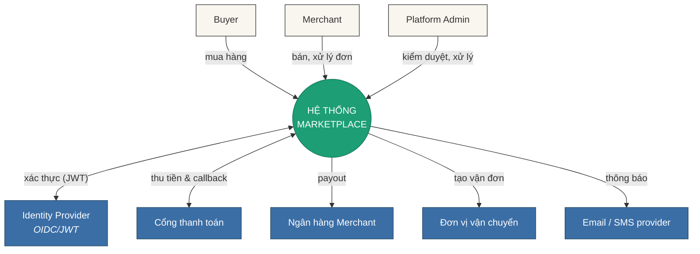
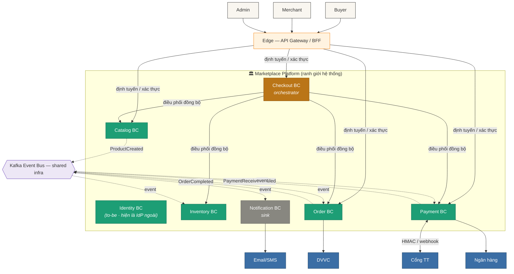
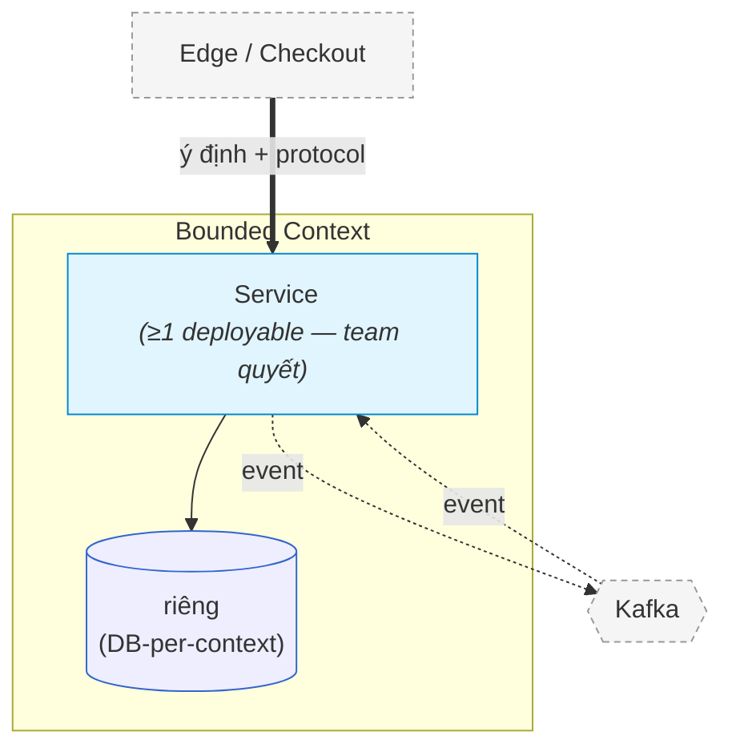
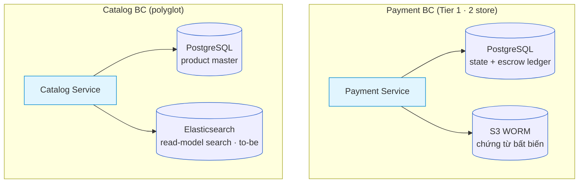
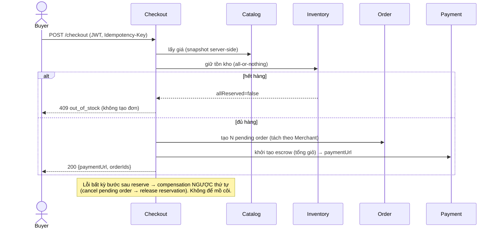
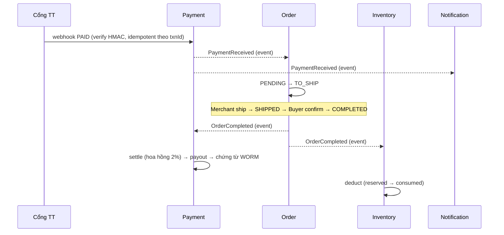

# Architecture Description — Marketplace (Multi-Merchant E-commerce)

| | |
| --- | --- |
| Mã | `MKT-AD-CORE` |
| Phiên bản | `v1.0.0` |
| Trạng thái | Draft for review |
| Ngày | 2026-06-21 |
| Tác giả / Duyệt | Platform Architecture / _TBD_ |
| last-validated | 2026-06-21 (đối chiếu nội dung ↔ source code + SDD v2.2) |
| Mức bảo mật | Internal |
| Viết theo | `STD-DESIGN-DOC-v1.3` (AD/SDD cấp hệ thống) · neo: ISO/IEC/IEEE 42010:2022 · arc42 · C4 · ADR · DDD |

> **Quan hệ tài liệu (3 tầng):** Standard (`STD-DESIGN-DOC`) → **AD (tài liệu này)** → **Tech Spec per-BC** (`tech-spec/TechSpec-Marketplace-<BC>.md`).
> AD giữ **C4 L2 / Landscape** (BC = hộp, Context Map, bề mặt hợp đồng + bảo đảm tương tác, deployment grain BC/zone, ADR register hệ thống). Component nội bộ (**C4 L3**) thuộc Tech Spec. Field/mã lỗi đầy đủ → `/contracts`; replica/HPA/secret → IaC/Vault.
>
> **Ký hiệu mục:** `§N` = mục của AD này; `MKT-*` = ID phần tử (Lớp B, §6-equivalent → "Truy vết"). Trạng thái nguồn: **as-is** = đang hiện thực trong code; **to-be** = đích kiến trúc (xem §8.4).

> **Lịch sử thay đổi**
>
> | Phiên bản | Ngày | Thay đổi |
> | --- | --- | --- |
> | v1.0.0 | 2026-06-21 | Bản AD đầu tiên viết theo `STD-DESIGN-DOC-v1.3`, tổng hợp từ `sad-marketplace.md` + `SDD-MKTPLACE-CORE-v2.2.md` + source code 6 BC. |

---

## 1. Tổng quan  · _[Lớp A · Core]_

### 1.1 Mục tiêu & quality goals (đo được)

Sàn thương mại điện tử **đa-merchant**: Buyer mua hàng từ nhiều Merchant trong một giỏ; tiền được giữ **escrow** an toàn tới khi đơn hoàn tất, rồi đối soát + chi trả cho Merchant.

| ID | Mục tiêu | KPI đo được | verify: |
| --- | --- | --- | --- |
| `MKT-GOAL-01` | Sàn đa-merchant, tự tách đơn theo Merchant | ≥ 10.000 Merchant; tách đơn đúng 100% | test · audit |
| `MKT-GOAL-02` | Thanh toán an toàn qua escrow | 0 sự cố mất/lệch tiền; đối soát khớp 100% | monitor · audit |
| `MKT-GOAL-03` | Đối soát & chi trả tự động | payout đúng hạn ≥ 99%; chứng từ bất biến | monitor |
| `MKT-GOAL-04` | Catalog là nguồn sự thật + kiểm duyệt | thời gian duyệt < 24h; search P95 < 200ms | monitor |
| `MKT-GOAL-05` | Chịu tải đỉnh (flash sale) | 3.000 RPS bền; checkout P99 < 800ms | test (load) · monitor |

### 1.2 Phạm vi (in / out)

- **IN:** Catalog (product master + moderation), Inventory (stock + reservation), Order (vòng đời đơn), Payment (escrow + settlement + payout), Checkout (orchestrator), Notification (sink). Multi-tenant theo `merchantId`.
- **OUT (v1):** Rating & Review, Dispute & Refund (→ `MKT-ADR-0012`, Proposed), Cart độc lập (client-side / context riêng), Loyalty/ERP (peer cross-P&L — `MKT-CHG-05`), khuyến mãi/coupon (open question, Tech Spec Checkout §9).

### 1.3 Stakeholders & concern

> Mọi concern phải được **≥1 view `frames`** (adequacy 42010 — xem §"Truy vết").

| ID | Stakeholder | Loại | Concern chính |
| --- | --- | --- | --- |
| `MKT-CONCERN-01` | Buyer | external | Mua nhanh; tiền an toàn (escrow) |
| `MKT-CONCERN-02` | Merchant | external | Nhận đơn kịp; payout đúng & đúng hạn |
| `MKT-CONCERN-03` | Platform Admin | internal | Kiểm duyệt nội dung; xử lý tranh chấp |
| `MKT-CONCERN-04` | Finance | internal | Đối soát khớp; chứng từ bất biến (WORM) |
| `MKT-CONCERN-05` | Security | internal | Cô lập tenant; audit đầy đủ; zero-trust |
| `MKT-CONCERN-06` | SRE / Ops | internal | Vận hành được; quan sát được; phục hồi |

### 1.4 Ràng buộc

| ID | Loại | Ràng buộc | Tác động thiết kế |
| --- | --- | --- | --- |
| `MKT-CONS-01` | Kỹ thuật | PostgreSQL chuẩn tổ chức; Kafka làm event bus | DB-per-context; outbox; không FK xuyên context |
| `MKT-CONS-02` | Pháp lý | NĐ 13/2023 (PII); chứng từ tài chính bất biến | WORM/Object Lock; data residency; retention |
| `MKT-CONS-03` | Tài chính | Escrow giữ **tiền thật** của khách | Idempotency + audit bắt buộc mọi thao tác tiền |
| `MKT-CONS-04` | Tổ chức | Đa-tenant (nhiều Merchant) | Cô lập dữ liệu theo `merchantId` ở mọi truy vấn |

**Giả định (ceiling):** đỉnh tải ban đầu ≤ 3.000 RPS; cổng thanh toán hỗ trợ escrow hoặc sàn mô phỏng escrow; một giỏ có thể nhiều Merchant ⇒ tách đơn bắt buộc.

---

## 2. Kiểu kiến trúc + nguyên tắc  · _[Lớp A · Core]_

**Kiểu:** **Microservices per Bounded Context (DDD)** + **Orchestration** (Checkout cho luồng tiền) + **Event-Driven** (choreography cho phần còn lại). Đánh đổi đã chấp nhận: phức tạp phân tán → cần saga/compensation, distributed tracing, eventual consistency (`MKT-ADR-0001/0003`).

**Nguyên tắc chủ đạo:**

1. **Database-per-context** — không share DB, không FK xuyên context; tham chiếu chéo chỉ là *reference logic* (`MKT-ADR-0002`).
2. **API-First** — REST cho external, S2S nội bộ; **event là hợp đồng hạng nhất** (`MKT-ADR-0004`).
3. **Orchestration cho tiền** — Checkout đồng bộ; lỗi → saga compensation ngược thứ tự (`MKT-ADR-0003`).
4. **Idempotency mọi thao tác tiền** (escrow/payout/webhook) **và mọi consumer** (bus at-least-once → consumer phải idempotent) (`MKT-ADR-0005`).
5. **Cô lập tenant** — mọi truy vấn mang `merchantId`/`owner` (`MKT-ADR-0009`).
6. **Chứng từ tài chính bất biến** — WORM/S3 Object Lock (`MKT-ADR-0007`).
7. **Secrets ở Vault**; **zero-trust** (`MKT-ADR-0010`).

**Công nghệ — binding vs indicative** _(bộ lọc 5.2 của standard)_:

| Binding (load-bearing → vào AD) | Indicative (→ Tech Spec; lật được) |
| --- | --- |
| Kafka (event bus) · PostgreSQL-per-context · Elasticsearch (search) · S3 WORM · Gateway/BFF pattern · Redis (session/cache) | Runtime per-service (Spring Boot/Java 21…) · IdP product (Keycloak) · Gateway product (Kong) |

> Polyglot là **quyết định** (`MKT-ADR-0008`), không liệt kê runtime từng service trong AD. **Trigger tái-phân-loại:** một runtime/lib indicative tích đủ ≥k context phụ thuộc → viết ADR nâng cấp lên binding (chống ossify im lặng).

**Grain C4 (W5):** BC = hộp Landscape (≈L1) · service + datastore = **L2** (AD dừng ở đây) · component nội bộ = **L3** (Tech Spec). "Bên trong BC" ≠ "L3".

---

## 3. View cấu trúc  · _[Lớp A · Core]_

### 3.1 System Context (C4 L1) — `MKT-VIEW-01`

`frames:` `MKT-CONCERN-01/02/03` (hệ là một hộp: ai dùng, nối hệ ngoài nào, để làm gì — **không** protocol/công nghệ, **không** lộ BC).

> **Legend (W6):** hộp tròn xanh = **toàn hệ Marketplace (một hộp duy nhất)** · hộp nền sáng = actor (người dùng) · hộp xanh dương = hệ thống ngoài. Nhãn = **ý định**, không protocol. Đây là tầng cao nhất — bung bên trong ở §3.2.

| Hệ ngoài | Tương tác | Mô tả |
| --- | --- | --- |
| Identity Provider | OIDC/JWT | Xác thực user, cấp JWT/claims (Published Language) |
| Cổng thanh toán | API + webhook | Thu tiền Buyer, callback kết quả (HMAC) |
| Ngân hàng Merchant | API | Payout sau đối soát |
| Đơn vị vận chuyển | API | Tạo vận đơn, theo dõi giao hàng *(to-be — chưa có trong code v1)* |
| Email / SMS provider | API | Gửi thông báo (qua Notification BC; hiện là **stub**, §8.4) |

### 3.2 System Landscape — `MKT-VIEW-02`

`frames:` `MKT-CONCERN-05/06` (bung hệ thành các BC + hạ tầng chia sẻ + biên với hệ ngoài). Trên một bậc so với Container; **chưa** lộ service/DB/framework.

> **Legend (W6):** khung "Marketplace Platform" = **ranh giới hệ thống** (trong/ngoài) · hộp cam = orchestrator · xanh lá = BC nghiệp vụ · xám = sink · cam nhạt = Edge/Gateway · tím `{{}}` = hạ tầng chia sẻ (Kafka) · xanh dương = hệ ngoài. **Nét liền** = đồng bộ · **nét đứt** = domain event **qua bus** (choreography). Nhãn = ý định; tên event giữ vì là Published Language.

> **Lưu ý nguồn:** Identity vẽ trong khung là **đích (to-be)**; code v1 **chưa** có module `identity` — xác thực hiện do IdP ngoài + header `X-User-*` (§8.4). 6 BC còn lại là module Maven thật.

### 3.3 Container archetype (C4 L2) — `MKT-VIEW-03`

`frames:` `MKT-CONCERN-06` (bung một BC thành service + datastore; **không** vẽ mọi BC — luật tầng "≤7 BC: archetype + vài ví dụ").

> **AD dừng ở L2** (service + datastore + ranh giới + quan hệ). Component nội bộ (L3) → Tech Spec. **DB-per-context** là quyết định binding (`MKT-ADR-0002`): datastore **nằm trong** hộp BC sở hữu, cấm trôi nổi. **Số deployable mỗi BC KHÔNG bị AD ràng** — xem ghi chú tự chủ bên dưới.

**Archetype chung** (khuôn mà mọi BC tuân theo):

**BC giàu hơn khuôn** (vẽ riêng vì nội bộ "phình" — datastore đa loại):

> **Legend (W6):** hộp xanh = service (đơn vị chạy) · hộp trụ = datastore (đơn vị lưu) · subgraph = ranh giới BC · hộp nét đứt xám = hàng xóm (ngoài BC đang xét). Hai BC trên **phá khuôn archetype** một cách hợp lệ (2 store) — minh hoạ vì sao 1:1 không phải luật.

> **Ghi chú tự chủ team (chống ép BC ≅ deployable — A12 / standard §7.2):** "1 BC = 1 service + 1 store" là **hiện trạng (as-is)** của code v1, **không** phải quyết định kiến trúc. Một BC **được phép** trải nhiều deployable (api + worker + projection) hoặc nhiều store; *cách* bung là **L3 do team sở hữu** (Tech Spec §3). AD chỉ ràng: **DB-per-context + không FK xuyên context**. Bản đồ BC ⟷ container ⟷ store ⟷ zone (đầy đủ) ở **một chỗ duy nhất**: §"Correspondence physical".

### 3.4 Context Map (DDD) — `MKT-VIEW-04` · _[Lớp A · Ext(≥2 BC) — **active**: 6 BC]_

`frames:` `MKT-CONCERN-02/05` (ngữ nghĩa quan hệ, không chỉ topology). Nhãn theo **hai trục** (quyền-lực / cơ-chế-dịch).

| ID | Upstream (U) | Downstream (D) | Trục quyền-lực | Trục cơ-chế-dịch | Cơ chế |
| --- | --- | --- | --- | --- | --- |
| `MKT-REL-01` | Identity/IdP | mọi BC | — | **Open Host Service** + **Published Language** (JWT/claims) | OIDC/JWT |
| `MKT-REL-02` | Catalog | Checkout | Customer/Supplier | — | sync (GetPrice) |
| `MKT-REL-03` | Inventory | Checkout | Customer/Supplier | — | sync (ReserveStock) |
| `MKT-REL-04` | Order | Checkout | Customer/Supplier | — | sync (CreatePendingOrder) |
| `MKT-REL-05` | Payment | Checkout | Customer/Supplier | — | sync (InitEscrow) |
| `MKT-REL-06` | Catalog | Inventory | — | **Published Language** | event `ProductCreated` |
| `MKT-REL-07` | Order | Inventory, Payment | — | **Published Language** | event `OrderCompleted` |
| `MKT-REL-08` | Payment | Order, Notification | — | **Published Language** | event `PaymentReceived`/`Failed` |
| `MKT-REL-09` | Cổng TT/Bank (external) | Payment | — | **Anti-Corruption Layer** | webhook + HMAC |

> **Cấm giả định BC ≅ deployable** — quan hệ vật lý ở "Correspondence physical". Không có Shared Kernel (DB-per-context cấm).

---

## 4. Luồng & hành vi  · _[Lớp A · Core]_

> Grain hệ thống (lifeline = BC). Bước nội bộ service → Tech Spec.

### 4.1 Checkout (orchestration + compensation) — `MKT-VIEW-05`

`frames:` `MKT-CONCERN-01/04`.

> **Legend (W6):** nét liền = gọi đồng bộ; `alt` = nhánh điều kiện. Giá luôn snapshot từ Catalog — **không** tin client (`ADR-CHK-4`).

### 4.2 Thanh toán & vòng đời đơn (choreography) — `MKT-VIEW-06`

`frames:` `MKT-CONCERN-02/04`.

### 4.3 Auto-cancel đơn quá hạn (FR13, delayed-event) — `MKT-VIEW-07`

Order tạo pending order **đồng thời** phát một `OrderPendingTimedOut` **delayed event** (deliverAfter = now + `pending-expiry` 30′) vào outbox; relay giao lại sau hạn; Order tự consume → cancel **nếu vẫn PENDING** (timer cũ bị state-check hấp thụ — không cần dedupe riêng). Đây là **cơ chế sự kiện-trễ**, không phải cron (`MKT-ADR-0005`-aac).

> **Ràng buộc liên-BC:** `order.pending-expiry` (30′) phải **≥** Inventory `reserve-ttl` (15′), nếu không có nguy cơ oversell. (Xem bảng bảo đảm §5 + invariant chéo.)

---

## 5. Hợp đồng giao tiếp  · _[Lớp A · Core]_

> AD nêu **bề mặt + đảm bảo**; field/mã lỗi đầy đủ → `/contracts` (JSON event contracts) + OpenAPI/proto (to-be). **Hợp đồng đầy đủ = nguồn sự thật** (W4).

### 5.1 Bề mặt đồng bộ (S2S)

| Interface | Provider | Consumer | as-is | to-be |
| --- | --- | --- | --- | --- |
| GetPrice (batch) | Catalog | Checkout | REST `POST /internal/prices` | gRPC `Catalog.GetPrice` + mTLS |
| ReserveStock / Release | Inventory | Checkout | REST `POST /internal/reservations[/release]` | gRPC + mTLS |
| CreatePendingOrder / Cancel | Order | Checkout | REST `POST /internal/orders[/{id}/cancel]` | gRPC + mTLS |
| InitEscrow / GetPayment | Payment | Checkout | REST `/internal/payments/escrow` | gRPC + mTLS |
| webhook | Payment | Cổng TT (external) | REST `POST /v1/payments/webhook` (HMAC) | (giữ REST + HMAC) |

> as-is dùng REST `/internal/*` làm stand-in cho gRPC (`ADR-0004`-aac); to-be là gRPC+mTLS qua Istio (xem §8.4). **Bề mặt + bảo đảm không đổi** giữa as-is/to-be — chỉ protocol đổi (đúng N3: bên ngoài phụ thuộc bề mặt, không phụ thuộc protocol).

### 5.2 Sự kiện (Published Language) — `/contracts/*.json`

| Event | Producer → Topic | Consumer | verify: |
| --- | --- | --- | --- |
| `Catalog.ProductCreated` | Catalog → `catalog-events` | Inventory (InitSku) | contract + test |
| `Order.OrderCompleted` | Order → `order-events` | Inventory (deduct), Payment (settle) | contract + test |
| `Order.OrderCancelled` | Order → `order-events` | Inventory (release) | contract |
| `Order.OrderPendingTimedOut` | Order → `order-timeouts` | Order (self) | test |
| `Payment.PaymentReceived` | Payment → `payment-events` | Order (→TO_SHIP), Notification | contract + test |
| `Payment.PaymentFailed` | Payment → `payment-events` | Order (→CANCELLED) | contract |

### 5.3 Bảng bảo đảm tương tác (phần "chống thay đổi chi tiết")

| Tương tác | Sync/Async | Consistency | Idempotency | Ordering | Delivery | Hành vi lỗi / suy giảm | verify: |
| --- | --- | --- | --- | --- | --- | --- | --- |
| Checkout → 4 BC | sync | strong-in-context | `Idempotency-Key` (bắt buộc) | n/a | request/response | bước lỗi → compensation; downstream down → 503 (không tạo đơn sai) | test · monitor |
| webhook PG → Payment | inbound async | eventual | dedupe `gateway_txn_id` (UNIQUE) | n/a | at-least-once (PG retry) | giả/replay → từ chối; trùng → no-op | test · monitor |
| mọi domain event | async | eventual | **consumer dedupe theo `eventId`** | partition + key = `merchantId` | **at-least-once** | DLQ per-topic; tồn DLQ → alert | test · monitor |

> **Schema evolution (`MKT-ADR-0004`):** envelope chuẩn (`eventId, eventType, occurredAt, traceId, merchantId`); backward-compatible; breaking → topic/version mới, chạy song song, deprecate sau khi consumer migrate (giữ ≥ N-1). Định dạng serialize (Avro/Protobuf/JSON Schema) = **TBD** (`MKT-ADR-0013`).

---

## 6. Dữ liệu  · _[Lớp A · Core (chiều sâu = Ext)]_

`frames:` `MKT-CONCERN-04/05`.

### 6.1 Sở hữu dữ liệu theo miền (DB-per-context) — baseline

> AD nêu **ai sở hữu miền dữ liệu nào** (ranh giới) + **loại store mang sức nặng kiến trúc** (binding). **Không** liệt kê tên DB vật lý hay schema — đó là Tier-detail (→ Tech Spec §4.3 + "Correspondence physical"). Nền store binding (`PostgreSQL-per-context + Elasticsearch + S3 WORM`) đã chốt **một lần** ở §2.

| Owner BC | Miền dữ liệu sở hữu | Store significant (binding) |
| --- | --- | --- |
| Catalog | Product master (Product→Variant→SKU), giá | **read-model search riêng** (ES — `MKT-ADR-0008`; hiện DB-backed stand-in, §8.4) |
| Inventory | Tồn kho & giữ chỗ (stock, reservation) | — (state-stored, optimistic lock) |
| Order | Vòng đời đơn + **địa chỉ giao (PII)** + price snapshot | — (append-only history) |
| Payment | Luồng tiền (escrow, settlement, payout) + **chứng từ** | **escrow ledger event-sourced** + **store WORM bất biến** (`MKT-ADR-0007`) |
| Checkout | Phiên checkout tạm (không bền vững) | cache phiên (TTL ngắn) — **không** DB riêng |
| Notification | Bản ghi thông báo + nội dung (mã hóa) | — (state-stored) |

> Hai loại store *đặc biệt* (search read-model của Catalog, WORM của Payment) là **quyết định binding** nên nêu ở AD; tên DB/bảng/cột → Tech Spec.

### 6.2 Reference logic (không FK vật lý xuyên context)

`order_id`, `merchantId`, `sku`/`skuCode`, `productId`, `userId`/`buyerId` đi qua ranh giới chỉ như **giá trị tham chiếu** (`MKT-ADR-0002`). Cấm FK trỏ DB context khác (fitness: quét migration).

### 6.3 Bất biến dữ liệu (baseline)

1. Price snapshot trong `order_items` **bất biến** (`updatable=false`) — giá tại thời điểm đặt.
2. `escrow_event_store` chỉ append; số dư tái dựng được tại mọi thời điểm (audit tài chính).
3. Chứng từ đối soát **WORM** — ghi-một-lần, deny overwrite/delete kể cả owner (`MKT-ADR-0007`).
4. `order_status_history` append-only; mọi UK idempotency (`gateway_txn_id`, `idempotency_key`, `checkout_ref`).

### 6.4 Phân loại & retention (`MKT-CONS-02`) — _Ext(data class)_

> Đây là **chính sách phân lớp**, không phải bản kiểm kê field. Mỗi lớp gắn **owner + ví dụ đại diện + căn cứ + retention**; *danh sách field cụ thể* nằm ở **Tech Spec §4.5** của từng BC (Tier Test: thêm field không được buộc sửa AD).

| Lớp dữ liệu | Owner BC (ví dụ đại diện) | Retention | Căn cứ / cơ chế |
| --- | --- | --- | --- |
| **PII** | Order (địa chỉ giao), Notification (contact người nhận), Identity (profile) | active + 30 ngày → ẩn danh | NĐ 13/2023 |
| **Tài chính nhạy cảm** | Payment (STK ngân hàng, số tiền) | 10 năm | luật kế toán; field-level encrypt + WORM |
| **Giao dịch / đơn** | Order (đơn), Payment (giao dịch) | 10 năm → archive→purge | luật kế toán |
| **Chứng từ đối soát** | Payment (voucher S3) | 10 năm, bất biến | WORM / Object Lock (`MKT-ADR-0007`) |
| **Audit log** | xuyên suốt | 5 năm, bất biến | S3 Object Lock |

> Field cụ thể + class từng cột → **Tech Spec §4.5**; ERD/DDL/migration (Flyway) → repo từng BC. AD **không** giữ.

---

## 7. Bảo mật  · _[Lớp A · Core (chiều sâu compliance = Ext)]_

`frames:` `MKT-CONCERN-05`. Mô hình: **Zero-Trust (NIST SP 800-207)** — không tin theo vị trí mạng (`MKT-ADR-0010`).

### 7.1 Trust boundary

| ID | Ranh giới | Đối ứng |
| --- | --- | --- |
| `B1` | Public edge (Buyer→Gateway) | JWT (RS256) · rate-limit · tenant scope · WAF |
| `B2` | Inter-context (VPC, cùng trust domain) | **to-be:** mTLS + SVID; **as-is:** REST `/internal` trong cluster |
| `B3` | Egress ra bên thứ ba (Payment→PG/Bank) | HMAC · **egress allowlist** · secret ở Vault |
| `B4` | Inbound webhook (PG→Payment) | verify chữ ký · IP allowlist · idempotency |
| `B5` | Cross-P&L (peer khác trust domain) | **roadmap** (SPIFFE federation + DDD context-map) — chưa in-scope |

### 7.2 AuthN / AuthZ

- **Users:** OIDC + JWT (RS256), access TTL ngắn; MFA bắt buộc cho Admin & Merchant rút tiền.
- **Workloads (to-be):** SPIFFE/SPIRE SVID; không tin vị trí mạng.
- **AuthZ:** PDP/PEP per-request, **deny-by-default**; RBAC + cô lập tenant (Merchant A ⊥ Merchant B), enforce ở Gateway PEP **và** ở service (`MKT-ADR-0009`).

### 7.3 Mã hóa · secrets · residency

In-transit TLS 1.3 ở edge + (to-be) mTLS nội bộ; at-rest AES-256 (KMS/Vault), **field-level** cho STK ngân hàng + PII; chứng từ WORM. Secrets ở Vault, không hardcode.

### 7.4 Mệnh đề bảo mật kiểm-chứng-được (invariant + `verify:`)

| Mệnh đề | verify: |
| --- | --- |
| Mọi route có authn + tenant-scope | check (policy) · audit |
| Payment egress **chỉ** tới PG/Bank | check (network policy) |
| Webhook luôn verify chữ ký | test |
| Mọi consumer idempotent (at-least-once) | test (inject trùng) |
| Chứng từ S3 không ghi đè/xóa được | check (IaC Object Lock) · audit |
| Không secret hardcode | check (scan) |

> **Threat model ref:** STRIDE seed per-BC ở Tech Spec (vd Payment §7, Checkout §7). **SBOM/supply-chain:** _TBD_ (chưa có trong source — đánh dấu nợ, `MKT-RISK-08`).

---

## 8. Chất lượng & tiến hóa  · _[Lớp A · Core]_

### 8.1 NFR / SLO (đo được + qua bộ lọc ASR)

| ID | Thuộc tính | Mục tiêu | Phạm vi | verify: |
| --- | --- | --- | --- | --- |
| `MKT-NFR-01` | Checkout P99 | < 800 ms | Checkout end-to-end | test(load) · monitor |
| `MKT-NFR-02` | Search P95 | < 200 ms | Catalog/ES | monitor |
| `MKT-NFR-03` | API P99 (khác) | < 500 ms (normal) | mọi service | monitor |
| `MKT-NFR-04` | Availability | Payment/Order 99.95% · Checkout 99.9% · Catalog/Search 99.5% | per-BC | monitor |
| `MKT-NFR-05` | Throughput | 3.000 RPS bền (đỉnh) | hệ | test(load) |
| `MKT-NFR-06` | RTO/RPO Tier 1 | RTO <1h · RPO <5′ | Payment, Order | audit (DR drill) |
| `MKT-NFR-07` | RTO/RPO Tier 2 | RTO <4h · RPO <1h | Checkout, Inventory | audit |
| `MKT-NFR-08` | RTO/RPO Tier 3 | RTO <24h · RPO <4h | Catalog, Notification | audit |
| `MKT-NFR-09` | Đối soát | escrow khớp 100%; 0 double-charge/payout | Payment | monitor · audit |

> **Cây chất lượng (ưu tiên giảm dần):** Reliability/Integrity (tiền) → Performance → Security/Tenant-isolation → Scalability → Maintainability. _(Cây đầy đủ = Ext khi ≥2 thuộc tính cạnh tranh — đã active vì tiền ⟂ hiệu năng ở flash sale.)_

### 8.2 Kịch bản vận hành (stimulus → response đo được)

| ID | Stimulus | Response | verify: |
| --- | --- | --- | --- |
| `MKT-QS-01` | 3.000 RPS checkout (flash sale) | P99 < 800ms, error < 0.1% | test(load) |
| `MKT-QS-02` | Mất 1 AZ | Payment/Order RTO<1h, RPO<5′ | audit (DR drill) |
| `MKT-QS-03` | Event giao trùng (at-least-once) | consumer dedupe, không side-effect 2 lần | test |
| `MKT-QS-04` | Cổng TT timeout | circuit breaker + retry → DLQ + reconcile | test(failure-injection) |

### 8.3 Kịch bản thay đổi (khả-năng × tác-động)

| ID | Thay đổi dự kiến | Khả năng × Tác động | Ranh giới hấp thụ |
| --- | --- | --- | --- |
| `MKT-CHG-01` | Thêm **Dispute & Refund** BC (`MKT-ADR-0012`) | cao × cao (chạm Payment escrow hold, Order, Notification) | escrow "hold" flag; event Published Language; BC mới — **đầu tư điểm mở rộng** |
| `MKT-CHG-02` | Chuyển as-is REST `/internal` → **gRPC + mTLS (Istio)** | cao × trung (mọi cặp S2S) | bề mặt + bảo đảm giữ nguyên; chỉ adapter đổi (ACL ở client) |
| `MKT-CHG-03` | Chốt **serialize event** (Avro/Proto) (`MKT-ADR-0013`) | cao × trung (mọi producer/consumer) | schema registry + envelope chuẩn cô lập |
| `MKT-CHG-04` | **ZTA phase 2/3** (central PDP, SPIRE federation) | trung × cao (security plane) | PEP/PDP tách; mỗi mốc 1 ADR |
| `MKT-CHG-05` | Peer **cross-P&L** (Loyalty/ERP) | thấp × cao | B5 SPIFFE federation + context-map — **ghi nhận, chưa đầu tư** |
| `MKT-CHG-06` | Tải ×3–5 | cao × thấp | scale ngang, không đổi kiến trúc |
| `MKT-CHG-07` | AD → **model-as-code** (Structurizr federated) (`MKT-ADR-0014`) | trung × trung | base landscape + per-BC `extends`; CI drift |

> **Chống gold-plating:** chỉ dựng linh hoạt cho kịch bản **khả-năng × tác-động cao** (`MKT-CHG-01/02`). Thấp (`MKT-CHG-05`) → ghi nhận, không đầu tư cấu trúc.

### 8.4 Brownfield — as-is ↔ to-be

| Trục | as-is (trong code v1) | to-be (đích kiến trúc) | Trạng thái quá độ |
| --- | --- | --- | --- |
| S2S | REST `/internal/*` stand-in (`ADR-0004`-aac) | gRPC + mTLS (Istio) | bề mặt ổn định; đổi adapter |
| Consumer/worker | Kafka consumer **in-process** + delayed-event thay cron (`ADR-0005`-aac) | (giữ; tách worker chỉ khi cần scale) | ổn định |
| Datastore (dev) | H2 standalone profile | PostgreSQL multi-AZ | per-env |
| Mesh/ZTA | Gateway PEP + (một phần) mTLS | central PDP + per-request sidecar + SPIRE federation | phase 2/3 (`MKT-CHG-04`) |
| Search | Catalog search **DB-backed stand-in** | Elasticsearch (read model + index) | per-BC (Catalog Tech Spec) |
| Identity | Gateway-forwarded `X-User-Id`/`X-User-Role` headers | verified JWT (RS256) từ IdP + PEP per-request | `MKT-CHG-04` (ZTA) |
| View | Mermaid viết tay (`MKT-RISK-01`) | model-as-code (`MKT-ADR-0014`) | `MKT-CHG-07` |

---

## 9. Quyết định — ADR Index  · _[Lớp A · Core]_

> **ADR = file riêng**, AD chỉ **index** (N2). Phân cấp: **hệ thống** `MKT-ADR-NNNN` (liên-BC, ở đây) vs **context-local** `ADR-<BC>-N` (trong Tech Spec, tham chiếu lên). ADR đánh đổi link concern đối kháng (cạnh `trades-off`).

| ID | Tiêu đề | Trạng thái |
| --- | --- | --- |
| `MKT-ADR-0001` | Microservices per Bounded Context (DDD) | Accepted |
| `MKT-ADR-0002` | Database-per-context, không FK xuyên context | Accepted |
| `MKT-ADR-0003` | Orchestration (Checkout) cho luồng tiền + saga/compensation | Accepted |
| `MKT-ADR-0004` | Event là hợp đồng hạng nhất (schema registry, backward-compat) | Accepted |
| `MKT-ADR-0005` | Idempotency mọi thao tác tiền **và** mọi consumer | Accepted |
| `MKT-ADR-0006` | Escrow giữ tiền tới khi đơn hoàn tất | Accepted |
| `MKT-ADR-0007` | Chứng từ đối soát bất biến (S3 Object Lock/WORM) | Accepted |
| `MKT-ADR-0008` | Polyglot runtime trên nền binding (Kafka+PG+ES+S3) | Accepted |
| `MKT-ADR-0009` | Cô lập tenant ở PEP (Gateway + service), per-request | Accepted |
| `MKT-ADR-0010` | Zero-Trust (NIST 800-207), triển khai theo phase | Accepted |
| `MKT-ADR-0011` | Kafka partition theo `merchantId` (ordering per-tenant) | Accepted |
| `MKT-ADR-0012` | Thêm Dispute & Refund context | **Proposed** |
| `MKT-ADR-0013` | Định dạng serialize event (Avro/Proto/JSON Schema) | **Proposed (TBD)** |
| `MKT-ADR-0014` | AD → model-as-code (Structurizr DSL, federated) | **Proposed** |

> **Lưu ý register:** đây là register **kiến trúc** (đồng bộ SDD v2.2 §11) mà Tech Spec tham chiếu. Có một bộ ADR thứ hai **code-derived** ở `docs/aac/adr/` (0001–0005: observability-split, StringIdentity, escrow-ES, REST-standins, in-process-consumers) — ghi `…-aac` khi trích để khỏi lẫn dãy số. _(Hợp nhất hai dãy = open item, `MKT-RISK-09`.)_

---

## 10. Rủi ro & Nợ kỹ thuật  · _[Lớp A · Core]_

| ID | Rủi ro / Nợ | Loại | Tác động | Biện pháp |
| --- | --- | --- | --- | --- |
| `MKT-RISK-01` | View Mermaid viết tay → drift khi scale | nợ | docs lệch code | `MKT-ADR-0014` (model-as-code + CI drift) |
| `MKT-RISK-02` | IAM policy S3 WORM chưa chốt | nợ/open | rủi ro compliance | TBD + ADR riêng |
| `MKT-RISK-03` | Định dạng serialize event chưa chốt | open | chậm schema registry | `MKT-ADR-0013` |
| `MKT-RISK-04` | ZTA mới giai đoạn đầu | nợ | gap target-vs-current | phase 2/3 (`MKT-CHG-04`) |
| `MKT-RISK-05` | Phụ thuộc PG/Bank (escrow/payout) | external | vendor lỗi → kẹt tiền | circuit breaker + reconcile định kỳ |
| `MKT-RISK-06` | Eventual consistency (at-least-once) | thiết kế | bất nhất tạm thời | idempotency + DLQ + alert |
| `MKT-RISK-07` | as-is REST `/internal` chưa có mTLS | nợ bảo mật | B2 yếu hơn target | `MKT-CHG-02` |
| `MKT-RISK-08` | Chưa có SBOM/supply-chain scan | nợ bảo mật | mù lỗ hổng dependency | thêm vào CI (TBD) |
| `MKT-RISK-09` | Hai dãy ADR (kiến trúc vs code-derived) | nợ tài liệu | nhầm số hiệu | hợp nhất / mapping (open) |

---

## 11. Quan sát (Observability)  · _[Lớp A · Core baseline (chiều sâu = Ext tier)]_

- **Logs:** JSON có cấu trúc, mask PII/secret; audit bất biến (S3 Object Lock 5 năm).
- **Metrics:** RED + Golden Signals + business (`escrow_held_total`, `payout_total`, `checkout_saga_compensation_total`) + async (`kafka_consumer_lag`, `event_dedupe_dropped_total`, `dlq_depth`).
- **Tracing:** OpenTelemetry; trace propagate qua S2S + Kafka envelope (`traceId`).
- **Alerting:** P1 (tồn DLQ tiền → freeze payout; mất Redis), P2 (compensation spike; checkout fail > 5%).

---

## 12. DR / phục hồi  · _[Lớp A · Ext(tier ≥ business-critical) — **active** Tier 1/2]_

Multi-AZ failover; restore from backup; S3 WORM cross-region replication; **smoke-test luồng tiền** trước khi tuyên bố phục hồi; post-mortem trong 48h. RTO/RPO theo tier ở `MKT-NFR-06..08`. Delta per-BC → Tech Spec §6.

---

## Correspondence physical (BC ⟷ container ⟷ deployment)  · _[Lớp A · Ext — **active**]_

> Ranh giới **miền** (BC) ≠ ranh giới **triển khai** (container) — *thường* trùng, không luôn. Hộp deployment = node hạ tầng HOẶC instance của container đã định nghĩa (không hộp "lửng").

| BC | Container(s) | Datastore | Zone triển khai | Tech Spec |
| --- | --- | --- | --- | --- |
| Catalog | Catalog Svc (HPA) | `catalog_db` + ES | App zone | [Catalog](tech-spec/TechSpec-Marketplace-Catalog.md) |
| Inventory | Inventory Svc (HPA) | `inventory_db` | App zone | [Inventory](tech-spec/TechSpec-Marketplace-Inventory.md) |
| Order | Order Svc (HPA) | `order_db` | App zone | [Order](tech-spec/TechSpec-Marketplace-Order.md) |
| Payment | Payment Svc (HPA) | `payment_db` + S3 WORM | **Restricted egress subnet** | [Payment](tech-spec/TechSpec-Marketplace-Payment.md) |
| Checkout | Checkout Svc (HPA) | Redis (managed) | App zone (no DB) | [Checkout](tech-spec/TechSpec-Marketplace-Checkout.md) |
| Notification | Notification Svc (HPA) | `notification_db` | App zone | [Notification](tech-spec/TechSpec-Marketplace-Notification.md) |

> Sizing/replica/HPA → IaC/Tech Spec (đẩy xuống, không ở AD).

---

## Truy vết (đồ thị)  · _[Lớp B · khai-một-lần — `declared-now, maintained-when-tooled`]_

> Lớp B: gán **ID** + khai **vài cạnh chủ chốt** lúc viết; duy trì đồ thị đầy đủ là việc lớp công cụ (model-as-code, `MKT-ADR-0014`). **Không** bắt giữ toàn đồ thị bằng tay.

**Cạnh chủ chốt (mẫu):**

| Từ | Cạnh | Tới |
| --- | --- | --- |
| `MKT-NFR-09` (đối soát) | `satisfies` | `MKT-GOAL-02` (escrow an toàn) |
| `MKT-ADR-0005` (idempotency) | `satisfies` | `MKT-CONCERN-04` (Finance: khớp) |
| `MKT-ADR-0003` (orchestration) | `trades-off` | availability (Checkout down → không checkout) ⟂ integrity (tiền) |
| TechSpec-Payment | `refines` | `MKT-BC-payment` (L2 → L3) |
| `MKT-ADR-0012` (Dispute) | `constrains` | `MKT-CHG-01` |
| `MKT-ADR-0011` supersedes | — | (chưa có) |

**Adequacy (42010):** mọi `MKT-CONCERN-*` được ≥1 view `frames` — kiểm ở DoD (Lớp B item 12). Phủ: CONCERN-01→VIEW-01/05; 02→VIEW-04/06; 03→(Catalog moderation, Tech Spec); 04→VIEW-05/06; 05→VIEW-02/03/04/§7; 06→VIEW-02/§11.

---

## 13. Mục theo miền (fintech)  · _[Lớp A · Ext(miền: fintech)]_

Sàn giữ **tiền thật** (escrow) → áp luật tài chính: idempotency tuyệt đối (0 double-charge/payout), chứng từ WORM 10 năm, reconcile định kỳ (escrow ⟷ event store ⟷ cổng TT), egress allowlist. _(AI/LLM domain: **N/A** — chưa có thành phần AI; kích hoạt khi thêm recommendation engine.)_

---

## Glossary  · _[Lớp A · Core]_

| ID | Thuật ngữ | Định nghĩa | Bounded Context |
| --- | --- | --- | --- |
| `G-01` | Escrow | Quỹ giữ tiền trung gian: hold tiền Buyer, release cho Merchant khi đơn xong | Payment |
| `G-02` | Settlement | Đối soát + tính hoa hồng sàn | Payment |
| `G-03` | Payout | Chi trả cho Merchant | Payment |
| `G-04` | WORM | Write Once Read Many — ghi-một-lần, bất biến | Payment (S3) |
| `G-05` | Saga / Compensation | Giao dịch dài nhiều service; lỗi → bù trừ ngược thứ tự | Checkout |
| `G-06` | Reservation | Giữ chỗ tồn kho tạm (TTL 15′) | Inventory |
| `G-07` | Outbox | Ghi event cùng tx nghiệp vụ; relay đẩy ra Kafka (at-least-once) | mọi BC publish |
| `G-08` | Idempotency key | Khóa chống xử lý trùng (checkout/webhook/consumer) | xuyên suốt |
| `G-09` | Stand-in | Hiện thực tạm thay production thật (REST thay gRPC; Console thay SES) | xuyên suốt |
| `G-10` | Tenant isolation | Cô lập dữ liệu theo `merchantId` | xuyên suốt |
| `G-11` | Bounded Context (BC) | Ranh giới một mô hình miền nhất quán = một service | — |

> Cùng một từ nghĩa khác ở hai BC = tín hiệu ranh giới. (vd "Order" ở Order = aggregate vòng đời; ở Checkout = nhóm tách theo Merchant.)

---

## Phụ lục

### A. Tham chiếu

- Standard: [`STD-DESIGN-DOC-v1.3`](../QuyTac-CauTruc-NoiDung-TaiLieu-ThietKe.md) · [`STD-AD-AAC`](../QuyTac-AD-ArchitectureAsCode.md) (tooling/AaC ngoài phạm vi viết-tay).
- Nguồn tổng hợp: `docs/sad-marketplace.md`, `docs/SDD-MKTPLACE-CORE-v2.2.md`, `docs/CONTEXT_MAP.md`, source 6 BC, `/contracts/*.json`, `docs/aac/adr/`.

### B. Bảng SAD ↔ Tech Spec (correspondence tầng)

| AD (mục) | Tech Spec (mục) |
| --- | --- |
| §3.3 hộp BC (L2, archetype) | §1 Context & Scope + §3 Design overview (L3) |
| §5 bề mặt + bảo đảm | §4 Interfaces & data (ngữ nghĩa → contract) |
| §5.3 bảo đảm tương tác | §4 + §5 Key flows |
| §9 ADR hệ thống | §7 ADR context-local (tham chiếu lên) |
| §12 DR baseline | §6 Operations & Resilience (delta) |

### C. Manifest lát-cắt nhất quán (valid-as-of)  · _[Lớp B]_

| Artifact | Phiên bản khớp |
| --- | --- |
| AD-Marketplace | v1.0.0 |
| Standard | STD-DESIGN-DOC-v1.3 |
| SDD nguồn | SDD-MKTPLACE-CORE-v2.2 |
| Tech Specs | Checkout v1.1 · Payment v1.0 · Catalog/Inventory/Order/Notification v1.0 |
| Contracts | `/contracts` @ 2026-06-21 |
| last-validated | 2026-06-21 |

**Trigger rà bắt buộc (§10 standard):** thêm/tách BC · một ADR bị `superseded` · đổi hợp đồng breaking · sau mỗi mốc lộ trình (vd gRPC migration `MKT-CHG-02`).

### D. Checklist DoD (tóm tắt)

**Lớp A:** Core đủ ✓ · Context Map/correspondence active (6 BC) ✓ · NFR đo-được + ASR ✓ · mệnh đề trọng yếu không chỉ `review` ✓ · change scenarios có khả-năng×tác-động ✓ · as-is↔to-be ✓ (§8.4) · binding/indicative ✓ · hợp đồng trỏ contract + bảng bảo đảm ✓ · ADR file riêng + index + phân cấp ✓ · legend mọi view (W6) ✓ · `last-validated` + trigger ✓.
**Lớp B:** ID namespace `MKT-*` bất biến ✓ · vài cạnh chủ chốt + concern coverage ✓ · manifest ✓.
