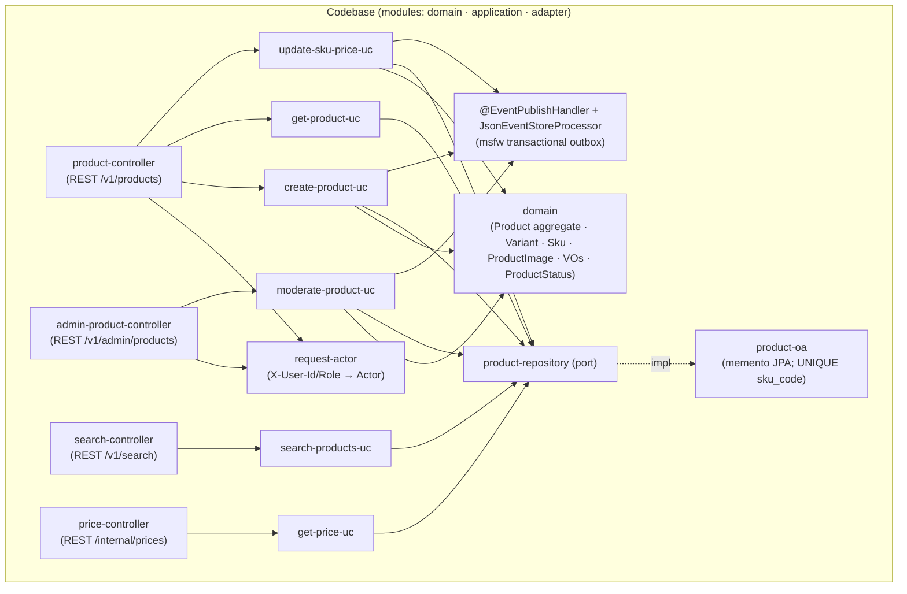
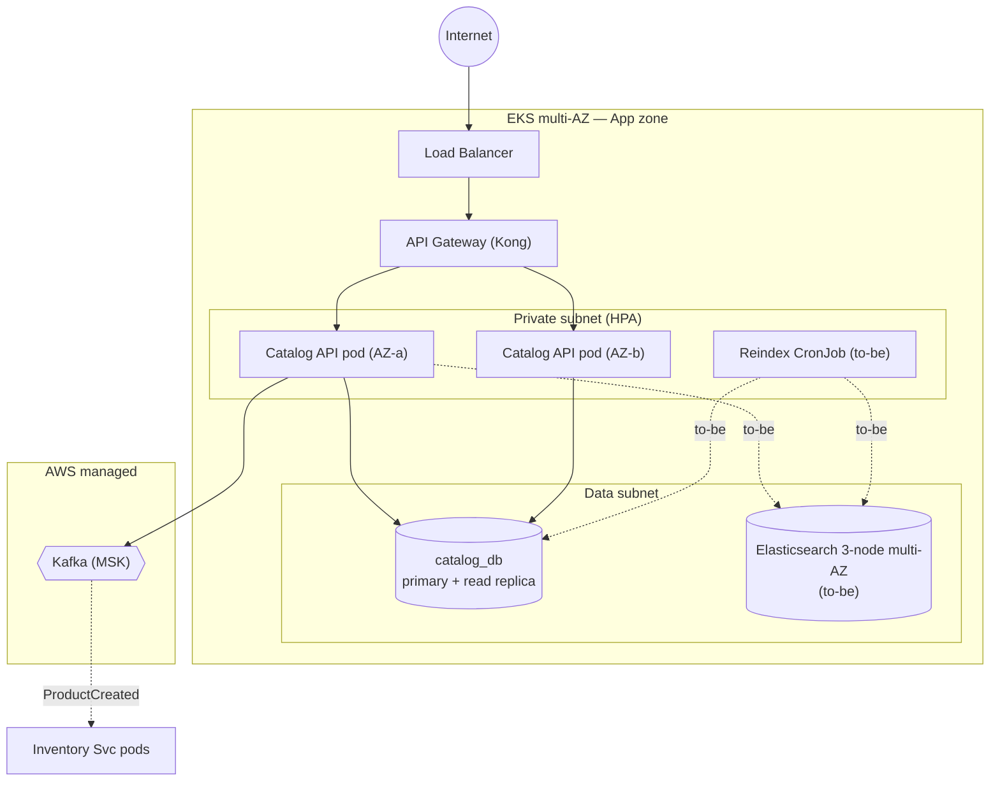
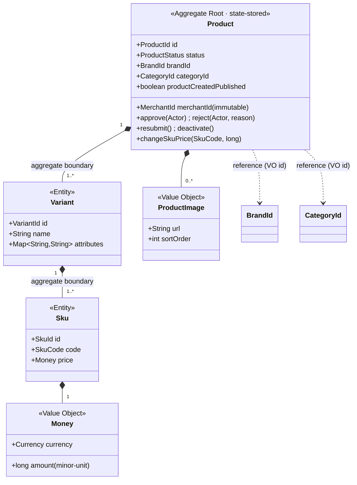
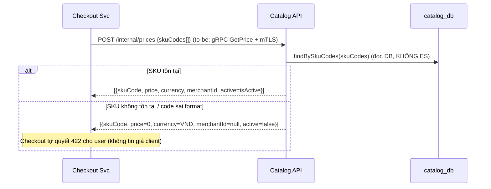
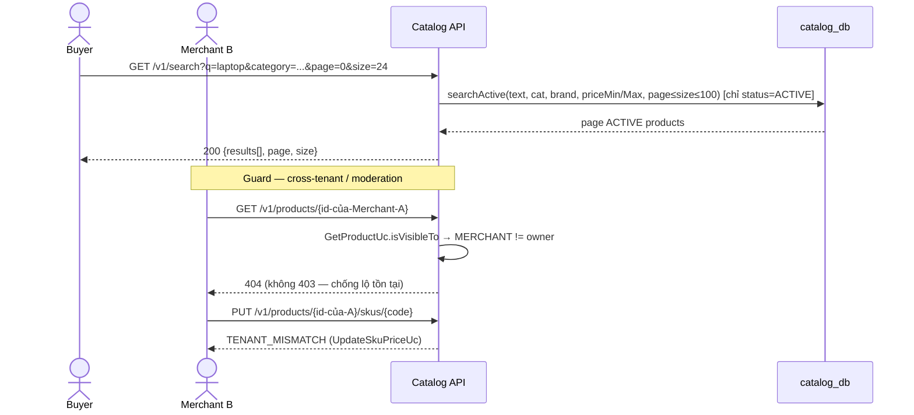

# Detailed Design — Catalog Service (Product Source of Truth)

> **Status:** v1.0 — căn theo `MKT-AD-CORE` v1.0.0 + `STD-DESIGN-DOC-v1.3` ·
> **Owner:** Catalog team ·
> **Reviewers:** _TBD_
>
> **Liên kết (lên AD / ngang hợp đồng):**
> - **AD-Marketplace** `MKT-AD-CORE` ([../AD-Marketplace.md](../AD-Marketplace.md)) — `MKT-BC-catalog` (§3.3 Container archetype, C4 L2 + Correspondence physical), §3.4 Context Map (`MKT-REL-02` / `MKT-REL-06`), §5 Hợp đồng giao tiếp (bề mặt + bảo đảm tương tác §5.3), §6 Dữ liệu (sở hữu miền + phân loại), §9 ADR register hệ thống.
> - Contracts (nguồn sự thật): `/contracts/Catalog.ProductCreated.json` (event envelope) · OpenAPI REST (to-be) · proto `Catalog.GetPrice` (**to-be** — chưa có trong code).
> - IaC / Terraform (HPA, NetworkPolicy, ES cluster) — _đẩy xuống, ngoài tài liệu này_.

> **Classification:** **Tier 3 — Important** _(Catalog down ⇒ không search/browse được; nhưng đơn đang xử lý KHÔNG ảnh hưởng — Order/Payment giữ snapshot giá bất biến)_ ·
> **Data class:** **product master** (name/price/SKU/category/brand) — **không giữ tiền thật**, **không PII nhạy cảm** (không email/phone/địa chỉ Buyer); `merchantId` là identifier nội bộ. · **System Owner:** Catalog team ⇒ **RTO < 24h · RPO < 4h** (`MKT-NFR-08`).
>
> **last-validated:** 2026-06-21 (đối chiếu nội dung ↔ source `catalog/` + `MKT-AD-CORE` v1.0.0).

> **Ranh giới tầng — Tech Spec này sở hữu gì vs AD giữ gì** (luật tầng STD §4 + `MKT-AD-CORE` §"Quan hệ tài liệu"):
> - **AD (`MKT-AD-CORE`) giữ — C4 L2 / Landscape:** hộp *Catalog BC* (`MKT-BC-catalog`); Context Map (Catalog = **Supplier** của Checkout `MKT-REL-02`; Catalog → Inventory qua `ProductCreated`, **Published Language** `MKT-REL-06`); bề mặt hợp đồng + bảo đảm tương tác (§5.3); deployment grain BC/zone (App zone).
> - **Tech Spec này sở hữu — C4 L3 / nội bộ Catalog Service:** module & component (§3.1), C&C + connector (§3.2), deployment chi tiết per-BC (§3.3 → IaC), domain model + invariant (§4.2) & data (§4.3), key flows nội bộ (§5), quyết định **context-local** `ADR-CAT-*` (§7).
> - **Đẩy xuống nữa:** field/mã lỗi đầy đủ → OpenAPI/proto + `/contracts`; replica/HPA/NetworkPolicy/ES sizing → IaC; ES mapping `products_v1` → repo ES.
>
> _(Lưu ý: "Tier 3 / product master" ở trên là **phân lớp dữ liệu/hệ thống** — khác với **C4 L2/L3**.)_

# 1. Context & Scope

Catalog Service là **nguồn sự thật (source of truth) cho sản phẩm** trên Marketplace: quản lý phân cấp **Product → Variant → SKU** (+ ảnh sản phẩm), kiểm duyệt nội dung (**moderation gate** Admin-only) trước khi hiển thị, **cung cấp giá cho Checkout**, và **publish `ProductCreated`** để Inventory khởi tạo SKU. Có database riêng (`catalog_db`); read model search nằm trên Elasticsearch (read path). Là **Tier 3** — không giữ tiền, không PII nhạy cảm, nhưng là nguồn giá ⇒ tính đúng đắn của giá là load-bearing cho Checkout.

**Ranh giới bounded context** (xác nhận trong code — `adapter/.../inbound/restful`):

- **Vào (REST, identity qua header `X-User-Id`/`X-User-Role` — stand-in cho JWT-qua-Gateway):**
  `POST /v1/products`, `GET /v1/products/{id}`, `PUT /v1/products/{id}/skus/{skuCode}` (Merchant); `POST /v1/admin/products/{id}/approve|reject` (Admin); `GET /v1/search` (public storefront).
- **Vào (S2S, internal):** `POST /internal/prices` (batch price lookup cho Checkout) — **as-is REST stand-in**; to-be gRPC `Catalog.GetPrice` + mTLS.
- **Ra (Kafka, publish-only):** `ProductCreated` → topic `catalog-events` (JSON), tới Inventory. **Catalog KHÔNG consume bất kỳ event nào** (no Kafka consumer trong code).
- **Không thuộc context:** tồn kho (Inventory Svc), giá khuyến mãi runtime (Promotion/Checkout — nếu có), vòng đời đơn (Order Svc), giỏ hàng (Cart), orchestration checkout (Checkout Svc).

**Trust boundary** (zero-trust, `MKT-ADR-0010`; không suy tin cậy từ vị trí mạng):

| ID | Ranh giới | Đối ứng (as-is) | Đối ứng (to-be) |
| --- | --- | --- | --- |
| `B1` | Public edge (Buyer/Merchant/Admin → Gateway → Catalog) | identity qua header forward (`RequestActor`); tenant scope + role enforce **ở domain** | JWT (RS256) verify ở Gateway PEP; rate-limit; WAF |
| `B2` | Inter-context (Checkout → Catalog `GetPrice`) | REST `/internal/prices` trong cluster | gRPC + mTLS (SVID), scope `catalog:read:price` |

> **Lưu ý nguồn (W6/A19 — chống tô vẽ):** identity hiện được lấy từ header `X-User-Id`/`X-User-Role` (`RequestActor`), **không** verify JWT trong code — đây là stand-in (`G-09` của AD). Role không hợp lệ ⇒ mặc định `BUYER`. Authority thật (Admin-only moderation, tenant scope) được **cưỡng chế ở domain/use-case**, không phụ thuộc Gateway.

**Goals:**

- Source of truth cho sản phẩm: Product/Variant/SKU — mọi context khác **tham chiếu** (reference logic), không duplicate.
- **Moderation gate là cổng bắt buộc:** sản phẩm mới luôn `PENDING`; **chỉ Admin** chuyển `ACTIVE`; sản phẩm chưa `ACTIVE` không xuất hiện storefront.
- Cung cấp **giá chính xác** cho Checkout — giá lấy từ **DB source of truth**, không từ ES.
- Publish `ProductCreated` **đúng một lần** (lần đầu `ACTIVE`) để Inventory init SKU = 0.

**Non-goals:** quản lý tồn kho · giá khuyến mãi/coupon runtime · giỏ hàng · image processing pipeline (resize/CDN nâng cao) · search analytics / recommendation.

# 2. Requirements

> FR xác nhận trong code (controller + use-case + domain). NFR nối về NFR hệ thống `MKT-NFR-*` của AD §8.1.

**Functional:**

| # | Yêu cầu | Giải thích (nguồn code) |
| --- | --- | --- |
| FR1 | Tạo sản phẩm (Merchant) | `POST /v1/products` → `CreateProductUc` → `ProductFactory`: tạo = **PENDING**; `merchantId` từ Actor (không từ body). Structural invariant (≥1 variant, ≥1 SKU, price>0) surface sớm ở factory |
| FR2 | Xem chi tiết sản phẩm | `GET /v1/products/{id}` → `GetProductUc`: visibility theo role (xem §4.2 inv. 9) |
| FR3 | Sửa giá SKU | `PUT /v1/products/{id}/skus/{skuCode}` → `UpdateSkuPriceUc`: tenant scope (`TENANT_MISMATCH` nếu khác chủ); `price>0` |
| FR4 | Moderation (Admin) | `POST /v1/admin/products/{id}/approve\|reject` → `ModerateProductUc` → `Product.approve/reject`: **chỉ Admin** (`requireAdmin`); reject cần `reason` |
| FR5 | Search storefront | `GET /v1/search?q&category&brand&priceMin&priceMax&page&size` → `SearchProductsUc.searchActive`: **chỉ ACTIVE**; phân trang 0-based |
| FR6 | Cung cấp giá cho Checkout | `POST /internal/prices` → `GetPriceUc.findBySkuCodes`: đọc **DB** (không ES); SKU không tìm thấy / không ACTIVE ⇒ `active=false`, `merchantId=null` |
| FR7 | Publish `ProductCreated` | `Product.approve` lần đầu → `DomainEventPublisher.publish(ProductCreated)`; flag `productCreatedPublished` đảm bảo **exactly once** |
| FR8 | Resubmit sau reject | `Product.resubmit` (REJECTED → PENDING); approve lần 2 **không** phát lại `ProductCreated` (flag đã set) |

> **Phân biệt với file design cũ (`docs/techspec-marketplace-catalog.md`):** code v1 **chưa** có: gRPC `GetPrice` (chỉ REST `/internal/prices`), upload ảnh S3 + CDN (`ProductImage` chỉ là VO `{url, sortOrder}` — không có handler upload), Category/Brand **aggregate** (chỉ có VO identity `CategoryId`/`BrandId`; brand-approval **không** enforce trong code), reindex CronJob/ES indexer (search là **DB stand-in** cho ES). Các mục đó = **to-be**, đánh dấu rõ dưới đây.

**Non-functional / SLO (Tier 3):**

| ID hệ thống | Thuộc tính | Mục tiêu | verify: |
| --- | --- | --- | --- |
| `MKT-NFR-02` | Search P95 | < 200 ms (to-be: qua ES; as-is: DB stand-in) | monitor |
| — | GetPrice P99 | < 100 ms (đọc DB) | monitor |
| `MKT-NFR-03` | REST API P99 (khác) | < 500 ms | monitor |
| `MKT-NFR-04` | Availability | ≥ 99.5% (Catalog/Search) | monitor |
| `MKT-NFR-08` | RTO / RPO Tier 3 | RTO < 24h · RPO < 4h | audit (DR drill) |
| — | Index lag DB→ES | < 5s (normal); < 30s (peak) — **inferred/TBD** (chưa có ES indexer trong code) | monitor (khi có ES) |
| — | Moderation SLA | duyệt < 24h (`MKT-GOAL-04`) | monitor |
| — | Degraded mode | ES down ⇒ search 503; `GetPrice` + write **vẫn chạy** (đọc DB) | test (failure-injection) |
| — | Tenant isolation | Merchant A ⊥ Merchant B trên mọi đọc/ghi | **test/check** (không chỉ review — §8.1) |

> **Bộ lọc ASR (STD §5.3):** Search P95 (`MKT-NFR-02`) là ASR vì *định hình cấu trúc* (ép tách read model ES khỏi write DB → CQRS, `ADR-CAT-1`). Tenant isolation là ASR vì *cross-cutting + giá-trị-rủi-ro cao* (lộ dữ liệu xuyên tenant).

# 3. Design overview

## 3.1 Module view (cấu trúc tĩnh — hexagonal / msfw)



> **Legend (W6):** hộp = module/lát-cắt mã (controller adapter · use-case application · domain · port · outbound adapter). Mũi tên = phụ thuộc biên dịch/gọi; **nét đứt** `repo → oa` = port↔adapter (inversion). `outbox` = cross-cutting AOP của msfw (proxy `@EventPublishHandler`), không phải module gọi thẳng.
>
> **frames:** `MKT-CONCERN-03` (Admin moderation) · `MKT-CONCERN-05` (tenant isolation) — *bức tranh code chia thế nào để cưỡng chế moderation gate + tenant scope*.

| Module | Trách nhiệm | Không được làm |
| --- | --- | --- |
| `product-controller` / `admin-product-controller` | Kết thúc REST; dựng `Actor` từ header (`RequestActor`); forward tới use-case; map response `CommonHttpResponse`. Không try/catch → domain exception nổi lên `GlobalExceptionHandler` của msfw | Business logic; persist; quyết moderation/tenant |
| `search-controller` | Kết thúc `/v1/search`; nhận query params; default `size=24`, `page=0` | Gọi DB/repo trực tiếp; chứa luật filter ACTIVE |
| `price-controller` | Kết thúc `/internal/prices` (S2S); nhận `skuCodes[]` | Verify danh tính Checkout (to-be: mTLS); đọc ES |
| `create/moderate/update-sku-price-uc` | Điều phối **một** thao tác ghi; gọi domain + repo; **state-writer → `@EventPublishHandler`** (outbox path, bắt buộc bởi fitness `stateWritersPublish`) | Biết HTTP/JDBC/Kafka; chứa invariant (ở domain) |
| `get-product-uc` / `search-products-uc` / `get-price-uc` | Đọc (read-only) — **không** `@EventPublishHandler`; áp visibility / ACTIVE-filter / DB-price | Ghi DB; publish event |
| `domain` (`Product`+`Variant`+`Sku`+`ProductImage`+VOs) | Aggregate root + cưỡng chế invariant (§4.2): status machine, moderation gate (`requireAdmin`), price>0, ≥1 variant/≥1 SKU, tenant-immutable, `ProductCreated` once. Đổi state **chỉ** qua verb method (no setter) | Biết HTTP/DB/ES/Kafka; làm I/O; phụ thuộc module khác (fitness `domainIsPure`) |
| `product-repository` (port) + `product-oa` | Repository memento (msfw `AbstractMementoJpaOa`); cưỡng chế **UNIQUE `sku_code`** (DB index); merge child in-place (không delete+reinsert → tránh trip UK); upsert theo `productId` | Business logic/invariant |

> **BN-1 · Moderation gate (domain + moderate-uc):** sản phẩm mới luôn `PENDING`. `approve/reject` gọi `requireAdmin(moderator)` → non-Admin ⇒ `UNAUTHORIZED_ACTION`. Chuyển sai trạng thái ⇒ `INVALID_STATUS_TRANSITION`. Đây là invariant cốt lõi — **fitness function** (§8).
>
> **BN-2 · `ProductCreated` exactly-once (domain `approve` + flag):** publish **một lần** khi lần đầu `ACTIVE`; `productCreatedPublished` immutable-sau-set. Reject → resubmit → approve lần 2 **không** phát lại (Inventory đã có SKU). Đây là **fitness function** (§8) + contract test (`ProductCreatedContractTest`).
>
> **BN-3 · CQRS read model (to-be):** write path → `catalog_db` (source of truth); read/search path → Elasticsearch (denormalized, eventually consistent). **as-is:** `searchActive` chạy trên DB (stand-in cho ES) với cùng filter `status='ACTIVE'`. `GetPrice` **luôn** đọc DB, không ES (consistency cho checkout) — đúng cả as-is lẫn to-be.

## 3.2 C&C view (runtime)

```mermaid
flowchart LR
  Client["Buyer / Merchant / Admin"] -->|"REST/HTTPS · identity header (to-be: JWT)"| GW["API Gateway"]
  GW -->|"HTTPS · identity forwarded"| API["Catalog API<br/>(REST + S2S)"]
  CHK["Checkout Svc"] -->|"POST /internal/prices (to-be: gRPC+mTLS)"| API
  API -->|"TLS · JDBC"| DB[("catalog_db<br/>PostgreSQL")]
  API -. "to-be" .->|"TLS · index/query"| ES[("Elasticsearch<br/>(read model)")]
  API -->|"publish · at-least-once (outbox)"| K{{"Kafka<br/>(catalog-events)"}}
  K -.->|"ProductCreated"| INV["Inventory Svc"]
```

> **Legend (W6):** hộp bo = service (Catalog API) · trụ `[( )]` = datastore (PG / ES) · `{{ }}` = message bus · hộp vuông = external/peer service. **Nét liền** = đồng bộ request/response · **nét đứt** = async (event) **hoặc** thành phần to-be (ES). Nhãn = giao thức/ý định.
>
> **frames:** `MKT-CONCERN-05/06` (ranh giới chạy + datastore + zero-trust connector).

**Connector catalog (zero-trust):**

| Connector | From → To | Protocol (as-is) | Authn/Authz | to-be |
| --- | --- | --- | --- | --- |
| storefront/merchant/admin | Gateway → Catalog API | HTTPS | identity header forward; role + tenant enforce ở domain | JWT (RS256) verify ở PEP |
| get-price | Checkout → Catalog API | REST `POST /internal/prices` | trong cluster (B2) | **gRPC + mTLS (SVID)**, scope `catalog:read:price` (`MKT-REL-02`) |
| state-rw | Catalog API → `catalog_db` | TLS/JDBC | IAM least-priv | — |
| search | Catalog API → `catalog_db` (stand-in) | TLS/JDBC | IAM least-priv | **→ Elasticsearch** (read/write role tách) |
| event-pub | Catalog API → Kafka | Kafka (outbox relay) | SASL/mTLS broker + ACL; topic `catalog-events` (`MKT-REL-06`) | — |

> **Component runtime:** as-is Catalog là **một** runtime component (Catalog API, REST + S2S + outbox relay in-process). to-be tách **Reindex Job** (CronJob) khi nội-hóa ES (xem §8.4 brownfield + `ADR-CAT-6`).

## 3.3 Deployment view (per-BC → IaC)



> **Legend (W6):** `(( ))` = boundary Internet · hộp = node/pod (instance của Catalog API container) · trụ = datastore · `{{ }}` = bus managed · **nét đứt** = thành phần/đường to-be. Không hộp "lửng".
>
> **frames:** `MKT-CONCERN-06` (vận hành/phục hồi).

**Thực thi zero-trust ở tầng deploy (→ IaC):**
- NetworkPolicy default-deny; chỉ mở GW→Catalog, Catalog→`catalog_db`, Catalog→Kafka (+ to-be Catalog/Reindex→ES). **Không egress Internet** (Catalog không gọi external provider).
- Workload identity (IRSA) least-priv: API read/write `catalog_db` + publish Kafka; (to-be) Reindex Job: read DB + write ES, **không** publish Kafka.
- HPA theo search/serving traffic; replica/sizing = **đẩy xuống IaC** (không ở đây).

# 4. Interfaces & data

> Hợp đồng đầy đủ (field/mã lỗi) → OpenAPI/proto + `/contracts` (W4). Dưới đây chỉ ngữ nghĩa load-bearing.

## 4.1 Interfaces

| # | Loại | Interface | Auth (as-is) | Ngữ nghĩa |
| --- | --- | --- | --- | --- |
| 1 | REST (in) | `POST /v1/products` | identity header (Merchant) | Tạo product **PENDING**; `merchantId` từ Actor, không body |
| 2 | REST (in) | `GET /v1/products/{id}` | identity header | Visibility theo role (inv. 9); miss/không-thấy ⇒ **404** (không 403 — chống lộ tồn tại) |
| 3 | REST (in) | `PUT /v1/products/{id}/skus/{skuCode}` | identity header (Merchant) | Sửa giá SKU; tenant scope (`TENANT_MISMATCH` nếu khác chủ); `price>0` |
| 4 | REST (in) | `POST /v1/admin/products/{id}/approve` | identity header (Admin) | PENDING → ACTIVE; publish `ProductCreated` lần đầu |
| 5 | REST (in) | `POST /v1/admin/products/{id}/reject` | identity header (Admin) | PENDING → REJECTED; body cần `reason` |
| 6 | REST (in) | `GET /v1/search?q&category&brand&priceMin&priceMax&page&size` | public | Chỉ ACTIVE; `size` clamp ≤ 100, default 24; `page` ≥ 0 |
| 7 | REST (in, S2S) | `POST /internal/prices` `{skuCodes[]}` | trong cluster (B2) | Batch price từ **DB**; SKU không thấy/không ACTIVE ⇒ `{active:false, merchantId:null}` (giữ thứ tự input) |
| 8 | event (out) | `Catalog.ProductCreated` → `catalog-events` (JSON) | Kafka | Lần đầu ACTIVE; consumer: Inventory (init SKU=0) |

**Bảo đảm tương tác** (đồng bộ `MKT-AD-CORE` §5.3):

| Tương tác | Sync/Async | Consistency | Idempotency | Delivery | Hành vi lỗi / suy giảm | verify: |
| --- | --- | --- | --- | --- | --- | --- |
| `GetPrice` (Checkout → Catalog) | sync | strong-in-context (đọc DB) | n/a (read) | request/response | DB down → 503 (Checkout không tin giá client; có thể đã có snapshot trước đó) | test · monitor |
| `ProductCreated` (Catalog → Inventory) | async | eventual | producer: exactly-once-publish (flag); **consumer dedupe theo `eventId`** (Inventory phải idempotent theo `productId`) | at-least-once (outbox) | DLQ phía consumer; Catalog replay từ event store | test · contract |
| search (Buyer → Catalog) | sync | eventual (to-be ES lag) | n/a | request/response | ES down → 503; DB write/`GetPrice` vẫn chạy | test · monitor |

> **as-is/to-be (N3):** `GetPrice` đổi protocol REST→gRPC+mTLS (`MKT-CHG-02`) nhưng **bề mặt + bảo đảm không đổi** (batch skuCodes → prices; đọc DB). `ProductCreated` envelope chuẩn (`eventId, eventType, occurredAt, traceId, merchantId`) — serialize format = **TBD** (`MKT-ADR-0013`); hiện JSON.

## 4.2 Domain model



> **Legend (W6):** `*--` = composition (aggregate boundary — Variant/Sku/Image thuộc trong `Product`) · `..>` = reference qua VO identity (Brand/Category là **reference logic**, không aggregate trong code v1). Identities (`ProductId/VariantId/SkuId/MerchantId/BrandId/CategoryId`) đều extend msfw `StringIdentity` (fitness `msfwIdentityBase`).
>
> **frames:** `MKT-CONCERN-03` (moderation) · `MKT-CONCERN-05` (tenant).

**Invariant (đánh số + verify:):**

1. **Status machine có kiểm soát:** `PENDING → (ACTIVE | REJECTED)`; `ACTIVE → DEACTIVATED` (terminal); `REJECTED → PENDING` (resubmit). Transition sai ⇒ `INVALID_STATUS_TRANSITION`. — verify: **test** (`ProductTest`).
2. **Moderation gate — chỉ Admin** approve/reject (`requireAdmin`); non-Admin ⇒ `UNAUTHORIZED_ACTION`. — verify: **test/check** (an toàn/elevation, không chỉ review — §8.1).
3. **SKU code UNIQUE toàn hệ thống** — `skus.sku_code` DB UNIQUE là thẩm quyền (`SkuEntity` `unique=true`); domain `SkuCode` chỉ validate format `^[A-Za-z0-9][A-Za-z0-9_-]{1,63}$`. Trùng ⇒ `DUPLICATE_SKU`. — verify: **test/check** (toàn-vẹn-dữ-liệu).
4. **≥1 Variant/Product, ≥1 SKU/Variant** — `EMPTY_PRODUCT` / `EMPTY_VARIANT`. — verify: **test**.
5. **Price > 0** — `Sku` cưỡng chế khi tạo + mọi đổi giá (`INVALID_PRICE`); `Money.amount` non-negative (≥0), strict-positive là invariant của SKU. — verify: **test**.
6. **`merchantId` immutable** — set lúc tạo, **không có mutator** (no setter). — verify: **test/check** (tenant — không chỉ review).
7. **`ProductCreated` exactly-once** — publish khi lần đầu ACTIVE; flag `productCreatedPublished` không phát lại. — verify: **test** (`ProductTest` + `ProductCreatedContractTest`).
8. **Reject cần reason** — `reject` blank reason ⇒ `REJECTION_REASON_REQUIRED`. — verify: **test**.
9. **Visibility (read):** ADMIN thấy tất cả; MERCHANT chỉ sản phẩm **của mình** (mọi status); BUYER/anonymous chỉ **ACTIVE**; miss ⇒ **404 không 403** (`GetProductUc`, chống lộ tồn tại xuyên tenant/moderation). — verify: **test/check** (xuyên-tenant).
10. **Tenant scope ghi giá:** chỉ Merchant chủ đổi giá; khác chủ ⇒ `TENANT_MISMATCH` (`UpdateSkuPriceUc`). — verify: **test/check**.

> **Không có trong code v1 (đánh dấu — A16 brownfield):** invariant "Brand phải APPROVED trước khi reference" của design cũ **chưa enforce** (error code `BRAND_NOT_APPROVED` tồn tại nhưng không có chỗ gọi; Brand chưa là aggregate). → open question §9.

## 4.3 Data model

| Store | Bảng / đối tượng | Ghi chú |
| --- | --- | --- |
| `catalog_db` (PG; H2 ở standalone) | `products`, `variants`, `skus` (**UNIQUE `sku_code`**), `variant_attributes` (jsonb/map của variant), `product_images` | State-stored qua memento (msfw `AbstractMementoJpaOa`); child merge in-place; upsert theo `productId` |
| `catalog_db` (outbox) | event store (msfw `JsonEventStoreProcessor`) | **Transactional outbox** cho `ProductCreated` — ghi cùng tx nghiệp vụ, relay đẩy ra Kafka (at-least-once). Không bảng outbox riêng do dev gõ tay |
| Elasticsearch `products_v1` (**to-be**) | denormalized document — **chỉ ACTIVE** | Read model search; nguồn = `catalog_db`; nghi lệch → reindex |

**Cột load-bearing:**

| Cột | Ý nghĩa |
| --- | --- |
| `products.merchant_id` | Tenant scope; immutable (inv. 6) |
| `products.status` | Moderation gate (inv. 1/2); chỉ ACTIVE được index ES / serve search |
| `products.product_created_published` | Flag exactly-once `ProductCreated` (inv. 7) |
| `products.moderated_by` / `moderation_reason` / `moderated_at` | Audit trail kiểm duyệt (repudiation) |
| `skus.sku_code` (UK) | UNIQUE toàn hệ thống (inv. 3); key cho `GetPrice` + Inventory |
| `skus.price_amount` (bigint) + `currency` | Minor-unit (`long`) — tránh float; source of truth giá |

> **Reference logic (`MKT-ADR-0002`):** `brandId`, `categoryId`, `merchantId`, `skuCode`, `productId` đi qua ranh giới chỉ như **giá trị tham chiếu** — **không** FK vật lý xuyên context (fitness: quét migration ở AD).

## 4.4 Config & tunables

| Tham số | Khởi điểm | Ghi chú (nguồn) |
| --- | --- | --- |
| search `DEFAULT_PAGE_SIZE` | 24 | `SearchProductsUc` (constant) |
| search `MAX_PAGE_SIZE` | 100 | `SearchProductsUc` clamp (chống abuse) |
| event routing topic | `catalog-events` (format JSON) | `application.yml` `app.config.event.routing` |
| `catalog.reindex_cron` (to-be) | `0 * * * *` hourly | **inferred/TBD** — chưa có reindex job trong code |
| `catalog.index_lag_alert_s` (to-be) | 30 | **inferred/TBD** — khi có ES |

## 4.5 Personal data handling

> Catalog **gần như không có PII** — không lưu email/phone/địa chỉ Buyer.

| Data element | Class | Lưu ở đâu | Retention |
| --- | --- | --- | --- |
| Thông tin sản phẩm (name/description/price/SKU) | product master (L2) | `catalog_db` (+ ES read model to-be) | vòng đời SP + 10 năm archive (giá snapshot phục vụ đối soát Order) |
| `merchant_id` | identifier (không PII) | `catalog_db` | theo sản phẩm |
| `created_by` / `moderated_by` (Admin/Merchant id) | identifier | `catalog_db` (audit) | theo sản phẩm |
| Product image (`url`) | product master | `catalog_db` (`product_images`); S3+CDN = **to-be** | theo sản phẩm |

- **Không PII nhạy cảm** ⇒ không cần field-level encrypt; at-rest AES-256 ở mức store (RDS/ES) là đủ. `merchant_id` là identifier nội bộ, không phải PII.
- **DSAR/xóa:** Merchant yêu cầu xóa → `deactivate` (rút khỏi storefront/ES); không hard-delete vì giá snapshot phục vụ đối soát (10 năm). — **inferred/TBD** (chưa có endpoint delete trong code).

# 5. Key flows

## 5.1 Tạo sản phẩm → Admin duyệt → index + `ProductCreated` (happy)

```mermaid
sequenceDiagram
  actor Merchant
  actor Admin
  participant API as Catalog API
  participant DB as catalog_db
  participant OB as outbox (event store)
  participant K as Kafka (catalog-events)
  participant INV as Inventory Svc
  Merchant->>API: POST /v1/products (X-User-Role: MERCHANT)
  API->>API: ProductFactory.create → PENDING (≥1 variant/SKU, price>0)
  API->>DB: save(product PENDING)
  API-->>Merchant: 201 {id, status: PENDING}
  Admin->>API: POST /v1/admin/products/{id}/approve (X-User-Role: ADMIN)
  API->>API: Product.approve(Actor) — requireAdmin; PENDING→ACTIVE
  API->>API: first activation → publish ProductCreated; set flag
  API->>DB: save(product ACTIVE) + outbox row (same tx)
  OB->>K: relay ProductCreated (at-least-once)
  K-->>INV: ProductCreated {productId, merchantId, skuCodes[]} → init SKU=0
```

## 5.2 Price lookup cho Checkout



## 5.3 Search (storefront) + 5.4 fail/guard (moderation gate)



# 6. Operations & Resilience (delta)

> DR platform xem `MKT-AD-CORE` §12 — dưới đây là delta của Catalog (Tier 3).

- **`catalog_db` (source of truth):** PITR; daily snapshot; **RPO < 4h** (`MKT-NFR-08`); test-restore quarterly. Mất DB = mất data; ES có thể rebuild.
- **Elasticsearch (read model — to-be):** snapshot daily; **rebuild hoàn toàn từ DB** bằng reindex job. Mất ES = search tạm gián đoạn; `GetPrice` + write **vẫn chạy** (đọc DB).
- **Kafka `catalog-events`:** dựa MSK durability; `ProductCreated` có outbox/event store → **replay từ DB** nếu mất.
- **Degraded mode:** ES down → search 503, `GetPrice`/write OK; DB down → write + `GetPrice` 503, ES (nếu có) vẫn serve stale search.
- **ES mapping change (to-be `ADR-CAT-6`):** tạo `products_v2` + alias swap (zero-downtime), không in-place; reindex sau deploy.
- **CI/CD:** deploy **rolling** (Tier 3, risk thấp); DB migration backward-compatible (expand/contract).
- **Alert:** P2 — `GetPrice` error > 5% · ES index lag > 30s (to-be) · reindex fail; P3 — moderation backlog > 100 pending > 24h (`MKT-GOAL-04`).

# 7. Decisions context-local (`ADR-CAT-*`) & cross-cutting

> Quyết định nội bộ Catalog (`ADR-CAT-*`) — **khác** ADR register hệ thống ở `MKT-AD-CORE` §9; cụ thể hóa các ADR hệ thống liên quan (`MKT-ADR-0002` db-per-context, `MKT-ADR-0004` event-là-hợp-đồng, `MKT-ADR-0005` idempotency/consumer, `MKT-ADR-0009` tenant isolation).

**`ADR-CAT-1` — CQRS nhẹ (write DB + read ES) thay single DB cho cả write & search.** Full-text trên PG không đạt `MKT-NFR-02` (P95<200ms) ở quy mô. ES = read model, DB = source of truth. _Hệ quả:_ eventual consistency (index lag); cần reindex chống lệch; `GetPrice` phải đọc DB. _(as-is: search là DB stand-in — `ADR-CAT-6` lo nội-hóa ES.)_

**`ADR-CAT-2` — Moderation gate bắt buộc (không auto-approve), Admin-only.** Marketplace đa-merchant cần kiểm soát chất lượng. _Hệ quả:_ bottleneck Admin throughput; cần dashboard backlog; tương lai auto-approve cho Merchant trusted (feature flag — §9). _Cưỡng chế ở domain (`requireAdmin`), không phụ thuộc Gateway._

**`ADR-CAT-3` — `ProductCreated` publish một lần (không mỗi lần ACTIVE).** Inventory chỉ init SKU=0 một lần; phát lại → reset stock. _Hệ quả:_ flag `product_created_published`; Inventory **phải** idempotent theo `productId` (đồng bộ `MKT-ADR-0005`). Hỗ trợ `MKT-REL-06` (Published Language).

**`ADR-CAT-4` — Giá source of truth ở SKU (DB), không ES.** ES có thể lệch; Checkout cần giá chính xác → `GetPrice` đọc DB. _Hệ quả:_ thêm 1 DB query/checkout; cân nhắc read replica nếu load cao.

**`ADR-CAT-5` — `GetPrice` as-is REST `/internal/prices`, to-be gRPC+mTLS.** Stand-in cho gRPC (`G-09`); bề mặt + bảo đảm giữ nguyên (`MKT-CHG-02`). _Hệ quả:_ B2 hiện chưa mTLS (`MKT-RISK-07`); chỉ adapter đổi khi lên gRPC.

**`ADR-CAT-6` — Search/ES nội-hóa = to-be; as-is dùng DB stand-in.** `searchActive` chạy DB với cùng filter ACTIVE. _Hệ quả:_ as-is không đạt P95<200ms ở quy mô lớn — nợ kỹ thuật cho tới khi có ES indexer + alias-swap.

> **Money local-design (liên quan quyết định toàn cục):** Catalog dùng **Money local** (`long` minor-unit + `enum Currency {VND,USD,EUR}`) **chứ không** `msfw domain.type.Money` (BigDecimal). Đây là chủ ý hiện tại (duplicate per-context), nhưng **hợp nhất là open decision** (ADR 0003-candidate toàn hệ — xem global note). Không tự ý swap.

**Threat seed (STRIDE):**

| Threat | Bề mặt | Đối ứng |
| --- | --- | --- |
| **S**poofing | Merchant giả danh Merchant khác | `merchantId` từ Actor (header/JWT), không body; tenant scope (`TENANT_MISMATCH`) |
| **T**ampering | Sửa giá trái phép; XSS trong description | tenant scope ghi giá; `price>0`; (to-be) sanitize HTML server-side |
| **R**epudiation | Phủ nhận tạo/duyệt | `created_by`/`moderated_by` audit từ Actor |
| **I**nfo disclosure | Xem PENDING/REJECTED hoặc sản phẩm Merchant khác | visibility (inv. 9) → **404 không 403**; search filter cứng ACTIVE |
| **D**oS | Spam tạo/flood search | (to-be) rate-limit per-merchant CRUD + global search; `MAX_PAGE_SIZE=100` |
| **E**levation | Merchant tự approve | `requireAdmin` (inv. 2) → `UNAUTHORIZED_ACTION` |

# 8. Test strategy

> Đã có trong repo: `ProductTest`, `ProductCreatedContractTest`, `CreateProductUcTest`, `ModerateProductUcTest`, `UpdateSkuPriceUcTest`, `GetProductUc`/`Search`/`GetPrice` (qua `InMemoryProductRepository`), controller tests, `ProductOaTest`, `FitnessFunctionsTest`.

- **Unit (`domain`):** status machine (PENDING→ACTIVE/REJECTED; ACTIVE→DEACTIVATED; REJECTED→PENDING); `requireAdmin`; `price>0`; ≥1 variant/SKU; reject cần reason; `ProductCreated` exactly-once + flag (`ProductTest`).
- **Contract:** `ProductCreated` envelope `{productId, merchantId, skuCodes[]}` + `DomainEventType.of("Catalog","ProductCreated")` (`ProductCreatedContractTest`); proto `GetPrice` consumer-driven với Checkout (**to-be**).
- **Use-case:** create→PENDING; moderate approve/reject + publish; update-price tenant scope (`TENANT_MISMATCH`); get visibility per-role (404 miss); search clamp page/size + ACTIVE-only; getPrice DB + `active=false` cho miss.
- **Persistence:** UNIQUE `sku_code` (insert trùng ⇒ vi phạm); update giá merge child in-place không trip UK (`ProductOaTest`).
- **Failure-injection:** ES down → search 503, `GetPrice`/write OK; DB down → write+`GetPrice` 503.
- **Fitness functions (bắt buộc — `FitnessFunctionsTest` + EA registry):**
  - **`domainIsPure`** — domain không I/O.
  - **`stateWritersPublish`** — mọi use-case ghi state đi qua outbox (`@EventPublishHandler`).
  - **`msfwIdentityBase`** — mọi identity extend `StringIdentity`.
  - **SKU code uniqueness** — `sku_code` UNIQUE (DB + insert-trùng test).
  - **Only-Admin-moderates** — non-Admin approve/reject ⇒ `UNAUTHORIZED_ACTION`.
  - **`ProductCreated` exactly-once** — approve lần 2 (resubmit) **không** publish lại.
  - **Tenant scope** — Merchant B đổi giá/đọc sản phẩm Merchant A ⇒ `TENANT_MISMATCH` / 404.

**Acceptance mẫu:**
- _Moderation gate:_ tạo → PENDING, không xuất hiện search; Admin approve → ACTIVE, xuất hiện search + `ProductCreated` đúng 1 lần.
- _Tenant:_ Merchant A tạo → Merchant B GET ⇒ 404; B PUT giá ⇒ `TENANT_MISMATCH`.
- _GetPrice consistency:_ sửa giá 100K→200K → Checkout `GetPrice` trả 200K (từ DB).
- _Exactly-once:_ approve → reject → resubmit → approve lần 2 ⇒ **không** publish `ProductCreated` lại.

# 9. Open questions

1. **gRPC `GetPrice` + mTLS:** nội-hóa to-be (`MKT-CHG-02`); hiện REST `/internal/prices`. Khi nào cắt?
2. **Elasticsearch nội-hóa (`ADR-CAT-6`):** search hiện chạy DB stand-in → không đạt `MKT-NFR-02` ở quy mô; lịch nội-hóa ES + reindex job + alias-swap = TBD.
3. **Brand/Category aggregate + brand-approval:** code v1 chỉ có VO identity; `BRAND_NOT_APPROVED` chưa được gọi. Có cần nâng Brand/Category thành aggregate + enforce duyệt brand không?
4. **Image upload S3 + CDN:** `ProductImage` chỉ là VO `{url, sortOrder}`; chưa có upload handler/strip-EXIF/CDN. Có cần pipeline ảnh không?
5. **Money hợp nhất (global):** Catalog dùng Money local (`long` + enum Currency) vs msfw `domain.type.Money` (BigDecimal). Hợp nhất = open decision toàn hệ (ADR 0003-candidate).
6. **Auto-approve Merchant trusted:** bỏ moderation gate cho merchant history tốt (feature flag `auto_approve_merchant_ids`)? Tương lai.
7. **Soft vs hard delete + product versioning:** chưa có endpoint delete / changelog giá; ảnh hưởng đối soát (Order giữ snapshot, truy ngược cần metadata).
8. **Serialize format event (`MKT-ADR-0013`):** hiện JSON; Avro/Proto/JSON-Schema = TBD toàn hệ.
