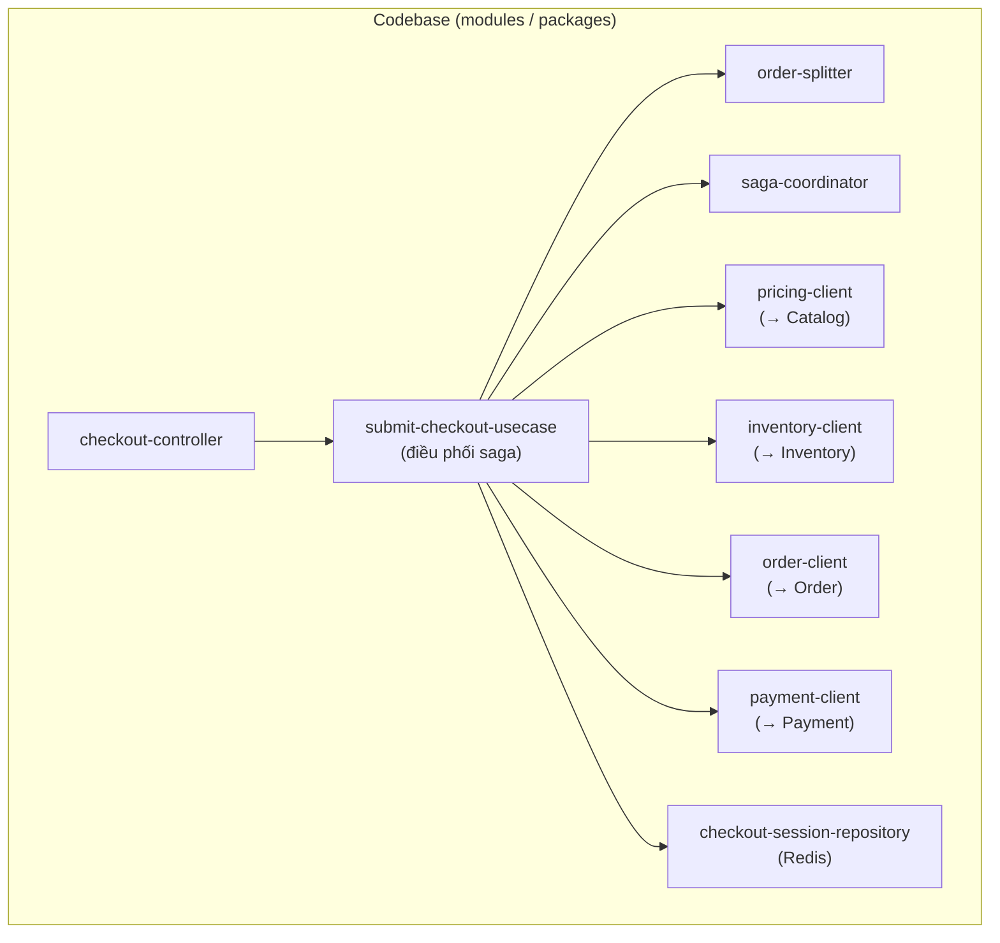
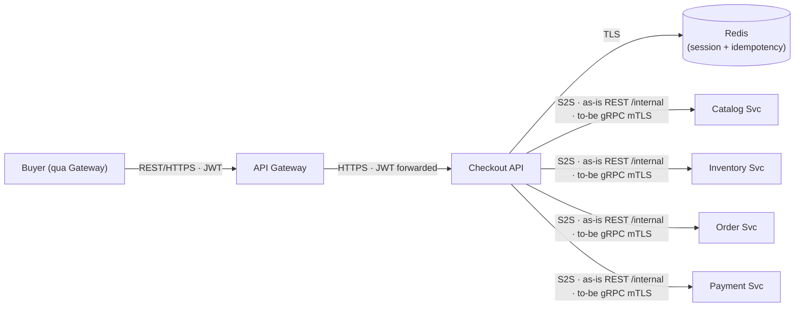
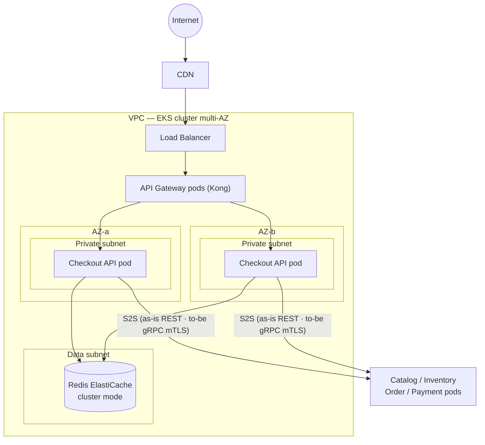
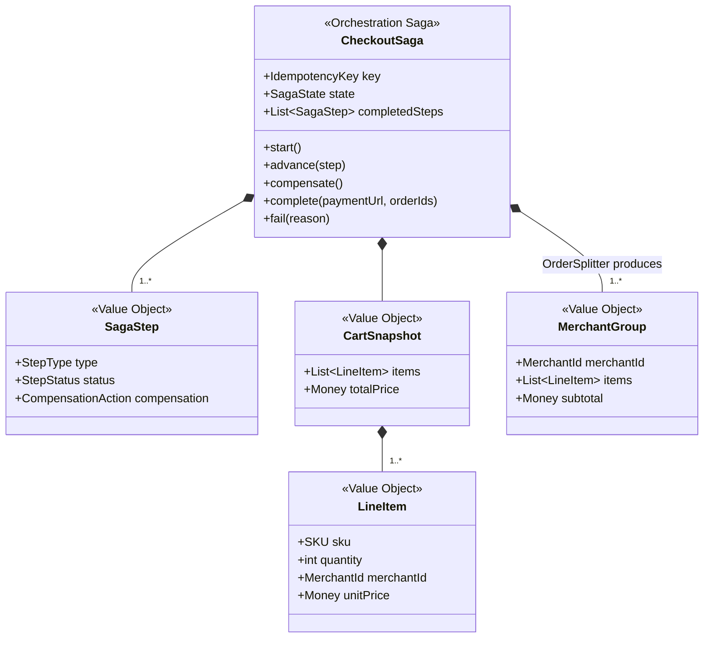
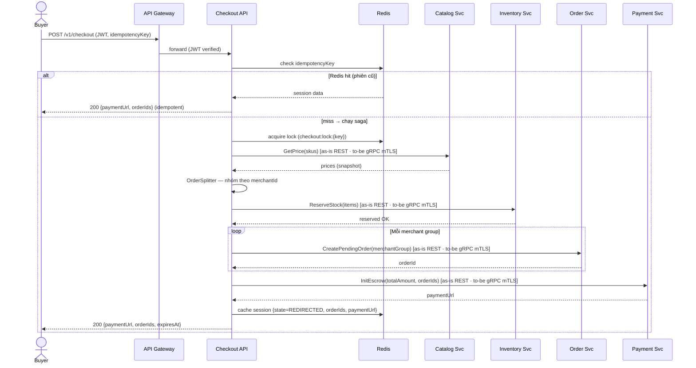
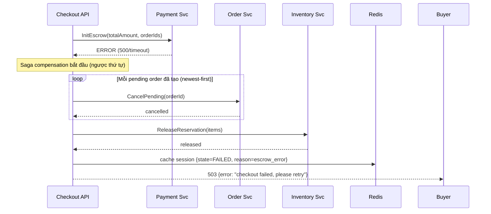
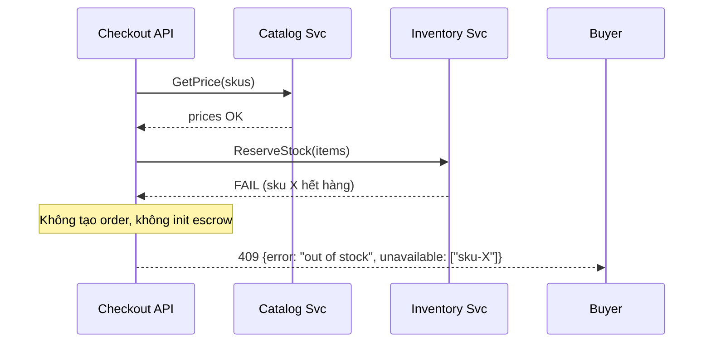

# Detailed Design — Checkout Service (Orchestrator)

> **Status:** v1.1 — căn theo `AD-Marketplace.md` (`MKT-AD-CORE`) ·
> **Owner:** Checkout team ·
> **Reviewers:** _TBD_ ·
> **last-validated:** 2026-06-21 (đối chiếu nội dung ↔ source code `checkout/` + AD)
>
> **Liên kết (lên AD):** [`AD-Marketplace.md`](../AD-Marketplace.md) — Checkout = `MKT-BC-checkout` (**Tier 2, stateless, Redis, không DB**). Neo:
> - **§3.3** Container archetype — hộp `MKT-BC-checkout` (Service + Redis, **C4 L2**; AD dừng ở L2 · Tech Spec sở hữu L3) + Correspondence physical.
> - **§3.4** Context Map — `MKT-REL-02/03/04/05`: Checkout = **Customer** của Catalog/Inventory/Order/Payment (Customer/Supplier).
> - **§4.1** `MKT-VIEW-05` — luồng Checkout (orchestration + compensation).
> - **§5** Bề mặt đồng bộ (§5.1) + bảng bảo đảm tương tác (§5.3): "Checkout → 4 BC".
> - **§9** ADR Index hệ thống — `MKT-ADR-0003` (Orchestration/saga), `MKT-ADR-0005` (Idempotency), `MKT-ADR-0006` (Escrow).
> - **"Correspondence physical"** — Checkout Svc (HPA) · Redis (managed) · App zone (no DB).
> - OpenAPI/proto (hợp đồng đầy đủ — _nguồn sự thật_) · IaC/Terraform (replica/HPA/NetworkPolicy).

> **Classification:** **Tier 2 — Business Critical** _(checkout gián đoạn = mất doanh thu nhưng không mất tiền đã giữ — escrow thuộc Payment Tier 1)_
>
> **Data class:** L2 (cart items, session metadata) + L3 (thông qua: giá snapshot, merchantId) · **System Owner:** Checkout team ⇒ **RTO < 4h · RPO < 1h** (AD `MKT-NFR-07`). Tiêu chuẩn: System Tiering · Data Classification.

> **Ranh giới tầng — Tech Spec này sở hữu gì vs AD giữ gì** (theo `STD-DESIGN-DOC-v1.3` §2–§4):
> - **AD giữ — C4 L2 / Landscape:** hộp *Checkout BC* (`MKT-BC-checkout`); Context Map (Checkout = Customer của Catalog/Inventory/Order/Payment — `MKT-REL-02..05`); bề mặt hợp đồng + bảo đảm tương tác (AD §5); deployment ở grain BC/zone (Correspondence physical).
> - **Tech Spec này sở hữu — C4 L3 / nội bộ Checkout Service:** module & component (§3.1), C&C (§3.2), deployment chi tiết per-BC (§3.3 → IaC), domain saga + Redis schema (§4.2–4.3), key flows nội bộ (§5), quyết định **context-local** `ADR-CHK-*` (§7).
> - **Đẩy xuống nữa:** field/mã lỗi đầy đủ → OpenAPI/proto; số replica/HPA/secret → IaC/Vault.
>
> _(Lưu ý: "L2/L3" ở dòng **Data class** phía trên là **phân lớp dữ liệu** — khác với **C4 L2/L3** dùng ở đây.)_

# 1. Context & Scope

Checkout Service là **orchestrator nội bộ** điều phối luồng từ "Buyer bấm đặt hàng" tới "redirect sang cổng thanh toán". Service gọi đồng bộ tới 4 bounded context khác để hoàn tất một saga. Checkout **gần như stateless** — chỉ giữ phiên tạm ở Redis (TTL 30 phút), không có database riêng (AD `MKT-BC-checkout`).

> **as-is vs to-be (bề mặt giữ nguyên, protocol đổi — AD §5.1/§8.4):** trong code hiện tại (**as-is**) Checkout gọi 4 BC bằng **REST `/internal/*`** làm stand-in (`MKT-ADR-0004`/`-aac`); đích kiến trúc (**to-be**) là **gRPC + mTLS** qua Istio (AD `MKT-CHG-02`). **Bề mặt + bảo đảm tương tác không đổi** — chỉ protocol đổi (đúng N3). Các sơ đồ/bảng dưới đây ghi grain to-be (gRPC mTLS); chỗ khác biệt với code được đánh dấu rõ.

**Ranh giới bounded context:**

- **Vào:** REST `POST /v1/checkout` từ API Gateway (JWT, qua BFF).
- **Ra (đồng bộ):** Catalog.GetPrice, Inventory.ReserveStock, Order.CreatePendingOrder, Payment.InitEscrow. _as-is:_ REST `/internal/*` · _to-be:_ gRPC + mTLS (SVID).
- **Không thuộc context:** xử lý kết quả thanh toán (Payment webhook), state machine đơn sau khi đã tạo (Order Svc), quản lý giỏ hàng (Cart — context riêng hoặc client-side), tồn kho (Inventory).

**Trust boundary:** mọi caller phải mang JWT hợp lệ qua Gateway; mọi gọi S2S nội bộ — _to-be:_ qua mTLS (SVID), _as-is:_ REST `/internal` trong cluster (AD `B2`). Không ngầm tin cậy từ vị trí mạng. Chi tiết cơ chế ở §3.2/§3.3/§4.

**Goals:**

- Tổng hợp giá từ Catalog (snapshot), reserve kho từ Inventory, tự động tách đơn theo Merchant, tạo pending order, khởi tạo escrow — tất cả trong một saga đồng bộ.
- Compensation tập trung: một bước lỗi → rollback các bước trước (release reservation, hủy pending order).
- Idempotency: double-submit cùng key → trả kết quả cũ, không chạy lại saga.

**Non-goals:**

- Không xử lý webhook thanh toán (Payment Svc).
- Không quản lý state machine đơn hàng (Order Svc).
- Không quản lý giỏ hàng / cart.
- Không lưu trữ dữ liệu bền vững (stateless, phiên ở Redis).

# 2. Requirements (tóm tắt — nguồn đầy đủ ở backlog)

**Functional:**

| # | Yêu cầu | Giải thích |
| --- | --- | --- |
| FR1 | Tổng hợp giá (price snapshot) | Gọi Catalog.GetPrice, gắn giá tại thời điểm checkout vào pending order — không tin giá từ client |
| FR2 | Reserve kho | Gọi Inventory.ReserveStock; hết hàng → trả 409, không tạo đơn |
| FR3 | Tách đơn theo Merchant (OrderSplitter) | Nhóm items theo `merchantId` → tạo N pending order (mỗi Merchant một đơn), nhưng một escrow cho tổng giỏ |
| FR4 | Tạo pending order | Gọi Order.CreatePendingOrder cho mỗi nhóm Merchant |
| FR5 | Khởi tạo escrow | Gọi Payment.InitEscrow (tổng giỏ), trả `paymentUrl` cho Buyer |
| FR6 | Compensation (saga rollback) | Escrow lỗi → hủy pending order → release reservation. Reserve một phần thành công rồi lỗi → release các SKU đã reserve |
| FR7 | Idempotency | Header `Idempotency-Key` bắt buộc; cùng key → trả kết quả phiên cũ (Redis), không chạy lại saga |

**Non-functional / SLO (Tier 2)** — `verify:` theo `STD-DESIGN-DOC-v1.3` §8.1 (nối về AD `MKT-NFR-*`):

| Thuộc tính | Mục tiêu | verify: | Nối AD |
| --- | --- | --- | --- |
| Checkout P99 latency (end-to-end) | < 800 ms (bao gồm orchestration nhiều context) | test(load) · monitor | `MKT-NFR-01` |
| API availability | ≥ 99.9% | monitor | `MKT-NFR-04` |
| RTO / RPO | RTO < 4h · RPO < 1h | audit (DR drill) | `MKT-NFR-07` |
| Throughput | 3.000 RPS sustained (flash sale) | test(load) | `MKT-NFR-05` |
| Degraded mode | Catalog/Inventory down ⇒ 503 (không tạo đơn sai giá/kho) | test(failure-injection) · monitor | `MKT-QS-04` |

> `verify:` không có mệnh đề trọng yếu nào chỉ `review` — các mục có chế độ lỗi runtime (latency, availability, degraded) phải `test`/`monitor` (chống A9). `audit` dùng cho RTO/RPO (tái-soát định kỳ qua DR drill).

# 3. Design overview

## 3.1 Module view (cấu trúc tĩnh — code chia ra sao)



> **frames:** AD `MKT-CONCERN-06` (SRE/Ops — cấu trúc bảo trì được) · refines `MKT-BC-checkout` (L2 → L3).
> **Legend (W6):** hộp = module/package code (đơn vị biên dịch); mũi tên = phụ thuộc gọi (caller → callee). Client `*-client` = adapter ra ngoài (as-is REST `/internal/*` · to-be gRPC mTLS).

| Module | Trách nhiệm | Không được thực hiện |
| --- | --- | --- |
| `checkout-controller` | Kết thúc HTTP; validate request; extract JWT claims (`userId`, `tenantScope`); điều phối tới use-case | Gọi client trực tiếp; chứa luật saga/compensation; chứa business logic tách đơn |
| `submit-checkout-usecase` | Điều phối toàn bộ saga: pricing → reserve → split → create order → init escrow; xử lý idempotency (check Redis → chạy saga → cache kết quả); gọi compensation khi lỗi | Biết chi tiết protocol (REST/gRPC); biết cấu trúc Redis key; gọi provider bên ngoài |
| `order-splitter` | Nhóm items theo `merchantId` → tạo N nhóm đơn (thứ tự deterministic theo lần xuất hiện đầu). Pure logic, không I/O | Gọi client ra ngoài; persist; quyết giá; quyết reserve |
| `saga-coordinator` | Theo dõi trạng thái từng bước saga; khi lỗi → gọi compensation **ngược thứ tự** (cancel order newest-first → release reserve cuối); đảm bảo không reservation mồ côi | Gọi provider trực tiếp; chứa luật tách đơn; persist |
| `pricing-client` | Gọi Catalog.GetPrice (_as-is_ REST `/internal/prices` · _to-be_ gRPC mTLS); map response → domain DTO | Chứa luật business; persist; quyết tách đơn |
| `inventory-client` | Gọi Inventory.ReserveStock / Release (_as-is_ REST `/internal/reservations[/release]` · _to-be_ gRPC mTLS) | Chứa luật business; persist |
| `order-client` | Gọi Order.CreatePendingOrder / CancelPending (_as-is_ REST `/internal/orders[/{id}/cancel]` · _to-be_ gRPC mTLS) | Chứa luật business; persist |
| `payment-client` | Gọi Payment.InitEscrow (_as-is_ REST `/internal/payments/escrow` · _to-be_ gRPC mTLS); trả `paymentUrl` | Chứa luật business; persist; gọi cổng thanh toán (việc của Payment Svc) |
| `checkout-session-repository` | Đọc/ghi phiên checkout tạm ở Redis (`checkout:{idempotencyKey}` → `{status, orderIds, paymentUrl}`, TTL 30 phút); distributed lock per key; cung cấp idempotency fast-path | Chứa luật business; gọi client ra ngoài |

**Behavior notes:**

> **BN-1 · Compensation order (saga-coordinator):** compensation chạy ngược thứ tự bước đã thành công. Ví dụ: nếu escrow lỗi sau khi đã tạo order + reserve → (1) cancel pending orders **newest-first**, (2) release reservations (cuối cùng). Không bao giờ để reservation/order mồ côi — đây là invariant cốt lõi (verify: test — `TC-CHK-02` trong code).

> **BN-2 · Idempotency (submit-checkout-usecase + checkout-session-repository):** check Redis trước (fast-path); nếu hit → trả kết quả cũ, không chạy saga. Nếu miss → `tryLock(checkout:lock:{key})` chống chạy đồng thời cùng key → chạy saga → cache kết quả. Redis là thẩm quyền duy nhất (khác Notification Svc dùng DB vì Checkout stateless, phiên có TTL ngắn). Mất Redis = mất idempotency → double-submit có thể tạo đơn trùng → cần monitoring.

## 3.2 C&C view (cấu trúc runtime)



> **frames:** AD `MKT-CONCERN-05/06` (ranh giới chạy + zero-trust connector).
> **Legend (W6):** hộp vuông = runtime component (pod) · hộp trụ = datastore (Redis managed) · mũi tên = connector runtime; nhãn = protocol + authn. **as-is** dùng REST `/internal/*`, **to-be** gRPC mTLS — bề mặt giữ nguyên (AD §5.1).

**Connector catalog (zero-trust):**

| Connector | From → To | Protocol (as-is → to-be) | Authn / Authz |
| --- | --- | --- | --- |
| inbound | Gateway → Checkout API | HTTPS | JWT (RS256) forwarded; Gateway đã verify; Checkout validate claims |
| session | Checkout API → Redis | TLS | Auth token / IAM; least-priv (read/write session keys) |
| pricing | Checkout API → Catalog Svc | REST `/internal/prices` → gRPC | _to-be:_ mTLS (SVID); service identity; scope `catalog:read:price` |
| reserve | Checkout API → Inventory Svc | REST `/internal/reservations[/release]` → gRPC | _to-be:_ mTLS (SVID); truyền `merchantId` để Inventory áp tenant scope |
| order | Checkout API → Order Svc | REST `/internal/orders[/{id}/cancel]` → gRPC | _to-be:_ mTLS (SVID); truyền `merchantId` |
| escrow | Checkout API → Payment Svc | REST `/internal/payments/escrow` → gRPC | _to-be:_ mTLS (SVID); scope `payment:init:escrow` |

**View-to-view mapping (module ↦ runtime component):**

| Module | Nằm trong runtime component |
| --- | --- |
| `checkout-controller`, `submit-checkout-usecase`, `order-splitter`, `saga-coordinator` | Checkout API |
| `pricing-client`, `inventory-client`, `order-client`, `payment-client` | Checkout API (gọi ra ngoài) |
| `checkout-session-repository` | Checkout API → Redis |

> Checkout chỉ có một runtime component (Checkout API pods) + Redis (managed). Không có worker/relay/queue — vì saga đồng bộ.

## 3.3 Deployment view



> **frames:** AD `MKT-CONCERN-06` (SRE/Ops — multi-AZ, scale) · `MKT-CONCERN-05` (zero-trust ở tầng deploy). Correspondence: AD "Correspondence physical" (Checkout Svc HPA · Redis managed · App zone).
> **Legend (W6):** hộp tròn = biên Internet · hộp vuông = node/pod hạ tầng · hộp trụ = datastore managed · subgraph = zone/subnet/AZ; mũi tên = đường mạng được phép (NetworkPolicy).

**Thực thi zero-trust ở tầng deploy:**

- NetworkPolicy default-deny; chỉ mở GW→Checkout, Checkout→Redis, Checkout→peers (S2S).
- Workload identity qua IRSA — Checkout có ServiceAccount + IAM role riêng (chỉ truy cập Redis, không truy cập DB nào).
- Không egress ra Internet (Checkout không gọi external provider — Payment Svc làm việc đó).
- Checkout stateless → HPA scale theo RPS; không cần drain phức tạp (request đồng bộ, không in-flight queue message).

# 4. Interfaces & data

> **Nguồn sự thật:** contract đầy đủ ở OpenAPI spec + proto files (AD §5: hợp đồng đầy đủ = nguồn sự thật). Dưới đây chỉ giữ ngữ nghĩa quan trọng.

## 4.1 API

### 4.1.1 `POST /v1/checkout`

> **frames:** AD `MKT-VIEW-04` (`MKT-CONCERN-01` Buyer). **as-is/to-be:** bề mặt API `POST /v1/checkout` không đổi; chỉ S2S downstream đổi protocol (§1).

```json
// Request
{
  "cartId": "uuid",                    // HOẶC items[] dưới đây
  "items": [
    {"sku": "string", "quantity": 1, "merchantId": "uuid"}
  ],
  "idempotencyKey": "uuid"             // bắt buộc — header hoặc body
}

// 200 OK
{
  "paymentUrl": "https://pg.example.com/pay/...",
  "orderIds": ["uuid-1", "uuid-2"],    // N đơn (tách theo Merchant)
  "expiresAt": "RFC3339"               // reservation + session hết hạn
}
```

**Mã lỗi:**

| Code | Khi nào |
| --- | --- |
| `400` | Sai schema / thiếu field bắt buộc / items rỗng |
| `401 / 403` | JWT không hợp lệ / không có quyền checkout |
| `409` | Hết hàng (reserve fail) — trả danh sách SKU không đủ |
| `422` | SKU không tồn tại / merchantId không hợp lệ |
| `429` | Rate limit (per-user) |
| `503` | Downstream service unavailable (Catalog/Inventory/Order/Payment timeout) |

**Authz model:**

| Scope | Cho phép | Ràng buộc |
| --- | --- | --- |
| `checkout:submit` | Buyer đặt hàng | Chỉ role Buyer; items phải thuộc Merchant hợp lệ (active) |
| `checkout:read` | Xem trạng thái phiên | Chỉ phiên của chính user |

- **Chống giá giả:** giá luôn lấy từ Catalog.GetPrice, không bao giờ từ client request. Client gửi `sku` + `quantity` + `merchantId`; giá là snapshot server-side (`ADR-CHK-4`, AD `MKT-ADR-0003`).
- **Tenant enforcement:** `merchantId` trong items được validate với Catalog; Inventory/Order nhận `merchantId` để áp isolation (AD `MKT-ADR-0009`).
- **IDOR:** phiên checkout gắn `userId` từ JWT; `GET /v1/checkout/{id}` phải kiểm `userId == JWT.sub`.

## 4.2 Domain model

> Checkout không có aggregate phức tạp vì stateless. Mô hình chính là CheckoutSaga — một value object tạm thời trong bộ nhớ (saga sống trong vòng đời một request; chỉ projection được cache ở Redis).



> **frames:** AD `MKT-CONCERN-01/04` (`MKT-VIEW-04`).
> **Legend (W6):** hộp = lớp/value-object miền; `*--` = composition (whole ↔ part); nhãn cạnh = vai trò. Tất cả là value object (không persist) trừ projection cache ở Redis (§4.3).

**Invariant** — `verify:` theo `STD-DESIGN-DOC-v1.3` §8.1 (mệnh đề có chế độ lỗi runtime ⇒ không chỉ `review`):

| # | Invariant | verify: |
| --- | --- | --- |
| 1 | SagaState tiến một chiều: `PRICING → RESERVING → ORDERING → ESCROWING → REDIRECTED \| FAILED`; terminal bất biến | review (cấu trúc) · test |
| 2 | Compensation chạy ngược thứ tự bước đã thành công — không bao giờ bỏ bước | **test** (`TC-CHK-02`) |
| 3 | Không tạo order nếu chưa reserve thành công | **test** |
| 4 | Không init escrow nếu chưa tạo đủ pending orders | **test** |
| 5 | `IdempotencyKey` immutable sau khi tạo phiên; double-submit cùng key → kết quả cũ | **test · monitor** |
| 6 | **Không reservation mồ côi:** saga fail sau reserve ⇒ phải release | **test · monitor** (fitness function — §8) |

> Invariant orphan-reservation (#6) và idempotency (#5) **bắt buộc** `test`/`monitor`, không chỉ `review` — vi phạm chạm tiền/toàn-vẹn (chống A9). #6 chạy như fitness function định kỳ (§8) + alert (§7).

## 4.3 Data model — Redis key schema

> Checkout không có DB riêng. Dữ liệu bền vững thuộc Order/Payment (AD §6.1). Chỉ có Redis session:

| Key pattern | Value | TTL | Mục đích |
| --- | --- | --- | --- |
| `checkout:{idempotencyKey}` | `{state, orderIds, paymentUrl, userId, createdAt}` | 30 phút | Idempotency + session |
| `checkout:lock:{idempotencyKey}` | `{lockOwner}` | 10 giây | Distributed lock chống race condition cùng key |

> Mất Redis: phiên checkout mất → user retry tạo phiên mới (chấp nhận được vì reservation ở Inventory có TTL riêng, sẽ tự giải phóng). Double-submit risk tăng → monitoring alert.

## 4.4 Config & tunables

| Tham số | Khởi điểm | Ghi chú |
| --- | --- | --- |
| `checkout.reserve_ttl_min` | 15 phút | TTL giữ chỗ kho — **sở hữu bởi Inventory BC** (`reserve-ttl`), Checkout chỉ phụ thuộc; quá hạn → đơn auto-cancel. _(Verify-against-code: Checkout **không** cấu hình giá trị này; nó dựa vào TTL của Inventory — xem `checkout/.../session/CheckoutSessionOa.java`.)_ |
| `checkout.session_ttl_min` | 30 phút | TTL phiên checkout ở Redis (`checkout.session-ttl: PT30M` trong code) |
| `checkout.grpc_timeout_ms` | 2000 ms | Timeout mỗi gọi S2S nội bộ (_as-is_ REST · _to-be_ gRPC) |
| `checkout.grpc_retry_max` | 1 | Retry khi timeout (chỉ Catalog — idempotent read) |
| `checkout.max_items_per_cart` | 50 | Giới hạn items trong một lần checkout |
| `checkout.max_merchants_per_cart` | 10 | Giới hạn số Merchant trong một giỏ |
| `checkout.rate_limit_per_user` | 5 req/60s | Chống spam checkout |
| `checkout.feature_flag` | `checkout.v2_orchestrator` | Feature flag cho canary rollout |

## 4.5 Personal data handling

> Checkout là transit node — dữ liệu cá nhân đi qua nhưng không persist (trừ Redis TTL ngắn). AD §6.4 (PII NĐ 13/2023).

**Data inventory:**

| Data element | Class | Nguồn | Lưu ở đâu | Mục đích | Retention | Rời service đi đâu |
| --- | --- | --- | --- | --- | --- | --- |
| `userId` (từ JWT) | L2 | Gateway/JWT | Redis session (30m) | Xác định buyer | TTL 30 phút | Order Svc (gắn vào pending order) |
| `merchantId` | L2 | Client request | Redis session (30m) | Tách đơn, tenant scope | TTL 30 phút | Inventory/Order/Payment (context riêng) |
| Cart items (sku, qty) | L2 | Client request | Redis session (30m) | Nội dung đặt hàng | TTL 30 phút | Order Svc (pending order) |
| Giá snapshot | L2 | Catalog Svc | Không persist ở Checkout | Tính tổng | Transient (bộ nhớ) | Order Svc (gắn vào order) |

**Delta privacy:**

- DSAR trivial: Checkout không persist dữ liệu lâu dài. Redis TTL tự xóa. Nếu DSAR đến trong lúc phiên còn sống → xóa key Redis.
- Không transfer ra ngoài: Checkout không gọi external provider. Dữ liệu chỉ truyền nội bộ (_to-be_ gRPC mTLS) tới các bounded context khác.

# 5. Key flows

> Sequence ở mức C&C view — lifeline là runtime component. _(Grain hệ thống — lifeline = BC — ở AD §4.1 `MKT-VIEW-04`.)_

## 5.1 Happy path — Checkout orchestration



> **frames:** AD `MKT-VIEW-04` (`MKT-CONCERN-01`).
> **Legend (W6):** lifeline = runtime component (pod) · `->>` gọi đồng bộ · `-->>` phản hồi · `alt`/`loop` = nhánh/lặp. Một escrow cho tổng giỏ (`ADR-CHK-2`, AD `MKT-ADR-0006`).

## 5.2 Compensation — Escrow lỗi



> **frames:** AD `MKT-VIEW-04` (`MKT-CONCERN-04` Finance — không mồ côi/không lệch).
> **Legend (W6):** `Note over` = mốc xử lý nội bộ · `loop` newest-first = thứ tự cancel. Compensation **ngược** thứ tự: cancel order trước, release reserve cuối (`ADR-CHK-1`, AD `MKT-ADR-0003`; verify: test `TC-CHK-02`).

## 5.3 Fail-fast — Hết hàng



> **frames:** AD `MKT-VIEW-04` (nhánh `alt hết hàng`).
> **Legend (W6):** `->>` gọi đồng bộ · `Note over` = quyết định fail-fast. Reserve all-or-nothing — hết hàng ⇒ 409, không bước tiếp.

# 6. Operations & Resilience

> DR cấp platform xem AD §12 (`MKT-NFR-07` Tier 2) — dưới đây chỉ delta của component.

**Backup & Recovery (delta):**

- **Redis (session + idempotency — ephemeral):** không backup. Mất Redis → phiên checkout mất, user retry tạo phiên mới. Reservation ở Inventory có TTL riêng → tự giải phóng, không mồ côi.
- **Không có DB** → không cần PITR, migration.

**CI/CD (delta):**

- Deploy strategy: **canary** (do Tier 2 + orchestrator quan trọng) — feature flag `checkout.v2_orchestrator`; canary 10% → 50% → 100%.
- Theo dõi `checkout_saga_compensation_total` và `checkout_failed_total` — spike → auto-rollback.
- Stateless → rolling update nhanh; request đồng bộ nên graceful shutdown chỉ cần drain HTTP connections (30s).

# 7. Decisions & cross-cutting deltas (ADR-style)

> Đây là **quyết định context-local** của Checkout (ký hiệu `ADR-CHK-*`), phạm vi nội bộ BC — **khác** với **ADR register hệ thống** (`MKT-ADR-NNNN`, quyết định nặng-kiến-trúc liên-BC) ở AD §9. Quyết định ở đây hỗ trợ/cụ thể hóa các ADR hệ thống liên quan (vd `MKT-ADR-0003` Orchestration, `MKT-ADR-0005` Idempotency, `MKT-ADR-0006` Escrow).

**ADR-CHK-1 — Orchestration (không choreography) cho luồng checkout.** (refines AD `MKT-ADR-0003`)
Checkout cần kiểm soát compensation tập trung vì liên quan tiền (escrow). Choreography khó đảm bảo thứ tự rollback và phát hiện reservation mồ côi. _Hệ quả:_ Checkout là single point of coordination; nếu down → không checkout được (chấp nhận — Tier 2).

**ADR-CHK-2 — Một escrow cho tổng giỏ (không per-Merchant escrow).** (refines AD `MKT-ADR-0006`)
Buyer trả một lần cho toàn bộ giỏ; Payment giữ tổng, phân bổ per-order/merchant khi settle (sau khi từng đơn Merchant hoàn tất). _Hệ quả:_ đơn giản hóa checkout flow; phức tạp hơn ở Settlement (Payment Svc). _(Verify-against-code: xác nhận một `initEscrow` cho `cart.grandTotal()` với allocations per-order.)_

**ADR-CHK-3 — Stateless + Redis session (không DB).** (refines AD `MKT-BC-checkout`)
Checkout không cần durability — phiên có TTL ngắn, dữ liệu bền vững thuộc Order/Payment. Giảm complexity, scale dễ. _Hệ quả:_ mất Redis = mất idempotency tạm thời; reservation tự giải phóng qua TTL.

**ADR-CHK-4 — Giá snapshot server-side (không tin client).** (refines AD `MKT-ADR-0003`)
Client gửi SKU + quantity; Checkout gọi Catalog lấy giá thực. Chống giá giả / manipulation. _Hệ quả:_ thêm một gọi S2S; nếu Catalog down → checkout fail (fail-safe, không tạo đơn sai giá).

**ADR-CHK-5 — Reservation TTL 15 phút.** (refines AD `MKT-ADR-0005`-aac, ràng buộc liên-BC `order.pending-expiry ≥ reserve-ttl`)
Đủ thời gian để Buyer hoàn tất thanh toán; không quá dài để block kho. Quá hạn → Inventory tự release → Order auto-cancel. _Cần theo dõi:_ tỷ lệ reservation timeout để tune. _(Verify-against-code: giá trị TTL **sở hữu bởi Inventory BC**, không cấu hình trong Checkout — Checkout chỉ phụ thuộc.)_

**Cross-cutting deltas:**

- **Input validation (security):** validate server-side toàn bộ — `sku` phải tồn tại, `merchantId` phải active, `quantity` > 0 và ≤ max, `items.length` ≤ 50. Không trust client.
- **Tenant scope propagation:** mọi S2S call truyền `merchantId` để downstream áp tenant isolation — Inventory/Order không trả dữ liệu cross-tenant (AD `MKT-ADR-0009`).
- **Reliability/alert:** alert khi compensation spike (P2), checkout fail rate > 5% (P2), Redis connection loss (P1) — AD §11.
- **Observability:** metrics `checkout_started_total`, `checkout_success_total`, `checkout_failed_total{reason}`, `checkout_saga_compensation_total`, `checkout_duration_ms`; trace context propagate qua mọi S2S child span (AD §11 traceId).

**Zero-trust — anchor index** (neo lên AD §7 `MKT-ADR-0010` + B1–B4):

| Nguyên tắc (AD §7) | Thực thi trong Tech Spec này |
| --- | --- |
| Identity, không theo mạng (`B2`) | §3.2 connector catalog (_to-be_ mTLS/SVID mọi S2S; _as-is_ REST `/internal`); JWT tại Gateway (`B1`) |
| Least privilege | §3.3 IRSA chỉ truy cập Redis; không DB; không egress Internet |
| Assume breach | §3.3 NetworkPolicy default-deny |
| No long-lived creds | §3.3 IRSA + (to-be) SVID auto-rotate |
| Protect data | §4.5 transit node — không persist PII; TLS toàn tuyến (AD §7.3) |

**Trust boundary & threat seed (STRIDE)** — seed lên AD §7 (threat model ref):

| Threat (STRIDE) | Bề mặt | Đối ứng |
| --- | --- | --- |
| **S**poofing | Giả JWT / giả service identity | Gateway verify JWT (RS256); _to-be_ mTLS verify SVID |
| **T**ampering | Sửa giá trong request | Giá lấy từ Catalog server-side, không từ client (`ADR-CHK-4`) |
| **R**epudiation | Buyer phủ nhận đã checkout | Session log ở Redis + pending order ở Order Svc |
| **I**nfo disclosure | Xem phiên checkout người khác | IDOR check: `userId == JWT.sub` (§4.1) |
| **D**oS | Spam checkout | Rate limit per-user 5/60s (§4.4) |
| **E**levation | Merchant checkout giá tự đặt | Giá từ Catalog; `merchantId` validate; chỉ role Buyer |

# 8. Test strategy

> Hexagonal + stateless cho phép test dễ dàng không cần infra nặng.

- **Unit** (`order-splitter`, `saga-coordinator`): luật tách đơn thuần logic; compensation order đúng — không cần Redis/S2S.
- **Contract test:** contract với Catalog/Inventory/Order/Payment (_as-is_ REST `/internal/*`; _to-be_ gRPC proto); consumer-driven.
- **Integration:** mock downstream; test mỗi bước lỗi → compensation đúng; Redis idempotency.
- **Failure-injection:** Catalog timeout → 503, không reserve; Inventory fail → 409; Escrow fail → compensation đầy đủ (cancel order + release reserve).
- **Idempotency:** cùng key → trả kết quả cũ; khác key → saga mới.
- **Fitness function (bắt buộc):** "không reservation mồ côi sau checkout failed" (invariant §4.2 #6) — chạy định kỳ: query Inventory reservations không có matching pending order. verify: test · monitor.

**Acceptance criteria mẫu:**

- _Tách đơn:_ cho giỏ có items từ 3 Merchant → khi checkout thành công → tạo đúng 3 pending order + 1 escrow.
- _Compensation (`TC-CHK-02`):_ cho escrow lỗi sau khi đã tạo 2 pending order + reserve → khi compensation xong → 2 order cancelled (newest-first), reservation released (cuối), Redis state = FAILED.
- _Idempotency:_ cho 2 request cùng `idempotencyKey` → chỉ 1 saga chạy, request thứ hai trả kết quả cũ.
- _Hết hàng:_ cho SKU X hết → khi checkout → 409, không tạo order/escrow.

# 9. Open questions

1. **Partial checkout:** nếu chỉ một số SKU hết hàng, cho phép checkout phần còn lại hay fail toàn bộ? (Hiện tại: fail toàn bộ.)
2. **Cart ownership:** Cart thuộc context nào? Client-side hay Cart Svc riêng? Ảnh hưởng `cartId` vs `items[]` trong API. (AD §1.2: Cart độc lập = OUT v1.)
3. **Coupon / promotion:** ai tính giảm giá — Checkout hay Catalog? Nếu Checkout → thêm module `promotion-engine`; nếu Catalog → giá snapshot đã bao gồm. (AD §1.2: khuyến mãi/coupon = open question.)
4. **Reservation extension:** nếu Buyer chưa trả tiền nhưng phiên còn → có renew reservation không? (Hiện tại: không — TTL 15 phút cố định, sở hữu bởi Inventory.)
5. **Multi-currency:** tất cả giá cùng currency hay Checkout cần convert? (Hiện tại: giả định single currency VND.)
6. **Audit trail:** cần ghi log saga steps vào đâu để truy vết? Redis TTL quá ngắn; có cần ghi event vào Kafka cho audit? (Hiện tại: chỉ metrics + trace.)
