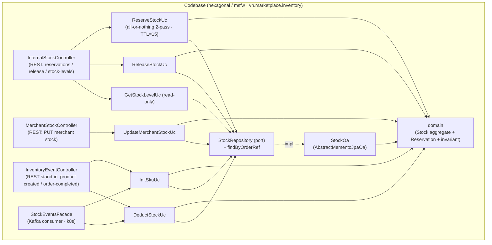
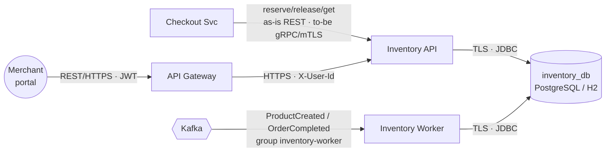
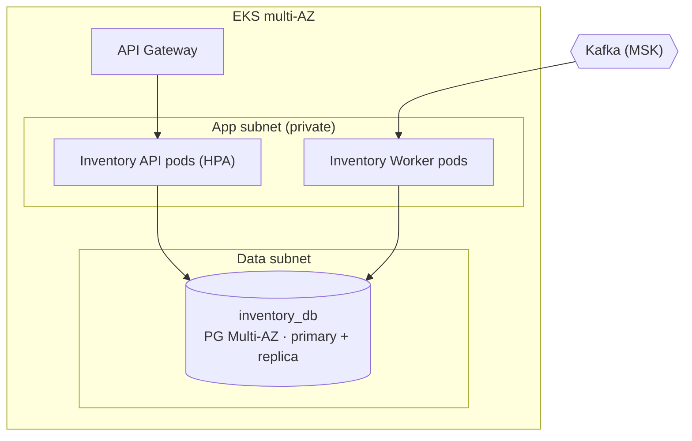
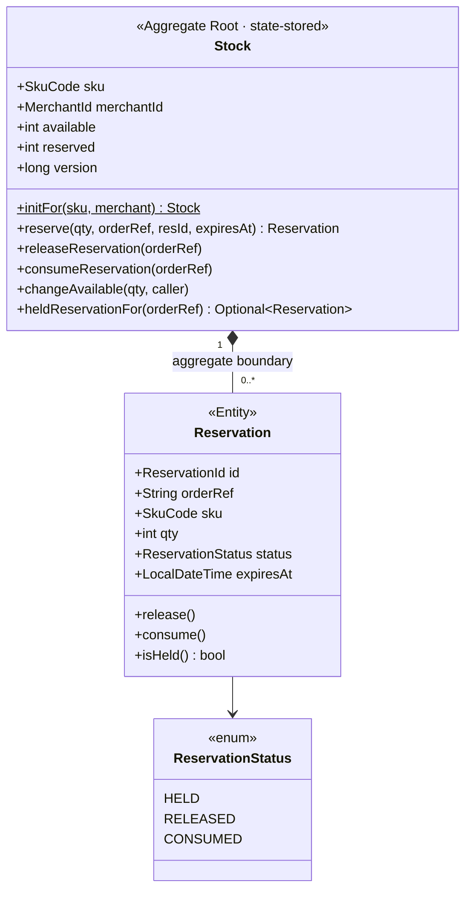
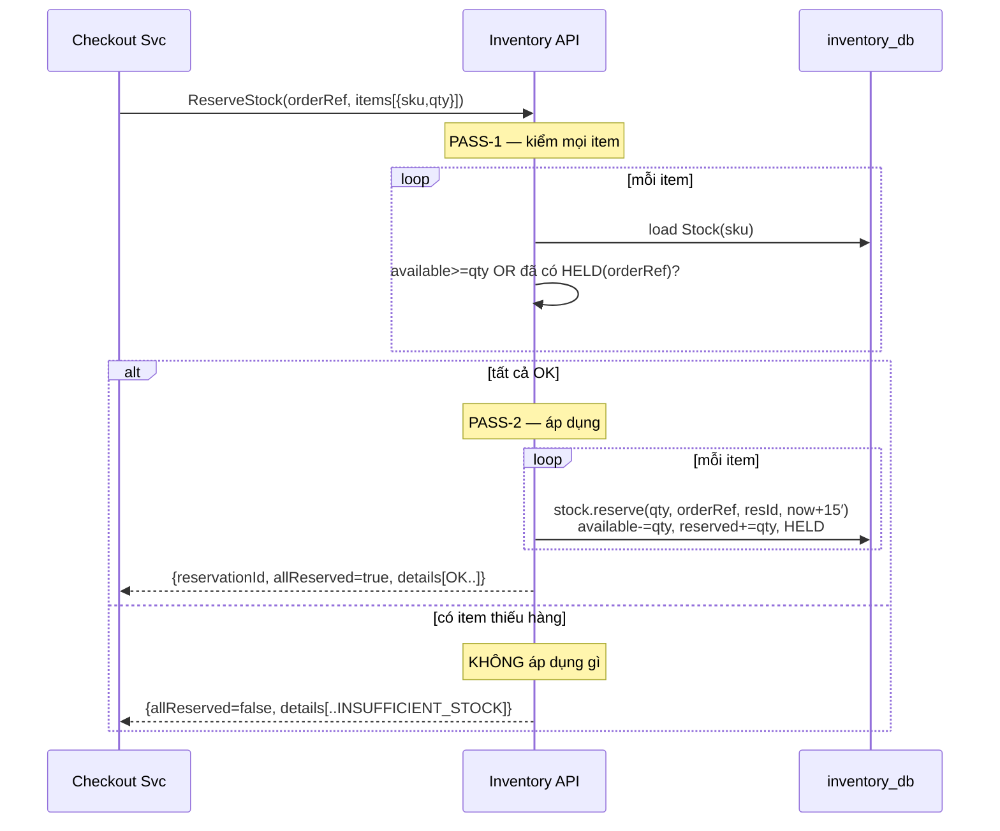
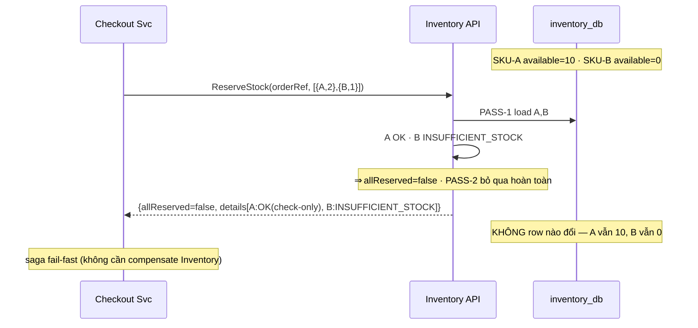
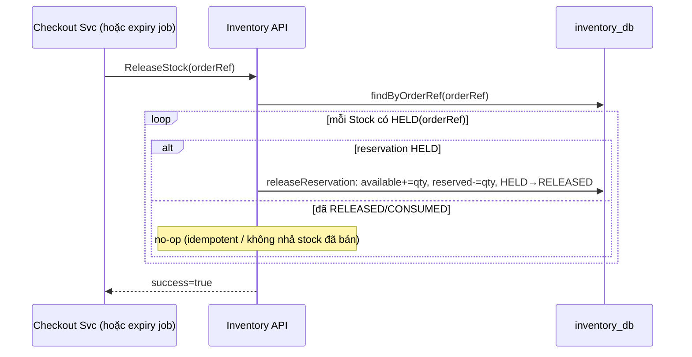
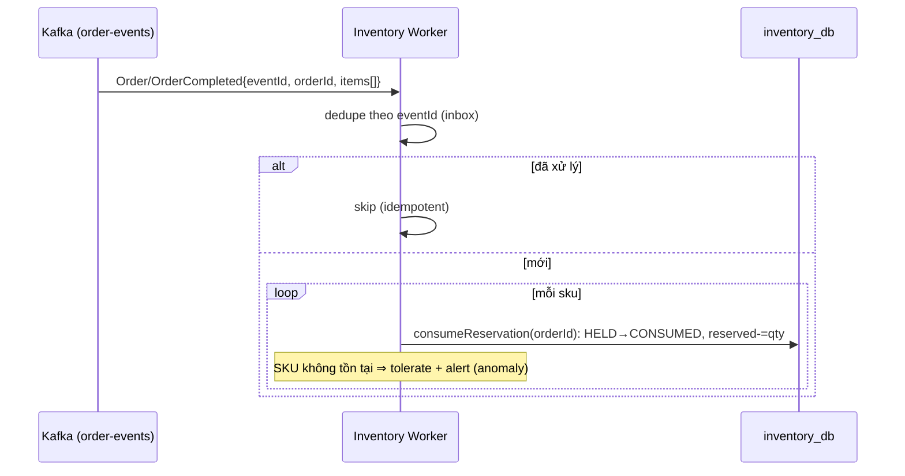
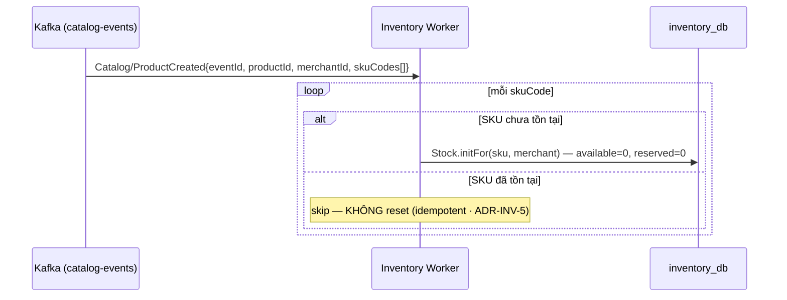
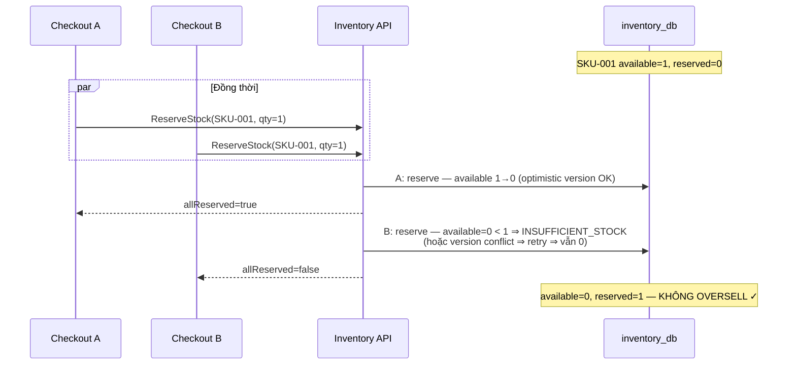

# Detailed Design — Inventory Service (Stock, Reserve & Deduct)

> **Status:** v1.0 — căn theo AD-Marketplace (SDD-MKTPLACE-CORE) ·
> **Owner:** Inventory team ·
> **Reviewers:** _TBD_
>
> **Liên kết (lên AD / ngang hợp đồng):**
> - **AD-Marketplace** — `MKT-BC-inventory` (§3.3 Container archetype, hộp BC L2 + Correspondence physical; Tier 2 = AD §8.1 `MKT-NFR-07`; *reservation TTL 15′ · publish-none* = nội bộ BC), §3.4 Context Map: `MKT-REL-03` (Inventory = Supplier của Checkout, sync ReserveStock), `MKT-REL-06` (Catalog→Inventory `ProductCreated`, Published Language), `MKT-REL-07` (Order→Inventory `OrderCompleted`, deduct), §4.3 FR13 + **ràng buộc liên-BC** (`order.pending-expiry` 30′ ≥ `reserve-ttl` 15′), §5 (bảng hợp đồng + bảo đảm tương tác), §9 (ADR register hệ thống)
> - OpenAPI spec (Merchant stock) + proto (`Inventory.ReserveStock/ReleaseStock/GetStockLevel`, *to-be*) — _nguồn sự thật_
> - DB migrations (Flyway) · IaC / Terraform (NetworkPolicy default-deny, IRSA per-component)
> - [TechSpec-Marketplace-Checkout](TechSpec-Marketplace-Checkout.md) (saga gọi reserve/release)

> **Classification:** **Tier 2 — Business Critical** _(Inventory down ⇒ Checkout không reserve được ⇒ không đặt đơn mới; oversell = thiệt hại nghiệp vụ trực tiếp — giao hàng không có hàng, phải hoàn tiền, mất uy tín)_ ·
> **Data class:** **mức tồn kho + SKU code + merchantId** — dữ liệu kinh doanh nội bộ, **không PII, không tiền** · **System Owner:** Inventory team ⇒ **RTO < 4h · RPO < 1h** (`MKT-NFR-07`).
> _last-validated: 2026-06-21._

> **Ranh giới tầng — Tech Spec này sở hữu gì vs AD giữ gì** (theo luật tầng W5):
> - **AD (SDD) giữ — C4 L2 / Landscape:** hộp *Inventory BC* (`MKT-BC-inventory`); Context Map (Inventory = Supplier reserve cho Checkout `MKT-REL-03`; consume `ProductCreated` `MKT-REL-06` + `OrderCompleted` `MKT-REL-07`; **publish-none**); bề mặt hợp đồng + bảo đảm tương tác (AD §5); **invariant chéo** `reserve-ttl ≤ order.pending-expiry` (AD §4.3); deployment ở grain BC/zone.
> - **Tech Spec này sở hữu — C4 L3 / nội bộ Inventory Service:** module & component (§3.1), C&C (§3.2), deployment chi tiết per-BC (§3.3 → IaC), domain (Stock aggregate + Reservation) & data (§4.2–4.3), key flows nội bộ (§5), quyết định **context-local** `ADR-INV-*` (§7).
> - **Đẩy xuống nữa:** field/mã lỗi đầy đủ → OpenAPI/proto; index/DDL → migration (Flyway); NetworkPolicy/IRSA literal → IaC.
>
> _(Lưu ý: "Tier 2 / không-PII" ở trên là **phân lớp dữ liệu/hệ thống** — khác với **C4 L2/L3**.)_

# 1. Context & Scope

Inventory Service là **thẩm quyền duy nhất về tồn kho vật lý** cho mọi SKU trên Marketplace: **giữ chỗ (reserve)** khi Checkout bắt đầu, **nhả (release)** khi checkout fail / saga compensate / hết TTL, **trừ kho vĩnh viễn (deduct)** khi đơn hoàn tất, và **khởi tạo SKU = 0** khi Catalog phát `ProductCreated`. Có database riêng (`inventory_db`). Mọi context khác (Checkout, Order, Storefront) **phải hỏi Inventory**, không tự giữ con số riêng.

**Bất biến cốt lõi: KHÔNG BAO GIỜ OVERSELL** — yêu cầu nghiệp vụ quan trọng nhất, chi phối toàn bộ thiết kế (all-or-nothing reserve + optimistic locking + fitness function). Cùng với nó: **reserve all-or-nothing** — nếu một SKU trong giỏ thiếu hàng thì **không giữ gì cả** (`allReserved=false`), và `allReserved` là **tín hiệu chịu tải** mà Checkout saga dùng để fail-fast.

**Ranh giới bounded context:**

- **Vào (đồng bộ, S2S — *as-is* REST, *to-be* gRPC/mTLS):** `ReserveStock` / `ReleaseStock` / `GetStockLevel` từ Checkout Svc — reserve/release trong saga checkout. Hiện thực as-is = REST `POST /internal/reservations[/release]` + `POST /internal/stock-levels` (`InternalStockController`); to-be = gRPC + mTLS (proto `Inventory.*`).
- **Vào (REST, JWT qua Gateway):** `PUT /v1/merchant/stock/{sku}` (`MerchantStockController`) — Merchant cập nhật tồn kho **của mình** (tenant scope).
- **Vào (bất đồng bộ — *as-is* Kafka ở k8s, REST stand-in ở standalone):** `Catalog/ProductCreated` (`catalog-events`) → InitSku; `Order/OrderCompleted` (`order-events`) → Deduct. Consumer group `inventory-worker` (`StockEventsFacade`). Trên standalone: REST stand-in `POST /internal/events/product-created` + `/order-completed` (`InventoryEventController`).
- **Ra:** **KHÔNG gọi service nào khác; KHÔNG publish event** (config xác nhận *"inventory publishes no events"*).
- **Không thuộc context:** giá sản phẩm (Catalog), vòng đời đơn (Order), orchestration checkout (Checkout), thanh toán (Payment), giỏ hàng (Cart).

**Trust boundary:** Inventory có **2 ranh giới tin cậy** — không suy tin cậy từ vị trí mạng:
- **(B1) Checkout Svc → Inventory** (S2S, nội bộ): tin cậy service identity (to-be mTLS/SVID), **không** tin cậy data (vẫn validate qty/items).
- **(B2) Internet (Merchant portal) → Inventory qua Gateway** (REST, JWT): **tenant scope enforcement bắt buộc** — Merchant chỉ sửa stock của chính mình. Identity merchant forward qua header đã verify ở Gateway; domain cưỡng chế `TENANT_MISMATCH`.

**Goals:**
- **Chống oversell tuyệt đối** — `available >= qty` là gate duy nhất; reserve all-or-nothing.
- Reserve có **TTL 15′** — tự nhả khi Buyer bỏ giữa chừng (khớp invariant chéo với `order.pending-expiry`).
- Deduct + Init **idempotent** — event trùng (at-least-once) không trừ/khởi tạo hai lần.
- Khởi tạo SKU = 0 khi `ProductCreated` (an toàn: không bán hàng không có); Merchant cập nhật stock thực sau.
- Merchant chỉ cập nhật stock **của mình** (tenant scope, `qty >= 0`).

**Non-goals:** quản lý giá (Catalog); quản lý đơn / saga orchestration (Order/Checkout); thanh toán (Payment); dự báo tồn kho / reorder point (tương lai); multi-warehouse / vị trí kho (tương lai); **publish event tồn kho** (v1.0 — xem §9).

# 2. Requirements (tóm tắt)

**Functional:**

| # | Yêu cầu | Giải thích | verify: |
| --- | --- | --- | --- |
| FR1 | Reserve (all-or-nothing) | Nhận `ReserveStock(orderRef, items[])` từ Checkout; **two-pass**: pass-1 kiểm mọi item (`available >= qty` hoặc đã có HELD reservation cho `orderRef`), pass-2 áp dụng **chỉ khi tất cả OK**. `allReserved=false` ⇒ **không giữ gì**. Idempotent theo `orderRef`. | test |
| FR2 | Release (compensation/TTL) | Nhả mọi HELD reservation cho `orderRef`: `available += qty, reserved -= qty`, status HELD→RELEASED. **No-op** nếu đã RELEASED/CONSUMED. | test |
| FR3 | Deduct (OrderCompleted) | Consume `Order/OrderCompleted`: HELD→CONSUMED, `reserved -= qty` (available không đổi). Idempotent theo `eventId` (inbox msfw). | test |
| FR4 | Init SKU (ProductCreated) | Consume `Catalog/ProductCreated`: tạo `Stock(sku, available=0, reserved=0)` qua `Stock.initFor`. **Skip nếu SKU đã tồn tại** (idempotent, không reset). | test |
| FR5 | Merchant cập nhật stock | REST `PUT /v1/merchant/stock/{sku}` — set `available` cho SKU **của mình**. Domain cưỡng chế `TENANT_MISMATCH` + `NEGATIVE_STOCK`. | test |
| FR6 | Get Stock Level | `GetStockLevel(skus[])` — trả `available`/`reserved` cho Checkout/Storefront. Read-only, không lock. | test |
| FR7 | Reservation expiry | Reservation mang `expiresAt = now + 15′`; reservation quá hạn phải được nhả (job định kỳ — interval = TBD, §6). | check |

**Non-functional / SLO (Tier 2):**

| Thuộc tính | Mục tiêu | verify: |
| --- | --- | --- |
| **Oversell rate** | **0% — zero tolerance** (bất biến nghiệp vụ #1) | **test** (fitness concurrency §8) |
| **Reserve atomicity** | all-or-nothing: `allReserved=false` ⇒ 0 reservation tạo ra | **test** |
| **Deduct idempotency** | `OrderCompleted` trùng ⇒ không trừ kho lần 2 | **test** |
| **Cross-BC TTL invariant** | `reserve-ttl` (15′) **≤** `order.pending-expiry` (30′) | **check** (config-sync) |
| Tenant isolation | Merchant A không sửa stock Merchant B | **test** |
| Balance invariant | `available + reserved` khớp tổng vật lý | **audit** (kiểm định kỳ) |
| API availability | ≥ 99.9% _(Tier 2)_ | monitor |
| RTO / RPO | RTO < 4h · RPO < 1h _(`MKT-NFR-07`)_ | audit |
| Degraded mode | Kafka lag ⇒ deduct/init chậm nhưng **reserve vẫn hoạt động** (checkout không bị block) | test |

> **Luật `verify:` (§8.1 chuẩn):** mọi mệnh đề chạm **toàn-vẹn-dữ-liệu / xuyên-tenant** (oversell, idempotency, tenant scope) đều `test`/`check`, **không** chỉ `review` — vi phạm gây thiệt hại nghiệp vụ trực tiếp.

# 3. Design overview

## 3.1 Module view (cấu trúc tĩnh)

> **Khung:** *frames* concern "code chia ra sao, ai gọi ai" (developer). **Legend:** hộp = module/package (hexagonal msfw); mũi tên = phụ thuộc/gọi.

| Module | Trách nhiệm | Không được làm |
| --- | --- | --- |
| `InternalStockController` | Kết thúc REST reserve/release/stock-levels (S2S stand-in; to-be gRPC/mTLS); validate request; điều phối use-case | Business logic; persist trực tiếp |
| `MerchantStockController` | Kết thúc `PUT /v1/merchant/stock/{sku}`; forward `merchantId` đã verify (header) | Tự quyết tenant; persist trực tiếp |
| `InventoryEventController` | **REST stand-in** cho 2 sự kiện ở standalone profile (`product-created`, `order-completed`) | Tồn tại ở k8s (đó là Kafka) |
| `StockEventsFacade` | Consumer Kafka (k8s) `Catalog/ProductCreated` + `Order/OrderCompleted`; bắt `eventId` cho idempotency; dispatch InitSku/Deduct | Business logic; bỏ dedupe |
| `ReserveStockUc` | **All-or-nothing 2-pass**: pass-1 kiểm mọi item, pass-2 áp dụng nếu tất cả OK; sinh `reservationId`; TTL `now+15′`; idempotent theo `orderRef`. **Module quan trọng nhất** — sai = oversell | Release/deduct; gọi service khác |
| `ReleaseStockUc` | Nhả mọi HELD reservation cho `orderRef` (qua `findByOrderRef`); idempotent | Reserve/deduct |
| `DeductStockUc` | HELD→CONSUMED theo `orderId`; tolerate SKU không tồn tại (anomaly → alert); idempotent theo `eventId` | Reserve/release |
| `InitSkuUc` | `Stock.initFor(sku, merchant)` qty 0; **skip nếu đã có** (không reset) | Reserve/release; reset stock |
| `UpdateMerchantStockUc` | `stock.changeAvailable(qty, caller)` — domain cưỡng chế tenant + `qty>=0` | Reserve/release/deduct |
| `GetStockLevelUc` | Đọc `available`/`reserved` qua Criteria DSL; read-only | Sửa stock |
| `domain` (Stock + Reservation) | Aggregate root + child entity; cưỡng chế **mọi invariant** (§4.2): không oversell, status machine, balance, tenant, idempotency theo orderRef | I/O; biết DB/Kafka/REST |
| `StockRepository` / `StockOa` | Port + adapter memento JPA (`AbstractMementoJpaOa`); thêm `findByOrderRef`; UNIQUE `sku`, optimistic lock | Business logic |

> **BN-1 · All-or-nothing reserve (`ReserveStockUc`):** Reserve chạy **2 lượt** — *pass-1* tải toàn bộ SKU và kiểm `available >= qty` (hoặc đã có HELD reservation cho `orderRef`). **Chỉ khi tất cả item OK** mới sang *pass-2* áp dụng (`available -= qty, reserved += qty` + tạo Reservation HELD). Một item thiếu hàng ⇒ `allReserved=false` ⇒ **không giữ gì cả**. `allReserved` là tín hiệu saga (Checkout fail-fast). Chống oversell ở mức runtime dựa optimistic lock (`@Version` JPA) — concurrent reserve không silent overwrite.

> **BN-2 · Reservation lifecycle (domain):** `HELD → RELEASED` (checkout fail / TTL) **hoặc** `HELD → CONSUMED` (OrderCompleted). Terminal **bất biến**. `release()` trên CONSUMED = **no-op** (không nhả stock đã bán); `release()`/`consume()` trên đã-terminal = **no-op** (idempotent).

> **BN-3 · Publish-none (sink of truth):** Inventory **không phát event** nào. Mọi use-case ghi-state mang `@EventPublishHandler` (proxy outbox của msfw bật → thỏa fitness Event-Publish), nhưng **không aggregate nào raise domain event** — annotation **idle**. Inventory là *sink* của `ProductCreated`/`OrderCompleted`, không *source*.

## 3.2 C&C view (runtime)

> **Khung:** *frames* concern "ai nói chuyện với ai lúc chạy, giao thức & auth". **Legend:** hộp bo = service runtime; hộp trụ = datastore; hộp nhọn `{{}}` = message broker; `(())` = actor external/boundary.

**Connector catalog (zero-trust):**

| Connector | From → To | Protocol (as-is → to-be) | Authn/Authz |
| --- | --- | --- | --- |
| reserve/release/get | Checkout → Inventory API | REST → **gRPC** | to-be mTLS (SVID); scope `inventory:reserve/release/read` |
| merchant-stock | Gateway → Inventory API | HTTPS | JWT (RS256) forward; scope `inventory:write:stock`; **tenant scope `merchantId`** |
| event-in | Kafka → Inventory Worker | Kafka | SASL/mTLS broker + ACL topic; group `inventory-worker`; consumer **idempotent** |
| event-in (standalone) | REST `/internal/events/*` → API | HTTP | stand-in profile (không có Kafka) |
| db | Inventory API/Worker → inventory_db | TLS/JDBC | IAM least-priv per component |

> **Publish-none:** **không** có connector ra Kafka/ngoài. Inventory chỉ consume; mọi mũi tên Kafka là *inbound*. Khác Payment (egress cổng TT/ngân hàng) — Inventory **không egress Internet**.

## 3.3 Deployment view (per-BC → IaC)

> **Khung:** *frames* concern "chạy ở đâu, cô lập thế nào". **Legend:** hộp bo = pod/instance; trụ = managed datastore; `{{}}` = managed broker; subgraph = zone/subnet (boundary).

**Thực thi zero-trust ở tầng deploy (→ IaC):**
- **Không egress Internet** — Inventory không gọi external provider (khác Payment). NetworkPolicy default-deny; chỉ mở GW→API, API/Worker→inventory_db, Kafka→Worker (VPC endpoint).
- **IRSA per-component (least-priv):** API = đọc/ghi `stock`+`reservations`; Worker = đọc/ghi `stock`+`reservations` (+ inbox dedupe). Worker **không** expose REST/gRPC; API **không** consume Kafka.
- `inventory_db` Multi-AZ + automated failover (Tier 2, **RPO < 1h**); PITR.
- Deploy **canary** (logic reserve là đường nóng); secret DB ở Secrets Manager, rotate, inject runtime.

# 4. Interfaces & data

> Hợp đồng đầy đủ ở OpenAPI (Merchant stock) + proto (`Inventory.*`, to-be). Dưới đây chỉ ngữ nghĩa quan trọng.

## 4.1 Interfaces

| # | Loại | Interface | Auth | Ngữ nghĩa |
| --- | --- | --- | --- | --- |
| 1 | S2S (in) | `ReserveStock(orderRef, items[])` — as-is REST `POST /internal/reservations` | to-be mTLS | **All-or-nothing**; trả `{reservationId, allReserved, details[]}`; idempotent theo `orderRef` |
| 2 | S2S (in) | `ReleaseStock(reservationId)` — as-is REST `POST /internal/reservations/release` | to-be mTLS | Nhả HELD theo `orderRef`; idempotent (no-op nếu terminal) |
| 3 | S2S (in) | `GetStockLevel(skus[])` — as-is REST `POST /internal/stock-levels` | to-be mTLS | Đọc `available`/`reserved`; read-only |
| 4 | REST (in) | `PUT /v1/merchant/stock/{sku}` body `{available}` | JWT + `X-User-Id` | Set `available` cho SKU của mình; tenant + `qty>=0` |
| 5 | event (in) | `Catalog.ProductCreated` (`catalog-events`) | Kafka | InitSku qty 0; idempotent theo SKU + `eventId` |
| 6 | event (in) | `Order.OrderCompleted` (`order-events`) | Kafka | Deduct HELD→CONSUMED; idempotent theo `eventId` |
| — | event (out) | **NONE** | — | Inventory publish-none (BN-3) |

**Bảo đảm tương tác** (đồng bộ AD §5):
- **ReserveStock** = sync command, strong-in-context; **`allReserved` là load-bearing**: `false` ⇒ Checkout saga coi như fail và **không** có reservation nào tồn tại để compensate; idempotency theo `orderRef` bắt buộc.
- **ReleaseStock** = sync command, idempotent — gọi lại an toàn (no-op trên terminal); dùng cho cả compensation lẫn (về mặt nghiệp vụ) OrderCancelled.
- **ProductCreated / OrderCompleted** = at-least-once; **consumer phải dedupe** theo `eventId` (`MKT-ADR-0005`). Deduct/Init idempotent kể cả khi giao trùng. Đây là yêu cầu cứng — không trừ/khởi tạo hai lần.

**Mã lỗi** (chi tiết → OpenAPI/proto). Domain ném `InventoryDomainException(InventoryErrorCode)`; msfw `GlobalExceptionHandler` map qua `DomainErrorCode` base:

| Error code | Base | HTTP | Khi nào |
| --- | --- | --- | --- |
| `INVALID_QUANTITY` | INVALID_ARGUMENT | **400** | reserve `qty <= 0` |
| `NEGATIVE_STOCK` | INVALID_ARGUMENT | **400** | merchant set `available < 0` |
| `INSUFFICIENT_STOCK` | BUSINESS_RULE_VIOLATION | **422** | `available < qty` (per-SKU trong details; reserve trả `allReserved=false`) |
| `TENANT_MISMATCH` | BUSINESS_RULE_VIOLATION | **422/403** | Merchant sửa stock không thuộc mình |
| `STOCK_NOT_FOUND` | NOT_FOUND | **404** | SKU chưa init |
| `RESERVATION_NOT_FOUND` | NOT_FOUND | **404** | reservation không tồn tại |

> _Lưu ý:_ Theo grounded fact, `INSUFFICIENT_STOCK`/`TENANT_MISMATCH` thuộc nhóm `BUSINESS_RULE_VIOLATION` (mặc định 422); riêng vi phạm tenant ở bề mặt Merchant thường hiển thị **403** sau lớp gateway/authz — giữ cả hai để khớp ngữ nghĩa "cấm" (TBD: chốt 422 vs 403 ở OpenAPI).

## 4.2 Domain model

> Inventory có **1 aggregate**: `Stock` (chứa `Reservation`). Aggregate nhỏ nhưng **invariant cực kỳ quan trọng** — oversell = thiệt hại nghiệp vụ trực tiếp. Identities đều là `StringIdentity` (msfw); **không có Money** trong BC này.

**Invariant** (cưỡng chế trong `Stock`/`Reservation`):

| # | Invariant | Cơ chế | verify: |
| --- | --- | --- | --- |
| 1 | **KHÔNG OVERSELL** — `available` không bao giờ < 0 | `reserve()` ném `INSUFFICIENT_STOCK` nếu `available < qty`; all-or-nothing 2-pass; optimistic lock | **test** (concurrency §8) |
| 2 | **Balance preserved** — `available + reserved` bảo toàn qua thao tác | reserve (−/+), release (+/−), consume (−reserved, available không đổi) | **test** + **audit** |
| 3 | **Reservation tiến một chiều** — `HELD → (RELEASED\|CONSUMED)`; terminal bất biến | `release()`/`consume()` no-op nếu không HELD | **test** |
| 4 | **Release trên CONSUMED = no-op** — không nhả stock đã bán | `Reservation.release()` chỉ tác động khi HELD | **test** |
| 5 | **Reserve idempotent theo `orderRef`** — replay trả reservation cũ, không giữ thêm | `heldReservationFor(orderRef)` trong pass-1 | **test** |
| 6 | **Deduct idempotent theo `eventId`** — OrderCompleted trùng không trừ 2 lần | inbox msfw (eventId bắt ở `StockEventsFacade`) | **test** |
| 7 | **Tenant immutable** — `merchantId` set ở init, không đổi; sửa bởi merchant khác ⇒ `TENANT_MISMATCH` | `changeAvailable(qty, caller)` so `caller == merchantId` | **test** |
| 8 | **`qty >= 0` (merchant), `qty > 0` (reserve)** | `NEGATIVE_STOCK` / `INVALID_QUANTITY` | **test** |

## 4.3 Data model

| Store | Bảng / đối tượng | Ghi chú |
| --- | --- | --- |
| `inventory_db` (PG; H2 ở standalone) | `stock` (memento), `reservations` (child) | **state-stored**; UNIQUE `sku` (`idx_stock_sku`); index `merchant_id`; optimistic version |
| `stock` | `sku` (UK), `merchant_id`, `available`, `reserved`, `stock_version` (domain version), JPA `@Version` (optimistic lock), `created_at/updated_at` | `stock_version` đổi tên để tránh đụng `getVersion()` JPA base |
| `reservations` | `reservation_id`, `order_ref` (idx), `sku`, `qty`, `status` (VARCHAR16 enum), `expires_at`, FK `stock_fk` | `@OneToMany orphanRemoval=true` — bỏ khỏi list ⇒ xóa row; `@OrderColumn` |

> **Optimistic version note:** có **hai** version — (a) JPA `@Version` trên entity base (chống lost-update concurrent); (b) domain `version` (`stock_version`, tăng mỗi lần đổi state, cho audit/đối soát). Đây là tuyến phòng thủ runtime cho invariant #1 cùng with all-or-nothing logic.
>
> **Persistence:** `StockOa extends AbstractMementoJpaOa<Stock, Stock.Memento, StockEntity>` (memento pattern msfw) + 1 query tay `findByOrderRef` (join `reservations`). **Không có bảng `processed_events` riêng** — dedupe consumer dựa **inbox của msfw** (eventId), không tự cài bảng. Schema/DDL chi tiết → migration (Flyway).

## 4.4 Config & tunables

| Tham số | Khởi điểm | Ghi chú |
| --- | --- | --- |
| `RESERVE_TTL_MINUTES` | **15** | **Hardcoded** trong `ReserveStockUc` (`expiresAt = now + 15′`). **Bất biến chéo:** phải **≤** `order.pending-expiry` (30′) — xem dưới |
| Kafka consumer group | `inventory-worker` | `application.yml` |
| Topic routing | `Catalog/ProductCreated → catalog-events`; `Order/OrderCompleted → order-events` | format JSON; subscription suy từ routing |
| Datasource | k8s: `inventory_db` (PG) · standalone: H2 `:mem:` | DDL k8s=update, standalone=create |
| Expiry-job interval | **TBD** | TTL nằm trên reservation (`expires_at`); job nhả định kỳ — interval/cơ chế chưa cố định trong code (§6) |

> **Cảnh báo cấu hình chéo-BC (`MKT-` invariant, AD §4.3/§5):** `RESERVE_TTL_MINUTES` (15′) **phải ≤** `order.pending-expiry` (30′).
> - Nếu **TTL Inventory > pending-expiry**: đơn đã auto-cancel nhưng stock vẫn bị giữ ⇒ **stock ảo** (undersell).
> - Nếu khoảng cách hợp lý (15 ≤ 30): reservation nhả trước/đúng lúc đơn hết hạn ⇒ an toàn.
> Quản lý bằng config-sync check (fitness §8). _Hiện TTL hardcoded — nâng lên config + check là cải tiến đề xuất (§9)._

## 4.5 Personal data handling

> Inventory **không chứa PII, không chứa tiền** — chỉ SKU code, số lượng, `merchant_id`, `order_ref`, `eventId`.

| Data element | Class | Nguồn | Lưu | Retention |
| --- | --- | --- | --- | --- |
| `sku`, `merchant_id`, stock quantities | nội bộ KD | Catalog (ProductCreated) / reserve / merchant | `inventory_db` | vĩnh viễn (active SKU) — chi tiết TBD |
| `order_ref` | nội bộ KD | Checkout (reserve) | `reservations` | theo reservation — retention TBD |
| `eventId` | nội bộ KD | Kafka (consume) | inbox msfw | dedupe window — TBD |

Mã hóa at-rest (RDS encryption). **DSAR không applicable** (không có dữ liệu cá nhân Buyer; `merchant_id` chỉ là định danh tenant). Rủi ro chính **không phải privacy mà là TÍNH ĐÚNG ĐẮN** — oversell = thiệt hại nghiệp vụ, không phải data breach.

# 5. Key flows

## 5.1 Reserve — all-or-nothing happy path

## 5.2 Reserve — partial-fail ⇒ allReserved=false ⇒ nothing reserved

## 5.3 Release on TTL / compensation

## 5.4 Deduct on OrderCompleted

## 5.5 Init SKU on ProductCreated

## 5.6 Concurrent reserve — chống oversell

# 6. Operations & Resilience (delta)

> DR cấp platform xem AD §9/`MKT-NFR-07` — dưới đây là delta của Inventory.

- **inventory_db (Tier 2):** Multi-AZ + automated failover; PITR, **RPO < 1h**; source-of-truth tồn kho — mất DB = mất stock.
- **Reservation expiry:** TTL nằm trên `reservations.expires_at` (`now + 15′`). Cần **job nhả định kỳ** (`status=HELD AND expires_at < now` → release). **Interval job = inferred/TBD** (không cố định trong code hiện tại); chạy single-replica hoặc leader-election để tránh nhả trùng — idempotent release (BN-2) bảo vệ nếu chạy nhiều.
- **DLQ cho consumer:** `ProductCreated`/`OrderCompleted` at-least-once; lỗi xử lý → DLQ + alert; replay an toàn vì consumer idempotent (eventId).
- **Degraded mode:** Kafka lag/down ⇒ init/deduct chậm (stock tạm lệch: reserved cao hơn thực) nhưng **reserve vẫn chạy** (Checkout không block). DB down ⇒ reserve/release/deduct unavailable (single source of truth có chủ ý). Expiry job down ⇒ stock bị giữ lâu (undersell tạm, **không** oversell).
- **Alert:** P0 `oversell_attempt > 0`; P1 balance mismatch / deduct anomaly (reservation missing); P2 consumer lag / expiry miss.

# 7. Decisions context-local (ADR-INV-*) & cross-cutting

> Quyết định nội bộ Inventory (`ADR-INV-*`) — **khác** ADR register hệ thống ở AD §9; cụ thể hóa/đáp các ADR hệ thống liên quan.

**ADR-INV-1 — Reserve all-or-nothing (two-pass).** Giỏ nhiều SKU: nếu reserve từng phần rồi một item fail, phải compensate phần đã giữ ⇒ phức tạp + race. Two-pass (kiểm hết → áp dụng hết) cho **`allReserved` rạch ròi**: caller chỉ cần một cờ, fail ⇒ **không có gì để compensate**. _Hệ quả:_ `allReserved` thành load-bearing saga signal; pass-1 đọc, pass-2 ghi.

**ADR-INV-2 — Optimistic locking chống oversell (không pessimistic).** `SELECT FOR UPDATE` giữ lock lâu, giảm throughput; mỗi SKU hiếm khi contend nặng. Optimistic (`@Version`) + all-or-nothing đủ. _Hệ quả:_ cần retry khi version conflict; tuyến cuối là invariant domain `available >= qty`.

**ADR-INV-3 — Publish-none / sink-of-truth.** Inventory là **thẩm quyền tồn kho** nhưng **không phát event** (v1.0). `@EventPublishHandler` giữ để thỏa fitness outbox dù idle. _Hệ quả:_ context khác **phải hỏi** Inventory (GetStockLevel), không nghe event; nếu sau cần realtime stock cho storefront ⇒ mở `StockUpdated` (§9).

**ADR-INV-4 — Consumer idempotent (đáp `MKT-ADR-0005`).** Bus at-least-once ⇒ `ProductCreated`/`OrderCompleted` có thể giao trùng. Dedupe theo `eventId` (inbox msfw) + idempotent theo SKU (init) / theo orderRef (deduct). _Hệ quả:_ không trừ/khởi tạo hai lần; không tự cài bảng `processed_events` — dùng inbox framework.

**ADR-INV-5 — InitSku skip-if-exists (không reset).** `ProductCreated` replay không được reset stock đã có (sẽ xóa số liệu merchant cập nhật). Init = 0 chỉ khi SKU mới. _Hệ quả:_ Merchant chủ động set stock thực sau init.

**ADR-INV-6 — TTL trên reservation, ràng buộc ≤ order.pending-expiry.** Checkout có thể crash ⇒ không chỉ dựa release callback; TTL + expiry job đảm bảo nhả. _Hệ quả:_ TTL (15′) phải ≤ pending-expiry (30′) — invariant chéo (`MKT-REL-07`/AD §4.3); fitness config-sync.

**ADR refs hệ thống:** `MKT-ADR-0002` (database-per-context — `inventory_db` riêng, tham chiếu chéo chỉ reference logic `sku`/`merchantId`/`orderRef`, **không FK xuyên context**); `MKT-ADR-0005` (idempotency mọi consumer — ADR-INV-4); `MKT-ADR-0011` (Kafka partition theo `merchantId` — ordering per-tenant cho consume).

**Threat seed (STRIDE):** *Spoofing* — merchant giả danh sửa stock người khác → tenant scope (`TENANT_MISMATCH`) + JWT; service giả danh Checkout → to-be mTLS/SVID. *Tampering* — sửa available trực tiếp / race → all-or-nothing + optimistic lock + domain invariant. *Info disclosure* — xem stock SKU merchant khác → GetStockLevel chỉ cho service nội bộ. *DoS* — flood reserve/merchant update → rate limit + service-identity limit. *Elevation* — merchant trigger reserve/release → scope tách (merchant chỉ `inventory:write:stock`).

# 8. Test strategy

> Chống oversell là **yêu cầu test quan trọng nhất** — cần concurrency nặng.

- **Unit (domain):** reservation state machine (`HELD→RELEASED|CONSUMED`; release trên CONSUMED = no-op; terminal bất biến); `reserve` ném `INSUFFICIENT_STOCK`/`INVALID_QUANTITY`; `changeAvailable` ném `TENANT_MISMATCH`/`NEGATIVE_STOCK`; balance bảo toàn.
- **Contract:** proto `ReserveStock/ReleaseStock/GetStockLevel` với Checkout (consumer-driven); event schema `Catalog/ProductCreated`, `Order/OrderCompleted`.
- **Integration (reserve — CRITICAL):** reserve thành công; thiếu hàng ⇒ `allReserved=false`; **all-or-nothing**: giỏ [A ok, B fail] ⇒ A **không** bị giữ (verify 0 reservation); idempotent (cùng `orderRef` ⇒ trả cũ, không giữ thêm).
- **Integration (release/deduct/init):** release HELD ⇒ restored; release CONSUMED/RELEASED ⇒ no-op; deduct ⇒ CONSUMED, reserved giảm; **duplicate eventId ⇒ no-op**; init skip nếu SKU tồn tại.
- **Integration (merchant):** update của mình ⇒ 200; của merchant khác ⇒ TENANT_MISMATCH; `available < 0` ⇒ NEGATIVE_STOCK.
- **Failure-injection:** DB down ⇒ reserve fail; Kafka lag ⇒ deduct chậm nhưng reserve chạy; expiry job down ⇒ undersell tạm, không oversell.

**Fitness functions (bắt buộc):**
- **No oversell under concurrency:** N concurrent reserve trên SKU `available=K` (N>K) ⇒ đúng K thành công, phần còn lại INSUFFICIENT_STOCK, `available=0`, `SUM(reserved)=K`. Vi phạm ⇒ **P0, block release**.
- **All-or-nothing atomicity:** giỏ có ≥1 SKU thiếu hàng ⇒ **0** reservation tạo ra (quét DB sau call).
- **Idempotent deduct:** 2× `OrderCompleted` cùng `eventId` ⇒ trừ kho đúng 1 lần.
- **TTL ≤ order pending-expiry:** config-sync check `RESERVE_TTL_MINUTES (15) ≤ order.pending-expiry (30)`.
- **Publish-none:** quét — Inventory không có producer/topic out (giữ ADR-INV-3).

**Acceptance mẫu:**
- _Oversell:_ available=5, 10 concurrent reserve(qty=1) ⇒ 5 OK + 5 INSUFFICIENT_STOCK; available=0, reserved=5.
- _All-or-nothing:_ giỏ [A:2 (đủ), B:1 (hết)] ⇒ allReserved=false; A vẫn nguyên, không reservation nào.
- _Idempotent:_ 2× OrderCompleted cùng eventId ⇒ reserved giảm 1 lần.

# 9. Open questions

1. **Publish `StockUpdated`?** v1.0 publish-none (ADR-INV-3). Storefront "sắp hết hàng" realtime / analytics cần event ⇒ thêm producer + outbox. Tương lai.
2. **`RESERVE_TTL_MINUTES` hardcoded → config + check.** Hiện 15′ hardcoded trong `ReserveStockUc`; nên đưa ra config và thêm fitness config-sync để cưỡng chế invariant chéo `≤ order.pending-expiry`.
3. **Expiry-job interval/cơ chế (TBD).** TTL trên reservation đã có; job nhả định kỳ chưa cố định trong code — chốt interval, single-replica vs leader-election, batch size.
4. **`TENANT_MISMATCH` → 422 hay 403?** Domain xếp `BUSINESS_RULE_VIOLATION` (422); bề mặt Merchant "cấm" gợi 403. Chốt ở OpenAPI.
5. **OrderCancelled → release.** AD §5 liệt `Order.OrderCancelled` → Inventory (release). Hiện code consume `OrderCompleted` (deduct); release đi qua S2S ReleaseStock. Cần chốt có consume `OrderCancelled` trực tiếp không.
6. **Retention `stock`/`reservations`/inbox.** Chính sách giữ/purge chưa cố định (TBD §4.5).
7. **Multi-warehouse / partial reserve.** v1.0 single pool per SKU, reserve nguyên-giỏ. Mở rộng location/partial fulfillment ảnh hưởng lớn thiết kế.
