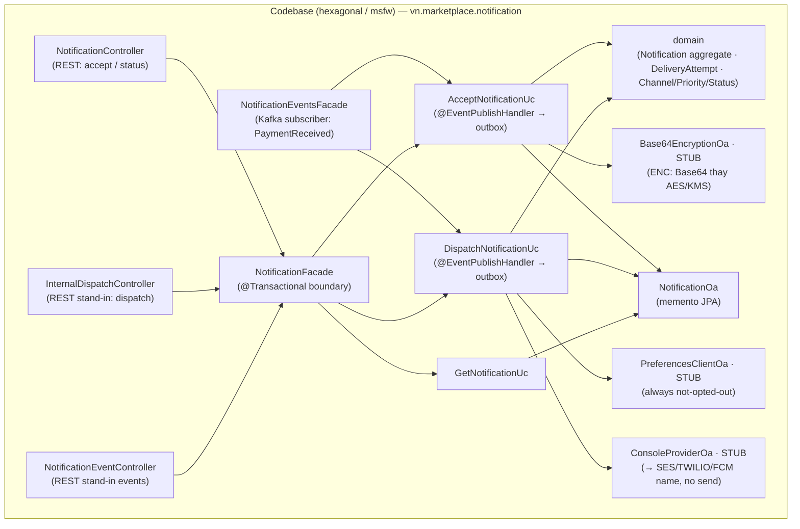
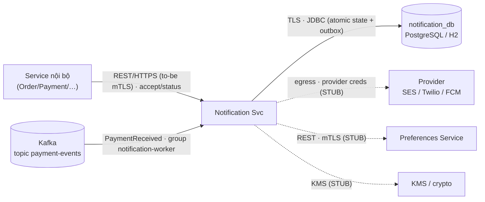
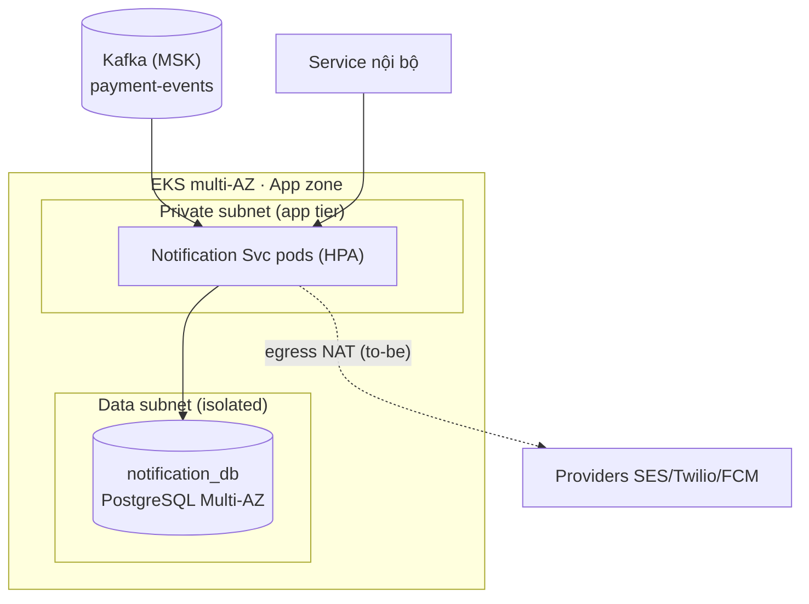
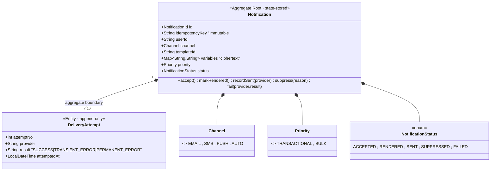
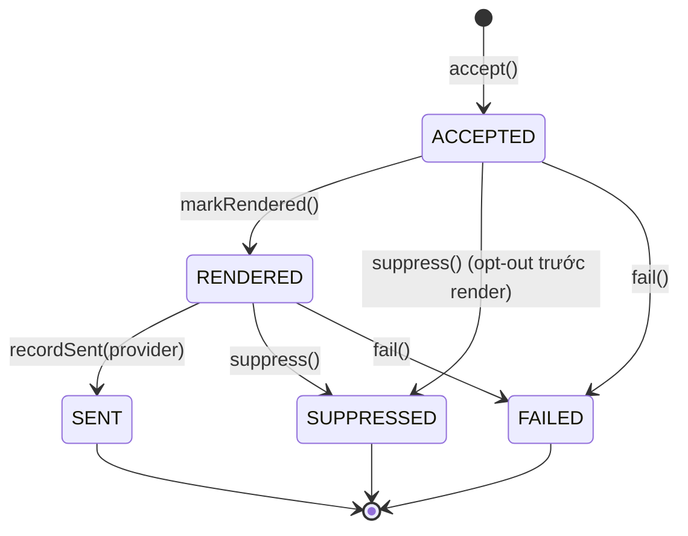
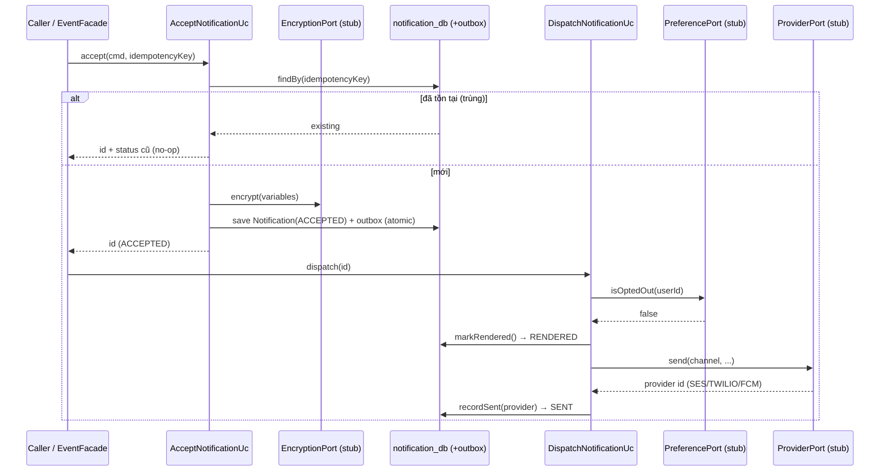
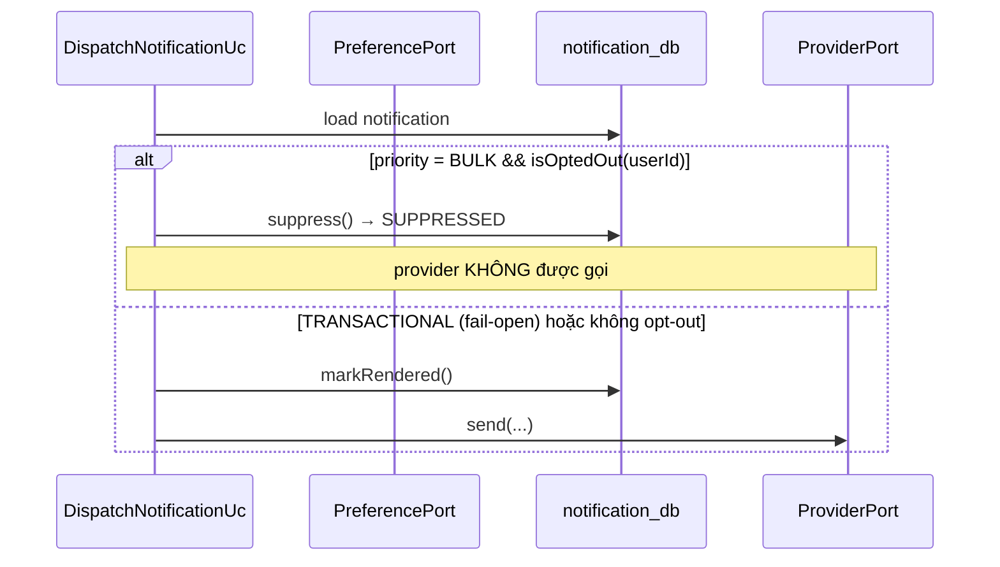
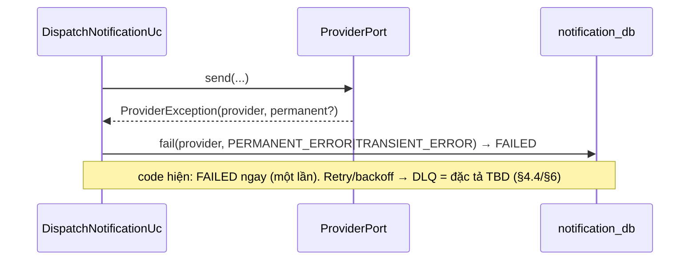
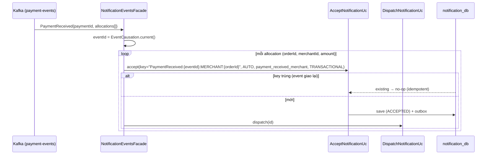

# Detailed Design — Notification Service (consume-only sink)

> **Status:** v1.0 — căn theo `AD-Marketplace` (`MKT-AD-CORE` v1.0.0) ·
> **Owner:** Notification team ·
> **Reviewers:** _TBD_
>
> **Liên kết (lên AD / ngang hợp đồng):**
> - **AD-Marketplace** — `MKT-BC-notification` (§3.3 Container archetype, hộp BC ở C4 L2), §3.4 Context Map (`MKT-REL-08` — consume `PaymentReceived`), §5.2 sự kiện (`Payment.PaymentReceived` → Notification), §5.3 bảng bảo đảm tương tác (mọi domain event = at-least-once + consumer dedupe theo `eventId`), §9 ADR register hệ thống.
> - `/contracts/payment-received.json` (envelope `PaymentReceived`) — **nguồn sự thật** hợp đồng event.
> - OpenAPI spec (REST ingest/status) · DB migrations (Flyway, `notification_db`) · IaC / Terraform (provider creds, KMS, egress NAT) — _to-be, chưa hiện thực_.

> **Classification:** **Tier 3** _(`MKT-NFR-08`: RTO < 24h · RPO < 4h)_ · best-effort dispatch, không giữ tiền/không quyết nghiệp vụ ·
> **Data class:** **PII** — số liên hệ người nhận (email/phone) + biến template nhạy cảm (OTP…) là dữ liệu cá nhân; lưu **mã hóa at-rest** (`variables_encrypted`). **System Owner:** Notification team.
> **last-validated:** 2026-06-21 (đối chiếu nội dung ↔ source `notification/` + AD v1.0.0).

> **⚠️ Đây là một SINK MỎNG (thin, consume-only).** Notification **chỉ** nhận (REST/Kafka) → bền hóa qua outbox → đẩy qua một provider (đang **stub**). Nó **không publish domain event nào**, **không** ra quyết định nghiệp vụ (khi nào gửi do caller/event quyết). Vì vậy nhiều mục dưới đây **cố tình ngắn** — không phải thiếu sót mà phản ánh đúng bề rộng hẹp của context. Phần lớn adapter ngoài (provider, encryption, preferences) hiện là **stand-in/stub** trên standalone; cấu hình retry/backoff/TTL là **suy diễn (TBD)**, *không* có trong code.

> **Ranh giới tầng — Tech Spec này sở hữu gì vs AD giữ gì** (theo W5 / STD-DESIGN-DOC-v1.3):
> - **AD giữ — C4 L2 / Landscape:** hộp *Notification BC* (`MKT-BC-notification`), datastore `notification_db`; Context Map (`MKT-REL-08`: Notification = downstream/consumer của Payment, Published Language); bề mặt + bảo đảm tương tác consume event (AD §5.3); deployment grain BC/zone (App zone).
> - **Tech Spec này sở hữu — C4 L3 / nội bộ Notification Service:** module & component (§3.1/§3.2), deployment chi tiết per-BC (§3.3), domain (`Notification` aggregate + máy trạng thái) & data (§4.2–4.3), key flows nội bộ (§5), quyết định **context-local** `ADR-NOT-*` (§7).
> - **Đẩy xuống nữa:** field/mã lỗi đầy đủ → OpenAPI + `/contracts`; provider creds / KMS key policy / egress allowlist → IaC/Vault.
>
> _(Lưu ý: "Tier 3 / PII" là **phân lớp dữ liệu/hệ thống** — khác với **C4 L2/L3**.)_

# 1. Context & Scope

Notification Service là một **sink chỉ-tiêu-thụ (consume-only)**: nó nhận yêu cầu thông báo (qua REST từ service nội bộ, hoặc qua Kafka event), bền hóa **atomically** (state + transactional outbox của msfw), rồi đẩy qua một provider gửi (email/SMS/push). Nó **không sở hữu** template, preference, hay quyết định nghiệp vụ — caller/event nói *gửi gì*, Notification chỉ gửi một cách tin cậy và idempotent. Có database riêng (`notification_db`). Là **Tier 3** — gửi best-effort; sự cố không làm mất/lệch tiền.

**Tính "mỏng" — xác nhận trong code:**
- **Không có lớp con `DomainEvent`, không phát event:** Notification không publish gì ra Kafka (không có Kafka producer trong service). `@EventPublishHandler` trên `AcceptNotificationUc`/`DispatchNotificationUc` chỉ ghi vào **transactional outbox** (`JsonEventStoreProcessor`) để **bền hóa atomic cùng state-write** — *không* để phát hành downstream.
- Provider, encryption, preferences đều là **stub/stand-in** trên standalone (xem §3.1).

**Ranh giới bounded context:**

- **Vào (REST):** `POST /v1/notifications` (accept, async) · `GET /v1/notifications/{id}` (đọc trạng thái) · `POST /internal/notifications/{id}/dispatch` (trigger dispatch — stand-in cho worker drain queue) · REST event stand-ins `POST /internal/events/order-completed` · `POST /internal/events/payment-received`.
- **Vào (Kafka, group `notification-worker`):** **chỉ** `Payment.PaymentReceived` trên topic `payment-events` → `NotificationEventsFacade.onPaymentReceived` (một merchant notification mỗi allocation). Các event khác (OrderCompleted/OrderCancelled/ProductApproved/Rejected/PayoutCompleted) là **tech-spec follow-up** — mỗi cái = thêm một routing entry + pipeline. Không có gRPC.
- **Ra (egress, đều stub trên standalone):** provider gửi (SES/Twilio/FCM — stub `ConsoleProviderOa`); Preferences service (stub `PreferencesClientOa`); KMS/crypto (stub `Base64EncryptionOa`). **Không có Kafka producer.**
- **Không thuộc context:** soạn/quản lý template, sở hữu preference (Preferences service), quyết định *khi nào* gửi (do caller/event), điều phối chiến dịch marketing.

**Trust boundary:** caller phải mang danh tính xác thực được (to-be mTLS/SVID — AD `B2`); egress ra provider qua creds ở Vault + NAT allowlist (to-be); PII mã hóa at-rest. Không tin theo vị trí mạng.

**Goals:**
- Accept **idempotent** (dedup theo `idempotencyKey`) — không tạo notification trùng dù caller/bus giao trùng (at-least-once).
- Bền hóa accept **atomic** với outbox để không mất notification đã ACCEPTED.
- Tôn trọng opt-out cho `BULK` (suppress, không gọi provider); `TRANSACTIONAL` bypass opt-out (fail-open).
- Mã hóa PII (biến nhạy cảm) **trước khi** persist — plaintext không bao giờ chạm DB.

**Non-goals:**
- **Không publish** event nào (không là producer).
- Không quyết định nghiệp vụ *khi nào* gửi.
- Không sở hữu template/preference.
- Không exactly-once tuyệt đối; không analytics (open/click tracking).

# 2. Requirements (tóm tắt)

**Functional:**

| # | Yêu cầu | Giải thích (nguồn code) |
| --- | --- | --- |
| FR1 | Accept idempotent | `POST /v1/notifications` / event → `AcceptNotificationUc`: dedup theo `idempotencyKey` (DB UNIQUE); trùng → trả id+status cũ, không tạo mới |
| FR2 | Encrypt PII trước persist | biến nhạy cảm mã hóa qua `EncryptionPort` **trước** khi dựng aggregate → repository chỉ thấy ciphertext (L4 invariant) |
| FR3 | Render + dispatch qua provider | `DispatchNotificationUc`: `markRendered()` → `providerPort.send(...)` → `recordSent(provider)` |
| FR4 | Opt-out cho BULK | `BULK` + `isOptedOut(userId)` → `suppress()` **không gọi provider**; `TRANSACTIONAL` bỏ qua check (fail-open) |
| FR5 | Provider fail → FAILED | `ProviderException` → `fail(provider, PERMANENT_ERROR\|TRANSIENT_ERROR)`; ghi `DeliveryAttempt` |
| FR6 | Status query | `GET /v1/notifications/{id}` → trạng thái hiện tại (`ACCEPTED → RENDERED → SENT\|SUPPRESSED\|FAILED`) |
| FR7 | Consume `PaymentReceived` | Kafka group `notification-worker` → `onPaymentReceived`: một merchant notification mỗi allocation; key `PaymentReceived:{eventId}:MERCHANT:{orderId}` |

**Non-functional / SLO (Tier 3):**

| Thuộc tính | Mục tiêu | verify: |
| --- | --- | --- |
| RTO / RPO | RTO < 24h · RPO < 4h (`MKT-NFR-08`) | audit (DR drill) |
| Delivery | best-effort; at-least-once consume + dedupe (≈ không trùng) | test (inject event trùng) |
| Idempotency | 0 notification trùng theo `idempotencyKey` | test |
| PII at-rest | biến nhạy cảm không bao giờ lưu plaintext | check (scan DB) · test |
| Availability | kế thừa baseline App zone (không phải Tier 1) | monitor |

> Notification **không** giữ tiền → không vào nhóm SLO khắt khe của Payment/Order. Best-effort dispatch là *quyết định* (sink mỏng), không phải nợ.

# 3. Design overview

## 3.1 Module view (cấu trúc tĩnh)

> **Khung:** *frames* concern "code chia ra sao, ai gọi ai" (developer / SRE — AD `MKT-CONCERN-06`). **Legend (W6):** hộp thường = module/class trong code · hộp gắn **· STUB** = adapter stand-in trên standalone (thay production thật) · mũi tên = phụ thuộc gọi. `domain` thuần (không I/O). `…Uc` là `@Bean` (không `@Component`) để msfw bọc `@EventPublishHandler`.

| Module | Trách nhiệm | Không được làm |
| --- | --- | --- |
| `NotificationController` | Kết thúc REST accept (`202`) + status (`GET`); chuyển facade | Business logic; gọi provider |
| `InternalDispatchController` | Stand-in trigger dispatch một notification (standalone) | (prod: thay bằng worker drain queue) |
| `NotificationEventController` | Stand-in REST cho event (accept+dispatch sync) khi không có Kafka | (prod: thay bằng Kafka consumer) |
| `NotificationEventsFacade` | **Kafka subscriber** — map `PaymentReceived` → notification request/allocation; `eventId` từ `EventCausation` | Render; quyết business; gọi provider |
| `AcceptNotificationUc` | Accept idempotent (dedup `idempotencyKey`); **mã hóa biến trước persist**; state-write → outbox | I/O chi tiết; gọi provider |
| `DispatchNotificationUc` | BULK opt-out → suppress; render → send → recordSent/fail; state-write → outbox | Biết HTTP/JDBC; sở hữu preference |
| `domain` (`Notification`/`DeliveryAttempt`/enums) | Aggregate + invariant máy trạng thái; `idempotencyKey` immutable; variables = ciphertext | I/O; phụ thuộc module khác |
| `NotificationOa` | Repository memento JPA (msfw `AbstractMementoJpaOa`); UNIQUE `idempotency_key` | Business logic |
| `ConsoleProviderOa` · **STUB** | Map `Channel`→provider name (EMAIL/AUTO→SES, SMS→TWILIO, PUSH→FCM); "gửi" thành công, **không** call thật | (prod: SES/Twilio/FCM + idempotency key + phân loại lỗi) |
| `Base64EncryptionOa` · **STUB** | Base64 + prefix `ENC:` (reversible) minh họa ciphertext-at-rest | (prod: AES-256 + envelope KMS) |
| `PreferencesClientOa` · **STUB** | Luôn trả `isOptedOut=false` | (prod: gọi Preferences mTLS + cache TTL + fail-open/closed) |

> **BN-1 · Outbox = durability, KHÔNG phải publish.** `@EventPublishHandler(eventProcessors=JsonEventStoreProcessor)` ghi state-change vào outbox **trong cùng transaction** với state-write (msfw `OutboxConfiguration`). Notification **không** drain outbox ra Kafka (không producer). Đây là cơ chế *bền hóa atomic* (không mất accept), không phải downstream emission — đúng tính chất sink mỏng.
>
> **BN-2 · Idempotency = DB UNIQUE, không Redis.** Dedup là `findBy(idempotencyKey)` trước insert + UNIQUE `idempotency_key`. Không có Redis fast-path trong code (khác Payment/template Notification cũ). TTL idempotency = **suy diễn (§4.4)**, không có trong code.

## 3.2 C&C view (runtime)

> **Khung:** *frames* concern "ai nói chuyện với ai lúc chạy, giao thức & auth" (security / ops — AD `MKT-CONCERN-05/06`). **Legend (W6):** nét liền = đường đang hiện thực (REST in / Kafka in / DB) · **nét đứt** = egress hiện là **stub** (provider/preferences/KMS chưa nối thật). Notification **không** có cạnh ra Kafka (không publish). Một service duy nhất — accept và dispatch **in-process** (chưa tách worker; AD §8.4 "tách worker chỉ khi cần scale").

**Connector catalog (zero-trust):**

| Connector | From → To | Protocol | Authn/Authz | Trạng thái |
| --- | --- | --- | --- | --- |
| accept/status | Service nội bộ → Notification | REST/HTTPS | to-be mTLS (SVID); as-is `/v1` trong cluster | as-is REST |
| event-in | Kafka `payment-events` → Notification | Kafka | mTLS broker + ACL; group `notification-worker`; consumer idempotent | as-is (k8s) |
| db | Notification → notification_db | TLS/JDBC | IAM least-priv; ghi state+outbox atomic | as-is |
| provider | Notification → SES/Twilio/FCM | HTTPS | creds ở Vault; egress NAT allowlist | **STUB** |
| prefs | Notification → Preferences | REST/HTTPS | mTLS + service identity | **STUB** |
| kms | Notification → KMS | SDK | IAM decrypt theo role | **STUB** |

## 3.3 Deployment view (per-BC → IaC)

> **Khung:** *frames* concern "chạy ở đâu, cô lập thế nào" (ops / security — AD `MKT-CONCERN-05/06`). **Legend (W6):** hộp = node/instance; **nét đứt** = egress to-be (stub hiện tại). Notification ở **App zone** (không phải restricted egress subnet như Payment — không giữ tiền). Tier 3 → không cần canary/freeze; rolling deploy bình thường.

**Thực thi zero-trust ở tầng deploy (→ IaC):**
- NetworkPolicy default-deny; mở: service nội bộ → Notification, Kafka → Notification, app→data, app→NAT (provider).
- Workload identity (IRSA) + secret (provider creds, DB) ở Secrets Manager, rotate; không creds trong image.
- PII (email/phone) TLS toàn tuyến + encryption at-rest; KMS decrypt giới hạn theo IAM role; log mask PII.
- `notification_db` Tier 3 → backup chuẩn (không cần RPO~0).

# 4. Interfaces & data

> Hợp đồng đầy đủ ở OpenAPI + `/contracts/payment-received.json`. Dưới đây chỉ ngữ nghĩa quan trọng.

## 4.1 Interfaces

| # | Loại | Interface | as-is | to-be | Ngữ nghĩa |
| --- | --- | --- | --- | --- | --- |
| 1 | REST (in) | `POST /v1/notifications` | hiện thực | giữ + mTLS | Accept async (`202`); **idempotent** theo `idempotencyKey` |
| 2 | REST (in) | `GET /v1/notifications/{id}` | hiện thực | giữ + mTLS | Đọc trạng thái notification |
| 3 | REST (in) | `POST /internal/notifications/{id}/dispatch` | **stand-in** | bỏ — worker drain queue | Render+send một notification (standalone) |
| 4 | REST (in) | `POST /internal/events/{order-completed,payment-received}` | **stand-in** | bỏ — Kafka consumer | Event stand-in (accept+dispatch sync) khi không có Kafka |
| 5 | event (in) | `Payment.PaymentReceived` @ `payment-events` | hiện thực (k8s) | giữ | at-least-once; **một merchant notification mỗi allocation**; dedupe key composite |

**Bảo đảm tương tác** (đồng bộ AD §5.3): consume `PaymentReceived` = **at-least-once**, consumer **dedupe theo composite idempotency key** `PaymentReceived:{eventId}:MERCHANT:{orderId}` (DB UNIQUE) ⇒ event giao trùng **không** tạo notification trùng. Accept (REST) = idempotent theo caller `idempotencyKey`. Notification **không publish** → không có bảo đảm chiều ra. `eventId` lấy từ `EventCausation` (msfw envelope).

> **Lưu ý mapping:** AD §5.2 / template cũ liệt kê nhiều event (OrderCompleted, OrderCancelled, ProductApproved/Rejected, PayoutCompleted) và cả buyer notification cho `PaymentReceived`. **Trong code chỉ `PaymentReceived` → merchant notification** được nối (buyer cần `buyerId` mà event chưa mang → publisher-side enrichment là follow-up). Các event còn lại = §9 open / follow-up.

## 4.2 Domain model

**Máy trạng thái** (cưỡng chế trong aggregate qua `requireStatus`/`requireActive`):

> **Legend:** `SENT`/`SUPPRESSED`/`FAILED` = **terminal bất biến**. Chuyển sai chu trình (vd ACCEPTED→SENT bỏ qua RENDERED) → `INVALID_TRANSITION`. `SUPPRESSED` đến được **trực tiếp từ ACCEPTED** (opt-out trước khi render) hoặc từ RENDERED.

**Invariant:**

| # | Invariant | verify: |
| --- | --- | --- |
| 1 | Status một chiều `ACCEPTED → RENDERED → (SENT\|SUPPRESSED\|FAILED)`; terminal bất biến | test (NotificationTest) |
| 2 | `idempotencyKey` immutable; accept trùng key → trả bản cũ, không tạo mới | test |
| 3 | `variables` luôn là **ciphertext** — plaintext không bao giờ chạm aggregate/DB (mã hóa ở `AcceptNotificationUc` trước construction) | check (scan) · test |
| 4 | BULK + opted-out ⇒ `suppress()` **không** gọi provider; TRANSACTIONAL bỏ qua check (fail-open) | test (DispatchNotificationUcTest) |
| 5 | `DeliveryAttempt` chỉ sinh trong aggregate boundary, append-only (`recordSent`/`fail`) | test |

## 4.3 Data model

| Store | Bảng / đối tượng | Ghi chú |
| --- | --- | --- |
| `notification_db` (PG / H2 dev) | `notifications` (memento; **UK** `notification_id`, **UK** `idempotency_key`, idx `user_id`) | state-stored; UNIQUE `idempotency_key` = thẩm quyền dedup |
| | `notification_variables_encrypted` (element collection, FK `notification_fk`, `var_value_encrypted` length 2000) | **chỉ ciphertext**; map key→value đã mã hóa |
| | `delivery_attempts` (FK `notification_fk`, `attempt_order`, `attempt_no`, `provider`, `result`, `attempted_at`) | append-only; orphanRemoval đồng bộ với memento |
| | outbox (msfw `OutboxConfiguration`) | ghi atomic cùng state-write — **durability**, không drain ra Kafka |

> Cột `source_event_type` + `source_event_id` trên `notifications` truy vết notification sinh từ event nào (vd `PaymentReceived` + `eventId`). DDL chi tiết → Flyway migration. Reference logic xuyên context: `userId`/`merchantId`/`orderId` (không FK vật lý — AD §6.2).

## 4.4 Config & tunables

| Tham số | Khởi điểm | Nguồn | Ghi chú |
| --- | --- | --- | --- |
| Kafka consumer group | `notification-worker` | `application.yml` | **trong code** |
| Event routing | `Payment/PaymentReceived → payment-events` (JSON) | `application.yml` | **trong code**; thêm event = thêm entry |
| Idempotency TTL | 24h | — | **suy diễn / TBD** — *không* trong code (dedup hiện vĩnh viễn theo DB UNIQUE, không có Redis) |
| Max delivery attempts | 5 | — | **suy diễn / TBD** — code hiện gửi một lần, fail → FAILED ngay (không retry-loop nội bộ) |
| Retry backoff | exponential + jitter | — | **suy diễn / TBD** — *không* trong code |

> ⚠️ Hàng TTL/retries/backoff là **đặc tả mong muốn (inferred)**, đánh dấu để tránh nhầm là hành vi hiện tại. Code hiện: accept dedup vĩnh viễn (DB UK), dispatch một lần, không vòng lặp retry.

## 4.5 Personal data handling

| Data element | Class | Lưu ở đâu | Cơ chế | Retention |
| --- | --- | --- | --- | --- |
| Số liên hệ người nhận (email/phone) | PII | `notification_db` | encryption at-rest; to-be field-level | TBD |
| Biến template nhạy cảm (OTP…) | PII/L4 | `notification_variables_encrypted` | **mã hóa trước persist** (stub Base64 → prod AES-256/KMS) | TBD |
| `userId`/`merchantId` | reference | `notifications` | TLS in-transit | theo notification |

- **Mã hóa-trước-persist:** `AcceptNotificationUc` cipher mọi value của `variables` qua `EncryptionPort` **trước** khi dựng aggregate ⇒ DB chỉ thấy ciphertext. Stub hiện là Base64 `ENC:` (reversible, *minh họa*); prod = AES-256 + envelope KMS.
- **Retention:** **TBD** — chưa định nghĩa trong code/migration; cần chốt (DSAR/crypto-erase, §9). Log mask PII.

# 5. Key flows

> Grain C&C — lifeline = service/adapter (sink một-service, in-process).

## 5.1 Accept → render → dispatch (SENT)

## 5.2 BULK opt-out → SUPPRESSED

## 5.3 Provider fail → FAILED (+ retry là suy diễn)

## 5.4 Consume PaymentReceived → merchant notification (idempotent)

# 6. Operations & Resilience (delta)

> DR platform xem AD §12 — dưới đây là delta của Notification (Tier 3).

- **`notification_db`:** Tier 3 → backup chuẩn; RTO < 24h / RPO < 4h (`MKT-NFR-08`). Không cần PITR sub-5-phút.
- **Retries/backoff:** **suy diễn/TBD** — code hiện không có retry-loop. To-be: exponential backoff + jitter, max attempts (§4.4) → **DLQ** khi vượt; alert DLQ depth.
- **DLQ:** to-be cho Kafka consume lỗi; tồn DLQ → alert (Tier 3: P2, không freeze gì — không có tiền).
- **Stub → prod provider:** `ConsoleProviderOa`/`Base64EncryptionOa`/`PreferencesClientOa` là stand-in. Chuyển prod = thay adapter (port không đổi): SES/Twilio/FCM + provider-side idempotency key + phân loại lỗi; AES-256/KMS; Preferences mTLS + cache TTL + fail-open(TRANSACTIONAL)/fail-closed(BULK).
- **Degraded:** provider chết → notification FAILED (to-be: requeue/DLQ); Preferences down → fail-open cho TRANSACTIONAL, fail-closed cho BULK (to-be — stub hiện luôn not-opted-out).
- **Observability:** metric `sent/suppressed/failed` per channel/template/`source_event_type`; Kafka consumer lag (group `notification-worker`); outbox lag.

# 7. Decisions context-local (`ADR-NOT-*`) & cross-cutting

> Quyết định nội bộ Notification (`ADR-NOT-*`) — **khác** ADR register hệ thống ở AD §9; cụ thể hóa các ADR liên quan (`MKT-ADR-0004` event-là-hợp-đồng, `MKT-ADR-0005` idempotency consumer) + bộ ADR code-derived `…-aac` (`ADR-0004`-aac REST stand-ins, `ADR-0005`-aac in-process consumers).

**ADR-NOT-1 — Sink chỉ-tiêu-thụ, không publish.** Notification nhận (REST/event) → bền hóa → đẩy provider; **không** phát domain event nào. Outbox chỉ để bền hóa atomic, không drain ra Kafka. _Hệ quả:_ không là producer; không có cạnh ra Context Map; nhiều mục tài liệu cố tình ngắn.

**ADR-NOT-2 — `TRANSACTIONAL` fail-open vs `BULK` fail-closed.** TRANSACTIONAL (OTP/xác nhận) bypass opt-out để không chặn thông báo thiết yếu; BULK (marketing) phải tôn trọng opt-out → `suppress` (lawful basis/compliance). _Hệ quả:_ priority quyết hành vi opt-out; cưỡng chế trong `DispatchNotificationUc` + aggregate.

**ADR-NOT-3 — Mã hóa-trước-persist (encrypt-before-persist).** Biến nhạy cảm mã hóa qua `EncryptionPort` **trước** khi dựng aggregate ⇒ plaintext không chạm DB/log. _Hệ quả:_ aggregate luôn mang ciphertext; decrypt chỉ khi render (to-be); crypto-erase khả thi (huỷ key).

**ADR-NOT-4 — Adapter ngoài là stand-in/stub trên standalone** (đồng bộ `ADR-0004`-aac REST-stand-ins, `ADR-0005`-aac in-process-consumers): provider/encryption/preferences stub; REST `/internal/*` thay Kafka/worker khi chạy standalone. _Hệ quả:_ bề mặt port ổn định, chuyển prod chỉ đổi adapter — không đổi luồng lõi.

**Cross-cutting:**
- **Idempotency (`MKT-ADR-0005`):** accept dedup theo `idempotencyKey` (DB UNIQUE); consume dedup theo `PaymentReceived:{eventId}:MERCHANT:{orderId}` — at-least-once an toàn.
- **STRIDE seed (PII trong notification):** **I**nfo disclosure (OTP/PII trong DB/log) → encrypt-before-persist (ADR-NOT-3) + mask log + KMS theo role; **T**ampering payload → TLS/mTLS (to-be); **S**poofing caller → identity từ authn (to-be), không từ body. (Notification không giữ tiền → không có bề mặt webhook/escrow.)

# 8. Test strategy

- **Unit (`domain`):** máy trạng thái `Notification` (ACCEPTED→RENDERED→SENT/SUPPRESSED/FAILED; chuyển sai → `INVALID_TRANSITION`; terminal bất biến) — `NotificationTest`.
- **Use-case:** `AcceptNotificationUcTest` (dedup theo key; mã hóa variables trước persist), `DispatchNotificationUcTest` (BULK opt-out → suppress không gọi provider; TRANSACTIONAL bypass; provider fail → FAILED).
- **Contract:** `PaymentReceivedContractBindingTest` (bind envelope `PaymentReceived` ↔ `PaymentReceivedData`); REST API vs OpenAPI.
- **Integration:** `NotificationEventsConsumptionTest` (consume `PaymentReceived` → merchant notification per allocation; **inject event trùng → không tạo notification trùng**); `NotificationControllerTest`.
- **Fitness functions (registry-driven `FitnessFunctionsTest` / `MsfwFitness`):** `domainIsPure`, `useCaseSliceIsolation`, `aggregateEncapsulation`, `entityEncapsulation`, **`stateWritersPublish`** (state-writer ghi qua outbox), `msfwIdentityBase` (`NotificationId` extends `StringIdentity`).

**Mệnh đề fitness bắt buộc (verify: test/check):**

| Mệnh đề | verify: |
| --- | --- |
| Accept idempotent theo `idempotencyKey` — không tạo trùng | test |
| PII không bao giờ lưu plaintext (variables = ciphertext) | check (scan) · test |
| BULK tôn trọng opt-out (suppress, no provider call); TRANSACTIONAL bypass | test |
| Consume idempotent — `PaymentReceived` giao trùng → một notification | test (inject trùng) |

# 9. Open questions

1. **Consume thêm event nào?** Code hiện chỉ `PaymentReceived` → merchant. OrderCompleted / OrderCancelled / ProductApproved / ProductRejected / PayoutCompleted (AD §5.2) + **buyer notification cho PaymentReceived** (cần `buyerId` mà event chưa mang → publisher-side enrichment) = follow-up.
2. **Chọn provider thật:** SES/Twilio/FCM — creds, provider-side idempotency key, phân loại lỗi, AUTO-channel fallback (hiện stub delegate cho provider).
3. **Preferences service thật:** mTLS + cache TTL + fail-open/closed (hiện stub luôn not-opted-out).
4. **Encryption thật:** AES-256 + envelope KMS thay Base64 stub; key rotation; crypto-erase.
5. **Retry/backoff/DLQ + idempotency TTL:** chốt giá trị (§4.4 hiện suy diễn) và worker drain (tách worker vs in-process — AD §8.4).
6. **Retention PII:** chưa định nghĩa — chốt thời hạn + DSAR/right-to-erasure.
