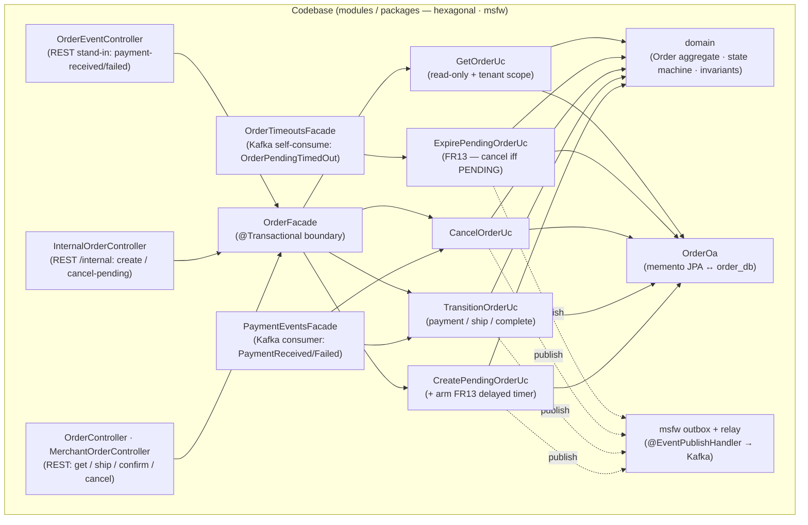
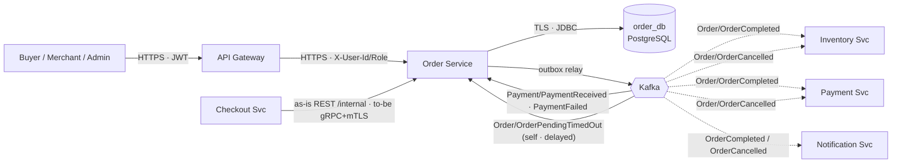
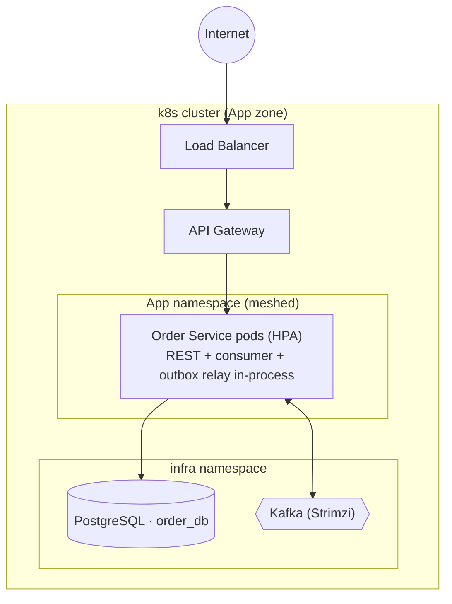
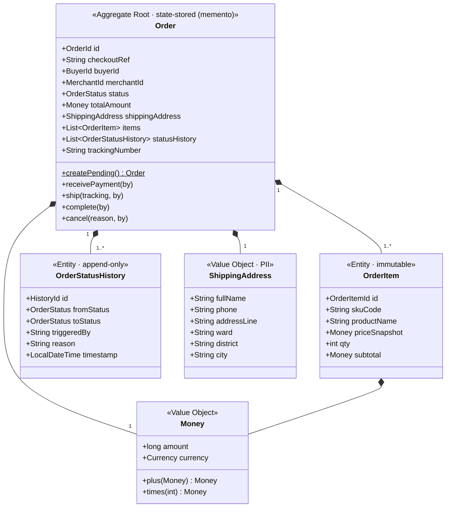
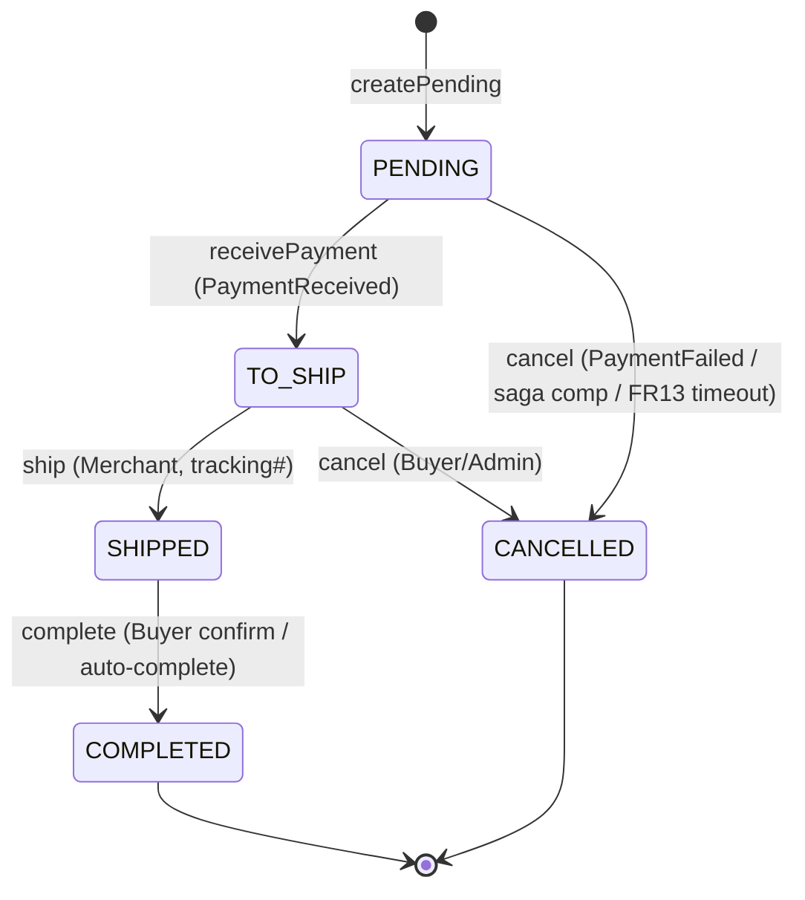
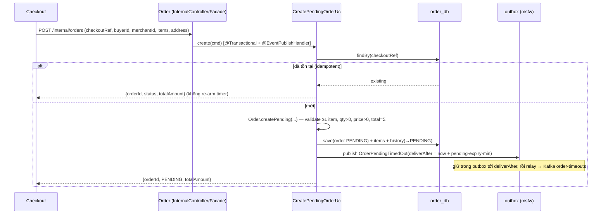
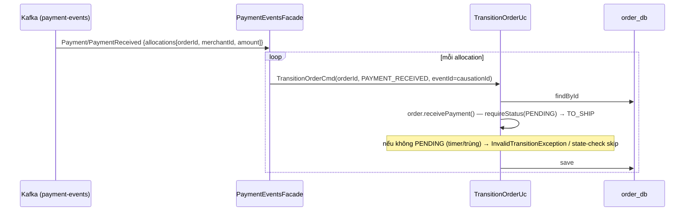
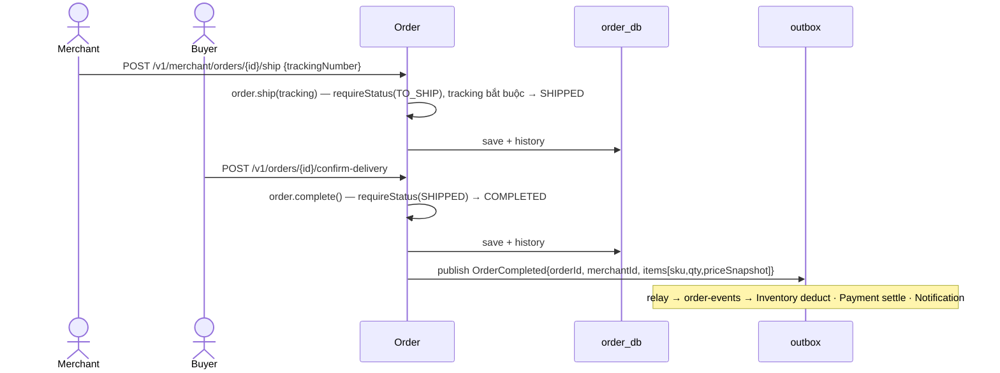
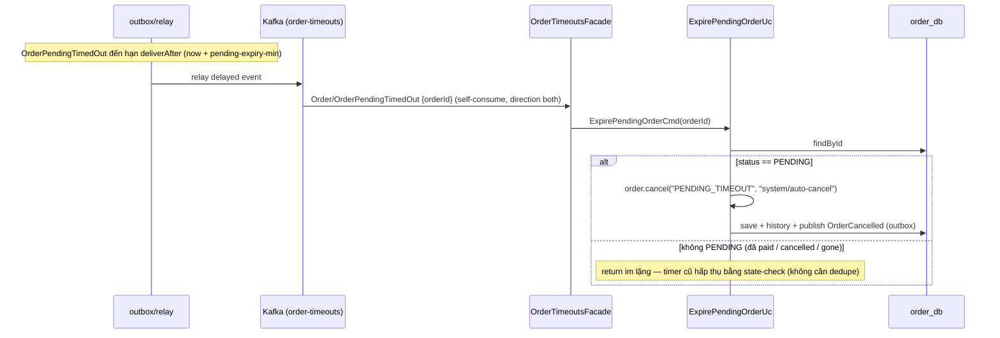

# Detailed Design — Order Service (Order Lifecycle & State Machine)

> **Status:** v1.0 — căn theo `AD-Marketplace` (`MKT-AD-CORE` v1.0.0) · `STD-DESIGN-DOC-v1.3` ·
> **Owner:** Order team ·
> **Reviewers:** _TBD_ ·
> **last-validated:** 2026-06-21 (đối chiếu nội dung ↔ source `order/` + AD v1.0.0)
>
> **Liên kết (lên AD / ngang hợp đồng):**
> - **AD-Marketplace `MKT-AD-CORE`** — `MKT-BC-order` (§3.3 Container archetype, hộp BC L2 + Correspondence physical), §3.4 Context Map (`MKT-REL-04` Order⊃Checkout · `MKT-REL-07` Order→Inventory/Payment · `MKT-REL-08` Payment→Order), §4.2 (vòng đời đơn choreography `MKT-VIEW-06`) + §4.3 (FR13 delayed-event `MKT-VIEW-07`), §5 (bề mặt + bảo đảm tương tác), §6 (sở hữu miền đơn + bất biến dữ liệu), §9 (ADR register hệ thống `MKT-ADR-*`).
> - **Hợp đồng = nguồn sự thật:** `/contracts/*.json` (event payloads OrderCompleted/OrderCancelled/OrderPendingTimedOut + PaymentReceived/Failed) · OpenAPI (REST) · proto (to-be gRPC).
> - DB schema = JPA-derived (`ddl-auto=update`) — không có Flyway migration trong `order/` (đánh dấu nợ, OQ-7).

> **Classification:** **Tier 1 — Critical** _(Order down ⇒ không tạo đơn, không chuyển trạng thái, không phát `OrderCompleted` → Inventory không trừ kho, Payment không settle → tiền kẹt escrow, Merchant không nhận payout)_ ·
> **Data class:** dữ liệu kinh doanh đơn hàng + giá snapshot (transaction data) **và PII địa chỉ giao hàng** (`ShippingAddress`: họ tên, SĐT, địa chỉ Buyer). Retention: giao dịch/đơn **10 năm** (luật kế toán); PII → ẩn danh theo NĐ 13/2023 · **System Owner:** Order team ⇒ **RTO < 1h · RPO < 5 phút** (`MKT-NFR-06`).

> **Ranh giới tầng — Tech Spec này sở hữu gì vs AD giữ gì** (luật tầng STD §4 + AD §"Quan hệ tài liệu"):
> - **AD (SDD) giữ — C4 L2 / Landscape:** hộp *Order BC* (`MKT-BC-order`); Context Map (Order = Supplier của Checkout cho CreatePendingOrder; publish `OrderCompleted`/`OrderCancelled` là Published Language; consume `PaymentReceived`/`PaymentFailed`); bề mặt hợp đồng + bảng bảo đảm tương tác (AD §5); deployment grain BC/zone (App zone, `order_db`).
> - **Tech Spec này sở hữu — C4 L3 / nội bộ Order Service:** module & component (§3.1), C&C + connector (§3.2), deployment chi tiết per-BC (§3.3 → IaC), domain (state machine + aggregate) & data (§4.2–4.3), key flows nội bộ (§5), quyết định **context-local** `ADR-ORD-*` (§7).
> - **Đẩy xuống nữa:** field/mã lỗi đầy đủ → OpenAPI/proto + `/contracts`; replica/HPA/secret/KMS policy → IaC/Vault; DDL cột → migration (nợ — chưa có).
>
> _(Lưu ý: "Tier 1 / PII" là **phân lớp dữ liệu/hệ thống** — khác với mức **C4 L2/L3**.)_

---

# 1. Context & Scope

Order Service là **thẩm quyền duy nhất (single source of truth) về trạng thái đơn hàng**: nhận pending order từ Checkout, lái đơn qua máy trạng thái (PENDING → TO_SHIP → SHIPPED → COMPLETED, hoặc CANCELLED), và phát event báo các context khác. Mọi context khác (Checkout, Payment, Inventory, Notification) **không** tự giữ trạng thái đơn — phải hỏi Order hoặc lắng nghe event của Order.

Order có database riêng (`order_db`, suy luận từ `application-k8s.properties: DB_NAME:order_db`). Là **Tier 1** — chuyển trạng thái sai = thiệt hại nghiệp vụ + tiền trực tiếp.

**Ranh giới bounded context:**

- **Vào (đồng bộ, S2S — as-is REST `/internal`, to-be gRPC+mTLS):** `POST /internal/orders` (CreatePendingOrder — Checkout tạo đơn PENDING, đã tách theo Merchant); `POST /internal/orders/{id}/cancel` (CancelPendingOrder — saga compensation từ Checkout).
- **Vào (REST, JWT qua Gateway → forward `X-User-Id`/`X-User-Role`):** `GET /v1/orders/{id}` (Buyer/Merchant/Admin xem đơn); `POST /v1/orders/{id}/confirm-delivery` (Buyer xác nhận nhận hàng); `POST /v1/orders/{id}/cancel` (Buyer/Admin huỷ); `POST /v1/merchant/orders/{id}/ship` (Merchant xác nhận giao hàng).
- **Vào (bất đồng bộ — as-is Kafka trong k8s, REST stand-in trong standalone):** consume `Payment/PaymentReceived` (PENDING → TO_SHIP), `Payment/PaymentFailed` (PENDING → CANCELLED), và **self-consume** `Order/OrderPendingTimedOut` (FR13 timer của chính mình).
- **Ra (Kafka qua outbox msfw):** publish `Order/OrderCompleted` (→ Inventory deduct + Payment settle + Notification), `Order/OrderCancelled` (→ Inventory release + Payment refund + Notification), `Order/OrderPendingTimedOut` (delayed event tự gửi cho chính mình).
- **Không thuộc context:** tồn kho (Inventory), thanh toán/escrow/payout (Payment), orchestration checkout (Checkout), sản phẩm/giá (Catalog), giỏ hàng (Cart), giao vận vật lý (Courier — tương lai), tranh chấp/hoàn tiền (Dispute — `MKT-ADR-0012`, Proposed).

**Trust boundary** (zero-trust, không suy tin từ vị trí mạng):

- **(B1) Public edge** — Buyer/Merchant/Admin → Gateway → Order (REST). Gateway verify JWT (RS256) rồi forward `X-User-Id`/`X-User-Role`; service **không** lấy identity từ body (`RequestActor`). Role-based + tenant scope + rate-limit ở Gateway.
- **(B2) Inter-context** — Checkout → Order. **as-is:** REST `/internal/*` trong cluster; **to-be:** mTLS + SVID (`MKT-CHG-02`).

**Goals:**

- Source of truth trạng thái đơn — state machine hợp lệ, transition kiểm tại domain, audit trail (status history) append-only.
- Giá snapshot **bất biến**: ghi tại tạo đơn; không API/flow nào sửa (Payment settle tính từ đây).
- FR13 — đơn PENDING quá hạn (`order.pending-expiry-min`) chưa thanh toán → **tự CANCELLED** qua delayed event (không cron).
- Phát `OrderCompleted` trigger Inventory deduct + Payment settle; `OrderCancelled` trigger release + refund.
- Cô lập tenant: Buyer chỉ thấy đơn mình; Merchant chỉ thấy đơn mình.

**Non-goals:** Inventory, Payment/escrow, orchestration Checkout, Catalog/giá, giao vận vật lý (chỉ lưu `trackingNumber`), tranh chấp/hoàn tiền phức tạp (Dispute v2.0), giỏ hàng.

---

# 2. Requirements

> FR/NFR nối về AD; nguồn đầy đủ ở backlog. Mỗi mệnh đề kiểm-chứng-được mang `verify:`; theo STD §8.1, mệnh đề chạm **tiền / PII / toàn-vẹn-trạng-thái** **không** được chỉ `review`.

**Functional:**

| # | Yêu cầu | Giải thích | verify: |
|---|---------|------------|---------|
| FR1 | Create Pending Order | Checkout gọi `POST /internal/orders` → tạo Order PENDING, items (price snapshot), tách theo `merchantId`; **idempotent theo `checkoutRef`** (trùng → trả order cũ). Đồng thời **arm FR13 timer** (delayed event). | test |
| FR2 | Cancel Pending Order (saga comp) | Checkout gọi `POST /internal/orders/{id}/cancel` → PENDING/TO_SHIP → CANCELLED; **idempotent** (đã CANCELLED = no-op). | test |
| FR3 | PaymentReceived → TO_SHIP | Consume `Payment/PaymentReceived`; mỗi `allocation.orderId` PENDING → TO_SHIP. | test |
| FR4 | PaymentFailed → CANCELLED | Consume `Payment/PaymentFailed`; mỗi `orderId` PENDING → CANCELLED. | test |
| FR5 | Merchant ship | `POST /v1/merchant/orders/{id}/ship` (Merchant); TO_SHIP → SHIPPED; `trackingNumber` **bắt buộc**. | test |
| FR6 | Buyer confirm delivery | `POST /v1/orders/{id}/confirm-delivery` (Buyer); SHIPPED → COMPLETED. | test |
| FR7 | Publish OrderCompleted | Khi → COMPLETED: publish `OrderCompleted{orderId, merchantId, items[sku,qty,priceSnapshot]}` qua outbox → Inventory + Payment. | test · monitor |
| FR8 | Publish OrderCancelled | Khi → CANCELLED (từ PENDING/TO_SHIP): publish `OrderCancelled{orderId, items[sku,qty], reason}` qua outbox → Inventory + Payment. | test · monitor |
| FR9 | Cancel before shipment | Buyer/Admin `POST /v1/orders/{id}/cancel`: TO_SHIP → CANCELLED (hoặc PENDING). | test |
| FR10 | Order query (detail) | `GET /v1/orders/{id}`: Buyer/Merchant **owner** + Admin. **404** (không 403) nếu không thuộc caller. | test |
| FR11 | State history audit | Mọi transition ghi `order_status_history` (from, to, triggeredBy, reason, timestamp) — append-only. | test · audit |
| FR12 | Price snapshot immutable | `priceSnapshot` ghi tại tạo đơn; **không** có UPDATE path (`updatable=false` + không có mutator). | test |
| FR13 | **Auto-cancel PENDING timeout (delayed event)** | Khi tạo đơn → publish `OrderPendingTimedOut` (deliverAfter = now + `pending-expiry-min`) vào outbox cùng tx; outbox relay giao lại sau hạn; handler cancel **iff vẫn PENDING**. **Không phải cron.** | test · monitor |

> **Lưu ý so với bản techspec cũ:** bản cũ mô tả FR13/FR14 là **CronJob** (`auto-cancel-job`/`auto-complete-job`) và có `GET /v1/orders` (list). Trong source hiện tại: FR13 là **delayed-event**; **không có cron, không có list endpoint, không có auto-complete production** (xem §9 OQ-1).

**Non-functional / SLO (Tier 1 — nối `MKT-NFR-*`):**

| ID | Thuộc tính | Mục tiêu | verify: |
|----|-----------|---------|---------|
| `MKT-NFR-04` | Availability | ≥ 99.95% (Order Tier 1) | monitor |
| `MKT-NFR-03` | API P99 | < 500 ms (normal) — REST + S2S create | monitor |
| `MKT-NFR-06` | RTO / RPO | RTO < 1h · RPO < 5 phút | audit (DR drill) |
| `MKT-QS-03` | State machine violation | **0** — `InvalidTransitionException` không bị nuốt; metric vi phạm ≈ 0 | test · monitor |
| — | Event publish lag | < 5 giây (outbox relay) | monitor |
| — | Idempotency consumer | giao trùng `PaymentReceived`/timer → không side-effect 2 lần | test (inject trùng) |
| — | Degraded mode | Kafka lag ⇒ PaymentReceived chậm (PENDING lâu hơn) nhưng REST + create vẫn chạy | monitor |

---

# 3. Design overview

> Kiến trúc hexagonal / msfw, 3 module Maven: `domain` (thuần), `application` (use-case), `adapter` (inbound REST + Kafka, outbound JPA). Frames + legend mỗi sơ đồ (W2/W6).

## 3.1 Module view (cấu trúc tĩnh — code chia ra sao)

`frames:` `MKT-CONCERN-05/06` (ranh giới module + dependency rule).



> **Legend (W6):** hộp = lớp/package thật trong `order/`. **Nét liền** = gọi trong-process (controller→facade→use-case→domain/persistence). **Nét đứt** = phát domain event qua outbox (msfw `@EventPublishHandler`). Không hộp "lửng" — mỗi hộp là class/package tồn tại trong code.

| Module | Trách nhiệm | Không được làm |
|--------|-------------|----------------|
| `OrderController` / `MerchantOrderController` | REST cho Buyer/Merchant/Admin; dựng `Actor` từ `X-User-Id`/`X-User-Role`; forward facade. **Không try/catch** → để `GlobalExceptionHandler` map mã lỗi | Luật nghiệp vụ; persist; lấy identity từ body |
| `InternalOrderController` | S2S create / cancel-pending cho Checkout (as-is REST `/internal`, to-be gRPC) | Luật nghiệp vụ; biết Kafka |
| `OrderEventController` | **Stand-in REST** cho payment events (chỉ standalone profile) | Tồn tại trong luồng production (Kafka thay) |
| `PaymentEventsFacade` | Event-subscriber boundary (Order Worker): map `PaymentReceived` → mỗi allocation TO_SHIP; `PaymentFailed` → cancel mỗi orderId; lấy `eventId` từ `EventCausation` | Luật transition (ở domain) |
| `OrderTimeoutsFacade` | Self-consume `OrderPendingTimedOut` → `ExpirePendingOrderUc` | Quyết định timer; dedupe thủ công (state-check làm) |
| `OrderFacade` | Ranh giới `@Transactional` của các use-case | Luật nghiệp vụ |
| `CreatePendingOrderUc` | Tạo Order PENDING (validate, total = Σ); idempotent theo `checkoutRef`; **arm FR13** `OrderPendingTimedOut` delayed event chỉ khi tạo thật | Transition; arm timer khi replay idempotent |
| `TransitionOrderUc` | Forward transition: PAYMENT_RECEIVED / MERCHANT_SHIP / BUYER_CONFIRM / AUTO_COMPLETE → gọi verb domain | Tạo đơn; cancel |
| `CancelOrderUc` | Cancel (domain enforce PENDING/TO_SHIP only; idempotent CANCELLED) | Tạo đơn; transition forward |
| `ExpirePendingOrderUc` | FR13: cancel reason `PENDING_TIMEOUT` **iff status == PENDING**; ngược lại return (timer cũ hấp thụ) | Cancel đơn không PENDING |
| `GetOrderUc` | Đọc đơn + tenant scope (Admin/Merchant-owner/Buyer-owner); non-owner → `ORDER_NOT_FOUND` (404) | Sửa đơn; trả PII cho non-owner |
| `domain` (`Order`/`OrderItem`/`OrderStatusHistory`) | Aggregate + state machine (`requireStatus`+`transitionTo`) + invariant; phát `OrderCompleted`/`OrderCancelled`/(arm) `OrderPendingTimedOut` | I/O; biết DB/Kafka/REST |
| `OrderOa` | Memento JPA ↔ `order_db`; upsert theo `orderId`; rebuild child collections | Luật nghiệp vụ |

**Behavior notes:**

> **BN-1 · State machine cưỡng chế tại domain.** Mọi đổi status đi qua verb của `Order` (`receivePayment`/`ship`/`complete`/`cancel`) → `requireStatus(...)` + `transitionTo(...)`. Transition ngoài bảng → `InvalidTransitionException`. Không code path nào set status trực tiếp. _(verify: test — `OrderTest`; fitness `aggregatesEncapsulated`/`entitiesEncapsulated` chặn rò mutator.)_

> **BN-2 · Giá snapshot bất biến.** `OrderItem.priceSnapshot` là `final`, không mutator; cột JPA `price_snapshot` có `updatable=false`. Catalog đổi giá → đơn cũ không đổi. _(verify: test — `OrderTest`; check — `updatable=false` + không mutator.)_

> **BN-3 · Transactional outbox (msfw).** Use-case ghi trạng thái mang `@EventPublishHandler(eventProcessors=JsonEventStoreProcessor)`: domain event (kể cả `OrderPendingTimedOut` delayed) commit cùng tx state qua outbox; relay đẩy Kafka — at-least-once → consumer phải idempotent. Fitness `stateWritersPublish` chặn use-case ghi-trạng-thái mà thiếu handler. _(verify: test — fitness.)_

## 3.2 C&C view (cấu trúc runtime)

`frames:` `MKT-CONCERN-05/06`.



> **Legend (W6):** hộp vuông = service · hộp trụ = datastore · `{{ }}` = message bus · hộp ngoài (INV/PAY/NOT) = BC khác. **Nét liền** = đồng bộ/JDBC · **nét đứt** = domain event (choreography). Order **vừa publish vừa consume** `order-timeouts` (FR13 self-loop).

**Connector catalog (zero-trust):**

| Connector | From → To | Protocol | Authn / Authz |
|-----------|-----------|----------|----------------|
| public | Gateway → Order | HTTPS | JWT (RS256) verify ở Gateway; forward `X-User-Id`/`X-User-Role`; tenant scope kiểm lại ở service (`GetOrderUc`) |
| create/cancel-pending | Checkout → Order | **as-is** REST `/internal`; **to-be** gRPC | as-is: trong cluster; **to-be:** mTLS (SVID) (`MKT-CHG-02`) |
| db | Order → `order_db` | TLS / JDBC | IAM least-priv |
| event-sub | Kafka → Order (group `order-worker`) | Kafka | SASL/mTLS; consume `payment-events`, `order-timeouts` |
| event-pub | Order (outbox relay) → Kafka | Kafka | SASL/mTLS; produce `order-events`, `order-timeouts` |

> **View-to-view (module ↦ runtime).** Trong source, REST serving + outbox relay + Kafka consumer chạy **in-process** trong **một** Spring Boot app (`OrderServiceApplication`, profile `k8s`/`standalone`). Tách "Order Worker" riêng (bản techspec cũ) là **to-be khi cần scale** (`MKT-CHG`, AD §8.4) — hiện consumer in-process (`ConsumptionConfiguration`).

## 3.3 Deployment view (per-BC → IaC)

`frames:` `MKT-CONCERN-06`.



> **Legend (W6):** hộp = pod/workload · trụ = DB · `{{ }}` = Kafka. **Thực thi zero-trust ở tầng deploy (→ IaC):** NetworkPolicy default-deny (chỉ mở GW→Order, Checkout→Order, Order→PG, Order→Kafka); workload identity + secret ở Vault (không bake image); `order_db` Tier 1 → Multi-AZ/PITR (RPO < 5′). Sizing/replica/HPA → IaC (đẩy xuống). _(as-is dev: H2 standalone profile — AD §8.4.)_

---

# 4. Interfaces & data

> **Nguồn sự thật:** OpenAPI (REST) + proto (to-be gRPC) + `/contracts/*.json` (event). Dưới đây chỉ ngữ nghĩa quan trọng (W4).

## 4.1 Interfaces

| # | Loại | Interface | as-is | to-be | Ngữ nghĩa |
|---|------|-----------|-------|-------|-----------|
| 1 | S2S (in) | CreatePendingOrder | `POST /internal/orders` | gRPC + mTLS | Tạo PENDING; trả `{orderId, status, totalAmount}`. **Idempotent theo `checkoutRef`** (trùng → trả order cũ, không tạo mới) |
| 2 | S2S (in) | CancelPendingOrder | `POST /internal/orders/{id}/cancel` | gRPC + mTLS | Saga compensation; PENDING/TO_SHIP → CANCELLED; idempotent |
| 3 | REST (in) | Get order detail | `GET /v1/orders/{id}` | (giữ) | Buyer/Merchant owner + Admin; non-owner → 404 |
| 4 | REST (in) | Merchant ship | `POST /v1/merchant/orders/{id}/ship` | (giữ) | TO_SHIP → SHIPPED; `trackingNumber` bắt buộc |
| 5 | REST (in) | Buyer confirm delivery | `POST /v1/orders/{id}/confirm-delivery` | (giữ) | SHIPPED → COMPLETED → publish `OrderCompleted` |
| 6 | REST (in) | Cancel order | `POST /v1/orders/{id}/cancel` | (giữ) | Buyer/Admin; `reason` body |
| 7 | event (in) | `Payment/PaymentReceived` | REST stand-in `POST /internal/events/payment-received` | Kafka `payment-events` | Mỗi `allocation.orderId` PENDING → TO_SHIP |
| 8 | event (in) | `Payment/PaymentFailed` | REST stand-in `POST /internal/events/payment-failed` | Kafka `payment-events` | Mỗi `orderId` PENDING → CANCELLED |
| 9 | event (in/out) | `Order/OrderPendingTimedOut` | Kafka `order-timeouts` (direction **both**) | (giữ) | FR13 delayed timer — self-published + self-consumed |
| 10 | event (out) | `Order/OrderCompleted` | Kafka `order-events` | (giữ) | → Inventory deduct, Payment settle, Notification |
| 11 | event (out) | `Order/OrderCancelled` | Kafka `order-events` | (giữ) | → Inventory release, Payment refund, Notification |

**Bảo đảm tương tác** (đồng bộ AD §5.3):

| Tương tác | Sync/Async | Consistency | Idempotency | Delivery | Hành vi lỗi | verify: |
|-----------|-----------|-------------|-------------|----------|-------------|---------|
| Checkout → Order (create) | sync | strong-in-context | **`checkoutRef` UNIQUE** (DB) → trả order cũ | request/response | downstream down → lỗi, không tạo đơn sai | test |
| Checkout → Order (cancel) | sync | strong-in-context | đã CANCELLED = no-op | request/response | order khác state → `InvalidTransitionException` | test |
| Payment event → Order | async | eventual | **at-least-once consumer**: timer cũ/event trùng hấp thụ bằng **state-check** (`requireStatus`/`status==PENDING`); `eventId` từ `EventCausation` | at-least-once | order không PENDING → skip (không side-effect 2 lần) | test (inject trùng) · monitor |
| FR13 timer (self) | async (delayed) | eventual | cancel **iff PENDING** | at-least-once | đã TO_SHIP/CANCELLED → return im lặng | test |

> **Mã lỗi (ngữ nghĩa, đầy đủ → OpenAPI):** `OrderErrorCode` map sang msfw `DomainErrorCode` rồi ra HTTP: `EMPTY_CART`/`INVALID_QUANTITY`/`INVALID_PRICE`/`TRACKING_REQUIRED` → `INVALID_ARGUMENT` (**400**); `INVALID_TRANSITION`/`TENANT_MISMATCH` → `BUSINESS_RULE_VIOLATION`; `ORDER_NOT_FOUND` → `NOT_FOUND` (**404**). Controller **không** try/catch — `GlobalExceptionHandler` (msfw springcore) map status.

## 4.2 Domain model

`frames:` `MKT-CONCERN-02/04/05`. Một aggregate: `Order` (gồm `OrderItem` + `OrderStatusHistory`). State machine là phần phức tạp nhất.



> **Identities (msfw `StringIdentity`):** `OrderId`, `BuyerId`, `MerchantId`, `OrderItemId`, `HistoryId` (fitness `msfwIdentityBase`). `Money` = `long amount` + `enum Currency {VND, USD, EUR}` (minor-unit; `plus`/`times`; non-negative — quy tắc `>0` ở `OrderItem`). _(Lưu ý: thiết kế Money/Currency này **khác** msfw `domain.type.Money` — chủ ý per-context, hợp nhất = open `MKT-ADR-0003`-candidate.)_

**State machine:**



> **Legend (W6):** mỗi cạnh = một verb domain (event nghiệp vụ trong ngoặc). Cưỡng chế bởi `requireStatus(expected, event)` + `transitionTo(...)`; sai → `InvalidTransitionException`. **COMPLETED & CANCELLED là terminal.** `cancel` **idempotent** trên CANCELLED (return); **từ chối** SHIPPED/COMPLETED. `OrderCompleted` phát đúng tại `complete()`; `OrderCancelled` đúng tại `cancel()`. _(`MKT-ADR-0012` sẽ thêm COMPLETED → REFUNDED.)_

**Invariant:**

| # | Invariant | verify: |
|---|-----------|---------|
| 1 | State machine là luật: chỉ transition trong bảng; COMPLETED/CANCELLED terminal; vi phạm → `InvalidTransitionException` | **test** (`OrderTest`) · monitor |
| 2 | `priceSnapshot` **bất biết** — không mutator; cột `updatable=false` | **test** · check |
| 3 | `totalAmount == Σ(priceSnapshot × qty)` (tính tại tạo đơn qua `computeTotal`) | **test** |
| 4 | Mỗi Order ≥ 1 item (`EMPTY_CART`) | test |
| 5 | `qty > 0` (`INVALID_QUANTITY`) và `priceSnapshot > 0` (`INVALID_PRICE`) | test |
| 6 | `buyerId`/`merchantId`/`checkoutRef` **immutable** sau tạo (`final`) | check |
| 7 | `checkoutRef` **UNIQUE** (idempotency create) — index unique | **test** · check |
| 8 | `OrderCompleted` chỉ phát khi → COMPLETED; `OrderCancelled` chỉ khi → CANCELLED | **test** (`OrderEventsContractTest`) |
| 9 | Cancel **không** áp dụng SHIPPED/COMPLETED (cần Dispute flow) | **test** |
| 10 | `statusHistory` **append-only** (chỉ thêm; rebuild giữ thứ tự) | test · audit |
| 11 | `ShippingAddress` (PII) — mã hóa field-level at-rest (production); không log plaintext; chỉ trả cho owner | **check** · audit |

## 4.3 Data model

`order_db` (PostgreSQL; tên suy từ `DB_NAME:order_db`). **State-stored** (memento JPA) + outbox (msfw). DDL = JPA-derived (`ddl-auto=update`) — **chưa có Flyway migration** trong `order/` (nợ, OQ-7).

```mermaid
erDiagram
  ORDERS ||--o{ ORDER_ITEMS : "has (order_fk)"
  ORDERS ||--o{ ORDER_STATUS_HISTORY : "has (order_fk)"

  ORDERS {
    bigint id PK "surrogate (LongIdJpaEntity)"
    string order_id UK "domain id (UUID)"
    string checkout_ref UK "idempotency"
    string buyer_id IDX "tenant scope Buyer"
    string merchant_id IDX "tenant scope Merchant"
    string status "PENDING|TO_SHIP|SHIPPED|COMPLETED|CANCELLED"
    bigint total_amount "minor unit"
    string currency "len 3 (VND default)"
    string addr_full_name "PII"
    string addr_phone "PII"
    string addr_line "PII"
    string addr_ward "PII"
    string addr_district "PII"
    string addr_city "PII"
    string tracking_number "nullable; set on SHIPPED"
    string cancel_reason "nullable"
    timestamp created_at "updatable=false"
    timestamp updated_at
  }
  ORDER_ITEMS {
    bigint id PK
    string order_item_id
    string sku_code
    string product_name "snapshot"
    bigint price_snapshot "updatable=false · IMMUTABLE"
    string currency "len 3"
    int qty
  }
  ORDER_STATUS_HISTORY {
    bigint id PK
    string history_id
    string from_status "nullable (first entry)"
    string to_status
    string triggered_by "user/service/system"
    string reason "nullable"
    timestamp timestamp "updatable=false"
  }
```

**Index / constraint (từ `@Table` annotations):** `idx_orders_order_id` (UNIQUE), `idx_orders_checkout_ref` (UNIQUE), `idx_orders_buyer`, `idx_orders_merchant`. Child collections nối qua `order_fk` (`@OneToMany` + `@OrderColumn`, `orphanRemoval`). **Outbox** = bảng msfw (`OutboxConfiguration` + `JsonEventStoreProcessor`) — chứa cả `OrderPendingTimedOut` delayed cho tới `deliverAfter`.

> **Append-only history thực thi sao:** `OrderStatusHistory` không có mutator; `OrderOa` rebuild collection từ memento mỗi `save` (items immutable → no-op; history giữ thứ tự). Chống UPDATE/DELETE plaintext history = invariant 10 (verify: test · audit).

## 4.4 Config & tunables

| Tham số | Khởi điểm | Nguồn | Ghi chú |
|---------|-----------|-------|---------|
| `order.pending-expiry-min` | **30** | `@Value("${order.pending-expiry-min:30}")` + `DEFAULT_PENDING_EXPIRY_MINUTES=30` | TTL FR13 — deliverAfter của `OrderPendingTimedOut` |
| `spring.kafka.consumer.group-id` | `order-worker` | `application.yml` | Consumer group |
| event routing | `payment-events` / `order-events` / `order-timeouts` | `app.config.event.routing` | `OrderPendingTimedOut` direction **both** |
| relay interval | _TBD / inferred_ | msfw outbox default | Chu kỳ relay → Kafka (không khai trong `order/`) |
| `DB_NAME` | `order_db` | `application-k8s.properties` | _inferred_ tên DB |

> **CROSS-BC INVARIANT (bắt buộc):** `order.pending-expiry-min` (30′) **phải ≥** Inventory `reserve-ttl` (**15′**, AD §3.2). Nếu lệch (Order cancel chậm hơn stock release) → reservation đã nhả nhưng PaymentReceived vẫn đến → đơn TO_SHIP trên stock đã nhả → **oversell**. _(verify: check — config-sync test xuyên BC; AD §4.3 cross-BC.)_

## 4.5 Personal data handling (NĐ 13/2023)

> Order **chứa PII** — `ShippingAddress` (họ tên, SĐT, địa chỉ Buyer). Đây là điểm khác Inventory/Catalog.

| Data element | Class | Lưu ở đâu | Mục đích | Retention |
|--------------|-------|-----------|---------|-----------|
| Shipping address (name/phone/address) | **PII** | `order_db` (6 cột `addr_*`; **production: field-level encrypt AES-256/KMS**) | Giao hàng | TK active + ẩn danh theo NĐ13 — _ngưỡng cụ thể TBD_ |
| `buyer_id` / `merchant_id` | Business (tenant) | `order_db` | Tenant scope | Theo đơn (**10 năm** kế toán) |
| `price_snapshot` / `total_amount` | Transaction | `order_db` | Đối soát, settle | **10 năm** (kế toán) |
| `tracking_number` | Business | `order_db` | Theo dõi giao | Theo đơn |
| Status history | Audit | `order_db` (append-only) | Audit trail | 10 năm |

- **Access control PII:** `ShippingAddress` chỉ trả trong `GET /v1/orders/{id}` cho owner (Buyer/Merchant) + Admin (`GetOrderUc.isVisibleTo`). _(Lưu ý nguồn: hiện chưa có list endpoint nên không có rò PII qua list; nếu thêm list → phải loại địa chỉ.)_
- **DSAR / ẩn danh:** Buyer yêu cầu xóa → ẩn danh `addr_*`; giữ `total_amount`/`price_snapshot` (dữ liệu tài chính, 10 năm). _(verify: check · audit — không `review` vì chạm PII.)_
- **Tại rest hiện trạng:** trong source là plain columns (comment "field-level encrypted at rest in production; plain columns here") → mã hóa thật = **to-be**, đánh dấu nợ.

---

# 5. Key flows

> Lifeline = component nội bộ Order. Bước hệ thống → AD §4.

## 5.1 Create pending + arm FR13 delayed timer



## 5.2 PaymentReceived → TO_SHIP



## 5.3 Ship → SHIPPED → confirm → COMPLETED → OrderCompleted



## 5.4 PaymentFailed → CANCELLED & saga compensation

```mermaid
sequenceDiagram
  participant K as Kafka / Checkout
  participant FAC as PaymentEventsFacade / InternalController
  participant CU as CancelOrderUc
  participant DB as order_db
  participant OB as outbox
  K->>FAC: PaymentFailed{orderIds, reason}  /  CancelPendingOrder(orderId, reason)
  loop mỗi orderId
    FAC->>CU: CancelOrderCmd(orderId, reason)
    CU->>DB: findById
    CU->>CU: order.cancel(reason) — idempotent nếu CANCELLED; reject SHIPPED/COMPLETED
    CU->>DB: save + history
    CU->>OB: publish OrderCancelled{orderId, items[sku,qty], reason}
  end
  Note over OB: relay → order-events → Inventory release · Payment refund
```

## 5.5 FR13 timeout → CANCELLED iff still PENDING (delayed event)



---

# 6. Operations & Resilience (delta)

> DR platform → AD §12. Dưới đây là delta của Order (Tier 1).

- **`order_db`:** Multi-AZ + PITR → RTO < 1h · RPO < 5′ (`MKT-NFR-06`). PII trong backup vẫn cần KMS để đọc (khi production bật field-level encrypt).
- **Outbox + relay (msfw):** event commit cùng tx state → không mất event nếu Kafka down (tồn trong `order_db` outbox; relay đẩy khi phục hồi). Alert khi outbox tồn đọng quá lâu (`outbox_unpublished_age` — ngưỡng TBD).
- **Delayed event sống qua restart:** `OrderPendingTimedOut` **không** giữ trong bộ nhớ — nằm trong **outbox-backed store** với `deliverAfter`; service restart/crash không mất timer (khác in-memory scheduler/cron). Đây là lý do FR13 chọn delayed-event (`ADR-ORD-1`).
- **At-least-once + DLQ:** consumer (`payment-events`, `order-timeouts`) at-least-once; trùng/cũ hấp thụ bằng **state-check** (không bảng dedup riêng). DLQ per-topic; tồn DLQ → alert.
- **Degraded mode:** Kafka lag → PaymentReceived chậm (PENDING lâu hơn) + FR13 timer giao trễ → cancel trễ; REST + create (S2S) vẫn chạy. PG failover → 503 tạm → caller retry (idempotent theo `checkoutRef`).

---

# 7. Decisions (context-local `ADR-ORD-*`) & cross-cutting

> Quyết định nội bộ Order; tham chiếu lên ADR hệ thống `MKT-ADR-NNNN` (AD §9).

**ADR-ORD-1 — FR13 auto-cancel bằng DELAYED EVENT (không cron/scheduler).** `CreatePendingOrderUc` phát `OrderPendingTimedOut implements DelayedEvent` (deliverAfter = now + TTL) vào outbox cùng tx tạo đơn; relay giao lại sau hạn; Order self-consume → cancel iff PENDING. _Đã loại:_ CronJob quét bảng (bản techspec cũ) — thêm deployment, table scan, leader election. _Hệ quả:_ không cần job riêng; timer sống qua restart (outbox-backed); một timer/đơn. Cụ thể hóa `MKT-ADR-0005`(-aac in-process/delayed-event). _(trades-off: đơn giản vận hành ⟂ phụ thuộc outbox relay đúng giờ.)_

**ADR-ORD-2 — State-check hấp thụ timer/event cũ (không bảng processed-events).** Idempotency consumer dựa vào **trạng thái aggregate**: `ExpirePendingOrderUc` cancel iff PENDING; `receivePayment`/`cancel` qua `requireStatus`/idempotent. _Hệ quả:_ không cần `processed_events` table (bản cũ có); at-least-once + giao trùng/cũ tự vô hại. `eventId` lấy từ msfw `EventCausation` khi cần truy vết. Hiện thực `MKT-ADR-0005`. _(verify: test — inject event trùng.)_

**ADR-ORD-3 — Giá snapshot bất biến (không query lại Catalog khi settle).** `OrderItem.priceSnapshot` `final` + cột `updatable=false`; Payment settle tính từ `priceSnapshot × qty`. _Lý do:_ Catalog đổi giá bất kỳ lúc nào; query lại → tiền ≠ giá Buyer thấy → tranh chấp. Hiện thực `MKT-ADR-0002`(reference logic). _(verify: test · check.)_

**ADR-ORD-4 — Status history append-only (audit trail bất biến).** Mọi transition `appendHistory(...)`; entity không mutator; rebuild giữ thứ tự. _Hệ quả:_ chống repudiation (Merchant chối ship / Buyer chối nhận) — `triggered_by` ghi identity. _(verify: test · audit.)_

**ADR-ORD-5 — IDOR → 404 (không 403).** `GetOrderUc` trả `ORDER_NOT_FOUND` cho non-owner để không lộ tồn tại đơn cross-tenant. Hiện thực `MKT-ADR-0009` (tenant isolation). _(verify: test.)_

**ADR refs hệ thống:** `MKT-ADR-0002` (DB-per-context, reference logic — không FK xuyên context, `productId`/`skuCode`/`buyerId` chỉ là giá trị), `MKT-ADR-0005` (idempotency mọi consumer), `MKT-ADR-0011` (Kafka partition theo `merchantId` — ordering per-tenant cho event Order phát).

**Threat seed (STRIDE):**

| Threat | Bề mặt | Đối ứng | verify: |
|--------|--------|---------|---------|
| **S**poofing | Buyer giả Merchant ship; Merchant giả Buyer cancel | Role + tenant scope (`merchantId`/`buyerId` match); identity từ Gateway, không body | test |
| **T**ampering | Sửa `priceSnapshot`; set status bỏ state machine | Invariant 2 (no UPDATE path) + BN-1 (domain enforce) + fitness | **test · check** |
| **R**epudiation | Chối đã ship / đã nhận | `order_status_history` append-only + `triggered_by` | test · audit |
| **I**nfo disclosure (IDOR) | Buyer A xem đơn Buyer B; PII | 404 (ADR-ORD-5); PII chỉ cho owner; field-encrypt at-rest (to-be) | **test · check** |
| **E**levation | Buyer gọi ship; ngoài Checkout gọi create | as-is cluster-internal `/internal`; to-be mTLS/SVID scope | test |

> **PII protection** (tiền/PII → không `review`): mã hóa field-level + access-control owner-only = `check`/`audit`, không `review`.

---

# 8. Test strategy

> Hexagonal: domain test thuần in-memory; use-case test với `InMemoryOrderRepository`. Source: `OrderTest`, `OrderEventsContractTest` (domain); `OrderUseCasesTest` (application); `OrderControllerTest`, `OrderOaTest`, `PaymentEventsConsumptionTest`, `OrderTimeoutsConsumptionTest`, `PaymentContractBindingTest` (adapter); `FitnessFunctionsTest`, `ExceptionHandlingFitnessTest` (architecture).

- **Unit (domain):** mọi cặp `(status × event)` hợp lệ → đúng next; mọi cặp không hợp lệ → `InvalidTransitionException` (PENDING→SHIPPED, cancel SHIPPED/COMPLETED…); cancel idempotent CANCELLED; price snapshot immutable; `total = Σ(price×qty)`; qty>0/price>0; `OrderCompleted`/`OrderCancelled` phát đúng transition (`OrderEventsContractTest`).
- **Unit (use-case):** create tính total + idempotent `checkoutRef` (trả cũ, **không re-arm timer**); `ExpirePendingOrderUc` cancel iff PENDING, skip nếu không PENDING.
- **Contract:** `PaymentContractBindingTest` (PaymentReceived/Failed wire shape); event payload `OrderCompleted`/`OrderCancelled` vs Inventory/Payment consumer (`/contracts`); REST OpenAPI.
- **Integration:** `OrderOaTest` (memento ↔ JPA, upsert theo `orderId`, append-only history); `PaymentEventsConsumptionTest` + `OrderTimeoutsConsumptionTest` (consumer → state machine).
- **Failure-injection:** at-least-once redelivery (timer cũ + PaymentReceived trùng) → state-check hấp thụ, không side-effect 2 lần; PG failover → retry idempotent.

**Fitness functions (CI, registry-driven `FitnessHarness.forSystem("marketplace-order")`):**

| Mệnh đề | Kiểm | verify: |
|---------|------|---------|
| Illegal state transition bị từ chối | `OrderTest` (mọi cặp không hợp lệ → exception) | test |
| Price snapshot immutable | không mutator + `updatable=false`; `OrderTest` | test · check |
| `OrderCompleted`/`OrderCancelled` đúng transition | `OrderEventsContractTest` | test |
| State-writer phát qua outbox | `stateWritersPublish` (chặn ghi-trạng-thái thiếu `@EventPublishHandler`) | test |
| Identity dùng StringIdentity | `msfwIdentityBase` | test |
| Domain thuần / aggregate-entity đóng gói | `domainIsPure` / `aggregatesEncapsulated` / `entitiesEncapsulated` | test |
| Idempotent FR13 (cancel only-if-PENDING) | `OrderTimeoutsConsumptionTest` + `ExpirePendingOrderUc` unit | test |
| `pending-expiry-min` ≥ Inventory `reserve-ttl` | config-sync test xuyên BC _(chưa thấy trong `order/` — nợ, OQ-7)_ | check |

**Acceptance mẫu (given/when/then):**

- _State machine:_ order PENDING → nhận PaymentReceived → TO_SHIP, ghi history.
- _Reject:_ order SHIPPED → Buyer cancel → từ chối (`InvalidTransition`/422), status không đổi.
- _Idempotency create:_ 2 request cùng `checkoutRef` → 1 order, request 2 trả order cũ, **không** arm timer lần 2.
- _FR13:_ order PENDING quá `pending-expiry-min` → timer giao lại → CANCELLED + `OrderCancelled`; nếu đã TO_SHIP trước đó → timer skip.
- _Tenant:_ Buyer A xem đơn Buyer B → 404.

---

# 9. Open questions

| # | Câu hỏi | Ảnh hưởng |
|---|---------|-----------|
| OQ-1 | **Auto-complete SHIPPED sau N ngày?** `TransitionEvent.AUTO_COMPLETE` + `Order.complete()` đã hỗ trợ, nhưng **chưa có trigger/job production** và **không có config `auto_complete_days`** trong source. Bật khi nào + ngưỡng N? Ảnh hưởng escrow duration (Merchant nhận payout). | §4.2 enum, Payment timing |
| OQ-2 | **Partial cancel** đơn nhiều item? Hiện chỉ cancel toàn đơn (`OrderCancelled` mang toàn bộ items). Partial → tính lại total + partial refund/release. | §4.2 domain, Payment/Inventory |
| OQ-3 | **Cancel sau SHIPPED (Dispute/Refund)?** Hiện SHIPPED/COMPLETED terminal cho cancel. `MKT-ADR-0012` thêm COMPLETED → REFUNDED — khi nào? Thêm transition = thay đổi kiến trúc. | §4.2, `MKT-ADR-0012` |
| OQ-4 | **Relay interval / outbox tuning** chưa khai trong `order/` (dựa msfw default) — chốt theo yêu cầu publish-lag < 5s sau khi đo. | §4.4, §6 |
| OQ-5 | **PII at-rest encrypt thật:** hiện plain `addr_*` columns (production-intent comment) — field-level AES-256/KMS = to-be; ngưỡng ẩn danh DSAR cụ thể TBD. | §4.5 |
| OQ-6 | **Money/Currency hợp nhất với msfw `domain.type.Money`?** Hiện per-context (long + enum) — `MKT-ADR-0003`-candidate. | §4.2 |
| OQ-7 | **Schema migration (Flyway) + config-sync fitness:** `order/` dùng `ddl-auto=update`, chưa có migration file và chưa có test cross-BC `pending-expiry ≥ reserve-ttl`. | §4.3, §8 |
