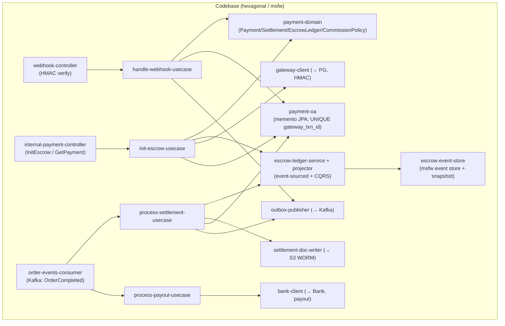
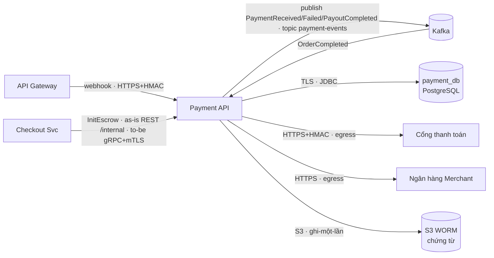
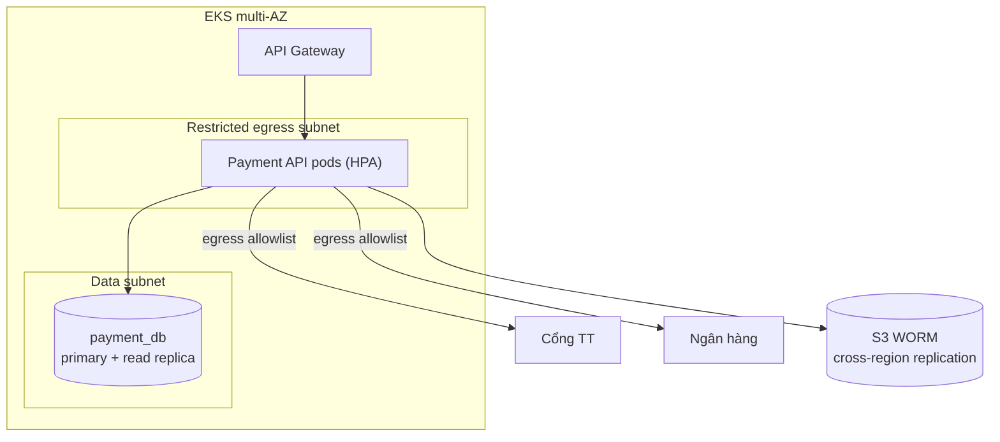
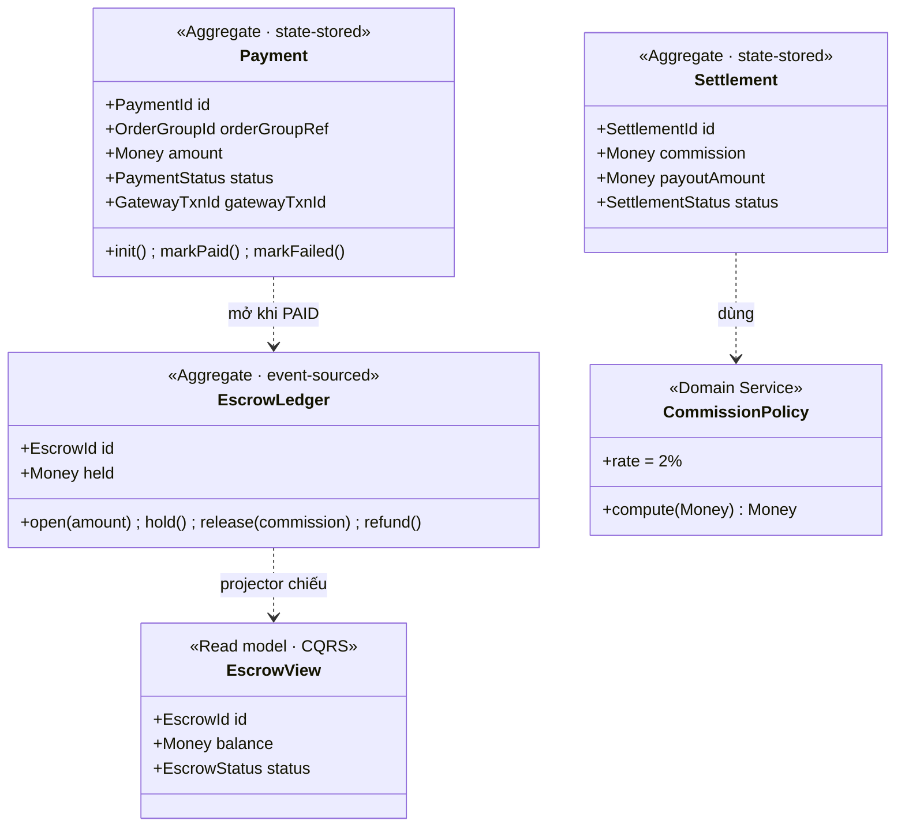
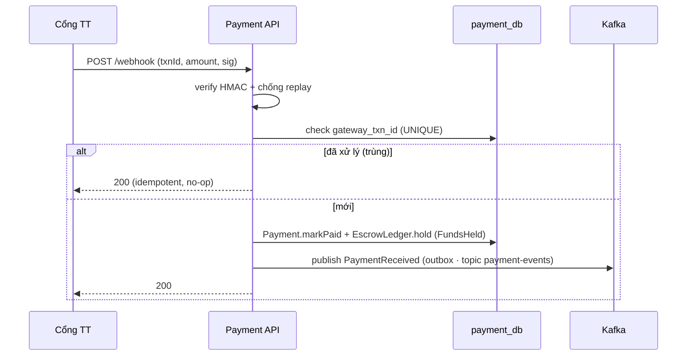
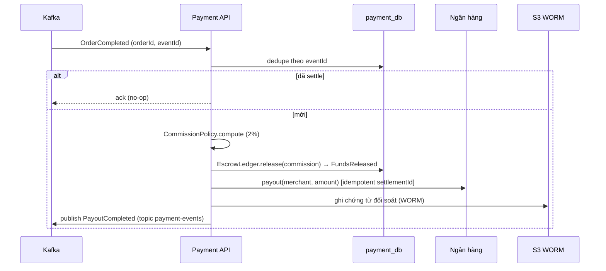
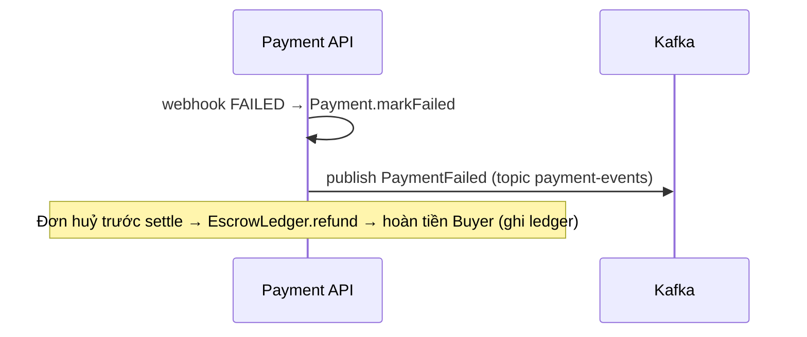

# Detailed Design — Payment Service (Escrow & Settlement)

> **Status:** v1.0 ·
> **last-validated:** 2026-06-21 (đối chiếu nội dung ↔ source code `payment/` + AD-Marketplace v1.0.0) ·
> **Owner:** Payment team ·
> **Reviewers:** _TBD_
>
> **Liên kết (lên AD / ngang hợp đồng):**
> - **[AD-Marketplace](../AD-Marketplace.md)** (`MKT-AD-CORE` v1.0.0) — BC này = **`MKT-BC-payment`** (Tier 1):
>   - §3.3 Container archetype — hộp `MKT-BC-payment` (BC "giàu" 2 store: Payment Svc + PostgreSQL + S3 WORM, **C4 L2**) + Correspondence physical (Restricted egress subnet)
>   - §3.4 Context Map — `MKT-REL-05` (Payment→Checkout, Customer/Supplier, InitEscrow), `MKT-REL-07` (Order→Payment, `OrderCompleted`), `MKT-REL-08` (Payment→Order/Notification, `PaymentReceived`/`Failed`), `MKT-REL-09` (Cổng TT/Bank→Payment, **ACL** + HMAC)
>   - §5 Hợp đồng — §5.1 bề mặt đồng bộ (InitEscrow as-is/to-be), §5.2 Published Language, §5.3 **bảng bảo đảm tương tác**
>   - §6 Dữ liệu — §6.1 `payment_db` + S3 WORM, §6.3 bất biến (escrow append-only, WORM), §6.4 retention
>   - §7 Bảo mật — §7.1 trust boundary `B3`/`B4`, §7.4 mệnh đề kiểm-chứng-được
>   - §9 ADR register hệ thống — `MKT-ADR-0005` (idempotency), `MKT-ADR-0006` (escrow), `MKT-ADR-0007` (WORM), `MKT-ADR-0011` (partition `merchantId`)
>   - "Correspondence physical" — Payment ⟷ Payment Svc (HPA) ⟷ Restricted egress subnet
> - OpenAPI spec + proto (to-be) + **AsyncAPI** (PaymentReceived/PaymentFailed/PayoutCompleted) + `/contracts/*.json` — _nguồn sự thật_
> - IaC / Terraform (restricted egress subnet, S3 Object Lock, IRSA)

> **Classification:** **Tier 1 — Critical** _(giữ tiền thật của khách; sai = mất/lệch tiền)_ ·
> **Data class:** chứa **dữ liệu nhạy cảm** (STK ngân hàng, số tiền, chứng từ tài chính) · **System Owner:** Payment team ⇒ **RTO < 1h · RPO < 5 phút** (AD `MKT-NFR-06`).

> **Ranh giới tầng — Tech Spec này sở hữu gì vs AD giữ gì** (theo grain C4 của AD §2/W5):
> - **AD giữ — C4 L2 / Landscape:** hộp *`MKT-BC-payment`* (§3.3 + Correspondence physical); Context Map (`MKT-REL-05/07/08/09`); bề mặt hợp đồng + bảo đảm tương tác (AD §5.1–5.3); deployment ở grain BC/zone (Restricted egress subnet — "Correspondence physical").
> - **Tech Spec này sở hữu — C4 L3 / nội bộ Payment Service:** module & component (§3.1), C&C (§3.2), deployment chi tiết per-BC (§3.3 → IaC), domain (escrow event-sourced + CQRS) & data (§4.2–4.3), key flows nội bộ (§5), quyết định **context-local** `ADR-PAY-*` (§7).
> - **Đẩy xuống nữa:** field/mã lỗi đầy đủ → OpenAPI/proto/AsyncAPI/`/contracts`; egress allowlist/secret/Object-Lock policy → IaC/Vault.
>
> _(Lưu ý: "Tier 1 / nhạy cảm" ở trên là **phân lớp dữ liệu/hệ thống** — khác với **C4 L2/L3**.)_

# 1. Context & Scope

Payment Service là **chủ sở hữu luồng tiền**: khởi tạo & giữ tiền trung gian (escrow), xác minh webhook cổng thanh toán, đối soát (settlement) + tính hoa hồng sàn, chi trả (payout) cho Merchant, và sinh **chứng từ đối soát bất biến (WORM)**. Có database riêng (`payment_db`) + bucket WORM. Là **Tier 1** — mọi thao tác tiền phải idempotent + audit (làm mịn `MKT-ADR-0005/0006`).

**Ranh giới bounded context:**

- **Vào (đồng bộ, S2S):** `Payment.InitEscrow` từ Checkout (`MKT-REL-05`) — **as-is** REST `POST /internal/payments/escrow`, **to-be** gRPC/mTLS (xem §4.1); `GET /internal/payments/{orderRef}` nội bộ.
- **Vào (bất đồng bộ):** webhook `POST /v1/payments/webhook` từ cổng thanh toán (qua Gateway, verify HMAC — `MKT-REL-09` ACL); Kafka consume `OrderCompleted` (`MKT-REL-07`, topic `order-events`).
- **Ra (egress hạn chế):** cổng thanh toán (giao dịch/refund, HTTPS+HMAC); ngân hàng Merchant (payout); S3 WORM (chứng từ); Kafka publish `PaymentReceived`/`PaymentFailed`/`PayoutCompleted` trên topic `payment-events` (`MKT-REL-08`).
- **Không thuộc context:** điều phối checkout (Checkout Svc), state machine đơn (Order Svc), tồn kho (Inventory).

**Trust boundary** (đồng bộ AD §7.1): webhook là bề mặt **inbound từ bên thứ ba** (`B4`) → verify chữ ký + allowlist IP + idempotency; egress (`B3`) chỉ tới cổng TT/ngân hàng (subnet hạn chế); mọi S2S nội bộ qua mTLS/SVID (to-be — as-is REST `/internal` trong cluster, `B2`); secret ở Vault. Không tin theo vị trí mạng (`MKT-ADR-0010`).

**Goals:**
- Giữ tiền escrow đến khi đơn hoàn tất; release + payout khi settle; refund khi huỷ.
- **Không bao giờ trừ/payout hai lần** dù event/webhook giao trùng (at-least-once).
- Audit trail bất biến cho mọi chuyển động tiền (escrow ledger) + chứng từ WORM.

**Non-goals:** điều phối saga checkout; quản lý vòng đời đơn; quản lý kho; gửi thông báo (Notification Svc).

# 2. Requirements (tóm tắt)

**Functional:**

| # | Yêu cầu | Giải thích |
| --- | --- | --- |
| FR1 | Init escrow | Checkout gọi `InitEscrow(orderGroupId, totalAmount)` → tạo Payment `PENDING`, gọi cổng TT lấy `paymentUrl` |
| FR2 | Verify webhook | `POST /webhook`: verify HMAC + chống replay; map `PAID/FAILED`; idempotent theo `gateway_txn_id` |
| FR3 | Hold escrow | Webhook `PAID` → ghi `FundsHeld` vào EscrowLedger; publish `PaymentReceived` |
| FR4 | Settle | Consume `OrderCompleted` → tính hoa hồng (2%) → `FundsReleased` → payout |
| FR5 | Payout | Chi trả Merchant qua ngân hàng (idempotent); publish `PayoutCompleted` |
| FR6 | Chứng từ WORM | Sinh chứng từ đối soát ghi-một-lần lên S3 Object Lock |
| FR7 | Refund | Đơn huỷ trước settle → hoàn tiền Buyer; ghi ledger |

**Non-functional / SLO (Tier 1)** — mỗi mệnh đề mang `verify:` ∈ review·test·monitor·check·audit (luật AD §8.1: claim tiền/toàn-vẹn **không** được chỉ `review`); nối lên NFR hệ thống:

| Thuộc tính | Mục tiêu | verify: | Nối lên AD |
| --- | --- | --- | --- |
| RTO / RPO | RTO < 1h · RPO < 5 phút | audit (DR drill) | `MKT-NFR-06` |
| Idempotency | 0 double-charge / double-payout (bất biến) | test (inject event/webhook trùng) | `MKT-NFR-09`, `MKT-ADR-0005` |
| Đối soát | escrow balance khớp 100%; chứng từ bất biến | monitor · audit (reconcile job) | `MKT-NFR-09`, `MKT-GOAL-02` |
| Webhook latency | xử lý < 2s; cổng TT retry nếu timeout | monitor | `MKT-NFR-03` |
| Availability | ≥ 99.95% | monitor | `MKT-NFR-04` |
| Egress chỉ PG/Bank | 0 đích ngoài allowlist | check (network policy) | AD §7.4 |
| Chứng từ WORM bất biến | 0 overwrite/delete thành công | check (IaC Object Lock) · audit | `MKT-ADR-0007` |

# 3. Design overview

## 3.1 Module view (cấu trúc tĩnh)

`frames:` Security/Maintainability (`MKT-CONCERN-05/06`) — ranh giới module nội bộ + chỗ chứa invariant tiền.

> **Legend (W6):** hộp = module/component nội bộ (controller/use-case/domain/adapter trong codebase hexagonal); **mũi tên** = phụ thuộc gọi (caller → callee) theo hướng vào lõi. Cụm `subgraph` = ranh giới codebase một service. Không có node hạ tầng ở view này (xem §3.2/§3.3).

| Module | Trách nhiệm | Không được làm |
| --- | --- | --- |
| `webhook-controller` | Kết thúc HTTP webhook; verify HMAC + chống replay; chuyển use-case | Business logic; ghi DB trực tiếp |
| `internal-payment-controller` | InitEscrow / GetPayment (S2S; as-is REST `/internal/payments`, to-be mTLS) | Gọi cổng TT trực tiếp |
| `order-events-consumer` | Consume `OrderCompleted` (idempotent theo `eventId`) → settle + payout | Tự quyết business; bỏ dedupe |
| `init/handle-webhook/settlement/payout` use-case | Điều phối một thao tác tiền; gọi domain + adapter | Biết chi tiết HMAC/JDBC/Kafka |
| `escrow-ledger-service + projector` | **Write event-sourced** (EscrowOpened/FundsHeld/FundsReleased) + chiếu sang read model `EscrowView` (CQRS) | Lộ event store ra ngoài |
| `payment-domain` | Aggregate + invariant: Payment/Settlement (state-stored), EscrowLedger (event-sourced), hoa hồng 2% (`CommissionPolicy`) | I/O |
| `payment-oa` / `escrow-event-store` | Repository memento + event store (msfw); UNIQUE `gateway_txn_id` (idempotency) | Business logic |
| `gateway-client` / `bank-client` / `settlement-doc-writer` | Egress ra PG / Bank / S3 WORM | Business logic |
| `outbox-publisher` | Drain outbox → Kafka (đảm bảo at-least-once + ordering theo `merchantId`) | — |

> **BN-1 · Idempotency tiền (bất biến):** webhook dedupe theo `gateway_txn_id` (UNIQUE DB); consumer dedupe theo `eventId`; lệnh dùng `IdempotencyKey` (msfw). Giao trùng `OrderCompleted` → **không** release/payout lần 2. Đây là fitness function bắt buộc (§8), làm mịn `MKT-ADR-0005`.
>
> **BN-2 · EscrowLedger event-sourced:** số dư escrow tái dựng từ chuỗi sự kiện (audit tài chính — `MKT-ADR-0006`); Payment/Settlement vẫn state-stored. Không event-source toàn bộ context — chỉ nơi cần lịch sử tiền (ghi nhận code-derived `ADR-0003-aac` escrow-ES).

## 3.2 C&C view (runtime)

`frames:` Security (`MKT-CONCERN-05`) — connector + authn zero-trust ở runtime.

> **Legend (W6):** hộp bo góc = service runtime (Payment API, Checkout, Gateway); hộp trụ `[(...)]` = datastore/bus/object-store (Kafka, `payment_db`, S3 WORM); hộp vuông ngoài = external (PG/Bank). **Mũi tên** = connector runtime; nhãn = protocol + bảo đảm authn. Hướng mũi tên = chiều khởi tạo gọi.

**Connector catalog (zero-trust):**

| Connector | From → To | Protocol | Authn/Authz |
| --- | --- | --- | --- |
| escrow | Checkout → Payment | as-is REST `/internal` · to-be gRPC | as-is in-cluster · to-be mTLS (SVID), scope `payment:init:escrow` |
| webhook | PG → Payment (qua GW) | HTTPS | verify HMAC + allowlist IP + idempotency |
| events-in/out | Kafka ↔ Payment | Kafka | mTLS broker + ACL topic; consumer idempotent; partition key `merchantId` (`MKT-ADR-0011`) |
| db | Payment → payment_db | TLS/JDBC | IAM least-priv |
| gateway | Payment → PG | HTTPS+HMAC | secret ở Vault; egress allowlist |
| payout | Payment → Bank | HTTPS | secret ở Vault; egress allowlist |
| docs | Payment → S3 WORM | S3 | Object Lock; write-once IAM |

## 3.3 Deployment view (per-BC → IaC)

`frames:` SRE/Ops + Security (`MKT-CONCERN-06/05`) — zone, egress, DR cụ thể của BC.

> **Legend (W6):** `subgraph` = node/zone hạ tầng (VPC, subnet) — ranh giới mạng; hộp = instance container đã định nghĩa ở §3.2 (Payment API pods, Gateway); hộp trụ = datastore/object-store. **Mũi tên** = luồng mạng cho phép; nhãn = ràng buộc (egress allowlist). Không hộp "lửng" — mỗi hộp là node HOẶC instance container.

**Thực thi zero-trust ở tầng deploy (→ IaC):**
- **Restricted egress subnet** (khớp "Correspondence physical" AD): NetworkPolicy default-deny; egress **chỉ** tới PG/Bank (allowlist) — không Internet tự do.
- Workload identity (IRSA) + mTLS (SVID); secret ở Vault, không trong code (`MKT-ADR-0010`).
- `payment_db` RPO < 5 phút (hourly incremental + WAL); S3 WORM bật **Object Lock** + cross-region replication (`MKT-ADR-0007`).
- Deploy **canary** (Tier 1); freeze payout khi phát hiện lệch đối soát.

# 4. Interfaces & data

> Hợp đồng đầy đủ ở OpenAPI/proto/AsyncAPI/`/contracts`. Dưới đây chỉ ngữ nghĩa quan trọng (bề mặt + bảo đảm — đồng bộ AD §5, W4).

## 4.1 Interfaces

| # | Loại | Interface | Auth | Ngữ nghĩa |
| --- | --- | --- | --- | --- |
| 1 | S2S (in) | `Payment.InitEscrow(orderGroupId, totalAmount, currency)` | as-is in-cluster · to-be mTLS | Tạo Payment PENDING; trả `paymentUrl`. **Idempotent** theo `orderGroupId`/`IdempotencyKey` |
| 2 | REST (in) | `POST /v1/payments/webhook` | HMAC | Callback PG; verify chữ ký; idempotent theo `gateway_txn_id` |
| 3 | S2S (in) | `Payment.GetPayment(orderRef)` | as-is in-cluster · to-be mTLS | Đọc trạng thái |
| 4 | event (out) | `PaymentReceived` / `PaymentFailed` → `payment-events` | Kafka | Sau webhook; consumer: Order, Notification (`MKT-REL-08`) |
| 5 | event (out) | `PayoutCompleted` → `payment-events` | Kafka | Sau payout |
| 6 | event (in) | `OrderCompleted` ← `order-events` | Kafka | Kích hoạt settlement + payout (`MKT-REL-07`) |

> **as-is ↔ to-be (đồng bộ AD §5.1 + `MKT-CHG-02`):** trong **code (as-is)** Checkout→Payment InitEscrow là **REST** `POST /internal/payments/escrow` (`GetPayment` = `GET /internal/payments/{orderRef}`), stand-in cho gRPC (`ADR-0004`-aac code-derived); **to-be** là **gRPC + mTLS** qua Istio. **Bề mặt + bảo đảm giữ nguyên** (InitEscrow nhận `orderGroupId/totalAmount/currency`, trả `paymentUrl`, idempotent theo `orderGroupId`); **chỉ protocol đổi** — đúng N3 (bên ngoài phụ thuộc bề mặt, không phụ thuộc protocol). Tương tự, consume `OrderCompleted` trong code hiện là REST stand-in cho Kafka consumer; to-be là Kafka thật trên `order-events`.

**Bảo đảm tương tác** (đồng bộ AD §5.3): InitEscrow = sync command, strong-in-context, idempotency **bắt buộc** (`Idempotency-Key`); webhook = inbound async, eventual, idempotent theo `gateway_txn_id` (UNIQUE); OrderCompleted = at-least-once, consumer dedupe theo `eventId`, **không** payout 2 lần.

## 4.2 Domain model

`frames:` Finance (`MKT-CONCERN-04`) — aggregate + invariant giữ toàn-vẹn tiền.

> **Legend (W6):** hộp = aggregate/read-model/domain-service (stereotype `<<...>>` nói rõ loại + chiến lược lưu trữ: state-stored vs event-sourced vs read model); **mũi tên đứt `..>`** = phụ thuộc/cộng tác (nhãn = quan hệ). Không phải class diagram đầy đủ field — chỉ field mang invariant.

**Invariant** (mỗi mệnh đề mang `verify:`; claim tiền/toàn-vẹn **không** chỉ `review` — luật AD §8.1):

| # | Invariant | verify: |
| --- | --- | --- |
| 1 | `gateway_txn_id` **UNIQUE** — một giao dịch cổng chỉ ghi nhận một lần (idempotency webhook) | test (insert trùng → từ chối) · check (DB UNIQUE index) |
| 2 | EscrowLedger chỉ chuyển `OPENED → HELD → RELEASED\|REFUNDED`; tổng release + refund ≤ held | test (transition + property) |
| 3 | Payout idempotent theo `settlementId` — `OrderCompleted` trùng **không** payout lần 2 | test (inject event trùng) · monitor (`payout_total` vs đơn) |
| 4 | Hoa hồng = `CommissionPolicy.compute` (2%, basis points), không lấy từ input ngoài | test (TC-PAY-05: 1.000.000 → 20.000) |
| 5 | Chứng từ settlement ghi-một-lần (WORM) — không sửa/xóa kể cả owner | check (IaC Object Lock) · audit |
| 6 | Số dư escrow tái dựng được từ event store tại mọi thời điểm (đối soát) | test (replay) · audit (reconcile) |

## 4.3 Data model

| Store | Bảng / đối tượng | Ghi chú |
| --- | --- | --- |
| `payment_db` (PostgreSQL) | `payments` (memento; UNIQUE `payment_id`/`order_ref`/`gateway_txn_id`), `escrow_event_store` + `snapshots`, `escrow_view` (read model), `settlements`, `payouts`, `outbox` | ACID; outbox cho at-least-once |
| S3 (WORM) | `settlement-docs/{settlementId}.pdf` | Object Lock (write-once); cross-region replication |

> Schema cột chi tiết + DDL → migration (Flyway) trong repo Payment. Reference logic xuyên context: `orderRef`, `merchantId` (không FK vật lý — `MKT-ADR-0002`).

## 4.4 Config & tunables

| Tham số | Khởi điểm | Ghi chú |
| --- | --- | --- |
| `payment.commission_rate` | 0.02 (200 bp) | Hoa hồng sàn (qua `CommissionPolicy`, đơn vị basis points) |
| `payment.webhook_replay_window_s` | 300 | Cửa sổ chống replay webhook |
| `payment.payout_retry_max` | 5 | Retry payout → DLQ nếu vượt |
| `payment.gateway_timeout_ms` | 30000 | Timeout gọi cổng TT |
| `payment.egress_allowlist` | PG, Bank | Đích egress hợp lệ (enforced ở NetworkPolicy) |

## 4.5 Personal data handling

`frames:` Security/Finance (`MKT-CONCERN-05/04`) — đồng bộ AD §6.4.

| Data element | Class | Lưu ở đâu | Retention |
| --- | --- | --- | --- |
| STK ngân hàng Merchant | Nhạy cảm | `payment_db` (field-level encrypt) | theo hợp đồng |
| Số tiền / giao dịch | Giao dịch | `payment_db` | 10 năm (luật kế toán) |
| Chứng từ đối soát | Tài chính | S3 WORM | 10 năm, bất biến |

Mã hóa at-rest AES-256 (KMS/Vault); STK + PII field-level. Không log số tiền/STK thô (mask).

# 5. Key flows

## 5.1 Webhook PAID → giữ escrow

`frames:` Finance (`MKT-CONCERN-04`).

> **Legend (W6):** lifeline = service/store/bus tham gia; mũi tên đặc = gọi/gửi đồng bộ; mũi tên đứt `-->>` = phản hồi; `alt/else` = nhánh điều kiện (đường idempotent vs đường mới).

## 5.2 Settlement & payout (OrderCompleted)

`frames:` Finance (`MKT-CONCERN-04`).

> **Legend (W6):** như §5.1 — lifeline = thành phần runtime; `alt/else` phân nhánh đã-settle (no-op) vs mới; bước trong khung `else` là một transaction (payout fail → rollback settlement, xem §6).

## 5.3 Webhook FAILED / Refund

`frames:` Finance (`MKT-CONCERN-04`).

> **Legend (W6):** mũi tên = gửi event; `Note` = bước nghiệp vụ nội bộ không tạo message ra ngoài. `PaymentFailed` → Order chuyển CANCELLED (`MKT-REL-08`).

# 6. Operations & Resilience (delta)

> DR baseline ở AD §12 — dưới đây là delta của Payment.

- **payment_db:** Tier-1 → hourly incremental + WAL, **RPO < 5 phút**; PITR.
- **S3 WORM:** cross-region replication; không xóa được kể cả khi compromise (Object Lock — `MKT-ADR-0007`).
- **Egress:** chỉ PG/Bank (allowlist) — chặn exfiltration (`B3`).
- **DLQ:** `pay-dlq` cho event tiền; tồn DLQ → **alert P1 + freeze payout** (AD §11 alerting).
- **Reconcile:** job đối soát `escrow_view` ↔ event store ↔ giao dịch cổng TT định kỳ; lệch → P1 (`verify: audit`).
- **Circuit breaker** gọi PG/Bank; timeout mọi I/O; reconcile thủ công khi vendor lỗi (`MKT-RISK-05`).

# 7. Decisions context-local (ADR-PAY-*) & cross-cutting

> Quyết định nội bộ Payment (`ADR-PAY-*`) — **khác** ADR register hệ thống ở AD §9; hỗ trợ/cụ thể hóa các ADR hệ thống liên quan (`MKT-ADR-0005` idempotency, `MKT-ADR-0006` escrow, `MKT-ADR-0007` WORM, `MKT-ADR-0011` partition). Dãy code-derived ghi `…-aac` để khỏi lẫn số (AD §9 lưu ý register).

**ADR-PAY-1 — EscrowLedger event-sourced + CQRS read model.** Miền tài chính cần audit trail bất biến + tái dựng số dư; Payment/Settlement vẫn state-stored (memento). _Hệ quả:_ phải quản lý snapshot/upcasting; đọc tách khỏi ghi (`EscrowView`). _(Làm mịn `MKT-ADR-0006`; ghi nhận code-derived `ADR-0003-aac` escrow-ES.)_

**ADR-PAY-2 — Một escrow cho tổng giỏ, settle per-Merchant.** Khớp Checkout `ADR-CHK-2`: giữ tổng, phân bổ + payout khi từng đơn Merchant hoàn tất. _Hệ quả:_ logic settlement phức tạp hơn (chia theo merchant).

**ADR-PAY-3 — Idempotency đa lớp.** UNIQUE `gateway_txn_id` (webhook) + `eventId` dedupe (consumer) + `IdempotencyKey` msfw (lệnh). _Hệ quả:_ không double-charge/payout dù at-least-once. _(Làm mịn `MKT-ADR-0005`.)_

**ADR-PAY-4 — Chứng từ đối soát WORM (S3 Object Lock).** Write-once, deny overwrite/delete kể cả owner. _Hệ quả:_ tuân thủ tài chính; IAM policy chi tiết = TBD (đồng bộ `MKT-RISK-02`). _(Làm mịn `MKT-ADR-0007`.)_

**ADR-PAY-5 — Restricted egress subnet (allowlist PG/Bank).** _Hệ quả:_ giảm bề mặt exfiltration; mọi đích mới phải qua review + IaC. _(Làm mịn `MKT-ADR-0010` zero-trust.)_

**ADR-PAY-6 — Hoa hồng 2% trong domain (CommissionPolicy, basis points), không config tự do.** _Hệ quả:_ đổi rate = đổi code + review (không lật bằng config nóng); rate per-merchant cắm vào bằng cách dựng policy khác.

**Threat seed (STRIDE)** — đồng bộ AD §7 (Tech Spec giữ STRIDE seed per-BC):

| Threat | Bề mặt | Đối ứng | verify: |
| --- | --- | --- | --- |
| **S**poofing — giả webhook | `B4` webhook | HMAC + allowlist IP + chống replay | test |
| **T**ampering — sửa số tiền | webhook payload | amount cross-check (webhook amount == escrow amount) | test |
| **R**epudiation — chối thao tác tiền | ledger | escrow event-sourced (append-only, audit) | audit |
| Double payout (Elevation/Replay) | event redelivery | idempotency đa lớp (ADR-PAY-3) | test (inject trùng) |
| **I**nfo disclosure — exfiltration | egress | egress allowlist (ADR-PAY-5) | check (network policy) |
| Tampering — sửa chứng từ | S3 | WORM/Object Lock (ADR-PAY-4) | check (IaC) · audit |

# 8. Test strategy

- **Unit:** `CommissionPolicy` (2% math; TC-PAY-05); EscrowLedger transitions (`OPENED→HELD→RELEASED/REFUNDED`); invariant tổng release ≤ held.
- **Contract:** proto/REST InitEscrow; AsyncAPI PaymentReceived/Failed/PayoutCompleted; webhook schema; `OrderCompleted` contract-binding (`/contracts`).
- **Idempotency (bắt buộc):** webhook trùng `gateway_txn_id` → no-op; `OrderCompleted` trùng → **không** payout/release lần 2 (inject event trùng).
- **Amount cross-check:** webhook amount ≠ escrow amount → từ chối.
- **Failure-injection:** PG/Bank timeout → retry → DLQ; reconcile job phát hiện lệch.
- **Fitness functions (bắt buộc):**
  - **No double payout/deduct** trên event redelivery.
  - **Egress chỉ PG/Bank** (network policy check).
  - **S3 settlement docs không ghi đè/xóa được** (IaC + test Object Lock).
  - **Escrow balance khớp** event store ↔ read model ↔ cổng TT.

**Acceptance mẫu:**
- _Escrow:_ webhook PAID → escrow HELD đúng số tiền, publish PaymentReceived đúng 1 lần.
- _Settlement:_ OrderCompleted → hoa hồng 2% đúng, payout đúng số, chứng từ WORM được tạo.
- _Idempotent:_ giao 2 lần OrderCompleted → 1 payout, 1 chứng từ.

# 9. Open questions

1. **Refund sau settle:** cho phép hoàn tiền sau khi đã payout? (Hiện: chỉ refund trước settle.)
2. **Partial settlement:** giỏ nhiều Merchant, một đơn huỷ → settle phần còn lại thế nào?
3. **Multi-currency payout:** giữ escrow + payout khác currency? (Hiện: single currency.)
4. **Dispute hold:** khi có tranh chấp (Dispute BC — `MKT-ADR-0012` Proposed) → giữ escrow thay vì release? Cần cờ hold (đồng bộ `MKT-CHG-01`).
5. **Định dạng serialize event:** Avro/Protobuf/JSON Schema (đồng bộ `MKT-ADR-0013` Proposed/TBD).
</content>
</invoke>
