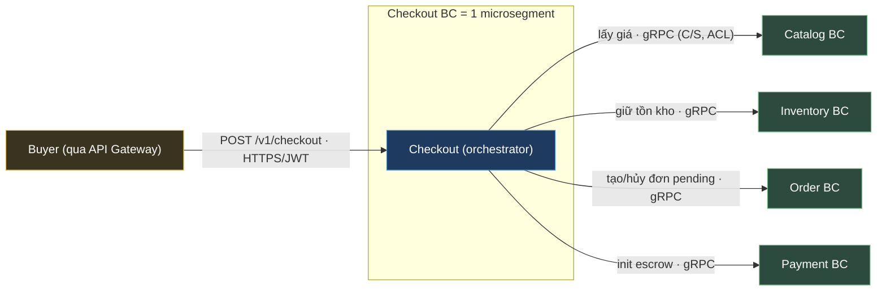
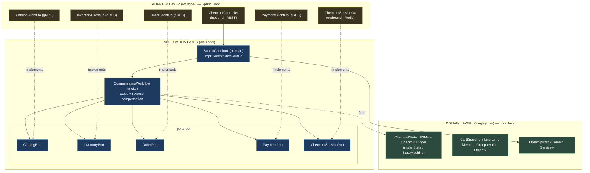
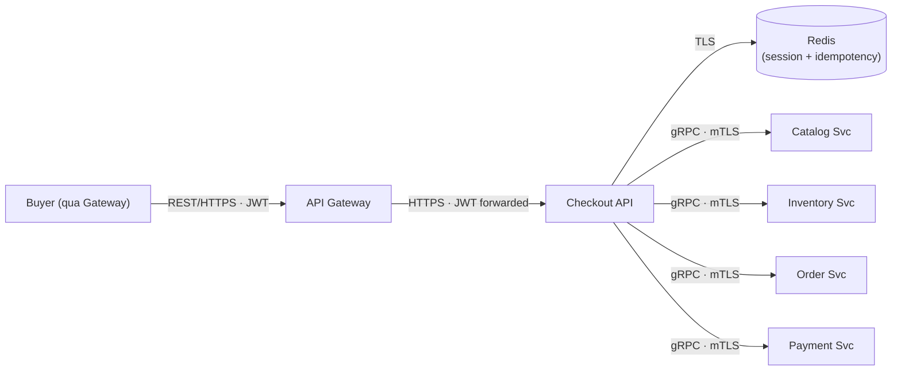
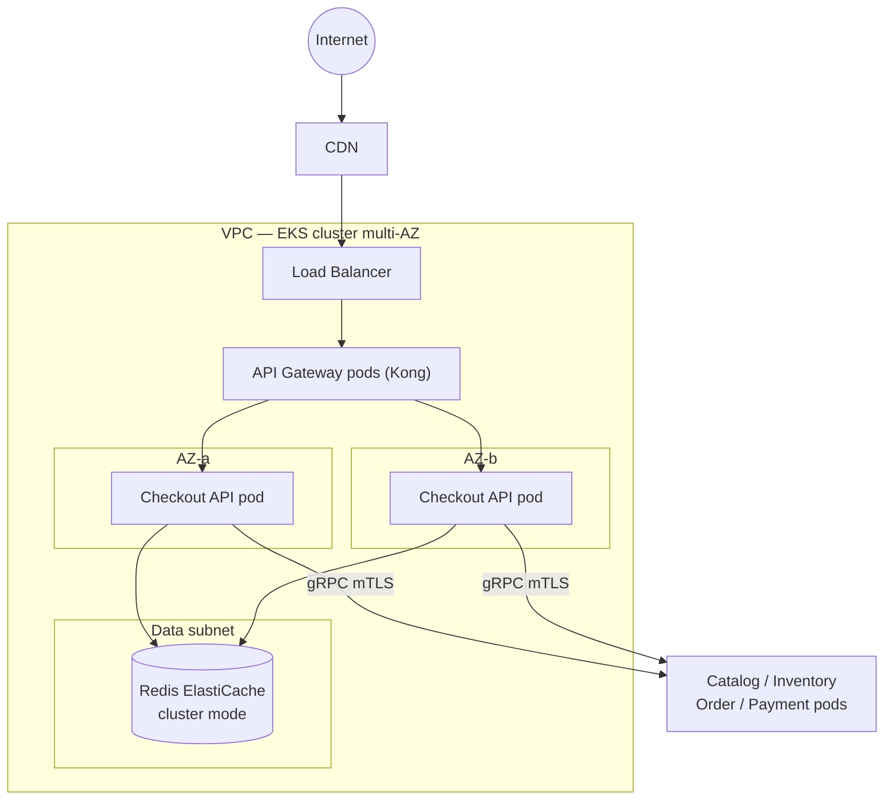
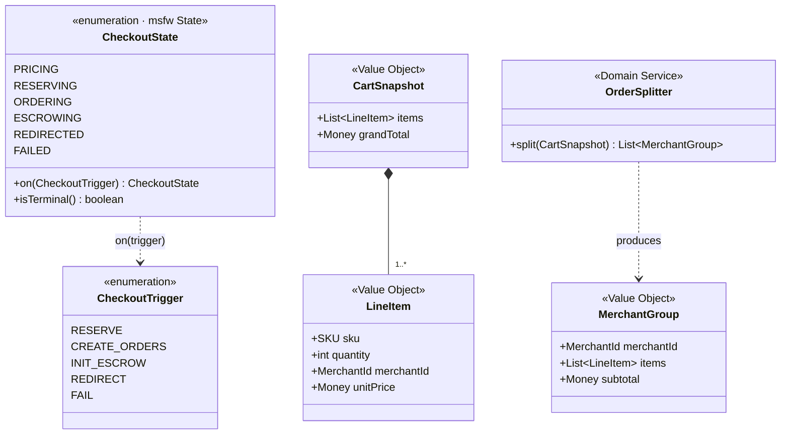
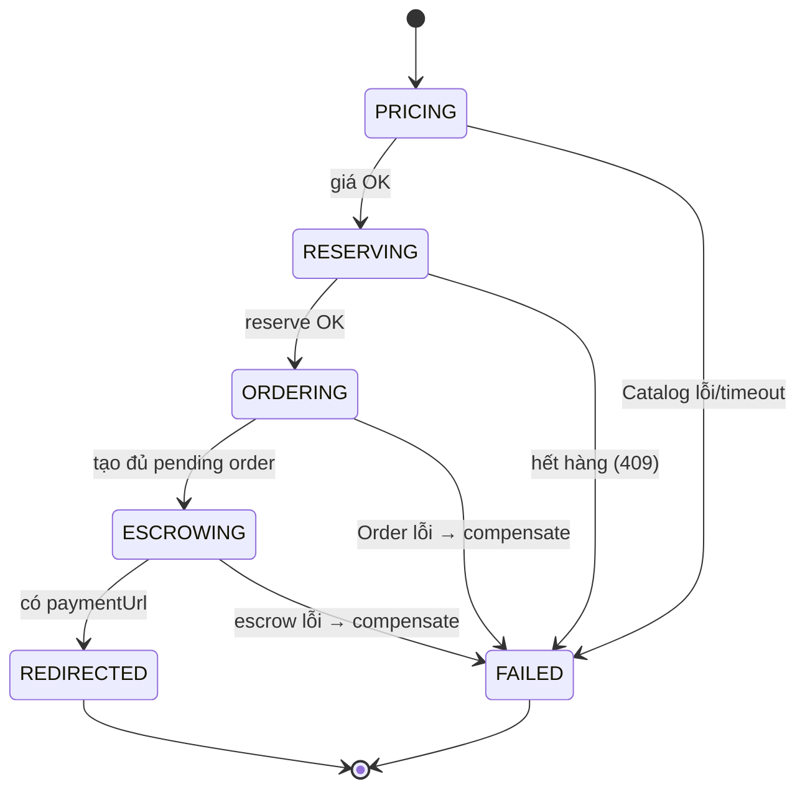
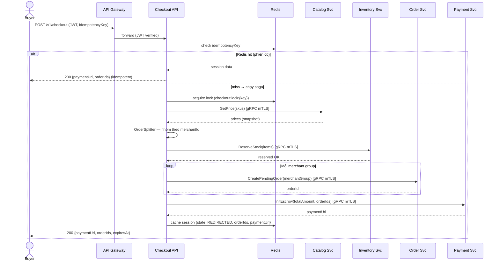
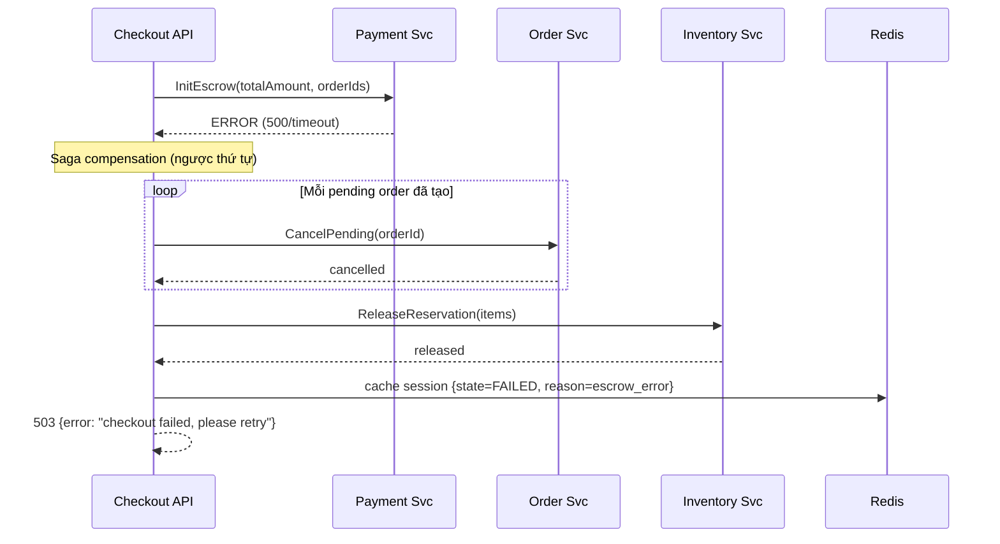
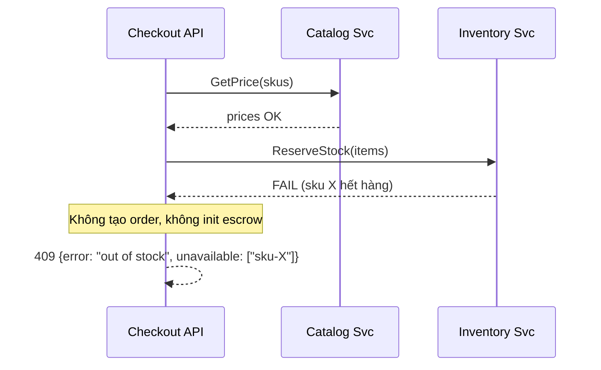

# Tech Spec — Checkout BC (Orchestrator)

| Thông tin tài liệu | Giá trị |
| --- | --- |
| Mã tài liệu | `TS-CHECKOUT-v1.4` |
| Loại | **Tech Spec** — cấp bounded context (1 file / BC) |
| Thuộc AD | [AD-Marketplace-AiGen](../AD-Marketplace-AiGen.md) — BC "Checkout": structure §2.2, context map §2.3, flows §3, interfaces §4, security §6 |
| Chuẩn áp dụng | `STD-DOC-v1.15` (Module/C&C/Deployment views) · arc42 · C4 L3 · ISO 42010 |
| Owner | Checkout team |
| Tier / Data class | **Tier 2 — Business Critical** · L2 (cart, session) + L3 (giá snapshot, merchantId) |
| RTO / RPO | RTO < 4h · RPO < 1h |
| Trạng thái | Draft v1.4 |
| Sơ đồ | Mermaid (toàn bộ) |
| Ngoài phạm vi | AaC / fitness-function enforcement (tách riêng) — Tech Spec này chỉ chốt thiết kế & invariant. |

---

# 1. Context & Scope

Checkout là **BC điều phối (orchestrator)** trong Marketplace-AiGen — hộp "Checkout BC" ở [AD §2.2](../AD-Marketplace-AiGen.md). Nó điều phối luồng từ *"Buyer bấm đặt hàng"* tới *"redirect sang cổng thanh toán"* bằng một **saga đồng bộ** gọi 4 BC khác. Checkout **gần như stateless** — chỉ giữ phiên tạm ở Redis (TTL 30 phút), **không có database riêng**.

**Sơ đồ ngữ cảnh BC (R-D13)** — zoom tập trung từ [AD §2.2](../AD-Marketplace-AiGen.md), boundary-level (không vẽ ruột; chi tiết bên trong → §3):



**Vị trí trong AD (traceability — R-E3):**

| Quan hệ (DDD, AD §2.3) | BC | Vai trò |
| --- | --- | --- |
| Upstream (Customer/Supplier) | Catalog | Checkout lấy **giá snapshot** (qua ACL) |
| Upstream (Customer/Supplier) | Inventory | Checkout **reserve** tồn kho |
| Downstream (Checkout là Customer) | Order | Checkout **tạo pending order** |
| Downstream (Checkout là Customer) | Payment | Checkout **init escrow** |
| Conformist | Identity | Checkout nhận JWT (user) + SVID (workload) |

**Ranh giới BC:**

- **Vào:** REST `POST /v1/checkout` từ API Gateway (JWT, qua BFF).
- **Ra (đồng bộ, gRPC, mTLS):** lấy giá (Catalog), giữ kho (Inventory), tạo đơn (Order), init escrow (Payment).
- **Trust boundary (microsegmentation — AD §6, R-A24):** Checkout BC = **một microsegment** (mặc định 1 BC = 1 segment). Vào qua **PEP cổng vào segment** (verify JWT/SVID + authz); ra (4 gRPC) qua **PEP egress** của segment (trình SVID + PoLP). Mọi gRPC xuyên segment qua mTLS (SVID); **default-deny** giữa các segment. Không tin theo vị trí mạng.

**Goals:** tổng hợp giá (snapshot) → reserve kho → tách đơn theo Merchant → tạo pending order → init escrow, tất cả trong **một saga đồng bộ**; **compensation tập trung** khi một bước lỗi; **idempotency** chống double-submit.

**Non-goals (thuộc BC khác):** xử lý webhook thanh toán (Payment); state machine đơn sau khi tạo (Order); quản lý giỏ hàng/cart; tồn kho (Inventory). Saga **xuyên BC** end-to-end → ở [AD §3.1.1](../AD-Marketplace-AiGen.md) (compensation: AD §8.2); Tech Spec này chỉ mô tả góc nhìn điều phối của Checkout.

# 2. Requirements (tóm tắt — nguồn đầy đủ ở backlog)

**Functional:**

| # | Yêu cầu | Giải thích |
| --- | --- | --- |
| FR1 | Tổng hợp giá (price snapshot) | Lấy giá từ Catalog, gắn vào pending order — **không tin giá từ client** |
| FR2 | Reserve kho | Reserve ở Inventory; hết hàng → 409, không tạo đơn |
| FR3 | Tách đơn theo Merchant | Nhóm items theo `merchantId` → N pending order; **1 escrow cho tổng giỏ** |
| FR4 | Tạo pending order | Tạo ở Order cho mỗi nhóm Merchant |
| FR5 | Khởi tạo escrow | Init escrow (tổng giỏ) ở Payment; trả `paymentUrl` |
| FR6 | Compensation (saga rollback) | Bước lỗi → hủy pending order → release reservation (ngược thứ tự) |
| FR7 | Idempotency | `Idempotency-Key` bắt buộc; cùng key → trả kết quả cũ, không chạy lại saga |

**Non-functional / SLO (Tier 2):** — mỗi NFR tag **parent AD-NFR** (kiểu truy vết) + **satisfied-by** (R-E5/E6); catalog đầy đủ ở [AD §7.1](../AD-Marketplace-AiGen.md).

| Thuộc tính | Mục tiêu | Parent AD-NFR (kiểu) | Satisfied-by (trong BC) |
| --- | --- | --- | --- |
| Checkout P99 (end-to-end) | < 800 ms | `NFR-PERF-01` (**allocated**) | ngân sách per-hop §2.1 · cache giá Redis · saga đồng bộ |
| API availability | ≥ 99.9% | `NFR-AVAIL-02` (**owned**) | stateless + HPA §3.3 · fail-safe degraded §6 |
| RTO / RPO | < 4h / < 1h | `NFR-DR-02` (**owned**) | không DB → Redis ephemeral; reservation TTL tự giải phóng §4.3/§6 |
| Throughput | 3.000 RPS sustained | `NFR-SCALE-01` (**allocated**) | HPA theo RPS §3.3 · stateless |
| Degraded mode | Catalog/Inventory down ⇒ 503 | `NFR-PERF-04` (inherited) + ADR-CHK-4 | fail-safe: không tạo đơn sai giá/kho §6 |
| Idempotency phiên (chống double-submit) | cùng key → đúng 1 saga | **BC-local** (không nổi lên AD) | Redis fast-path §4.3 · distributed lock · BN-2 |

## 2.1 Ngân sách độ trễ — allocation cho `NFR-PERF-01` (R-E6)

`Checkout P99 < 800 ms` (AD `NFR-PERF-01`) là target **end-to-end**, **allocated** xuống các bước của saga đồng bộ. Breakdown mục tiêu (**TBD** — tinh chỉnh từ load test, Open Q §9 #7):

| Bước (tuần tự) | Ngân sách P99 | Cơ chế giữ budget |
| --- | --- | --- |
| pricing (Catalog) | ~120 ms | cache giá Redis; retry ≤ 1 (idempotent read) |
| reserve (Inventory) | ~150 ms | 1 hop gRPC |
| create order (×N merchant) | ~200 ms | loop theo `max_merchants_per_cart`; **scale theo số merchant** |
| init escrow (Payment) | ~250 ms | 1 hop gRPC |
| overhead (gateway, serialize, mạng) | ~80 ms | — |
| **Tổng (compose-check)** | **~800 ms** | ⟹ thỏa parent `NFR-PERF-01` |

> ⚠️ **Compose-check (R-E6):** `checkout.grpc_timeout_ms = 2000` (§4.4) là **trần chống treo, KHÔNG phải budget** — một hop chạm trần đã đủ phá P99. Loop tạo order **tuần tự** khiến độ trễ **scale theo số merchant** (tới `max_merchants_per_cart = 10`) → giỏ nhiều merchant có nguy cơ vượt 800 ms. Giảm thiểu: tạo order **song song** per-merchant (Open Q §9 #7). Đây đúng là mâu thuẫn mà việc ánh xạ NFR AD↔Tech Spec phải làm lộ ra.

## 2.2 Quality attribute scenarios (cấp BC — R-E7)

> Dẫn nguồn từ utility tree [AD §7.1](../AD-Marketplace-AiGen.md): `QAS-CHK-1` hiện thực **phần allocated** của `NFR-PERF-01` (= AD `QAS-PERF-01` nhìn từ Checkout); `QAS-CHK-2` là **BC-local** (invariant nội bộ, không nổi lên AD). Dạng 6 phần — *phản hồi* nối thẳng tactic (R-E5).

| Scenario (thuộc tính) | Nguồn · Kích thích | Môi trường | Phản hồi (tactic → neo) | Thước đo |
| --- | --- | --- | --- | --- |
| **QAS-CHK-1** (Performance) → NFR-PERF-01 | Buyer · submit checkout giỏ nhiều Merchant | flash sale **3.000 RPS** | saga đồng bộ theo **ngân sách per-hop** (§2.1); cache giá Redis; HPA stateless (§3.3) | **P99 < 800 ms** (phần Checkout) |
| **QAS-CHK-2** (Reliability — **BC-local**) | Bước escrow **lỗi** sau khi đã tạo order + reserve | vận hành, downstream lỗi/timeout | `CompensatingWorkflow` chạy **ngược thứ tự**: cancel pending order → release reservation; FSM → FAILED (§3.1, §4.2, §5.2) | **0 reservation/order mồ côi**; Redis state = FAILED |

# 3. Design overview

## 3.1 Module view (cấu trúc tĩnh — code chia ra sao)

> _Quy tắc (R-B1):_ kiến trúc nội bộ = **Hexagonal msfw** (`tech.vsf.ptnt.msfw.checkout.*`): **domain ← application ← adapter**, *ports & adapters*; mũi tên phụ thuộc hướng **vào trong**; **domain pure Java** (không phụ thuộc gì); adapter outbound **implements ports.out** (dependency inversion).



**Quy tắc phụ thuộc:** `CheckoutController → SubmitCheckout` (ports.in); `SubmitCheckoutUc → ports.out + domain`; `…Oa → implements ports.out` (DIP — adapter phụ thuộc port, không ngược lại); **domain không import application/adapter**.

### 3.1.1 Module hóa theo tính năng (vertical slice — R-B2)

> Sơ đồ trên là **trục ngang** (tầng). Trục **dọc** = **package-by-feature** (msfw): mỗi tính năng là một slice cắt dọc qua các tầng, **cohesion cao** trong slice, **coupling thấp** giữa slice (chỉ chia sẻ qua `session` mỏng).

| Feature slice (package) | Domain | Application | Adapter |
| --- | --- | --- | --- |
| **`submitcheckout`** (ghi · điều phối) | CheckoutState/CheckoutTrigger (FSM), CartSnapshot/LineItem/MerchantGroup, OrderSplitter | `SubmitCheckout`/`SubmitCheckoutUc` trên `CompensatingWorkflow` (msfw); ports.out Catalog/Inventory/Order/Payment | `CheckoutController` (POST); CatalogClientOa/InventoryClientOa/OrderClientOa/PaymentClientOa |
| **`checkoutstatus`** (đọc · `GET /v1/checkout/{id}`, scope `checkout:read`) | — (đọc snapshot phiên) | `GetCheckoutStatus`/`…Uc` | `CheckoutStatusController` (GET) |
| _(shared trong BC)_ **`session`** | — | `CheckoutSessionPort` (idempotency + phiên) | `CheckoutSessionOa` (Redis) |

```text
checkout-domain/       …checkout.submitcheckout.model
checkout-application/   …checkout.submitcheckout.port.{in,out}
                       …checkout.checkoutstatus.port.in
                       …checkout.shared.session            (CheckoutSessionPort)
checkout-adapter/       …checkout.submitcheckout.{inbound,outbound}
                       …checkout.checkoutstatus.inbound
                       …checkout.shared.session            (CheckoutSessionOa)
```

> **Đặc thù Checkout (trả lời "thiếu hay đặc thù?"):** Checkout là BC nhỏ — chủ yếu **1 slice ghi** (`submitcheckout`) + **1 slice đọc** (`checkoutstatus`), dùng chung `session`. Trục dọc **mỏng là đúng bản chất** BC này, không phải thiếu. Quy ước package-by-feature đảm bảo khi thêm tính năng (vd `promotion`/`coupon` — Open Q §9) sẽ là **slice mới**, không phình `submitcheckout`.

| Tầng | Thành phần | Trách nhiệm | KHÔNG được làm |
| --- | --- | --- | --- |
| Adapter · inbound | `CheckoutController` (REST) | Kết thúc HTTP; map request → `SubmitCheckoutCmd`; extract JWT (`buyerId`, tenant scope); gọi `SubmitCheckout` | Gọi gRPC trực tiếp; chứa luật saga/tách đơn |
| Adapter · outbound | `CatalogClientOa` / `InventoryClientOa` / `OrderClientOa` / `PaymentClientOa` (gRPC, mTLS); `CheckoutSessionOa` (Redis) | **Implements ports.out**; map gRPC/Redis ↔ domain DTO; distributed lock | Chứa business; biết luật saga |
| Application | `SubmitCheckout` (ports.in) · impl **`SubmitCheckoutUc`** | Điều phối qua **`CompensatingWorkflow`** (msfw): pricing → reserve → split → order → escrow; **bắn `CheckoutState` FSM** mỗi bước; idempotency; compensation **ngược thứ tự**; chỉ gọi qua **ports.out** | Biết chi tiết gRPC/Redis; phụ thuộc adapter |
| Application | ports.out: `CatalogPort` / `InventoryPort` / `OrderPort` / `PaymentPort` / `CheckoutSessionPort` | Khai báo cổng ra (DIP) | Có implementation |
| Domain | `CheckoutState` «FSM» + `CheckoutTrigger` (msfw `State`/`StateMachine`) | Nguồn-sự-thật thứ tự bước: `PRICING→RESERVING→ORDERING→ESCROWING→REDIRECTED`, `FAIL` từ mọi bước non-terminal; terminal đóng băng; `RESERVE` giao trùng = no-op idempotent | I/O; biết gRPC/Redis/Spring |
| Domain | `CartSnapshot`/`LineItem`/`MerchantGroup` «Value Object» · `OrderSplitter` «Domain Service» | Mô hình nghiệp vụ thuần; tách đơn (pure logic) | I/O; phụ thuộc tầng ngoài |

**Ports — biên hexagon (chữ ký; đầy đủ → repo):**

```java
// application.port.in — use case điều phối
public interface SubmitCheckout { CheckoutResultView execute(SubmitCheckoutCmd cmd); }

record SubmitCheckoutCmd(String idempotencyKey, String buyerId,            // buyerId từ JWT
                         ShippingAddressInput address, List<CheckoutItemInput> items) {}
record CheckoutItemInput(String sku, int quantity, String merchantId) {}
record CheckoutResultView(String paymentUrl, List<String> orderIds, Long grandTotalAmount) {}

// application.port.out — cổng gọi ra (adapter implements)
public interface CatalogPort   { List<PriceDto> fetchPrices(List<String> skuCodes); }
public interface InventoryPort { ReservationDto reserveStock(String orderRef, List<ItemDto> items);
                                 void releaseStock(String reservationId); }
public interface OrderPort     { String createPendingOrder(CreateOrderDto dto);
                                 void cancelOrder(String orderId, String reason); }
public interface PaymentPort   { String initEscrow(Long totalAmount, List<String> orderIds, String buyerId); }
public interface CheckoutSessionPort { /* save/find phiên + acquire/release distributed lock (Redis) */ }
```

> **BN-1 · Compensation order:** compensation chạy **ngược thứ tự** bước đã thành công (escrow lỗi sau khi đã tạo order + reserve → ① cancel pending orders, ② release reservations). **Không bao giờ để reservation/order mồ côi** — invariant cốt lõi.
>
> **BN-2 · Idempotency:** check Redis trước (fast-path); hit → trả kết quả cũ, không chạy saga; miss → chạy saga → cache. Redis là thẩm quyền duy nhất (Checkout stateless, TTL ngắn). Mất Redis = mất idempotency → double-submit risk → cần monitoring.

## 3.2 C&C view (cấu trúc runtime)



**Connector catalog (zero-trust):** _inbound_ đi qua **PEP cổng vào segment**; 4 connector gRPC ra ngoài đi qua **PEP egress** của segment (mTLS + PoLP). Checkout = 1 microsegment (AD §6).

| Connector | From → To | Protocol | Authn / Authz |
| --- | --- | --- | --- |
| inbound | Gateway → Checkout (PEP ingress) | HTTPS | JWT (RS256) forwarded; Checkout validate claims |
| session | Checkout API → Redis | TLS | Auth token / IAM; least-priv (read/write session keys) |
| pricing | Checkout API → Catalog | gRPC | mTLS (SVID); scope `catalog:read:price` |
| reserve | Checkout API → Inventory | gRPC | mTLS (SVID); truyền `merchantId` để áp tenant scope |
| order | Checkout API → Order | gRPC | mTLS (SVID); truyền `merchantId` |
| escrow | Checkout API → Payment | gRPC | mTLS (SVID); scope `payment:init:escrow` |

**View-to-view mapping (module ↦ runtime component):**

| Module (tầng) | Runtime component |
| --- | --- |
| `CheckoutController`, `SubmitCheckoutUc` (+ `CompensatingWorkflow`), `OrderSplitter`, `CheckoutState` (domain/app) | Checkout API |
| `CatalogClientOa`/`InventoryClientOa`/`OrderClientOa`/`PaymentClientOa` (adapter outbound) | Checkout API (gọi ra ngoài) |
| `CheckoutSessionOa` (adapter outbound) | Checkout API → Redis |

> Checkout chỉ có **một** runtime component (Checkout API pods) + Redis (managed). Không worker/relay/queue — vì saga đồng bộ.

## 3.3 Deployment view

> Delta của BC; topology toàn hệ thống ở [AD §2.4](../AD-Marketplace-AiGen.md).



**Thực thi zero-trust ở tầng deploy:**

- **Checkout = 1 microsegment** (AD §6, R-A24). NetworkPolicy **default-deny giữa segment**; chỉ mở GW→Checkout (ingress), Checkout→Redis, Checkout→peers (egress gRPC tới Catalog/Inventory/Order/Payment).
- **Workload identity:** SVID (qua SPIRE) cho workload Checkout **và PEP ingress/egress** (PEP cũng là workload — AD §6); cert xoay tự động. Quyền hạ tầng qua **IRSA** — ServiceAccount + IAM role riêng (chỉ truy cập Redis, **không** DB nào).
- **Không egress Internet** (Checkout không gọi external provider — đó là việc của Payment); egress chỉ tới các segment peer cho phép.
- Stateless → HPA scale theo RPS; graceful shutdown chỉ cần drain HTTP (30s), không in-flight queue.

# 4. Interfaces & data

> **Nguồn sự thật:** contract đầy đủ ở OpenAPI + proto. Dưới đây giữ ngữ nghĩa quan trọng (R-C6).

## 4.1 API — `POST /v1/checkout`

> REST body map vào `SubmitCheckoutCmd` (ports.in, §3.1). `idempotencyKey` lấy từ header **`X-Idempotency-Key`**; `buyerId` lấy từ **JWT** (không nhận từ body); response = `CheckoutResultView`.

```json
// Request  (header: X-Idempotency-Key: <uuid>) → SubmitCheckoutCmd (buyerId từ JWT)
{
  "shippingAddress": { "...": "..." },
  "items": [ {"sku": "string", "quantity": 1, "merchantId": "uuid"} ]
}

// 200 OK  → CheckoutResultView
{
  "paymentUrl": "https://pg.example.com/pay/...",
  "orderIds": ["uuid-1", "uuid-2"],                  // N đơn (tách theo Merchant)
  "grandTotalAmount": 1250000,                       // tổng giỏ (server-side)
  "expiresAt": "RFC3339"                             // reservation + session hết hạn
}
```

**Mã lỗi:**

| Code | Khi nào |
| --- | --- |
| `400` | Sai schema / thiếu field / items rỗng |
| `401 / 403` | JWT không hợp lệ / không có quyền checkout |
| `409` | Hết hàng (reserve fail) — trả danh sách SKU không đủ |
| `422` | SKU không tồn tại / merchantId không hợp lệ |
| `429` | Rate limit (per-user) |
| `503` | Downstream unavailable (Catalog/Inventory/Order/Payment timeout) |

**Authz model:**

| Scope | Cho phép | Ràng buộc |
| --- | --- | --- |
| `checkout:submit` | Buyer đặt hàng | Chỉ role Buyer; items thuộc Merchant active |
| `checkout:read` | Xem trạng thái phiên | Chỉ phiên của chính user |

- **Chống giá giả:** giá luôn từ Catalog, không từ client. Client gửi `sku`+`quantity`+`merchantId`; giá là snapshot server-side.
- **Tenant enforcement:** `merchantId` validate với Catalog; Inventory/Order nhận `merchantId` để áp isolation.
- **IDOR:** phiên gắn `userId` từ JWT; `GET /v1/checkout/{id}` kiểm `userId == JWT.sub`.

## 4.2 Domain model

> Checkout **không có aggregate riêng**. Vòng đời điều phối là một **finite state machine** —
> `CheckoutState` dựng trên msfw `State`/`StateMachine` (`tech.vsf.ptnt.msfw.domain.statemachine`).
> `SubmitCheckoutUc` bắn FSM qua các bước của `CompensatingWorkflow`. **Trạng thái sống ở hai chỗ:**
> chuỗi bước = **transient trong một request** (workflow + StateMachine); kết quả **terminal persist
> ở session store** (Redis) qua `CheckoutSessionPort` (§4.3). Phần domain thuần còn lại: VO
> `CartSnapshot/LineItem/MerchantGroup` + Domain Service `OrderSplitter`.



**Invariant:**

1. `CheckoutState` tiến **một chiều**: `PRICING → RESERVING → ORDERING → ESCROWING → REDIRECTED`; `FAIL` từ mọi bước non-terminal; terminal **đóng băng** (engine `StateMachine` chặn fire vào terminal).
2. Compensation chạy **ngược** thứ tự bước đã thành công — do `CompensatingWorkflow` (mỗi `.step` khai compensation cạnh nó).
3. Thứ tự bước cưỡng chế bởi FSM: không sang ORDERING khi chưa reserve, không sang ESCROWING khi chưa tạo đủ pending order (trigger sai thứ tự → `IllegalStateTransitionException`).
4. `RESERVE` giao trùng khi đang `RESERVING` = **no-op idempotent** (state trả `this`).
5. **Không reservation mồ côi:** bước lỗi sau reserve → compensation release (CompensatingWorkflow); fitness function chạy định kỳ (§8).

### 4.2.1 State machine — `CheckoutState`



> Cùng đồ thị mà `SubmitCheckoutUc` bắn qua trigger (`RESERVE` / `CREATE_ORDERS` / `INIT_ESCROW` / `REDIRECT` / `FAIL`); nhãn cạnh ở trên là *điều kiện nghiệp vụ* phát ra trigger tương ứng. Luật chuyển được test độc lập ở `CheckoutStateTest` (domain).

## 4.3 Data model — Redis key schema

> Checkout **không có DB riêng**. Dữ liệu bền vững thuộc Order/Payment. Chỉ có Redis session:

| Key pattern | Value | TTL | Mục đích |
| --- | --- | --- | --- |
| `checkout:{idempotencyKey}` | `{state, orderIds, paymentUrl, userId, createdAt}` | 30 phút | Idempotency + session |
| `checkout:lock:{idempotencyKey}` | `{lockOwner}` | 10 giây | Distributed lock chống race cùng key |

> Mất Redis: phiên mất → user retry tạo phiên mới (chấp nhận được — reservation ở Inventory có TTL riêng, tự giải phóng). Double-submit risk tăng → monitoring alert.

## 4.4 Config & tunables

| Tham số | Khởi điểm | Ghi chú |
| --- | --- | --- |
| `checkout.reserve_ttl_min` | 15 phút | TTL giữ chỗ kho; quá hạn → đơn auto-cancel |
| `checkout.session_ttl_min` | 30 phút | TTL phiên Redis |
| `checkout.grpc_timeout_ms` | 2000 ms | Timeout mỗi gọi gRPC |
| `checkout.grpc_retry_max` | 1 | Retry gRPC khi timeout (chỉ Catalog — idempotent read) |
| `checkout.max_items_per_cart` | 50 | Giới hạn items/lần checkout |
| `checkout.max_merchants_per_cart` | 10 | Giới hạn Merchant/giỏ |
| `checkout.rate_limit_per_user` | 5 req/60s | Chống spam |
| `checkout.feature_flag` | `checkout.v2_orchestrator` | Feature flag canary |

## 4.5 Personal data handling

> Checkout là **transit node** — PII đi qua nhưng không persist (trừ Redis TTL ngắn).

| Data element | Class | Nguồn | Lưu ở đâu | Retention | Đi đâu |
| --- | --- | --- | --- | --- | --- |
| `userId` (từ JWT) | L2 | Gateway/JWT | Redis session (30m) | TTL 30m | Order (gắn vào pending order) |
| `merchantId` | L2 | Client | Redis session (30m) | TTL 30m | Inventory/Order/Payment |
| Cart items (sku, qty) | L2 | Client | Redis session (30m) | TTL 30m | Order (pending order) |
| Giá snapshot | L2 | Catalog | Không persist | Transient | Order (gắn vào order) |

**Delta privacy:** DSAR trivial (không persist lâu; Redis TTL tự xóa; nếu DSAR khi phiên còn sống → xóa key). Không transfer ra ngoài — chỉ truyền nội bộ qua gRPC mTLS.

# 5. Key flows

> Sequence ở mức C&C view — lifeline là runtime component. (Saga end-to-end xuyên BC → [AD §3.1.1](../AD-Marketplace-AiGen.md).)

## 5.1 Happy path — Checkout orchestration



## 5.2 Compensation — Escrow lỗi



## 5.3 Fail-fast — Hết hàng



# 6. Operations & Resilience

> DR cấp platform ở [AD §8.3](../AD-Marketplace-AiGen.md) — dưới đây chỉ **delta** của BC.

**Backup & Recovery (delta):**

- **Redis (session + idempotency — ephemeral):** không backup. Mất Redis → user retry; reservation ở Inventory có TTL riêng → tự giải phóng, không mồ côi.
- **Không có DB** → không cần PITR, migration.

**CI/CD (delta):**

- Deploy: **canary** (Tier 2 + orchestrator quan trọng) — feature flag `checkout.v2_orchestrator`; 10% → 50% → 100%.
- Theo dõi `checkout_saga_compensation_total` & `checkout_failed_total` — spike → auto-rollback.
- Stateless → rolling update nhanh; graceful shutdown drain HTTP (30s).

**Degraded mode:** Catalog/Inventory down ⇒ trả 503, **không** tạo đơn sai giá/kho (fail-safe).

# 7. Decisions & cross-cutting deltas (ADR-style — nội bộ BC)

> ADR **nội bộ Checkout** — để **inline ở đây** vì ít/ngắn (R-F2 cho phép BC ADR inline thay vì file riêng). Quyết định **xuyên BC** → tập ADR hệ thống [`docs/design/adr/`](../adr/README.md) (chỉ mục [AD §A.2](../AD-Marketplace-AiGen.md)). Mỗi ADR ghi **Drivers (NFR)** — neo catalog [AD §7.1.2](../AD-Marketplace-AiGen.md).

**ADR-CHK-1 — Orchestration (không choreography) cho luồng checkout.** _(Drivers: NFR-PERF-01, reliability "0 mồ côi" QAS-CHK-2; hệ thống: [ADR-0002](../adr/ADR-0002-orchestration-checkout.md).)_ Cần kiểm soát compensation tập trung vì liên quan tiền (escrow); choreography khó đảm bảo thứ tự rollback & phát hiện mồ côi. *Hệ quả:* Checkout là single point of coordination; down → không checkout được (chấp nhận — Tier 2).

**ADR-CHK-2 — Một escrow cho tổng giỏ (không per-Merchant escrow).** _(Drivers: NFR-FIN-01; hệ thống: [ADR-0004](../adr/ADR-0004-escrow.md).)_ Buyer trả một lần cho cả giỏ; Payment giữ tổng, phân bổ khi settle. *Hệ quả:* đơn giản hóa checkout; phức tạp hơn ở Settlement (Payment).

**ADR-CHK-3 — Stateless + Redis session (không DB).** _(Drivers: NFR-SCALE-01 stateless scale, NFR-DR-02 no-DB → phục hồi nhanh.)_ Phiên TTL ngắn; durability thuộc Order/Payment. *Hệ quả:* mất Redis = mất idempotency tạm thời; reservation tự giải phóng qua TTL.

**ADR-CHK-4 — Giá snapshot server-side (không tin client).** _(Drivers: NFR-FIN-01 giá đúng, NFR-SEC-02 chống tamper/tenant — STRIDE Tampering §7.)_ Client gửi SKU+quantity; Checkout lấy giá thực từ Catalog. *Hệ quả:* thêm 1 gọi gRPC; Catalog down → checkout fail (fail-safe).

**ADR-CHK-5 — Reservation TTL 15 phút.** _(Drivers: NFR-PERF-01 / Inventory throughput — BC-local tuning.)_ Đủ để Buyer trả tiền, không quá dài để block kho. Quá hạn → Inventory release → Order auto-cancel. *Theo dõi:* tỷ lệ reservation timeout để tune.

**Cross-cutting deltas:**

- **Input validation:** validate server-side toàn bộ — `sku` tồn tại, `merchantId` active, `quantity` > 0 & ≤ max, `items.length` ≤ 50. Không trust client.
- **Tenant scope propagation:** mọi gRPC truyền `merchantId` để downstream áp isolation.
- **Reliability/alert:** compensation spike (P2), checkout fail rate > 5% (P2), Redis connection loss (P1).
- **Observability:** `checkout_started_total`, `checkout_success_total`, `checkout_failed_total{reason}`, `checkout_saga_compensation_total`, `checkout_duration_ms`; trace context propagate qua mọi gRPC child span.

**Zero-trust — anchor index (ánh xạ AD §6 ↦ Tech Spec):**

| Nguyên tắc (AD §6) | Thực thi trong Tech Spec này |
| --- | --- |
| Microsegmentation (1 BC = 1 segment, R-A24) | §1, §3.3 Checkout = 1 segment; PEP ingress + egress; default-deny giữa segment |
| Identity, không theo mạng | §3.2 connector catalog (mTLS/SVID mọi gRPC xuyên segment); JWT tại Gateway |
| PEP ở mọi ranh giới + PoLP | §3.2 ingress PEP (JWT) + egress PEP (4 gRPC, scope tối thiểu vd `payment:init:escrow`) |
| Least privilege | §3.3 IRSA chỉ truy cập Redis; không DB; egress chỉ tới peer cho phép |
| Assume breach | §3.3 NetworkPolicy default-deny giữa segment |
| No long-lived creds | §3.3 SVID (gồm PEP) + IRSA, auto-rotate |
| Protect data | §4.5 transit node — không persist PII; TLS toàn tuyến |

**Trust boundary & threat seed (STRIDE):**

| Threat | Bề mặt | Đối ứng |
| --- | --- | --- |
| **S**poofing | Giả JWT / giả service identity | Gateway verify JWT (RS256); gRPC mTLS verify SVID |
| **T**ampering | Sửa giá trong request | Giá từ Catalog server-side (ADR-CHK-4) |
| **R**epudiation | Buyer phủ nhận đã checkout | Session log Redis + pending order ở Order |
| **I**nfo disclosure | Xem phiên người khác | IDOR check `userId == JWT.sub` (§4.1) |
| **D**oS | Spam checkout | Rate limit per-user 5/60s (§4.4) |
| **E**levation | Merchant checkout giá tự đặt | Giá từ Catalog; `merchantId` validate; chỉ role Buyer |

# 8. Test strategy

> Hexagonal + stateless → test dễ, không cần infra nặng.

- **Unit** (domain: `OrderSplitter`, `CheckoutState`): luật tách đơn + luật chuyển FSM (`CheckoutStateTest`) thuần logic; compensation order đúng — pure domain, không cần Redis/gRPC (fake ports.out).
- **Contract test:** gRPC proto với Catalog/Inventory/Order/Payment; consumer-driven.
- **Integration:** mock downstream gRPC; mỗi bước lỗi → compensation đúng; Redis idempotency.
- **Failure-injection:** Catalog timeout → 503 không reserve; Inventory fail → 409; Escrow fail → compensation đầy đủ.
- **Idempotency:** cùng key → trả kết quả cũ; khác key → saga mới.
- **Invariant "không reservation mồ côi":** test định kỳ query reservation không có matching pending order. (Tự động hóa thành kiểm tra chạy-trong-pipeline → phạm vi AaC, sau.)

**Acceptance criteria mẫu (given/when/then):**

- _Tách đơn:_ giỏ 3 Merchant → checkout thành công → đúng 3 pending order + 1 escrow.
- _Compensation:_ escrow lỗi sau khi đã tạo 2 order + reserve → compensation xong → 2 order cancelled, reservation released, Redis state = FAILED.
- _Idempotency:_ 2 request cùng `idempotencyKey` → chỉ 1 saga chạy, request thứ hai trả kết quả cũ.
- _Hết hàng:_ SKU X hết → checkout → 409, không tạo order/escrow.

# 9. Open questions

1. **Partial checkout:** một số SKU hết — cho phép checkout phần còn lại hay fail toàn bộ? *(Hiện tại: fail toàn bộ.)* — _Owner: Checkout PO_
2. **Cart ownership:** Cart thuộc BC nào? Client-side hay Cart BC riêng? Ảnh hưởng `cartId` vs `items[]`. — _Owner: Architecture_
3. **Coupon/promotion:** ai tính giảm giá — Checkout hay Catalog? Nếu Checkout → thêm module `promotion-engine`. — _Owner: Catalog + Checkout_
4. **Reservation extension:** phiên còn sống nhưng chưa trả tiền → có renew reservation? *(Hiện tại: không — TTL 15 phút cố định.)* — _Owner: Inventory + Checkout_
5. **Multi-currency:** single currency hay cần convert? *(Hiện tại: giả định VND.)* — _Owner: Payment + Checkout_
6. **Audit trail:** ghi saga steps vào đâu để truy vết? Redis TTL quá ngắn; có cần event audit vào Kafka? *(Hiện tại: chỉ metrics + trace.)* — _Owner: Checkout + Platform_
7. **Parallel order creation:** loop tạo pending order đang **tuần tự** → độ trễ scale theo số merchant, rủi ro vượt ngân sách `NFR-PERF-01` (§2.1). Tạo order **song song** per-merchant? Đánh đổi: phức tạp hơn ở compensation & đảm bảo thứ tự rollback. — _Owner: Checkout + Order_
