# Detailed Design — Inventory Service (Stock, Reserve & Deduct)

> **Status:** Draft v1.0 ·
> **Owner:** Inventory team ·
> **Reviewers:** _TBD_

**Liên kết:**
- [SDD-MKTPLACE-CORE-v1.0 — mục 3.1, 4.1.1 reserve, 4.1.3 deduct, 9.2 saga](https://vin3s.atlassian.net/wiki/spaces/VARW/pages/2826666048)
- Proto files (`InventoryService`)
- OpenAPI spec (Merchant stock update)
- DB migrations (Flyway)
- IaC / Terraform
- TechSpec-Marketplace-Checkout (saga orchestration)

> **Classification**: **Tier 2 — Business Critical** _(Inventory down = Checkout không reserve được = không đặt đơn mới; oversell = thiệt hại nghiệp vụ trực tiếp — giao hàng không có, phải hoàn tiền, mất uy tín)_
>
> **Data class:** L2 (số lượng tồn kho, SKU code — dữ liệu kinh doanh nội bộ, không PII) · **System Owner:** Inventory team ⇒ **RTO < 4h · RPO < 1h** (§2). Tiêu chuẩn: System Tiering · Data Classification.

---

# 1. Context & Scope

Inventory Service quản lý **số lượng tồn kho vật lý** cho toàn bộ SKU trên Marketplace: **giữ chỗ (reserve)** khi Checkout bắt đầu, **nhả (release)** khi checkout fail hoặc hết TTL, **trừ kho vĩnh viễn (deduct)** khi đơn hoàn tất, và **khởi tạo SKU** khi Catalog phát `ProductCreated`. Service là **thẩm quyền duy nhất** về tồn kho — mọi context khác (Checkout, Order, Storefront) phải hỏi Inventory, không tự giữ con số riêng.

**Bất biến cốt lõi: KHÔNG BAO GIỜ OVERSELL** — đây là yêu cầu nghiệp vụ quan trọng nhất, chi phối toàn bộ thiết kế (atomic reserve, optimistic locking, fitness function).

**Ranh giới bounded context:**

- **Vào (gRPC, mTLS):** `Inventory.ReserveStock` / `ReleaseStock` / `GetStockLevel` từ Checkout Svc — reserve/release trong saga checkout.
- **Vào (REST, JWT qua Gateway):** `PUT /v1/merchant/stock/{sku}` — Merchant cập nhật tồn kho **của mình**.
- **Vào (Kafka):** subscribe `ProductCreated` — khởi tạo SKU = 0; subscribe `OrderCompleted` — trừ kho vĩnh viễn.
- **Ra:** không gọi service nào khác; không publish event (v1.0).
- **Không thuộc context:** giá sản phẩm (Catalog), quản lý đơn hàng (Order Svc), orchestration checkout (Checkout Svc), thanh toán (Payment), giỏ hàng (Cart).

**Trust boundary:** Inventory có **2 ranh giới tin cậy**:

- **(B1)** Checkout Svc → Inventory (gRPC mTLS, nội bộ) — reserve/release/get stock. Tin cậy service identity, không tin cậy data (vẫn validate).
- **(B2)** Internet (Merchant portal) → Inventory qua Gateway (REST, JWT) — cập nhật tồn kho. Tenant scope enforcement bắt buộc.

Không suy tin cậy từ vị trí mạng. Chi tiết cơ chế ở §3.2/§3.3/§4.

**Goals:**

- **Chống oversell tuyệt đối** — atomic check-and-decrement cho reserve; `available >= qty` là gate duy nhất.
- Reserve có TTL — tự nhả khi Buyer bỏ giữa chừng (khớp `checkout.reserve_ttl_min`).
- Deduct idempotent — `OrderCompleted` trùng không trừ kho hai lần.
- Khởi tạo SKU = 0 khi `ProductCreated` — Merchant sau đó cập nhật stock thực.
- Merchant chỉ cập nhật stock **của mình** (tenant scope).

**Non-goals:**

- Không quản lý giá (Catalog Svc).
- Không quản lý đơn hàng / saga orchestration (Order/Checkout Svc).
- Không dự báo tồn kho / reorder point (tương lai).
- Không quản lý kho vật lý / vị trí (warehouse management — tương lai).
- Không publish event tồn kho thay đổi (v1.0 — xem open question §9).

---

# 2. Requirements (tóm tắt — nguồn đầy đủ ở backlog)

**Functional:**

| # | Yêu cầu | Giải thích |
|---|---------|------------|
| FR1 | Reserve Stock (atomic) | Nhận gRPC từ Checkout; atomic `available -= qty, reserved += qty` với điều kiện `available >= qty`; nếu hết hàng → trả FAIL (không oversell). Idempotent theo `order_ref + sku` |
| FR2 | Release Stock (compensation) | Nhả reservation khi checkout fail / saga compensate; `available += qty, reserved -= qty, reservation=RELEASED`. No-op nếu đã CONSUMED |
| FR3 | Deduct Stock (OrderCompleted) | Subscribe `OrderCompleted`; trừ kho vĩnh viễn: `reserved -= qty, reservation=CONSUMED`. Idempotent theo `event_id` trong `processed_events` |
| FR4 | Init SKU (ProductCreated) | Subscribe `ProductCreated`; tạo `stock(sku, available=0, reserved=0)`; idempotent theo `sku` (UPSERT) |
| FR5 | Merchant cập nhật stock | REST `PUT /v1/merchant/stock/{sku}` — Merchant set `available` cho SKU **của mình**. Tenant scope enforcement |
| FR6 | Get Stock Level | gRPC `GetStockLevel(sku)` — trả `available` cho Checkout/Storefront hiển thị |
| FR7 | Reservation Expiry Job | CronJob/scheduled task nhả reservation quá TTL (`expires_at < NOW()`); `available += qty, reserved -= qty, reservation=RELEASED` |
| FR8 | Optimistic locking | Mọi thao tác stock dùng `version` column — concurrent update không silent overwrite |
| FR9 | Stock balance invariant | `available + reserved = total_physical_stock` — fitness function kiểm định kỳ |

**Non-functional / SLO (Tier 2):**

| Thuộc tính | Mục tiêu |
|-----------|---------|
| API availability | ≥ 99.9% _(Tier 2)_ |
| ReserveStock P99 | < 50 ms (atomic DB operation) |
| ReleaseStock P99 | < 30 ms |
| GetStockLevel P99 | < 20 ms |
| Deduct processing P99 | < 100 ms |
| RTO / RPO | RTO < 4h · RPO < 1h _(Tier 2)_ |
| Oversell rate | **0%** — zero tolerance |
| Degraded mode | Kafka lag ⇒ deduct/init chậm nhưng reserve vẫn hoạt động (checkout không bị block) |

---

# 3. Design overview

## 3.1 Module view (cấu trúc tĩnh — code chia ra sao)

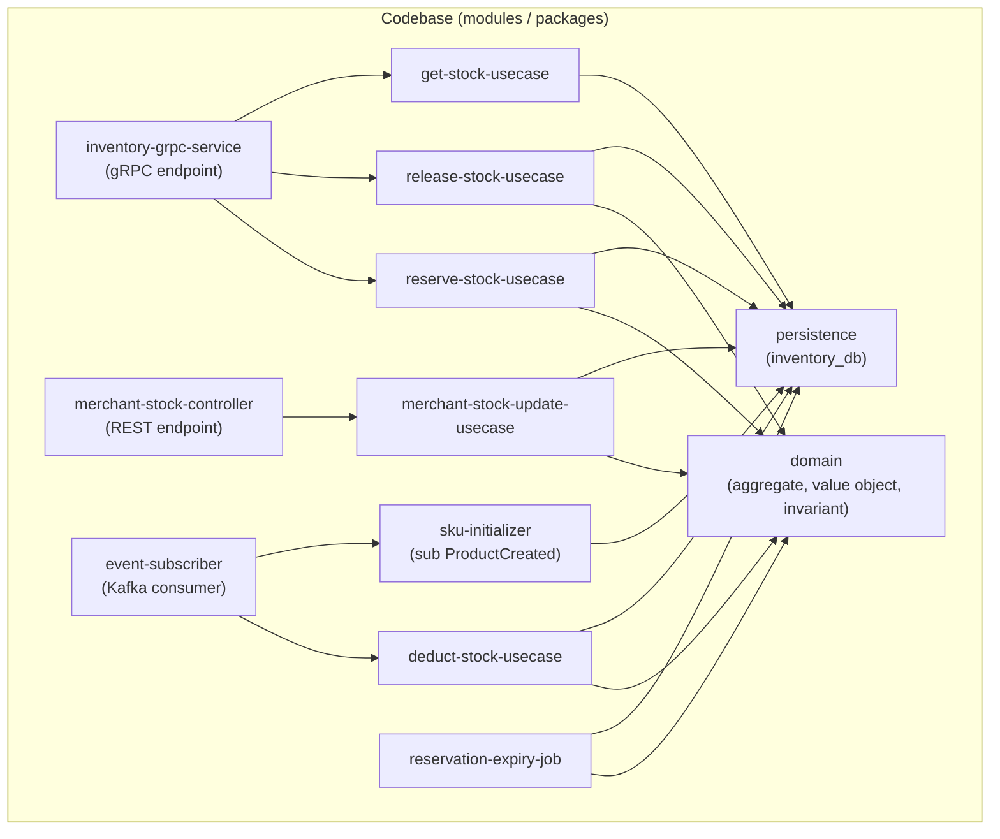

| Module | Trách nhiệm | Không được thực hiện |
|--------|-------------|---------------------|
| `inventory-grpc-service` | Kết thúc gRPC `ReserveStock` / `ReleaseStock` / `GetStockLevel`; verify service identity (mTLS); validate request; điều phối tới use-case | Chứa luật nghiệp vụ; persist trực tiếp; biết Kafka/REST |
| `merchant-stock-controller` | Kết thúc REST `PUT /v1/merchant/stock/{sku}`; extract JWT claims (`merchantId`); validate request; điều phối tới use-case | Chứa luật nghiệp vụ; persist trực tiếp; biết gRPC/Kafka |
| `reserve-stock-usecase` | **Atomic check-and-decrement**: `available -= qty, reserved += qty` IFF `available >= qty`; tạo `reservation(HELD, expires_at)`; idempotent theo `order_ref + sku`. **Module quan trọng nhất** — sai ở đây = oversell | Release/deduct; biết Kafka; gọi service khác |
| `release-stock-usecase` | Nhả reservation: `available += qty, reserved -= qty, reservation=RELEASED`. No-op nếu đã `CONSUMED` hoặc đã `RELEASED` (idempotent). Validate trạng thái chỉ `HELD → RELEASED` | Reserve; deduct; persist trực tiếp; biết Kafka |
| `deduct-stock-usecase` | Trừ kho vĩnh viễn: `reserved -= qty, reservation=CONSUMED`. Idempotent theo `event_id` (bảng `processed_events`). Validate trạng thái chỉ `HELD → CONSUMED` | Reserve; release; biết REST; gọi service khác |
| `get-stock-usecase` | Đọc `available` cho SKU. Read-only, không lock | Sửa stock; biết Kafka |
| `merchant-stock-update-usecase` | Merchant set `available` cho SKU **của mình**. Validate: `merchantId == stock.merchant_id` (tenant scope); `qty >= 0`; cập nhật với optimistic lock (`version`) | Reserve/release/deduct; biết gRPC/Kafka; chứa logic checkout |
| `sku-initializer` | Consume `ProductCreated`; UPSERT `stock(sku, available=0, reserved=0)`. Idempotent theo `sku` (PK) | Chứa luật tồn kho; reserve/release; biết REST/gRPC |
| `reservation-expiry-job` | Chạy định kỳ: tìm `reservations WHERE status=HELD AND expires_at < NOW()`; gọi `release-stock-usecase` cho từng reservation hết hạn. Batch processing | Chứa luật nghiệp vụ ngoài expiry; biết gRPC/REST/Kafka |
| `domain` | `Stock` aggregate root + `Reservation` entity; cưỡng chế invariant (§4.2): không oversell, status machine, balance invariant, tenant scope | Biết DB/gRPC/Kafka/REST; làm I/O; phụ thuộc module khác |
| `persistence` | Repository cho `stock`/`reservations`/`processed_events`; cưỡng chế UNIQUE `sku`, optimistic lock `version`, `available >= 0` CHECK constraint; transaction atomic | Chứa luật nghiệp vụ/invariant (ở `domain`); gọi gRPC/Kafka/REST |
| `event-subscriber` | Consume `ProductCreated` + `OrderCompleted` từ Kafka; dispatch tới `sku-initializer` / `deduct-stock-usecase`; commit offset sau xử lý thành công | Chứa luật nghiệp vụ; persist trực tiếp; gọi gRPC |

**Behavior notes:**

> **BN-1 · Atomic reserve (reserve-stock-usecase + persistence):** Reserve sử dụng **single UPDATE statement** với điều kiện `WHERE available >= :qty` — nếu 0 rows affected → hết hàng → trả FAIL. Đây là cơ chế chống oversell duy nhất, không dựa vào application-level check (race condition). Optimistic lock `version` đảm bảo concurrent UPDATE không silent overwrite. Toàn bộ reserve (UPDATE stock + INSERT reservation) trong **một transaction**.

> **BN-2 · Reservation lifecycle (domain):** Reservation có 3 trạng thái terminal: `HELD → RELEASED` (checkout fail / expiry) hoặc `HELD → CONSUMED` (OrderCompleted). Một khi `RELEASED` hoặc `CONSUMED` → bất biến, không quay lại. Release trên reservation đã `CONSUMED` = no-op (không nhả stock đã bán). Release trên reservation đã `RELEASED` = no-op (idempotent).

> **BN-3 · Stock balance invariant:** Tại mọi thời điểm: `available + reserved` phải khớp tổng stock vật lý (= initial stock + merchant updates − deducted). Fitness function kiểm định kỳ; lệch → P1 alert + freeze reserve.

## 3.2 C&C view (cấu trúc runtime)

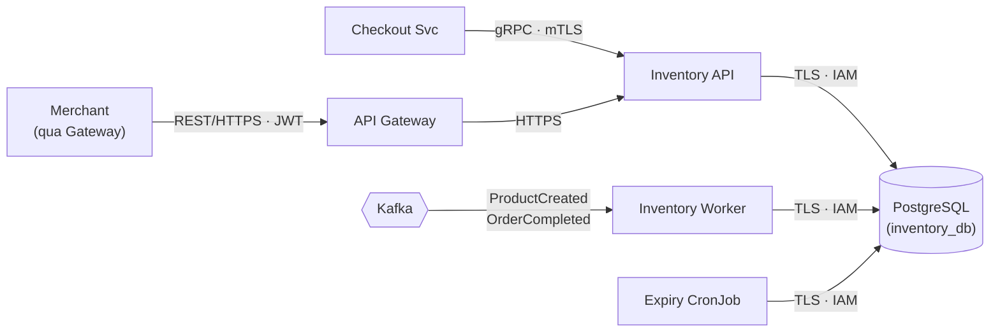

**Connector catalog (zero-trust):**

| Connector | From → To | Protocol | Authn / Authz |
|-----------|-----------|----------|---------------|
| reserve/release/get | Checkout Svc → Inventory API | gRPC | mTLS (SVID); scope `inventory:reserve`, `inventory:release`, `inventory:read` |
| merchant-stock | Gateway → Inventory API | HTTPS | JWT (RS256) forwarded; scope `inventory:write:stock`; tenant scope `merchantId` |
| state-rw | Inventory API / Worker / CronJob → PostgreSQL | TLS (JDBC) | IAM-auth; role least-priv per component |
| event-sub | Kafka → Inventory Worker | Kafka protocol | SASL/mTLS; consumer group `inventory-worker` |

**View-to-view mapping (module ↦ runtime component):**

| Module | Nằm trong runtime component |
|--------|----------------------------|
| `inventory-grpc-service`, `merchant-stock-controller`, `reserve-stock-usecase`, `release-stock-usecase`, `get-stock-usecase`, `merchant-stock-update-usecase` | Inventory API |
| `event-subscriber`, `deduct-stock-usecase`, `sku-initializer` | Inventory Worker |
| `reservation-expiry-job` | Expiry CronJob |
| `domain`, `persistence` | Inventory API + Worker + CronJob (dùng chung) |

> Inventory có **3 runtime component**: Inventory API (gRPC + REST), Inventory Worker (Kafka consumer), Expiry CronJob. Scale độc lập: reserve traffic spike → HPA Inventory API; deduct lag → scale Worker; expiry chạy đơn instance (leader election hoặc single replica).

## 3.3 Deployment view

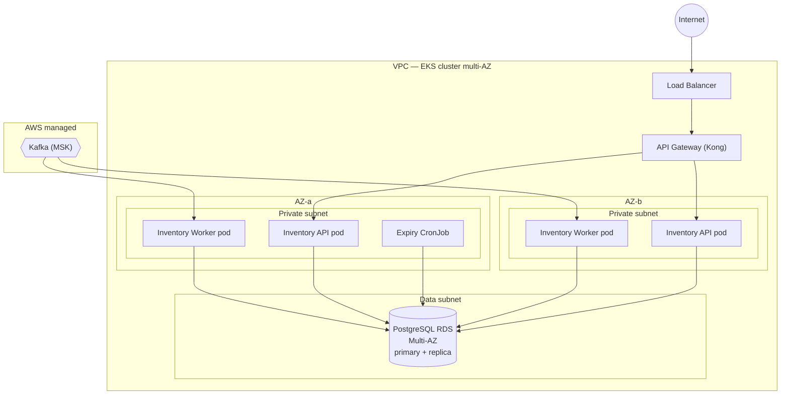

**Thực thi zero-trust ở tầng deploy:**

- **Không egress ra Internet** — Inventory không gọi external provider (khác Payment/Checkout). NetworkPolicy default-deny; chỉ mở GW→Inventory API, Inventory→PostgreSQL, Inventory→Kafka (VPC endpoint).
- Workload identity qua IRSA — **mỗi component có ServiceAccount + IAM role riêng**:
  - **API:** read/write `stock`, `reservations`; **không** write `processed_events` (việc của Worker)
  - **Worker:** read/write `stock`, `reservations`, `processed_events`; **không** expose gRPC/REST
  - **CronJob:** read/write `stock`, `reservations` (nhả expiry); **không** write `processed_events`; **không** expose gRPC/REST
- PostgreSQL Multi-AZ + automated failover (Tier 2, RPO < 1h).
- Secret (DB creds) trong Secrets Manager, rotate tự động; inject runtime — không bake vào image.
- **Expiry CronJob:** single replica hoặc leader election để tránh duplicate release. Nếu nhiều replica → idempotent release (§BN-2) bảo vệ.

---

# 4. Interfaces & data

> **Nguồn sự thật:** contract đầy đủ ở **proto file** + **OpenAPI spec**. Dưới đây chỉ giữ ngữ nghĩa quan trọng.

## 4.1 API

### 4.1.1 `Inventory.ReserveStock` (gRPC, mTLS)

```protobuf
// Request
message ReserveStockRequest {
  string order_ref = 1;                      // idempotency key (từ Checkout saga)
  repeated ReserveItem items = 2;            // max 50 items
}
message ReserveItem {
  string sku = 1;
  int32 qty = 2;                             // > 0
}

// Response
message ReserveStockResponse {
  string reservation_id = 1;                 // UUID, dùng cho ReleaseStock
  repeated ReserveResult results = 2;
  bool all_reserved = 3;                     // true nếu tất cả OK
}
message ReserveResult {
  string sku = 1;
  ReserveStatus status = 2;                  // OK | INSUFFICIENT_STOCK
  int32 available = 3;                       // available còn lại (sau reserve hoặc hiện tại nếu fail)
}
```

### 4.1.2 `Inventory.ReleaseStock` (gRPC, mTLS)

```protobuf
// Request
message ReleaseStockRequest {
  string reservation_id = 1;
}

// Response
message ReleaseStockResponse {
  bool success = 1;                          // true kể cả đã released trước đó (idempotent)
}
```

### 4.1.3 `Inventory.GetStockLevel` (gRPC, mTLS)

```protobuf
// Request
message GetStockLevelRequest {
  repeated string skus = 1;                  // max 100
}

// Response
message GetStockLevelResponse {
  repeated StockLevel levels = 1;
}
message StockLevel {
  string sku = 1;
  int32 available = 2;
  int32 reserved = 3;
}
```

### 4.1.4 `PUT /v1/merchant/stock/{sku}` (REST, JWT)

```json
// Request (Merchant)
{
  "available": 500                            // >= 0, đơn vị integer
}

// 200 OK
{
  "sku": "string",
  "available": 500,
  "reserved": 10,
  "version": 42,
  "updatedAt": "RFC3339"
}
```

**Mã lỗi:**

| Code | Khi nào |
|------|---------|
| `400` | Sai schema / `qty` ≤ 0 / `items` rỗng / `available` < 0 |
| `401 / 403` | JWT không hợp lệ; Merchant cố sửa stock SKU Merchant khác; service identity không có scope |
| `404` | SKU không tồn tại |
| `409` | Optimistic lock conflict — `version` mismatch (Merchant cập nhật stock đồng thời); retry client-side |
| `422` | Reserve: một hoặc nhiều SKU hết hàng — trả chi tiết từng SKU (INSUFFICIENT_STOCK) |
| `503` | DB unavailable |

**Authz model:**

| Scope | Cho phép | Ràng buộc |
|-------|---------|-----------|
| `inventory:reserve` | ReserveStock | Chỉ Checkout Svc (service identity mTLS) |
| `inventory:release` | ReleaseStock | Chỉ Checkout Svc (service identity mTLS) |
| `inventory:read` | GetStockLevel | Service nội bộ (Checkout, Storefront) |
| `inventory:write:stock` | PUT merchant stock | Chỉ Merchant (JWT); chỉ SKU `merchant_id == JWT.merchantId` |

- **Tenant scope enforcement (Merchant stock):** `PUT /v1/merchant/stock/{sku}` kiểm `stock.merchant_id == JWT.merchantId`. Merchant A **không** sửa stock Merchant B. Kiểm tại Gateway (PEP) + tại service (persistence query).
- **Reserve idempotency:** cùng `order_ref + sku` → trả kết quả cũ, không reserve lần 2. DB UNIQUE constraint `(order_ref, sku)` trên `reservations` là thẩm quyền.
- **Release safety:** release trên reservation `CONSUMED` = no-op (không nhả stock đã bán). Release trên `RELEASED` = no-op (idempotent).
- **Deduct idempotency:** `event_id` UNIQUE trong `processed_events` — OrderCompleted trùng = no-op.

## 4.2 Domain model

> Inventory có 1 aggregate: `Stock` (bao gồm Reservations). Aggregate nhỏ nhưng **invariant cực kỳ quan trọng** — oversell = thiệt hại nghiệp vụ.

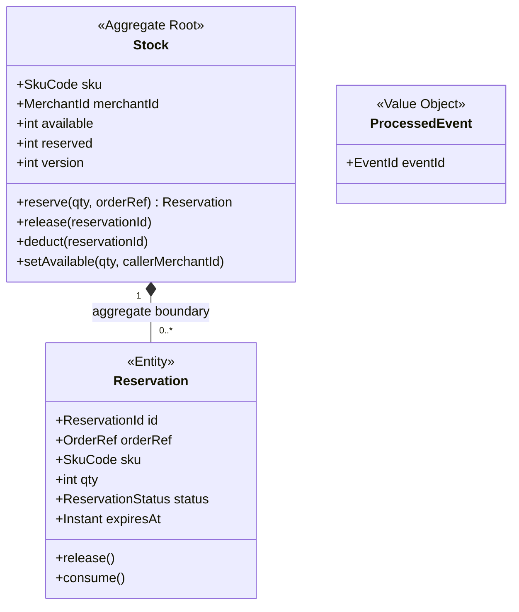

**Invariant:**

1. **KHÔNG OVERSELL:** `available` không bao giờ < 0 — cưỡng chế bằng `CHECK(available >= 0)` ở DB + `WHERE available >= :qty` trong atomic UPDATE. Vi phạm = bug P0.
2. **Balance invariant:** `available + reserved` phải khớp tổng stock vật lý. Fitness function kiểm định kỳ; lệch → P1 alert + freeze reserve.
3. **ReservationStatus tiến một chiều:** `HELD → (RELEASED | CONSUMED)`; terminal bất biến. Không quay lại `HELD`.
4. **Release trên CONSUMED = no-op** — bất biến cốt lõi. Release **không bao giờ** nhả stock đã bán (đã CONSUMED). Vi phạm = oversell ngược (stock ảo).
5. **Optimistic lock:** mọi UPDATE stock kiểm `version = :expected_version`; mismatch → retry.
6. **Reserve idempotent:** cùng `order_ref + sku` → trả reservation cũ, không reserve thêm.
7. **Deduct idempotent:** cùng `event_id` → skip, không trừ kho lần 2.
8. **Tenant immutable:** `merchantId` trên Stock **không thể thay đổi** sau khi tạo (init từ ProductCreated).

## 4.3 Data model — ERD

```mermaid
erDiagram
  STOCK ||--o{ RESERVATION : "has"

  STOCK {
    string sku PK "UNIQUE toàn hệ thống"
    string merchant_id IDX "tenant scope"
    int available "CHECK >= 0"
    int reserved "CHECK >= 0"
    int version "optimistic lock"
    timestamp created_at
    timestamp updated_at
  }

  RESERVATION {
    ULID id PK
    string order_ref IDX
    string sku FK
    int qty "CHECK > 0"
    string status "HELD|RELEASED|CONSUMED"
    timestamp expires_at IDX "TTL, null khi RELEASED/CONSUMED"
    timestamp created_at
    timestamp updated_at
  }

  PROCESSED_EVENT {
    string event_id PK "idempotency cho deduct/init"
  }
```

**UNIQUE constraints & indexes:**

```sql
-- Chống reserve trùng (idempotency)
ALTER TABLE reservations ADD CONSTRAINT uq_reservation_order_sku
  UNIQUE (order_ref, sku);

-- Chống oversell (DB-level safety net)
ALTER TABLE stock ADD CONSTRAINT chk_available_non_negative
  CHECK (available >= 0);
ALTER TABLE stock ADD CONSTRAINT chk_reserved_non_negative
  CHECK (reserved >= 0);

-- Expiry job performance
CREATE INDEX idx_reservations_expiry
  ON reservations (expires_at) WHERE status = 'HELD';

-- Tenant scope performance
CREATE INDEX idx_stock_merchant
  ON stock (merchant_id);
```

**Nghĩa cột load-bearing:**

| Cột | Ý nghĩa |
|-----|---------|
| `sku` (PK) | SKU code từ Catalog — UNIQUE toàn hệ thống; khóa chính cho mọi thao tác stock |
| `merchant_id` (IDX) | Tenant scope — Merchant chỉ cập nhật stock SKU của mình |
| `available` (CHECK ≥ 0) | Số lượng còn bán được. DB CHECK constraint là **lớp bảo vệ cuối cùng** chống oversell |
| `reserved` (CHECK ≥ 0) | Số lượng đang giữ chỗ (chờ checkout hoàn tất hoặc hết TTL) |
| `version` | Optimistic lock — concurrent UPDATE không silent overwrite |
| `order_ref + sku` (UK) | Idempotency key cho reserve — cùng order_ref + sku không reserve lần 2 |
| `expires_at` (IDX, partial) | TTL reservation; partial index (`WHERE status = 'HELD'`) cho expiry job hiệu quả |
| `event_id` (PK) | Idempotency cho deduct — OrderCompleted trùng không trừ kho lần 2 |

**Xử lý theo data class:**

- **L2 (stock quantities, SKU code):** mã hóa at-rest (RDS encryption). Không PII. Retention: vĩnh viễn cho `stock` (active SKU); `reservations` giữ 90 ngày sau terminal state rồi archive; `processed_events` giữ 30 ngày rồi purge.
- **Không có L3/L4** — Inventory không chứa dữ liệu tài chính hay PII.

## 4.4 Config & tunables

| Tham số | Khởi điểm | Ghi chú |
|---------|-----------|---------|
| `inventory.reserve_ttl_min` | 15 | TTL reservation — **phải khớp** `checkout.reserve_ttl_min` |
| `inventory.expiry_job_interval_s` | 60 | Chu kỳ expiry job nhả reservation hết hạn |
| `inventory.expiry_job_batch_size` | 100 | Batch size mỗi lần expiry job xử lý |
| `inventory.reserve_max_items` | 50 | Max items per ReserveStock request |
| `inventory.getstock_max_skus` | 100 | Max SKUs per GetStockLevel request |
| `inventory.optimistic_lock_retry_max` | 3 | Max retry khi optimistic lock conflict (internal) |
| `inventory.balance_check_interval_min` | 30 | Fitness function kiểm stock balance |
| `inventory.rate_limit_merchant_stock` | 30 req/60s | Per-merchant stock update rate limit |
| `inventory.feature_flag` | `inventory.reserve_v2` | Feature flag cho reserve logic changes |

**Cảnh báo cấu hình:** `inventory.reserve_ttl_min` **phải luôn khớp** `checkout.reserve_ttl_min`. Nếu lệch: TTL Inventory < Checkout → stock nhả trước khi checkout xong → oversell risk. TTL Inventory > Checkout → stock bị giữ sau khi checkout đã fail → stock ảo. Quản lý bằng shared config hoặc config-sync check.

## 4.5 Personal data handling

> Inventory **không chứa PII** — chỉ có SKU code, số lượng, merchant_id.

**Data inventory:**

| Data element | Class | Nguồn | Lưu ở đâu | Mục đích | Retention | Rời service đi đâu |
|-------------|-------|-------|-----------|---------|-----------|-------------------|
| SKU code | L2 | Catalog (ProductCreated) | PG | Khóa chính stock | Vĩnh viễn (active) | — |
| `merchant_id` | L2 | Catalog (ProductCreated) | PG | Tenant scope | Theo SKU | — |
| Stock quantities | L2 | Reserve/release/deduct/merchant | PG | Tồn kho | Vĩnh viễn | — |
| `order_ref` | L2 | Checkout (ReserveStock) | PG (reservations) | Liên kết reservation ↔ checkout | 90 ngày | — |
| `event_id` | L1 | Kafka (OrderCompleted) | PG (processed_events) | Idempotency | 30 ngày | — |

**Delta privacy:**

- **Không PII, không L3/L4:** Inventory là context đơn giản nhất về mặt privacy.
- **DSAR:** không applicable (không chứa dữ liệu cá nhân Buyer/Merchant ngoài `merchant_id` identifier).
- **Rủi ro chính không phải privacy mà là TÍNH ĐÚNG ĐẮN:** oversell = thiệt hại nghiệp vụ, không phải data breach.

---

# 5. Key flows

## 5.1 Reserve Stock (Checkout saga — bước reserve)

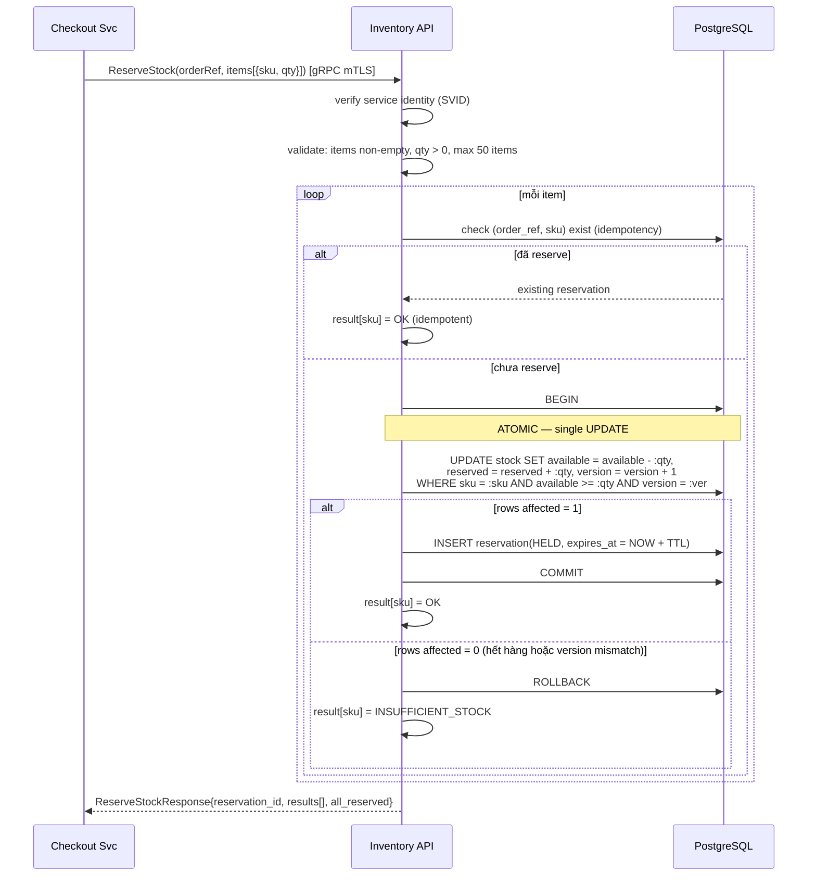

## 5.2 Release Stock (Checkout fail / saga compensate)

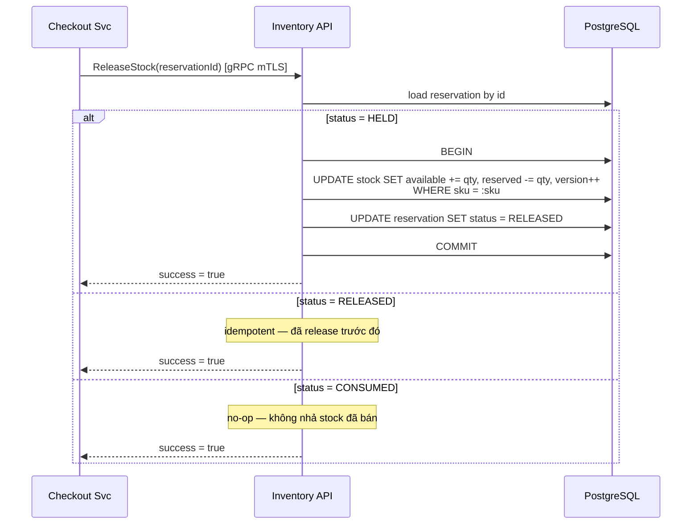

## 5.3 Deduct Stock (OrderCompleted)

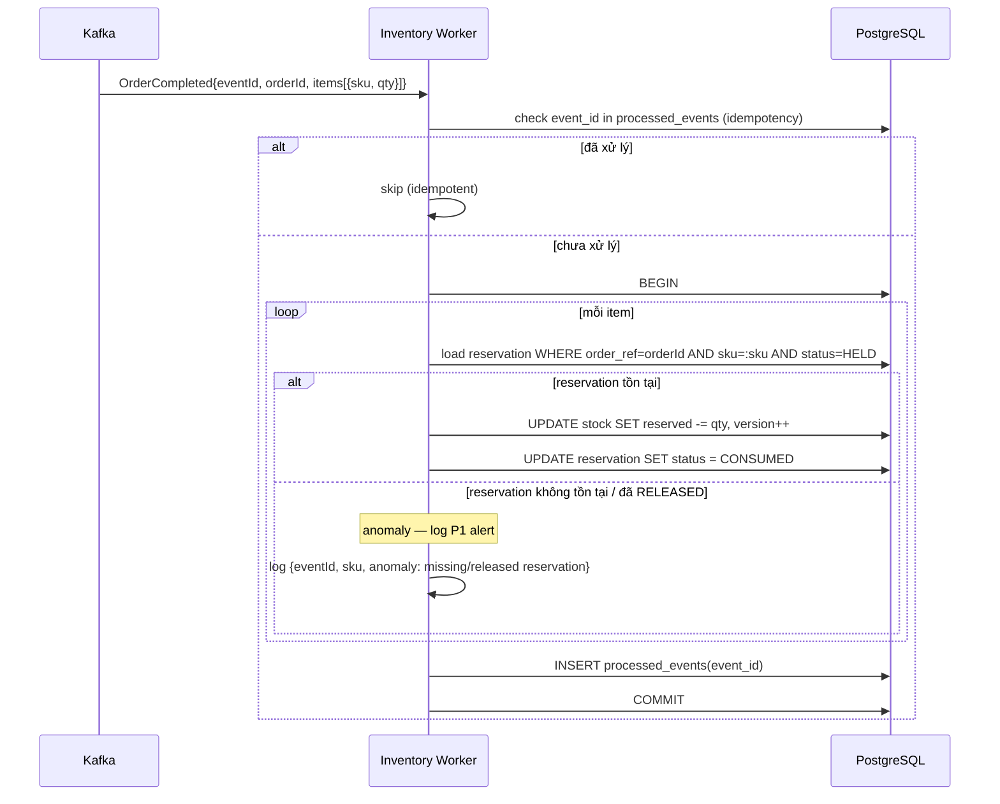

## 5.4 Init SKU (ProductCreated)

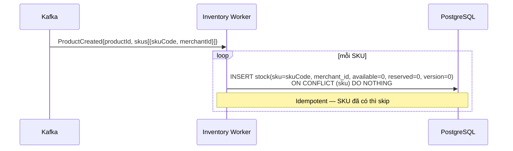

## 5.5 Reservation Expiry Job

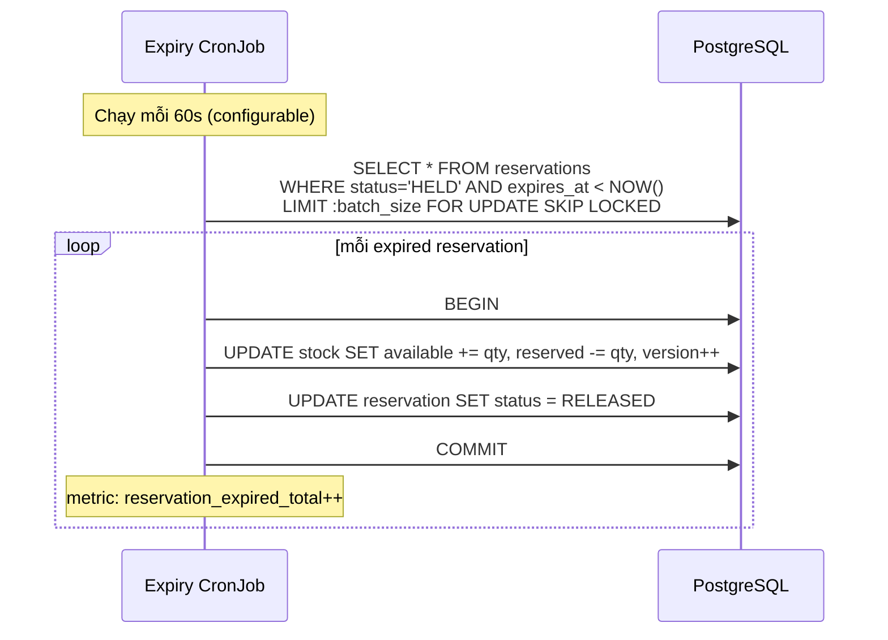

## 5.6 Merchant cập nhật stock

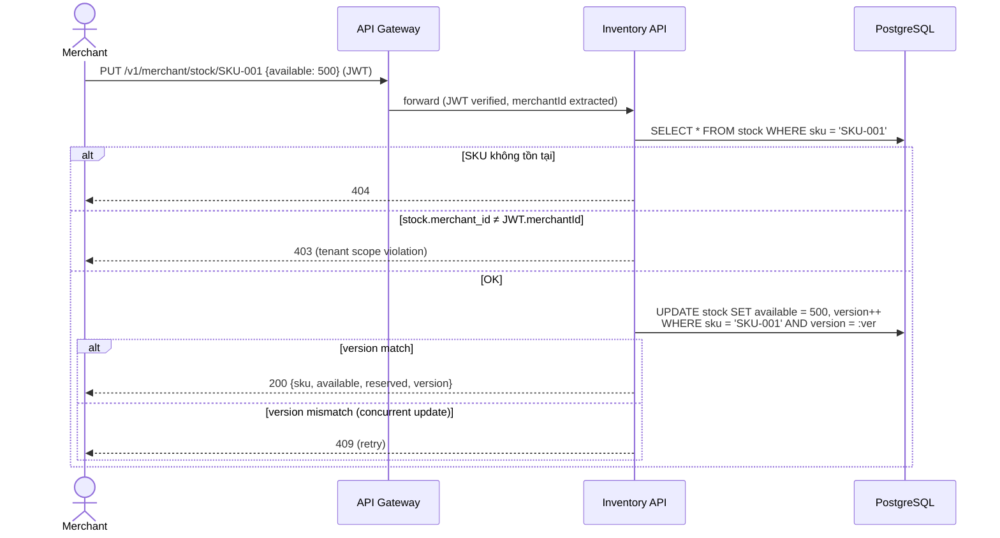

## 5.7 Concurrent reserve — chống oversell

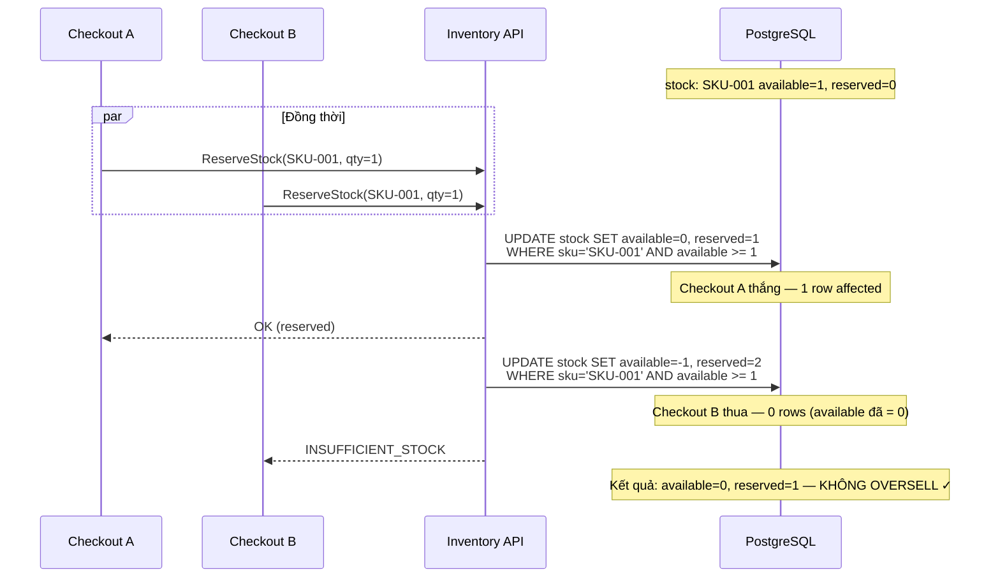

---

# 6. Operations & Resilience

> DR cấp platform xem [SDD-MKTPLACE-CORE-v1.0](https://vin3s.atlassian.net/wiki/spaces/VARW/pages/2826666048) — dưới đây chỉ delta của component.

**Backup & Recovery (delta — Tier 2):**

- **PostgreSQL** (`inventory_db` — L2): Multi-AZ + automated failover; PITR với RPO < 1h; test-restore monthly. Source of truth tồn kho — mất DB = mất stock data.
- **Kafka events:** dựa vào MSK durability; `ProductCreated` + `OrderCompleted` có thể replay từ offset nếu cần (idempotent consumer).
- **Retention:** `stock` vĩnh viễn; `reservations` archive sau 90 ngày; `processed_events` purge sau 30 ngày.

**CI/CD (delta — Tier 2, cẩn trọng vì chống oversell):**

- Deploy strategy: **canary** (5% → 25% → 100%) — logic reserve là đường nóng.
- DB migration backward-compatible (expand/contract); thêm `CHECK(available >= 0)` phải test kỹ trên staging trước.
- Theo dõi trước rollout tiếp: `oversell_attempt_total` (phải = 0), `reservation_expired_total`, `stock_balance_mismatch`.
- Rollback plan: revert code; stock data an toàn vì mọi thao tác idempotent. Nếu oversell xảy ra → freeze reserve + manual reconciliation.
- **Gate:** thay đổi logic reserve/deduct cần **người review** (không chỉ CI).

**Degraded mode:**

- **Kafka lag / down:** `ProductCreated` / `OrderCompleted` chậm → init SKU chậm, deduct chậm. **Reserve vẫn hoạt động** (Checkout không bị block). Stock tạm lệch (reserved cao hơn thực tế) cho đến khi deduct chạy.
- **DB down:** toàn bộ reserve/release/deduct/stock update unavailable → Checkout fail 503. Đây là single point of failure có chủ ý — stock consistency yêu cầu single source of truth.
- **Expiry CronJob down:** reservation hết hạn không được nhả → stock bị giữ lâu hơn → available thấp giả. Không oversell nhưng undersell tạm thời. Alert nếu CronJob miss > 2 chu kỳ.

---

# 7. Decisions & cross-cutting deltas (ADR-style)

**ADR-1 — Atomic UPDATE với `WHERE available >= qty` (không application-level check).**
Application-level: `SELECT available → check → UPDATE` có race condition giữa check và update → oversell. Single UPDATE statement với condition trong WHERE là atomic ở DB level — chỉ 1 transaction thắng. _Hệ quả:_ phụ thuộc DB row-level lock; cần `CHECK(available >= 0)` làm safety net; không thể dùng eventually-consistent store cho stock.

**ADR-2 — Optimistic locking (`version` column) thay vì pessimistic lock.**
Pessimistic lock (`SELECT FOR UPDATE`) giữ lock lâu, giảm throughput. Optimistic lock: update kèm `AND version = :expected` — nếu mismatch → retry. Phù hợp vì contention thấp–trung bình (mỗi SKU ít khi bị reserve đồng thời nhiều). _Hệ quả:_ client cần retry logic khi 409.

**ADR-3 — Reservation có TTL + Expiry Job (không dựa vào Checkout callback).**
Checkout có thể crash giữa chừng — nếu chỉ dựa vào Release callback → stock bị giữ vĩnh viễn. TTL + Expiry Job đảm bảo stock được nhả. _Hệ quả:_ TTL phải khớp `checkout.reserve_ttl_min`; Expiry Job phải reliable (alert nếu miss).

**ADR-4 — Deduct idempotent theo `event_id` (bảng `processed_events`).**
Kafka at-least-once → `OrderCompleted` có thể đến nhiều lần. `processed_events` đảm bảo chỉ trừ kho 1 lần. _Hệ quả:_ cần purge `processed_events` định kỳ (30 ngày — xem §4.3).

**ADR-5 — SKU init = 0 (không tự có stock khi ProductCreated).**
Merchant phải chủ động cập nhật stock thực qua REST. Init = 0 an toàn: không bán hàng không có. _Hệ quả:_ UX cần nhắc Merchant cập nhật stock sau khi sản phẩm được approve.

**ADR-6 — 3 runtime component tách biệt (API / Worker / CronJob).**
Reserve (gRPC, latency-critical) tách khỏi deduct (Kafka consumer, throughput) tách khỏi expiry (cron, batch). Scale + failure isolation độc lập. _Hệ quả:_ share `domain` + `persistence` module; CronJob cần leader election hoặc idempotent release.

**Cross-cutting deltas:**

- **Chống oversell (reliability, Tier 2 — đường nóng):** 3 lớp bảo vệ: (1) application logic `WHERE available >= qty`; (2) DB `CHECK(available >= 0)`; (3) fitness function kiểm `oversell_attempt_total == 0` + stock balance. Vi phạm bất kỳ lớp nào → P0/P1.
- **TTL sync warning:** `inventory.reserve_ttl_min` phải khớp `checkout.reserve_ttl_min`. Fitness function kiểm config sync.
- **Tenant scope enforcement:** `merchant_id` gắn vào mọi stock update; kiểm tại Gateway + service. Fitness function: "không có stock update cross-merchant".
- **Reliability/alert:** P0 — `oversell_attempt_total > 0`; P1 — stock balance mismatch, deduct anomaly (reservation missing/released); P2 — Expiry CronJob miss > 2 chu kỳ, Kafka consumer lag > 5 phút; P3 — reservation expired spike (Buyer bỏ checkout nhiều).
- **Observability:** metrics `reserve_total{result=OK|FAIL}`, `release_total`, `deduct_total`, `oversell_attempt_total` (phải = 0), `reservation_expired_total`, `stock_available_gauge{sku}`, `expiry_job_duration_ms`, `reserve_duration_ms{percentile}`; trace context propagate qua gRPC → Kafka → Worker.

**Zero-trust — anchor index:**

| Nguyên tắc (SAD) | Thực thi trong Tech Spec này |
|-------------------|------------------------------|
| Identity, không theo mạng | §3.2 connector catalog (mTLS/SVID cho gRPC; JWT cho REST; IAM cho DB) |
| Least privilege | §3.3 IRSA role riêng từng component; Worker không expose gRPC/REST; CronJob không write processed_events |
| Assume breach | §3.3 NetworkPolicy default-deny; tenant scope enforcement at service level |
| No long-lived creds | §3.3 Secrets Manager + rotate; IRSA auto-rotate |
| Protect data | §4.3 encryption at-rest (RDS); CHECK constraints (data integrity > confidentiality cho Inventory) |

**Trust boundary & threat seed:**

| Threat (STRIDE) | Bề mặt | Đối ứng |
|----------------|--------|---------|
| **S**poofing | Merchant giả danh Merchant khác sửa stock; service giả danh Checkout gọi Reserve | JWT tenant scope + mTLS SVID (§4.1) |
| **T**ampering | Sửa available/reserved trực tiếp (bypass API); concurrent race condition | DB CHECK constraint + atomic UPDATE + optimistic lock (§4.2 ADR-1, ADR-2) |
| **R**epudiation | Phủ nhận đã cập nhật stock | `updated_at` + audit log + Merchant JWT identity |
| **I**nfo disclosure | Xem stock SKU Merchant khác | Tenant scope enforcement; GetStockLevel chỉ cho service nội bộ (§4.1) |
| **D**oS | Flood ReserveStock; flood Merchant stock update | Rate limit per-merchant; gRPC mTLS limit service identity (§4.4) |
| **E**levation | Merchant trigger reserve/release (Checkout scope) | Scope tách biệt: Merchant chỉ có `inventory:write:stock`; reserve/release chỉ cho Checkout identity (§4.1) |

---

# 8. Test strategy

> Chống oversell là **yêu cầu test quan trọng nhất** — cần test concurrency nặng.

- **Unit** (`domain`): reservation state machine (`HELD → RELEASED | CONSUMED`; release trên CONSUMED = no-op); stock invariant (`available >= 0`); optimistic lock version increment; tenant scope validation — không cần DB.
- **Contract test:** gRPC proto `ReserveStock`/`ReleaseStock`/`GetStockLevel` contract với Checkout (consumer-driven); Kafka event schema `ProductCreated` contract với Catalog; `OrderCompleted` contract với Order.
- **Integration (reserve — CRITICAL):** single reserve thành công; reserve quá available → INSUFFICIENT_STOCK; reserve idempotent (cùng order_ref + sku → trả kết quả cũ).
- **Integration concurrency (CRITICAL):** **N concurrent reserves trên 1 SKU** (N > available) → chỉ available được thỏa, phần còn lại INSUFFICIENT_STOCK; `SUM(reserved) == original available`; `stock.available == 0`. Test này **bắt buộc** chạy trước mọi release.
- **Integration (release):** release HELD → stock restored; release RELEASED → no-op; release CONSUMED → no-op (KHÔNG nhả stock).
- **Integration (deduct):** OrderCompleted → reservation CONSUMED, reserved giảm; duplicate event_id → no-op; anomaly (reservation missing) → log P1 nhưng không crash.
- **Integration (expiry):** reservation hết TTL → Expiry Job nhả → available restored; đã CONSUMED trước expiry → no-op.
- **Integration (merchant stock update):** Merchant update stock mình → 200; Merchant update stock Merchant khác → 403; concurrent update → 409 (optimistic lock).
- **Failure-injection:** DB down → reserve 503; Kafka lag → deduct chậm nhưng reserve vẫn hoạt động; Expiry CronJob down → stock bị giữ lâu (undersell tạm, không oversell).

**Fitness function (bắt buộc):**

- **"Không bao giờ oversell dưới tải đồng thời"** — chạy test concurrency: 100 concurrent reserves trên SKU có available = 10 → exactly 10 succeed, 90 fail, `stock.available == 0`. Vi phạm → P0, block release.
- **"Stock balance khớp"** — chạy định kỳ: `available + reserved` khớp tổng (initial + merchant updates − consumed). Lệch → P1.
- **"TTL sync"** — config check: `inventory.reserve_ttl_min == checkout.reserve_ttl_min`. Lệch → P2.
- **"Tenant isolation"** — route audit; test Merchant A gọi PUT stock SKU Merchant B → 403.

**Acceptance criteria mẫu:**

- _Chống oversell:_ cho SKU available = 5 → khi 10 concurrent reserve(qty=1) → chỉ 5 thành công, 5 INSUFFICIENT_STOCK; available = 0, reserved = 5.
- _Reserve idempotent:_ cho 2 ReserveStock cùng order_ref + sku → chỉ 1 reservation tạo ra; lần 2 trả kết quả cũ, stock không giảm thêm.
- _Release safety:_ cho reservation CONSUMED → khi Release → no-op; available **không** tăng (stock đã bán).
- _Deduct idempotent:_ cho 2 OrderCompleted cùng event_id → chỉ trừ kho 1 lần; reserved giảm đúng qty.
- _Expiry nhả stock:_ cho reservation HELD quá TTL → khi Expiry Job chạy → reservation = RELEASED, available tăng đúng qty.
- _Tenant scope:_ cho Merchant A PUT stock SKU Merchant B → 403, stock không thay đổi.

---

# 9. Open questions

1. **Stock event publish (v1.0 không publish):** nên publish `StockUpdated` khi available thay đổi không? Use case: storefront hiển thị "sắp hết hàng" realtime; analytics. Nếu có → thêm Kafka producer + outbox. Tương lai.
2. **Low-stock alert cho Merchant:** khi `available < threshold` → thông báo Merchant bổ sung hàng? Nếu có → thêm config `low_stock_threshold` per SKU/Merchant + integrate Notification Svc. Tương lai.
3. **Bulk stock import (Merchant):** Merchant có hàng nghìn SKU → cần API bulk update (CSV/batch) thay vì PUT từng SKU? Nếu có → thêm `POST /v1/merchant/stock/bulk` + async processing.
4. **Stock audit log:** cần lưu **lịch sử** mọi thay đổi stock (ai thay đổi, từ bao nhiêu → bao nhiêu, khi nào) không? Hiện tại chỉ có `version` + `updated_at`, không có changelog. Nếu cần → thêm bảng `stock_audit_log` hoặc CDC.
5. **Multi-warehouse / location:** v1.0 giả định single pool per SKU. Nếu mở rộng multi-warehouse → cần `location_id` trên `stock`, reserve per location. Ảnh hưởng lớn thiết kế.
6. **Reserve partial (partial fulfillment):** hiện tại reserve all-or-nothing per SKU. Nếu cho phép partial (reserve 3/5) → thay đổi response + Checkout logic. Cần chốt.
7. **Expiry CronJob leader election:** chạy single replica hay multi + leader election? Multi + idempotent release an toàn nhưng tốn resource. Single replica → risk miss nếu pod die.
8. **Reserve timeout vs TTL:** nếu Checkout gọi Reserve xong nhưng không kịp gọi Payment trước TTL → stock nhả → Buyer đã pay nhưng stock hết → cần reconciliation flow (Checkout × Inventory × Payment). Cần chốt flow recovery.