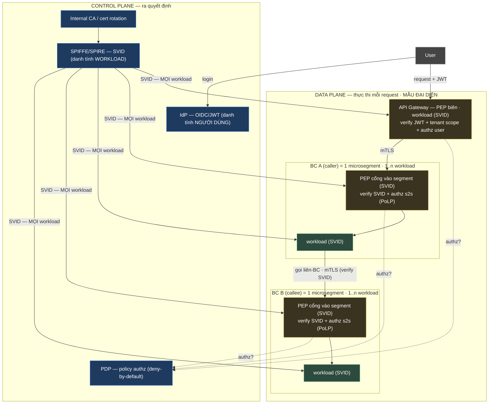

# BASELINE — BẢO MẬT (Org Security Baseline)

| Thông tin | Giá trị |
| --- | --- |
| Mã | `STD-SEC-v1.0` |
| Loại | **Baseline nội dung** — default tổ chức (dùng-lại cho mọi hệ thống) |
| Neo chuẩn | NIST SP 800-207 (Zero-Trust) · SPIFFE/SPIRE · OIDC/OAuth2 · ISO/IEC 27001 |
| Quan hệ | AD/Tech Spec **conform** baseline này + ghi **delta**; enforce tự động → AaC / `ea-governance/archrules` |

> **Cách dùng:** AD mục "Kiến trúc bảo mật" **không lặp lại** mô hình dưới đây — chỉ ghi *"Conform `STD-SEC-v1.0`"* + **deviation** + **quyết định đặc thù hệ thống** (vd ranh giới microsegmentation, BC nào cô lập, role matrix). Đây là *cơ chế/chính sách mặc định*; literal IAM policy → Tech Spec/policy-as-code.

---

## 1. Nguyên tắc nền (Zero-Trust — NIST 800-207)

`deny-by-default` · `verify per-request` · `least privilege (PoLP)` · `assume breach` · **không tin theo vị trí mạng**. Mọi hệ thống mặc định áp; chỉ nới khi có ADR.

## 2. Ba kiểm tra độc lập mỗi request (đừng gộp)

1. **Xác thực người dùng** — OIDC + JWT (RS256); IdP phát token; access TTL ngắn, refresh dài.
2. **Xác thực workload** — SPIFFE/SPIRE cấp **SVID** cho *mọi* workload (gồm Gateway/PEP/sidecar); nền cho mTLS + authz s2s. Không service nào được tin chỉ vì nằm trong VPC.
3. **Phân quyền** — mô hình **PDP/PEP**: quyết định tập trung ở **PDP** (policy-as-code), thực thi ở **PEP** đặt **mọi ranh giới**, per-request, deny-by-default.

> **Lưu ý mô hình hóa:** PEP/SVID gắn với **workload**, không phải BC (1 BC có thể nhiều workload — R-E1). Gateway/PEP cũng là workload và nhận SVID.

## 3. Sơ đồ tham chiếu ZTA (mẫu đại diện — áp cho mọi BC/hop, R-D12)

## 4. Microsegmentation (R-A24) — khung lựa chọn

| Granularity | Mô tả | Đánh đổi |
| --- | --- | --- |
| **1 BC = 1 segment** (mặc định) | PEP ở cổng vào mỗi BC | Cân bằng isolation/overhead |
| **Gom nhóm** | Gộp BC chatty/cùng đội thành 1 segment | Ít PEP-hop, **blast radius lớn hơn** |
| **Per-workload (strict)** | Mỗi workload 1 segment | Isolation mạnh nhất, overhead cao nhất |

AD chọn granularity nào **phải nêu rõ + lý do**; đổi ranh giới = **gate review**.

## 5. Mã hóa (default)

- **In-transit:** TLS 1.3 ở biên ngoài; **mTLS** giữa mọi workload nội bộ (chứng chỉ = SVID, xoay tự động).
- **At-rest:** AES-256 (KMS/Vault); **PII & dữ liệu nhạy cảm tài chính → field-level encryption**.
- **Chứng từ bất biến:** Object storage + **Object Lock (WORM)** khi cần write-once (retention + legal-hold theo policy hệ thống).

## 6. PEP tại từng ranh giới (default)

| Ranh giới | PEP | Enforce |
| --- | --- | --- |
| Public (Internet → edge) | API Gateway | Verify JWT, tenant scope, rate limit, validation, WAF |
| Inter-service (cổng vào mỗi BC) | PEP gắn workload (sidecar) | mTLS (verify SVID) + authz s2s qua PDP (PoLP) |
| Outbound (bên thứ ba) | Egress policy | Secret từ Vault; egress allowlist chỉ tới đích cho phép |
| Inbound webhook | Gateway/handler | Verify chữ ký + allowlist IP + idempotency |

Bổ sung: CORS allowlist · CSRF cho state-changing · validate server-side (không tin client).

## 7. Invariant bảo mật chuẩn (enforce tự động → AaC)

- Mọi giao tiếp **xuyên microsegment** là mTLS (verify SVID), không plaintext.
- **Default-deny giữa các segment**; lateral movement chặn ở ranh giới (NetworkPolicy/mesh authz).
- Không lưu lượng nào **bypass PEP** cổng vào/ra segment.
- Authz s2s theo **PoLP** + PDP **deny-by-default**.
- Mọi route public có authn + **tenant scope**.
- Webhook luôn verify chữ ký + idempotency.
- Mọi workload tham gia mTLS có **SVID** (gồm Gateway/PEP), cert xoay tự động.
- Không secret hardcode.

## 8. Gate review chuẩn (cần người phán đoán)

Đổi luồng tiền · truy cập xuyên tenant · đổi policy chứng từ bất biến · **đổi ranh giới microsegmentation** · mỗi cột mốc nâng cấp ZTA. Hệ thống **thêm gate đặc thù** vào AD.

## 9. Target vs current (R-A10)

ZTA là hành trình nhiều giai đoạn. AD phải ghi **hiện trạng vs mục tiêu**; mỗi cột mốc ZTA = **1 ADR riêng**. Sơ đồ §3 là kiến trúc **mục tiêu**.

---

**Changelog:** v1.0 (2026-06-24) — tách từ AD-Marketplace-AiGen §6 thành baseline tổ chức.
