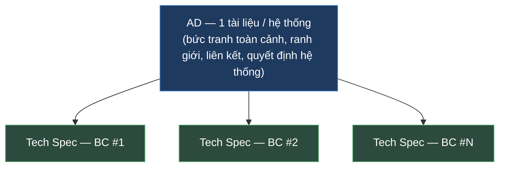
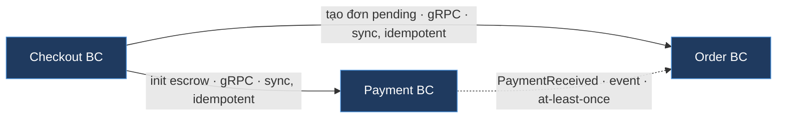
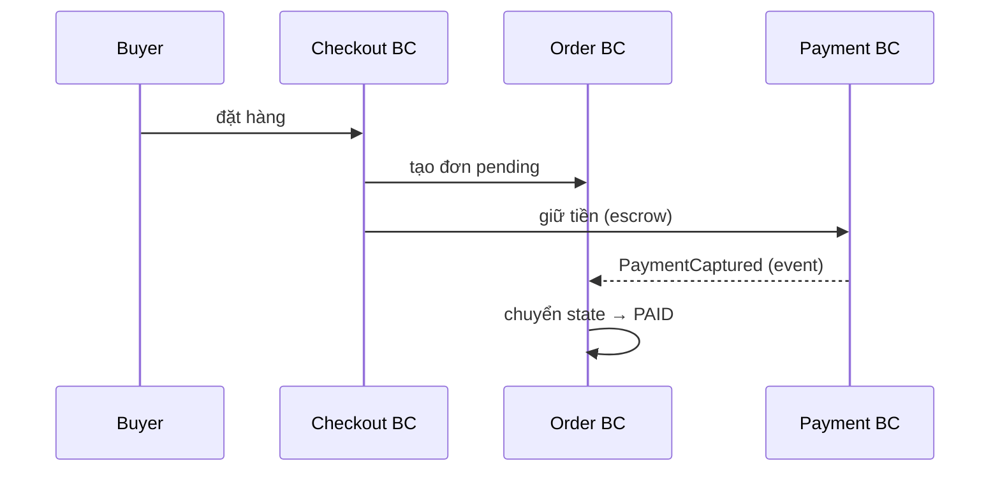
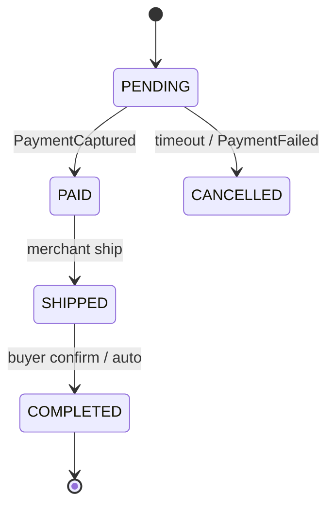
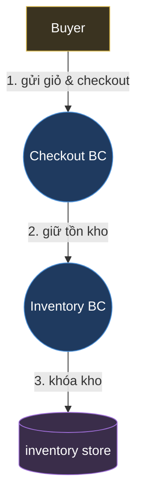

# QUY TẮC VIẾT TÀI LIỆU KIẾN TRÚC (AD) & TECH SPEC

| | |
| --- | --- |
| Mã | `STD-DOC-v1.15` |
| Trạng thái | Draft for review |
| Phạm vi | Tài liệu kiến trúc cấp hệ thống (**AD**) và tài liệu thiết kế chi tiết cấp bounded context (**Tech Spec**) |
| Neo chuẩn | ISO/IEC/IEEE 42010:2022 · arc42 · C4 model · ADR (Nygard/MADR) · DDD Context Mapping |
| Sơ đồ | **Mermaid** (mọi sơ đồ trong AD & Tech Spec) |
| Ngoài phạm vi | **Architecture-as-Code (AaC)** — sinh view từ model, fitness function, drift detection, pipeline. Sẽ chuẩn hóa ở tài liệu riêng sau. Tài liệu này chỉ chốt *thông tin gì cần thể hiện và thể hiện ở đâu*. |

> **Mục tiêu:** chuẩn hóa **cấu trúc** và **nội dung** của hai loại tài liệu — AD và Tech Spec — sao cho mỗi mẩu thông tin nằm đúng một chỗ, truy vết được, và bám các chuẩn quốc tế. Khi nội dung đã ổn định, việc chuyển sang AaC (sinh tự động, kiểm trong CI) là bước tách riêng về sau.

**Lịch sử thay đổi**

| Phiên bản | Thay đổi |
| --- | --- |
| v1.0 | Bản đầu. |
| v1.1 | (1) Structure view ở AD: **BC là hộp đục**, **không** decompose nội bộ (service/datastore/component) — chuyển quyền-sở-hữu-dữ-liệu sang mục Data architecture; cạnh mang **hợp đồng/đảm bảo giao tiếp**. (2) Bảng BC ở AD **không** liệt kê framework/runtime hay DB sở hữu từng BC. (3) Thêm **R-C9** làm rõ trục **binding vs indicative** áp cho *mọi view* (kể cả deployment), gỡ "mâu thuẫn" structure-không-tech / deployment-có-tech. |
| v1.2 | (1) Thêm **R-D6**: structure view (§6) & context (§4) nên có **vùng bao ranh giới hệ thống** (system boundary). (2) **§7 DDD Context Map → optional** (khuyến nghị cho team DDD); làm rõ ý nghĩa = *quan hệ cộng tác giữa team sở hữu BC* + *ngữ nghĩa tích hợp dữ liệu tại biên*. (3) Thêm **R-C11**: công nghệ binding phải ghi **theo cặp `năng lực (sản phẩm)`** — năng lực trước (cái "tại sao"), sản phẩm sau; cấm nêu sản phẩm trần trụi không kèm vai trò. |
| v1.3 | (1) Thêm **R-D7**: behavior/runtime flow → mặc định `sequenceDiagram`; flow rất đơn giản → prose, không ép vẽ. (2) Thêm **D.4 — chuẩn DFD** (Data Flow Diagram ở mức loại dữ liệu: 4 ký hiệu entity/process/datastore/flow đánh số) + dòng DFD trong D.1. (3) Thêm **R-D8 (DRY giữa các view)**: trust boundary + cơ chế enforce **sở hữu** bởi Security view (§11); Interfaces (§16) **không** vẽ lại — dùng bảng + trỏ §11. Sơ đồ ở §16 là optional. |
| v1.4 | Thêm **R-A23 (Data architecture)**: bảng §10 nêu **BC sở hữu loại dữ liệu gì** + **năng lực lưu trữ cần** ghi capability-first `năng lực (sản phẩm)` (R-C11); **bỏ** cột "BC → tên DB vật lý" (identity_db…) — mechanical, suy ra từ DB-per-context, là naming/IaC → Tech Spec; **bỏ** cột "Loại: `<sản phẩm>`" trần. |
| v1.5 | Thêm **R-D12 (pattern view)**: Security/ZTA (§11) & cross-cutting (§12) vẽ cơ chế trên **mẫu đại diện** + "áp cho mọi BC/hop", **không enumerate** mọi BC (tránh O(N²) clutter). Làm rõ §11: **đơn vị enforce = workload** (1 BC có nhiều workload, không phải sidecar=BC); **PEP ở mọi ranh giới** — biên *và* cổng vào mỗi BC (authz s2s, PoLP), không chỉ Gateway. |
| v1.6 | Làm rõ §11: **infra component (API Gateway, PEP/sidecar/ingress) cũng là workload** và **nhận SVID** — danh tính workload cấp cho *mọi* process tham gia mTLS, không chỉ service nghiệp vụ. (Trong mesh sidecar, PEP=sidecar giữ SVID & kết thúc mTLS.) |
| v1.7 | Thêm **R-A24 (microsegmentation)**: PEP đặt ở **cổng vào microsegment**; **mặc định 1 BC = 1 microsegment**, nhưng AD được phép chọn granularity khác (gom BC quan hệ chặt thành 1 segment, hoặc per-workload) và **phải tuyên bố** + nêu trade-off (blast radius vs overhead). Sơ đồ §11 vẽ ranh giới microsegment, không cứng = BC. |
| v1.8 | (1) Mở rộng **R-A24** thêm trục **realization flavor**: *per-workload mesh* (mọi workload có SVID, mTLS khắp nơi) vs *segment-gateway* (identity ở **ranh giới** segment qua **PEP ingress + egress**; workload nội bộ **không cần SVID** — vùng tin cậy trong segment). (2) Thêm **R-A25 (deployment đa nền tảng)**: hệ có thể trải on-prem/cloud/multi-cloud/nhiều account/region/cluster — deployment view **nhóm theo ranh giới hạ tầng** + vẽ liên kết xuyên ranh giới + nơi đặt trust boundary/residency/egress; literal (account-id/IP/ARN) → IaC. |
| v1.9 | Thêm **R-D13 (sơ đồ ngữ cảnh BC)**: Tech Spec §1 *được phép* (optional) vẽ **BC-context diagram** — BC ở giữa + actor/BC láng giềng, nhãn = ý định+protocol, **boundary-level** (không module nội bộ). Là **zoom tập trung** từ AD §2.2, không vẽ lại toàn hệ; trỏ AD §2.2 + dùng cùng nhãn (R-D8); bỏ qua nếu BC chỉ 1–2 láng giềng (R-D7). |
| v1.10 | Thêm **R-B1 (Module view lộ rõ kiến trúc nội bộ)**: §3.1 phải thể hiện **kiểu kiến trúc nội bộ + quy tắc phụ thuộc** (vd Hexagonal/Clean/Onion: domain ← application ← adapter; **ports & adapters**; dependency hướng **vào trong**; adapter *implements* ports.out — DIP) và **đặt tên theo convention dự án**. Khuyến nghị kèm **chữ ký ports.in/ports.out** (biên hexagon) ở mức signature. |
| v1.11 | Thêm **R-B2 (module hóa theo tính năng — trục dọc)**: §3.1 phải thể hiện **cả hai trục** — *ngang* (tầng, R-B1) **và** *dọc* (**package-by-feature / vertical slice**): mỗi slice cohesion cao, coupling thấp, cắt dọc qua các tầng. BC chỉ 1 feature → **nêu rõ**, không im lặng bỏ trục dọc. Thêm tính năng = thêm slice mới, không phình slice cũ. |
| v1.12 | **Truy vết NFR (lấp 2 lỗ hổng):** thêm **R-E5 (NFR satisfied-by)** — mỗi quality requirement phải nêu **cơ chế/tactic thiết kế hiện thực + neo §/ADR**, không chỉ target; và **R-E6 (truy vết NFR dọc AD↔Tech Spec)** — mỗi NFR gắn **kiểu quan hệ** {inherited / allocated / owned / cross-BC / local}, hai phía được phép có NFR **không ánh xạ** nhưng **phải đánh dấu**; NFR *allocated* cần **breakdown ngân sách** compose-check. Thêm **§13 Quality tree / NFR catalog** làm **chỉ mục có ID** (chi tiết vẫn ở mục nhà). Anti-pattern **G21/G22**; cập nhật checklist **H.1/H.2** & bảng ánh xạ chuẩn. _(Khái quát hóa pattern "anchor index" của Security đã có sẵn thành quy tắc chung cho mọi NFR.)_ |
| v1.13 | Thêm **R-E7 (Utility tree + Quality Attribute Scenario)**: §13 tổ chức NFR thành **utility tree** (ATAM) — *tiện ích → thuộc tính → scenario lá* + **ưu tiên (tầm quan trọng × độ khó)**; mỗi NFR ưu tiên cao có **scenario 6 phần** (Bass/Clements/Kazman) với *phản hồi* nối thẳng tactic (R-E5). Catalog (R-E6) = tập **lá** của cây. Thêm dòng D.1 (vẽ utility tree bằng `flowchart`), **G23**, checklist **H.1 #14 / H.2 #11**. |
| v1.14 | **Tập ADR phải có file thật, không chỉ index:** siết **R-F2** (thư mục `docs/design/adr/`, tên `ADR-XXXX-<slug>.md`, thêm trường **Decision Drivers** = NFR lái quyết định) + thêm **R-F6** (index ở AD §14/Tech Spec §7 **phải link tới file**; folder có README). Thêm **template ADR** (F.1), **G24**, checklist **H.1 #15**. Khép vòng truy vết *design → NFR* (bổ trợ R-E5). |
| v1.15 | **Chống lặp target — §13 tổ chức theo NFR, không bucket cố định:** thêm bullet R-E6 (*target một chỗ* = catalog; mục nhà chỉ giữ *cơ chế/scenario*, bỏ mục chỉ chép lại target) + **G25**. Hệ quả demo: AD bỏ 4 mục cố định §7.2–7.5 (Hiệu năng/SLA/Capacity/Scaling) → một mục **tactic→NFR** uyển chuyển. |

---

## 0. Hai tài liệu — một quy tắc cố định

### 0.1 Quy tắc cấu trúc bộ tài liệu (BẮT BUỘC)

> **R-0 — Một AD, nhiều Tech Spec, không phụ thuộc số lượng BC.**
> Mỗi **hệ thống** có **đúng 01 tài liệu AD** ở cấp hệ thống. Mỗi **bounded context (BC)** có **01 tài liệu Tech Spec** riêng. Quy tắc này **cố định** — không có ngưỡng số lượng BC, không gộp/tách theo quy mô:
>
> - Hệ thống có 1 BC → 1 AD + 1 Tech Spec.
> - Hệ thống có 7 BC → 1 AD + 7 Tech Spec.
> - Hệ thống có 30 BC → 1 AD + 30 Tech Spec.
>
> AD **không bao giờ** nở ra để nuốt chi tiết của từng BC; Tech Spec **không bao giờ** lặp lại bức tranh toàn hệ thống.



### 0.2 Ranh giới trách nhiệm giữa hai tài liệu

| | **AD** (cấp hệ thống) | **Tech Spec** (cấp BC) |
| --- | --- | --- |
| Trả lời câu hỏi | *Vì sao chia & liên kết các BC như thế này?* | *BC này hoạt động ra sao để hiện thực?* |
| Đơn vị mô tả | Hệ thống, các BC như **hộp**, quan hệ giữa BC | Bên trong **một** BC: module, component runtime, dữ liệu |
| Mức C4 chính | L1 Context, **L2 ở mức BC** (BC là hộp đục, không vẽ ruột) | L2/L3 Component bên trong BC |
| Vòng đời | Ổn định (đổi khi quyết định kiến trúc đổi) | Đổi thường hơn (theo hiện thực) |
| Người đọc chính | Kiến trúc sư, lead, stakeholder, security, vận hành | Đội phát triển BC đó, reviewer, QA |

> **R-0.1 — Phép thử "thuộc AD hay Tech Spec":** nếu thông tin mô tả *quan hệ/ranh giới giữa các BC* hoặc *thuộc tính của cả hệ thống* → **AD**. Nếu mô tả *bên trong một BC* → **Tech Spec**. Khi phân vân, hỏi: "đổi cái này có buộc BC khác biết không?" Có → AD; không → Tech Spec.

---

## 1. Khung chuẩn tham chiếu (vì sao cấu trúc có hình dạng này)

**ISO/IEC/IEEE 42010:2022** — chuẩn quốc tế cho *architecture description*. Một AD nên định danh rõ các *AD element*: **stakeholder**, **concern**, **architecture viewpoint**, **architecture view**, **view component**, **model kind**, **legend**, **architecture decision**, **rationale**, và **correspondence** giữa chúng. Điểm cốt lõi: các view phải **nhất quán** với nhau, bảo đảm bằng *correspondence rules*. → Quy định Mục 2 (AD), Mục 4 (nội dung), Mục 7 (traceability).

**arc42** — bộ khung 12 phần đã kiểm nghiệm để trả lời "ghi gì / ghi ở đâu": (1) giới thiệu & mục tiêu, (2) ràng buộc, (3) bối cảnh & phạm vi, (4) chiến lược giải pháp, (5) building-block view, (6) runtime view, (7) deployment view, (8) cross-cutting concepts, (9) quyết định, (10) chất lượng, (11) rủi ro & nợ kỹ thuật, (12) glossary. Mọi phần là *tùy chọn* — phần không áp dụng thì ghi "N/A — lý do", không bỏ trắng im lặng. → Khung xương của **AD** (Mục 2).

**C4 model** — bốn mức trừu tượng cho view cấu trúc: **Context (L1)** → **Container (L2)** → **Component (L3)** → **Code (L4)**. AD dừng ở **mức BC**: L1 (hệ thống một hộp) và một structure view nơi **mỗi BC là một hộp đục** — *không* enumerate các container nội bộ (service, datastore) của BC, vì đó là không gian giải pháp của team sở hữu → để Tech Spec làm L2/L3 thật bên trong. Mức Code (L4) **không** vẽ tay — để IDE/tool sinh khi cần.

**ADR (Nygard/MADR)** — mỗi quyết định nặng-kiến-trúc ghi thành một bản ghi bất biến, đánh số: *Context → Decision → Status → Consequences*. → Mục 6.

> **Lưu ý:** tài liệu này **không** đề cập fitness function, governance-as-code, hay sinh sơ đồ tự động từ model — đó là phạm vi AaC, tách riêng. Ở đây sơ đồ là **Mermaid viết tay nhưng dạng văn bản** (diff được, review qua PR), chưa yêu cầu "một model nhiều view".

---

## PHẦN A — CẤU TRÚC TÀI LIỆU AD (cấp hệ thống)

> AD bám khung arc42, mỗi mục ánh xạ tới *AD element* của 42010 và mức C4 tương ứng. Cột **Đẩy xuống Tech Spec** nêu cái KHÔNG thuộc AD.

### A.1 Bảng mục bắt buộc của AD

| § | Mục AD | Thể hiện thông tin gì | 42010 element | arc42 § | C4 | Đẩy xuống Tech Spec |
| --- | --- | --- | --- | --- | --- | --- |
| 1 | **Tổng quan & mục tiêu** | Mục tiêu hệ thống; quality goals **đo được**; bối cảnh nghiệp vụ | concern, aspect | 1 | — | KPI vận hành chi tiết |
| 2 | **Stakeholders & concerns** | Ai đọc tài liệu, mỗi nhóm quan tâm gì | stakeholder, concern | 1 | — | Danh sách nhân sự/liên hệ |
| 3 | **Ràng buộc** | Ràng buộc kỹ thuật, tổ chức, pháp lý/tuân thủ | constraint | 2 | — | Giá trị cấu hình cụ thể |
| 4 | **Bối cảnh & phạm vi** | Biên hệ thống, actor & hệ ngoài, in/out scope | architecture view | 3 | **L1 Context** | Payload chi tiết từng API |
| 5 | **Chiến lược giải pháp** | Kiểu kiến trúc & lý do; nguyên tắc thiết kế xuyên suốt | architecture decision (tổng) | 4 | — | — |
| 6 | **Bản đồ BC (structure view)** | Các **BC là hộp đục**; quan hệ & dòng phụ thuộc giữa BC; **mỗi cạnh mang hợp đồng/đảm bảo giao tiếp** (sync/async, ý định+protocol, trỏ §16). **KHÔNG** decompose nội bộ BC | viewpoint, view, view component, legend | 5 | **L2 (mức BC)** | Service/component/**datastore nội bộ**, framework từng BC |
| 7 | **DDD Context Map** _(optional — khuyến nghị cho team DDD)_ | Hai lớp: (a) **quan hệ cộng tác giữa team sở hữu BC** (Customer–Supplier, Partnership, Conformist, Shared Kernel); (b) **ngữ nghĩa tích hợp tại biên** (ACL, OHS, Published Language). Team không dùng DDD có thể gói *quan hệ + chiều phụ thuộc* vào bảng hợp đồng §6 | view, correspondence | 5 | — | — |
| 8 | **Runtime / behavior views** | Các kịch bản end-to-end chính & saga/compensation **xuyên BC** | view (behavioral) | 6 | dynamic | Flow nội bộ một BC, pseudocode |
| 9 | **Deployment view** | Node hạ tầng; ánh xạ BC → node; môi trường. Mỗi hạ tầng binding ghi **`năng lực (sản phẩm)`** (R-C11). Có thể **trải nhiều nền tảng** (on-prem/cloud/multi-cloud/account/region/cluster) → **nhóm theo ranh giới hạ tầng** (R-A25) | view (deployment) | 7 | **Deployment** | YAML/IaC, sizing/version, **account-id/IP/ARN literal** |
| 10 | **Data architecture** | Quyền sở hữu dữ liệu theo BC (**view sở hữu logic** — *chỗ duy nhất* nêu BC nào sở hữu dữ liệu gì) + **năng lực lưu trữ cần** ghi capability-first `năng lực (sản phẩm)` (R-A23/R-C11); ranh giới, phân loại & retention, bất biến (vd no-FK xuyên BC) | view, aspect | 8 | — | Schema cột, ERD chi tiết, DDL, **tên DB/instance vật lý** |
| 11 | **Security architecture** | Trust boundary, authn/authz mô hình, mã hóa, Zero-Trust. **PEP ở cổng vào mỗi microsegment** (biên + segment; mặc định 1 BC = 1 segment — R-A24); đơn vị enforce = **workload**. Vẽ **pattern view** (mẫu đại diện, R-D12) | aspect, perspective | 8 | — | IAM policy literal, rule cụ thể |
| 12 | **Cross-cutting concepts** | Idempotency, tracing/correlation, error model, i18n, time/clock… (nguyên tắc hệ thống) | aspect | 8 | — | Thư viện/middleware cụ thể |
| 13 | **Quality requirements** | **Utility tree** (tiện ích → thuộc tính → scenario lá + ưu tiên I×D, R-E7) + **NFR catalog có ID** (chỉ mục = tập lá; chi tiết ở mục nhà) + **quality attribute scenario** 6 phần cho NFR ưu tiên cao; mỗi NFR có **satisfied-by** (tactic → §/ADR, R-E5) + **kiểu truy vết & BC đích** (R-E6) | concern, aspect, correspondence | 10 | — | — |
| 14 | **Architecture decisions** | **Chỉ mục link tới file ADR** (`docs/design/adr/`) + **Decision Drivers (NFR)** + rationale (R-F2/F6) | architecture decision, rationale | 9 | — | ADR riêng của BC |
| 15 | **Risks & technical debt** | Rủi ro/nợ kỹ thuật cấp hệ thống + biện pháp | concern | 11 | — | — |
| 16 | **Hợp đồng giao tiếp (tham chiếu)** | Interface/event giữa BC ở mức *capability + đảm bảo*; trỏ tới OpenAPI/AsyncAPI | view component, correspondence | 3/5 | — | Field/method/mã lỗi đầy đủ |
| 17 | **Correspondence / Traceability** | Bảng ánh xạ Context ↔ Container ↔ Deployment, AD ↔ từng Tech Spec, và **allocation NFR** (AD-NFR ↔ BC/Tech Spec, R-E6 — có thể để §13 catalog kiêm) | correspondence, method | xuyên suốt | — | — |
| 18 | **Glossary** | Thuật ngữ nghiệp vụ & kỹ thuật dùng chung | — | 12 | — | — |

### A.2 Lưu ý nội dung từng mục AD

- **§4 Context (L1):** một sơ đồ duy nhất — hệ thống là một hộp, xung quanh là actor và hệ ngoài. Không lộ BC ở đây.
- **§6 Structure view (mức BC):** mỗi **BC là một hộp đục**. **Không** vẽ ruột BC (service, component, datastore, framework) — đó là L3, thuộc Tech Spec của team sở hữu. Nội dung của view = **quan hệ giữa BC + hợp đồng/đảm bảo trên mỗi cạnh** (xem §16, R-C7). Vì R-0 cố định "BC là hộp", view **không phình** dù bao nhiêu BC: thêm BC = thêm một hộp.
  - **Bảng kèm §6** mô tả mỗi BC ở mức **trách nhiệm/capability + bề mặt giao tiếp**. **KHÔNG** có cột "framework/runtime" (indicative — R-C3) và **KHÔNG** có cột "DB sở hữu" (nội bộ — thuộc §10). Công nghệ chỉ xuất hiện khi **binding** và phải ghi rõ "đây là chỉ định/ràng buộc" (R-C9).
  - **Quyền sở hữu dữ liệu** (BC nào sở hữu datastore gì, no-FK xuyên BC) **không** vẽ trong §6 mà ở **§10** (view sở hữu logic) và xuất hiện ở **§9 Deployment** như *rule hạ tầng* (vd "PostgreSQL per-context"). Ràng buộc "mỗi datastore ánh xạ về đúng một BC sở hữu" áp ở §9/§10, không ở §6.
- **§4 & §6 — vùng bao ranh giới hệ thống (R-D6):** cả sơ đồ Context (§4) và structure view (§6) **nên** có một vùng bao "system boundary" chứa nội dung *bên trong* hệ thống (ở §4 là chính hệ thống; ở §6 là các BC); actor & hệ ngoài đặt **ngoài** vùng bao. Giúp đọc nhanh "đâu là biên hệ thống".
- **§7 Context Map _(optional)_** đi kèm §6 khi team dùng DDD: §6 cho *topology + hợp đồng* (ai nối ai, đảm bảo gì); §7 cho *ngữ nghĩa quan hệ* gồm **(a)** quan hệ cộng tác giữa **team** sở hữu BC (Conway's law — Customer–Supplier, Partnership, Conformist, Shared Kernel) và **(b)** kiểu dịch/tích hợp dữ liệu tại biên (ACL, OHS, Published Language). Không dùng DDD → bỏ §7, chuyển thông tin *chiều phụ thuộc* vào bảng §6.
- **§8 Runtime / luồng dữ liệu** chỉ giữ kịch bản **xuyên nhiều BC** (vd checkout → payment → order). Flow chỉ nằm trong một BC → Tech Spec §5. Dùng **sequence** làm mặc định cho thứ tự thời gian; flow đơn giản → prose (R-D7). Khi cần thể hiện *dữ liệu chảy đi đâu* (không phải thứ tự) → thêm **DFD** theo D.4 (mức loại dữ liệu).
- **§9 Deployment đa nền tảng (R-A25):** một hệ thống có thể trải **nhiều nền tảng hạ tầng** — on-premise, một cloud, **multi-cloud**, nhiều **account/subscription/project**, nhiều **region/AZ**, nhiều **cluster/VPC**. Deployment view:
  - **Nhóm node theo ranh giới hạ tầng** (subgraph mỗi platform/account/region/cluster) — đọc nhanh "cái gì chạy ở đâu".
  - **Vẽ liên kết xuyên ranh giới** + cơ chế (VPN/peering/interconnect/public, mTLS); đánh dấu nơi đặt **trust boundary, data residency, egress control** ở mép platform.
  - Theo R-C10: ghi **rule/pattern** (vd "Payment ở account riêng, region VN"), **không** literal (account-id, IP, instance-id, ARN, tên cluster) → IaC.
- **§10 Data architecture (R-A23):** bảng nêu **(a)** mỗi BC sở hữu *loại dữ liệu* gì (system-of-record cho cái gì) và **(b)** *năng lực lưu trữ* mà đặc tính dữ liệu đòi hỏi — ghi **capability-first** `năng lực (sản phẩm)`: vd `relational / system-of-record (PostgreSQL)`, `search index (Elasticsearch)`, `immutable doc store / WORM (S3 Object Lock)`, `cache & phiên ephemeral (Redis)`.
  - **KHÔNG** cột "BC → tên DB vật lý" (`identity_db`…): ánh xạ cơ học, suy ra từ DB-per-context; tên DB/instance là naming/IaC → Tech Spec.
  - **KHÔNG** cột "Loại: `<sản phẩm>`" trần (phạm R-C11). "Vì sao/đặc tính dữ liệu" (ACID, full-text, bất biến) chính là cái dẫn tới năng lực — gộp vào, đừng tách thành cột sản phẩm.
- **§11 Security (pattern view — R-D12):** vẽ *cơ chế* (ZTA control/data plane, PEP/PDP/SVID) trên **mẫu đại diện** (1 hop: segment gọi → segment nhận) + phát biểu "áp cho mọi segment/hop"; **không enumerate** mọi BC (vài chục BC → O(N²) mũi tên SPIRE/inter-BC, rối). **Đơn vị enforce = workload** (gắn SVID/PEP), **không** "1 BC = 1 sidecar" (1 BC có thể nhiều workload — R-E1). **PEP đặt ở mọi ranh giới**: biên (Gateway, authz user) **và cổng vào mỗi microsegment** (authz service-to-service, PoLP, per-request) — ZTA không chỉ chặn ở biên.
- **§11 Microsegmentation (R-A24):** *microsegment* = đơn vị cô lập mạng, có **PEP ở cổng vào** (chặn lateral movement, PoLP). **Hai trục quyết định** — AD phải tuyên bố rõ + nêu trade-off:
  - **(a) Granularity — segment to bao nhiêu:** **mặc định 1 BC = 1 microsegment** (BC là ranh giới sở hữu + ngữ nghĩa rõ). **Coarser** = gom BC quan hệ chặt (chatty, cùng đội/mức tin cậy, cohesion cao) thành **một segment** → ít PEP-hop/overhead nhưng **blast radius lớn hơn**. **Finer** = per-workload → isolation mạnh nhất, overhead cao nhất.
  - **(b) Realization — identity & PEP đặt đâu:**
    - **Per-workload mesh (strict):** mỗi workload có **SVID + sidecar PEP**; mTLS khắp nơi kể cả *trong* segment; authz mức workload.
    - **Segment-gateway:** identity gắn ở **ranh giới segment** — **PEP ingress** (verify SVID peer + authz inbound) **+ PEP egress** (trình **SVID của segment** + PoLP/egress outbound). Workload **nội bộ không cần SVID** (vùng tin cậy trong segment, nói loopback/mạng nội bộ). SVID = danh tính *segment*; authz mức segment; **intra-segment là nới lỏng ZTA có chủ đích**, blast radius = segment. _(ingress/egress có thể 1 proxy hoặc 2 gateway riêng.)_
  - **Hệ quả:** nếu chọn granularity = per-workload thì realization buộc là mesh. Nếu segment = BC/nhóm và không ép mesh nội bộ → dùng segment-gateway (cần **cả ingress lẫn egress** đại diện).
  - Sơ đồ §11 vẽ **ranh giới microsegment** + chỉ rõ flavor (workload có/không SVID; có điểm egress hay không) — không cứng = BC. **Infra cũng là workload:** API Gateway, PEP/sidecar, ingress **đều là workload và nhận SVID** — danh tính workload cấp cho *mọi* process tham gia mTLS, không chỉ service nghiệp vụ; trong mesh sidecar, sidecar (PEP) giữ SVID & kết thúc mTLS.
- **§16 Interfaces** dùng **bảng**: inventory capability + bảng đảm bảo (R-C7); AD *trỏ tới* contract artifact, không *sao chép* field. **Không vẽ lại** sơ đồ trust-boundary/PEP ở đây — đó là của Security view (§11), chỉ trỏ sang (R-D8). Sơ đồ ở §16 là *optional* và chỉ khi thêm thông tin mà bảng + §11 không có.

---

## PHẦN B — CẤU TRÚC TÀI LIỆU TECH SPEC (cấp BC)

> Tech Spec mô tả **bên trong một BC**. Dùng ba loại view của *Documenting Software Architectures* (SEI Views & Beyond), ánh xạ được sang C4 L3 và arc42 §5–7: **Module view** (cấu trúc tĩnh) · **C&C view** (cấu trúc runtime) · **Allocation/Deployment view** (ánh xạ hạ tầng).

### B.1 Bảng mục bắt buộc của Tech Spec

| § | Mục Tech Spec | Thể hiện thông tin gì | View / chuẩn | Không thuộc Tech Spec (ở AD/contract) |
| --- | --- | --- | --- | --- |
| 1 | **Context & Scope** | Vai trò BC trong hệ thống; upstream/downstream; in/out scope của BC. *Optional:* **sơ đồ ngữ cảnh BC** (BC ở giữa + láng giềng — R-D13) | bối cảnh (arc42 §3) | Bức tranh toàn hệ thống |
| 2 | **Requirements (tóm tắt)** | FR/NFR chính của BC; trỏ backlog cho bản đầy đủ. Mỗi NFR gắn **parent AD-NFR-ID** hoặc đánh dấu **"BC-local"** (R-E6) + **satisfied-by** (R-E5); **quality attribute scenario** cấp BC cho NFR ưu tiên cao, dẫn nguồn utility tree AD (R-E7) | concern, correspondence | Toàn bộ backlog |
| 3 | **Design overview** | Tổng quan thiết kế BC, gồm 3 view dưới | — | — |
| 3.1 | — Module view | Cấu trúc tĩnh **2 trục**: *ngang* = tầng + quy tắc phụ thuộc (Hexagonal/Clean, ports & adapters — R-B1); *dọc* = **module hóa theo tính năng** (package-by-feature / vertical slice — R-B2); chữ ký ports.in/ports.out | C4 L3 / arc42 §5 | — |
| 3.2 | — C&C view | Cấu trúc runtime: component, process, hàng đợi, tương tác | C4 L3 (dynamic) / arc42 §6 | — |
| 3.3 | — Deployment view | Ánh xạ component BC → node/pod; tài nguyên *delta* so với AD | allocation / arc42 §7 | IaC literal toàn hệ thống |
| 4 | **Interfaces & data** | API/event BC *cung cấp & tiêu thụ*; domain model; **ERD chi tiết**; config; xử lý dữ liệu cá nhân | view component | Hợp đồng liên-BC (đồng sở hữu ở AD) |
| 5 | **Key flows** | Happy path & các nhánh lỗi/bù trừ **nội bộ BC** (sequence, state machine) | view (behavioral) | Saga xuyên BC (ở AD §8) |
| 6 | **Operations & resilience** | Backup/recovery, CI/CD, degraded mode — phần *delta* của BC | aspect | Chính sách vận hành toàn hệ thống |
| 7 | **Decisions & cross-cutting deltas** | ADR riêng của BC; trust boundary & threat seed cục bộ | architecture decision | Quyết định cấp hệ thống (AD §14) |
| 8 | **Test strategy** | Acceptance criteria mẫu; chiến lược test BC | concern | — |
| 9 | **Open questions** | Câu hỏi/`TBD` chưa chốt + người chịu trách nhiệm | — | — |

### B.2 Lưu ý nội dung Tech Spec

- **§1 Sơ đồ ngữ cảnh BC _(optional — R-D13)_:** nên vẽ khi BC có nhiều láng giềng (vd orchestrator); BC ở giữa (hộp), xung quanh là actor + BC láng giềng *trực tiếp*, nhãn cạnh = ý định + protocol. **Boundary-level** — không vẽ module/workload nội bộ (đó là §3). Là *zoom tập trung* từ AD §2.2 (không vẽ lại toàn hệ), dùng cùng nhãn hợp đồng + trỏ AD §2.2. Bỏ qua nếu chỉ 1–2 láng giềng (R-D7).
- **§3.1 Module view ≠ §3.2 C&C view:** Module view là *tĩnh* (code tổ chức ra sao); C&C view là *động* (thứ chạy lúc runtime tương tác ra sao). Đừng trộn — một sơ đồ một câu chuyện.
- **§3.1 phải lộ rõ kiến trúc nội bộ (R-B1):** thể hiện **tầng + quy tắc phụ thuộc** của kiểu kiến trúc dùng (vd **Hexagonal/Clean**: `domain ← application ← adapter`; **ports & adapters**; mũi tên phụ thuộc hướng **vào trong**; **domain không phụ thuộc gì**; adapter outbound **implements ports.out** — dependency inversion). Nêu **ports.in (use case)** và **ports.out** ở mức chữ ký. Đặt tên theo **convention dự án** (vd msfw: `…Controller`/`…Uc`/`…Port`/`…Oa`/`…Cmd`/`…View`; domain `Aggregate`/`Identity`/`ValueObject`). Đừng vẽ module phẳng "một rổ".
- **§3.1 module hóa theo tính năng — trục dọc (R-B2):** ngoài tầng (trục ngang), thể hiện **vertical slice / package-by-feature**: mỗi tính năng là một slice **cắt dọc** qua các tầng (domain+application+adapter của riêng nó), **cohesion cao** trong slice, **coupling thấp** giữa các slice (chia sẻ chỉ qua port/shared-kernel mỏng trong BC). Trình bày gợi ý: **ma trận feature × tầng** và/hoặc cây package. **BC chỉ 1 feature → ghi rõ "1 slice"** (đừng im lặng bỏ trục dọc). Thêm tính năng = **thêm slice mới**, không phình slice cũ.
- **§4 ERD:** đây là chỗ duy nhất chứa **schema cột / ERD chi tiết / DDL**. AD §10 chỉ nói *quyền sở hữu & ranh giới dữ liệu*.
- **§4 Interfaces:** mô tả đầy đủ API/event của riêng BC. Hợp đồng *dùng chung giữa hai BC* là tài sản đồng sở hữu — mô tả ở AD §16 + artifact contract, không chôn một phía.
- **§5 vs AD §8:** flow trong Tech Spec dừng ở **ranh giới BC** (ví dụ "nhận lệnh từ Checkout → đổi state → publish event"); phần nối các BC là việc của AD §8.
- **§6/§7 "delta":** chỉ ghi cái **khác biệt** so với chính sách hệ thống ở AD; đừng chép lại — trỏ về AD và nêu phần riêng.

---

## PHẦN C — QUY TẮC NỘI DUNG (đặt thông tin đúng tầng)

> Bốn phép thử để quyết định một mẩu thông tin thuộc AD, Tech Spec, hay contract artifact.

- **R-C1 — Phép thử tầng (Tier Test):** nếu đổi một *chi tiết hiện thực* (đổi tên field, thêm param optional, đổi framework) mà buộc sửa **AD** → chi tiết đó **sai tầng**, phải ở Tech Spec/code. AD chỉ đổi khi một *quyết định kiến trúc* đổi.
- **R-C2 — Phép thử phụ thuộc:** chỉ đưa vào AD những gì *BC khác / bên ngoài phụ thuộc vào* (bề mặt, hợp đồng, ranh giới). Cái một BC tự do đổi mà không ai bên ngoài chịu ảnh hưởng → Tech Spec của BC đó.
- **R-C3 — Công nghệ binding vs indicative:** công nghệ chỉ vào AD khi *load-bearing* — ràng buộc chất lượng/khả mở rộng toàn hệ thống (event bus, kiểu DB, search engine, WORM store). Framework/runtime của *từng BC* là *indicative* → nêu quyết định **polyglot** ở AD, đẩy tên cụ thể xuống Tech Spec.
- **R-C4 — Field mang sức nặng kiến trúc:** chỉ AD/contract ghi field *là quyết định* (correlation/causation id, tenant id, idempotency key, version, partition key, field đi qua ranh giới tin cậy). Field còn lại → ERD trong Tech Spec hoặc contract artifact.
- **R-C5 — TBD tường minh:** thông tin chưa chốt phải đánh dấu `TBD` + gắn issue/ADR theo dõi và người chịu trách nhiệm (Tech Spec §9 / AD §15). Không bịa cho "đủ".

### C.1 Hợp đồng giao tiếp (AD ↔ Tech Spec ↔ contract)

- **R-C6 — AD nêu capability, contract nêu đặc tả:** AD §16 mô tả interface ở mức *khả năng + đảm bảo*; đặc tả đầy đủ field/mã lỗi để ở artifact contract (OpenAPI cho sync, AsyncAPI cho async). AD & Tech Spec **trỏ tới**, không sao chép.
- **R-C7 — Bảng "đảm bảo tương tác":** mỗi interface/event khai báo: sync/async, consistency, idempotency, ordering, delivery (at-least-once…), hành vi lỗi/suy giảm. Đây là phần "chống thay đổi chi tiết" — thuộc AD (xuyên BC) hoặc Tech Spec (nội bộ BC).
- **R-C8 — Hợp đồng liên-BC đồng sở hữu:** API/event dùng chung giữa hai BC mô tả ở AD §16 (provider–consumer cùng sở hữu), không chôn trong Tech Spec một phía.

### C.2 Công nghệ trong AD: trục binding/indicative (không phải trục loại-view)

> **Gỡ một hiểu lầm thường gặp:** "structure view thì không có công nghệ, deployment view thì có" — **sai**. Cùng một bộ lọc áp cho *mọi* view. Khác biệt chỉ là *loại quyết định* mỗi view chứa.

- **R-C9 — Công nghệ vào AD chỉ khi *binding*, ở bất kỳ view nào:**
  - **Binding (load-bearing):** quyết định công nghệ là *ràng buộc kiến trúc* — chi phối chất lượng/khả mở rộng/khả tiến hóa toàn hệ thống, đắt/khó đảo. Ví dụ: kiểu datastore (PostgreSQL), event bus (Kafka), WORM store (S3 Object Lock), search engine (Elasticsearch), topology cô lập (per-context DB, restricted egress). → **Được phép** vào AD; phải ghi rõ "đây là chỉ định/ràng buộc".
  - **Indicative (lật được):** lựa chọn team tự do đổi mà không ai bên ngoài chịu ảnh hưởng. Ví dụ: framework/runtime *từng BC* (Spring vs Go vs Node), thư viện, version, instance type. → **Không** vào AD; nêu quyết định **polyglot** (binding) và đẩy tên cụ thể xuống Tech Spec.
  - **Phép thử nhanh:** "Nếu đổi công nghệ này, có buộc BC khác / vận hành / tuân thủ phải biết không?" Có → binding; Không → indicative.

- **R-C10 — Vì sao deployment "nhiều công nghệ" hơn structure (và không mâu thuẫn):** phần lớn quyết định *load-bearing* lại là **hạ tầng** (kiểu DB, bus, cô lập mạng, egress, WORM) — nên chúng tự nhiên dồn vào **Deployment view**. Structure view chứa ranh giới logic + hợp đồng, nơi thứ load-bearing là *hợp đồng* chứ không phải *framework*. Cả hai view dùng **cùng** bộ lọc binding/indicative; chỉ khác loại quyết định.
  - **Ngay trong Deployment, vẫn lọc tiếp:** ghi công nghệ ở dạng **rule/pattern** ("PostgreSQL *per-context*", "partition Kafka theo `merchant_id`", "Payment ở *restricted egress subnet*"), **không** ghi **literal** (sizing, version, instance type, YAML/IaC) — literal → Tech Spec/IaC (R-C1).

| Quyết định | Binding hay indicative? | Vào AD? | Ở đâu / dạng gì |
| --- | --- | --- | --- |
| DB-per-context = PostgreSQL | Binding (org standard, no-FK) | Có | §9 Deployment (rule) + §10 (sở hữu) |
| Event bus = Kafka | Binding (liên kết lỏng toàn hệ) | Có | §6 cạnh async + §9 |
| Chứng từ = S3 Object Lock (WORM) | Binding (tuân thủ) | Có | §9 + §10 + §11 |
| Payment egress chỉ tới PG/Bank | Binding (bảo mật) | Có | §9 (restricted subnet) + §11 |
| Checkout viết bằng Spring Boot | Indicative | Không | Tech Spec Checkout |
| Số replica / instance type / version | Indicative (literal) | Không | Tech Spec / IaC |

- **R-C11 — Công nghệ binding ghi theo cặp `năng lực (sản phẩm)`, không nêu sản phẩm trần:** thứ *binding* thật là **năng lực kiến trúc** (cần một event bus, một search index, một WORM store) — sản phẩm chỉ là hiện thực. Vì vậy mọi nơi AD nêu công nghệ binding **phải** ghi **năng lực trước, sản phẩm sau**, để người đọc thấy ngay "phục vụ điều gì" mà không cần quen sản phẩm. Tránh GAP "tên sản phẩm trần → ngầm định người đọc tự hiểu".
  - ✅ Đúng: `event bus / async (Kafka)` · `relational store per-context (PostgreSQL)` · `search index (Elasticsearch)` · `cache & phiên ephemeral (Redis)` · `immutable doc store / WORM (S3 Object Lock)`.
  - ❌ Sai: chỉ ghi `Kafka`, `PostgreSQL`, `Elasticsearch`, `Redis`, `S3` — giấu mất vai trò.
  - _Hệ quả phụ:_ tách năng lực khỏi sản phẩm cũng làm rõ phần nào *thật sự* khó đổi (năng lực) vs phần lật được (sản phẩm, nếu không bị org mandate).

---

## PHẦN D — QUY TẮC SƠ ĐỒ (MERMAID)

> **R-D0 — Mọi sơ đồ trong AD & Tech Spec dùng Mermaid.** Sơ đồ là **văn bản** (diff được, review qua PR), nhúng trực tiếp trong markdown. Không nhúng ảnh nhị phân không-nguồn làm *source* (ảnh chỉ là output xuất ra nếu cần).

### D.1 Chọn loại Mermaid theo view

| View / mục | Mức C4 | Loại sơ đồ Mermaid | Ghi chú |
| --- | --- | --- | --- |
| Context (AD §4) | L1 | `C4Context` (hoặc `flowchart`) | Hệ thống 1 hộp + actor/hệ ngoài |
| BC-context (Tech Spec §1) — _optional_ | — | `flowchart` | BC ở giữa + láng giềng trực tiếp; boundary-level; zoom từ AD §2.2 (R-D13) |
| Bản đồ BC / structure (AD §6) | L2 (mức BC) | `flowchart` (hoặc `C4Container` mức BC) | **BC là hộp đục** trong **vùng bao system boundary** (R-D6); KHÔNG vẽ datastore/service nội bộ; cạnh mang hợp đồng/đảm bảo |
| Context Map (AD §7) | — | `flowchart` có nhãn quan hệ DDD | Nhãn = kiểu tích hợp (ACL, OHS…) |
| Component (Tech Spec §3.1/3.2) | L3 | `C4Component` / `flowchart` | Bên trong một BC |
| Runtime / flow (AD §8, Tech Spec §5) | dynamic | `sequenceDiagram` | Saga, happy path, compensation. **Mặc định** cho flow; flow rất đơn giản → prose (R-D7) |
| **Data flow (DFD)** — luồng dữ liệu mức loại dữ liệu (AD §4) | — | `flowchart` theo chuẩn DFD (D.4) | Entity/process/datastore + flow đánh số; **không** field/schema |
| State machine (Tech Spec §5) | — | `stateDiagram-v2` | Vòng đời aggregate (vd Order) |
| Deployment (AD §9, Tech Spec §3.3) | deployment | `flowchart` lồng `subgraph` theo node/**platform** | Node = subgraph; **nhóm theo ranh giới hạ tầng** nếu đa nền tảng (R-A25). Công nghệ ghi **rule/pattern**, không literal (R-C10) |
| Data ownership (AD §10) | — | `flowchart` | BC ↔ datastore sở hữu |
| **Utility tree** (AD §13) | — | `flowchart` | Tiện ích → thuộc tính → **lá scenario ưu tiên cao** + tag (I,D); chỉ hiện lá ưu tiên cao, đầy đủ ở catalog (R-E7) |
| ERD chi tiết (Tech Spec §4) | — | `erDiagram` | Chỉ ở Tech Spec, không ở AD |

> Mermaid hỗ trợ cú pháp C4 (`C4Context`/`C4Container`/`C4Component`/`C4Deployment`/`C4Dynamic`). Nếu render chưa ổn định, dùng `flowchart`/`sequenceDiagram` tương đương — ưu tiên đọc được và đúng grain hơn là đúng tên cú pháp.

### D.2 Quy tắc trình bày sơ đồ

- **R-D1 — Một sơ đồ, một câu chuyện, một mức trừu tượng:** không trộn grain. Nếu một sơ đồ "tất-cả-trong-một" bắt đầu rối → tách theo BC/use case.
- **R-D2 — Nhãn quan hệ = ý định (+ protocol):** mô tả *mục đích* ("lấy giá", "giữ tồn kho") + protocol khi cần ("gRPC"/"HTTPS"/nét đứt cho event). **Cấm** ghi tên RPC method trên sơ đồ kiến trúc (thuộc contract, dễ stale). Tên *event* được giữ vì là Published Language.
- **R-D3 — Legend bắt buộc:** mọi view có chú thích phân biệt loại phần tử (service / datastore / external / boundary / node hạ tầng) — qua `classDef`/màu hoặc khối legend riêng.
- **R-D4 — Không hộp "lửng" ở deployment:** mọi phần tử ở deployment phải là *node hạ tầng* HOẶC *instance của một BC đã định nghĩa* ở §6. **Datastore xuất hiện ở deployment/§10** (không ở §6) và phải ánh xạ về **đúng một BC sở hữu** — cấm datastore "vô chủ".
- **R-D5 — Structure view (§6) không vẽ ruột BC:** cấm đưa service/component/datastore/framework *bên trong* một BC vào sơ đồ §6 — đó là L3 (Tech Spec). §6 chỉ có hộp-BC + cạnh-hợp-đồng.
- **R-D6 — Vùng bao ranh giới hệ thống:** sơ đồ Context (§4) và structure view (§6) nên có một **vùng bao "system boundary"** (vd `subgraph`) chứa nội dung *bên trong* hệ thống (các BC); actor & hệ ngoài đặt **ngoài** vùng bao. Mục đích: đọc nhanh đâu là biên hệ thống.
- **R-D7 — Sequence là mặc định cho behavior, đừng vẽ cái tầm thường:** flow runtime/luồng nghiệp vụ → mặc định `sequenceDiagram`. Nhưng nếu flow **rất đơn giản** (tuyến tính, 2–3 bước, không nhánh) → mô tả bằng **prose** là đủ; ép vẽ sơ đồ cho cái hiển nhiên chỉ thêm nhiễu. Cân nhắc vẽ khi có: nhiều bên tham gia, rẽ nhánh/alt, compensation, hoặc thứ tự thời gian quan trọng.
- **R-D12 — Pattern view cho security/cross-cutting (không enumerate):** view có *cơ chế lặp cho mọi BC/workload* (ZTA, mTLS, idempotency, tracing…) vẽ trên **mẫu đại diện** (1–2 BC/workload, 1 hop) + câu "áp cho mọi BC/hop". **Cấm** liệt kê mọi BC + mọi mũi tên SVID/inter-BC — với vài chục BC sẽ thành O(N²) rối, mất câu chuyện. Đơn vị trong security view là **workload** (gắn SVID/PEP), không phải BC (1 BC có thể nhiều workload — R-E1).
- **R-D13 — Sơ đồ ngữ cảnh BC (Tech Spec §1, optional):** BC ở giữa (hộp), xung quanh là **actor + BC láng giềng trực tiếp**, nhãn = ý định + protocol. **Boundary-level** — không vẽ module/workload nội bộ (đó là §3). Là **zoom tập trung** lấy BC làm tâm từ AD §2.2 — **không** vẽ lại toàn hệ thống; dùng **cùng nhãn hợp đồng** + **trỏ AD §2.2** (R-D8). Bỏ qua nếu BC chỉ 1–2 láng giềng (R-D7).
- **R-D8 — Một thông tin một view (DRY giữa các view):** mỗi khái niệm có **một view sở hữu**; view khác **trỏ tới**, không vẽ lại. Cụ thể: **trust boundary + cơ chế enforce (PEP/PDP/mTLS)** sở hữu bởi **Security view (§11)**; mục **Interfaces (§16)** dùng **bảng** (inventory capability + bảng đảm bảo R-C7) và **trỏ §11**, *không* vẽ lại bức tranh biên. Nếu hai mục định vẽ cùng một bức tranh → giữ ở mục sở hữu, mục kia link sang.

### D.3 Ví dụ Mermaid (mẫu tối thiểu)

**Structure view — BC là hộp đục, cạnh mang hợp đồng (AD §6):**

> BC là **một hộp**, không vẽ service/datastore bên trong. Cạnh ghi *ý định + protocol + đảm bảo* (chi tiết đầy đủ ở §16). Quyền-sở-hữu-datastore không ở đây — ở §10.



> ❌ **Sai (vi phạm R-D5):** vẽ `Order Service` + `Order DB` *bên trong* hộp "Order BC" ở §6 — đó là decompose nội bộ, thuộc Tech Spec/L3.

**Flow xuyên BC (AD §8) — sequence:**



**State machine (Tech Spec §5):**



### D.4 Chuẩn DFD (Data Flow Diagram)

> Dùng khi cần thể hiện **dữ liệu di chuyển** giữa actor ↔ chức năng xử lý ↔ nơi lưu — bổ trợ cho sequence (sequence kể *thứ tự thời gian*; DFD kể *dữ liệu chảy đi đâu*). Ở AD, DFD đặt ở mục Luồng dữ liệu.

- **R-D9 — DFD ở mức loại dữ liệu, không field/schema:** nhãn flow mô tả *loại dữ liệu/ý định* ("giữ tồn kho", "ghi số dư escrow"), **không** liệt kê field/cột/DDL (→ Tech Spec/contract). Tránh kéo DFD xuống mức data dictionary.
- **R-D10 — Bốn loại phần tử + flow đánh số:** mỗi DFD chỉ gồm 4 loại ký hiệu, mỗi flow **đánh số thứ tự** và có nhãn:

| Ký hiệu DFD | Ý nghĩa | Quy ước Mermaid (gợi ý) |
| --- | --- | --- |
| **External entity** | Nguồn/đích ngoài hệ thống (actor, hệ ngoài) | `Name[...]` hình chữ nhật, `:::entity` |
| **Process** | Chức năng xử lý dữ liệu — ở AD thường là **một BC** đóng vai trò bộ xử lý | `Name((...))` hình tròn, `:::process` |
| **Datastore** | Nơi lưu dữ liệu (BC sở hữu — khớp §10) | `Name[(...)]` hình trụ, `:::datastore` |
| **Data flow** | Dòng dữ liệu giữa hai phần tử, **đánh số + nhãn** | `A -->\|"1. giữ tồn kho"\| B` |
| _(Note tùy chọn)_ | Ghi chú/ràng buộc/TBD | `N>"..."]` `:::note` |

- **R-D11 — Nhất quán với model:** *process* là BC đã định nghĩa ở §6; *datastore* là store mà §10 nói BC đó sở hữu — DFD không tạo phần tử "lạ" ngoài hai view này (giữ correspondence).



> **Legend bắt buộc (R-D3):** mọi DFD ghi chú phân biệt entity / process / datastore. **Cấp độ:** một DFD = một mức (system-level: process = BC). Đừng trộn DFD với sequence trong cùng một hình.

---

## PHẦN E — QUY ƯỚC TÊN & TRACEABILITY

- **R-E1 — Quy ước tên thống nhất:** "**X BC**" ở tầng cấu trúc (AD §6/§7); "**X Service**" ở runtime/flow/deployment. Không mặc định "1 BC = 1 service"; tài liệu phải tránh ngầm khẳng định điều đó.
- **R-E2 — Bảng correspondence trong AD (§17):** bắt buộc có bảng ánh xạ **Context ↔ Container ↔ Deployment** và **AD ↔ từng Tech Spec** (mỗi BC ở §6 trỏ tới file Tech Spec tương ứng). Mâu thuẫn giữa các view là lỗi cần sửa trước khi merge.
- **R-E3 — Mỗi Tech Spec trỏ ngược về AD:** §1 Context & Scope của Tech Spec nêu rõ BC này là hộp nào trong AD §6, upstream/downstream là BC nào.
- **R-E4 — Versioning:** mỗi tài liệu có version + changelog; thay đổi nặng-kiến-trúc bump version và gắn ADR. Tài liệu sống cạnh code, review qua PR.

### E.1 Truy vết NFR (yêu cầu chất lượng)

> NFR sống ở **hai cấp** — kiến trúc (AD) và chi tiết (Tech Spec) — nên dễ rơi vào **hai lỗ hổng**: (a) target trần, không biết *thiết kế nào giải quyết*; (b) NFR hai cấp **không ánh xạ** với nhau. R-E5/R-E6 lấp hai lỗ này. Pattern đã có sẵn cho riêng Security (anchor index AD §11 ↦ Tech Spec) — hai quy tắc dưới **khái quát hóa** nó cho **mọi họ NFR**.

- **R-E5 — NFR "satisfied-by" (NFR → yếu tố thiết kế):** mỗi *quality requirement* (AD §13 và Tech Spec §2) **không chỉ nêu target** mà phải nêu **cơ chế/tactic kiến trúc hiện thực nó** + **neo tới view/§/ADR sở hữu cơ chế đó**. Theo tinh thần **R-D8 (DRY)**: **không chép** cơ chế vào hàng NFR — chỉ *link* tới chỗ sở hữu. Khuôn mẫu = kịch bản chất lượng: *stimulus → response measure (target) → tactic → anchor (§/ADR)*. NFR nêu target trần, không có satisfied-by → **chưa Done** (G21).
  - ✅ Ví dụ: `Checkout P99 < 800 ms` ⟵ HPA · cache giá (Redis) · partition Kafka theo `merchant_id` · saga đồng bộ (budget) — neo §9/§13/ADR-0002. `0 lệch tiền (M2)` ⟵ escrow (ADR-0004) · idempotency mọi money-op (§12) · WORM (ADR-0005) · reconcile + freeze payout (§9 alert).
  - ❌ Sai: bảng NFR chỉ có cột *Metric | Target* mà không có cột/neo *satisfied-by*.

- **R-E6 — Truy vết NFR dọc (AD ↔ Tech Spec):** NFR ở hai cấp **phải ánh xạ tường minh**, kèm **đánh dấu cái không ánh xạ được** (không im lặng). Mỗi NFR gắn **một kiểu quan hệ truy vết**:

  | Kiểu | Ý nghĩa | Hướng ánh xạ | Ghi ở đâu |
  | --- | --- | --- | --- |
  | **inherited** (kế thừa toàn hệ) | Chính sách AD áp **đồng nhất** mọi BC | AD → mọi BC; Tech Spec **conform**, không restate | AD §13 + Tech Spec §6/§7 ("delta = none") |
  | **allocated** (phân bổ/ngân sách) | Target hệ thống **tách thành sub-target**; hợp lại phải thỏa parent | AD 1 → N; **bắt buộc breakdown** | AD §13 (bảng ngân sách) + Tech Spec §2 (phần của BC) |
  | **owned** (một BC sở hữu) | NFR hệ thống hiện thực chủ yếu bởi **1 BC** | AD 1 ↔ Tech Spec 1 | AD §13 ↦ Tech Spec §2 |
  | **cross-BC** (emergent) | Thuộc tính end-to-end **không BC đơn nào sở hữu** | **AD-only**, không có hàng Tech Spec | AD §13, đánh dấu *"no single owner"* |
  | **local** (BC-local) | NFR nội bộ BC **không nổi lên AD** | **Tech Spec-only**, không có parent | Tech Spec §2, đánh dấu *"BC-local"* |

  - **AD §13 catalog (hoặc §17)** liệt kê mỗi NFR hệ thống + **ID** + kiểu + BC đích; **Tech Spec §2** mỗi NFR ghi **parent AD-NFR-ID** hoặc **"BC-local"**. Hai phía **được phép** có NFR không ánh xạ (cross-BC ở AD; local ở Tech Spec) nhưng **phải đánh dấu** — lẫn *cross-BC* với *"thiếu ở Tech Spec"* là lỗi truy vết (G22).
  - **allocated cần compose-check:** khi NFR phân bổ (ngân sách độ trễ, share RPS…), AD/Tech Spec phải show breakdown để kiểm *"tổng/biên các phần ⟹ thỏa parent"*. Ví dụ kinh điển: P99 800 ms ≈ pricing + reserve + order + escrow + overhead; nếu `grpc_timeout × số hop tuần tự ≫ budget` thì mâu thuẫn lộ ra ngay — đúng giá trị của việc ánh xạ.
  - **Không nhân đôi target — tổ chức §13 theo NFR, không theo bucket cố định:** *target* (số đo, gồm SLA/RTO) sống **một chỗ** = catalog (§13). **Không** tạo mục chất lượng cố định (Hiệu năng / SLA / Capacity / Scaling…) chỉ để **chép lại** target; mục nhà chỉ giữ *cơ chế/tactic* (chiều ngược tactic→NFR) và *scenario*. Mục nào không thêm gì ngoài target đã có ở catalog thì **bỏ** (G25). §13 nở/co **theo NFR thực có**, không theo template cứng.

- **R-E7 — Utility tree + Quality Attribute Scenario (cách trình bày NFR↔thiết kế):** AD §13 tổ chức NFR thành **utility tree** (ATAM): `tiện ích → thuộc tính chất lượng (Performance / Availability / Security / Recoverability / Financial-integrity / Scalability…) → refinement → scenario lá`. Mỗi lá gắn **ưu tiên** = cặp *(tầm quan trọng nghiệp vụ × độ khó kỹ thuật)* — H/M/L. **NFR catalog (R-E6) chính là tập lá** của cây — không dựng cây tách rời, không file riêng (R-0/G2).
  - **Scenario 6 phần** cho NFR ưu tiên cao (≥ một trục H; ưu tiên (H,H)/(H,M)): *(1) nguồn kích thích · (2) kích thích · (3) đối tượng · (4) môi trường · (5) phản hồi — kèm **tactic + neo §/ADR** · (6) thước đo phản hồi* (Bass/Clements/Kazman). Phần **(5) phản hồi** nối thẳng vào yếu tố thiết kế (R-E5); **(6) thước đo** = target (R-E6). NFR ưu tiên thấp: chỉ cần dòng catalog, **không** ép scenario (tránh nhiễu).
  - **Phân tầng:** scenario **xuyên BC / cấp hệ thống** → AD §13 (ở mục nhà của thuộc tính); scenario **chỉ trong một BC** → Tech Spec §2, **dẫn nguồn** về utility tree AD (R-E3). Utility tree luôn **một cây ở AD**.
  - **Sơ đồ:** vẽ utility tree bằng `flowchart` (D.1) nhưng chỉ hiện **lá ưu tiên cao** + tag (I,D) — danh sách đầy đủ ở catalog (tinh thần "mẫu đại diện" R-D12, tránh O(N) lá rối).

---

## PHẦN F — QUYẾT ĐỊNH KIẾN TRÚC (ADR)

> Giữ gọn ở mức "ghi & truy vết". Cơ chế *thực thi tự động* quyết định (fitness function) thuộc phạm vi AaC — tách riêng.

- **R-F1 — Mọi quyết định nặng-kiến-trúc → 1 ADR:** quan trọng / đắt / khó đảo / rủi ro / quy mô lớn (tiêu chí arc42 §9).
- **R-F2 — Format & lưu trữ chuẩn:** mỗi ADR = **một file bất biến, đánh số** theo *Context → Decision → Status → Consequences* (Nygard) hoặc **MADR**; **bắt buộc** trường **Decision Drivers** = NFR lái quyết định (neo về catalog AD §13 — khép vòng truy vết *design → NFR*, bổ trợ R-E5). **Tập ADR cấp hệ thống** đặt ở `docs/design/adr/`, tên `ADR-XXXX-<slug>.md`. ADR cấp BC đặt ở thư mục adr của BC (`…/techspec/<bc>/adr/`) **hoặc** inline Tech Spec §7 nếu ít/ngắn — **nêu rõ** chọn cách nào.
- **R-F3 — Phạm vi ADR theo tầng:** quyết định ảnh hưởng nhiều BC → ADR cấp hệ thống, chỉ mục ở AD §14. Quyết định nội bộ một BC → ADR của BC, nêu ở Tech Spec §7.
- **R-F4 — Vòng đời trạng thái:** `Proposed → Accepted → Superseded by ADR-xxx`. Đánh dấu superseded, **giữ nguyên file** ADR cũ (không xóa) + con trỏ tới ADR thay thế.
- **R-F5 — Liên kết ADR ↔ view:** mỗi ADR nặng nên trỏ tới view/mục bị ảnh hưởng trong AD hoặc Tech Spec.
- **R-F6 — Tập ADR phải tồn tại, không chỉ là chỉ mục:** chỉ mục ADR ở AD §14/§A.2 (hệ thống) và Tech Spec §7 (BC) **phải link tới file ADR thật** — index trỏ tới ADR không có file = nợ tài liệu (G24). Mỗi hàng index gồm: **ADR-id (link)**, quyết định, trạng thái, **Decision Drivers (NFR)**. Thư mục adr nên có `README` nêu convention + lifecycle.

### F.1 Template ADR (MADR rút gọn)

```markdown
# ADR-XXXX — <tiêu đề quyết định>

| | |
| --- | --- |
| Trạng thái | Proposed / Accepted / Superseded by ADR-YYYY |
| Ngày | YYYY-MM-DD |
| Phạm vi | Hệ thống (xuyên BC) / BC <tên> |
| Decision Drivers (NFR) | NFR-XXX-01, NFR-YYY-02 … (neo AD §13) |
| View/§ ảnh hưởng | AD §… / Tech Spec §… |

## Context
<vì sao cần quyết định — lực đẩy, ràng buộc>

## Decision
<chốt cái gì>

## Consequences
- (+) <hệ quả tốt>
- (−) <đánh đổi / nợ phát sinh>
```

---

## PHẦN G — ANTI-PATTERNS (cấm)

| # | Anti-pattern | Vì sao sai |
| --- | --- | --- |
| G1 | Gộp chi tiết của từng BC vào AD | Vi phạm R-0; AD phình, mất tính ổn định |
| G2 | Tách AD thành nhiều file theo số lượng BC | Vi phạm R-0; mất bức tranh toàn cảnh duy nhất |
| G3 | Schema/field/mã lỗi gõ tay trong AD | Stale tức thì; vi phạm R-C6 (chỉ ở Tech Spec §4 / contract) |
| G4 | Tên RPC method trên sơ đồ kiến trúc | Kéo tài liệu xuống interface-spec; vi phạm R-D2 |
| G5 | **Vẽ ruột BC (service/datastore/component) trong structure view §6** | Decompose nội bộ thuộc L3/Tech Spec; vi phạm R-D5 |
| G5b | Datastore "vô chủ" / không ánh xạ về đúng một BC (ở §9/§10) | Mất quyền-sở-hữu-dữ-liệu; vi phạm R-D4 |
| G6 | Liệt kê framework từng BC ở AD (kể cả trong bảng §6) như quyết định | Couple AD vào lựa chọn lật được (indicative); vi phạm R-C3/R-C9 |
| G6b | Ghi literal hạ tầng (sizing/version/instance type/YAML) ở Deployment AD | Sai tầng; deployment AD chỉ ghi rule/pattern; vi phạm R-C10 |
| G7 | Trộn nhiều mức trừu tượng trong một sơ đồ | Khó đọc; vi phạm R-D1 |
| G8 | Flow xuyên BC nằm trong Tech Spec (hoặc ngược lại) | Sai tầng; vi phạm B.2 / AD §8 |
| G9 | Nhúng ảnh nhị phân làm *source* của sơ đồ | Không diff/review được; vi phạm R-D0 |
| G10 | Copy chính sách hệ thống vào Tech Spec thay vì nêu "delta" | Lặp & lệch khi đổi; vi phạm B.2 §6/§7 |
| G11 | Vẽ lại trust-boundary/PEP ở Interfaces (§16) trùng Security (§11) | Trùng lặp, dễ lệch; vi phạm R-D8 |
| G12 | Ép vẽ sequence cho flow tầm thường (tuyến tính 2–3 bước) | Nhiễu, không thêm thông tin; vi phạm R-D7 |
| G13 | DFD ghi field/cột/DDL hoặc tạo phần tử ngoài §6/§10 | Sai mức/sai correspondence; vi phạm R-D9/R-D11 |
| G14 | Bảng data-arch (§10) có cột "BC → tên DB vật lý" hoặc "Loại: `<sản phẩm>`" trần | Mechanical/sai tầng + giấu năng lực; vi phạm R-A23/R-C11 |
| G15 | Security view enumerate mọi BC + mũi tên SVID/inter-BC | O(N²) rối khi nhiều BC; vi phạm R-D12 (dùng pattern view) |
| G16 | Vẽ "1 BC = 1 sidecar/workload"; authz chỉ ở Gateway | Sai đơn vị enforce + thiếu PoLP s2s; vi phạm §11/R-D12 |
| G17 | Deployment giả định một nền tảng/cluster khi hệ thực ra hybrid/multi-cloud | Giấu ranh giới hạ tầng + residency/egress; vi phạm R-A25 |
| G18 | Segment-gateway nhưng chỉ vẽ ingress, thiếu egress đại diện | Thiếu kiểm soát outbound/PoLP phía caller; vi phạm R-A24(b) |
| G19 | Module view phẳng "một rổ", không lộ tầng/ports/quy tắc phụ thuộc | Mất tinh thần Hexagonal/Clean; vi phạm R-B1 |
| G20 | Module view chỉ có trục ngang (tầng), thiếu trục dọc (feature slices) | Giấu cohesion/coupling theo tính năng; vi phạm R-B2 |
| G21 | NFR nêu **target trần**, không có **satisfied-by** (tactic + neo §/ADR) | Không truy được "thiết kế nào giải quyết"; vi phạm R-E5 |
| G22 | Restate NFR hệ thống ở Tech Spec **không tag** parent/local; hoặc NFR không ánh xạ mà **không đánh dấu** (lẫn cross-BC với "thiếu") | Mất truy vết dọc; vi phạm R-E6 |
| G23 | NFR liệt kê **phẳng** không gom theo thuộc tính / không xếp **ưu tiên**; hoặc NFR ưu tiên cao **thiếu quality attribute scenario** | Không biết cái gì đáng phân tích sâu, NFR không kiểm chứng được; vi phạm R-E7 |
| G24 | Chỉ có **bảng index ADR** mà **không có file ADR thật**; hoặc ADR thiếu **Decision Drivers** (không biết NFR nào lái) | Mất truy vết quyết định + reverse-link design→NFR; vi phạm R-F2/R-F6 |
| G25 | Mục chất lượng **cố định** (Hiệu năng/SLA/Capacity/Scaling…) **lặp lại target** đã có ở catalog §13 | Trùng & lệch khi đổi; *target một chỗ* — vi phạm R-E6 |

---

## PHẦN H — CHECKLIST DEFINITION-OF-DONE

### H.1 Cho tài liệu AD

| # | Hạng mục | ✓ |
| --- | --- | --- |
| 1 | Đúng **01 AD** cho hệ thống; mỗi BC có Tech Spec riêng (R-0) | ☐ |
| 2 | Đủ 18 mục bắt buộc (A.1) hoặc đánh dấu "N/A — lý do" | ☐ |
| 3 | §4 Context (L1) một sơ đồ; §6 structure view **BC là hộp đục** (không vẽ ruột), có **vùng bao system boundary** (R-D6), mỗi cạnh có hợp đồng/đảm bảo (R-D5) | ☐ |
| 4 | §7 Context Map _(optional — bắt buộc nếu dùng DDD)_; nếu bỏ thì chiều phụ thuộc đã có ở §6 | ☐ |
| 5 | §8 chỉ chứa flow **xuyên BC**; flow nội bộ đẩy xuống Tech Spec | ☐ |
| 6 | Công nghệ chỉ vào AD khi binding (ghi rõ là ràng buộc); bảng §6 không có framework/DB-sở-hữu từng BC; deployment ghi rule không literal (R-C3/C9/C10) | ☐ |
| 7 | §16 hợp đồng nêu capability + đảm bảo, trỏ tới contract artifact (R-C6/C7) | ☐ |
| 8 | §17 bảng correspondence Context↔Container↔Deployment & AD↔Tech Spec (R-E2) | ☐ |
| 9 | Sơ đồ là Mermaid, đúng grain, có legend, nhãn = ý định (PHẦN D) | ☐ |
| 10 | Quyết định nặng cấp hệ thống có **file ADR thật** (`docs/design/adr/`), không chỉ index; chỉ mục §14 link tới file (R-F1/F3/F6) | ☐ |
| 11 | `TBD` đánh dấu tường minh + issue/ADR theo dõi (R-C5) | ☐ |
| 12 | Version + changelog cập nhật (R-E4) | ☐ |
| 13 | §13 **Quality catalog** có ID; mỗi NFR có **satisfied-by** (tactic→§/ADR, R-E5) + **kiểu truy vết & BC đích** (R-E6); NFR *allocated* có breakdown ngân sách; NFR *cross-BC* đánh dấu "no single owner" | ☐ |
| 14 | §13 tổ chức **utility tree** (gom theo thuộc tính + ưu tiên I×D); mỗi NFR **ưu tiên cao** có **quality attribute scenario** 6 phần (phản hồi nối tactic + neo §/ADR) (R-E7) | ☐ |
| 15 | Mỗi ADR có trường **Decision Drivers (NFR)**; lifecycle Proposed→Accepted→Superseded giữ file cũ (R-F2/F4) | ☐ |

### H.2 Cho mỗi tài liệu Tech Spec

| # | Hạng mục | ✓ |
| --- | --- | --- |
| 1 | §1 nêu rõ BC này là hộp nào trong AD (structure view) + upstream/downstream (R-E3); *optional* sơ đồ ngữ cảnh BC nếu nhiều láng giềng (R-D13) | ☐ |
| 2 | Đủ 9 mục (B.1) hoặc "N/A — lý do" | ☐ |
| 3 | §3 có đủ 3 view: Module (tĩnh) / C&C (runtime) / Deployment, không trộn (B.2); Module view lộ **cả 2 trục**: tầng+ports+dependency (R-B1) **và** vertical slice/feature (R-B2) | ☐ |
| 4 | §4 chứa ERD chi tiết + interfaces của BC; không lặp bức tranh hệ thống | ☐ |
| 5 | §5 flow dừng ở ranh giới BC; saga xuyên BC để ở AD §8 | ☐ |
| 6 | §6/§7 chỉ ghi **delta** so với chính sách AD, có trỏ về AD | ☐ |
| 7 | Sơ đồ là Mermaid, đúng grain, có legend (PHẦN D) | ☐ |
| 8 | ADR nội bộ BC nêu ở §7; quyết định xuyên BC để ở AD (R-F3) | ☐ |
| 9 | §9 Open questions có người chịu trách nhiệm cho mỗi `TBD` | ☐ |
| 10 | §2 mỗi NFR tag **parent AD-NFR-ID** hoặc **"BC-local"** (R-E6) + **satisfied-by** (R-E5); NFR *allocated* nêu phần ngân sách của BC | ☐ |
| 11 | §2 có **quality attribute scenario** cấp BC cho NFR ưu tiên cao, **dẫn nguồn** utility tree AD §13 (R-E7) | ☐ |

---

## PHỤ LỤC — Bảng ánh xạ chuẩn

| Khối nội dung | 42010:2022 | arc42 § | C4 | Tài liệu |
| --- | --- | --- | --- | --- |
| Stakeholders, concerns, goals | stakeholder, concern, aspect | 1 | — | AD §1–2 |
| Constraints | constraint | 2 | — | AD §3 |
| Context & scope | architecture view | 3 | L1 Context | AD §4 / Tech Spec §1 |
| Solution strategy | architecture decision | 4 | — | AD §5 |
| Structure view (BC là hộp đục + hợp đồng) | viewpoint, view, view component, legend | 5 | L2 (mức BC) | AD §6 |
| Context Map (DDD) | view, correspondence | 5 | — | AD §7 |
| Runtime views | view (behavioral) | 6 | dynamic | AD §8 / Tech Spec §5 |
| Deployment | view (deployment) | 7 | Deployment | AD §9 / Tech Spec §3.3 |
| Module/Component (trong BC) | view, model kind | 5 | L3 Component | Tech Spec §3.1/3.2 |
| Data / Security / Cross-cutting | aspect, perspective | 8 | — | AD §10–12 / Tech Spec §4,§7 |
| Quality (utility tree + scenario + satisfied-by + truy vết dọc) | concern, aspect, correspondence | 10 | — | AD §13 ↔ Tech Spec §2 (R-E5/E6/E7) |
| Decisions | architecture decision, rationale | 9 | — | AD §14 / Tech Spec §7 (ADR) |
| Risks & debt | concern | 11 | — | AD §15 / Tech Spec §9 |
| Interfaces & data chi tiết | view component | — | — | Tech Spec §4 + contract artifact |
| Traceability | correspondence, method | xuyên suốt | — | AD §17 / Tech Spec §1 |
| Glossary | — | 12 | — | AD §18 |

## Tài liệu nguồn

1. ISO/IEC/IEEE 42010:2022 — Software, systems and enterprise — Architecture description.
2. arc42 — https://docs.arc42.org/home/ · https://arc42.org/overview
3. C4 model — https://c4model.com
4. Mermaid — https://mermaid.js.org (C4, flowchart, sequence, state, ER diagrams)
5. P. Clements et al. — *Documenting Software Architectures: Views and Beyond* (2nd ed.) — Module / C&C / Allocation views.
6. M. Nygard — Architecture Decision Records · MADR — https://adr.github.io
7. E. Evans · DDD Context Mapping — quan hệ giữa bounded context.

> **Bước kế tiếp (ngoài phạm vi tài liệu này):** sau khi nội dung AD & Tech Spec đã ổn định theo chuẩn trên, sẽ có tài liệu riêng về **Architecture-as-Code** — sinh view từ một model nguồn, fitness function, drift detection, và pipeline CI. Tham chiếu hiện có: `docs/QuyTac-AD-ArchitectureAsCode.md`.
