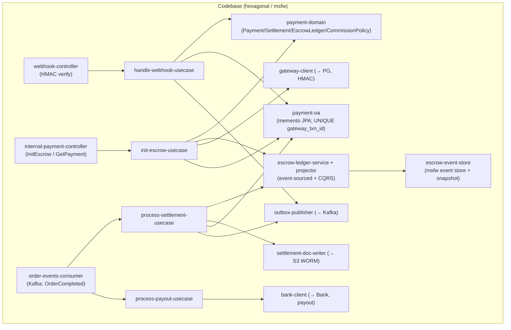
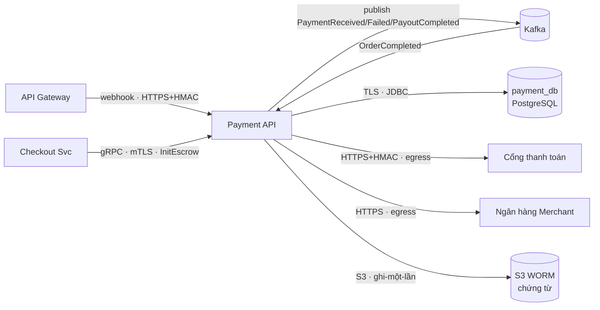
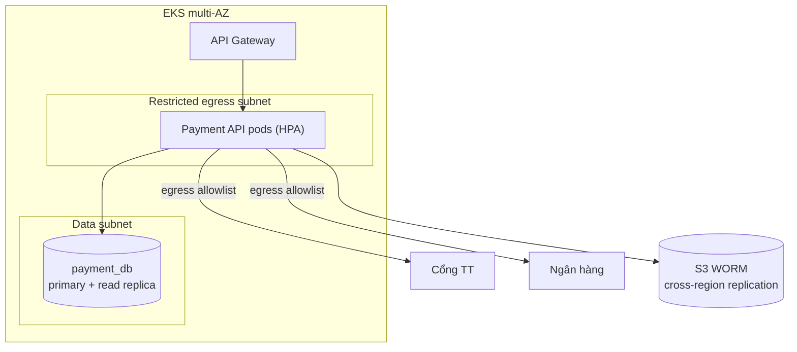
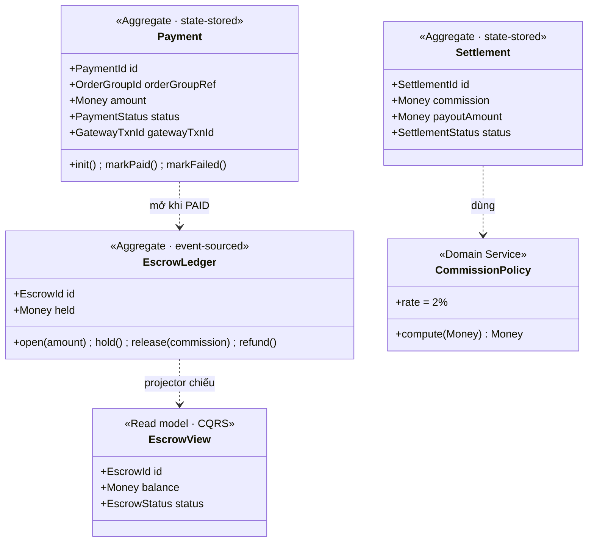
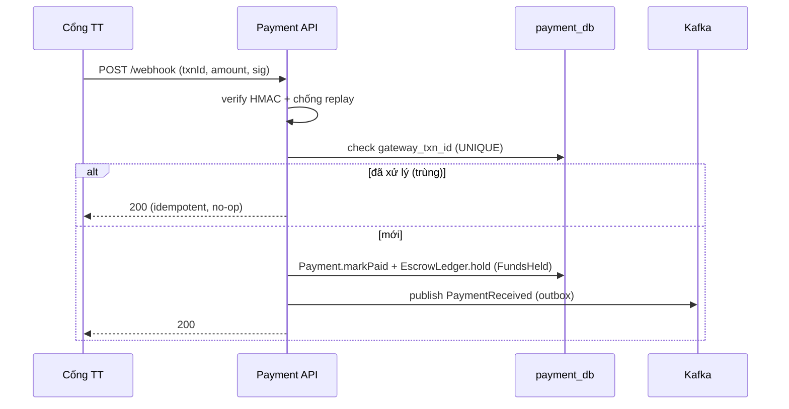
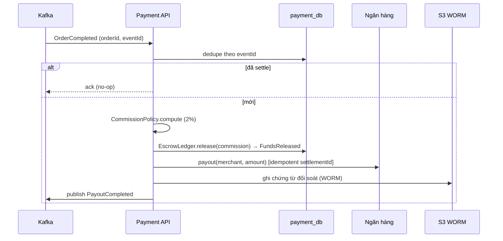
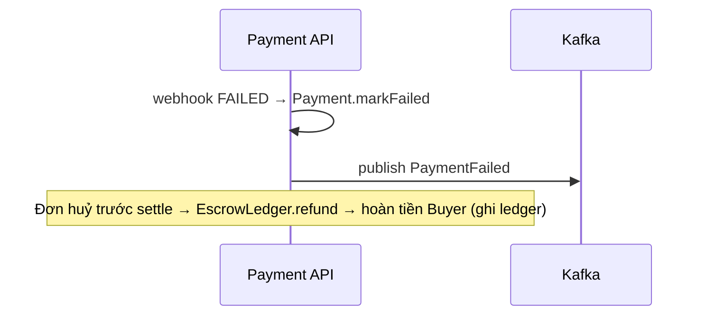

# Detailed Design — Payment Service (Escrow & Settlement)

> **Status:** v1.0 — căn theo SDD-MKTPLACE-CORE-v2.2 ·
> **Owner:** Payment team ·
> **Reviewers:** _TBD_
>
> **Liên kết (lên AD / ngang hợp đồng):**
> - **SDD-MKTPLACE-CORE-v2.2** — §2.2 (Payment BC ở Landscape, **C4 L2**), §2.2.3 (luật tầng: AD dừng ở L2 · Tech Spec sở hữu L3), §2.4 (correspondence), §3.2.2, §4.1.2/4.1.3, §5.1.5 (hợp đồng event), §6 (payment_db + S3 WORM), §7.3, §11 (ADR register hệ thống)
> - OpenAPI spec + proto + **AsyncAPI** (PaymentReceived/PaymentFailed/PayoutCompleted) — _nguồn sự thật_
> - IaC / Terraform (restricted egress subnet, S3 Object Lock, IRSA)

> **Classification:** **Tier 1 — Critical** _(giữ tiền thật của khách; sai = mất/lệch tiền)_ ·
> **Data class:** chứa **dữ liệu nhạy cảm** (STK ngân hàng, số tiền, chứng từ tài chính) · **System Owner:** Payment team ⇒ **RTO < 1h · RPO < 5 phút** (SDD §9.3.1).

> **Ranh giới tầng — Tech Spec này sở hữu gì vs AD giữ gì** (theo luật tầng SDD v2.2 §2.2.3):
> - **AD (SDD) giữ — C4 L2 / Landscape:** hộp *Payment BC*; Context Map (Payment = Supplier escrow cho Checkout; publish PaymentReceived/PayoutCompleted; ACL với cổng TT/ngân hàng); bề mặt hợp đồng + bảo đảm tương tác (SDD §5.1.4/5.1.5); deployment ở grain BC/zone (restricted egress subnet).
> - **Tech Spec này sở hữu — C4 L3 / nội bộ Payment Service:** module & component (§3.1), C&C (§3.2), deployment chi tiết per-BC (§3.3 → IaC), domain (escrow event-sourced + CQRS) & data (§4.2–4.3), key flows nội bộ (§5), quyết định **context-local** `ADR-PAY-*` (§7).
> - **Đẩy xuống nữa:** field/mã lỗi đầy đủ → OpenAPI/proto/AsyncAPI; egress allowlist/secret/Object-Lock policy → IaC/Vault.
>
> _(Lưu ý: "Tier 1 / nhạy cảm" ở trên là **phân lớp dữ liệu/hệ thống** — khác với **C4 L2/L3**.)_

# 1. Context & Scope

Payment Service là **chủ sở hữu luồng tiền**: khởi tạo & giữ tiền trung gian (escrow), xác minh webhook cổng thanh toán, đối soát (settlement) + tính hoa hồng sàn, chi trả (payout) cho Merchant, và sinh **chứng từ đối soát bất biến (WORM)**. Có database riêng (`payment_db`) + bucket WORM. Là **Tier 1** — mọi thao tác tiền phải idempotent + audit.

**Ranh giới bounded context:**

- **Vào (đồng bộ, S2S):** `Payment.InitEscrow` (gRPC/mTLS) từ Checkout; `GET payment` nội bộ.
- **Vào (bất đồng bộ):** webhook `POST /v1/payments/webhook` từ cổng thanh toán (qua Gateway, verify HMAC); Kafka consume `OrderCompleted`.
- **Ra (egress hạn chế):** cổng thanh toán (giao dịch/refund, HTTPS+HMAC); ngân hàng Merchant (payout); S3 WORM (chứng từ); Kafka publish `PaymentReceived`/`PaymentFailed`/`PayoutCompleted`.
- **Không thuộc context:** điều phối checkout (Checkout Svc), state machine đơn (Order Svc), tồn kho (Inventory).

**Trust boundary:** webhook là bề mặt **inbound từ bên thứ ba** → verify chữ ký + allowlist IP + idempotency; egress chỉ tới cổng TT/ngân hàng (subnet hạn chế); mọi S2S nội bộ qua mTLS/SVID; secret ở Vault. Không tin theo vị trí mạng.

**Goals:**
- Giữ tiền escrow đến khi đơn hoàn tất; release + payout khi settle; refund khi huỷ.
- **Không bao giờ trừ/payout hai lần** dù event/webhook giao trùng (at-least-once).
- Audit trail bất biến cho mọi chuyển động tiền (escrow ledger) + chứng từ WORM.

**Non-goals:** điều phối saga checkout; quản lý vòng đời đơn; quản lý kho; gửi thông báo (Notification Svc).

# 2. Requirements (tóm tắt)

**Functional:**

| # | Yêu cầu | Giải thích |
| --- | --- | --- |
| FR1 | Init escrow | Checkout gọi `InitEscrow(orderGroupId, totalAmount)` → tạo Payment `PENDING`, gọi cổng TT lấy `paymentUrl` |
| FR2 | Verify webhook | `POST /webhook`: verify HMAC + chống replay; map `PAID/FAILED`; idempotent theo `gateway_txn_id` |
| FR3 | Hold escrow | Webhook `PAID` → ghi `FundsHeld` vào EscrowLedger; publish `PaymentReceived` |
| FR4 | Settle | Consume `OrderCompleted` → tính hoa hồng (2%) → `FundsReleased` → payout |
| FR5 | Payout | Chi trả Merchant qua ngân hàng (idempotent); publish `PayoutCompleted` |
| FR6 | Chứng từ WORM | Sinh chứng từ đối soát ghi-một-lần lên S3 Object Lock |
| FR7 | Refund | Đơn huỷ trước settle → hoàn tiền Buyer; ghi ledger |

**Non-functional / SLO (Tier 1):**

| Thuộc tính | Mục tiêu |
| --- | --- |
| RTO / RPO | RTO < 1h · RPO < 5 phút |
| Idempotency | 0 double-charge / double-payout (bất biến) |
| Đối soát | escrow balance khớp 100%; chứng từ bất biến |
| Webhook latency | xử lý < 2s; cổng TT retry nếu timeout |
| Availability | ≥ 99.95% |

# 3. Design overview

## 3.1 Module view (cấu trúc tĩnh)

| Module | Trách nhiệm | Không được làm |
| --- | --- | --- |
| `webhook-controller` | Kết thúc HTTP webhook; verify HMAC + chống replay; chuyển use-case | Business logic; ghi DB trực tiếp |
| `internal-payment-controller` | InitEscrow / GetPayment (S2S, mTLS) | Gọi cổng TT trực tiếp |
| `order-events-consumer` | Consume `OrderCompleted` (idempotent theo `eventId`) → settle + payout | Tự quyết business; bỏ dedupe |
| `init/handle-webhook/settlement/payout` use-case | Điều phối một thao tác tiền; gọi domain + adapter | Biết chi tiết HMAC/JDBC/Kafka |
| `escrow-ledger-service + projector` | **Write event-sourced** (EscrowOpened/FundsHeld/FundsReleased) + chiếu sang read model `EscrowView` (CQRS) | Lộ event store ra ngoài |
| `payment-domain` | Aggregate + invariant: Payment/Settlement (state-stored), EscrowLedger (event-sourced), hoa hồng 2% | I/O |
| `payment-oa` / `escrow-event-store` | Repository memento + event store (msfw); UNIQUE `gateway_txn_id` (idempotency) | Business logic |
| `gateway-client` / `bank-client` / `settlement-doc-writer` | Egress ra PG / Bank / S3 WORM | Business logic |
| `outbox-publisher` | Drain outbox → Kafka (đảm bảo at-least-once + ordering theo `orderId`) | — |

> **BN-1 · Idempotency tiền (bất biến):** webhook dedupe theo `gateway_txn_id` (UNIQUE DB); consumer dedupe theo `eventId`; lệnh dùng `IdempotencyKey` (msfw). Giao trùng `OrderCompleted` → **không** release/payout lần 2. Đây là fitness function bắt buộc (§8).
>
> **BN-2 · EscrowLedger event-sourced:** số dư escrow tái dựng từ chuỗi sự kiện (audit tài chính); Payment/Settlement vẫn state-stored. Không event-source toàn bộ context — chỉ nơi cần lịch sử tiền.

## 3.2 C&C view (runtime)

**Connector catalog (zero-trust):**

| Connector | From → To | Protocol | Authn/Authz |
| --- | --- | --- | --- |
| escrow | Checkout → Payment | gRPC | mTLS (SVID); scope `payment:init:escrow` |
| webhook | PG → Payment (qua GW) | HTTPS | verify HMAC + allowlist IP + idempotency |
| events-in/out | Kafka ↔ Payment | Kafka | mTLS broker + ACL topic; consumer idempotent |
| db | Payment → payment_db | TLS/JDBC | IAM least-priv |
| gateway | Payment → PG | HTTPS+HMAC | secret ở Vault; egress allowlist |
| payout | Payment → Bank | HTTPS | secret ở Vault; egress allowlist |
| docs | Payment → S3 WORM | S3 | Object Lock; write-once IAM |

## 3.3 Deployment view (per-BC → IaC)

**Thực thi zero-trust ở tầng deploy (→ IaC):**
- **Restricted egress subnet:** NetworkPolicy default-deny; egress **chỉ** tới PG/Bank (allowlist) — không Internet tự do.
- Workload identity (IRSA) + mTLS (SVID); secret ở Vault, không trong code.
- `payment_db` RPO < 5 phút (hourly incremental + WAL); S3 WORM bật **Object Lock** + cross-region replication.
- Deploy **canary** (Tier 1); freeze payout khi phát hiện lệch đối soát.

# 4. Interfaces & data

> Hợp đồng đầy đủ ở OpenAPI/proto/AsyncAPI. Dưới đây chỉ ngữ nghĩa quan trọng.

## 4.1 Interfaces

| # | Loại | Interface | Auth | Ngữ nghĩa |
| --- | --- | --- | --- | --- |
| 1 | gRPC (in) | `Payment.InitEscrow(orderGroupId, totalAmount, currency)` | mTLS | Tạo Payment PENDING; trả `paymentUrl`. **Idempotent** theo `orderGroupId`/`IdempotencyKey` |
| 2 | REST (in) | `POST /v1/payments/webhook` | HMAC | Callback PG; verify chữ ký; idempotent theo `gateway_txn_id` |
| 3 | gRPC (in) | `Payment.GetPayment(orderRef)` | mTLS | Đọc trạng thái |
| 4 | event (out) | `PaymentReceived` / `PaymentFailed` | Kafka | Sau webhook; consumer: Order, Notification |
| 5 | event (out) | `PayoutCompleted` | Kafka | Sau payout |
| 6 | event (in) | `OrderCompleted` | Kafka | Kích hoạt settlement + payout |

**Bảo đảm tương tác** (đồng bộ với SDD §5.1.4): InitEscrow = sync command, strong-in-context, idempotency **bắt buộc**; webhook = inbound async, eventual, idempotent theo `txnId`; OrderCompleted = at-least-once, consumer dedupe theo `eventId`, **không** payout 2 lần.

## 4.2 Domain model

**Invariant:**
1. `gateway_txn_id` **UNIQUE** — một giao dịch cổng chỉ ghi nhận một lần (idempotency webhook).
2. EscrowLedger chỉ chuyển `OPENED → HELD → RELEASED|REFUNDED`; tổng release + refund ≤ held.
3. Payout idempotent theo `settlementId` — `OrderCompleted` trùng **không** payout lần 2.
4. Hoa hồng = `CommissionPolicy.compute` (2%), không lấy từ input ngoài.
5. Chứng từ settlement ghi-một-lần (WORM) — không sửa/xóa kể cả owner.
6. Số dư escrow tái dựng được từ event store tại mọi thời điểm (đối soát).

## 4.3 Data model

| Store | Bảng / đối tượng | Ghi chú |
| --- | --- | --- |
| `payment_db` (PostgreSQL) | `payments` (memento), `escrow_event_store` + `snapshots`, `escrow_view` (read model), `settlements`, `payouts`, `outbox` | ACID; UNIQUE `gateway_txn_id`; outbox cho at-least-once |
| S3 (WORM) | `settlement-docs/{settlementId}.pdf` | Object Lock (write-once); cross-region replication |

> Schema cột chi tiết + DDL → migration (Flyway) trong repo Payment. Reference logic xuyên context: `orderRef`, `merchantId` (không FK vật lý).

## 4.4 Config & tunables

| Tham số | Khởi điểm | Ghi chú |
| --- | --- | --- |
| `payment.commission_rate` | 0.02 | Hoa hồng sàn (qua CommissionPolicy) |
| `payment.webhook_replay_window_s` | 300 | Cửa sổ chống replay webhook |
| `payment.payout_retry_max` | 5 | Retry payout → DLQ nếu vượt |
| `payment.gateway_timeout_ms` | 30000 | Timeout gọi cổng TT |
| `payment.egress_allowlist` | PG, Bank | Đích egress hợp lệ (enforced ở NetworkPolicy) |

## 4.5 Personal data handling

| Data element | Class | Lưu ở đâu | Retention |
| --- | --- | --- | --- |
| STK ngân hàng Merchant | Nhạy cảm | `payment_db` (field-level encrypt) | theo hợp đồng |
| Số tiền / giao dịch | Giao dịch | `payment_db` | 10 năm (luật kế toán) |
| Chứng từ đối soát | Tài chính | S3 WORM | 10 năm, bất biến |

Mã hóa at-rest AES-256 (KMS/Vault); STK + PII field-level. Không log số tiền/STK thô (mask).

# 5. Key flows

## 5.1 Webhook PAID → giữ escrow

## 5.2 Settlement & payout (OrderCompleted)

## 5.3 Webhook FAILED / Refund

# 6. Operations & Resilience (delta)

> DR platform xem SDD §9.3 — dưới đây là delta của Payment.

- **payment_db:** Tier-1 → hourly incremental + WAL, **RPO < 5 phút**; PITR.
- **S3 WORM:** cross-region replication; không xóa được kể cả khi compromise (Object Lock).
- **Egress:** chỉ PG/Bank (allowlist) — chặn exfiltration.
- **DLQ:** `pay-dlq` cho event tiền; tồn DLQ → **alert P1 + freeze payout** (SDD §10.4).
- **Reconcile:** job đối soát escrow_view ↔ event store ↔ giao dịch cổng TT định kỳ; lệch → P1.
- **Circuit breaker** gọi PG/Bank; timeout mọi I/O; reconcile thủ công khi vendor lỗi.

# 7. Decisions context-local (ADR-PAY-*) & cross-cutting

> Quyết định nội bộ Payment (`ADR-PAY-*`) — **khác** ADR register hệ thống ở SDD §11; hỗ trợ/cụ thể hóa các ADR hệ thống liên quan (ADR-0005 idempotency, ADR-0006 escrow, ADR-0007 WORM, ADR-0011 partition).

**ADR-PAY-1 — EscrowLedger event-sourced + CQRS read model.** Miền tài chính cần audit trail bất biến + tái dựng số dư; Payment/Settlement vẫn state-stored (memento). _Hệ quả:_ phải quản lý snapshot/upcasting; đọc tách khỏi ghi (EscrowView).

**ADR-PAY-2 — Một escrow cho tổng giỏ, settle per-Merchant.** Khớp Checkout `ADR-CHK-2`: giữ tổng, phân bổ + payout khi từng đơn Merchant hoàn tất. _Hệ quả:_ logic settlement phức tạp hơn (chia theo merchant).

**ADR-PAY-3 — Idempotency đa lớp.** UNIQUE `gateway_txn_id` (webhook) + `eventId` dedupe (consumer) + `IdempotencyKey` msfw (lệnh). _Hệ quả:_ không double-charge/payout dù at-least-once.

**ADR-PAY-4 — Chứng từ đối soát WORM (S3 Object Lock).** Write-once, deny overwrite/delete kể cả owner. _Hệ quả:_ tuân thủ tài chính; IAM policy chi tiết = TBD (đồng bộ SDD §6.4.3/R-02).

**ADR-PAY-5 — Restricted egress subnet (allowlist PG/Bank).** _Hệ quả:_ giảm bề mặt exfiltration; mọi đích mới phải qua review + IaC.

**ADR-PAY-6 — Hoa hồng 2% trong domain (CommissionPolicy), không config tự do.** _Hệ quả:_ đổi rate = đổi code + review (không lật bằng config nóng).

**Threat seed (STRIDE):** giả webhook → HMAC + allowlist IP + chống replay; tamper số tiền → amount cross-check (webhook amount == escrow amount); double payout → idempotency (ADR-PAY-3); exfiltration → egress allowlist (ADR-PAY-5); sửa chứng từ → WORM (ADR-PAY-4).

# 8. Test strategy

- **Unit:** CommissionPolicy (2% math); EscrowLedger transitions (OPENED→HELD→RELEASED/REFUNDED); invariant tổng release ≤ held.
- **Contract:** proto InitEscrow; AsyncAPI PaymentReceived/Failed/PayoutCompleted; webhook schema.
- **Idempotency (bắt buộc):** webhook trùng `gateway_txn_id` → no-op; `OrderCompleted` trùng → **không** payout/release lần 2 (inject event trùng).
- **Amount cross-check:** webhook amount ≠ escrow amount → từ chối.
- **Failure-injection:** PG/Bank timeout → retry → DLQ; reconcile job phát hiện lệch.
- **Fitness functions (bắt buộc):**
  - **No double payout/deduct** trên event redelivery.
  - **Egress chỉ PG/Bank** (network policy check).
  - **S3 settlement docs không ghi đè/xóa được** (IaC + test Object Lock).
  - **Escrow balance khớp** event store ↔ read model ↔ cổng TT.

**Acceptance mẫu:**
- _Escrow:_ webhook PAID → escrow HELD đúng số tiền, publish PaymentReceived đúng 1 lần.
- _Settlement:_ OrderCompleted → hoa hồng 2% đúng, payout đúng số, chứng từ WORM được tạo.
- _Idempotent:_ giao 2 lần OrderCompleted → 1 payout, 1 chứng từ.

# 9. Open questions

1. **Refund sau settle:** cho phép hoàn tiền sau khi đã payout? (Hiện: chỉ refund trước settle.)
2. **Partial settlement:** giỏ nhiều Merchant, một đơn huỷ → settle phần còn lại thế nào?
3. **Multi-currency payout:** giữ escrow + payout khác currency? (Hiện: single currency.)
4. **Dispute hold:** khi có tranh chấp (Dispute BC — ADR-0012) → giữ escrow thay vì release? Cần cờ hold.
5. **Định dạng serialize event:** Avro/Protobuf/JSON Schema (đồng bộ ADR-0013 hệ thống).
