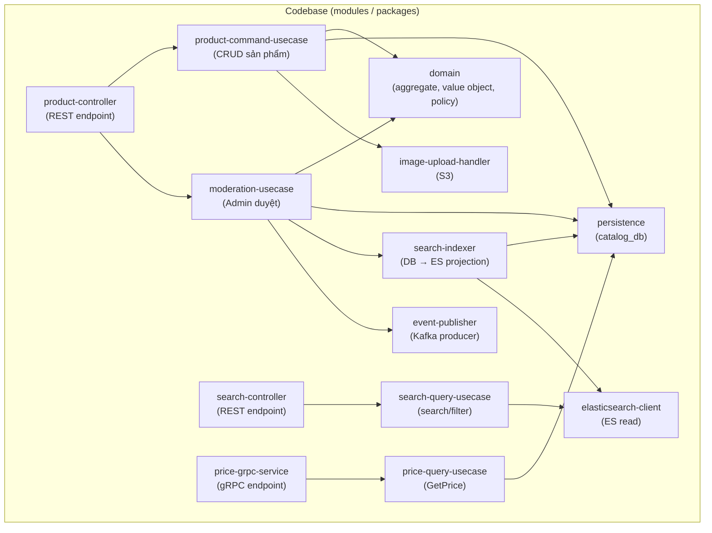
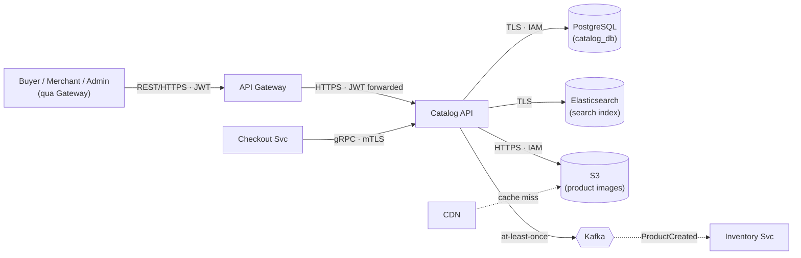
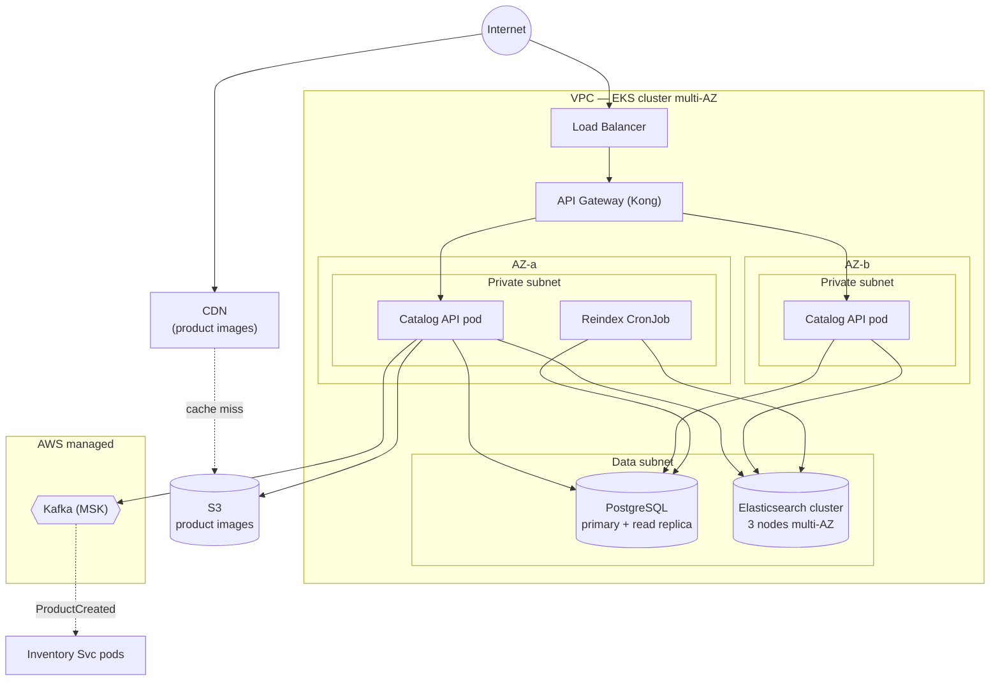
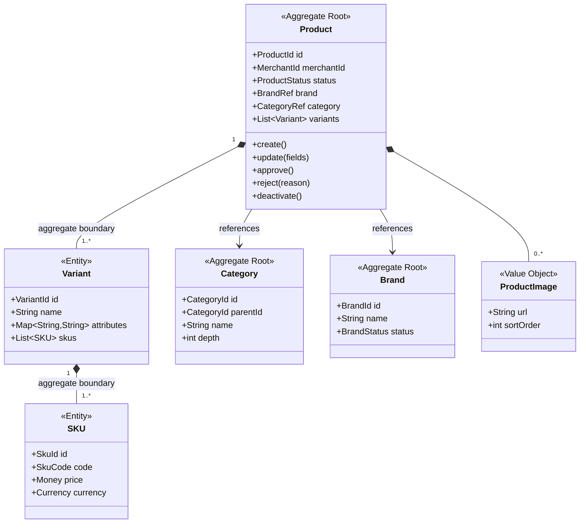
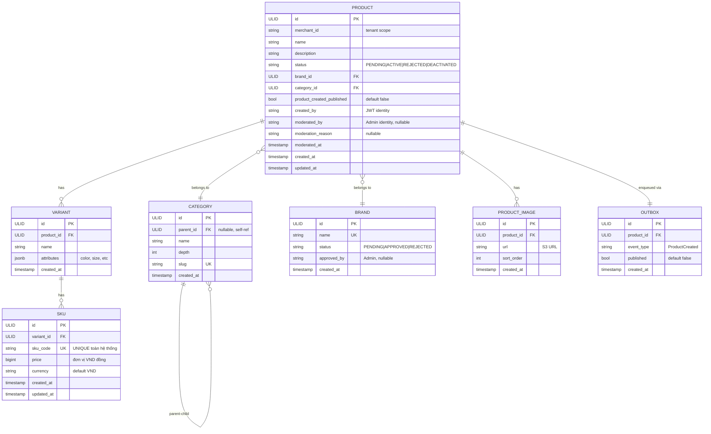
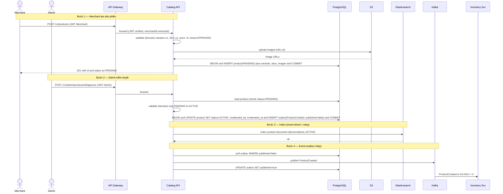
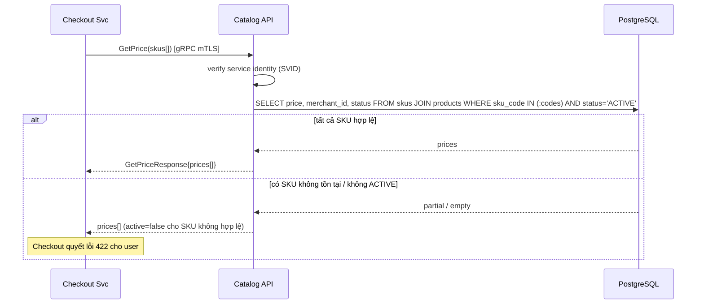
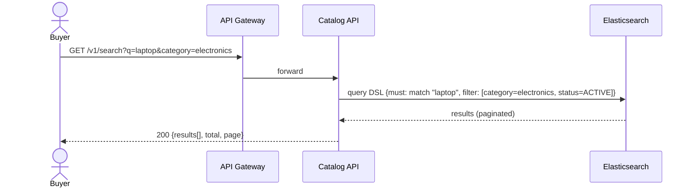
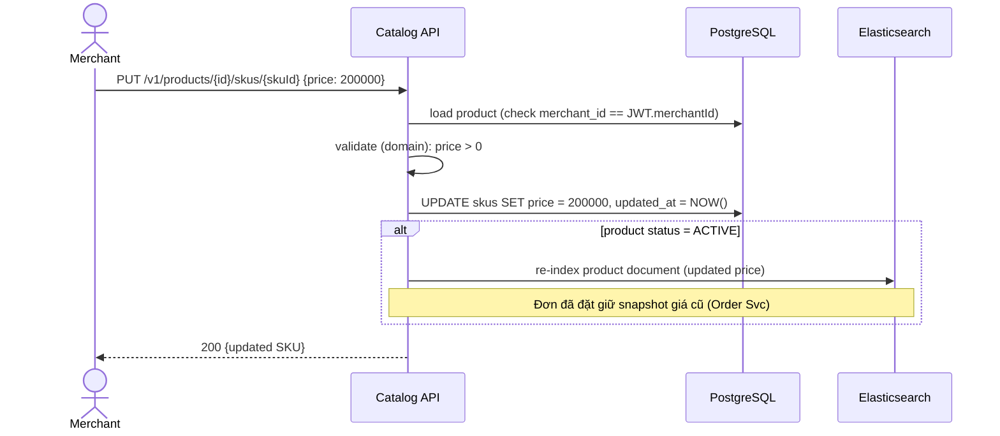
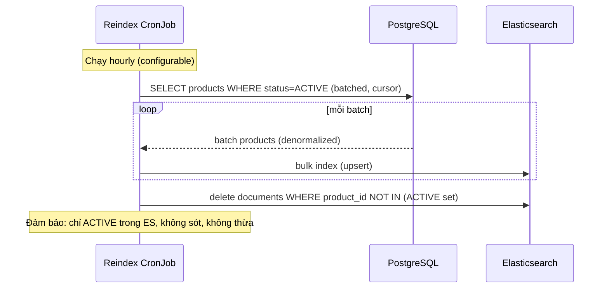

# Detailed Design — Catalog Service (Product Source of Truth)

> **Status:** Draft v1.0 ·
> **Owner:** Catalog team ·
> **Reviewers:** _TBD_

**Liên kết:**
- [SDD-MKTPLACE-CORE-v1.0 — mục 3.1, 4.1.1, 6.1, 8.1](https://vin3s.atlassian.net/wiki/spaces/VARW/pages/2826666048)
- OpenAPI spec
- Proto PriceService
- ES mapping (`products_v1`)
- DB migrations (Flyway)
- IaC / Terraform

> **Classification**: **Tier 3 — Important** _(Catalog down = không search/browse/checkout được, nhưng đơn đang xử lý không ảnh hưởng — Order/Payment giữ snapshot giá)_
>
> **Data class:** L2 (thông tin sản phẩm, giá, danh mục — dữ liệu kinh doanh nội bộ) + L3 (product image chứa metadata Merchant) · **System Owner:** Catalog team ⇒ **RTO < 24h · RPO < 4h** (§2). Tiêu chuẩn: System Tiering · Data Classification.

---

# 1. Context & Scope

Catalog Service là source of truth cho toàn bộ sản phẩm trên Marketplace: quản lý Product → Variant → SKU, Brand, cây Category; kiểm duyệt nội dung trước khi hiển thị; cung cấp giá cho Checkout (gRPC); đánh chỉ mục tìm kiếm toàn văn qua Elasticsearch. Service áp dụng CQRS nhẹ: ghi vào `catalog_db` (PostgreSQL — source of truth), chiếu sang Elasticsearch (read model cho search) — eventual consistency.

**Ranh giới bounded context:**

- **Vào (REST, JWT qua Gateway):** CRUD sản phẩm từ Merchant; approve/reject từ Admin; search từ storefront (public).
- **Vào (gRPC, mTLS):** `Catalog.GetPrice(skus[])` từ Checkout Svc — lấy giá snapshot.
- **Ra (Kafka):** publish `ProductCreated` → Inventory Svc (init SKU = 0).
- **Ra (S3):** lưu product image.
- **Không thuộc context:** tồn kho (Inventory Svc), giá khuyến mãi runtime (Checkout/Promotion — nếu có), quản lý đơn hàng (Order Svc), giỏ hàng (Cart), orchestration checkout (Checkout Svc).

**Trust boundary:** Catalog có **2 ranh giới tin cậy chính**:

- **(B1)** Internet (Buyer storefront, Merchant portal) → API qua Gateway: JWT xác thực, tenant scope, rate limit.
- **(B2)** Service nội bộ → Catalog (gRPC): mTLS (SVID) — Checkout gọi `GetPrice`.

Không suy tin cậy từ vị trí mạng. Chi tiết cơ chế ở §3.2/§3.3/§4.

**Goals:**

- Source of truth cho sản phẩm: Product, Variant, SKU, Brand, Category — mọi context khác tham chiếu, không duplicate.
- Kiểm duyệt là cổng (moderation gate): sản phẩm PENDING → chỉ Admin chuyển ACTIVE → mới index/hiển thị. Sản phẩm chưa duyệt **không bao giờ** xuất hiện trên search/storefront.
- CQRS nhẹ: write → `catalog_db` (source of truth); read/search → Elasticsearch (denormalized, eventually consistent).
- Cung cấp giá chính xác cho Checkout (gRPC `GetPrice`) — giá lấy từ DB, không từ ES (consistency).
- Phát event `ProductCreated` để Inventory khởi tạo SKU.

**Non-goals:**

- Không quản lý tồn kho (Inventory Svc).
- Không tính giá khuyến mãi runtime (nếu có Promotion context).
- Không quản lý giỏ hàng.
- Không lưu trữ/xử lý ảnh nâng cao (CDN/image processing pipeline riêng).
- Không search analytics / recommendation engine.

---

# 2. Requirements (tóm tắt — nguồn đầy đủ ở backlog)

**Functional:**

| # | Yêu cầu | Giải thích |
|---|---------|------------|
| FR1 | CRUD sản phẩm (Merchant scope) | Merchant tạo/sửa/xóa sản phẩm **của mình** (tenant scope `merchant_id`). Tạo = `PENDING`. Merchant A **không** thấy/sửa sản phẩm Merchant B |
| FR2 | Moderation (kiểm duyệt) | Admin approve → `ACTIVE` / reject → `REJECTED`. Chỉ `ACTIVE` được index vào ES & hiển thị storefront. Kiểm duyệt là **gate bắt buộc** |
| FR3 | Cây danh mục & Brand | Quản lý Category tree (parent-child) + Brand list. Brand mới cần Admin duyệt |
| FR4 | Product → Variant → SKU | Mỗi Product có ≥1 Variant (size/color…); mỗi Variant có ≥1 SKU. SKU code UNIQUE toàn hệ thống. Giá gắn ở SKU (source of truth) |
| FR5 | Search toàn văn | Full-text search + filter (category, brand, price range, merchant) qua Elasticsearch. Chỉ sản phẩm `ACTIVE`. Hỗ trợ phân trang, sắp xếp |
| FR6 | Cung cấp giá cho Checkout (gRPC) | `Catalog.GetPrice(skus[])` trả giá từ DB (consistency), không từ ES. Checkout **không** tin giá từ client |
| FR7 | Phát event ProductCreated | Khi Product được ACTIVE lần đầu → publish `ProductCreated{productId, skus[]}` lên Kafka → Inventory init SKU = 0 |
| FR8 | Product image upload | Merchant upload ảnh → lưu S3 → URL gắn vào product. CDN phía trước S3 |
| FR9 | Reindex chống lệch | Job định kỳ reindex toàn bộ/incremental để đảm bảo ES khớp DB (eventual consistency) |

**Non-functional / SLO (Tier 3):**

| Thuộc tính | Mục tiêu |
|-----------|---------|
| Search P95 latency | < 200 ms |
| GetPrice P99 latency | < 100 ms (gRPC, đọc DB) |
| REST API P99 latency | < 500 ms |
| API availability | ≥ 99.5% _(Tier 3)_ |
| RTO / RPO | RTO < 24h · RPO < 4h _(Tier 3)_ |
| Index lag (DB → ES) | < 5 giây (normal); < 30 giây (peak) |
| Degraded mode | ES down ⇒ search unavailable, browse fallback cache; DB vẫn phục vụ `GetPrice` (Checkout không bị block) |

---

# 3. Design overview

## 3.1 Module view (cấu trúc tĩnh — code chia ra sao)



| Module | Trách nhiệm | Không được thực hiện |
|--------|-------------|---------------------|
| `product-controller` | Kết thúc REST `/v1/products`, `/v1/admin/products`; extract JWT claims (`userId`, `merchantId`, `role`); validate request; điều phối tới use-case | Gọi ES/Kafka trực tiếp; chứa luật moderation; chứa business logic; persist |
| `search-controller` | Kết thúc REST `/v1/search`; validate query params; phân trang; điều phối tới search query use-case | Gọi DB trực tiếp; chứa luật index; persist; chứa business logic |
| `price-grpc-service` | Kết thúc gRPC `Catalog.GetPrice`; verify service identity (mTLS); điều phối tới price query use-case | Đọc từ ES (phải đọc DB cho consistency); chứa business logic; persist |
| `product-command-usecase` | CRUD Product/Variant/SKU/Brand: validate nghiệp vụ (domain), persist (DB), upload ảnh (S3). Tạo mới → `PENDING`. Sửa giá → cập nhật DB + trigger reindex nếu `ACTIVE` | Index ES (việc của `search-indexer`); publish Kafka (việc của `moderation-usecase`); gọi gRPC; biết structure ES |
| `moderation-usecase` | Admin approve/reject: validate trạng thái (domain — chỉ `PENDING` → `ACTIVE/REJECTED`); persist; nếu ACTIVE → trigger index ES + publish `ProductCreated` | CRUD sản phẩm; biết structure ES; gọi provider ngoài |
| `search-query-usecase` | Nhận query + filters → gọi `elasticsearch-client` → trả kết quả phân trang. **Chỉ trả sản phẩm** `ACTIVE` (filter cứng ở ES query) | Gọi DB (search đi qua ES); persist; sửa sản phẩm |
| `price-query-usecase` | Nhận `skus[]` → query DB (`catalog_db`) → trả giá. **Đọc DB, không ES** (consistency cho checkout) | Đọc ES; persist (chỉ read); chứa logic checkout |
| `domain` | `Product` aggregate root + `Variant` entity + `SKU` entity + `Brand`, `Category` value objects; cưỡng chế invariant (§4.2): status machine, moderation gate, SKU code unique, tenant scope | Biết HTTP/DB/ES/Kafka/S3; làm I/O; phụ thuộc module khác |
| `search-indexer` | Chiếu sản phẩm `ACTIVE` từ `catalog_db` → Elasticsearch (denormalized document). Hỗ trợ: event-driven (khi ACTIVE), full reindex (cron), incremental reindex | Chứa luật nghiệp vụ; persist DB; gọi provider ngoài; CRUD sản phẩm |
| `image-upload-handler` | Upload ảnh sản phẩm lên S3; trả URL; validate file type/size; scan malware (nếu có) | Chứa luật nghiệp vụ; persist DB; index ES |
| `event-publisher` | Publish `ProductCreated` lên Kafka (at-least-once via transactional outbox hoặc CDC). Chỉ publish khi sản phẩm lần đầu → ACTIVE | Chứa luật nghiệp vụ; persist trực tiếp; quyết định moderation |
| `persistence` | Repository cho `products`/`variants`/`skus`/`categories`/`brands`/`outbox`; cưỡng chế UNIQUE `sku_code`; transaction atomic; tenant scope enforcement (`merchant_id` filter) | Chứa luật nghiệp vụ/invariant (ở `domain`); gọi ES/Kafka/S3 |
| `elasticsearch-client` | Gọi ES cluster; build query DSL; map response → domain DTO. Đính filter cứng `status=ACTIVE` | Chứa luật nghiệp vụ; persist DB; gọi Kafka; CRUD sản phẩm |

**Behavior notes:**

> **BN-1 · CQRS consistency (search-indexer + persistence):** Write path (CRUD, moderation) → `catalog_db` (source of truth); Read path (search) → Elasticsearch. Eventual consistency: sản phẩm vừa ACTIVE có thể trễ vài giây trước khi xuất hiện search. DB **luôn** là nguồn sự thật; khi nghi lệch → reindex job sửa ES. `GetPrice` đọc DB, không ES — đảm bảo giá chính xác cho checkout.

> **BN-2 · Moderation gate (moderation-usecase + domain):** Sản phẩm mới tạo luôn `PENDING`. Chỉ Admin approve → `ACTIVE`. Sản phẩm `PENDING` / `REJECTED` **không bao giờ** được index vào ES, không xuất hiện search/storefront, không có giá cho `GetPrice` (trả 404/422). Đây là invariant cốt lõi — fitness function bắt buộc.

> **BN-3 · ProductCreated event (event-publisher + moderation-usecase):** Chỉ publish **một lần** khi sản phẩm lần đầu chuyển sang `ACTIVE` — để Inventory init SKU = 0. Nếu sản phẩm bị REJECTED rồi resubmit → approve lần 2 **không** phát lại `ProductCreated` (Inventory đã có SKU). Trường `product_created_published` trong DB theo dõi.

## 3.2 C&C view (cấu trúc runtime)



**Connector catalog (zero-trust):**

| Connector | From → To | Protocol | Authn / Authz |
|-----------|-----------|----------|---------------|
| storefront / merchant | Gateway → Catalog API | HTTPS | JWT (RS256) forwarded; Gateway verify; Catalog validate claims + tenant scope |
| get-price | Checkout Svc → Catalog API | gRPC | mTLS (SVID); scope `catalog:read:price` |
| state-rw | Catalog API → PostgreSQL | TLS (JDBC) | IAM-auth / creds rotate; role least-priv |
| search-rw | Catalog API → Elasticsearch | TLS (HTTPS) | IAM-auth; write (indexer) / read (search) roles tách biệt |
| image-store | Catalog API → S3 | HTTPS | IRSA; PutObject (upload), GetObject (read) |
| event-pub | Catalog API → Kafka | Kafka protocol | SASL/mTLS; topic `catalog.events` |
| cdn-origin | CDN → S3 | HTTPS | Origin Access Identity (OAI) |

**View-to-view mapping (module ↦ runtime component):**

| Module | Nằm trong runtime component |
|--------|----------------------------|
| `product-controller`, `search-controller`, `price-grpc-service`, `product-command-usecase`, `moderation-usecase`, `search-query-usecase`, `price-query-usecase`, `image-upload-handler`, `event-publisher` | Catalog API |
| `search-indexer` | Catalog API (event-driven) + Reindex Job (cron) |
| `domain`, `persistence`, `elasticsearch-client` | Catalog API + Reindex Job (dùng chung) |

> Catalog có **2 runtime component**: Catalog API (serving — REST + gRPC) và Reindex Job (CronJob, chạy định kỳ). Scale độc lập: search traffic spike → HPA Catalog API; reindex không ảnh hưởng serving.

## 3.3 Deployment view



**Thực thi zero-trust ở tầng deploy:**

- NetworkPolicy default-deny; chỉ mở GW→Catalog, Catalog→PostgreSQL, Catalog→ES, Catalog→S3 (VPC endpoint), Catalog→Kafka (VPC endpoint).
- Workload identity qua IRSA — Catalog API và Reindex Job có **ServiceAccount + IAM role riêng**:
  - API: read/write `catalog_db`; read/write ES; PutObject S3; publish Kafka
  - Reindex Job: read `catalog_db`; write ES (không write DB, không publish Kafka)
- Không egress ra Internet (Catalog không gọi external provider — CDN phía trước S3, không phải Catalog gọi).
- Elasticsearch cluster 3 nodes trải multi-AZ; snapshot tự động.
- Read replica PostgreSQL cho `GetPrice` nếu cần tách load (hiện tại chưa cần — GetPrice traffic thấp).

---

# 4. Interfaces & data

> **Nguồn sự thật:** contract đầy đủ ở **OpenAPI spec** + **proto file**. Dưới đây chỉ giữ ngữ nghĩa quan trọng.

## 4.1 API

### 4.1.1 `POST /v1/products` — Tạo sản phẩm

```json
// Request (Merchant)
{
  "name": "string",
  "brandId": "uuid",
  "categoryId": "uuid",
  "variants": [
    {
      "name": "string",
      "attributes": {"color": "red", "size": "M"},
      "skus": [
        {"skuCode": "string", "price": 250000, "currency": "VND"}
      ]
    }
  ],
  "images": ["s3://..."],
  "description": "string"
}

// 201 Created
{
  "id": "uuid",
  "status": "PENDING",       // luôn PENDING khi tạo mới
  "merchantId": "uuid",      // từ JWT, không từ body
  "variants": [...],
  "createdAt": "RFC3339"
}
```

### 4.1.2 `POST /v1/admin/products/{id}/approve` — Kiểm duyệt

```json
// Request (Admin)
{
  "action": "APPROVE | REJECT",
  "reason": "string"           // bắt buộc khi REJECT
}

// 200 OK
{
  "id": "uuid",
  "status": "ACTIVE | REJECTED",
  "moderatedBy": "adminId",
  "moderatedAt": "RFC3339"
}
```

### 4.1.3 `GET /v1/search?q=&filters=` — Tìm kiếm

```
GET /v1/search?q=laptop&category=electronics&brand=asus&priceMin=5000000&priceMax=20000000&sort=price_asc&page=1&size=24
```

```json
// 200 OK
{
  "results": [
    {
      "productId": "uuid",
      "name": "string",
      "brand": "string",
      "category": "string",
      "price": {"min": 15000000, "max": 18000000},
      "merchantId": "uuid",
      "imageUrl": "string",
      "status": "ACTIVE"        // luôn ACTIVE (filter cứng)
    }
  ],
  "total": 1234,
  "page": 1,
  "size": 24
}
```

### 4.1.4 `Catalog.GetPrice(skus[])` — gRPC, mTLS

```protobuf
// Request
message GetPriceRequest {
  repeated string sku_codes = 1;  // max 50
}

// Response
message GetPriceResponse {
  repeated SkuPrice prices = 1;
}
message SkuPrice {
  string sku_code = 1;
  int64 price = 2;               // đơn vị VND đồng (bigint)
  string currency = 3;
  string merchant_id = 4;
  bool active = 5;               // false nếu SKU không ACTIVE
}
```

**Mã lỗi:**

| Code | Khi nào |
|------|---------|
| `400` | Sai schema / thiếu field bắt buộc / `variants` rỗng / `price` ≤ 0 |
| `401 / 403` | JWT không hợp lệ; Merchant cố sửa sản phẩm Merchant khác; Buyer cố tạo sản phẩm; scope không phù hợp |
| `404` | Product / SKU không tồn tại hoặc không thuộc Merchant đang request |
| `409` | `sku_code` trùng (UNIQUE constraint) |
| `422` | `categoryId` / `brandId` không hợp lệ; Brand chưa được duyệt; template variable thiếu |
| `429` | Rate limit (per-merchant cho CRUD, global cho search) |
| `503` | DB / ES unavailable |

**Authz model:**

| Scope | Cho phép | Ràng buộc |
|-------|---------|-----------|
| `catalog:write:product` | CRUD sản phẩm | Chỉ Merchant; chỉ sản phẩm `merchant_id == JWT.merchantId` |
| `catalog:moderate` | Approve / Reject | Chỉ Admin |
| `catalog:read:search` | Search storefront | Public (Buyer, Merchant, anonymous) — chỉ sản phẩm `ACTIVE` |
| `catalog:read:price` | GetPrice (gRPC) | Chỉ Checkout Svc (service identity mTLS) |
| `catalog:read:product` | GET chi tiết sản phẩm | Merchant xem sản phẩm của mình (mọi status); Buyer/public chỉ xem `ACTIVE` |

- **Tenant scope enforcement:** mọi query CRUD gắn `WHERE merchant_id = :callerMerchantId`. Merchant A **không** thấy/sửa/xóa sản phẩm Merchant B. Kiểm tại PEP (Gateway) + tại service (persistence query).
- **Moderation gate:** chỉ Admin chuyển `ACTIVE`; Merchant **không** tự approve; sản phẩm chưa duyệt không index/hiển thị.
- `merchantId` từ JWT, không từ body: khi tạo/sửa sản phẩm, `merchantId` lấy từ JWT claims, **không** từ request body — chống spoofing.
- **IDOR trên read:** `GET /v1/products/{id}` kiểm quyền: Merchant chỉ xem sản phẩm mình; Buyer chỉ xem `ACTIVE`.

## 4.2 Domain model

> Catalog có 1 aggregate chính: `Product` (bao gồm Variant, SKU). Category và Brand là aggregate riêng nhỏ hơn.



**Invariant:**

1. **ProductStatus tiến có kiểm soát:** `PENDING → (ACTIVE | REJECTED)`; `ACTIVE → DEACTIVATED`; `REJECTED → PENDING` (resubmit). **Chỉ Admin** chuyển `PENDING → ACTIVE/REJECTED`. Terminal: `DEACTIVATED` (bất biến).
2. **Moderation gate:** `PENDING` / `REJECTED` **không bao giờ** được index vào ES. Đây là invariant cốt lõi, cưỡng chế ở `search-indexer` + fitness function.
3. **SKU code UNIQUE toàn hệ thống** — DB UNIQUE constraint là thẩm quyền.
4. **Mỗi Product phải có ≥1 Variant; mỗi Variant phải có ≥1 SKU** — không cho Product rỗng.
5. **Price > 0** — SKU phải có giá dương (đơn vị VND đồng, bigint).
6. **Tenant immutable:** `merchantId` trên Product **không thể thay đổi** sau khi tạo.
7. **Brand phải** `APPROVED` trước khi Product reference được — Product không được dùng Brand chưa duyệt.
8. **ProductCreated chỉ publish một lần:** khi sản phẩm lần đầu → ACTIVE. Flag `product_created_published` immutable sau khi set.

## 4.3 Data model — ERD



**Nghĩa cột load-bearing:**

| Cột | Ý nghĩa |
|-----|---------|
| `merchant_id` (IDX) | Tenant scope — mọi query gắn `WHERE merchant_id = :caller`; index cho performance |
| `status` | Máy trạng thái — moderation gate; chỉ `ACTIVE` được index ES (BN-2) |
| `sku_code` (UK) | UNIQUE toàn hệ thống; dùng làm key cho `GetPrice` và Inventory |
| `price` (bigint) | Đơn vị nhỏ nhất (VND đồng) — tránh floating point; source of truth cho giá |
| `product_created_published` | Flag đảm bảo `ProductCreated` chỉ publish 1 lần (BN-3) |
| `moderated_by` / `moderation_reason` | Audit trail kiểm duyệt — ai duyệt, vì sao reject |
| `outbox.published` | `false` = chờ relay/CDC đẩy vào Kafka (transactional outbox pattern) |

**Elasticsearch index** `products_v1`:

```json
// Denormalized document — chỉ sản phẩm ACTIVE
{
  "product_id": "uuid",
  "name": "string",
  "description": "string",
  "brand": {"id": "uuid", "name": "string"},
  "category": {"id": "uuid", "name": "string", "path": ["root", "electronics", "laptop"]},
  "merchant_id": "uuid",
  "skus": [
    {"sku_code": "string", "price": 15000000, "attributes": {"color": "red"}}
  ],
  "price_min": 15000000,
  "price_max": 18000000,
  "image_url": "string",
  "status": "ACTIVE",          // luôn ACTIVE (filter cứng khi index)
  "created_at": "RFC3339",
  "updated_at": "RFC3339"
}
```

> ES index là **read model**, không phải source of truth. Khi nghi lệch → reindex từ DB. Mapping thay đổi → tạo index mới + alias swap (zero-downtime).

**Xử lý theo data class:**

- **L2 (thông tin sản phẩm, giá):** mã hóa at-rest (RDS encryption + ES encryption); không chứa PII. Retention theo vòng đời sản phẩm + 10 năm archive (giá snapshot cho đối soát Order).
- **Product image (S3):** public read qua CDN; validate file type (jpg/png/webp), max size 10MB; scan malware khi upload.
- **ES snapshot:** tự động daily; retention 30 ngày.

## 4.4 Config & tunables

| Tham số | Khởi điểm | Ghi chú |
|---------|-----------|---------|
| `catalog.reindex_cron` | `0 * * * *` (hourly) | Full reindex chống lệch DB↔ES |
| `catalog.search_page_size` | 24 | Default page size search |
| `catalog.search_max_page_size` | 100 | Max page size (chống abuse) |
| `catalog.getprice_max_skus` | 50 | Max SKUs per GetPrice request |
| `catalog.image_max_size_mb` | 10 | Max file size upload |
| `catalog.image_allowed_types` | jpg, png, webp | Allowed image MIME types |
| `catalog.index_lag_alert_threshold_s` | 30 | Alert khi ES lag > threshold |
| `catalog.rate_limit_merchant_crud` | 30 req/60s | Per-merchant CRUD rate limit |
| `catalog.rate_limit_search` | 100 req/s | Global search rate limit |
| `catalog.feature_flag` | `catalog.search_v2` | Feature flag cho search improvements |

## 4.5 Personal data handling

> Catalog **không chứa PII trực tiếp** — không có email/phone/địa chỉ Buyer. Dữ liệu chủ yếu là thông tin sản phẩm (L2).

**Data inventory:**

| Data element | Class | Nguồn | Lưu ở đâu | Mục đích | Retention | Rời service đi đâu |
|-------------|-------|-------|-----------|---------|-----------|-------------------|
| Thông tin sản phẩm (name, description, price) | L2 | Merchant (CRUD) | PG + ES | Hiển thị, search, checkout | Vòng đời SP + 10 năm archive | ES (read model), Checkout (giá snapshot), Order (snapshot) |
| `merchant_id` | L2 | JWT | PG + ES | Tenant scope | Theo sản phẩm | ES, Checkout, Inventory |
| Product images | L2 | Merchant (upload) | S3 → CDN | Hiển thị | Theo sản phẩm + 30 ngày sau xóa | CDN (public cache) |
| `moderated_by` (Admin identity) | L2 | JWT | PG | Audit trail | Theo sản phẩm | — |
| SKU codes, giá | L2 | Merchant | PG | Source of truth giá; Checkout gọi GetPrice | 10 năm (đối soát) | Checkout → Order (snapshot) |

**Delta privacy:**

- **Không PII trực tiếp:** Catalog không lưu email/phone/địa chỉ. `merchant_id` là identifier, không phải PII.
- **DSAR:** nếu Merchant yêu cầu xóa → deactivate sản phẩm (remove từ ES) + anonymize `merchant_id` trong archive nếu cần. Không xóa vĩnh viễn vì giá snapshot phục vụ đối soát (10 năm).
- **Product images:** Merchant upload → public qua CDN. Không chứa PII trong image metadata (strip EXIF trước khi lưu S3).

---

# 5. Key flows

> Sequence ở mức C&C view — lifeline là runtime component.

## 5.1 Merchant tạo sản phẩm → Admin duyệt → Index + Event



## 5.2 Checkout gọi GetPrice



## 5.3 Search (Buyer storefront)



## 5.4 Merchant sửa giá sản phẩm ACTIVE



## 5.5 Reindex job (chống lệch)



---

# 6. Operations & Resilience

> DR cấp platform xem [SDD-MKTPLACE-CORE-v1.0](https://vin3s.atlassian.net/wiki/spaces/VARW/pages/2826666048) — dưới đây chỉ delta của component.

**Backup & Recovery (delta — Tier 3):**

- **PostgreSQL** (`catalog_db` — L2): PITR; RPO < 4h; daily snapshot; test-restore quarterly. Source of truth — mất DB = mất data; ES có thể rebuild.
- **Elasticsearch (read model — ephemeral, rebuildable):** snapshot daily; nhưng **có thể rebuild hoàn toàn** từ DB bằng reindex job. Mất ES = search unavailable tạm thời, `GetPrice` vẫn hoạt động (đọc DB).
- **S3 (product images):** S3 durability 11 nines; cross-region replication nếu cần.
- **Kafka (events):** dựa vào MSK durability; `ProductCreated` có outbox → replay từ DB nếu mất.

**CI/CD (delta):**

- Deploy strategy: **rolling** (Tier 3, risk thấp hơn Checkout/Payment) với health gate.
- DB migration backward-compatible (expand/contract).
- ES mapping thay đổi → tạo index mới `products_v2` + alias swap (zero-downtime reindex). Không sửa mapping trên index đang dùng.
- Reindex job chạy sau deploy để đảm bảo ES mapping mới có data.

**Degraded mode:**

- **ES down:** search unavailable → trả 503 cho search endpoint. `GetPrice` (gRPC) **vẫn hoạt động** (đọc DB, không ES). Browse category có thể fallback cache (nếu có).
- **DB down:** toàn bộ write + `GetPrice` unavailable → 503. ES vẫn phục vụ search (stale data, chấp nhận).

---

# 7. Decisions & cross-cutting deltas (ADR-style)

**ADR-1 — CQRS nhẹ (DB write + ES read) thay vì single DB cho cả write & search.**
Full-text search trên PostgreSQL không đáp ứng P95 < 200ms ở quy mô lớn. ES là read model, DB là source of truth. _Hệ quả:_ eventual consistency (index lag); cần reindex job chống lệch; `GetPrice` phải đọc DB (không ES) để đảm bảo consistency cho checkout.

**ADR-2 — Moderation gate bắt buộc (không auto-approve).**
Marketplace multi-merchant cần kiểm soát chất lượng nội dung. Sản phẩm phải qua Admin duyệt trước khi hiển thị. _Hệ quả:_ bottleneck ở Admin throughput; cần dashboard moderation backlog; tương lai có thể thêm auto-approve cho Merchant trusted (feature flag).

**ADR-3 — ProductCreated publish một lần (không mỗi lần ACTIVE).**
Inventory chỉ cần init SKU = 0 một lần. Nếu phát lại → Inventory có thể reset stock đã có. _Hệ quả:_ flag `product_created_published` trong DB; Inventory **phải** idempotent theo `productId` để phòng edge case.

**ADR-4 — Giá source of truth ở SKU (DB), không ở ES.**
ES là read model, có thể lệch. Checkout cần giá chính xác → GetPrice đọc DB. _Hệ quả:_ thêm 1 DB query cho mỗi checkout; cân nhắc read replica nếu load cao.

**ADR-5 — Product images trên S3 + CDN (không DB blob).**
DB blob tốn storage + I/O; S3 rẻ + durability 11 nines + CDN edge cache. _Hệ quả:_ cần manage S3 lifecycle; strip EXIF metadata (privacy).

**ADR-6 — ES index alias swap cho schema change (không in-place update).**
In-place mapping update hạn chế (không thay đổi type, không xóa field). Alias swap: tạo index mới → reindex → swap alias → xóa index cũ. _Hệ quả:_ cần disk space gấp đôi tạm thời khi reindex; zero-downtime.

**Cross-cutting deltas:**

- **Input validation (security):** validate server-side: `name` max 500 chars, `description` max 10000 chars, `price` > 0, `sku_code` alphanumeric + dash, image type/size. Sanitize HTML trong description (chống XSS khi render storefront).
- **Tenant scope enforcement:** mọi query CRUD gắn `merchant_id` từ JWT. PEP (Gateway) kiểm role + tenant; service kiểm lại ở persistence layer (defense-in-depth). Fitness function: "không có sản phẩm merchant A trả về cho merchant B".
- **Reliability/alert:** P2 — ES index lag > 30s; P3 — moderation backlog > 100 pending > 24h; P2 — reindex job failed; P2 — `GetPrice` error rate > 5%.
- **Observability:** metrics `product_created_total`, `product_approved_total`, `product_rejected_total`, `moderation_pending_gauge`, `search_query_duration_ms{percentile}`, `getprice_duration_ms`, `index_lag_seconds`, `reindex_job_duration_ms`; trace context propagate qua REST/gRPC/Kafka.

**Zero-trust — anchor index:**

| Nguyên tắc (SAD) | Thực thi trong Tech Spec này |
|-------------------|------------------------------|
| Identity, không theo mạng | §3.2 connector catalog (JWT + mTLS/SVID cho gRPC; IAM cho DB/ES/S3) |
| Least privilege | §3.3 IRSA role riêng API vs Reindex Job; ES read/write roles tách; S3 PutObject only |
| Assume breach | §3.3 NetworkPolicy default-deny; tenant scope tại cả Gateway và service |
| No long-lived creds | §3.3 IRSA auto-rotate; no creds in image |
| Protect data | §4.3 encryption at-rest (RDS + ES); strip EXIF images; TLS toàn tuyến |

**Trust boundary & threat seed:**

| Threat (STRIDE) | Bề mặt | Đối ứng |
|----------------|--------|---------|
| **S**poofing | Merchant giả danh Merchant khác | `merchantId` từ JWT, không từ body (§4.1); tenant scope enforcement |
| **T**ampering | Sửa giá trong request; inject mã độc trong description/image | Giá validate server-side; sanitize HTML; strip EXIF; image scan |
| **R**epudiation | Phủ nhận đã tạo/sửa sản phẩm | `created_by`, `moderated_by` audit trail từ JWT (§4.3) |
| **I**nfo disclosure | Xem sản phẩm PENDING/REJECTED của Merchant khác; xem sản phẩm chưa duyệt trên search | Tenant scope + moderation gate + ES filter cứng `ACTIVE` (§4.1, BN-2) |
| **D**oS | Spam tạo sản phẩm; flood search | Rate limit per-merchant CRUD + global search (§4.4) |
| **E**levation | Merchant tự approve sản phẩm | Moderation chỉ cho Admin scope; PEP enforce role (§4.1) |

---

# 8. Test strategy

> CQRS + moderation gate + event → cần test cả write path, read path, và consistency.

- **Unit** (`domain`): moderation state machine (PENDING→ACTIVE/REJECTED; chỉ Admin); SKU price > 0; SKU code unique; tenant immutable; ProductCreated flag — không cần DB/ES/Kafka.
- **Contract test:** gRPC proto `GetPrice` contract với Checkout (consumer-driven); Kafka event schema `ProductCreated` contract với Inventory.
- **Integration (CQRS):** create product → approve → verify ES index có document mới (ACTIVE); sản phẩm PENDING **không** xuất hiện trong ES; sửa giá → verify ES updated.
- **Integration (GetPrice):** SKU ACTIVE → trả giá từ DB; SKU không ACTIVE → `active=false`; SKU không tồn tại → empty.
- **Integration (outbox/event):** approve → outbox row → relay → Kafka message `ProductCreated`; approve lần 2 (resubmit) → **không** publish lại.
- **Failure-injection:** ES down → search 503, GetPrice vẫn hoạt động (DB); DB down → toàn bộ write + GetPrice 503, search vẫn trả stale data từ ES; Kafka down → outbox tồn đọng, relay retry.
- **Reindex:** reindex job → ES khớp DB (chỉ ACTIVE); sản phẩm DEACTIVATED bị xóa khỏi ES.
- **Tenant isolation:** Merchant A CRUD → không thấy sản phẩm Merchant B; search chỉ trả ACTIVE.

**Fitness function (bắt buộc):**

- "Sản phẩm chưa ACTIVE không xuất hiện trên search" — chạy query ES `status != ACTIVE` → expect 0 results. Vi phạm → P1.
- "Mọi route CRUD có tenant scope" — route audit; test Merchant A gọi API với product_id Merchant B → 403/404.
- "ES khớp DB cho sản phẩm ACTIVE" — chạy định kỳ: count ACTIVE in DB == count in ES; mismatch → reindex + alert.

**Acceptance criteria mẫu:**

- _Moderation gate:_ cho Merchant tạo product → khi tạo xong → status = PENDING, không xuất hiện search; Admin approve → status = ACTIVE, xuất hiện search.
- _Tenant isolation:_ cho Merchant A tạo product → khi Merchant B gọi GET → 404; khi Merchant B gọi PUT → 403.
- _GetPrice consistency:_ cho Merchant sửa giá SKU từ 100K→200K → khi Checkout gọi GetPrice → trả 200K (từ DB, không stale từ ES).
- _ProductCreated once:_ cho Admin approve lần đầu → ProductCreated published; Admin reject rồi Merchant resubmit → Admin approve lần 2 → **không** publish lại.

---

# 9. Open questions

1. **Auto-approve cho Merchant trusted:** có nên bỏ moderation gate cho Merchant có history tốt (trusted tier)? Nếu có → thêm policy `auto_approve_merchant_ids` + feature flag. Tương lai.
2. **Promotion/discount giá:** ai tính giá giảm — Catalog (snapshot giá đã giảm) hay Checkout (áp coupon runtime)? Hiện tại: Catalog chỉ giữ giá gốc; coupon/discount thuộc context khác (nếu có). Cần chốt.
3. **Product versioning/history:** cần lưu lịch sử thay đổi sản phẩm (giá, description) không? Hiện tại: chỉ `updated_at`, không có changelog. Nếu cần → thêm bảng `product_history` hoặc event sourcing nhẹ.
4. **Multi-language support:** sản phẩm cần hỗ trợ đa ngôn ngữ không? Nếu có → thêm bảng `product_translations` + locale-aware search.
5. **Product image processing pipeline:** cần resize/optimize ảnh tự động không? Hiện tại: lưu nguyên → CDN cache. Nếu cần → thêm Lambda/worker cho image processing.
6. **ES cluster sizing & cost:** 3 nodes multi-AZ cho giai đoạn đầu; cần capacity planning khi product catalog > 1M items.
7. **Search relevance tuning:** custom scoring (boost brand, boost mới, boost bán chạy) cần chốt trước khi go-live hay tune sau? Hiện tại: ES default relevance.
8. **Soft delete vs hard delete product:** Merchant xóa sản phẩm → soft delete (giữ DB, xóa ES) hay hard delete? Ảnh hưởng đối soát (Order giữ snapshot giá nhưng truy ngược cần product metadata).

---

### Tóm tắt nội dung bổ sung so với file gốc

| Mục | Bổ sung mới |
|-----|-------------|
| **Header / Classification** | Tier 3, Data class L2, RTO <24h / RPO <4h |
| **§1 Context & Scope** | 2 trust boundary, goals/non-goals, bounded context rõ ràng |
| **§2 Requirements** | Bảng FR1–FR9 + NFR/SLO (search P95, GetPrice P99, index lag) |
| **§3.1 Module view** | 13 module với bảng trách nhiệm + 3 behavior notes (CQRS, moderation gate, ProductCreated once) |
| **§3.2 C&C view** | Connector catalog 7 connector + view-to-view mapping |
| **§3.3 Deployment view** | Multi-AZ + IRSA role tách API vs Reindex Job + ES cluster |
| **§4.1 API** | Request/response 4 endpoint + gRPC proto, 6 mã lỗi, authz model, tenant scope, IDOR |
| **§4.2 Domain model** | 3 aggregate (Product, Category, Brand) + 8 invariant |
| **§4.3 Data model** | ERD 7 bảng + ES index schema + outbox |
| **§4.4 Config** | 10 tunables (tăng từ 2) |
| **§4.5 Personal data** | Data inventory (không PII trực tiếp) + delta privacy |
| **§5 Key flows** | 5 sequence diagram: create→approve→index, GetPrice, search, sửa giá, reindex |
| **§6 Operations** | Backup/recovery Tier 3, degraded mode (ES down vs DB down), ES alias swap |
| **§7 ADR & cross-cutting** | 6 ADR + zero-trust anchor index + STRIDE threat seed |
| **§8 Test strategy** | 8 tầng test + 3 fitness function + 4 acceptance criteria |
| **§9 Open questions** | 8 câu hỏi mở (tăng từ 0) |