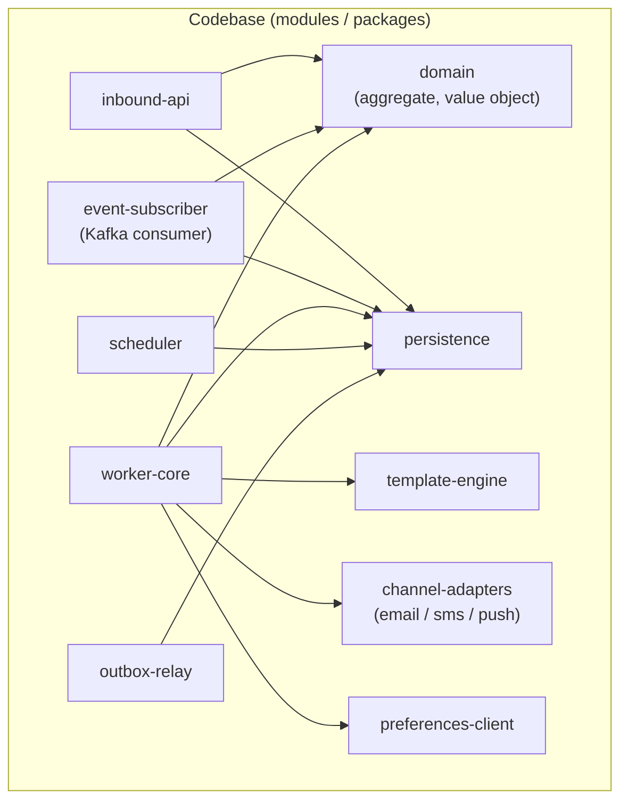
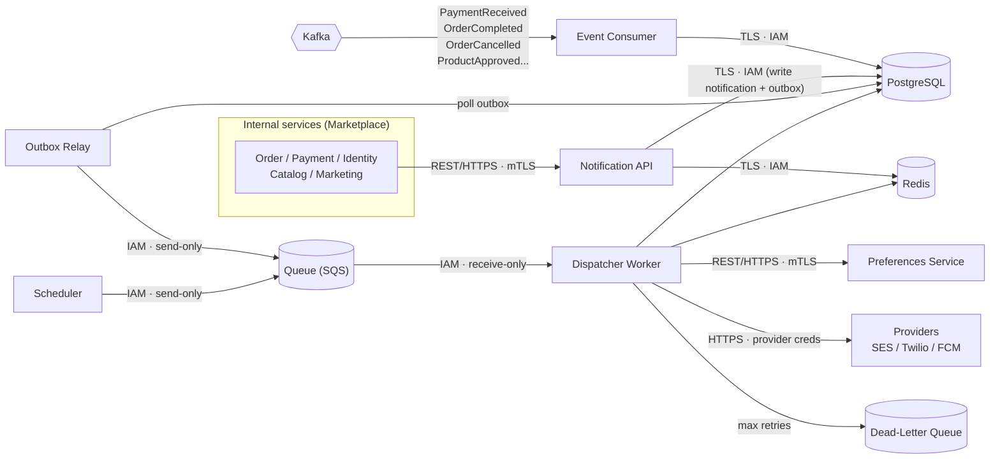
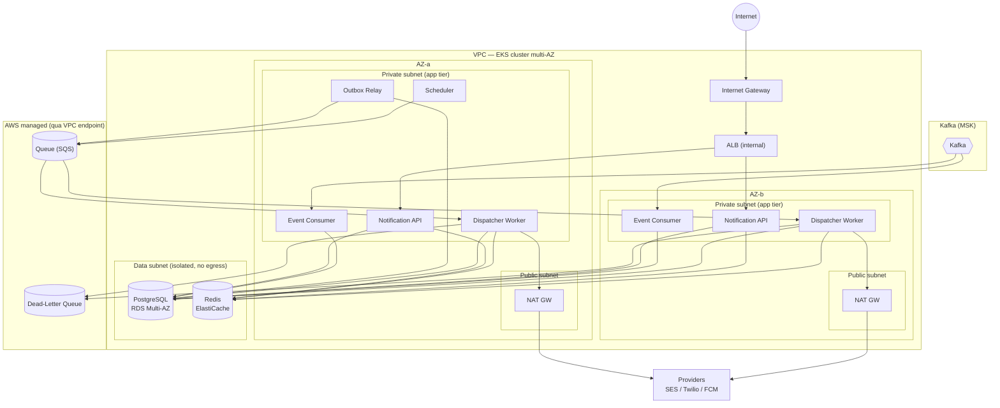
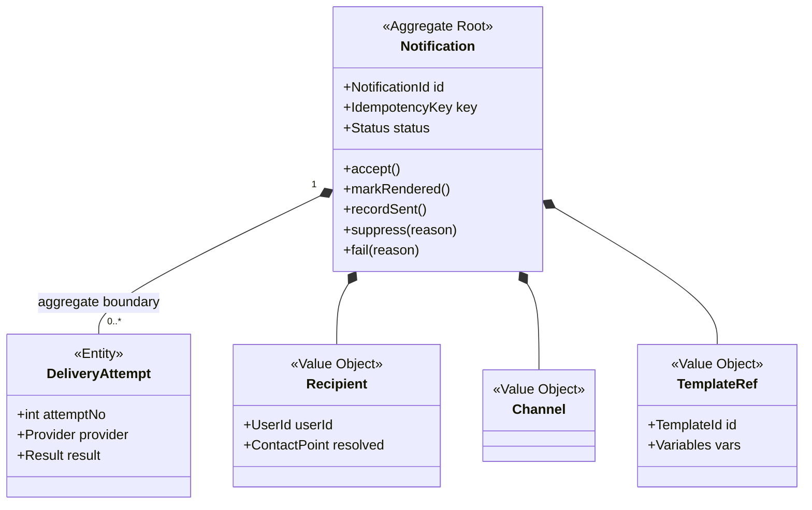
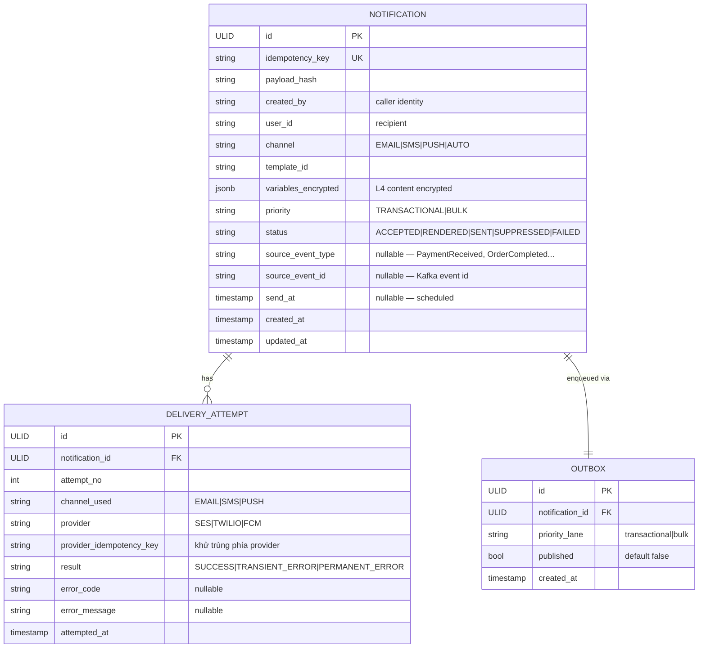

# Detailed Design — Notification Service (Marketplace)

> **Status:** Draft v1.0 ·
> **Owner:** Notification team ·
> **Reviewers:** _TBD_

**Liên kết:**
- [SDD-MKTPLACE-CORE-v1.0 — mục 3.1, 3.2, 4.3, 10](https://vin3s.atlassian.net/wiki/spaces/VARW/pages/2826666048)
- [Tech Spec Example - Notification Service](https://vin3s.atlassian.net/wiki/spaces/VARW/pages/2805236511) (template / reference)
- OpenAPI spec
- DB migrations (Flyway)
- IaC / Terraform

> **Classification**: **Tier 1 — Mission Critical** _(OTP fail → gián đoạn login/payment vốn là Tier 1 → đạt yếu tố tích hợp; SAD xếp Notification Tier 3 nhưng OTP path kéo lên Tier 1 — xem open question §9 về tách OTP context)_
>
> **Data class:** L4 (OTP) + L3 (email/phone, lịch sử gửi) · **System Owner:** Notification team ⇒ **RTO < 5 phút · RPO ~ 0** (§2) và **crypto-erase cho L4** (§4.3). Tiêu chuẩn: System Tiering · Data Classification.

---

# 1. Context & Scope

Notification Service là service nội bộ trong hệ thống Marketplace. Các service khác (Order, Payment, Identity, Catalog…) gọi vào hoặc phát event để gửi thông báo tới end-user (Buyer, Merchant, Admin) qua email / SMS / push. Service **không quyết định nghiệp vụ** khi nào nên gửi — nó nhận lệnh và gửi một cách tin cậy, tôn trọng preference và idempotency.

**Ranh giới bounded context:**

- **Vào (REST, mTLS):** `POST /v1/notifications` từ service nội bộ (Order, Payment, Identity, Catalog…).
- **Vào (Kafka):** subscribe các event cần gửi notification: `PaymentReceived`, `OrderCompleted`, `OrderCancelled`, `ProductApproved`, `ProductRejected`, `PayoutCompleted`.
- **Ra:** provider ngoài (SES / Twilio / FCM); gọi Preferences Service lấy opt-out/kênh ưa thích.
- **Không thuộc context:** soạn/quản lý template (Template Service / CMS), quản lý preference (Preferences Service), orchestration chiến dịch marketing (context khác — _gọi vào_ service này), nội dung email/SMS (caller cung cấp `templateId` + `variables`).

**Trust boundary:** mọi caller phải mang danh tính xác thực được (workload identity / mTLS / SVID), không được tin chỉ vì "ở trong VPC". Ranh giới tin cậy là theo danh tính, không theo subnet. Chi tiết cơ chế ở §3.2/§3.3/§4.

Ba ranh giới tin cậy:

- **(B1)** Caller → Notification API (dữ liệu ngoài vào) — mTLS + service identity.
- **(B2)** Worker → Provider (egress ra Internet) — HTTPS + provider creds.
- **(B3)** Callback Provider → service nếu chọn ADR-6 nhánh A (Internet vào) — verify webhook signature.

**Goals:**

- Nhận đồng bộ (`202 Accepted`), gửi bất đồng bộ — không mất notification đã accept.
- Đa kênh (email/SMS/push), template-based, fallback tuần tự khi `channel=AUTO`.
- Retry/backoff → DLQ khi provider lỗi.
- Idempotency (DB unique là thẩm quyền, Redis chỉ fast-path).
- Tôn trọng preference (opt-out → `SUPPRESSED`).
- Priority lanes (transactional > bulk) — OTP/xác nhận giao dịch không kẹt sau marketing.
- Scheduling cơ bản (`sendAt` tương lai).
- API & worker scale độc lập.

**Non-goals:**

- Không làm UI soạn template / quản lý preference.
- Không analytics nâng cao (open rate, click tracking — tương lai).
- Không exactly-once tuyệt đối (ADR-2).
- Không orchestration chiến dịch marketing (context khác gọi vào).
- Không quyết định _khi nào_ gửi — chỉ gửi khi được yêu cầu.

---

# 2. Requirements (tóm tắt — nguồn đầy đủ ở backlog)

**Functional:**

| # | Yêu cầu | Giải thích |
|---|---------|------------|
| FR1 | Đa kênh (email / SMS / push) | Cùng một notification có thể đi qua nhiều kênh tuỳ preference; thêm kênh mới chỉ cần thêm adapter (`channel-adapters`), không sửa luồng lõi |
| FR2 | Template render | Caller truyền `templateId` + `variables`; service tự render nội dung theo kênh — caller không cần biết format email/SMS/push. Biến thiếu → `422` |
| FR3 | Routing theo preference | Khi `channel=AUTO`: lấy danh sách kênh ưa thích từ Preferences, gửi fallback tuần tự (kênh đầu fail vĩnh viễn mới thử kênh kế) — luật nằm ở `domain`, dữ liệu do `preferences-client` cấp |
| FR4 | Tôn trọng opt-out | Trước khi gửi, kiểm user đã từ chối kênh này chưa; nếu rồi → `status=SUPPRESSED`, không gọi provider. Là nền tảng lawful basis cho `BULK` (compliance) |
| FR5 | Idempotency theo key | Caller gửi kèm `idempotencyKey`; trùng key + cùng payload → trả kết quả cũ (`200`), không gửi lại; trùng key + khác payload → `409` từ chối. DB unique là thẩm quyền, Redis chỉ fast-path (BN-1) |
| FR6 | Retry + backoff → DLQ | Provider lỗi tạm thời (5xx / timeout) → requeue với exponential backoff + jitter; vượt `max attempts` (§4.4) → chuyển DLQ + `status=FAILED` + alert. Kèm provider-side idempotency key chống double-send khi retry |
| FR7 | Scheduled send | Caller truyền `sendAt` (tương lai); Scheduler giữ job và đẩy vào queue đúng giờ, đúng priority lane. Due-once (không phát trùng) |
| FR8 | Rate limit per-user & per-provider | Chặn spam user (vd 5 msg / 60s → `429 + Retry-After`) và tôn trọng quota provider (tránh bị throttle/block). Đếm ở Redis |
| FR9 | Delivery status query | `GET /notifications/{id}` trả trạng thái hiện tại (`ACCEPTED → RENDERED → SENT | SUPPRESSED | FAILED`) |
| FR10 | Priority (transactional > bulk) | OTP / xác nhận giao dịch đi lane riêng, không kẹt sau hàng triệu marketing. Worker ưu tiên consume lane transactional trước |
| FR11 | Marketplace event-driven notifications | Subscribe Kafka events (`PaymentReceived`, `OrderCompleted`, `OrderCancelled`, `ProductApproved`, `ProductRejected`, `PayoutCompleted`) → tự tạo notification request tương ứng (resolve `userId`, chọn `templateId`, populate `variables`) |

**Non-functional / SLO (siết theo Tier 1 — xem block Classification):**

| Thuộc tính | Mục tiêu |
|-----------|---------|
| API latency (enqueue) | p99 < 200 ms |
| API availability | ≥ 99.95% _(Tier 1)_ |
| RTO / RPO | RTO < 5 phút · RPO ~ 0 _(Tier 1)_ |
| Delivery guarantee | at-least-once + dedup ≈ exactly-once |
| Durability | 0 mất mát với transactional đã `ACCEPTED` (đáp ứng RPO~0) |
| Degraded mode | provider chết ⇒ queue vẫn nhận, worker backoff |
| Throughput | bursty; API & worker scale độc lập |

> Vì xử lý L4 (OTP), ràng buộc về lưu trữ/xoá dữ liệu nằm ở §4.3; cơ chế đáp ứng RTO/RPO ở §6.

---

# 3. Design overview

## 3.1 Module view (cấu trúc tĩnh — code chia ra sao)



| Module | Trách nhiệm | Không được thực hiện |
|--------|-------------|---------------------|
| `inbound-api` | Kết thúc HTTP `POST /v1/notifications` + `GET /v1/notifications/{id}`; Authn (verify mTLS/SVID identity) + authz (scope, recipient binding); Validate request; điều phối use-case _nhận_: quyết idempotency (Redis fast-path → DB thẩm quyền, tính `payload_hash`, trả 202/200/409) | Gọi provider; chứa luật gửi/routing (AUTO, opt-out); enqueue trực tiếp (việc của relay); tin `sender` từ body; chứa SQL |
| `event-subscriber` | Consume Kafka events (`PaymentReceived`, `OrderCompleted`, `OrderCancelled`, `ProductApproved`, `ProductRejected`, `PayoutCompleted`); map event → notification request (resolve `userId`, chọn `templateId`, populate `variables`); gọi `inbound-api` logic (hoặc trực tiếp `persistence` + `domain`) để tạo notification. Commit offset sau xử lý | Gọi provider; chứa luật gửi/routing; render template |
| `domain` | `Notification` aggregate + value object; cưỡng chế invariant (status một chiều & terminal bất biến; `idempotencyKey` immutable; không `recordSent` lên kênh đã opt-out → buộc `suppress`; `attemptNo` ≤ max trước `fail`); luật resolve AUTO (thứ tự kênh, fallback tuần tự); ubiquitous language | Biết HTTP / DB / queue / provider; làm I/O; phụ thuộc module khác |
| `template-engine` | Render nội dung theo kênh từ `templateId` + `variables`; Escape theo kênh (HTML cho email…) chống injection/SSTI; Báo lỗi khi thiếu biến template yêu cầu (→ 422) | Chứa luật gửi/routing; chọn kênh; persist; gọi provider; cho phép logic tuỳ ý trong template |
| `channel-adapters` | Dịch message đã render sang API từng provider (SES/Twilio/FCM); Đính kèm provider-side idempotency key; Map response provider → lỗi _tạm thời_ vs _vĩnh viễn_; Dùng provider creds từ secret store | Chứa luật nghiệp vụ (routing/opt-out/chính sách retry); tự quyết có gửi hay không; persist |
| `preferences-client` | Gọi Preferences Service (mTLS, service identity) lấy opt-out + thứ tự kênh ưa thích; Cache có TTL; áp chính sách fail-open/fail-closed khi Preferences down (ADR-3) | Sở hữu/định nghĩa dữ liệu preference (source of truth ở Preferences Service); tự quyết định routing (chỉ cấp dữ liệu cho luật ở `domain`) |
| `scheduler` | Với notification có `sendAt` tương lai: giữ và khi đến hạn đẩy vào queue (đúng priority lane); đảm bảo due-once | Gửi trực tiếp / gọi provider; render; chứa luật routing/opt-out; phát trùng (double-emit) |
| `outbox-relay` | Poll `outbox WHERE published=false` (hoặc CDC), enqueue theo priority lane, mark `published=true`; at-least-once vào queue | Chứa luật nghiệp vụ; gọi provider; render; làm thẩm quyền dedup (DB unique mới là) |
| `persistence` | Repository cho `notification`/`outbox`/`delivery_attempt`; cưỡng chế UNIQUE `idempotency_key` (thẩm quyền dedup) + `payload_hash`; cung cấp transaction ghi `notification`+`outbox` atomic; hook encryption-at-rest / xử lý theo data class | Chứa luật nghiệp vụ/invariant (ở `domain`); quyết routing/gửi; gọi provider/queue |
| `worker-core` | Consume queue; điều phối use-case _gửi_: load notification → check opt-out (`preferences-client`) → `suppress`, resolve AUTO (áp luật `domain`), render (`template-engine`), gửi (`channel-adapters`) kèm idempotency key, đọc kết quả, retry/backoff (§4.4), quá max → DLQ + `FAILED`; cập nhật status qua `persistence` | Gọi provider trực tiếp (chỉ qua `channel-adapters`); chứa code riêng từng provider; sở hữu dữ liệu preference; lách invariant khi đổi status |

**Behavior notes:**

> **BN-1 · Idempotency resolution** (`inbound-api` + `persistence`): Redis (fast-path, có TTL) và DB unique phải nhất quán qua cả crash lẫn TTL-expiry.
>
> ```
> on POST(idempotencyKey, payload):
>   h = hash(payload)
>   if redis.get(key) == hit: return cached        # fast-path
>   try: INSERT notification(key UNIQUE, payload_hash=h, created_by=caller)  # DB = thẩm quyền
>   catch unique_violation:
>       row = SELECT by key                          # Redis miss sau TTL vẫn an toàn nhờ bước này
>       return 200 if row.payload_hash == h else 409 # khác payload ⇒ 409, không ghi đè
>   redis.set(key, result, TTL)  # best-effort; mất Redis KHÔNG mất tính đúng
>   return 202
> ```
>
> Bất biến: DB là nguồn sự thật; Redis chỉ tăng tốc. Không đảo thứ tự (set Redis trước insert ⇒ key trỏ vào row chưa tồn tại nếu crash).

> **BN-2 · Event-to-notification mapping** (`event-subscriber`): Mỗi Kafka event type được map cố định sang `templateId` + `variables` + `recipient`. Ví dụ: `OrderCompleted{orderId, buyerId, merchantId, items[]}` → 2 notification: (1) Buyer nhận email "Đơn hàng hoàn tất" (`templateId=order_completed_buyer`), (2) Merchant nhận email "Đơn hàng hoàn tất — chuẩn bị nhận payout" (`templateId=order_completed_merchant`). Mapping bảng ở §4.1.2. Idempotency key = `{eventType}:{eventId}:{recipientRole}`.

## 3.2 C&C view (cấu trúc runtime)



**Connector catalog (zero-trust: mỗi connector có authn/authz, không chỉ giao thức):**

| Connector | From → To | Protocol | Authn / Authz |
|-----------|-----------|----------|---------------|
| inbound | Caller → Notification API | REST/HTTPS | mTLS (SVID); authz theo scope caller |
| event-sub | Kafka → Event Consumer | Kafka protocol | SASL/mTLS; consumer group `notification-event-consumer` |
| state | Notification API / Event Consumer → PostgreSQL | TLS (JDBC) | IAM-auth / creds rotate qua Secrets Manager; role least-priv (write notification+outbox) |
| dedup/rate | API / Worker → Redis | TLS | auth token / IAM; least-priv |
| outbox poll | Outbox Relay → PostgreSQL | TLS (JDBC) | IAM-auth; role read outbox + mark published |
| enqueue | Outbox Relay / Scheduler → Queue | SDK/HTTPS | IRSA, IAM send-only vào đúng queue |
| consume | Queue → Dispatcher Worker | SDK/HTTPS | IRSA, IAM receive-only |
| prefs | Dispatcher Worker → Preferences | REST/HTTPS | mTLS + service identity; authz |
| egress | Dispatcher Worker → Providers | HTTPS | provider creds từ Secrets Manager; chỉ qua NAT |

**View-to-view mapping (module ↦ runtime component):**

| Module | Nằm trong runtime component |
|--------|----------------------------|
| `inbound-api` | Notification API |
| `event-subscriber` | Event Consumer |
| `domain`, `persistence` | Notification API + Event Consumer + Dispatcher Worker + Scheduler + Outbox Relay (dùng chung) |
| `template-engine`, `channel-adapters`, `preferences-client`, `worker-core` | Dispatcher Worker |
| `scheduler` (module) | Scheduler (component) |
| `outbox-relay` (module) | Outbox Relay (component) |

> _Queue, Redis, DLQ, PostgreSQL_ là component runtime nhưng không có module nào trong codebase của ta — chúng là hạ tầng/managed. Ngược lại `template-engine`/`channel-adapters` là module nhưng không là box riêng trong C&C (chúng nằm trong Worker). Ánh xạ không phủ kín hai chiều → đó là lý do Module view ≠ C&C view.

## 3.3 Deployment view (chạy ở đâu — VPC / AZ / EKS)



> **Nhất quán tên:** node trong deployment = đúng tên component runtime ở §3.2. Mỗi Deployment thực tế trải cả hai AZ — AZ-b vẽ gọn cho đỡ rối, không có nghĩa Relay/Scheduler chỉ ở một AZ.

**Thực thi zero-trust ở tầng deploy** (identity-first; chỉ biểu diễn phần khác mặc định platform):

- Network tiering là defense-in-depth, KHÔNG phải cơ sở tin cậy. Private subnet _không_ đồng nghĩa được tin: ngay cả call nội bộ (Worker→Preferences, app→data) vẫn phải xác thực + authorize theo danh tính (xem connector catalog §3.2). SG/NetworkPolicy chỉ là lớp phòng thủ bổ sung.
- NetworkPolicy default-deny; chỉ mở đúng đường: internal services → Notification API, Kafka → Event Consumer, app→data, app→NAT.
- Workload identity qua IRSA — mỗi Deployment (Notification API / Event Consumer / Dispatcher Worker / Scheduler / Outbox Relay) một ServiceAccount + IAM role least-privilege riêng; không long-lived credentials trong image/env.
- Secret (provider creds, DB) trong Secrets Manager, rotate; inject runtime.
- Egress ra provider chỉ qua NAT GW (whitelist IP được); data subnet không egress.
- PII (email/phone): TLS toàn tuyến + encryption at-rest (RDS/Redis); log mask PII.
- EKS trải ≥2 AZ; API / Event Consumer / Worker / Scheduler / Relay là Deployment riêng → HPA scale độc lập. SQS/SES managed (qua VPC endpoint).

---

# 4. Interfaces & data

> **Nguồn sự thật:** contract đầy đủ ở **OpenAPI spec**; schema ở **DB migrations**. Dưới đây chỉ giữ ngữ nghĩa quan trọng.

## 4.1 API

### 4.1.1 `POST /v1/notifications`

```json
// request
{
  "idempotencyKey": "uuid",
  "userId": "string",
  "channel": "EMAIL|SMS|PUSH|AUTO",
  "templateId": "string",
  "variables": {
    "buyerName": "Nguyễn Văn A",
    "orderId": "ORD-123",
    "totalAmount": "1,500,000 VND",
    "trackingNumber": "VN789456"
  },
  "priority": "TRANSACTIONAL|BULK",
  "sendAt": "RFC3339?"
}

// 202 { "id": "...", "status": "ACCEPTED" }       // request mới
// 200 { "id": "...", ... }                          // idempotencyKey trùng + payload khớp ⇒ trả kết quả cũ
```

#### Mã lỗi:

| Code | Khi nào |
|------|---------|
| `400` | Sai schema / thiếu field bắt buộc |
| `401 / 403` | Thiếu/không hợp lệ identity · scope không cho phép `priority`/`templateId` |
| `409` | `idempotencyKey` trùng nhưng payload khác bản ghi cũ → từ chối, không ghi đè |
| `422` | `templateId` không tồn tại / `variables` thiếu biến template yêu cầu |
| `429` | Vượt rate-limit (per-user / per-caller) — kèm `Retry-After` |
| `503` | Không bền hoá được (DB/queue down) — caller retry an toàn nhờ idempotencyKey |

#### Channel resolution khi `channel=AUTO`

Lấy danh sách kênh ưa thích từ Preferences theo thứ tự; gửi tuần tự fallback — kênh đầu fail vĩnh viễn (hard-bounce/không có địa chỉ) mới thử kênh kế; không gửi song song nhiều kênh cho cùng một notification. Hết kênh khả dụng ⇒ `status=FAILED`.

#### Authz model:

| Scope | Cho phép | Ràng buộc |
|-------|---------|-----------|
| `notif:send:transactional` | gửi `priority=TRANSACTIONAL` | chỉ `templateId` trong allow-list của caller |
| `notif:send:bulk` | gửi `priority=BULK` | rate-limit chặt hơn |
| `notif:read:own` | `GET /notifications/{id}` | chỉ notification do chính caller tạo |

- **Chống sender spoofing:** `sender` (caller) lấy từ identity đã xác thực, _không_ từ body — caller A không được gửi "nhân danh" service B. Mọi notification gắn `created_by = caller identity`.
- **Recipient binding (chống lạm dụng/phishing):** caller chỉ được gửi tới `userId` mà nghiệp vụ của nó có quan hệ; không cho gửi tới userId tuỳ ý. Quan hệ này do Authorization policy (SAD/OPA) quyết, component enforce rồi từ chối `403` nếu vi phạm.
- **IDOR trên read:** `GET /notifications/{id}` phải kiểm `created_by == caller` (scope `notif:read:own`); thiếu kiểm này ⇒ caller đọc trạng thái/nội dung notification của người khác.
- **Authn:** mTLS (SVID); không suy tin cậy từ source IP. Call ra Preferences mang service identity riêng của Worker.

### 4.1.2 Marketplace Event → Notification mapping

| Kafka Event | Publisher | Template (Buyer) | Template (Merchant) | Variables |
|-------------|----------|-----------------|--------------------|-----------| 
| `PaymentReceived` | Payment | `payment_received_buyer` | `payment_received_merchant` | orderId, amount, currency, paidAt |
| `OrderCompleted` | Order | `order_completed_buyer` | `order_completed_merchant` | orderId, items[], totalAmount, completedAt |
| `OrderCancelled` | Order | `order_cancelled_buyer` | `order_cancelled_merchant` | orderId, reason, cancelledAt |
| `ProductApproved` | Catalog | — | `product_approved_merchant` | productId, productName |
| `ProductRejected` | Catalog | — | `product_rejected_merchant` | productId, productName, rejectReason |
| `PayoutCompleted` | Payment | — | `payout_completed_merchant` | payoutId, amount, bankLast4, paidAt |
| (Identity OTP) | Identity | `otp_verify` | — | otpCode, expiresIn |

> Idempotency key cho event-driven notification: `{eventType}:{eventId}:{recipientRole}` — đảm bảo cùng event + cùng recipient không tạo notification trùng.

#### Yếu tố quan trọng cần tuân thủ:

- **Idempotency** — thẩm quyền là DB, Redis chỉ là fast-path. `idempotency_key` có unique constraint trên PostgreSQL = source of truth (vĩnh viễn). Redis chỉ là cache tăng tốc (TTL ~24h); Redis miss ⇒ rơi xuống DB chứ không coi là "mới".
- **Delivery semantic** — at-least-once ở mỗi tầng. Dedup theo `idempotency_key` chỉ chống trùng lúc nhận (ingest); để tiệm cận exactly-once cần thêm provider-side idempotency key ở tầng gửi (§5.2). Vẫn không tuyệt đối (ADR-2).
- **Accept ≠ Sent:** `202` = "đã nhận & bền hoá", không phải "đã gửi". Trạng thái cuối tra `GET /v1/notifications/{id}`.

## 4.2 Domain model (DDD — _hành vi & invariant_, KHÔNG phải lưu trữ)

> Domain model ≠ ERD (§4.3): ERD nói _lưu thế nào_; domain model nói _quy tắc & hành vi_. Aggregate root `Notification` là nơi cưỡng chế invariant; thuật ngữ ở đây là ubiquitous language — trùng với tên module/code.



**Invariant** (phần lõi của domain model — thực thi trong aggregate, không rải ở worker):

- Status tiến một chiều `ACCEPTED → RENDERED → (SENT | SUPPRESSED | FAILED)`; trạng thái terminal bất biến.
- Không `recordSent` lên kênh user đã opt-out → buộc `suppress`.
- `IdempotencyKey` immutable sau khi tạo.
- `DeliveryAttempt` chỉ sinh trong aggregate boundary; `attemptNo` ≤ max attempts (§4.4) trước khi `fail`.

**Aggregate boundary:** `DeliveryAttempt` thuộc aggregate `Notification` (cùng vòng đời, chỉ sửa qua root). `Recipient`, `Channel`, `TemplateRef`, `Status` là value object.

> `outbox` KHÔNG có ở đây — nó là cơ chế tích hợp/persistence (chỉ xuất hiện ở ERD §4.3), không phải khái niệm nghiệp vụ.

## 4.3 Data model — ERD



**Nghĩa cột load-bearing:**

| Cột | Ý nghĩa |
|-----|---------|
| `idempotency_key` (UK) | Thẩm quyền dedup vĩnh viễn; trùng key + khác `payload_hash` ⇒ `409` |
| `created_by` | Caller identity (lấy từ authn, không từ body) — chống spoofing, dùng cho authz read |
| `payload_hash` | Phát hiện trùng-key-khác-payload |
| `variables_encrypted` | L4 content (OTP) mã hóa AES-256/KMS; decrypt chỉ khi render |
| `outbox.published` | `false` = chờ relay đẩy vào queue (§5.1) |
| `outbox.priority_lane` | Phân luồng transactional vs bulk |
| `provider_idempotency_key` | Khử trùng phía provider khi worker retry (§5.2) |
| `status` | Máy trạng thái — terminal bất biến (luật ở domain model §4.2) |
| `source_event_type` + `source_event_id` | Traceability: notification này sinh từ event nào (Marketplace-specific) |

> ERD là phép chiếu lưu trữ của domain model, không 1-1: `outbox` chỉ có ở ERD; value object như `Recipient` bị phẳng hoá thành cột (`user_id`…).

**Xử lý theo data class:**

- **L4 (OTP / nội dung nhạy cảm):** không persist plaintext. OTP chỉ giữ transient trong Redis với TTL ngắn; nếu buộc lưu → **AES-256** + **cryptographic erasure** (xoá khoá) thay vì xoá bản ghi. `variables` chứa giá trị L4 không được ghi vào log/DB dạng rõ.
- **L3 (email/phone, lịch sử gửi):** mã hoá at-rest; retention theo luật (vd 5 năm) — soft-delete trước hard-delete.
- **Key management (L4):** khoá ở KMS, dùng envelope encryption (data key được KMS bọc); decrypt giới hạn theo IAM role của đúng component (Worker decrypt để render, không service nào khác); rotation định kỳ; crypto-erase = huỷ data key.
- **DLQ & bảng log cũng là kho L4/L3:** message trong DLQ chứa payload đã render (có thể là OTP/PII) ⇒ DLQ phải encrypt at-rest, không log nội dung khi replay.
- Log mask mọi PII.

## 4.4 Config & tunables

| Tham số | Khởi điểm | Ghi chú |
|---------|-----------|---------|
| Idempotency TTL (Redis) | 24h | DB unique vẫn là thẩm quyền vĩnh viễn |
| Max delivery attempts | 5 | hết → DLQ + `status=FAILED` |
| Retry backoff | exponential, base 2s, cap 5m, jitter | per provider |
| Provider call timeout | 10s | quá → coi lỗi tạm thời, retry |
| Queue visibility timeout | ≥ 2× provider timeout | tránh double-pickup |
| Worker concurrency | per-lane riêng | transactional lane ưu tiên |
| Rate limit per-user | 5 msg / 60s | trả `429 + Retry-After` |
| Rate limit per-caller | configurable per service | Order Svc vs Marketing có quota khác |
| Outbox relay poll | 1s (hoặc CDC) | đẩy `published=false` vào queue |
| Event consumer concurrency | 4 partitions | scale theo Kafka partition count |
| Preferences cache TTL | 5 min | trade-off freshness vs load |

## 4.5 Personal data handling

> Chính sách/lawful-basis/RoPA thuộc governance/SAD → chỉ link. Dưới đây là **delta mà chỉ component này trả lời được**.

**Data inventory:**

| Data element | Class | Nguồn | Lưu ở đâu | Mục đích | Retention | Rời service đi đâu |
|-------------|-------|-------|-----------|---------|-----------|-------------------|
| email / phone | L3 | caller / Preferences | PG (enc) · Redis (transient) | địa chỉ gửi notification | 5 năm → soft→hard delete | Provider (SES/Twilio) — processor |
| OTP / nội dung đã render | L4 | caller (Identity) | không persist · DLQ (enc, nếu lỗi) | nội dung gửi | crypto-erase · TTL ngắn | Provider |
| `user_id` | L3 | caller | PG | định danh người nhận | theo notification | — |
| `created_by` · audit đọc | L2 | identity | PG · log | truy vết / authz | theo log-retention | — |
| delivery status | L3 | provider / worker | PG | FR9 tracking | 5 năm | caller (qua `GET`) |
| order/payment variables | L2 | Order/Payment event | PG (enc) | render template | theo notification | — |

**Delta privacy:**

- **Third-party sharing & cross-border:** gửi email/phone sang SES/Twilio là transfer cho processor ⇒ cần DPA; nếu provider ở ngoài khu vực ⇒ cross-border, cần SCC.
- **DSAR / right-to-erasure:** crypto-erase L4; email/phone trong delivery log xoá/anonymize theo quy trình; dữ liệu đã đẩy sang provider — kiểm khả năng gọi API xoá phía họ (open question §9).
- **Consent/opt-out:** FR4 = nền tảng lawful basis cho `BULK`; mask PII trong log.

**Privacy anchor index:**

| Khía cạnh privacy | Ở đâu trong LLD |
|-------------------|-----------------|
| Inventory / purpose / sharing | §4.5 bảng trên |
| Encryption / crypto-erase / key mgmt | §4.3 |
| Consent / opt-out (lawful basis) | FR4 (§2) · luồng `SUPPRESSED` (§5.2) |
| Minimization (mask, no-plaintext) | §4.3 · §7 input/log hardening |
| Audit (ai đọc PII) | §4.3 |

---

# 5. Key flows

> Sequence ở mức C&C view — lifeline là runtime component, không phải module.

## 5.1 Nhận & enqueue (đồng bộ + transactional outbox)

> Persist `notification` và `outbox` trong **cùng một transaction**, rồi **Outbox Relay** đẩy ra queue. Tránh dual-write: nếu crash sau commit, relay vẫn đẩy được → **không mất** notification đã `ACCEPTED` (đáp ứng RPO~0).

```mermaid
sequenceDiagram
  participant C as Caller (Order/Payment/Identity)
  participant API as Notification API
  participant R as Redis
  participant DB as PostgreSQL
  participant RL as Outbox Relay
  participant Q as Queue (SQS)

  C->>API: POST /v1/notifications (mTLS, idempotencyKey…)
  API->>API: authn/authz (verify SVID + scope)
  API->>R: fast-path check idempotencyKey
  alt Redis hit
    R-->>API: tồn tại → trả kết quả cũ
    API-->>C: 200 (id cũ)
  else miss → tra DB (thẩm quyền)
    API->>DB: BEGIN; INSERT notification (UNIQUE idempotency_key) + outbox(priority_lane); COMMIT
    alt unique conflict
      DB-->>API: trùng key
      API->>DB: SELECT by key
      alt payload_hash khớp
        API-->>C: 200 (id cũ — idempotent)
      else payload_hash khác
        API-->>C: 409 Conflict
      end
    else mới
      DB-->>API: ok
      API->>R: set key (TTL 24h, best-effort)
      API-->>C: 202 Accepted (id)
    end
  end

  Note over RL,Q: bất đồng bộ, tách khỏi request
  RL->>DB: poll outbox WHERE published=false
  RL->>Q: enqueue theo priority lane (transactional | bulk)
  RL->>DB: mark published=true
```

## 5.2 Gửi với retry → DLQ (bất đồng bộ)

> Worker gửi kèm provider-side idempotency key (suy ra từ `notification.id` + attempt-group) để provider tự khử trùng khi Worker retry sau timeout.

```mermaid
sequenceDiagram
  participant Q as Queue (SQS)
  participant W as Dispatcher Worker
  participant P as Preferences Service
  participant DB as PostgreSQL
  participant Prov as Provider (SES/Twilio/FCM)
  participant DLQ as Dead-Letter Queue

  Q->>W: deliver message
  W->>DB: load notification (status, channel, templateId, variables)
  W->>P: get prefs / opt-out (mTLS, service identity)

  alt opted-out
    W->>DB: status=SUPPRESSED; INSERT delivery_attempt(result=SUPPRESSED)
  else cho phép
    W->>W: resolve channel (if AUTO → fallback list from prefs)
    W->>W: render template + escape variables (chống injection/SSTI)
    W->>DB: status=RENDERED
    W->>Prov: send (HTTPS, provider creds, Idempotency-Key)
    alt thành công
      Prov-->>W: 2xx
      W->>DB: status=SENT; INSERT delivery_attempt(result=SUCCESS)
    else lỗi tạm thời (5xx/timeout)
      Prov-->>W: lỗi
      W->>DB: INSERT delivery_attempt(result=TRANSIENT_ERROR, error_code)
      alt attempt < max_attempts
        W->>Q: requeue + backoff (attempt++)
      else attempt >= max_attempts
        W->>DLQ: move to DLQ
        W->>DB: status=FAILED
        Note over W: alert: DLQ depth++
      end
    else lỗi vĩnh viễn (hard bounce / invalid address)
      alt channel=AUTO && còn kênh fallback
        W->>W: thử kênh kế tiếp
      else hết kênh
        W->>DB: status=FAILED; INSERT delivery_attempt(result=PERMANENT_ERROR)
      end
    end
  end
```

## 5.3 Event-driven notification (Marketplace-specific)

```mermaid
sequenceDiagram
  participant K as Kafka
  participant ESUB as Event Consumer
  participant DB as PostgreSQL
  participant RL as Outbox Relay
  participant Q as Queue (SQS)

  K->>ESUB: OrderCompleted{eventId, orderId, buyerId, merchantId, items[]}

  Note over ESUB: Map event → 2 notifications (Buyer + Merchant)

  loop mỗi recipient (Buyer, Merchant)
    ESUB->>ESUB: generate idempotencyKey = "OrderCompleted:{eventId}:buyer" / ":merchant"
    ESUB->>ESUB: resolve templateId, variables from event payload
    ESUB->>DB: BEGIN; INSERT notification(idempotencyKey, userId, templateId, variables, priority=TRANSACTIONAL, source_event_type, source_event_id) + outbox; COMMIT
    alt unique conflict (idempotent)
      Note over ESUB: skip — đã tạo notification cho event này
    end
  end

  ESUB->>K: commit offset

  Note over RL,Q: Outbox Relay đẩy vào queue như flow thường
  RL->>DB: poll outbox
  RL->>Q: enqueue
```

---

# 6. Operations & Resilience

> Chiến lược DR và pipeline tooling cấp platform xem [SDD-MKTPLACE-CORE-v1.0](https://vin3s.atlassian.net/wiki/spaces/VARW/pages/2826666048) — dưới đây chỉ delta của component.

**Backup & Recovery (delta — Tier 1):**

- **PostgreSQL** (delivery log — L3/L4): bật PITR; Multi-AZ + automated failover → RTO < 5m · RPO ~ 0. Test-restore định kỳ.
- **Redis** (dedup / rate-limit — ephemeral): không backup — mất chấp nhận được (dedup rebuild từ DB `idempotency_key`; rate-limit reset an toàn).
- **Queue / DLQ**: dựa vào durability của SQS managed; DLQ có quy trình replay thủ công/bán-tự-động.
- Retention/deletion theo §4.3: L4 → crypto-erase, L3 → 5 năm, soft→hard delete.

**CI/CD (delta — Tier 1):**

- DB migration backward-compatible (expand/contract), tách khỏi deploy code → rollback an toàn.
- Deploy strategy: rolling/blue-green với health gate; drain in-flight message của Worker trước khi shutdown — không mất notification đang xử lý.
- Secret inject từ Secrets Manager qua pipeline, không bake vào image.
- Contract API/event versioned + kiểm backward-compat ở pipeline trước khi rollout.
- **Template changes:** template mới/sửa cần review trước deploy — tránh injection vector.

**Degraded mode:**

- **Provider chết:** queue vẫn nhận; Worker backoff + retry; quá max → DLQ. Notification không mất nhưng trễ.
- **Kafka lag:** event-driven notification chậm; caller trực tiếp (REST) không bị ảnh hưởng.
- **Preferences Service down:** áp chính sách fail-open cho transactional (gửi kênh mặc định), fail-closed cho bulk (suppress → không spam khi không biết opt-out). Xem ADR-3.
- **DB down:** API trả 503; Worker dừng; queue giữ message cho đến khi DB phục hồi.
- **Redis down:** API chậm hơn (rơi xuống DB cho dedup check); rate-limit tạm mất → accept nhiều hơn bình thường (có thể chấp nhận ngắn hạn).

---

# 7. Decisions & cross-cutting deltas (ADR-style)

**ADR-1 — Async delivery qua durable queue.** Tách latency provider khỏi caller, cho degraded mode, scale worker độc lập. _Đã loại:_ gửi sync (caller chịu latency & mất mát khi provider chậm/chết).

**ADR-2 — At-least-once + dedup hai tầng (thay vì exactly-once).** Exactly-once phân tán đắt/giòn. Đạt "đủ tốt" bằng dedup ingest (`idempotency_key`, §4.1) + provider-side idempotency key lúc gửi (§5.2). _Hệ quả:_ vẫn còn khả năng trùng hiếm → caller/template phải chịu được.

**ADR-3 — Phụ thuộc Preferences Service.** Giữ bounded context sạch; opt-out source-of-truth ở nơi khác. _Hệ quả:_ thêm dependency runtime ở luồng gửi; cần cache + chiến lược khi Preferences chết. _Quyết định:_ fail-closed cho BULK (không gửi marketing khi không biết opt-out — compliance safe); fail-open cho TRANSACTIONAL (gửi OTP/xác nhận giao dịch qua kênh mặc định — UX > strict compliance trong window ngắn). Cần chốt cuối cùng (§9).

**ADR-4 — Priority lanes (transactional vs bulk).** OTP/transactional không kẹt sau marketing. _Thực hiện:_ lane riêng trên SQS, worker ưu tiên transactional lane.

**ADR-5 — Transactional outbox cho enqueue (thay vì dual-write DB + queue).** Dual-write có cửa sổ mất message giữa commit DB và enqueue, vi phạm RPO~0. Outbox + relay at-least-once vào queue. _Hệ quả:_ thêm bảng `outbox` + relay; message vào queue trễ ~1 chu kỳ poll.

**ADR-6 — Provider delivery callback (CHƯA CHỐT).** FR9 cần trạng thái _delivered/bounced_, mà API gửi chỉ xác nhận _accepted_; trạng thái cuối về qua webhook.

- _Nhánh A — nhận callback:_ mở inbound từ Internet qua ALB → verify webhook signature + chống replay. Thêm inbound path vào C&C/deployment.
- _Nhánh B — polling status API:_ không thêm inbound, nhưng trễ hơn và tốn quota.
- _Khuyến nghị:_ nhánh A (realtime); cần chốt trước khi cập nhật sơ đồ.

**ADR-7 — Event Consumer tách riêng (Marketplace-specific).** Thay vì để Kafka consumer nằm trong Notification API, tách thành **Event Consumer** component riêng. _Lý do:_ scale độc lập (event lag ≠ API load); failure isolation (consumer crash không ảnh hưởng REST API); event mapping logic có thể phức tạp (1 event → N notifications). _Hệ quả:_ thêm 1 Deployment; share `domain` + `persistence` module.

**Cross-cutting deltas:**

- **Input / template hardening (security, Tier 1):** `variables` do caller cấp được render vào nội dung → escape theo kênh (HTML-escape cho email, tránh SSTI ở template engine, chống header/SMS injection). Template chỉ cho phép placeholder, không logic tuỳ ý.
- **Reliability/alert:** alert khi DLQ depth > ngưỡng, provider error-rate vượt mức, outbox lag (`published=false` tồn đọng), event consumer lag (Kafka consumer group lag) — bốn tín hiệu sự cố sớm nhất.
- **Observability:** metric `sent/failed/suppressed` (per channel, per template, per source_event_type), provider latency p99, queue lag, outbox lag, event consumer lag; trace xuyên Kafka event → Event Consumer → API → Relay → Worker → Provider.

**Zero-trust — anchor index:**

| Nguyên tắc (SAD) | Thực thi trong LLD này |
|-------------------|------------------------|
| Identity, không theo mạng | §1 trust boundary · §3.2 connector catalog (mTLS/SVID trên mọi cạnh) · §4.1 authz model |
| Least privilege | §3.3 IRSA role riêng từng Deployment · IAM send-only/receive-only ở §3.2 · KMS decrypt theo role ở §4.3 |
| Assume breach / defense-in-depth | §3.3 NetworkPolicy default-deny + tiering là lớp phụ, không phải cơ sở tin cậy |
| No long-lived creds | §3.3 Secrets Manager + rotate; không creds trong image |
| Protect data | §3.3/§4.3 TLS toàn tuyến, encryption at-rest (gồm DLQ), envelope encryption + crypto-erase cho L4, mask PII |

**Trust boundary & threat seed:**

| Threat (STRIDE) | Bề mặt | Đối ứng |
|----------------|--------|---------|
| **S**poofing | caller giả danh service khác | identity từ authn, `created_by` không lấy từ body (§4.1) |
| **T**ampering | sửa payload trên đường / webhook giả | mTLS/TLS; verify webhook signature (ADR-6) |
| **R**epudiation | chối đã gửi gì | audit `created_by` + delivery_attempt (§4.3) |
| **I**nfo disclosure | đọc OTP/PII trong DB/DLQ/log | IDOR check, DLQ encrypt, mask, KMS (§4.1/§4.3) |
| **D**oS | spam gửi / flood callback | rate-limit per-caller (§4.4), rate-limit webhook |
| **E**levation | dùng scope vượt quyền | scope + recipient binding (§4.1) |

---

# 8. Test strategy

> Hexagonal + dependency rule (§3.1) cho phép test phần lớn không cần infra.

- **Unit** (`domain`): luật nghiệp vụ thuần: status machine (ACCEPTED → RENDERED → SENT/SUPPRESSED/FAILED); channel-resolution AUTO (fallback tuần tự); opt-out → buộc suppress; attemptNo ≤ max. Không cần DB/queue/provider.
- **Contract test:** API contract vs OpenAPI; Kafka event schema contract với Order/Payment/Catalog (consumer-driven); consumer-driven với Preferences Service (mock theo contract).
- **Integration:** outbox → relay → queue → worker với fake provider; DB unique-constraint dedup; event consumer → notification creation (end-to-end with embedded Kafka).
- **Failure-injection:** provider 5xx/timeout → retry/backoff → DLQ; crash giữa commit và relay → notification vẫn được gửi (kiểm RPO~0); Preferences down → fail-open/fail-closed tuỳ priority.

> ⚠️ **Lưu ý:** Nội dung trang gốc bị cắt ngang tại đây (§8 chưa hoàn chỉnh). Các mục còn thiếu có thể bao gồm thêm test cases, §9 Open questions, và bảng tóm tắt nội dung bổ sung. Trang trên Confluence hiện ở trạng thái Draft v1.0.