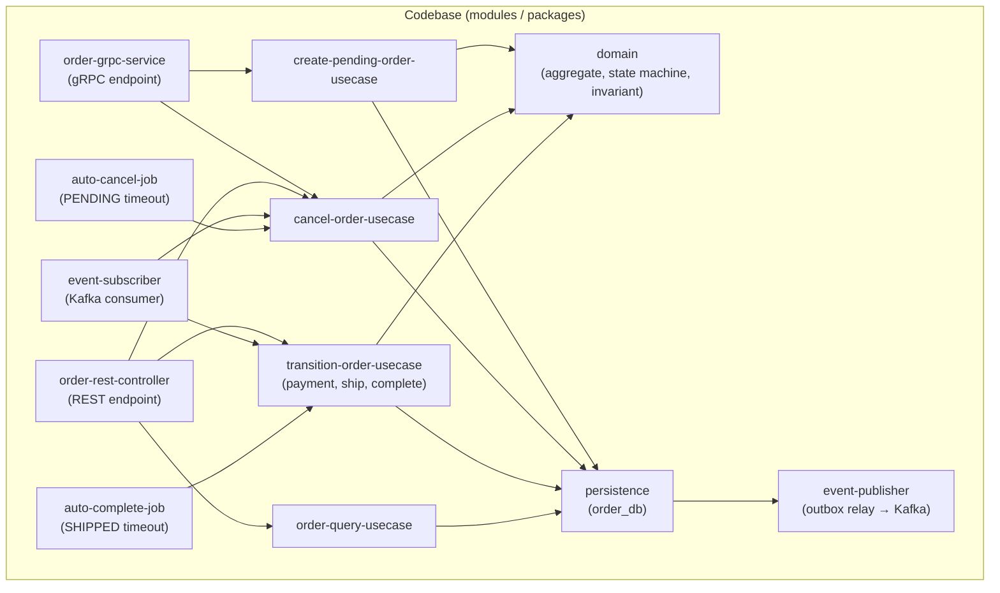
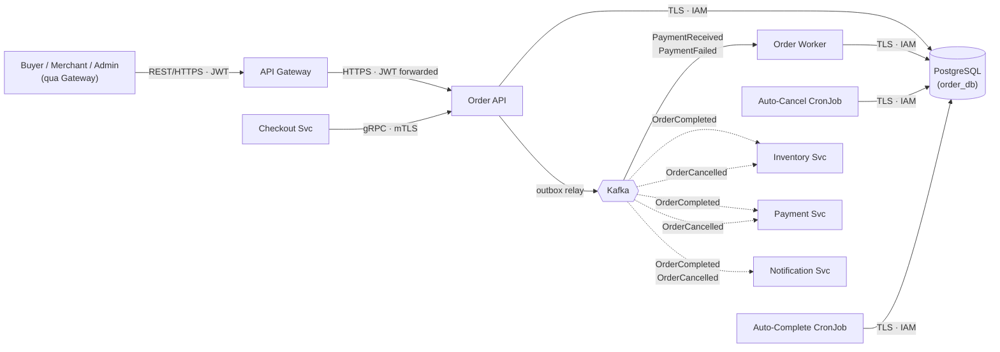
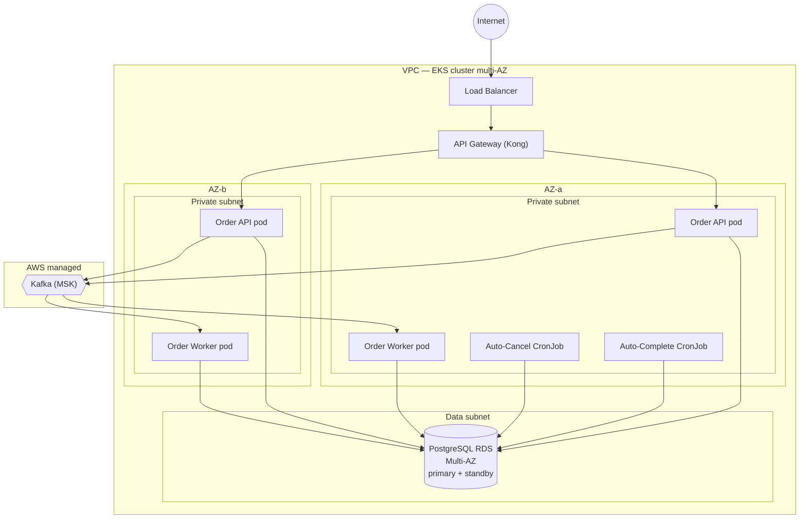
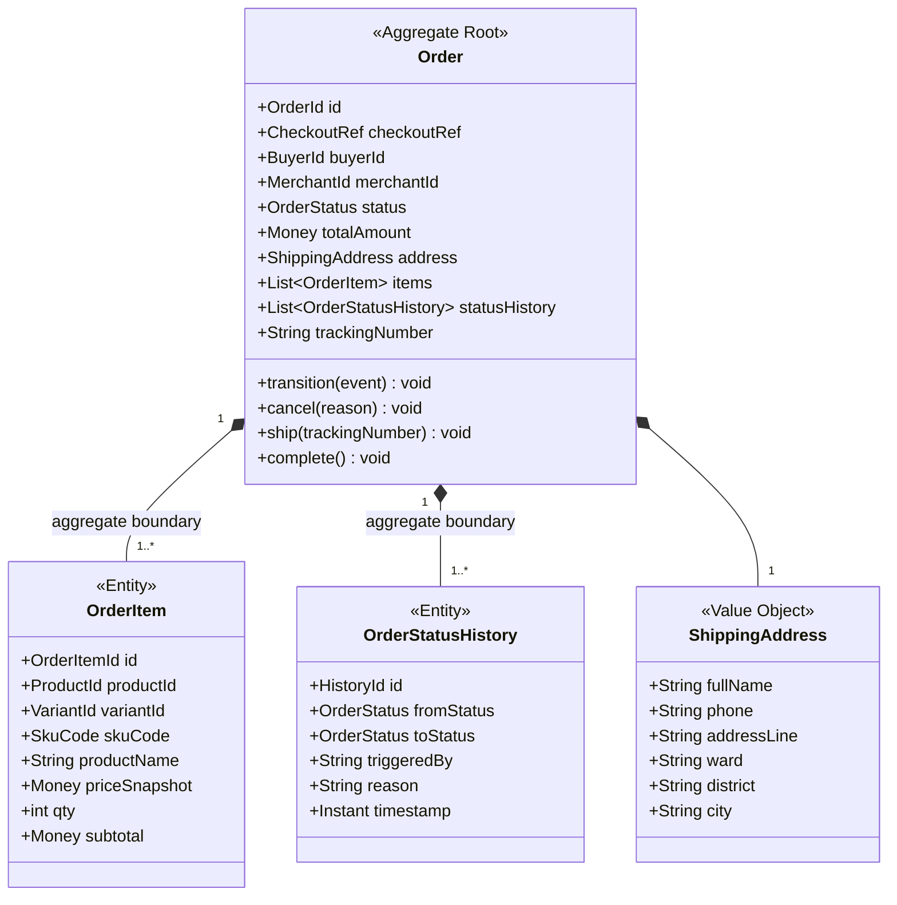
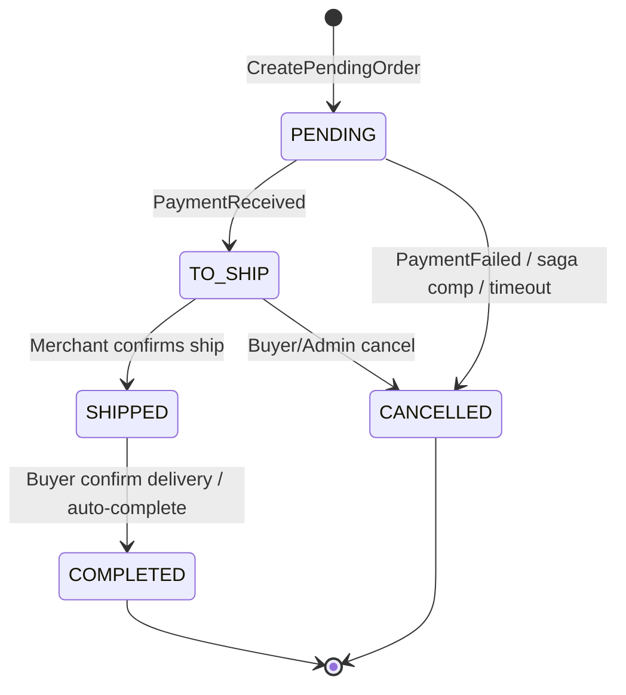
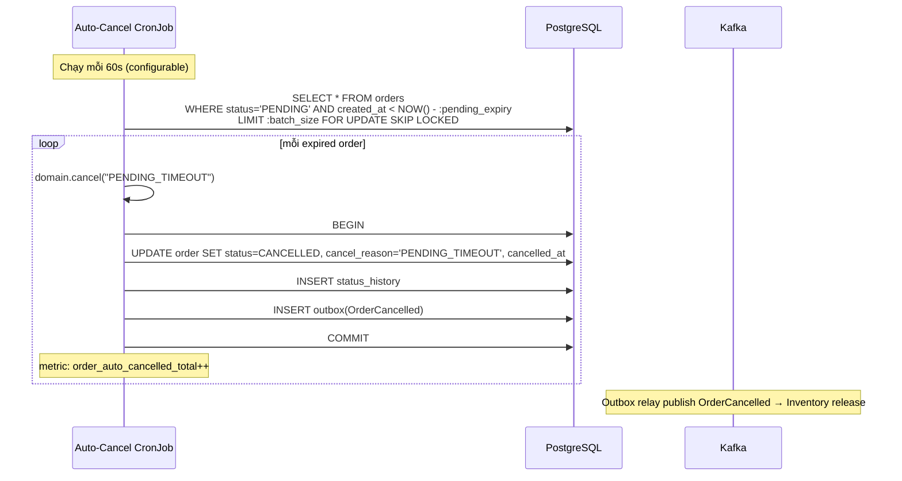
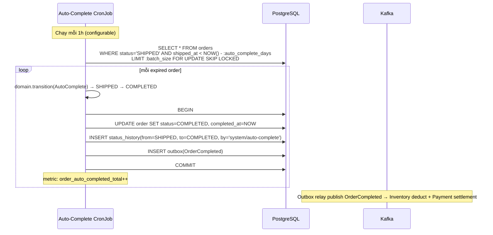

# Detailed Design — Order Service / OMS (Order Lifecycle & State Machine)

> **Status:** Draft v1.0 ·
> **Owner:** Order team ·
> **Reviewers:** _TBD_

**Liên kết:**
- [SDD-MKTPLACE-CORE-v1.0 — mục 3.1, 4.1.1–4.1.3, 6.1, 6.3, 9.2 saga](https://vin3s.atlassian.net/wiki/spaces/VARW/pages/2826666048)
- Proto files (`OrderService`)
- OpenAPI spec (Order REST)
- DB migrations (Flyway)
- IaC / Terraform
- TechSpec-Marketplace-Checkout (saga orchestration)
- TechSpec-Marketplace-Inventory (deduct on OrderCompleted)
- TechSpec-Marketplace-Payment (settlement on OrderCompleted)
- ADR-0012 (Dispute/Refund — sẽ thêm trạng thái REFUNDED)

> **Classification**: **Tier 1 — Critical** _(Order down = không tạo đơn, không chuyển trạng thái, không phát OrderCompleted → Inventory không trừ kho, Payment không settlement → tiền kẹt escrow, Merchant không nhận payout — thiệt hại nghiệp vụ trực tiếp)_
>
> **Data class:** L2 (thông tin đơn hàng, SKU code, giá snapshot — dữ liệu kinh doanh) + **L3 (địa chỉ giao hàng, SĐT Buyer — PII)** · **System Owner:** Order team ⇒ **RTO < 1h · RPO < 5 min** (§2). Tiêu chuẩn: System Tiering · Data Classification.

---

# 1. Context & Scope

Order Service (OMS) quản lý **toàn bộ vòng đời đơn hàng** qua máy trạng thái (state machine): từ khi Checkout tạo pending order, Buyer thanh toán, Merchant giao hàng, đến khi Buyer xác nhận nhận hàng hoặc huỷ. Service là **thẩm quyền duy nhất** về trạng thái đơn — mọi context khác (Checkout, Payment, Inventory, Notification) phải hỏi Order hoặc lắng nghe event, không tự giữ trạng thái đơn.

**Bất biến cốt lõi:**

1. **STATE MACHINE LÀ LUẬT** — mọi chuyển trạng thái phải đi qua transition hợp lệ; không skip state, không quay lại state cũ (trừ flow được định nghĩa rõ). COMPLETED và CANCELLED là terminal.
2. **GIÁ SNAPSHOT BẤT BIẾN** — giá ghi tại thời điểm tạo đơn (`price_snapshot`), không thay đổi dù Merchant sửa giá sau đó. Payment settlement tính dựa trên `price_snapshot × qty`.

**Ranh giới bounded context:**

- **Vào (gRPC, mTLS):** `Order.CreatePendingOrder(…)` từ Checkout Svc — tạo đơn PENDING (đã tách theo Merchant). `Order.CancelPendingOrder(orderId)` từ Checkout Svc — saga compensation.
- **Vào (REST, JWT qua Gateway):** Buyer xem đơn / xác nhận nhận hàng (`confirm-delivery`); Merchant xem đơn / xác nhận giao hàng (`ship`); Admin xem/quản lý.
- **Vào (Kafka):** subscribe `PaymentReceived` — chuyển PENDING → TO_SHIP; subscribe `PaymentFailed` — chuyển PENDING → CANCELLED.
- **Ra (Kafka):** publish `OrderCompleted` → Inventory trừ kho vĩnh viễn + Payment settlement/payout. Publish `OrderCancelled` → Inventory nhả stock + Payment refund (nếu đã thanh toán).
- **Không thuộc context:** tồn kho (Inventory Svc), thanh toán/escrow/payout (Payment Svc), orchestration checkout (Checkout Svc), sản phẩm/giá (Catalog Svc), giỏ hàng (Cart), giao vận vật lý (Courier — tích hợp tương lai), tranh chấp/hoàn tiền (Dispute — v2.0, ADR-0012).

**Trust boundary:** Order có **2 ranh giới tin cậy chính**:

- **(B1)** Internet (Buyer, Merchant, Admin) → Order qua Gateway (REST, JWT) — role-based + tenant scope + rate limit.
- **(B2)** Service nội bộ (Checkout) → Order (gRPC, mTLS/SVID) — tin cậy service identity, vẫn validate data.

Không suy tin cậy từ vị trí mạng. Chi tiết cơ chế ở §3.2/§3.3/§4.

**Goals:**

- Source of truth cho trạng thái đơn hàng — state machine rõ ràng, transition hợp lệ, audit trail đầy đủ.
- Tách đơn theo Merchant: Checkout tách, Order lưu — mỗi đơn thuộc chính xác 1 Merchant.
- Giá snapshot bất biến: ghi giá tại thời điểm tạo đơn — không API/flow nào sửa giá đã ghi.
- Phát event `OrderCompleted` trigger Inventory deduct + Payment settlement (payout Merchant).
- Phát event `OrderCancelled` trigger compensation (release stock, refund nếu đã thanh toán).
- Tenant scope: Buyer chỉ thấy đơn **của mình**; Merchant chỉ thấy đơn **của mình**.
- PII (địa chỉ giao hàng) mã hóa, mask, DSAR-ready.

**Non-goals:**

- Không quản lý tồn kho (Inventory Svc).
- Không xử lý thanh toán/escrow/payout (Payment Svc).
- Không orchestrate checkout (Checkout Svc).
- Không quản lý sản phẩm/giá (Catalog Svc).
- Không quản lý giao vận vật lý — chỉ lưu `tracking_number` từ Merchant (Courier integration v2.0).
- Không xử lý tranh chấp/hoàn tiền phức tạp (Dispute/Refund — v2.0, ADR-0012).
- Không giỏ hàng.

---

# 2. Requirements (tóm tắt — nguồn đầy đủ ở backlog)

**Functional:**

| # | Yêu cầu | Giải thích |
|---|---------|------------|
| FR1 | Create Pending Order (gRPC) | Nhận từ Checkout; tạo order PENDING với items (price snapshot), tách theo `merchant_id`; idempotent theo `checkout_ref` |
| FR2 | Cancel Pending Order (gRPC) | Nhận từ Checkout saga compensation; chuyển PENDING → CANCELLED; no-op nếu đã CANCELLED. Idempotent |
| FR3 | PaymentReceived → TO_SHIP | Subscribe `PaymentReceived`; chuyển PENDING → TO_SHIP; ghi `paid_at`. Idempotent theo `event_id` |
| FR4 | PaymentFailed → CANCELLED | Subscribe `PaymentFailed`; chuyển PENDING → CANCELLED. Idempotent theo `event_id` |
| FR5 | Merchant confirms shipment | REST API; Merchant chuyển TO_SHIP → SHIPPED; ghi `tracking_number`, `shipped_at`. Chỉ Merchant **owner** |
| FR6 | Buyer confirms receipt | REST API; Buyer chuyển SHIPPED → COMPLETED; ghi `completed_at`. Chỉ Buyer **owner** |
| FR7 | Publish OrderCompleted | Khi → COMPLETED: publish `OrderCompleted{orderId, merchantId, items[]}` → Inventory deduct + Payment settlement. Outbox pattern |
| FR8 | Publish OrderCancelled | Khi → CANCELLED (từ PENDING/TO_SHIP): publish `OrderCancelled{orderId, items[], reason}` → Inventory release + Payment refund |
| FR9 | Cancel before shipment | Buyer/Admin chuyển TO_SHIP → CANCELLED (trước khi Merchant giao); trigger stock release + refund |
| FR10 | Order query | Buyer xem đơn mình; Merchant xem đơn mình; Admin xem tất cả. Filter: status, date range. Phân trang |
| FR11 | State history audit | Mọi chuyển trạng thái ghi `order_status_history` (who, when, from_status, to_status, reason) — audit trail bất biến |
| FR12 | Price snapshot immutable | Giá ghi tại tạo đơn; **không bao giờ** thay đổi dù Merchant sửa giá sau |
| FR13 | Auto-cancel timeout | PENDING quá TTL (`order.pending_expiry_min`) chưa thanh toán → tự CANCELLED. CronJob |
| FR14 | Auto-complete timeout | SHIPPED quá N ngày (`order.auto_complete_days`) Buyer không xác nhận → tự COMPLETED. CronJob |

**Non-functional / SLO (Tier 1):**

| Thuộc tính | Mục tiêu |
|-----------|---------|
| API availability | ≥ 99.95% _(Tier 1)_ |
| CreatePendingOrder P99 | < 100 ms (gRPC, atomic DB) |
| REST API P99 | < 300 ms |
| RTO / RPO | RTO < 1h · RPO < 5 min _(Tier 1)_ |
| State machine violation | **0%** — zero tolerance |
| Event publish lag | < 5 giây (outbox relay) |
| Degraded mode | Kafka lag ⇒ PaymentReceived chậm (PENDING lâu hơn) nhưng REST API + gRPC vẫn hoạt động |

---

# 3. Design overview

## 3.1 Module view (cấu trúc tĩnh — code chia ra sao)



| Module | Trách nhiệm | Không được thực hiện |
|--------|-------------|---------------------|
| `order-grpc-service` | Kết thúc gRPC `CreatePendingOrder` / `CancelPendingOrder`; verify service identity (mTLS/SVID); validate request; điều phối tới use-case | Chứa luật nghiệp vụ; persist trực tiếp; biết Kafka/REST |
| `order-rest-controller` | Kết thúc REST cho Buyer/Merchant/Admin (query đơn, confirm shipment, confirm receipt, cancel); extract JWT claims (`buyerId`/`merchantId`/role); validate request; điều phối tới use-case | Chứa luật nghiệp vụ; persist trực tiếp; biết gRPC/Kafka |
| `create-pending-order-usecase` | Tạo Order PENDING: validate items (qty > 0, price > 0), ghi price snapshot, tạo order + items + status_history(→PENDING) + outbox (nếu cần). Idempotent theo `checkout_ref`. **Tính** `total_amount = SUM(price_snapshot × qty)` | Transition state; cancel; biết Kafka trực tiếp |
| `cancel-order-usecase` | Huỷ đơn: validate state machine (chỉ PENDING / TO_SHIP → CANCELLED); ghi status_history + reason; enqueue `OrderCancelled` vào outbox. Idempotent (cancel đơn đã CANCELLED = no-op). **Không cancel đơn SHIPPED/COMPLETED** | Tạo đơn; transition sang state khác; biết gRPC |
| `transition-order-usecase` | Xử lý mọi transition hợp lệ: PaymentReceived → PENDING → TO_SHIP; PaymentFailed → PENDING → CANCELLED; Merchant ship → TO_SHIP → SHIPPED; Buyer complete → SHIPPED → COMPLETED; auto-complete → SHIPPED → COMPLETED. Validate state machine (domain). Ghi status_history. Enqueue outbox (`OrderCompleted` / `OrderCancelled`) | Tạo đơn; biết REST/gRPC trực tiếp |
| `order-query-usecase` | Đọc đơn hàng: Buyer xem đơn mình, Merchant xem đơn mình, Admin xem tất cả. Filter, phân trang. **Read-only** — decrypt PII chỉ trong detail endpoint cho owner | Sửa đơn; biết Kafka |
| `event-publisher` | Outbox relay: poll `outbox WHERE published = false`; publish `OrderCompleted` / `OrderCancelled` vào Kafka; mark `published = true`. At-least-once delivery | Chứa luật nghiệp vụ; quyết định transition |
| `event-subscriber` | Consume `PaymentReceived` / `PaymentFailed` từ Kafka; check idempotency (`processed_events`); dispatch tới `transition-order-usecase` hoặc `cancel-order-usecase`; commit offset sau xử lý thành công | Chứa luật nghiệp vụ; persist trực tiếp; gọi gRPC |
| `auto-cancel-job` | CronJob: tìm orders `WHERE status = 'PENDING' AND created_at < NOW() - :timeout`; gọi `cancel-order-usecase` cho mỗi order. Batch processing | Chứa luật nghiệp vụ ngoài timeout; biết Kafka/REST |
| `auto-complete-job` | CronJob: tìm orders `WHERE status = 'SHIPPED' AND shipped_at < NOW() - :auto_complete_days`; gọi `transition-order-usecase(Complete)` cho mỗi order. Batch processing | Chứa luật nghiệp vụ ngoài timeout; biết Kafka/REST |
| `domain` | `Order` aggregate root + `OrderItem` entity + `OrderStatusHistory` entity; `OrderStateMachine` cưỡng chế transition hợp lệ; invariant (§4.2): state machine, price immutability, tenant scope, balance check | Biết DB/gRPC/Kafka/REST; làm I/O; phụ thuộc module khác |
| `persistence` | Repository cho `orders` / `order_items` / `order_status_history` / `outbox` / `processed_events`; cưỡng chế UNIQUE `checkout_ref`; transaction atomic; tenant scope filter trong query; outbox ghi trong cùng transaction với state update | Chứa luật nghiệp vụ/invariant (ở `domain`); gọi gRPC/Kafka |

**Behavior notes:**

> **BN-1 · State machine cưỡng chế tại domain (domain + transition-order-usecase):** Mọi transition phải qua `Order.transition(event)` trong domain layer — domain kiểm tra `(current_status, event) → new_status` hợp lệ hay không; nếu không hợp lệ → reject (exception `InvalidTransitionException`). Không có code path nào UPDATE status trực tiếp bỏ qua domain. `OrderStateMachine` là bảng transition duy nhất — thêm/xóa transition = thay đổi kiến trúc, cần người review. Metric `invalid_transition_total` phải luôn ≈ 0.

> **BN-2 · Giá snapshot bất biến (create-pending-order-usecase + domain):** `OrderItem.price_snapshot` được ghi tại tạo đơn (giá từ Checkout, nguồn từ Catalog `GetPrice`). Sau khi ghi, **không** có API/flow nào thay đổi — column `price_snapshot` không có UPDATE path trong toàn bộ codebase. Merchant sửa giá trên Catalog → đơn cũ không bị ảnh hưởng. Payment settlement tính dựa trên `price_snapshot × qty` — đây là số tiền thực. Vi phạm = bug P0.

> **BN-3 · Transactional outbox (persistence + event-publisher):** Ghi outbox row **trong cùng transaction** với UPDATE status. Đảm bảo event chỉ publish khi state đã commit. Relay/CDC đẩy vào Kafka — at-least-once → consumer phải idempotent. `OrderCompleted` trigger 2 downstream: Inventory deduct + Payment settlement. Nếu event mất → stock không trừ (tồn kho sai), tiền kẹt escrow (Merchant không nhận payout). → Outbox relay có retry + monitoring (`outbox_unpublished_age_seconds`).

## 3.2 C&C view (cấu trúc runtime)



**Connector catalog (zero-trust):**

| Connector | From → To | Protocol | Authn / Authz |
|-----------|-----------|----------|---------------|
| buyer/merchant/admin | Gateway → Order API | HTTPS | JWT (RS256) forwarded; role + tenant scope |
| create/cancel-pending | Checkout Svc → Order API | gRPC | mTLS (SVID); scope `order:create`, `order:cancel:pending` |
| state-rw | Order API / Worker / CronJob → PostgreSQL | TLS (JDBC) | IAM-auth; role least-priv per component |
| event-sub | Kafka → Order Worker | Kafka protocol | SASL/mTLS; consumer group `order-worker` |
| event-pub | Order API (outbox relay) → Kafka | Kafka protocol | SASL/mTLS; topic `order.events` |

**View-to-view mapping (module ↦ runtime component):**

| Module | Nằm trong runtime component |
|--------|----------------------------|
| `order-grpc-service`, `order-rest-controller`, `create-pending-order-usecase`, `cancel-order-usecase`, `transition-order-usecase`, `order-query-usecase`, `event-publisher` (outbox relay) | **Order API** |
| `event-subscriber`, `transition-order-usecase` (shared), `cancel-order-usecase` (shared) | **Order Worker** |
| `auto-cancel-job`, `cancel-order-usecase` (shared) | **Auto-Cancel CronJob** |
| `auto-complete-job`, `transition-order-usecase` (shared) | **Auto-Complete CronJob** |
| `domain`, `persistence` | Order API + Worker + CronJob (dùng chung) |

> Order có **4 runtime component**: Order API (REST + gRPC serving + outbox relay), Order Worker (Kafka consumer cho PaymentReceived / PaymentFailed), Auto-Cancel CronJob (nhả PENDING quá TTL), Auto-Complete CronJob (tự hoàn tất SHIPPED quá hạn). Scale độc lập: checkout traffic spike → HPA Order API; payment event lag → scale Worker.

## 3.3 Deployment view



**Thực thi zero-trust ở tầng deploy:**

- **NetworkPolicy default-deny;** chỉ mở: GW → Order API, Checkout → Order API (gRPC), Order → PostgreSQL, Order → Kafka (VPC endpoint).
- Workload identity qua IRSA — **mỗi component có ServiceAccount + IAM role riêng**:
  - **API:** read/write `orders`, `order_items`, `order_status_history`, `outbox`; expose gRPC + REST; produce Kafka (outbox relay)
  - **Worker:** read/write `orders`, `order_status_history`, `outbox`, `processed_events`; consume Kafka; **không** expose gRPC/REST
  - **CronJob (cancel/complete):** read/write `orders`, `order_status_history`, `outbox`; **không** expose gRPC/REST; **không** consume/produce Kafka
- PostgreSQL Multi-AZ + automated failover (**Tier 1**, RPO < 5 min — PITR continuous).
- Secret (DB creds, Kafka creds) trong Secrets Manager, rotate tự động; inject runtime — không bake vào image.
- **CronJob:** single replica / leader election; idempotent cancel/complete (§BN-1) bảo vệ nếu chạy multi.

---

# 4. Interfaces & data

> **Nguồn sự thật:** contract đầy đủ ở **proto file** + **OpenAPI spec**. Dưới đây chỉ giữ ngữ nghĩa quan trọng.

## 4.1 API

### 4.1.1 `Order.CreatePendingOrder` (gRPC, mTLS — từ Checkout)

```protobuf
// Request
message CreatePendingOrderRequest {
  string checkout_ref = 1;                        // idempotency key (từ Checkout saga)
  string buyer_id = 2;
  string merchant_id = 3;                         // đơn đã tách theo Merchant
  ShippingAddress shipping_address = 4;            // PII — mã hóa at-rest
  repeated OrderItemInput items = 5;               // max 100
}
message OrderItemInput {
  string product_id = 1;
  string variant_id = 2;
  string sku_code = 3;
  string product_name = 4;                         // snapshot tên tại thời điểm đặt
  int64 price_snapshot = 5;                         // VND đồng, bigint — từ Catalog GetPrice
  string currency = 6;                             // default "VND"
  int32 qty = 7;                                   // > 0
}
message ShippingAddress {
  string full_name = 1;                            // PII
  string phone = 2;                                // PII
  string address_line = 3;                         // PII
  string ward = 4;
  string district = 5;
  string city = 6;
}

// Response
message CreatePendingOrderResponse {
  string order_id = 1;                             // ULID
  string status = 2;                               // "PENDING"
  int64 total_amount = 3;                          // tổng = SUM(price_snapshot × qty)
  string merchant_id = 4;
}
```

### 4.1.2 `Order.CancelPendingOrder` (gRPC, mTLS — saga compensation)

```protobuf
// Request
message CancelPendingOrderRequest {
  string order_id = 1;
  string reason = 2;                               // "SAGA_COMPENSATION" | "PAYMENT_TIMEOUT"
}

// Response
message CancelPendingOrderResponse {
  bool success = 1;                                // true kể cả đã cancelled (idempotent)
  string status = 2;                               // "CANCELLED"
}
```

### 4.1.3 `GET /v1/orders` — Danh sách đơn (Buyer/Merchant/Admin)

```json
GET /v1/orders?status=SHIPPED&page=1&size=20&sort=created_at_desc

// 200 OK
{
  "orders": [
    {
      "orderId": "ulid",
      "buyerId": "uuid",
      "merchantId": "uuid",
      "status": "SHIPPED",
      "totalAmount": 450000,
      "currency": "VND",
      "itemCount": 3,
      "trackingNumber": "VN123456",
      "createdAt": "RFC3339",
      "paidAt": "RFC3339",
      "shippedAt": "RFC3339"
    }
  ],
  "total": 42,
  "page": 1,
  "size": 20
}
```

> **Lưu ý:** list endpoint **không** trả `shipping_address` (PII). Chỉ detail endpoint trả cho owner.

### 4.1.4 `GET /v1/orders/{orderId}` — Chi tiết đơn

```json
// 200 OK
{
  "orderId": "ulid",
  "buyerId": "uuid",
  "merchantId": "uuid",
  "checkoutRef": "uuid",
  "status": "SHIPPED",
  "totalAmount": 450000,
  "currency": "VND",
  "shippingAddress": {
    "fullName": "Nguyễn Văn A",
    "phone": "09xxx",
    "addressLine": "123 Đường ABC",
    "ward": "Phường 1",
    "district": "Quận 1",
    "city": "TP.HCM"
  },
  "items": [
    {
      "productId": "uuid",
      "skuCode": "SKU-001",
      "productName": "Laptop X",
      "priceSnapshot": 15000000,
      "qty": 1,
      "subtotal": 15000000
    }
  ],
  "trackingNumber": "VN123456",
  "statusHistory": [
    {"fromStatus": null, "toStatus": "PENDING", "at": "RFC3339", "by": "system"},
    {"fromStatus": "PENDING", "toStatus": "TO_SHIP", "at": "RFC3339", "by": "system"},
    {"fromStatus": "TO_SHIP", "toStatus": "SHIPPED", "at": "RFC3339", "by": "merchant-id"}
  ],
  "createdAt": "RFC3339",
  "paidAt": "RFC3339",
  "shippedAt": "RFC3339"
}
```

> `shippingAddress` chỉ trả cho: Buyer owner (`buyer_id == JWT.userId`), Merchant owner (`merchant_id == JWT.merchantId`), Admin.

### 4.1.5 `POST /v1/merchant/orders/{orderId}/ship` — Merchant xác nhận giao hàng

```json
// Request (Merchant JWT)
{
  "trackingNumber": "VN123456"                     // bắt buộc
}

// 200 OK
{
  "orderId": "ulid",
  "status": "SHIPPED",
  "trackingNumber": "VN123456",
  "shippedAt": "RFC3339"
}
```

### 4.1.6 `POST /v1/orders/{orderId}/confirm-delivery` — Buyer xác nhận nhận hàng

```json
// Request (Buyer JWT) — body rỗng

// 200 OK
{
  "orderId": "ulid",
  "status": "COMPLETED",
  "completedAt": "RFC3339"
}
```

### 4.1.7 `POST /v1/orders/{orderId}/cancel` — Huỷ đơn (Buyer/Admin)

```json
// Request
{
  "reason": "Buyer changed mind"                   // bắt buộc
}

// 200 OK
{
  "orderId": "ulid",
  "status": "CANCELLED",
  "cancelledAt": "RFC3339",
  "cancelReason": "Buyer changed mind"
}
```

**Mã lỗi:**

| Code | Khi nào |
|------|---------|
| `400` | Sai schema / items rỗng / `qty` ≤ 0 / `price_snapshot` ≤ 0 / thiếu `tracking_number` khi ship |
| `401 / 403` | JWT không hợp lệ; Merchant thao tác đơn Merchant khác; Buyer thao tác đơn Buyer khác; scope không phù hợp |
| `404` | Order không tồn tại **hoặc** không thuộc caller (tenant scope — trả 404 thay vì 403 để tránh information disclosure) |
| `409` | Transition không hợp lệ (vd: ship đơn đã COMPLETED); `checkout_ref` trùng (idempotent — trả order cũ) |
| `422` | Trạng thái hiện tại không cho phép action (vd: cancel đơn SHIPPED) |
| `503` | DB unavailable |

**Authz model:**

| Scope | Cho phép | Ràng buộc |
|-------|---------|-----------|
| `order:create` | CreatePendingOrder | Chỉ Checkout Svc (mTLS/SVID) |
| `order:cancel:pending` | CancelPendingOrder | Chỉ Checkout Svc (saga compensation) |
| `order:read` | GET orders (list + detail) | Buyer: `buyer_id == JWT.userId`; Merchant: `merchant_id == JWT.merchantId`; Admin: tất cả |
| `order:ship` | Confirm shipment | Chỉ Merchant owner (`merchant_id == JWT.merchantId`) + đơn ở TO_SHIP |
| `order:complete` | Confirm receipt | Chỉ Buyer owner (`buyer_id == JWT.userId`) + đơn ở SHIPPED |
| `order:cancel` | Cancel order (REST) | Buyer: đơn mình ở TO_SHIP; Admin: đơn ở PENDING/TO_SHIP |

- **Tenant scope enforcement:** Buyer query chỉ thấy `buyer_id = :callerId`; Merchant query chỉ thấy `merchant_id = :callerMerchantId`. Kiểm tại Gateway (PEP) + tại service (persistence query WHERE clause).
- **IDOR protection:** `GET /v1/orders/{orderId}` kiểm quyền owner; trả 404 (không 403) cho order không thuộc caller.
- **CreatePendingOrder idempotency:** cùng `checkout_ref` → trả order cũ, không tạo mới. DB UNIQUE constraint.
- **PII access:** `shippingAddress` chỉ trả trong detail endpoint cho Buyer owner + Merchant owner (cần để giao hàng) + Admin. Không trả trong list endpoint.

## 4.2 Domain model

> Order có 1 aggregate: `Order` (bao gồm OrderItems, StatusHistory). Aggregate trung bình kích thước nhưng **state machine là phần phức tạp nhất**.



**State machine:**



**Transition table (thẩm quyền duy nhất — OrderStateMachine):**

| Current | Event | Next | Trigger | Outbox Event |
|---------|-------|------|---------|--------------|
| — | CreatePendingOrder | PENDING | Checkout gRPC | — |
| PENDING | PaymentReceived | TO_SHIP | Kafka consumer | — |
| PENDING | PaymentFailed | CANCELLED | Kafka consumer | OrderCancelled |
| PENDING | SagaCompensation | CANCELLED | Checkout gRPC | OrderCancelled |
| PENDING | Timeout | CANCELLED | Auto-Cancel CronJob | OrderCancelled |
| TO_SHIP | MerchantShip | SHIPPED | Merchant REST | — |
| TO_SHIP | Cancel | CANCELLED | Buyer/Admin REST | OrderCancelled |
| SHIPPED | BuyerConfirmDelivery | COMPLETED | Buyer REST | OrderCompleted |
| SHIPPED | AutoComplete | COMPLETED | Auto-Complete CronJob | OrderCompleted |

> Bất kỳ transition nào **không có trong bảng** → reject `InvalidTransitionException`. COMPLETED và CANCELLED là **terminal** — bất biến, không chuyển tiếp. _(ADR-0012 sẽ thêm COMPLETED → REFUNDED.)_

**Invariant:**

1. **State machine là luật:** transition chỉ đi theo bảng transition (ở trên). Bất kỳ transition nào ngoài danh sách → reject. COMPLETED và CANCELLED là terminal. Vi phạm = bug P0.
2. **Price snapshot bất biến:** `OrderItem.price_snapshot` **không có UPDATE path** sau khi tạo. Không API, không flow, không admin override nào thay đổi giá đã ghi. Vi phạm = bug P0.
3. **Total amount khớp items:** `order.total_amount == SUM(item.price_snapshot × item.qty)`. Tính lúc tạo, kiểm lúc settlement (Payment).
4. **Mỗi Order phải có ≥ 1 OrderItem** — không cho đơn rỗng.
5. **Qty > 0, price_snapshot > 0** — invariant cơ bản.
6. **Buyer/Merchant immutable:** `buyer_id`, `merchant_id` trên Order **không thể thay đổi** sau khi tạo.
7. **Checkout_ref UNIQUE** — idempotency cho CreatePendingOrder. DB UNIQUE constraint.
8. **OrderCompleted chỉ publish khi → COMPLETED.** OrderCancelled chỉ publish khi → CANCELLED. Không publish ở state khác.
9. **Cancel không áp dụng cho SHIPPED/COMPLETED:** đơn đã giao → cần flow tranh chấp (ADR-0012, v2.0).
10. **StatusHistory append-only:** chỉ INSERT, không UPDATE/DELETE — audit trail bất biến.
11. **Shipping address PII:** mã hóa at-rest (field-level AES-256); không log plaintext; không trả trong list endpoint.

## 4.3 Data model — ERD

```mermaid
erDiagram
  ORDER ||--o{ ORDER_ITEM : "has"
  ORDER ||--o{ ORDER_STATUS_HISTORY : "has"

  ORDER {
    ULID id PK
    string checkout_ref UK "idempotency"
    string buyer_id IDX "tenant scope Buyer"
    string merchant_id IDX "tenant scope Merchant"
    string status "PENDING|TO_SHIP|SHIPPED|COMPLETED|CANCELLED"
    bigint total_amount "VND đồng"
    string currency "default VND"
    text shipping_address_encrypted "AES-256/KMS, JSONB encrypted"
    string tracking_number "nullable, ghi khi SHIPPED"
    string cancel_reason "nullable"
    timestamp created_at
    timestamp paid_at "nullable"
    timestamp shipped_at "nullable"
    timestamp completed_at "nullable"
    timestamp cancelled_at "nullable"
    timestamp updated_at
  }

  ORDER_ITEM {
    ULID id PK
    ULID order_id FK
    string product_id "ref Catalog logic only"
    string variant_id "ref Catalog"
    string sku_code "ref Catalog"
    string product_name "snapshot tại thời điểm đặt"
    bigint price_snapshot "VND đồng IMMUTABLE"
    int qty "CHECK > 0"
    bigint subtotal "= price_snapshot x qty"
    timestamp created_at
  }

  ORDER_STATUS_HISTORY {
    ULID id PK
    ULID order_id FK IDX
    string from_status "nullable (first entry)"
    string to_status
    string triggered_by "user_id / service_identity / system / cron"
    string reason "nullable"
    timestamp created_at
  }

  OUTBOX {
    ULID id PK
    ULID order_id FK
    string event_type "OrderCompleted|OrderCancelled"
    jsonb payload
    bool published "default false"
    timestamp created_at
  }

  PROCESSED_EVENT {
    string event_id PK "idempotency for PaymentReceived/Failed"
  }
```

**UNIQUE constraints & indexes:**

```sql
-- Idempotency tạo đơn
ALTER TABLE orders ADD CONSTRAINT uq_order_checkout_ref
  UNIQUE (checkout_ref);

-- Tenant scope performance
CREATE INDEX idx_orders_buyer ON orders (buyer_id, status, created_at DESC);
CREATE INDEX idx_orders_merchant ON orders (merchant_id, status, created_at DESC);

-- Auto-cancel job: PENDING quá timeout
CREATE INDEX idx_orders_pending_timeout
  ON orders (created_at) WHERE status = 'PENDING';

-- Auto-complete job: SHIPPED quá hạn
CREATE INDEX idx_orders_shipped_timeout
  ON orders (shipped_at) WHERE status = 'SHIPPED';

-- Status history tra cứu nhanh
CREATE INDEX idx_order_status_history_order
  ON order_status_history (order_id, created_at);

-- Outbox relay
CREATE INDEX idx_outbox_unpublished
  ON outbox (created_at) WHERE published = false;

-- Price snapshot immutability enforcement (application + review)
-- Không có UPDATE trigger trên order_items.price_snapshot — enforce ở code review + fitness function
```

**Nghĩa cột load-bearing:**

| Cột | Ý nghĩa |
|-----|---------|
| `checkout_ref` (UK) | Idempotency key từ Checkout saga — cùng `checkout_ref` không tạo đơn lần 2 |
| `buyer_id` (IDX) | Tenant scope Buyer — Buyer chỉ thấy đơn mình |
| `merchant_id` (IDX) | Tenant scope Merchant — Merchant chỉ thấy đơn mình |
| `status` | State machine — transition hợp lệ duy nhất qua domain (BN-1) |
| `total_amount` (bigint) | VND đồng — tránh floating point; khớp SUM(items) (invariant 3) |
| `shipping_address_encrypted` (text) | PII mã hóa AES-256/KMS field-level; decrypt chỉ khi trả detail cho owner |
| `price_snapshot` (bigint) | **IMMUTABLE** — giá tại thời điểm đặt đơn; không có UPDATE path (BN-2). Payment settlement tính từ đây |
| `tracking_number` | Merchant cung cấp khi ship; nullable trước SHIPPED |
| `outbox.published` | `false` = chờ relay đẩy vào Kafka; `true` = đã publish |
| `event_id` (PK, processed_events) | Idempotency cho PaymentReceived/PaymentFailed — trùng = skip |

**Xử lý theo data class:**

- **L2 (thông tin đơn, SKU, giá):** mã hóa at-rest (RDS encryption). Retention: **10 năm** (luật kế toán — giá snapshot phục vụ đối soát).
- **L3 (shipping address — PII: tên, SĐT, địa chỉ):** field-level encryption (AES-256/KMS); không log plaintext; mask khi display (chỉ trả cho Buyer/Merchant owner + Admin); DSAR-ready (anonymize khi TK inactive + 30 ngày); không index plaintext.
- **Status history:** append-only, không UPDATE/DELETE — audit trail bất biến. Retention: 10 năm (theo đơn).
- **Outbox:** purge sau publish + 7 ngày retention.
- **Processed events:** purge sau 30 ngày.

## 4.4 Config & tunables

| Tham số | Khởi điểm | Ghi chú |
|---------|-----------|---------|
| `order.pending_expiry_min` | 30 | Timeout auto-cancel PENDING — **phải ≥** `checkout.reserve_ttl_min` & `inventory.reserve_ttl_min` |
| `order.auto_complete_days` | 7 | Tự COMPLETED nếu Buyer không xác nhận sau N ngày kể từ SHIPPED |
| `order.auto_cancel_job_interval_s` | 60 | Chu kỳ auto-cancel job |
| `order.auto_cancel_batch_size` | 100 | Batch size mỗi lần auto-cancel |
| `order.auto_complete_job_interval_s` | 3600 | Chu kỳ auto-complete job (1 giờ — ít urgent hơn cancel) |
| `order.auto_complete_batch_size` | 100 | Batch size auto-complete |
| `order.max_items_per_order` | 100 | Max items per CreatePendingOrder |
| `order.outbox_relay_interval_ms` | 500 | Chu kỳ relay outbox → Kafka |
| `order.outbox_relay_batch_size` | 50 | Batch size mỗi lần relay |
| `order.query_default_page_size` | 20 | Default page size query |
| `order.query_max_page_size` | 100 | Max page size |
| `order.rate_limit_buyer` | 30 req/60s | Per-buyer rate limit |
| `order.rate_limit_merchant` | 60 req/60s | Per-merchant rate limit |
| `order.feature_flag` | `order.auto_complete_enabled` | Feature flag cho auto-complete flow |

**Cảnh báo cấu hình:**

- `order.pending_expiry_min` **phải ≥** `inventory.reserve_ttl_min`. Nếu lệch (order cancel chậm hơn stock release) → stock đã nhả nhưng đơn vẫn PENDING → PaymentReceived đến, đơn chuyển TO_SHIP nhưng stock đã nhả → oversell risk. Fitness function kiểm config sync.
- `order.auto_complete_days` ảnh hưởng escrow duration — ngày Merchant nhận payout. Cần align với chính sách hoàn tiền.

## 4.5 Personal data handling

> Order **chứa PII** — shipping address (L3). Đây là điểm khác biệt quan trọng so với Inventory/Catalog.

**Data inventory:**

| Data element | Class | Nguồn | Lưu ở đâu | Mục đích | Retention | Rời service đi đâu |
|-------------|-------|-------|-----------|---------|-----------|-------------------|
| Shipping address (name, phone, address) | **L3 — PII** | Buyer (qua Checkout) | PG (field-level encrypted) | Giao hàng | TK active + 30 ngày → anonymize | Notification (gửi SMS — chỉ SĐT); Courier (tương lai) |
| `buyer_id` | L2 | JWT (qua Checkout) | PG | Tenant scope | Theo đơn (10 năm) | — |
| `merchant_id` | L2 | Checkout | PG | Tenant scope | Theo đơn (10 năm) | — |
| Price snapshot, total_amount | L2 | Catalog (qua Checkout) | PG | Đối soát, settlement | 10 năm (kế toán) | Payment (OrderCompleted event) |
| `tracking_number` | L2 | Merchant | PG | Theo dõi giao hàng | Theo đơn | Notification (gửi Buyer) |
| Status history | L2 | System | PG | Audit trail | 10 năm | — |

**Delta privacy:**

- **PII rõ ràng (L3):** shipping address chứa tên, SĐT, địa chỉ Buyer. Mã hóa field-level (AES-256/KMS) at-rest; không log plaintext; mask trong non-owner response.
- **DSAR (right to erasure):** Buyer yêu cầu xóa → anonymize shipping address (thay bằng hash/placeholder); giữ `total_amount` + `price_snapshot` cho đối soát (10 năm — dữ liệu tài chính, không PII). `buyer_id` → pseudonymize.
- **Data minimization:** chỉ lưu shipping address cần thiết cho giao hàng. Không lưu payment info (Payment Svc). Không lưu email Buyer (Identity Svc).
- **Access control PII:** shipping address chỉ trả trong detail endpoint cho Buyer owner + Merchant owner + Admin. Không trả trong list endpoint.

---

# 5. Key flows

## 5.1 Happy path: Checkout → Payment → Ship → Complete

```mermaid
sequenceDiagram
  participant CHK as Checkout Svc
  participant ORD as Order API
  participant PG as PostgreSQL
  participant K as Kafka
  participant WKR as Order Worker
  actor Merchant
  actor Buyer

  Note over CHK,ORD: Bước 1 — Checkout tạo pending order (per Merchant)
  CHK->>ORD: CreatePendingOrder(checkoutRef, buyerId, merchantId, items[], address) [gRPC mTLS]
  ORD->>ORD: verify SVID; validate items ≥1, qty>0, price>0
  ORD->>PG: check checkout_ref UNIQUE (idempotency)
  alt đã tạo
    PG-->>ORD: existing order
    ORD-->>CHK: {orderId, status=PENDING} (idempotent)
  else chưa tạo
    ORD->>PG: BEGIN
    ORD->>PG: INSERT order(PENDING, total=SUM) + items(price_snapshot) + status_history(→PENDING)
    ORD->>PG: COMMIT
    ORD-->>CHK: {orderId, status=PENDING, totalAmount}
  end

  Note over K,WKR: Bước 2 — PaymentReceived → TO_SHIP
  K->>WKR: PaymentReceived{eventId, orderId, txnId, amount}
  WKR->>PG: check event_id in processed_events (idempotency)
  alt đã xử lý
    WKR->>WKR: skip (idempotent)
  else chưa xử lý
    WKR->>PG: load order (check status=PENDING)
    WKR->>WKR: domain.transition(PaymentReceived) → PENDING → TO_SHIP
    WKR->>PG: BEGIN; UPDATE order SET status=TO_SHIP, paid_at=NOW; INSERT status_history; INSERT processed_events; COMMIT
  end

  Note over Merchant,ORD: Bước 3 — Merchant xác nhận giao hàng
  Merchant->>ORD: POST /v1/merchant/orders/{id}/ship {trackingNumber} [JWT Merchant]
  ORD->>PG: load order (check merchant_id==JWT.merchantId, status=TO_SHIP)
  ORD->>ORD: domain.transition(MerchantShip) → TO_SHIP → SHIPPED
  ORD->>PG: BEGIN; UPDATE order SET status=SHIPPED, tracking_number, shipped_at; INSERT status_history; COMMIT
  ORD-->>Merchant: 200 {status=SHIPPED}

  Note over Buyer,K: Bước 4 — Buyer xác nhận nhận hàng → OrderCompleted
  Buyer->>ORD: POST /v1/orders/{id}/confirm-delivery [JWT Buyer]
  ORD->>PG: load order (check buyer_id==JWT.userId, status=SHIPPED)
  ORD->>ORD: domain.transition(BuyerConfirmDelivery) → SHIPPED → COMPLETED
  ORD->>PG: BEGIN; UPDATE order SET status=COMPLETED, completed_at; INSERT status_history; INSERT outbox(OrderCompleted); COMMIT
  ORD-->>Buyer: 200 {status=COMPLETED}

  Note over ORD,K: Bước 5 — Outbox relay → OrderCompleted
  ORD->>PG: poll outbox WHERE published=false
  ORD->>K: publish OrderCompleted{orderId, merchantId, items[{sku, qty, priceSnapshot}]}
  ORD->>PG: UPDATE outbox SET published=true
  Note over K: → Inventory deduct stock
  Note over K: → Payment settlement / payout
  Note over K: → Notification báo Buyer + Merchant
```

## 5.2 Saga compensation — cancel pending order

```mermaid
sequenceDiagram
  participant CHK as Checkout Svc
  participant ORD as Order API
  participant PG as PostgreSQL
  participant K as Kafka

  Note over CHK,ORD: Checkout saga fails → compensate
  CHK->>ORD: CancelPendingOrder(orderId, "SAGA_COMPENSATION") [gRPC mTLS]
  ORD->>PG: load order (check status)

  alt status = PENDING
    ORD->>ORD: domain.cancel("SAGA_COMPENSATION") → PENDING → CANCELLED
    ORD->>PG: BEGIN; UPDATE order SET status=CANCELLED, cancel_reason, cancelled_at; INSERT status_history; INSERT outbox(OrderCancelled); COMMIT
    ORD-->>CHK: success=true, status=CANCELLED
  else status = CANCELLED
    Note over ORD: idempotent — đã cancel
    ORD-->>CHK: success=true, status=CANCELLED
  else status ≠ PENDING AND ≠ CANCELLED
    Note over ORD: invalid transition — reject
    ORD-->>CHK: error 409 (order đã chuyển trạng thái)
  end

  Note over ORD,K: Outbox relay → OrderCancelled
  ORD->>K: publish OrderCancelled{orderId, items[{sku, qty}], reason}
  Note over K: → Inventory release stock
```

## 5.3 PaymentFailed → CANCELLED

```mermaid
sequenceDiagram
  participant K as Kafka
  participant WKR as Order Worker
  participant PG as PostgreSQL

  K->>WKR: PaymentFailed{eventId, orderId, reason}
  WKR->>PG: check event_id in processed_events

  alt đã xử lý
    WKR->>WKR: skip (idempotent)
  else chưa xử lý
    WKR->>PG: load order (check status=PENDING)
    alt status = PENDING
      WKR->>WKR: domain.transition(PaymentFailed) → PENDING → CANCELLED
      WKR->>PG: BEGIN; UPDATE order SET status=CANCELLED, cancel_reason=reason, cancelled_at; INSERT status_history; INSERT outbox(OrderCancelled); INSERT processed_events; COMMIT
    else status ≠ PENDING
      Note over WKR: anomaly — log P1 alert (PaymentFailed cho đơn không PENDING)
    end
  end
```

## 5.4 Cancel before shipment (Buyer/Admin)

```mermaid
sequenceDiagram
  actor Buyer
  participant GW as API Gateway
  participant ORD as Order API
  participant PG as PostgreSQL
  participant K as Kafka

  Buyer->>GW: POST /v1/orders/{id}/cancel {reason} [JWT Buyer]
  GW->>ORD: forward (JWT verified)
  ORD->>PG: load order (check buyer_id==JWT.userId)

  alt status = TO_SHIP
    ORD->>ORD: domain.cancel(reason) → TO_SHIP → CANCELLED
    ORD->>PG: BEGIN; UPDATE order SET status=CANCELLED, cancel_reason, cancelled_at; INSERT status_history; INSERT outbox(OrderCancelled); COMMIT
    ORD-->>Buyer: 200 {status=CANCELLED}

    Note over ORD,K: Outbox relay → OrderCancelled
    ORD->>K: publish OrderCancelled{orderId, items[], reason}
    Note over K: → Inventory release stock
    Note over K: → Payment refund (tiền đã thanh toán)
  else status = SHIPPED | COMPLETED | CANCELLED
    ORD-->>Buyer: 422 (không thể cancel đơn đã giao / đã hoàn tất / đã huỷ)
  end
```

## 5.5 Auto-cancel PENDING timeout



## 5.6 Auto-complete SHIPPED timeout


# 6. Operations & Resilience

> Chiến lược DR và pipeline tooling cấp platform xem [SDD-MKTPLACE-CORE](https://vin3s.atlassian.net/wiki/spaces/VARW/pages/2826666048) — dưới đây chỉ delta của component này, suy ra từ Tier 1 + data class.

## Backup & Recovery (delta — Tier 1):

* **PostgreSQL** (order_db — L2/L3): bật PITR; Multi-AZ + automated failover → RTO < 1h · RPO < 5 min. Test-restore định kỳ (đừng tin backup chưa từng restore). `shipping_address_encrypted` vẫn encrypted trong backup — cần KMS key để đọc.
* **Kafka** (event bus — outbox relay): dựa vào durability MSK managed (replication factor ≥ 3); nếu Kafka down thì outbox tồn đọng trong PG → không mất event (outbox pattern bảo vệ).
* **Outbox recovery:** nếu relay chết lâu → outbox tồn đọng → alert `outbox_unpublished_age_seconds > 30s`. Relay khởi động lại tự đẩy hết. Không cần backup riêng cho outbox (nằm trong PG backup).
* Retention/deletion thực thi theo §4.3: L3 PII → anonymize khi TK inactive + 30 ngày; L2 → 10 năm; outbox → purge 7 ngày sau publish; processed_events → purge 30 ngày.

## CI/CD (delta — Tier 1):

* DB migration backward-compatible (expand/contract), tách khỏi deploy code → rollback an toàn. `price_snapshot` column **không bao giờ** thêm UPDATE migration — fitness function kiểm migration file.
* Deploy strategy: rolling update với health gate; drain in-flight Kafka message của Worker trước khi shutdown (graceful shutdown period ≥ 2× processing time); CronJob tự dừng batch gracefully.
* Secret inject từ Secrets Manager qua pipeline, không bake vào image.
* Contract: proto file + OpenAPI versioned; Kafka event schema (Avro/JSON Schema) có compatibility check ở pipeline trước khi rollout.
* **State machine change gate:** thêm/xóa transition trong `OrderStateMachine` = thay đổi kiến trúc → bắt buộc architect review (xem §7).

## Degraded mode:

| Sự cố | Hệ quả | Tự phục hồi |
| --- | --- | --- |
| **Kafka down** | PaymentReceived chậm → PENDING lâu hơn; outbox tồn đọng nhưng không mất event. REST + gRPC vẫn hoạt động bình thường | Kafka phục hồi → Worker consume backlog; relay đẩy outbox |
| **PostgreSQL failover** | 503 tạm thời (30–60s failover); request thất bại → caller retry (idempotent) | Auto-failover Multi-AZ; connection pool reconnect |
| **Worker crash** | PaymentReceived không xử lý → message ở Kafka (retention); đơn ở PENDING lâu hơn | Worker restart → consume từ last committed offset |
| **CronJob miss cycle** | PENDING/SHIPPED chậm auto-cancel/complete vài chu kỳ | Chu kỳ kế bù; idempotent (domain.cancel/complete reject nếu đã transition) |
| **Outbox relay lag** | Event publish trễ > 5s → downstream (Inventory/Payment) chậm nhận signal | Relay catch up; alert nếu lag > threshold |

---

# 7. Decisions & cross-cutting deltas (ADR-style)

**ADR-1 — State machine cưỡng chế tại domain layer (không DB trigger, không workflow engine).** Giữ luật transition trong code (`OrderStateMachine`), test được bằng unit test, version control rõ ràng. _Đã loại:_ DB trigger (khó debug/test, ẩn logic); workflow engine (over-engineering cho state machine đơn giản). _Hệ quả:_ mọi code path UPDATE status phải đi qua domain — fitness function kiểm không có raw UPDATE status trong codebase.

**ADR-2 — Transactional outbox cho event publish (thay vì dual-write DB + Kafka).** Dual-write có cửa sổ mất event giữa DB commit và Kafka produce. Outbox + relay at-least-once. _Hệ quả:_ thêm bảng `outbox` + relay component; event trễ ~1 chu kỳ poll (500ms). Consumer phải idempotent. Đã chốt.

**ADR-3 — Idempotency qua** `checkout_ref` UNIQUE constraint (DB là thẩm quyền). Không dùng Redis hay distributed lock — quá phức tạp cho use case tạo đơn. DB unique constraint đơn giản, đáng tin cậy, zero race condition. _Hệ quả:_ cùng `checkout_ref` → trả order cũ (200); khác `checkout_ref` → tạo mới. Checkout saga retry an toàn.

**ADR-4 — Giá snapshot bất biến tại Order (không query lại Catalog khi settlement).** Ghi `price_snapshot` lúc tạo đơn. Payment settlement tính từ `price_snapshot × qty` — không cần gọi Catalog lại. _Lý do:_ Catalog có thể thay đổi giá bất kỳ lúc nào; nếu query lại → tiền thanh toán ≠ tiền hiển thị cho Buyer → tranh chấp. _Hệ quả:_ `price_snapshot` column không có UPDATE path; fitness function kiểm.

**ADR-5 — Auto-complete SHIPPED (thay vì đơn treo vĩnh viễn).** Buyer quên xác nhận → Merchant không nhận payout → UX xấu. Auto-complete sau N ngày giải quyết. _Hệ quả:_ thêm CronJob + config `auto_complete_days`; feature flag `order.auto_complete_enabled` cho phép tắt nếu cần.

**ADR-6 — Tách 4 runtime component (API, Worker, CronJob-cancel, CronJob-complete).** Scale độc lập: API chịu checkout traffic; Worker chịu Kafka lag; CronJob chạy batch. _Đã loại:_ monolith single deployment (không scale từng concern); tách quá nhiều microservice (over-engineering cho 1 aggregate).

**ADR-7 — Trả 404 thay vì 403 cho IDOR (information disclosure prevention).** Buyer A query order của Buyer B → trả 404 (không 403). Nếu trả 403, attacker biết order ID tồn tại → information disclosure. _Quyết định:_ 404 cho mọi trường hợp "không thuộc caller".

## Cross-cutting deltas:

* **Input validation hardening (security, Tier 1):** `items[]` từ Checkout vẫn phải validate tại Order (qty > 0, price > 0, items ≤ max) — không trust mù dù Checkout đã check. Defense-in-depth.
* **Reliability/alert:** alert khi `invalid_transition_total > 0` (P1 — state machine bị vi phạm), `outbox_unpublished_age_seconds > 30s`, `order_auto_cancelled_total` spike bất thường, Kafka consumer lag > threshold.
* **Observability:** metric `order_created_total`, `order_transition_total{from,to}`, `order_completed_total`, `order_cancelled_total{reason}`, outbox lag, API latency p99; trace xuyên Checkout→Order→Kafka→Inventory/Payment.

## Zero-trust — anchor index:

| Nguyên tắc (SAD) | Thực thi trong LLD này |
| --- | --- |
| Identity, không theo mạng | §1 trust boundary · §3.2 connector catalog (mTLS/SVID cho gRPC, JWT cho REST) · §4.1 authz model |
| Least privilege | §3.3 IRSA role riêng từng component (API/Worker/CronJob) · IAM per-component ở §3.2 · KMS decrypt chỉ cho query-usecase |
| Assume breach / defense-in-depth | §3.3 NetworkPolicy default-deny · validate input tại Order dù Checkout đã validate · trả 404 chống IDOR |
| No long-lived creds | §3.3 Secrets Manager + auto-rotate; không creds trong image |
| Protect data | §4.3 field-level encryption (AES-256/KMS) cho PII · TLS toàn tuyến · mask PII trong log · tenant scope WHERE clause |

## Trust boundary & threat seed:

> Hai ranh giới tin cậy:
> (B1) Internet (Buyer/Merchant/Admin) → Order qua Gateway (REST, JWT) — dữ liệu untrusted.
> (B2) Checkout → Order (gRPC, mTLS) — trusted identity nhưng vẫn validate data.

| Threat (STRIDE) | Bề mặt | Đối ứng (ở đâu) |
| --- | --- | --- |
| **S**poofing | Buyer giả Merchant (ship đơn); Merchant giả Buyer (cancel đơn) | JWT role + tenant scope (`merchant_id`/`buyer_id` match) (§4.1 authz) |
| **T**ampering | Sửa `price_snapshot` sau tạo đơn; sửa status bỏ qua state machine | Invariant 2 (no UPDATE path) + BN-1 (domain enforce) + fitness function |
| **R**epudiation | Merchant chối chưa ship; Buyer chối đã nhận hàng | `order_status_history` append-only (invariant 10); `triggered_by` ghi identity |
| **I**nfo disclosure | Buyer A xem đơn Buyer B; đọc PII từ list endpoint | IDOR → 404 (ADR-7); PII chỉ trả trong detail cho owner (§4.1); field encryption (§4.3) |
| **D**oS | Spam CreatePendingOrder; spam cancel | Rate limit per-buyer/merchant (§4.4); chỉ Checkout (mTLS) mới gọi được gRPC create |
| **E**levation | Buyer gọi ship endpoint; Worker gọi gRPC create | Scope-based authz (§4.1): `order:ship` chỉ Merchant; `order:create` chỉ Checkout SVID |

---

# 8. Test strategy

> Hexagonal + dependency rule (§3.1) cho phép test phần lớn không cần infra. Domain logic hoàn toàn in-memory.

* **Unit (**`domain`**):** luật nghiệp vụ thuần — state machine transition (mọi cặp `current_status × event` hợp lệ → đúng `next_status`; mọi cặp không hợp lệ → reject `InvalidTransitionException`); price snapshot immutability; total_amount = SUM check; invariant qty > 0. **Không cần DB/Kafka.**
* **Unit (use-case):** `create-pending-order-usecase` tính total chính xác; idempotency logic (trùng `checkout_ref` → trả cũ); validation reject items rỗng. Mock persistence.
* **Contract test:** gRPC proto contract vs Checkout (consumer-driven); REST OpenAPI contract; Kafka event schema contract (OrderCompleted/OrderCancelled) vs Inventory & Payment consumer.
* **Integration:** outbox → relay → Kafka with testcontainer; DB UNIQUE constraint enforcement; tenant scope query (`buyer_id` filter); auto-cancel/complete CronJob with in-memory DB.
* **Failure-injection:** Kafka down → outbox tồn đọng, relay catch up khi phục hồi (kiểm RPO); DB failover → 503 tạm → retry idempotent thành công; Worker crash mid-processing → message re-delivered → idempotent (processed_events chặn).
* **Security test:** IDOR (Buyer A query order Buyer B → 404); Merchant A ship order Merchant B → 403/404; unauthenticated → 401.

## Acceptance criteria mẫu (given/when/then cho FR lõi — phần còn lại ở backlog):

* _State machine:_ cho order ở PENDING → khi nhận PaymentReceived → thì chuyển TO_SHIP, ghi `paid_at`, ghi status_history.
* _State machine reject:_ cho order ở SHIPPED → khi Buyer cancel → thì trả 422, status KHÔNG thay đổi.
* _Idempotency create:_ cho 2 request CreatePendingOrder cùng `checkout_ref` → khi xử lý → đúng 1 order trong DB, request thứ hai trả order cũ.
* _Idempotency event:_ cho 2 message PaymentReceived cùng `event_id` → khi Worker consume → chỉ transition 1 lần, message thứ hai skip.
* _Price immutability:_ cho order đã tạo → khi Merchant sửa giá trên Catalog → thì `price_snapshot` trên order KHÔNG đổi.
* _Auto-cancel:_ cho order PENDING quá `pending_expiry_min` → khi CronJob chạy → thì status = CANCELLED, OrderCancelled event published.
* _Tenant scope:_ cho Buyer A và Buyer B mỗi người có 5 đơn → khi Buyer A query → chỉ thấy 5 đơn của mình.
* _OrderCompleted downstream:_ cho order → COMPLETED → khi outbox relay publish → thì Inventory nhận event (deduct) VÀ Payment nhận event (settlement).

## Fitness functions (CI — tự động, chặn deploy):

| Invariant | Kiểm thế nào |
| --- | --- |
| Không raw UPDATE `status` bỏ qua domain | Static analysis / grep codebase — chỉ `Order.transition()` được phép |
| Không UPDATE `price_snapshot` ở bất kỳ đâu | Static analysis migration files + application code |
| Mọi transition trong `OrderStateMachine` phải có unit test | Code coverage gate: transition table 100% |
| `order.pending_expiry_min` ≥ `inventory.reserve_ttl_min` | Config validation test (cross-service config sync) |
| Không log PII plaintext | Log output scan (CI) |
| Không creds hardcode | Secret scan (CI) |

---

# 9. Open questions

| # | Câu hỏi | Ảnh hưởng | Owner | Deadline |
| --- | --- | --- | --- | --- |
| OQ-1 | **Outbox relay: polling hay CDC/Debezium?** Polling (hiện tại, khởi điểm 500ms) đơn giản nhưng trễ hơn. CDC low-latency hơn nhưng phức tạp ops. Chốt theo yêu cầu latency thực tế sau khi đo. | §3.1 event-publisher, §4.4 relay interval | Order team | Sprint 3 |
| OQ-2 | `order.auto_complete_days` = bao nhiêu? Ảnh hưởng trực tiếp tới escrow duration — Merchant nhận payout sớm/muộn. Cần align với chính sách hoàn tiền (Dispute flow v2.0). | §4.4 config, Payment settlement timing | Product + Finance | Sprint 2 |
| OQ-3 | **Cancel sau SHIPPED (Dispute/Refund)?** Hiện tại SHIPPED → COMPLETED / terminal. ADR-0012 sẽ thêm flow COMPLETED → REFUNDED. Khi nào triển khai? Thêm transition vào state machine = thay đổi kiến trúc. | §4.2 state machine, ADR-0012 | Architect | Q3 |
| OQ-4 | **Shipping address mask timing:** Merchant cần address để giao hàng khi đơn ở TO_SHIP/SHIPPED. Sau COMPLETED, Merchant còn cần không? Nếu không → mask address cho Merchant sau COMPLETED (thêm privacy). | §4.5 PII access, §4.1 detail endpoint | Product + Legal | Sprint 4 |
| OQ-5 | **Notification trigger:** Order publish `OrderCompleted`/`OrderCancelled` → Notification subscribe và tự tạo notification? Hay Order chủ động gọi Notification API? (SAD: Notification subscribe Kafka → Option 1 có vẻ đúng). | §3.2 C&C, Notification TechSpec | Order + Notification team | Sprint 2 |
| OQ-6 | **Partial cancel:** Buyer muốn cancel 1 item trong đơn nhiều item (partial). Hiện tại chỉ cancel toàn đơn. Partial cancel phức tạp (tính lại total, partial refund, partial stock release). V2.0? | §4.2 domain model, Payment/Inventory impact | Product | Backlog |
| OQ-7 | **Event schema evolution:** OrderCompleted schema thay đổi khi thêm field (vd thêm `discount_amount` cho v2.0). Dùng Avro + schema registry? JSON Schema + backward compat check? | §3.2 event-pub, CI/CD contract test | | |