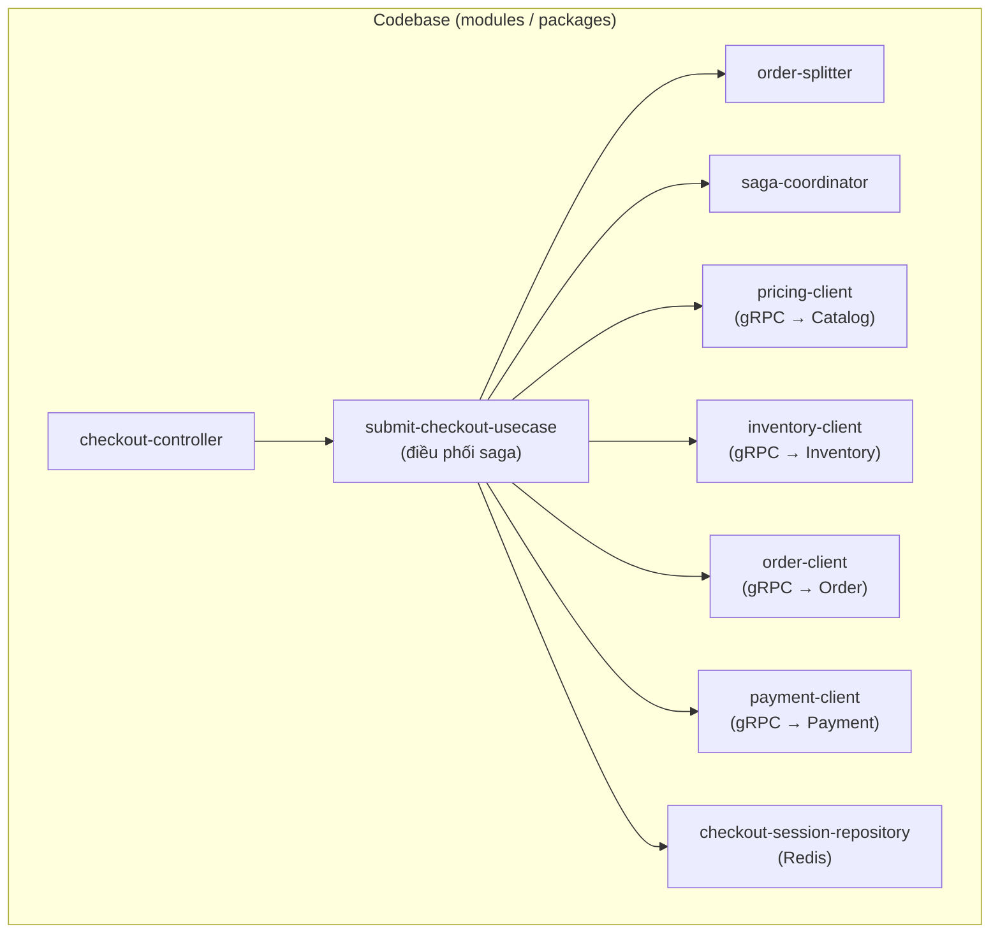
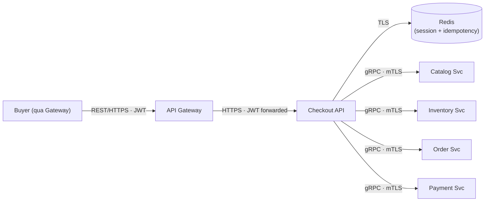
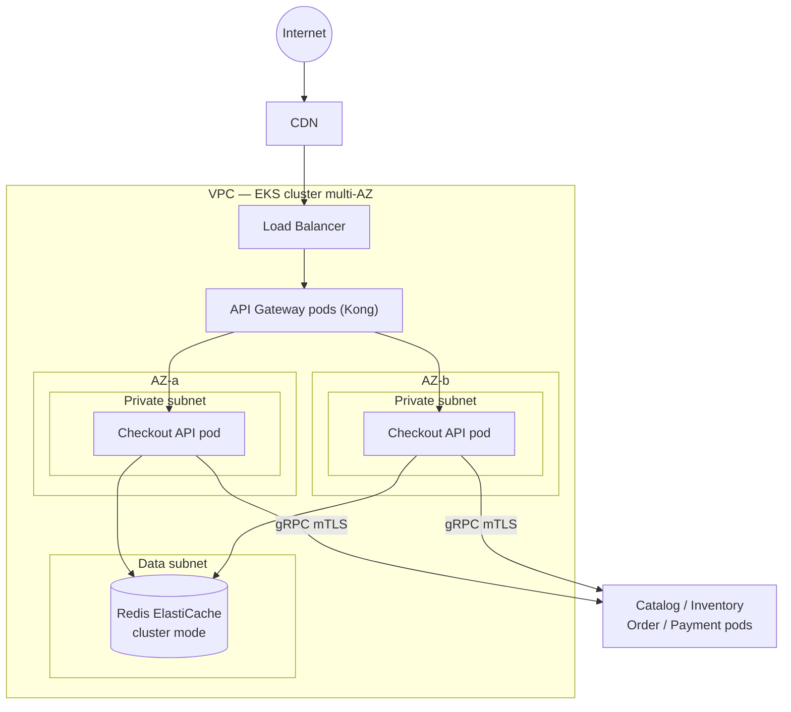
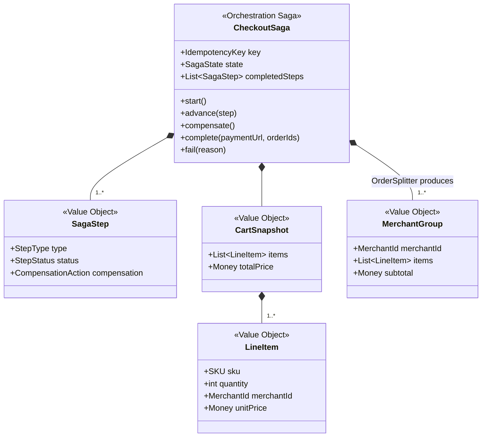
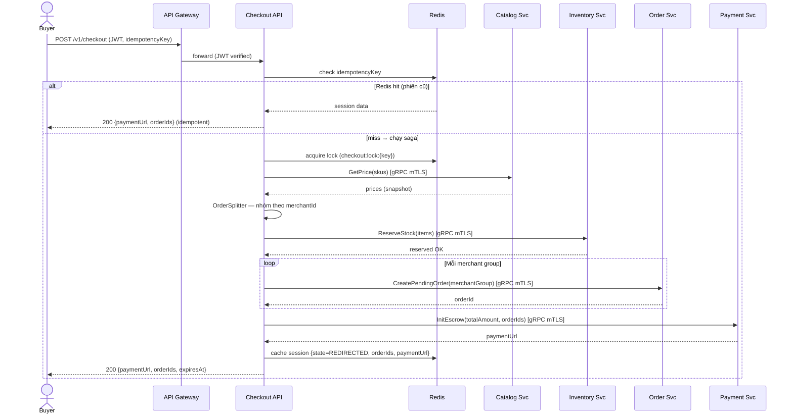
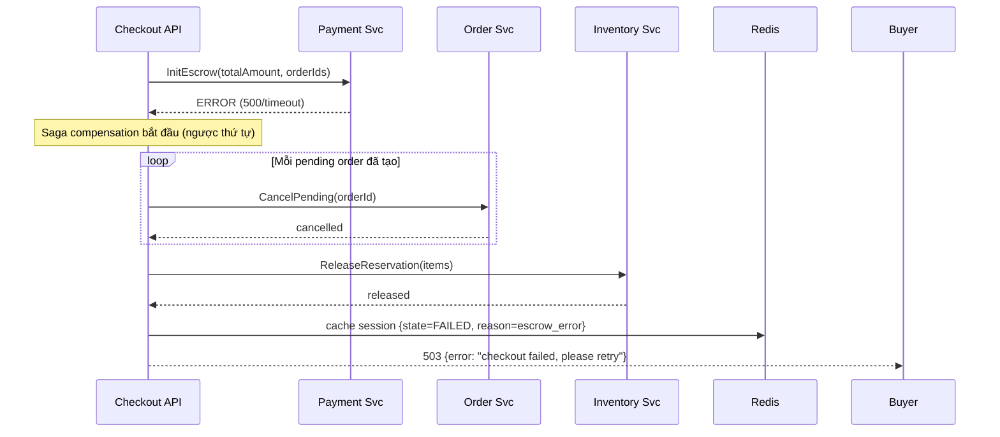
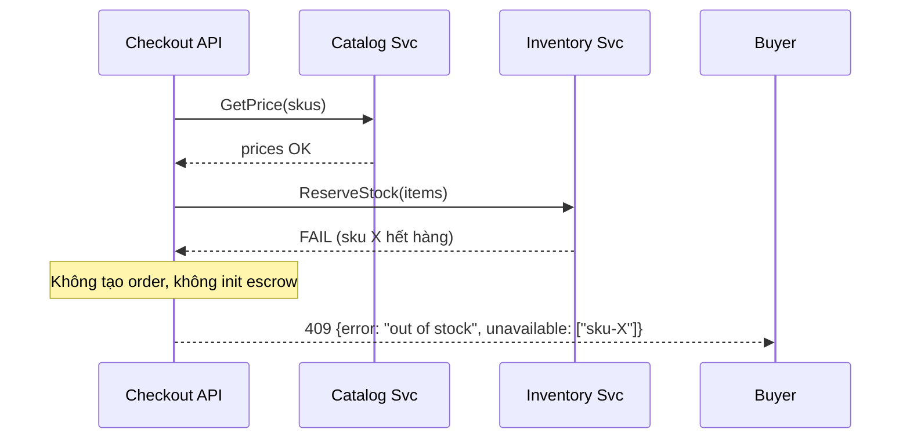

# Detailed Design — Checkout Service (Orchestrator)

> **Status:** Draft v1.0 ·
> **Owner:** Checkout team ·
> **Reviewers:** _TBD_
>
> **Liên kết:**
> - SDD-MKTPLACE-CORE-v1.0 — mục 3.2.1, 4.1.1, 9.2
> - OpenAPI spec
> - IaC / Terraform

> **Classification**: **Tier 2 — Business Critical** _(checkout gián đoạn = mất doanh thu nhưng không mất tiền đã giữ — escrow thuộc Payment Tier 1)_
>
> **Data class:** L2 (cart items, session metadata) + L3 (thông qua: giá snapshot, merchantId) · **System Owner:** Checkout team ⇒ **RTO < 4h · RPO < 1h** (§2). Tiêu chuẩn: System Tiering · Data Classification.

# 1. Context & Scope

Checkout Service là **orchestrator nội bộ** điều phối luồng từ "Buyer bấm đặt hàng" tới "redirect sang cổng thanh toán". Service gọi đồng bộ (gRPC) tới 4 bounded context khác để hoàn tất một saga. Checkout **gần như stateless** — chỉ giữ phiên tạm ở Redis (TTL 30 phút), không có database riêng.

**Ranh giới bounded context:**

- **Vào:** REST `POST /v1/checkout` từ API Gateway (JWT, qua BFF).
- **Ra (đồng bộ, gRPC, mTLS):** Catalog.GetPrice, Inventory.ReserveStock, Order.CreatePendingOrder, Payment.InitEscrow.
- **Không thuộc context:** xử lý kết quả thanh toán (Payment webhook), state machine đơn sau khi đã tạo (Order Svc), quản lý giỏ hàng (Cart — context riêng hoặc client-side), tồn kho (Inventory).

**Trust boundary:** mọi caller phải mang JWT hợp lệ qua Gateway; mọi gọi gRPC nội bộ qua mTLS (SVID). Không ngầm tin cậy từ vị trí mạng. Chi tiết cơ chế ở §3.2/§3.3/§4.

**Goals:**

- Tổng hợp giá từ Catalog (snapshot), reserve kho từ Inventory, tự động tách đơn theo Merchant, tạo pending order, khởi tạo escrow — tất cả trong một saga đồng bộ.
- Compensation tập trung: một bước lỗi → rollback các bước trước (release reservation, hủy pending order).
- Idempotency: double-submit cùng key → trả kết quả cũ, không chạy lại saga.

**Non-goals:**

- Không xử lý webhook thanh toán (Payment Svc).
- Không quản lý state machine đơn hàng (Order Svc).
- Không quản lý giỏ hàng / cart.
- Không lưu trữ dữ liệu bền vững (stateless, phiên ở Redis).

# 2. Requirements (tóm tắt — nguồn đầy đủ ở backlog)

**Functional:**

| # | Yêu cầu | Giải thích |
| --- | --- | --- |
| FR1 | Tổng hợp giá (price snapshot) | Gọi Catalog.GetPrice, gắn giá tại thời điểm checkout vào pending order — không tin giá từ client |
| FR2 | Reserve kho | Gọi Inventory.ReserveStock; hết hàng → trả 409, không tạo đơn |
| FR3 | Tách đơn theo Merchant (OrderSplitter) | Nhóm items theo `merchantId` → tạo N pending order (mỗi Merchant một đơn), nhưng một escrow cho tổng giỏ |
| FR4 | Tạo pending order | Gọi Order.CreatePendingOrder cho mỗi nhóm Merchant |
| FR5 | Khởi tạo escrow | Gọi Payment.InitEscrow (tổng giỏ), trả `paymentUrl` cho Buyer |
| FR6 | Compensation (saga rollback) | Escrow lỗi → hủy pending order → release reservation. Reserve một phần thành công rồi lỗi → release các SKU đã reserve |
| FR7 | Idempotency | Header `Idempotency-Key` bắt buộc; cùng key → trả kết quả phiên cũ (Redis), không chạy lại saga |

**Non-functional / SLO (Tier 2):**

| Thuộc tính | Mục tiêu |
| --- | --- |
| Checkout P99 latency (end-to-end) | < 800 ms (bao gồm orchestration nhiều context) |
| API availability | ≥ 99.9% |
| RTO / RPO | RTO < 4h · RPO < 1h |
| Throughput | 3.000 RPS sustained (flash sale) |
| Degraded mode | Catalog/Inventory down ⇒ 503 (không tạo đơn sai giá/kho) |

# 3. Design overview

## 3.1 Module view (cấu trúc tĩnh — code chia ra sao)



| Module | Trách nhiệm | Không được thực hiện |
| --- | --- | --- |
| `checkout-controller` | Kết thúc HTTP; validate request; extract JWT claims (`userId`, `tenantScope`); điều phối tới use-case | Gọi gRPC trực tiếp; chứa luật saga/compensation; chứa business logic tách đơn |
| `submit-checkout-usecase` | Điều phối toàn bộ saga: pricing → reserve → split → create order → init escrow; xử lý idempotency (check Redis → chạy saga → cache kết quả); gọi compensation khi lỗi | Biết chi tiết protocol gRPC; biết cấu trúc Redis key; gọi provider bên ngoài |
| `order-splitter` | Nhóm items theo `merchantId` → tạo N nhóm đơn. Pure logic, không I/O | Gọi gRPC; persist; quyết giá; quyết reserve |
| `saga-coordinator` | Theo dõi trạng thái từng bước saga; khi lỗi → gọi compensation ngược thứ tự (release reserve, cancel order); đảm bảo không reservation mồ côi | Gọi provider trực tiếp; chứa luật tách đơn; persist |
| `pricing-client` | Gọi Catalog.GetPrice (gRPC, mTLS); map response → domain DTO | Chứa luật business; persist; quyết tách đơn |
| `inventory-client` | Gọi Inventory.ReserveStock / Release (gRPC, mTLS) | Chứa luật business; persist |
| `order-client` | Gọi Order.CreatePendingOrder / CancelPending (gRPC, mTLS) | Chứa luật business; persist |
| `payment-client` | Gọi Payment.InitEscrow (gRPC, mTLS); trả `paymentUrl` | Chứa luật business; persist; gọi cổng thanh toán (việc của Payment Svc) |
| `checkout-session-repository` | Đọc/ghi phiên checkout tạm ở Redis (`checkout:{idempotencyKey}` → `{status, orderIds, paymentUrl}`, TTL 30 phút); cung cấp idempotency fast-path | Chứa luật business; gọi gRPC |

**Behavior notes:**

> **BN-1 · Compensation order (saga-coordinator):** compensation chạy ngược thứ tự bước đã thành công. Ví dụ: nếu escrow lỗi sau khi đã tạo order + reserve → (1) cancel pending orders, (2) release reservations. Không bao giờ để reservation/order mồ côi — đây là invariant cốt lõi.

> **BN-2 · Idempotency (submit-checkout-usecase + checkout-session-repository):** check Redis trước (fast-path); nếu hit → trả kết quả cũ, không chạy saga. Nếu miss → chạy saga → cache kết quả. Redis là thẩm quyền duy nhất (khác Notification Svc dùng DB vì Checkout stateless, phiên có TTL ngắn). Mất Redis = mất idempotency → double-submit có thể tạo đơn trùng → cần monitoring.

## 3.2 C&C view (cấu trúc runtime)



**Connector catalog (zero-trust):**

| Connector | From → To | Protocol | Authn / Authz |
| --- | --- | --- | --- |
| inbound | Gateway → Checkout API | HTTPS | JWT (RS256) forwarded; Gateway đã verify; Checkout validate claims |
| session | Checkout API → Redis | TLS | Auth token / IAM; least-priv (read/write session keys) |
| pricing | Checkout API → Catalog Svc | gRPC | mTLS (SVID); service identity; scope `catalog:read:price` |
| reserve | Checkout API → Inventory Svc | gRPC | mTLS (SVID); truyền `merchantId` để Inventory áp tenant scope |
| order | Checkout API → Order Svc | gRPC | mTLS (SVID); truyền `merchantId` |
| escrow | Checkout API → Payment Svc | gRPC | mTLS (SVID); scope `payment:init:escrow` |

**View-to-view mapping (module ↦ runtime component):**

| Module | Nằm trong runtime component |
| --- | --- |
| `checkout-controller`, `submit-checkout-usecase`, `order-splitter`, `saga-coordinator` | Checkout API |
| `pricing-client`, `inventory-client`, `order-client`, `payment-client` | Checkout API (gọi ra ngoài) |
| `checkout-session-repository` | Checkout API → Redis |

> Checkout chỉ có một runtime component (Checkout API pods) + Redis (managed). Không có worker/relay/queue — vì saga đồng bộ.

## 3.3 Deployment view



**Thực thi zero-trust ở tầng deploy:**

- NetworkPolicy default-deny; chỉ mở GW→Checkout, Checkout→Redis, Checkout→peers (gRPC).
- Workload identity qua IRSA — Checkout có ServiceAccount + IAM role riêng (chỉ truy cập Redis, không truy cập DB nào).
- Không egress ra Internet (Checkout không gọi external provider — Payment Svc làm việc đó).
- Checkout stateless → HPA scale theo RPS; không cần drain phức tạp (request đồng bộ, không in-flight queue message).

# 4. Interfaces & data

> **Nguồn sự thật:** contract đầy đủ ở OpenAPI spec + proto files. Dưới đây chỉ giữ ngữ nghĩa quan trọng.

## 4.1 API

### 4.1.1 `POST /v1/checkout`

```json
// Request
{
  "cartId": "uuid",                    // HOẶC items[] dưới đây
  "items": [
    {"sku": "string", "quantity": 1, "merchantId": "uuid"}
  ],
  "idempotencyKey": "uuid"             // bắt buộc — header hoặc body
}

// 200 OK
{
  "paymentUrl": "https://pg.example.com/pay/...",
  "orderIds": ["uuid-1", "uuid-2"],    // N đơn (tách theo Merchant)
  "expiresAt": "RFC3339"               // reservation + session hết hạn
}
```

**Mã lỗi:**

| Code | Khi nào |
| --- | --- |
| `400` | Sai schema / thiếu field bắt buộc / items rỗng |
| `401 / 403` | JWT không hợp lệ / không có quyền checkout |
| `409` | Hết hàng (reserve fail) — trả danh sách SKU không đủ |
| `422` | SKU không tồn tại / merchantId không hợp lệ |
| `429` | Rate limit (per-user) |
| `503` | Downstream service unavailable (Catalog/Inventory/Order/Payment timeout) |

**Authz model:**

| Scope | Cho phép | Ràng buộc |
| --- | --- | --- |
| `checkout:submit` | Buyer đặt hàng | Chỉ role Buyer; items phải thuộc Merchant hợp lệ (active) |
| `checkout:read` | Xem trạng thái phiên | Chỉ phiên của chính user |

- **Chống giá giả:** giá luôn lấy từ Catalog.GetPrice, không bao giờ từ client request. Client gửi `sku` + `quantity` + `merchantId`; giá là snapshot server-side.
- **Tenant enforcement:** `merchantId` trong items được validate với Catalog; Inventory/Order nhận `merchantId` để áp isolation.
- **IDOR:** phiên checkout gắn `userId` từ JWT; `GET /v1/checkout/{id}` phải kiểm `userId == JWT.sub`.

## 4.2 Domain model

> Checkout không có aggregate phức tạp vì stateless. Mô hình chính là CheckoutSaga — một value object tạm thời trong bộ nhớ.



**Invariant:**

1. SagaState tiến một chiều: `PRICING → RESERVING → ORDERING → ESCROWING → REDIRECTED | FAILED`; terminal bất biến.
2. Compensation chạy ngược thứ tự bước đã thành công — không bao giờ bỏ bước.
3. Không tạo order nếu chưa reserve thành công.
4. Không init escrow nếu chưa tạo đủ pending orders.
5. `IdempotencyKey` immutable sau khi tạo phiên.
6. Không reservation mồ côi: nếu saga fail sau reserve → phải release. Đây là fitness function bắt buộc.

## 4.3 Data model — Redis key schema

> Checkout không có DB riêng. Dữ liệu bền vững thuộc Order/Payment. Chỉ có Redis session:

| Key pattern | Value | TTL | Mục đích |
| --- | --- | --- | --- |
| `checkout:{idempotencyKey}` | `{state, orderIds, paymentUrl, userId, createdAt}` | 30 phút | Idempotency + session |
| `checkout:lock:{idempotencyKey}` | `{lockOwner}` | 10 giây | Distributed lock chống race condition cùng key |

> Mất Redis: phiên checkout mất → user retry tạo phiên mới (chấp nhận được vì reservation ở Inventory có TTL riêng, sẽ tự giải phóng). Double-submit risk tăng → monitoring alert.

## 4.4 Config & tunables

| Tham số | Khởi điểm | Ghi chú |
| --- | --- | --- |
| `checkout.reserve_ttl_min` | 15 phút | TTL giữ chỗ kho ở Inventory; quá hạn → đơn auto-cancel |
| `checkout.session_ttl_min` | 30 phút | TTL phiên checkout ở Redis |
| `checkout.grpc_timeout_ms` | 2000 ms | Timeout mỗi gọi gRPC nội bộ |
| `checkout.grpc_retry_max` | 1 | Retry gRPC khi timeout (chỉ Catalog — idempotent read) |
| `checkout.max_items_per_cart` | 50 | Giới hạn items trong một lần checkout |
| `checkout.max_merchants_per_cart` | 10 | Giới hạn số Merchant trong một giỏ |
| `checkout.rate_limit_per_user` | 5 req/60s | Chống spam checkout |
| `checkout.feature_flag` | `checkout.v2_orchestrator` | Feature flag cho canary rollout |

## 4.5 Personal data handling

> Checkout là transit node — dữ liệu cá nhân đi qua nhưng không persist (trừ Redis TTL ngắn).

**Data inventory:**

| Data element | Class | Nguồn | Lưu ở đâu | Mục đích | Retention | Rời service đi đâu |
| --- | --- | --- | --- | --- | --- | --- |
| `userId` (từ JWT) | L2 | Gateway/JWT | Redis session (30m) | Xác định buyer | TTL 30 phút | Order Svc (gắn vào pending order) |
| `merchantId` | L2 | Client request | Redis session (30m) | Tách đơn, tenant scope | TTL 30 phút | Inventory/Order/Payment (context riêng) |
| Cart items (sku, qty) | L2 | Client request | Redis session (30m) | Nội dung đặt hàng | TTL 30 phút | Order Svc (pending order) |
| Giá snapshot | L2 | Catalog Svc | Không persist ở Checkout | Tính tổng | Transient (bộ nhớ) | Order Svc (gắn vào order) |

**Delta privacy:**

- DSAR trivial: Checkout không persist dữ liệu lâu dài. Redis TTL tự xóa. Nếu DSAR đến trong lúc phiên còn sống → xóa key Redis.
- Không transfer ra ngoài: Checkout không gọi external provider. Dữ liệu chỉ truyền nội bộ (gRPC mTLS) tới các bounded context khác.

# 5. Key flows

> Sequence ở mức C&C view — lifeline là runtime component.

## 5.1 Happy path — Checkout orchestration



## 5.2 Compensation — Escrow lỗi



## 5.3 Fail-fast — Hết hàng



# 6. Operations & Resilience

> DR cấp platform xem SDD-MKTPLACE-CORE-v1.0 — dưới đây chỉ delta của component.

**Backup & Recovery (delta):**

- **Redis (session + idempotency — ephemeral):** không backup. Mất Redis → phiên checkout mất, user retry tạo phiên mới. Reservation ở Inventory có TTL riêng → tự giải phóng, không mồ côi.
- **Không có DB** → không cần PITR, migration.

**CI/CD (delta):**

- Deploy strategy: **canary** (do Tier 2 + orchestrator quan trọng) — feature flag `checkout.v2_orchestrator`; canary 10% → 50% → 100%.
- Theo dõi `checkout_saga_compensation_total` và `checkout_failed_total` — spike → auto-rollback.
- Stateless → rolling update nhanh; request đồng bộ nên graceful shutdown chỉ cần drain HTTP connections (30s).

# 7. Decisions & cross-cutting deltas (ADR-style)

**ADR-1 — Orchestration (không choreography) cho luồng checkout.**
Checkout cần kiểm soát compensation tập trung vì liên quan tiền (escrow). Choreography khó đảm bảo thứ tự rollback và phát hiện reservation mồ côi. _Hệ quả:_ Checkout là single point of coordination; nếu down → không checkout được (chấp nhận — Tier 2).

**ADR-2 — Một escrow cho tổng giỏ (không per-Merchant escrow).**
Buyer trả một lần cho toàn bộ giỏ; Payment giữ tổng, phân bổ khi settle (sau khi từng đơn Merchant hoàn tất). _Hệ quả:_ đơn giản hóa checkout flow; phức tạp hơn ở Settlement (Payment Svc).

**ADR-3 — Stateless + Redis session (không DB).**
Checkout không cần durability — phiên có TTL ngắn, dữ liệu bền vững thuộc Order/Payment. Giảm complexity, scale dễ. _Hệ quả:_ mất Redis = mất idempotency tạm thời; reservation tự giải phóng qua TTL.

**ADR-4 — Giá snapshot server-side (không tin client).**
Client gửi SKU + quantity; Checkout gọi Catalog lấy giá thực. Chống giá giả / manipulation. _Hệ quả:_ thêm một gọi gRPC; nếu Catalog down → checkout fail (fail-safe, không tạo đơn sai giá).

**ADR-5 — Reservation TTL 15 phút.**
Đủ thời gian để Buyer hoàn tất thanh toán; không quá dài để block kho. Quá hạn → Inventory tự release → Order auto-cancel. _Cần theo dõi:_ tỷ lệ reservation timeout để tune.

**Cross-cutting deltas:**

- **Input validation (security):** validate server-side toàn bộ — `sku` phải tồn tại, `merchantId` phải active, `quantity` > 0 và ≤ max, `items.length` ≤ 50. Không trust client.
- **Tenant scope propagation:** mọi gRPC call truyền `merchantId` để downstream áp tenant isolation — Inventory/Order không trả dữ liệu cross-tenant.
- **Reliability/alert:** alert khi compensation spike (P2), checkout fail rate > 5% (P2), Redis connection loss (P1).
- **Observability:** metrics `checkout_started_total`, `checkout_success_total`, `checkout_failed_total{reason}`, `checkout_saga_compensation_total`, `checkout_duration_ms`; trace context propagate qua mọi gRPC child span.

**Zero-trust — anchor index:**

| Nguyên tắc (SAD) | Thực thi trong Tech Spec này |
| --- | --- |
| Identity, không theo mạng | §3.2 connector catalog (mTLS/SVID mọi gRPC); JWT tại Gateway |
| Least privilege | §3.3 IRSA chỉ truy cập Redis; không DB; không egress Internet |
| Assume breach | §3.3 NetworkPolicy default-deny |
| No long-lived creds | §3.3 IRSA + SVID auto-rotate |
| Protect data | §4.5 transit node — không persist PII; TLS toàn tuyến |

**Trust boundary & threat seed:**

| Threat (STRIDE) | Bề mặt | Đối ứng |
| --- | --- | --- |
| **S**poofing | Giả JWT / giả service identity | Gateway verify JWT (RS256); gRPC mTLS verify SVID |
| **T**ampering | Sửa giá trong request | Giá lấy từ Catalog server-side, không từ client (ADR-4) |
| **R**epudiation | Buyer phủ nhận đã checkout | Session log ở Redis + pending order ở Order Svc |
| **I**nfo disclosure | Xem phiên checkout người khác | IDOR check: `userId == JWT.sub` (§4.1) |
| **D**oS | Spam checkout | Rate limit per-user 5/60s (§4.4) |
| **E**levation | Merchant checkout giá tự đặt | Giá từ Catalog; `merchantId` validate; chỉ role Buyer |

# 8. Test strategy

> Hexagonal + stateless cho phép test dễ dàng không cần infra nặng.

- **Unit** (`order-splitter`, `saga-coordinator`): luật tách đơn thuần logic; compensation order đúng — không cần Redis/gRPC.
- **Contract test:** gRPC proto contract với Catalog/Inventory/Order/Payment; consumer-driven.
- **Integration:** mock downstream gRPC; test mỗi bước lỗi → compensation đúng; Redis idempotency.
- **Failure-injection:** Catalog timeout → 503, không reserve; Inventory fail → 409; Escrow fail → compensation đầy đủ (cancel order + release reserve).
- **Idempotency:** cùng key → trả kết quả cũ; khác key → saga mới.
- **Fitness function (bắt buộc):** "không reservation mồ côi sau checkout failed" — chạy định kỳ: query Inventory reservations không có matching pending order.

**Acceptance criteria mẫu:**

- _Tách đơn:_ cho giỏ có items từ 3 Merchant → khi checkout thành công → tạo đúng 3 pending order + 1 escrow.
- _Compensation:_ cho escrow lỗi sau khi đã tạo 2 pending order + reserve → khi compensation xong → 2 order cancelled, reservation released, Redis state = FAILED.
- _Idempotency:_ cho 2 request cùng `idempotencyKey` → chỉ 1 saga chạy, request thứ hai trả kết quả cũ.
- _Hết hàng:_ cho SKU X hết → khi checkout → 409, không tạo order/escrow.

# 9. Open questions

1. **Partial checkout:** nếu chỉ một số SKU hết hàng, cho phép checkout phần còn lại hay fail toàn bộ? (Hiện tại: fail toàn bộ.)
2. **Cart ownership:** Cart thuộc context nào? Client-side hay Cart Svc riêng? Ảnh hưởng `cartId` vs `items[]` trong API.
3. **Coupon / promotion:** ai tính giảm giá — Checkout hay Catalog? Nếu Checkout → thêm module `promotion-engine`; nếu Catalog → giá snapshot đã bao gồm.
4. **Reservation extension:** nếu Buyer chưa trả tiền nhưng phiên còn → có renew reservation không? (Hiện tại: không — TTL 15 phút cố định.)
5. **Multi-currency:** tất cả giá cùng currency hay Checkout cần convert? (Hiện tại: giả định single currency VND.)
6. **Audit trail:** cần ghi log saga steps vào đâu để truy vết? Redis TTL quá ngắn; có cần ghi event vào Kafka cho audit? (Hiện tại: chỉ metrics + trace.)
