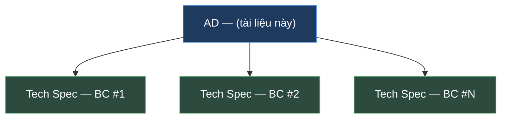
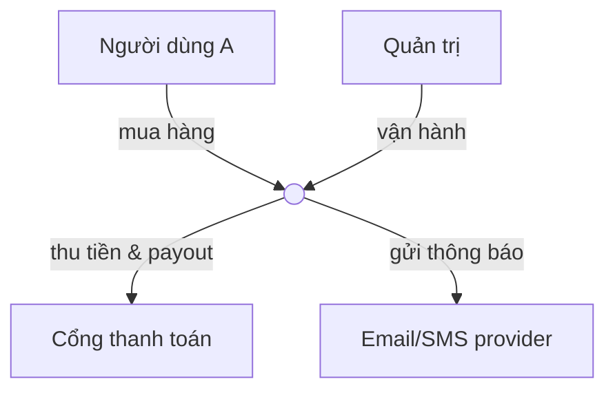
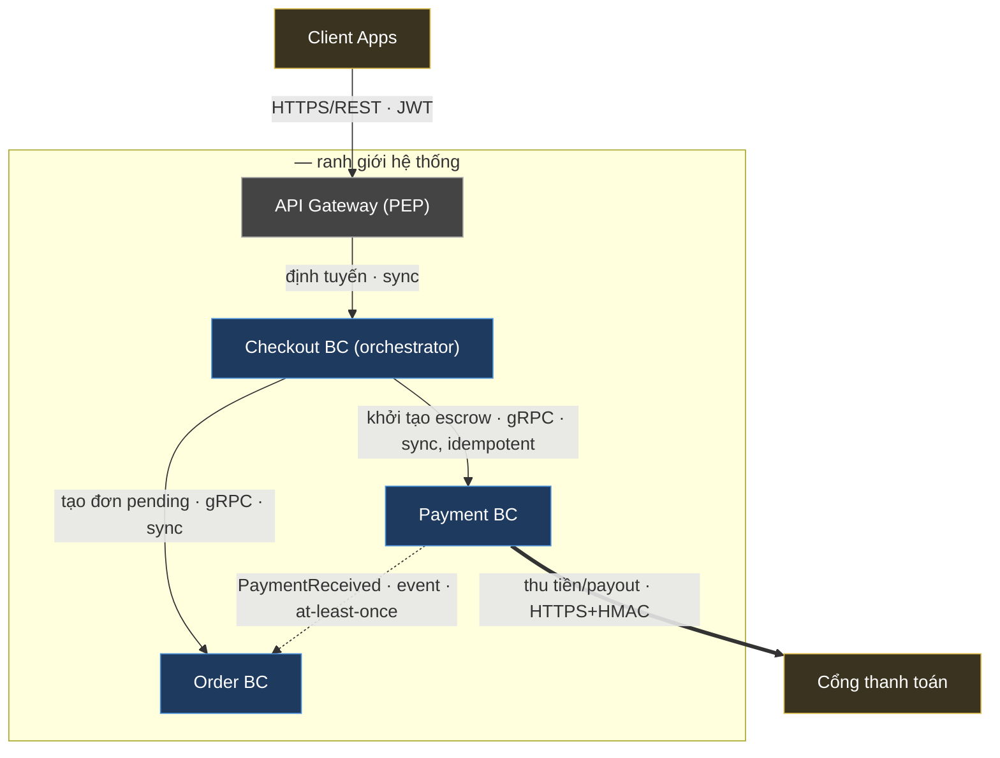
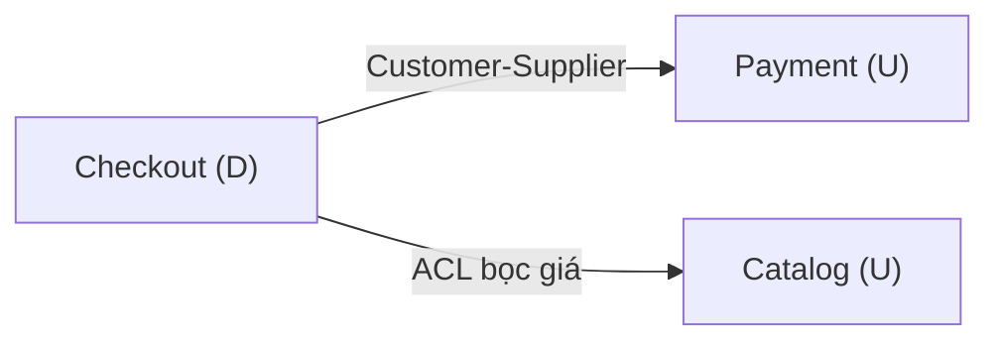
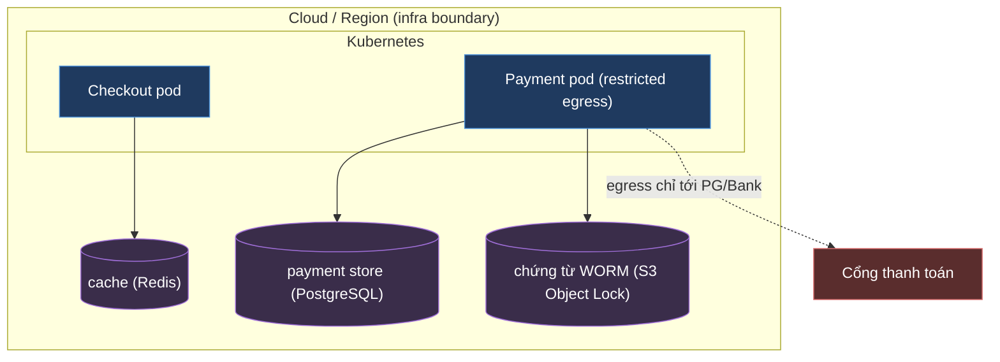
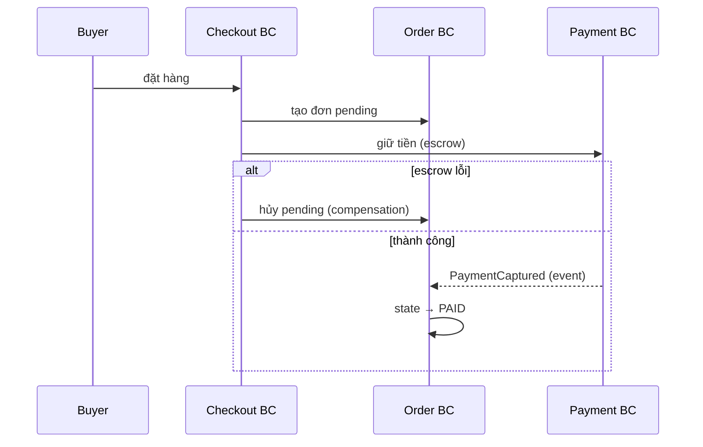
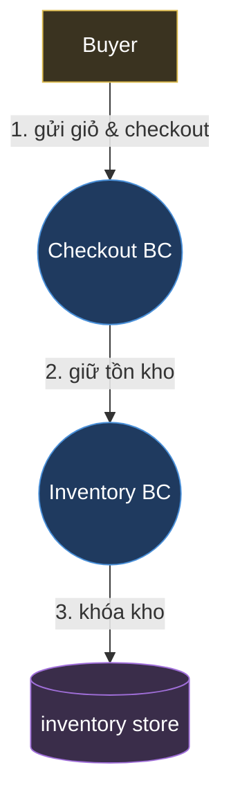
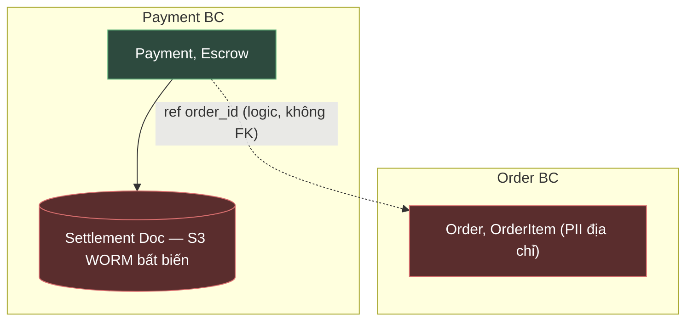
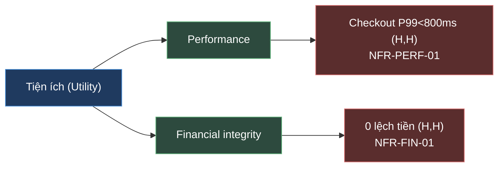

# ARCHITECTURE DOCUMENT (AD) — <TÊN HỆ THỐNG>

| Thông tin tài liệu | Giá trị |
| --- | --- |
| Mã tài liệu | `AD-<HỆ-THỐNG>-v0.1` |
| Loại | **Architecture Document (AD)** — cấp hệ thống (**1 file / hệ thống**) |
| Phiên bản | `0.1.0` |
| Trạng thái | ☐ Draft for review |
| Ngày tạo | YYYY-MM-DD |
| Cập nhật lần cuối | YYYY-MM-DD |
| Dự án / Hệ thống | «tên + mô tả ngắn» |
| Mức độ bảo mật | ☑ Internal |
| Quy tắc viết | `STD-DOC-v1.15` — [docs/stds/QuyTac-AD-va-TechSpec.md](../stds/QuyTac-AD-va-TechSpec.md) |
| Neo chuẩn | ISO/IEC/IEEE 42010:2022 · arc42 · C4 · DDD Context Mapping |
| Sơ đồ | Mermaid (toàn bộ) |
| Ngoài phạm vi | **Architecture-as-Code** (sinh view từ model, fitness function, drift detection, pipeline) — tài liệu riêng. |

> **🧭 Cách dùng template này** *(xóa toàn bộ khối chú thích `>` và các `«...»` khi viết bản thật)*
> - Template này **bám đúng cấu trúc** bản mẫu [AD-Marketplace-AiGen.md](../design/AD-Marketplace-AiGen.md) (9 mục + Phụ lục). Mỗi mục có:
>   🎯 **Mục đích** · 📐 **Quy tắc** (`R-xx` phải tuân, ❌`Gxx` cần tránh) · ✍️ **Hướng dẫn** (kèm *Đẩy xuống Tech Spec*) · 🧩 **Khung mẫu**.
> - **Nguyên tắc vàng (R-0 / R-0.1):** *1 hệ thống = 1 AD; mỗi BC = 1 Tech Spec.* AD = quan hệ & ranh giới **GIỮA** các BC. Phép thử: *"đổi cái này có buộc BC khác phải biết không?"* → Có = AD, Không = Tech Spec.
> - **§6/§8/§9 dùng kiểu "Conform baseline + Delta":** không chép lại nội dung baseline tổ chức; chỉ **trỏ baseline** (pin version) rồi ghi phần **đặc thù** hệ thống.
> - Mục không áp dụng: ghi `N/A — <lý do>`, **không** bỏ trắng (arc42).

**Lịch sử thay đổi**

| Phiên bản | Ngày | Tác giả | Mô tả thay đổi | Người duyệt |
| --- | --- | --- | --- | --- |
| 0.1.0 | YYYY-MM-DD | [Tác giả] | Tạo mới theo `STD-DOC-v1.15`. | [Duyệt] |

> **Mô hình tài liệu (R-0):** hệ thống có **đúng 01 AD này** + **01 Tech Spec / BC**. AD giữ thứ ổn định; chi tiết hiện thực (schema, field/mã lỗi, framework từng BC) **đẩy xuống** Tech Spec/contract. Ánh xạ AD ↔ Tech Spec ở **Phụ lục A.4**.



---

# 1. TỔNG QUAN HỆ THỐNG

## 1.1 Mục tiêu hệ thống

🎯 **Mục đích:** bài toán nghiệp vụ; **quality goal đo được**; vòng đời giao dịch end-to-end.
📐 **Quy tắc (R-A2):** quality goal phải **đo được** (số + đơn vị) — sẽ thành lá utility tree §7. KPI vận hành chi tiết → dashboard (ngoài AD).
✍️ **Hướng dẫn:** mở bằng **2–4 đoạn tường thuật** bối cảnh nghiệp vụ (đặc tính nào tạo ra độ phức tạp), rồi liên kết *đặc tính nghiệp vụ → quyết định kiến trúc*. Sau đó là bảng mục tiêu M1, M2… gắn được với NFR §7.

🧩 **Khung mẫu**

```
«2–4 đoạn: hệ thống giải bài toán gì, cho ai; đặc tính nghiệp vụ cốt lõi nào
sinh ra độ phức tạp; vòng đời một giao dịch end-to-end; ánh xạ
"đặc tính nghiệp vụ → quyết định kiến trúc".»
```

| # | Mục tiêu | Mô tả | Quality goal (đo được) |
| --- | --- | --- | --- |
| M1 | «...» | «...» | «vd ≥ 10.000 tenant; chính xác 100%» |
| M2 | «...» | «...» | «vd 0 lệch tiền; đối soát khớp 100%» |

## 1.2 Phạm vi hệ thống

🎯 **Mục đích:** biên hệ thống — in/out scope + sơ đồ ngữ cảnh C4 L1.
📐 **Quy tắc (D.1, R-D6):** L1 chỉ "nối ai, để làm gì" — **không protocol, không lộ BC**; hệ thống là **một hộp** trong vùng bao.
✍️ **Hướng dẫn:** ngoài-scope nêu rõ để tránh hiểu lầm trách nhiệm; gắn lộ trình (ADR) cho thứ "chưa có ở v1".
*Đẩy xuống Tech Spec:* payload chi tiết từng API.

🧩 **Khung mẫu**

```
### 1.2.1 Trong phạm vi
- «...»
### 1.2.2 Ngoài phạm vi
- «...» (lý do / lộ trình ADR-xxxx)
```

```
### 1.2.3 Sơ đồ ngữ cảnh (Context Diagram — C4 Level 1)
```



| Hệ thống ngoài | Loại tương tác | Mô tả |
| --- | --- | --- |
| «Cổng thanh toán» | API + Webhook | «...» |

## 1.3 Các bên liên quan (Stakeholders)

🎯 **Mục đích:** ai đọc tài liệu + concern của mỗi nhóm.
📐 **Quy tắc:** ghi *vai trò* + *concern*, không nhân sự/liên hệ cụ thể.
✍️ **Hướng dẫn:** concern nên trỏ được tới mục AD trả lời nó.

🧩 **Khung mẫu**

| Bên liên quan | Vai trò | Loại | Kỳ vọng (concern) |
| --- | --- | --- | --- |
| «Buyer» | End user | External | «...» |
| «Security team» | Interested | Internal | «cô lập tenant; audit; Zero-Trust» (§6) |
| «SRE / Ops» | Interested | Internal | «vận hành; quan sát; phục hồi» (§8, §9) |

## 1.4 Giả định & Ràng buộc

🎯 **Mục đích:** giả định nền + ràng buộc kỹ thuật/pháp lý/tổ chức giới hạn thiết kế.
📐 **Quy tắc (R-A3 / R-C1):** giá trị cấu hình cụ thể (TTL, sizing, threshold, secret) → Tech Spec/config/Vault, **không** ở AD. Ràng buộc binding-tech ghi `năng lực (sản phẩm)` (R-C11). `TBD` đánh dấu tường minh (R-C5).
✍️ **Hướng dẫn:** ràng buộc binding (vd "Kafka làm event bus chuẩn org") ghi ở đây và tái xuất ở §2.4/§5 dạng rule.

🧩 **Khung mẫu**

```
### 1.4.1 Giả định
- «...»
### 1.4.2 Ràng buộc
```

| Loại | Ràng buộc | Tác động thiết kế |
| --- | --- | --- |
| Kỹ thuật | «PostgreSQL chuẩn org; Kafka event bus» | DB-per-context; không FK xuyên BC |
| Pháp lý | «vd NĐ 13/2023 (PII)» | retention §5; data residency |

> ⚠️ **Open item (TBD):** «mô tả» — nguyên tắc đã chốt, literal chờ ADR riêng. Xem §x.

---

# 2. KIẾN TRÚC TỔNG THỂ

## 2.1 Kiểu kiến trúc

🎯 **Mục đích:** kiểu kiến trúc + lý do + trade-off; **nguyên tắc thiết kế xuyên suốt**; phân loại công nghệ binding/indicative.
📐 **Quy tắc (R-C3/R-C9/R-C11):** công nghệ chỉ nêu khi **binding**, ghi `năng lực (sản phẩm)`. Polyglot framework từng BC = **indicative** → Tech Spec (❌G6).
✍️ **Hướng dẫn:** đây là nơi **pin một chỗ** mọi quyết định nền tảng + binding-tech, để §5/§7/§2.4 chỉ *trỏ tới*.

🧩 **Khung mẫu**

| Kiểu | Lý do | Trade-off |
| --- | --- | --- |
| «Microservices theo BC + Orchestration + Event-Driven» | «...» | «saga/compensation, eventual consistency» |

```
### 2.1.1 Nguyên tắc thiết kế kiến trúc
- Database per Context — không chia sẻ DB, không FK xuyên BC.
- «nguyên tắc binding khác» · «...».
```

> **Phân loại công nghệ (R-C3 / R-C11):** ghi `năng lực (sản phẩm)`.
> - **Binding** (load-bearing): `event bus / async (Kafka)` · `relational store per-context (PostgreSQL)` · `immutable doc store / WORM (S3 Object Lock)` · `search index (Elasticsearch)` · `cache & phiên ephemeral (Redis)`.
> - **Indicative** (→ Tech Spec): runtime/framework **từng BC** = quyết định **polyglot**, không liệt kê như ràng buộc ở AD.

## 2.2 Sơ đồ kiến trúc cấp cao (C4 — mức BC, BC là hộp đục)

🎯 **Mục đích:** các **BC là hộp đục** + quan hệ + **hợp đồng/đảm bảo trên mỗi cạnh**; bảng BC; vai trò chi tiết từng BC.
📐 **Quy tắc:** **KHÔNG** vẽ ruột BC (service/component/datastore/framework — R-D5, ❌G5). Vùng bao system boundary (R-D6). Nhãn cạnh = ý định + protocol + sync/async; nét đứt = event; **cấm tên RPC method** (R-D2, ❌G4). Bảng BC **không** cột framework (❌G6) hay DB sở hữu (→ §5, ❌G5b). View **không phình** theo số BC.
✍️ **Hướng dẫn:** sau sơ đồ + legend, thêm **bảng BC** (trách nhiệm + bề mặt giao tiếp) rồi **đoạn tường thuật vai trò từng BC** (vì sao mỗi BC là ranh giới riêng). Edge/Gateway là hạ tầng (PEP), **không** là BC.
*Đẩy xuống Tech Spec:* mọi thứ bên trong hộp BC.

🧩 **Khung mẫu**



**Legend:** ▢ ranh giới hệ thống · 🟦 BC (hộp đục) · ▭ Gateway (edge/PEP) · 🟨 hệ ngoài. Nét liền = sync; nét đứt = event.

| BC (hộp) | Trách nhiệm / capability | Bề mặt giao tiếp (cung cấp · tiêu thụ) |
| --- | --- | --- |
| «Checkout» | «orchestrator: tách đơn, điều phối saga» | «cung cấp: POST /v1/checkout · tiêu thụ: giá, reserve, escrow (sync)» |
| «...» | «...» | «...» |

```
**Vai trò & trách nhiệm chi tiết từng BC:**
- **<BC> — <ẩn dụ ngắn>.** «vì sao tồn tại như một ranh giới riêng; sở hữu gì; upstream/downstream».
```

## 2.3 DDD Context Map _(optional — bắt buộc nếu dùng DDD)_

🎯 **Mục đích:** (a) quan hệ cộng tác **giữa team** (Customer–Supplier, Partnership, Conformist, Shared Kernel); (b) ngữ nghĩa tích hợp tại biên (ACL, OHS, Published Language).
📐 **Quy tắc:** §2.2 = topology + hợp đồng; §2.3 = ngữ nghĩa quan hệ. Không dùng DDD → bỏ, đưa chiều phụ thuộc vào bảng §2.2.
✍️ **Hướng dẫn:** nhãn = kiểu quan hệ DDD; U = upstream, D = downstream.

🧩 **Khung mẫu**



## 2.4 Mô hình triển khai

🎯 **Mục đích:** môi trường; sơ đồ deployment (node ↔ BC); chiến lược triển khai.
📐 **Quy tắc:** công nghệ dạng **rule/pattern** (`PostgreSQL per-context`), **KHÔNG literal** (sizing/version/instance-id/IP/ARN/YAML → IaC — R-C10, ❌G6b). Đa nền tảng → nhóm theo ranh giới hạ tầng + liên kết xuyên ranh giới + trust boundary/residency/egress (R-A25, ❌G17). Datastore ánh xạ **đúng một BC sở hữu** (❌G5b).
✍️ **Hướng dẫn:** datastore xuất hiện ở đây (không ở §2.2); node = `subgraph`.

🧩 **Khung mẫu**

```
### 2.4.1 Môi trường triển khai
| Môi trường | Mục đích | Ghi chú |
| --- | --- | --- |
| Dev / Staging / Prod | «...» | «...» |
```

```
### 2.4.2 Sơ đồ triển khai Production (C4 Deployment)
```



```
### 2.4.3 Chiến lược triển khai
«rolling/canary/blue-green; multi-AZ; HPA theo RPS — rule, không literal».
```

---

# 3. LUỒNG DỮ LIỆU

🎯 **Mục đích:** kịch bản end-to-end & saga/compensation **XUYÊN BC**; DFD; luồng event bất đồng bộ.
📐 **Quy tắc (R-D7):** chỉ flow **xuyên nhiều BC** (flow nội bộ 1 BC → Tech Spec §5, ❌G8). `sequenceDiagram` mặc định; flow tầm thường → prose (❌G12). DFD ở **mức loại dữ liệu**, không field/schema (R-D9, ❌G13).
✍️ **Hướng dẫn:** mỗi happy path nêu kèm nhánh compensation; DFD bổ trợ khi cần thể hiện *dữ liệu chảy đi đâu* (không phải thứ tự).

🧩 **Khung mẫu**

```
## 3.1 Luồng chính (Happy Path)
### 3.1.1 <tên luồng — vd Checkout & tách đơn (Orchestration)>
```



```
## 3.2 Data Flow Diagram (mức loại dữ liệu)
```



```
## 3.3 Luồng bất đồng bộ (Event-Driven)
«liệt kê event chính (Published Language) + producer → consumer + đảm bảo».
```

---

# 4. GIAO DIỆN HỆ THỐNG

🎯 **Mục đích:** interface/event **giữa BC** ở mức *capability + đảm bảo*; điểm tích hợp ngoài.
📐 **Quy tắc (R-C6/C7/C8):** AD nêu **capability**, KHÔNG field/mã lỗi (→ contract artifact, ❌G3). Bảng "đảm bảo tương tác" bắt buộc. Hợp đồng liên-BC **đồng sở hữu** (không chôn một phía). **KHÔNG vẽ lại** trust boundary/PEP (của §6 — R-D8, ❌G11).
✍️ **Hướng dẫn:** dùng **bảng**, trỏ tới OpenAPI/AsyncAPI cho đặc tả đầy đủ.

🧩 **Khung mẫu**

```
## 4.1 Internal APIs
### 4.1.1 Quy ước chung
«REST ngoài, gRPC nội bộ; versioning; auth mTLS; ...».
### 4.1.2 Phân loại interface theo ranh giới tin cậy
«public (qua Gateway) vs internal s2s (mTLS)».
```

**4.1.3 Danh sách interface quan trọng (mức capability):**

| # | Loại | Capability | Provider → Consumer | Auth |
| --- | --- | --- | --- | --- |
| 1 | gRPC | «giữ tồn kho» | Inventory → Checkout | mTLS |

**4.1.4 Bảng "đảm bảo tương tác" (R-C7):**

| Interface/Event | sync/async | consistency | idempotency | ordering | delivery | hành vi lỗi / suy giảm |
| --- | --- | --- | --- | --- | --- | --- |
| «giữ tồn kho» | sync | strong | có (theo reservation) | n/a | req/resp | fail → 409; compensation release |
| «Event (Kafka)» | async | eventual | consumer idempotent | per key | at-least-once | retry + DLQ |

**4.2 External Integration Points:**

| Hệ thống | Loại | Ranh giới | Dữ liệu qua biên | Resilience | Compliance |
| --- | --- | --- | --- | --- | --- |
| «Cổng thanh toán» | Payment | Outbound + webhook | «số tiền, orderRef (không PAN)» | «timeout, fallback reconcile» | Subprocessor, DPA |

---

# 5. KIẾN TRÚC DỮ LIỆU

🎯 **Mục đích:** **chỗ DUY NHẤT** nêu quyền sở hữu dữ liệu theo BC + năng lực lưu trữ + ranh giới/phân loại/retention/bất biến.
📐 **Quy tắc (R-A23/R-C11):** ghi `năng lực (sản phẩm)`; **KHÔNG** cột "tên DB vật lý" hay "Loại: sản phẩm" trần (❌G14). Schema/ERD/DDL → Tech Spec §4 (R-C1, ❌G3).
✍️ **Hướng dẫn:** tham chiếu chéo giữa BC là *reference logic* (không FK vật lý) — nói rõ bất biến này.
*Đẩy xuống Tech Spec:* schema cột, ERD, DDL, tên DB/instance vật lý.

🧩 **Khung mẫu**

```
## 5.1 Tổng quan kiến trúc dữ liệu
```



| BC (chủ sở hữu) | Dữ liệu sở hữu | Năng lực lưu trữ cần (sản phẩm) | Đặc tính buộc chọn |
| --- | --- | --- | --- |
| «Payment» | «Payment/Escrow/Settlement; chứng từ» | `relational (PostgreSQL)` + `immutable doc store / WORM (S3 Object Lock)` | ACID + chứng từ bất biến |
| «Checkout» | «phiên checkout (ephemeral)» | `cache & phiên ephemeral (Redis)` | TTL ngắn, không bền |

> **Bất biến (cấp AD):** không FK vật lý xuyên BC — tham chiếu chéo chỉ là reference logic.

```
## 5.2 Chiến lược quản lý dữ liệu
### 5.2.1 Migration  «vd Flyway; backward-compatible ≥ 1 deploy»
### 5.2.2 Backup     «vd daily full + hourly incremental; Tier-1 RPO < 5 phút»
### 5.2.3 Data Lifecycle & phân loại
| Loại dữ liệu | Retention | Khi hết hạn | Cơ sở |
| --- | --- | --- | --- |
| PII | «TK active + 30 ngày» | Anonymize | «NĐ 13/2023» |
```

---

# 6. KIẾN TRÚC BẢO MẬT

> **Conform `STD-SEC-v1.0`** — [Baseline-Security](../stds/Baseline-Security.md). Mô hình Zero-Trust, sơ đồ ZTA tham chiếu, invariant chuẩn, bảng PEP, mã hóa TLS/mTLS/AES — **nằm ở baseline, không lặp ở đây**. Mục này chỉ ghi **delta + quyết định đặc thù**.

🎯 **Mục đích:** chỉ ghi **delta đặc thù** so với baseline: microsegmentation, phân quyền đặc thù, dữ liệu bất biến, gate tuân thủ.
📐 **Quy tắc:** vẽ **pattern view** trên mẫu đại diện, **KHÔNG enumerate** mọi BC (R-D12, ❌G15). Đơn vị enforce = **workload** (❌G16). Tuyên bố granularity & realization microsegmentation (R-A24): mặc định 1 BC = 1 segment; segment-gateway phải có **cả ingress lẫn egress** (❌G18). IAM policy literal → Tech Spec.
✍️ **Hướng dẫn:** nếu không có baseline tổ chức, vẽ đầy đủ mẫu đại diện ZTA ở đây thay vì "conform".

🧩 **Khung mẫu**

```
## 6.1 Microsegmentation — quyết định của hệ thống (R-A24)
Granularity: «1 BC = 1 microsegment» (khung lựa chọn: Baseline-SEC §4).
Quyết định đặc thù: «vd giữ per-BC để cô lập Payment». Đánh đổi: «blast radius vs overhead».

## 6.2 Phân quyền đặc thù — Role & Tenant
Authz s2s theo PoLP (Baseline-SEC §2). Tenant isolation: «merchant_id mọi query».
| Resource / Action | Admin | Merchant | Buyer |
| --- | --- | --- | --- |
| «...» | ✔ | ✔ của mình | ✘ |

## 6.3 <Dữ liệu bất biến / đặc thù>  «vd chứng từ WORM (S3 Object Lock) — ADR-xxxx; egress restricted»
## 6.4 Tuân thủ — gate & trạng thái đặc thù  «gate review ngoài gate chuẩn Baseline-SEC §8»
```

---

# 7. YÊU CẦU CHẤT LƯỢNG (QUALITY)

🎯 **Mục đích:** **chỗ DUY NHẤT** giữ target NFR — utility tree + catalog có ID + scenario; rồi cơ chế (tactics).
📐 **Quy tắc — phần dễ sai nhất:**
- **R-E5 (satisfied-by):** mỗi NFR có **tactic + neo §/ADR**, không target trần (❌G21).
- **R-E6 (truy vết dọc):** mỗi NFR gắn **kiểu** `inherited`/`allocated`/`owned`/`cross-BC`/`local` + BC đích; `allocated` cần **breakdown ngân sách**; `local` không lên đây (❌G22).
- **R-E7 (utility tree):** gom theo thuộc tính + ưu tiên `(I×D)`; NFR **(H,H)** có **quality attribute scenario 6 phần** (❌G23).
- **Không nhân đôi target** (❌G25): target sống một chỗ = catalog; **không** tạo mục cố định (Hiệu năng/SLA/Capacity…) chỉ để chép target — §7 nở/co theo NFR thực có.
✍️ **Hướng dẫn:** satisfied-by ghi **năng lực/tactic** capability-first (sản phẩm binding đã pin ở §2.1.1). Cây Mermaid chỉ hiện **lá ưu tiên cao**. Sau bảng nên có đoạn **diễn giải vì sao NFR ở mức ưu tiên đó**.

🧩 **Khung mẫu**

```
## 7.1 Quality tree / NFR catalog (chỉ mục)
### 7.1.1 Utility tree (ATAM — chỉ lá ưu tiên cao)
```



**7.1.2 NFR catalog (tập lá của cây):**

| ID | NFR (target) | Satisfied-by (tactic → neo §/ADR) | Kiểu | Ưu tiên (I×D) | BC đích / Tech Spec |
| --- | --- | --- | --- | --- | --- |
| **NFR-PERF-01** | «P99 < 800 ms» | «autoscale (§2.4) · cache (§7.2) · budget (ADR-xxxx)» | allocated | (H,H) | «Checkout — breakdown ở Tech Spec §2» |
| **NFR-FIN-01** | «0 lệch tiền» | «escrow (ADR) · idempotency (§8.1) · WORM (ADR)» | cross-BC | (H,H) | _no single owner_ |
| **NFR-SEC-01** | «default-deny · mTLS» | «ZTA (§6, ADR)» | inherited | (H,H) | mọi BC |

**7.1.3 Quality attribute scenarios (NFR ưu tiên cao — R-E7):**

| Scenario → NFR | Nguồn · Kích thích | Môi trường | Phản hồi (tactic → neo) | Thước đo |
| --- | --- | --- | --- | --- |
| **QAS-PERF-01** → NFR-PERF-01 | «Buyer · submit checkout» | «flash sale 3.000 RPS» | «cache + autoscale + budget (§2.4,§7.2)» | «P99 < 800 ms» |

```
## 7.2 Cơ chế hiện thực chất lượng (tactics — theo NFR)
```

> Mục này chỉ giữ **cơ chế/tactic** (how) — **không restate target** (target ở §7.1.2). Mỗi tactic nêu **NFR nó phục vụ** (chiều ngược satisfied-by).

| Tactic / cơ chế | NFR phục vụ | Ghi chú / neo |
| --- | --- | --- |
| «HPA autoscale stateless» | NFR-PERF-01, NFR-SCALE-01 | §2.4 |
| «Multi-AZ + backup» | NFR-AVAIL-01, NFR-DR-01 | chi tiết §8.2 — trỏ, không lặp |

---

# 8. XỬ LÝ LỖI & KHẢ NĂNG PHỤC HỒI

> **Conform `STD-RES-v1.0`** — [Baseline-Resilience-DR](../stds/Baseline-Resilience-DR.md). Error model, resilience patterns (saga, idempotency, circuit breaker, timeout, graceful degradation), khung tier DR + kế hoạch DR chuẩn — ở baseline. Mục này chỉ ghi **delta**; **target RTO/RPO sống ở §7.1.2 catalog** (`NFR-DR-*`), không lặp.

🎯 **Mục đích:** áp pattern cho hệ thống (đặc thù) + phân tier & kế hoạch DR (delta).
📐 **Quy tắc (❌G10/G25):** chỉ ghi cái **khác** baseline; target RTO/RPO không lặp (ở §7).
✍️ **Hướng dẫn:** nêu invariant đặc thù (vd "không để reservation/pending order mồ côi sau saga lỗi").

🧩 **Khung mẫu**

```
## 8.1 Áp dụng pattern cho hệ thống
- Saga + compensation: «...».
- Idempotency bắt buộc: «webhook, payout, escrow».
- Graceful degradation: «...».
> Invariant đặc thù: «...».

## 8.2 Phân tier & kế hoạch DR (delta)
Tier-1 «...» · Tier-2 «...» · Tier-3 «...» (target ở §7.1.2 catalog).
Delta kế hoạch (ngoài Baseline-RES §4): «vd smoke-test luồng tiền trước khi công bố phục hồi».
```

---

# 9. QUAN SÁT & GIÁM SÁT (OBSERVABILITY)

> **Conform `STD-OBS-v1.0`** — [Baseline-Observability](../stds/Baseline-Observability.md). Logging JSON/mask/audit, RED + Golden Signals, OTel + sampling, severity P1–P3, taxonomy dashboard — ở baseline. Mục này chỉ ghi **đặc thù nghiệp vụ**.

🎯 **Mục đích:** đo lường/trace đặc thù + alert đặc thù + dashboard đặc thù.
📐 **Quy tắc:** chỉ ghi delta nghiệp vụ (business metrics, alert nghiệp vụ); thư viện/middleware → Tech Spec.
✍️ **Hướng dẫn:** nêu metric nghiệp vụ + alert hành động được (không chép Golden Signals chuẩn).

🧩 **Khung mẫu**

```
## 9.1 Đặc thù đo lường & trace
- Log field thêm: «merchantId»; audit log giữ «5 năm».
- Business metrics: «escrow_held_total, payout_total{status}, ...».
- Tracing: propagate context qua «gRPC + Kafka».

## 9.2 Alert đặc thù
| Alert | Severity | Hành động |
| --- | --- | --- |
| «Payment fail rate > 5%/5m» | P1 | PagerDuty |

## 9.3 Dashboard đặc thù  «vd Security, Finance — ngoài bộ chuẩn Baseline-OBS §5»
```

---

# PHỤ LỤC

## A. Tham chiếu, ADR & Traceability

### A.1 Tài liệu liên quan

🎯 **Mục đích:** liệt kê tài liệu neo + **baseline tổ chức (pin version)** + contract artifact + tập ADR.

| Tài liệu | Mô tả | Link / Mã |
| --- | --- | --- |
| Quy tắc viết AD & Tech Spec | `STD-DOC-v1.15` | [docs/stds/QuyTac-AD-va-TechSpec.md](../stds/QuyTac-AD-va-TechSpec.md) |
| Baseline bảo mật (conform §6) | `STD-SEC-v1.0` | [stds/Baseline-Security.md](../stds/Baseline-Security.md) |
| Baseline phục hồi & DR (conform §8) | `STD-RES-v1.0` | [stds/Baseline-Resilience-DR.md](../stds/Baseline-Resilience-DR.md) |
| Baseline observability (conform §9) | `STD-OBS-v1.0` | [stds/Baseline-Observability.md](../stds/Baseline-Observability.md) |
| ADR cấp hệ thống (tập file) | Context→Decision→Consequences + Drivers | [docs/design/adr/](../design/adr/README.md) |
| OpenAPI / proto / AsyncAPI | Hợp đồng API/event đầy đủ | [Link] |

> _Ghi chú:_ nếu hệ thống về sau thêm thành phần AI/LLM thì kích hoạt baseline AI-Security tương ứng (ngoài phạm vi AD này).

### A.2 Chỉ mục ADR cấp hệ thống (R-F2/F3/F6)

🎯 **Mục đích:** index **link tới file ADR thật** + Decision Drivers (NFR).
📐 **Quy tắc:** index trỏ ADR không file = nợ (❌G24). ADR nội bộ BC → Tech Spec §7.

| ADR | Quyết định | Trạng thái | Drivers (NFR) | View/§ ảnh hưởng |
| --- | --- | --- | --- | --- |
| [ADR-0001](../design/adr/ADR-0001-...md) | «DB-per-context» | Accepted | NFR-SCALE-02 | §2.2, §5 |
| «...» | «...» | Proposed | «...» | «...» |

### A.3 Correspondence — ánh xạ tầng view (R-E2)

| BC (§2.2 Container) | §1.2.3 Context (L1) | §2.4 Deployment |
| --- | --- | --- |
| «Payment» | trong «hệ thống» | Payment pod → payment_db + S3 WORM |

### A.4 Correspondence — ánh xạ AD ↔ Tech Spec (R-0 / R-E2)

| BC | §AD liên quan | Tech Spec |
| --- | --- | --- |
| «Checkout» | §2.2, §3.1, §4 | [techspec/Checkout.md](../design/techspec/Checkout.md) |
| «...» | «...» | `techspec/<BC>.md` (TODO) |

> **Allocation NFR (R-E6):** bảng truy vết NFR ↔ BC do **§7.1.2 catalog** kiêm (cột *Kiểu* + *BC đích*). Mỗi Tech Spec §2 trỏ ngược bằng **AD-NFR-ID** hoặc đánh dấu **"BC-local"**.

## B. Rủi ro & Nợ kỹ thuật

| # | Rủi ro / nợ | Tác động | Biện pháp |
| --- | --- | --- | --- |
| R1 | «...» | «...» | «...» |

## C. Bảng thuật ngữ (Glossary)

**«BC»** — Bounded Context (DDD). **«Escrow»** — «...». **«WORM»** — Write Once Read Many. «...».

## D. Checklist Definition-of-Done cho AD (PHẦN H của `STD-DOC-v1.15`)

| # | Hạng mục | ✓ |
| --- | --- | --- |
| 1 | Đúng **01 AD**; mỗi BC có Tech Spec riêng (R-0) | ☐ |
| 2 | §1.2.3 Context (L1) một sơ đồ; §2.2 **BC là hộp đục** + system boundary + hợp đồng trên cạnh (R-D5/D6) | ☐ |
| 3 | §2.3 Context Map (nếu DDD) hoặc chiều phụ thuộc đã ở §2.2 | ☐ |
| 4 | §3 chỉ flow **xuyên BC**; flow nội bộ đẩy xuống Tech Spec | ☐ |
| 5 | Công nghệ phân loại binding vs indicative; quyết định polyglot (§2.1.1); §2.4 rule không literal (R-C3/C9/C10) | ☐ |
| 6 | §4 capability + đảm bảo, trỏ contract artifact (R-C6/C7) | ☐ |
| 7 | §6/§8/§9 **conform baseline + delta** (không lặp nội dung baseline) | ☐ |
| 8 | Phụ lục A.3/A.4 correspondence Context↔Container↔Deployment & AD↔Tech Spec (R-E2) | ☐ |
| 9 | Sơ đồ Mermaid, đúng grain, có legend, nhãn = ý định (PHẦN D) | ☐ |
| 10 | ADR nặng có **file thật** ([`adr/`](../design/adr/README.md)) + Decision Drivers; §A.2 link tới file (R-F2/F6) | ☐ |
| 11 | `TBD` đánh dấu tường minh + issue/owner (R-C5) | ☐ |
| 12 | Version + changelog cập nhật (R-E4) | ☐ |
| 13 | §7.1 catalog có ID + satisfied-by + kiểu truy vết + BC đích (R-E5/E6); allocated có breakdown; cross-BC đánh dấu "no single owner" | ☐ |
| 14 | §7.1 utility tree: §7.1.1 cây (lá ưu tiên cao), §7.1.2 catalog có cột Ưu tiên (I×D), §7.1.3 scenario 6 phần cho NFR (H,H) (R-E7) | ☐ |

## E. PHÊ DUYỆT TÀI LIỆU

| Vai trò | Họ tên & Chức danh | Chữ ký / Ngày |
| --- | --- | --- |
| Kiến trúc sư soạn thảo | _____ | _____ |
| Security Reviewer | _____ | _____ |
| Tech Lead / Architect | _____ | _____ |
