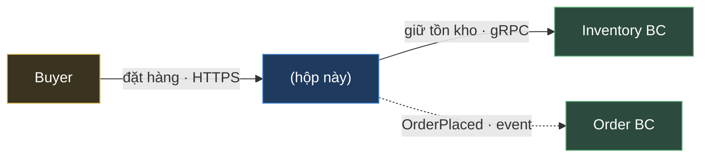
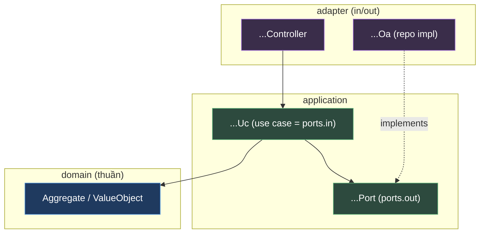
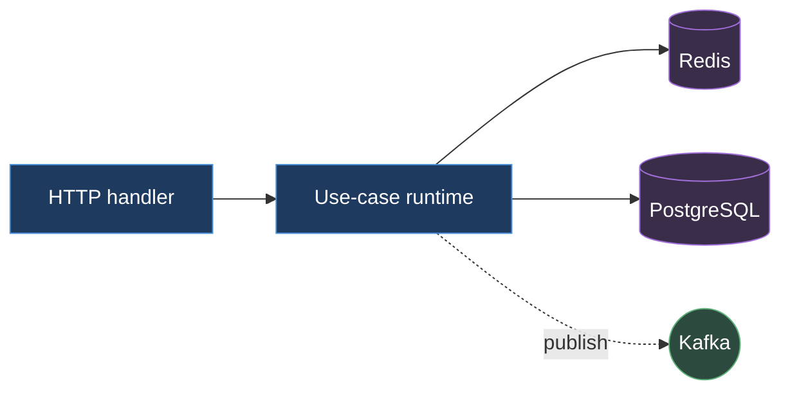
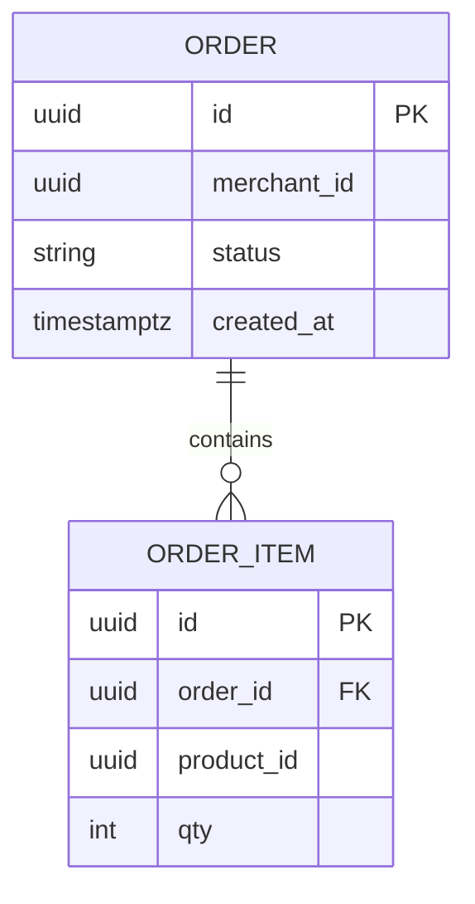
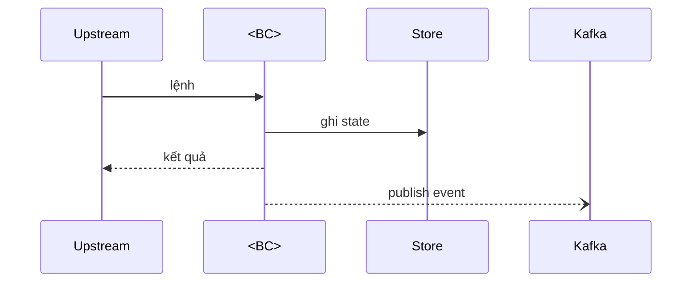
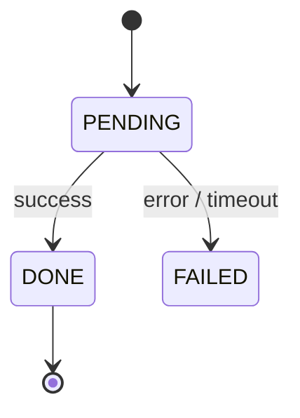

# Tech Spec — <TÊN BC> BC

| | |
| --- | --- |
| Mã | `TS-<BC>-v0.1` |
| Trạng thái | Draft |
| Tuân thủ | `STD-DOC-v1.15` ([QuyTac-AD-va-TechSpec.md](../stds/QuyTac-AD-va-TechSpec.md)) |
| AD cha | [AD-<Hệ-thống>](../design/AD-Marketplace-AiGen.md) — BC này = hộp §6 |
| Cập nhật | YYYY-MM-DD |

> **Cách dùng template này.** Mỗi mục có 4 khối:
> - 🎯 **Mục đích** — thông tin gì thuộc mục này.
> - 📐 **Quy tắc** — các `R-xx`; ❌ là anti-pattern `Gxx` cần tránh.
> - ✍️ **Hướng dẫn** — viết thế nào; *Không thuộc Tech Spec* = cái phải để ở AD/contract.
> - 🧩 **Khung mẫu** — scaffold sẵn để điền; xóa phần `«...»`.
>
> 👉 **Xem bản thật làm mẫu:** [techspec/Checkout.md](../design/techspec/Checkout.md).
> **Nguyên tắc vàng:** Tech Spec mô tả **BÊN TRONG một BC**. Mọi thứ *xuyên BC* (saga, hợp đồng liên-BC, quyết định hệ thống, target NFR toàn hệ) → AD. Phép thử (R-0.1): *"đổi cái này có buộc BC khác phải biết không?"* → Có = AD, Không = Tech Spec.
> **"Delta-only" (R-C1, ❌G10):** §6/§7 chỉ ghi phần **khác** chính sách AD — **đừng chép lại**, hãy trỏ về AD.

**Lịch sử thay đổi**

| Phiên bản | Ngày | Thay đổi |
| --- | --- | --- |
| v0.1 | YYYY-MM-DD | Bản đầu. |

---

# 1. Context & Scope

🎯 **Mục đích:** vai trò BC trong hệ thống; upstream/downstream; in/out scope của BC.
📐 **Quy tắc (R-E3):** nêu rõ BC này là **hộp nào trong AD §6** + láng giềng. *(Optional, R-D13)* **sơ đồ ngữ cảnh BC** — BC ở giữa + láng giềng trực tiếp, nhãn = ý định + protocol, **boundary-level** (không vẽ module nội bộ — đó là §3); dùng **cùng nhãn hợp đồng** với AD §6 + trỏ về. Bỏ qua nếu chỉ 1–2 láng giềng (R-D7).
✍️ **Hướng dẫn:** đây là "mỏ neo ngược" về AD — reviewer phải thấy ngay BC này nối với ai.
*Không thuộc Tech Spec:* bức tranh toàn hệ thống (→ AD §6).

🧩 **Khung mẫu**

```
## 1.1 Vai trò
«1 câu: BC này chịu trách nhiệm gì trong hệ thống».
Là hộp **<BC>** trong [AD §6](../design/AD-Marketplace-AiGen.md).

## 1.2 Upstream / Downstream
- Upstream (gọi đến BC này): «...»
- Downstream (BC này gọi): «...»

## 1.3 In / Out scope
- Trong: «...»  | Ngoài: «...»
```



---

# 2. Requirements (tóm tắt)

🎯 **Mục đích:** FR/NFR chính của BC; trỏ backlog cho bản đầy đủ.
📐 **Quy tắc — phần dễ sai nhất:**
- **R-E6:** mỗi NFR gắn **parent AD-NFR-ID** *hoặc* đánh dấu **"BC-local"** (❌G22 nếu restate không tag).
- **R-E5:** mỗi NFR có **satisfied-by** (tactic → §/ADR), không target trần (❌G21).
- **allocated:** nếu BC nhận ngân sách từ NFR `allocated` của AD → show **breakdown phần của BC** (compose-check R-E6).
- **R-E7:** NFR ưu tiên cao → **quality attribute scenario cấp BC**, **dẫn nguồn** utility tree AD §13.
✍️ **Hướng dẫn:** NFR `inherited` từ AD → **không restate**, chỉ ghi "conform, delta = none". Chỉ liệt kê NFR mà BC thực sự sở hữu/được phân bổ/local.
*Không thuộc Tech Spec:* toàn bộ backlog; target NFR toàn hệ (→ AD §13).

🧩 **Khung mẫu**

```
## 2.x FR chính
- FR1 «...» · FR2 «...»
```

**NFR của BC:**

| NFR | Target | Parent AD-NFR-ID / "BC-local" | Satisfied-by (tactic → neo) |
| --- | --- | --- | --- |
| «độ trễ phần BC» | «< 250 ms» | NFR-PERF-01 (allocated) | «cache (§3.2) · timeout (§6)» |
| «idempotency phiên» | «...» | **BC-local** | «key theo cartId (§4)» |

**Allocation (nếu nhận NFR `allocated`):**

| Bước trong BC | Ngân sách | Ghi chú |
| --- | --- | --- |
| «reserve» | «80 ms» | «...» |
| **Tổng phần BC** | «≤ X ms» | compose ⟹ thỏa parent NFR-PERF-01 |

**Quality attribute scenario (cấp BC, NFR ưu tiên cao):**

| Scenario → NFR | Nguồn · Kích thích | Phản hồi (tactic → neo) | Thước đo |
| --- | --- | --- | --- |
| «QAS-...» → NFR-... (AD §13) | «...» | «...» | «...» |

---

# 3. Design overview

🎯 **Mục đích:** tổng quan thiết kế BC qua **3 view** dưới — **không trộn** (R-D1, một sơ đồ một câu chuyện).

## 3.1 Module view (cấu trúc tĩnh — code chia ra sao)

🎯 **Mục đích:** cấu trúc tĩnh theo **2 trục**.
📐 **Quy tắc:**
- **R-B1 (trục ngang):** lộ rõ **tầng + quy tắc phụ thuộc** của kiểu kiến trúc (vd Hexagonal: `domain ← application ← adapter`; ports & adapters; mũi tên hướng **vào trong**; domain không phụ thuộc gì; adapter implements `ports.out` — DIP). Nêu **ports.in/ports.out** ở mức chữ ký. Đặt tên theo **convention dự án**. ❌G19 nếu module phẳng "một rổ".
- **R-B2 (trục dọc):** **package-by-feature / vertical slice** — mỗi tính năng cắt dọc qua các tầng, cohesion cao, coupling thấp. BC chỉ 1 feature → **ghi rõ "1 slice"** (❌G20 nếu im lặng bỏ trục dọc).
✍️ **Hướng dẫn:** trình bày bằng **sơ đồ tầng** + **ma trận feature × tầng** và/hoặc cây package. Thêm tính năng = thêm slice, không phình slice cũ.

🧩 **Khung mẫu**



**Ma trận feature × tầng (trục dọc — R-B2):**

| Feature (slice) | domain | application | adapter |
| --- | --- | --- | --- |
| «slice A» | «Aggregate X» | «...Uc, ...Cmd» | «...Controller, ...Oa» |
| «slice B» | «...» | «...» | «...» |

> Chữ ký ports: `ports.in`: «`<Result> doX(<Cmd>)`» · `ports.out`: «`save(...)`, `findBy(...)`».

## 3.2 C&C view (cấu trúc runtime)

🎯 **Mục đích:** component, process, hàng đợi, tương tác **lúc chạy**.
📐 **Quy tắc:** đây là *động* (≠ §3.1 tĩnh) — đừng trộn. C4 L3 dynamic.
✍️ **Hướng dẫn:** thể hiện thread/worker, kết nối datastore, consumer/producer Kafka, cache.

🧩 **Khung mẫu**



## 3.3 Deployment view

🎯 **Mục đích:** ánh xạ component BC → node/pod; tài nguyên **delta** so với AD.
📐 **Quy tắc:** chỉ ghi phần **khác** AD §9; IaC literal toàn hệ thống không thuộc đây.
✍️ **Hướng dẫn:** vd "stateless, HPA theo RPS; cần Redis sidecar; egress restricted".

🧩 **Khung mẫu**

| Thuộc tính | Giá trị (delta) |
| --- | --- |
| Stateless? | «có/không» |
| Scaling | «HPA CPU>70% / RPS» |
| Phụ thuộc hạ tầng | «Redis, PostgreSQL» |

---

# 4. Interfaces & data

🎯 **Mục đích:** API/event BC **cung cấp & tiêu thụ**; domain model; **ERD chi tiết**; config; xử lý dữ liệu cá nhân.
📐 **Quy tắc:**
- **ERD/schema cột/DDL** — **CHỖ DUY NHẤT** chứa chi tiết này (AD §10 chỉ nói quyền sở hữu) (R-C1, ❌G3 nếu ở AD).
- Hợp đồng **dùng chung giữa 2 BC** → mô tả ở **AD §16** + contract artifact, **không chôn một phía** (R-C8).
- Field mang sức nặng kiến trúc (correlation-id, tenant-id, idempotency-key, version) (R-C4) ghi rõ.
✍️ **Hướng dẫn:** mô tả đầy đủ API/event *của riêng BC*; trỏ OpenAPI/AsyncAPI cho đặc tả field đầy đủ.

🧩 **Khung mẫu**

```
## 4.1 API cung cấp
### POST /v1/«...»  — «mục đích»
Request: «...»  | Response: «...»  | Lỗi: «mã → ý nghĩa»

## 4.2 Event
- Publish: «EventName» — «khi nào» | Consume: «EventName» — «xử lý gì»
```

**ERD chi tiết (chỉ ở đây):**



```
## 4.x Config & tunables
| Key | Mặc định | Ý nghĩa |
| --- | --- | --- |
| «timeout.ms» | «...» | «...» |

## 4.x Personal data handling
«PII nào BC giữ, mask/anonymize thế nào» (conform AD §10).
```

---

# 5. Key flows

🎯 **Mục đích:** happy path & nhánh lỗi/bù trừ **NỘI BỘ BC** (sequence, state machine).
📐 **Quy tắc:** flow dừng ở **ranh giới BC** ("nhận lệnh → đổi state → publish event"); saga **xuyên BC** để ở AD §8 (❌G8). Sequence mặc định; flow tầm thường → prose (R-D7, ❌G12). Vòng đời aggregate → `stateDiagram-v2`.
✍️ **Hướng dẫn:** mỗi flow gồm happy path + các nhánh lỗi mà BC tự xử.

🧩 **Khung mẫu**



**State machine (vòng đời aggregate):**



---

# 6. Operations & resilience

🎯 **Mục đích:** backup/recovery, CI/CD, degraded mode — phần **delta** của BC.
📐 **Quy tắc (❌G10):** chỉ ghi cái **khác** chính sách hệ thống ở AD — trỏ về AD, đừng chép.
✍️ **Hướng dẫn:** vd "degraded: nếu Catalog down → trả 503 fail-safe"; "DR tier của BC = Tier-2 (target ở AD §13)".

🧩 **Khung mẫu**

| Khía cạnh | Delta của BC | Trỏ AD |
| --- | --- | --- |
| Degraded mode | «...» | AD §8 |
| DR tier | «Tier-2 (target ở AD §13)» | AD §13 |
| CI/CD đặc thù | «...» | — |

---

# 7. Decisions & cross-cutting deltas (ADR nội bộ BC)

🎯 **Mục đích:** ADR **riêng của BC**; trust boundary & threat seed cục bộ.
📐 **Quy tắc (R-F3):** quyết định nội bộ BC → ADR của BC (thư mục `…/techspec/<bc>/adr/` *hoặc* inline ở đây nếu ít/ngắn — **nêu rõ chọn cách nào**). Quyết định xuyên BC → AD §14 (❌ không để ở đây). Mỗi ADR có **Decision Drivers (NFR)** (R-F2). NFR `inherited` từ AD → ghi "delta = none".
✍️ **Hướng dẫn:** dùng template ADR (MADR rút gọn) như AD; trỏ về AD cho mọi thứ là chính sách hệ thống.

🧩 **Khung mẫu**

| ADR (BC) | Quyết định | Trạng thái | Drivers (NFR) |
| --- | --- | --- | --- |
| «ADR-<BC>-01» | «...» | Proposed | «NFR-...» |

> Trust boundary/cross-cutting: conform AD §11/§12, delta = «...».

---

# 8. Test strategy

🎯 **Mục đích:** acceptance criteria mẫu; chiến lược test BC.
✍️ **Hướng dẫn:** map test → FR/NFR ở §2. Nêu mức coverage tối thiểu (value-object, factory, mỗi use-case, repo, mapping, controller).

🧩 **Khung mẫu**

| Loại test | Phạm vi | Ví dụ acceptance |
| --- | --- | --- |
| Unit (domain) | value-object, factory + event | «...» |
| Use-case | persist + publish/lookup + nhánh lỗi | «...» |
| Adapter/repo | save/find/paging | «...» |
| Controller | status + body + error mapping | «...» |

---

# 9. Open questions

🎯 **Mục đích:** câu hỏi/`TBD` chưa chốt + **người chịu trách nhiệm**.
📐 **Quy tắc (R-C5):** mỗi `TBD` có owner + issue/ADR theo dõi — không bịa cho "đủ".

🧩 **Khung mẫu**

| # | Câu hỏi / TBD | Owner | Theo dõi (issue/ADR) |
| --- | --- | --- | --- |
| Q1 | «...» | «...» | «...» |

---

## PHỤ LỤC — Checklist Definition-of-Done cho Tech Spec (`STD-DOC` H.2)

| # | Hạng mục | ✓ |
| --- | --- | --- |
| 1 | §1 nêu rõ BC là hộp nào trong AD + upstream/downstream (R-E3); optional sơ đồ ngữ cảnh nếu nhiều láng giềng (R-D13) | ☐ |
| 2 | Đủ 9 mục (hoặc "N/A — lý do") | ☐ |
| 3 | §3 đủ 3 view (Module/C&C/Deployment) không trộn; Module lộ **2 trục** tầng+ports (R-B1) & feature slice (R-B2) | ☐ |
| 4 | §4 có ERD chi tiết + interfaces của BC; không lặp bức tranh hệ thống | ☐ |
| 5 | §5 flow dừng ở ranh giới BC; saga xuyên BC ở AD §8 | ☐ |
| 6 | §6/§7 chỉ ghi **delta** so với AD, có trỏ về AD | ☐ |
| 7 | Sơ đồ Mermaid, đúng grain, có legend (PHẦN D) | ☐ |
| 8 | ADR nội bộ BC ở §7; quyết định xuyên BC ở AD (R-F3) | ☐ |
| 9 | §9 Open questions có owner cho mỗi `TBD` | ☐ |
| 10 | §2 mỗi NFR tag parent AD-NFR-ID hoặc "BC-local" (R-E6) + satisfied-by (R-E5); allocated nêu phần ngân sách | ☐ |
| 11 | §2 có quality attribute scenario cấp BC cho NFR ưu tiên cao, dẫn nguồn AD §13 (R-E7) | ☐ |
